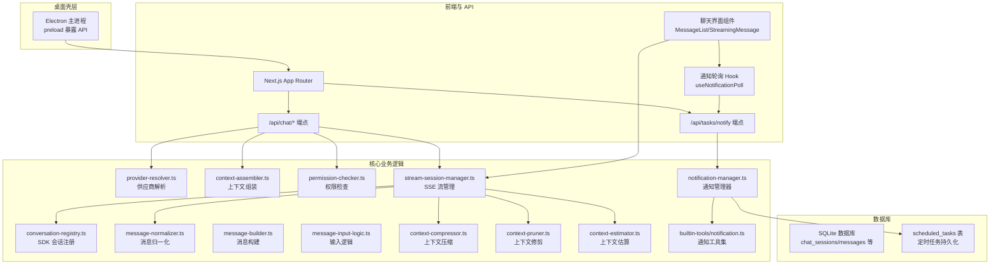
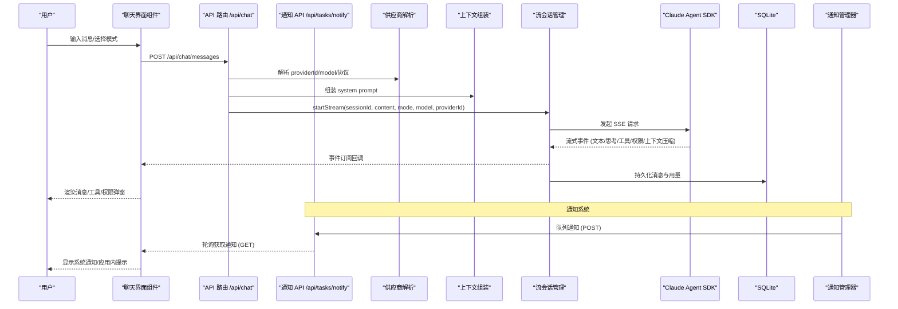
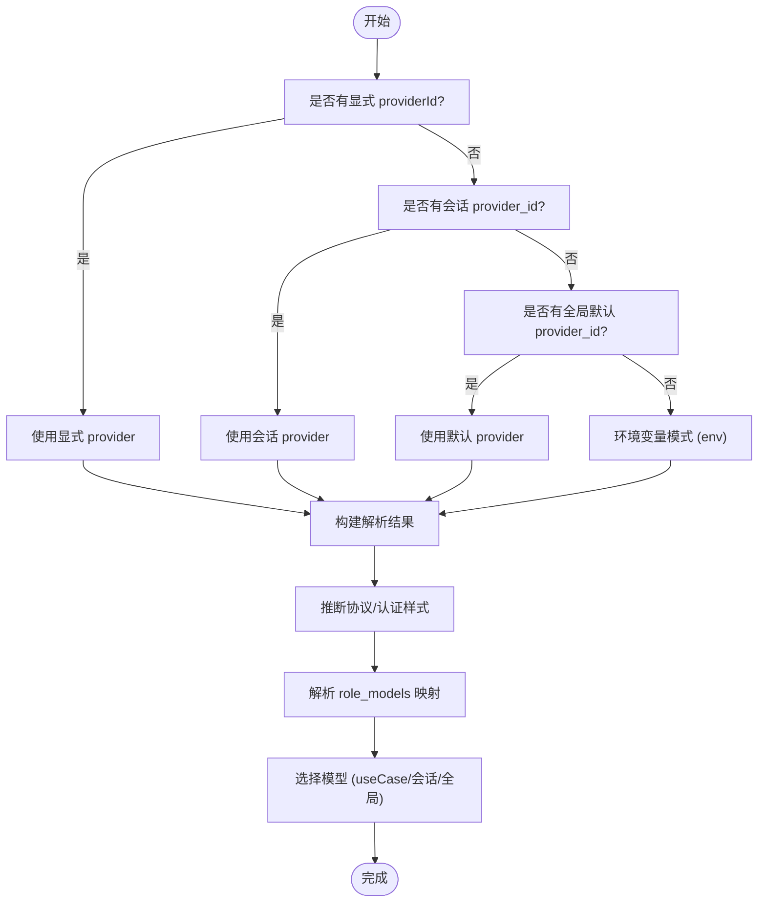
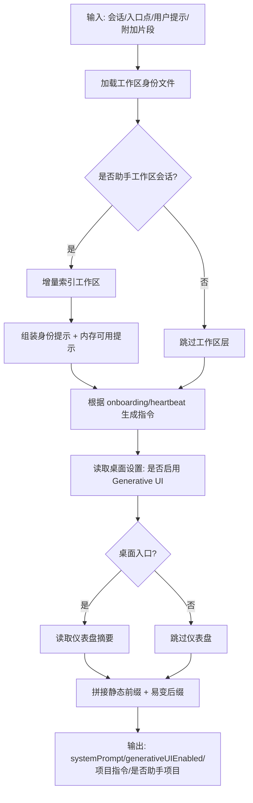
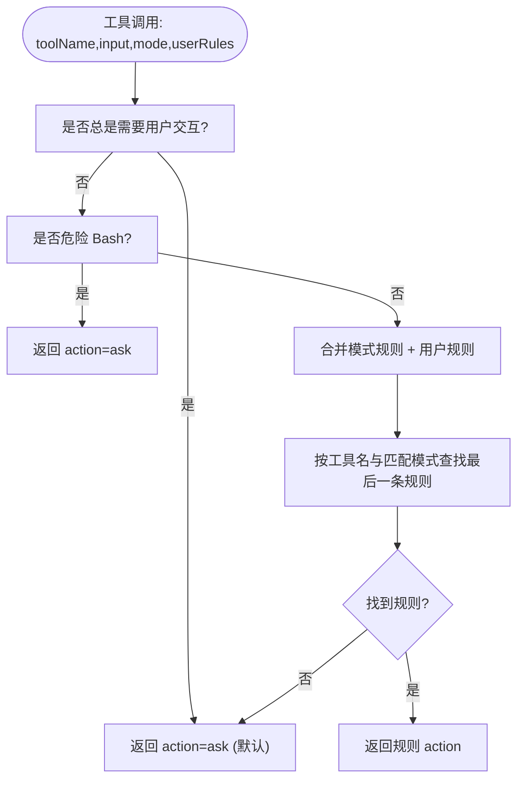
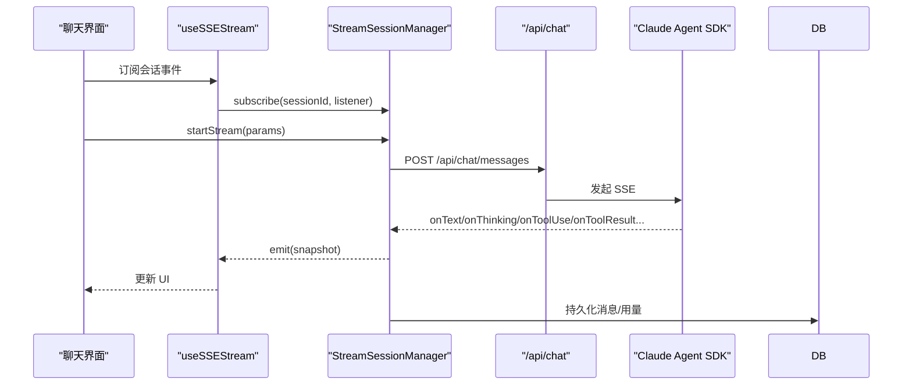
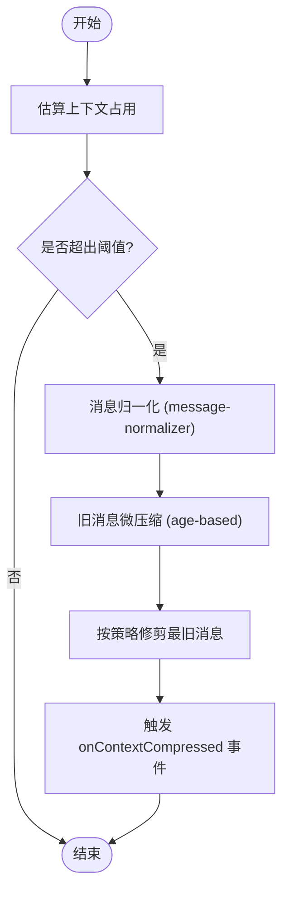
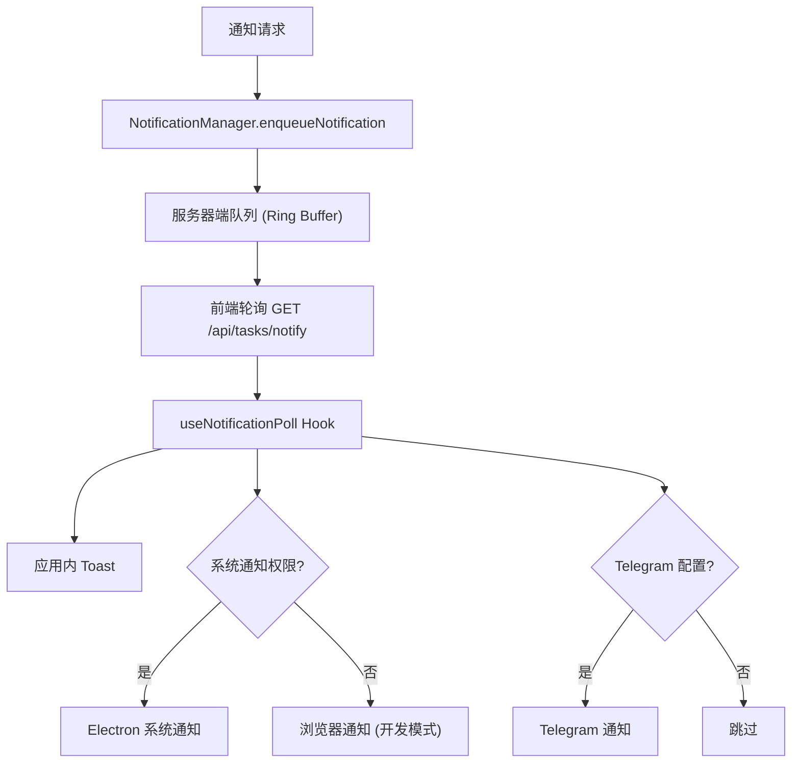
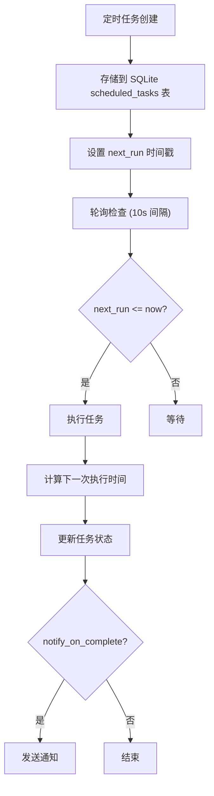
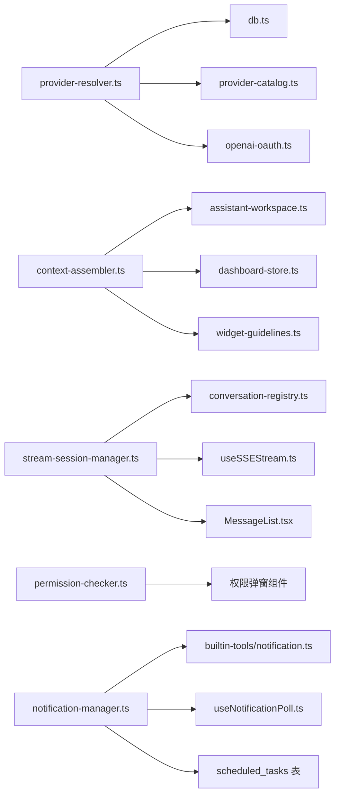

# 核心功能

<cite>
**本文引用的文件**
- [ARCHITECTURE.md](file://ARCHITECTURE.md)
- [README.md](file://README.md)
- [context-assembler.ts](file://src/lib/context-assembler.ts)
- [message-normalizer.ts](file://src/lib/message-normalizer.ts)
- [provider-resolver.ts](file://src/lib/provider-resolver.ts)
- [permission-checker.ts](file://src/lib/permission-checker.ts)
- [stream-session-manager.ts](file://src/lib/stream-session-manager.ts)
- [conversation-registry.ts](file://src/lib/conversation-registry.ts)
- [claude-client.ts](file://src/lib/claude-client.ts)
- [message-builder.ts](file://src/lib/message-builder.ts)
- [message-input-logic.ts](file://src/lib/message-input-logic.ts)
- [resolve-session-model.ts](file://src/lib/resolve-session-model.ts)
- [model-context.ts](file://src/lib/model-context.ts)
- [context-compressor.ts](file://src/lib/context-compressor.ts)
- [context-pruner.ts](file://src/lib/context-pruner.ts)
- [context-estimator.ts](file://src/lib/context-estimator.ts)
- [notification-manager.ts](file://src/lib/notification-manager.ts)
- [notification.ts](file://src/lib/builtin-tools/notification.ts)
- [useNotificationPoll.ts](file://src/hooks/useNotificationPoll.ts)
- [route.ts](file://src/app/api/tasks/notify/route.ts)
- [heartbeat-notify.test.ts](file://src/__tests__/unit/heartbeat-notify.test.ts)
- [scheduled-tasks-notifications.md](file://docs/future/scheduled-tasks-and-notifications.md)
- [scheduled-tasks-notifications.md](file://docs/exec-plans/active/scheduled-tasks-notifications.md)
</cite>

## 更新摘要
**变更内容**
- 新增重构通知系统章节，介绍项目的透明沟通机制
- 更新项目结构图，加入通知系统组件
- 新增通知工具与定时任务系统的技术实现说明
- 增强架构总览，体现通知系统的集成方式
- 添加通知系统的最佳实践和故障排查指南

## 目录
1. [简介](#简介)
2. [项目结构](#项目结构)
3. [核心组件](#核心组件)
4. [架构总览](#架构总览)
5. [详细组件分析](#详细组件分析)
6. [重构通知系统](#重构通知系统)
7. [依赖分析](#依赖分析)
8. [性能考虑](#性能考虑)
9. [故障排查指南](#故障排查指南)
10. [结论](#结论)
11. [附录](#附录)

## 简介
本文件面向 CodePilot 的核心功能，聚焦聊天对话系统、多模型 AI 供应商集成、会话管理、权限控制以及交互模式（Code/Plan/Ask）。文档解释上下文组装、消息处理、流式响应机制，并提供具体的功能模块关系与集成方式说明，辅以最佳实践与性能优化建议。**新增**重构通知系统体现了项目的透明沟通机制，通过多渠道通知和定时任务增强用户体验。

## 项目结构
CodePilot 采用 Electron + Next.js App Router 的桌面应用架构，核心业务逻辑集中在 src/lib 下，前端聊天界面与 API 路由位于 src/app/api 与 src/components/chat。数据库采用 better-sqlite3，会话与消息持久化在 SQLite 中；AI 供应商通过 Claude Agent SDK 与多 SDK（@ai-sdk/anthropic、@ai-sdk/google、@ai-sdk/openai 等）进行统一接入。**新增**通知系统通过 NotificationManager 提供多渠道通知分发，支持系统通知、应用内提示和 Telegram 通知。

**图表来源**
- [ARCHITECTURE.md](file://ARCHITECTURE.md)
- [provider-resolver.ts](file://src/lib/provider-resolver.ts)
- [context-assembler.ts](file://src/lib/context-assembler.ts)
- [permission-checker.ts](file://src/lib/permission-checker.ts)
- [stream-session-manager.ts](file://src/lib/stream-session-manager.ts)
- [conversation-registry.ts](file://src/lib/conversation-registry.ts)
- [message-normalizer.ts](file://src/lib/message-normalizer.ts)
- [message-builder.ts](file://src/lib/message-builder.ts)
- [message-input-logic.ts](file://src/lib/message-input-logic.ts)
- [context-compressor.ts](file://src/lib/context-compressor.ts)
- [context-pruner.ts](file://src/lib/context-pruner.ts)
- [context-estimator.ts](file://src/lib/context-estimator.ts)
- [notification-manager.ts](file://src/lib/notification-manager.ts)
- [notification.ts](file://src/lib/builtin-tools/notification.ts)
- [useNotificationPoll.ts](file://src/hooks/useNotificationPoll.ts)

**章节来源**
- [ARCHITECTURE.md](file://ARCHITECTURE.md)
- [README.md](file://README.md)

## 核心组件
- 供应商解析与配置：provider-resolver.ts 统一解析 providerId、model、协议与认证方式，支持环境变量模式与数据库持久化模式，并注入 Claude Code SDK/Subprocess 环境变量。
- 上下文组装：context-assembler.ts 将工作区、助手项目指令、仪表盘摘要、易变提示等分层拼装为最终 system prompt，确保前后缓存命中与一致性。
- 权限控制：permission-checker.ts 实现三档模式（explore/normal/trust）与规则引擎，对 Bash、文件读写、编辑等操作进行细粒度控制。
- 流式会话管理：stream-session-manager.ts 管理 SSE 流生命周期、事件分发、空闲超时、GC、权限请求、工具调用与输出累积、令牌用量统计等。
- 会话注册：conversation-registry.ts 维护活跃 SDK 会话，避免 HMR 导致状态丢失。
- 消息处理：message-normalizer.ts 归一化消息内容，支持工具块摘要与旧消息微压缩；message-builder.ts 构建消息结构；message-input-logic.ts 处理输入与命令。
- 上下文压缩与修剪：context-compressor.ts、context-pruner.ts、context-estimator.ts 提供上下文估算、压缩与修剪策略，保障长对话与多模态输入下的稳定性。
- 模型选择：resolve-session-model.ts 与 model-context.ts 协助在会话内切换模型与上下文窗口。
- **新增**通知系统：notification-manager.ts 提供统一的多渠道通知分发，支持低/正常/紧急三级优先级，通过队列机制实现前端轮询获取通知。

**章节来源**
- [provider-resolver.ts](file://src/lib/provider-resolver.ts)
- [context-assembler.ts](file://src/lib/context-assembler.ts)
- [permission-checker.ts](file://src/lib/permission-checker.ts)
- [stream-session-manager.ts](file://src/lib/stream-session-manager.ts)
- [conversation-registry.ts](file://src/lib/conversation-registry.ts)
- [message-normalizer.ts](file://src/lib/message-normalizer.ts)
- [message-builder.ts](file://src/lib/message-builder.ts)
- [message-input-logic.ts](file://src/lib/message-input-logic.ts)
- [context-compressor.ts](file://src/lib/context-compressor.ts)
- [context-pruner.ts](file://src/lib/context-pruner.ts)
- [context-estimator.ts](file://src/lib/context-estimator.ts)
- [resolve-session-model.ts](file://src/lib/resolve-session-model.ts)
- [model-context.ts](file://src/lib/model-context.ts)
- [notification-manager.ts](file://src/lib/notification-manager.ts)

## 架构总览
下图展示了从用户输入到消息渲染与持久化的完整链路，包括 SSE 流、SDK 会话注册、权限请求与上下文压缩等关键节点。**更新**通知系统通过 NotificationManager 实现多渠道通知分发，支持系统通知、应用内提示和 Telegram 通知。

**图表来源**
- [stream-session-manager.ts](file://src/lib/stream-session-manager.ts)
- [provider-resolver.ts](file://src/lib/provider-resolver.ts)
- [context-assembler.ts](file://src/lib/context-assembler.ts)
- [conversation-registry.ts](file://src/lib/conversation-registry.ts)
- [claude-client.ts](file://src/lib/claude-client.ts)
- [stream-session-manager.ts](file://src/app/api/chat/messages/route.ts)
- [notification-manager.ts](file://src/lib/notification-manager.ts)
- [route.ts](file://src/app/api/tasks/notify/route.ts)

**章节来源**
- [ARCHITECTURE.md](file://ARCHITECTURE.md)

## 详细组件分析

### 供应商解析与模型选择
- 解析优先级：显式请求 providerId > 会话 provider_id > 全局默认 provider_id > 环境变量模式（env）。
- 协议与认证：支持 anthropic、openrouter、openai-compatible、bedrock、vertex、google 等协议，自动推断 authStyle（api_key/auth_token），并注入 Claude Code SDK/Subprocess 环境变量。
- 模型映射：支持 role_models_json 与 catalog 模型映射，兼容第三方代理与短别名（sonnet/opus/haiku）到上游模型 ID。
- 特殊路径：OpenAI OAuth（Codex API）虚拟 provider，使用 Bearer Token 与 /responses API。

**图表来源**
- [provider-resolver.ts](file://src/lib/provider-resolver.ts)

**章节来源**
- [provider-resolver.ts](file://src/lib/provider-resolver.ts)

### 上下文组装与提示分层
- 分层策略：静态前缀（编译时常量、会话 system_prompt、工作区身份文件）+ 易变后缀（内存提示、助手项目指令、仪表盘摘要、请求附加片段）。
- 助手工作区：当会话工作目录等于工作区根时，增量索引工作区，注入 soul/user/claude.md 与近期 daily memory 提示，并根据 onboarding/heartbeat 状态动态生成任务指令。
- 桌面/桥接差异：桌面入口注入 Generative UI 指令与仪表盘摘要，桥接入口不注入。

**图表来源**
- [context-assembler.ts](file://src/lib/context-assembler.ts)

**章节来源**
- [context-assembler.ts](file://src/lib/context-assembler.ts)

### 权限控制与交互模式
- 三档模式：
  - explore：仅允许只读（Read/Glob/Grep），禁止 Write/Edit/Bash。
  - normal：允许读写与编辑，Bash 默认需确认；常见安全命令自动放行，敏感文件仍需确认。
  - trust：完全放行。
- 规则引擎：基于 findLast 语义的规则匹配，支持通配符模式；危险 Bash 模式（如 rm -rf、sudo、git reset --hard 等）一律要求确认。
- 交互工具：AskUserQuestion、ExitPlanMode 无论模式如何均需用户交互。

**图表来源**
- [permission-checker.ts](file://src/lib/permission-checker.ts)

**章节来源**
- [permission-checker.ts](file://src/lib/permission-checker.ts)

### 流式会话管理与消息处理
- 生命周期：startStream 创建/复用会话，runStream 发起 /api/chat 请求，消费 SSE 事件，累积文本/思考/工具调用与结果，节流文本更新，空闲超时检测，GC 清理。
- 事件类型：文本增量、思考增量、工具使用、工具结果、工具输出、权限请求、上下文压缩、状态文本、令牌用量、速率限制、上下文用量、模式变更、任务更新、重放点、保活、错误。
- 会话注册：conversation-registry.ts 以全局 Map 维护 Query 对象，避免热重载丢失。
- 消息归一化：message-normalizer.ts 去除附件元数据、抽取助手 JSON 中的思考与工具摘要，旧消息按年龄进行 head+tail 微压缩。
- 输入逻辑：message-input-logic.ts 处理斜杠命令、显示覆盖、自动触发等；resolve-session-model.ts 与 model-context.ts 协助模型与上下文窗口选择。

**图表来源**
- [stream-session-manager.ts](file://src/lib/stream-session-manager.ts)
- [stream-session-manager.ts](file://src/hooks/useSSEStream.ts)
- [stream-session-manager.ts](file://src/app/api/chat/messages/route.ts)
- [conversation-registry.ts](file://src/lib/conversation-registry.ts)

**章节来源**
- [stream-session-manager.ts](file://src/lib/stream-session-manager.ts)
- [conversation-registry.ts](file://src/lib/conversation-registry.ts)
- [message-normalizer.ts](file://src/lib/message-normalizer.ts)
- [message-input-logic.ts](file://src/lib/message-input-logic.ts)
- [resolve-session-model.ts](file://src/lib/resolve-session-model.ts)
- [model-context.ts](file://src/lib/model-context.ts)

### 上下文压缩与修剪
- 估算：context-estimator.ts 基于 token 估算上下文占用，指导何时触发压缩。
- 压缩：context-compressor.ts 对历史消息进行归一化与微压缩，保留关键思考与工具摘要。
- 修剪：context-pruner.ts 基于阈值与年龄策略修剪最旧消息，维持有效上下文长度。
- 与流会话联动：在 SSE 流中收到 onContextCompressed/onContextCompressionRetry 事件，向 UI 展示压缩状态并短暂提示。

**图表来源**
- [context-estimator.ts](file://src/lib/context-estimator.ts)
- [message-normalizer.ts](file://src/lib/message-normalizer.ts)
- [context-compressor.ts](file://src/lib/context-compressor.ts)
- [context-pruner.ts](file://src/lib/context-pruner.ts)
- [stream-session-manager.ts](file://src/lib/stream-session-manager.ts)

**章节来源**
- [context-estimator.ts](file://src/lib/context-estimator.ts)
- [message-normalizer.ts](file://src/lib/message-normalizer.ts)
- [context-compressor.ts](file://src/lib/context-compressor.ts)
- [context-pruner.ts](file://src/lib/context-pruner.ts)
- [stream-session-manager.ts](file://src/lib/stream-session-manager.ts)

### 交互模式（Code/Plan/Ask）
- 模式切换：通过 /api/chat/mode 与 /api/chat/sessions/[id] 的 PATCH 更新会话模式与 SDK 会话标识。
- 模式变更事件：SSE onModeChanged 通知 UI 切换（例如 plan → code）。
- 自动触发：autoTrigger 场景（心跳、onboarding）由上下文组装注入特殊指令，避免用户干预。

**章节来源**
- [stream-session-manager.ts](file://src/app/api/chat/mode/route.ts)
- [stream-session-manager.ts](file://src/app/api/chat/sessions/[id]/route.ts)
- [context-assembler.ts](file://src/lib/context-assembler.ts)

## 重构通知系统

**新增** CodePilot 正在进行大规模的产品重构，为下一轮正式发布整理底层能力。重构通知系统体现了项目的透明沟通机制，通过多渠道通知和定时任务增强用户体验。

### 通知系统架构
通知系统采用统一的多渠道分发架构，支持三种优先级和多种通知渠道：

- **低优先级 (low)**：仅应用内提示（Toast），非侵扰式
- **正常优先级 (normal)**：应用内提示 + 系统通知
- **紧急优先级 (urgent)**：应用内提示 + 系统通知 + Telegram 通知

**图表来源**
- [notification-manager.ts](file://src/lib/notification-manager.ts)
- [useNotificationPoll.ts](file://src/hooks/useNotificationPoll.ts)
- [route.ts](file://src/app/api/tasks/notify/route.ts)

### 通知工具集
通知系统通过 MCP 工具集提供全局可用的通知能力：

- **codepilot_notify**：立即发送通知给用户
- **codepilot_schedule_task**：创建定时任务（支持 cron 表达式、固定间隔、一次性定时）
- **codepilot_list_tasks**：查看已有的定时任务
- **codepilot_cancel_task**：取消定时任务

这些工具可以在任何上下文中使用，不限于助理模式。

**章节来源**
- [notification.ts](file://src/lib/builtin-tools/notification.ts)
- [notification-manager.ts](file://src/lib/notification-manager.ts)
- [scheduled-tasks-notifications.md](file://docs/future/scheduled-tasks-and-notifications.md)

### 定时任务系统
定时任务系统支持三种调度类型：

- **cron**：精确时间点执行（支持标准 cron 表达式）
- **interval**：固定间隔执行（如每 30 分钟）
- **once**：一次性定时（指定具体时间）

**图表来源**
- [scheduled-tasks-notifications.md](file://docs/exec-plans/active/scheduled-tasks-notifications.md)

**章节来源**
- [scheduled-tasks-notifications.md](file://docs/exec-plans/active/scheduled-tasks-notifications.md)
- [scheduled-tasks-notifications.md](file://docs/future/scheduled-tasks-and-notifications.md)

### 通知渠道集成
通知系统支持多渠道投递，根据优先级和用户配置决定：

| 优先级 | 默认行为 |
|--------|---------|
| `low` | 应用内 Toast（不弹系统通知） |
| `normal` | Electron 系统通知（macOS Notification Center / Windows Notification） |
| `urgent` | 系统通知 + 声音 + Telegram 通知 + 浮窗弹出 |

点击通知支持多种行为：
- 跳转到相关会话（`open_session`）
- 拉起浮窗显示摘要（`open_floating`）
- 用户可配置默认行为

**章节来源**
- [notification-manager.ts](file://src/lib/notification-manager.ts)
- [useNotificationPoll.ts](file://src/hooks/useNotificationPoll.ts)
- [scheduled-tasks-notifications.md](file://docs/future/scheduled-tasks-and-notifications.md)

## 依赖分析
- 组件耦合：
  - provider-resolver.ts 与 db.ts、provider-catalog.ts、openai-oauth 等协作，提供统一的供应商解析与环境注入。
  - context-assembler.ts 与 assistant-workspace.ts、dashboard-store.ts、widget-guidelines.ts 等协作，生成系统提示。
  - stream-session-manager.ts 与 conversation-registry.ts、useSSEStream.ts、MessageList.tsx 等协作，驱动流式渲染与持久化。
  - permission-checker.ts 与 UI 的权限弹窗组件协作，实现交互式权限审批。
  - **新增** notification-manager.ts 与 notification.ts、useNotificationPoll.ts 协作，提供统一的通知分发机制。
- 外部依赖：
  - Claude Agent SDK、@ai-sdk/*、better-sqlite3、React Hooks（useSSEStream、useStreamSubscription、useNotificationPoll）等。

**图表来源**
- [provider-resolver.ts](file://src/lib/provider-resolver.ts)
- [context-assembler.ts](file://src/lib/context-assembler.ts)
- [stream-session-manager.ts](file://src/lib/stream-session-manager.ts)
- [conversation-registry.ts](file://src/lib/conversation-registry.ts)
- [notification-manager.ts](file://src/lib/notification-manager.ts)
- [notification.ts](file://src/lib/builtin-tools/notification.ts)
- [useNotificationPoll.ts](file://src/hooks/useNotificationPoll.ts)

**章节来源**
- [provider-resolver.ts](file://src/lib/provider-resolver.ts)
- [context-assembler.ts](file://src/lib/context-assembler.ts)
- [stream-session-manager.ts](file://src/lib/stream-session-manager.ts)
- [conversation-registry.ts](file://src/lib/conversation-registry.ts)
- [notification-manager.ts](file://src/lib/notification-manager.ts)

## 性能考虑
- 流式节流：文本增量采用 100ms 节流，避免频繁重渲染；思考增量即时更新，保证交互体验。
- 空闲超时：330 秒空闲超时，及时中断无响应流，释放资源；工具超时自动重试并提示用户。
- 上下文压缩：基于年龄与长度的微压缩策略，减少 token 占用；压缩状态短暂提示，避免 UI 阻塞。
- 会话注册：全局 Map 保存 SDK 会话，避免 HMR 导致的重复创建与状态丢失。
- 供应商解析：优先使用数据库配置，避免无效 provider 查询；环境变量模式下最小化注入与清理。
- **新增**通知系统优化：前端 5 秒轮询间隔，服务器端环形缓冲区限制 50 条通知，避免内存泄漏。

## 故障排查指南
- 无供应商配置：当返回 NEEDS_PROVIDER_SETUP 时，前端会打开设置中心；检查 provider 是否激活、API Key 是否正确、endpoint 是否可达。
- 权限被拒：查看 permission-checker 的规则匹配与危险命令检测；必要时调整用户规则或提升模式。
- 流中断：空闲超时会显示"无响应"错误；工具超时会自动重试；手动停止会保留部分文本并标注"生成已停止"。
- 上下文压缩：若出现压缩提示，可检查 context-estimator 的阈值与压缩策略；必要时缩短历史或降低多模态附件大小。
- 会话丢失：确认 conversation-registry 的全局 Map 是否存在对应 sessionId；HMR 后应自动恢复。
- **新增**通知系统问题：
  - 通知不显示：检查系统通知权限设置，确认 Electron 系统通知是否可用
  - Telegram 通知失败：检查 Telegram 配置，确认机器人 token 是否正确
  - 通知堆积：检查前端轮询是否正常工作，确认 /api/tasks/notify 接口返回状态

**章节来源**
- [stream-session-manager.ts](file://src/lib/stream-session-manager.ts)
- [permission-checker.ts](file://src/lib/permission-checker.ts)
- [context-estimator.ts](file://src/lib/context-estimator.ts)
- [useNotificationPoll.ts](file://src/hooks/useNotificationPoll.ts)
- [route.ts](file://src/app/api/tasks/notify/route.ts)

## 结论
CodePilot 的核心功能围绕"统一供应商解析、一致上下文组装、细粒度权限控制、稳定流式会话管理"展开。**更新**重构通知系统体现了项目的透明沟通机制，通过多渠道通知和定时任务增强用户体验。通过模块化设计与清晰的数据流，系统在多模型、多入口（桌面/桥接）与复杂交互（Code/Plan/Ask）场景下保持一致性与可维护性。结合上下文压缩与流式节流等优化策略，可在长对话与多模态输入下维持良好性能与用户体验。**新增**的通知系统为项目提供了完整的透明沟通机制，体现了开发团队对用户体验和项目透明度的重视。

## 附录
- 使用场景示例（路径参考）：
  - 供应商配置与切换：[provider-resolver.ts](file://src/lib/provider-resolver.ts)
  - 上下文组装与工作区注入：[context-assembler.ts](file://src/lib/context-assembler.ts)
  - 权限规则与交互：[permission-checker.ts](file://src/lib/permission-checker.ts)
  - 流式消息渲染与订阅：[stream-session-manager.ts](file://src/lib/stream-session-manager.ts)、[useSSEStream.ts](file://src/hooks/useSSEStream.ts)、[MessageList.tsx](file://src/components/chat/MessageList.tsx)
  - 断点重放与会话控制：[stream-session-manager.ts](file://src/app/api/chat/rewind/route.ts)、[stream-session-manager.ts](file://src/app/api/chat/sessions/[id]/route.ts)
  - 模型与上下文窗口：[resolve-session-model.ts](file://src/lib/resolve-session-model.ts)、[model-context.ts](file://src/lib/model-context.ts)
  - **新增**通知系统：[notification-manager.ts](file://src/lib/notification-manager.ts)、[notification.ts](file://src/lib/builtin-tools/notification.ts)、[useNotificationPoll.ts](file://src/hooks/useNotificationPoll.ts)
  - **新增**定时任务：[scheduled-tasks-notifications.md](file://docs/future/scheduled-tasks-and-notifications.md)、[scheduled-tasks-notifications.md](file://docs/exec-plans/active/scheduled-tasks-notifications.md)