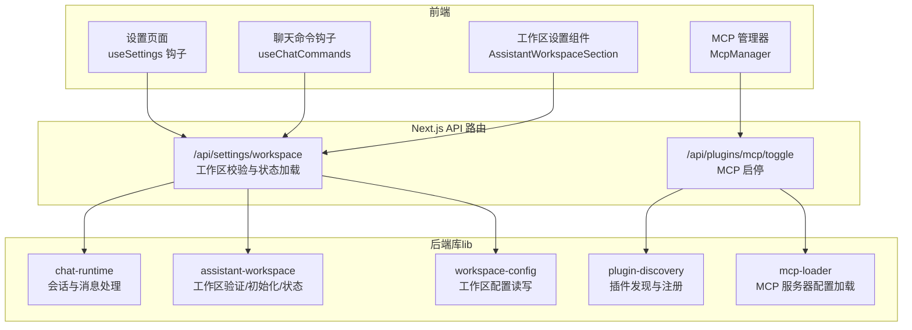
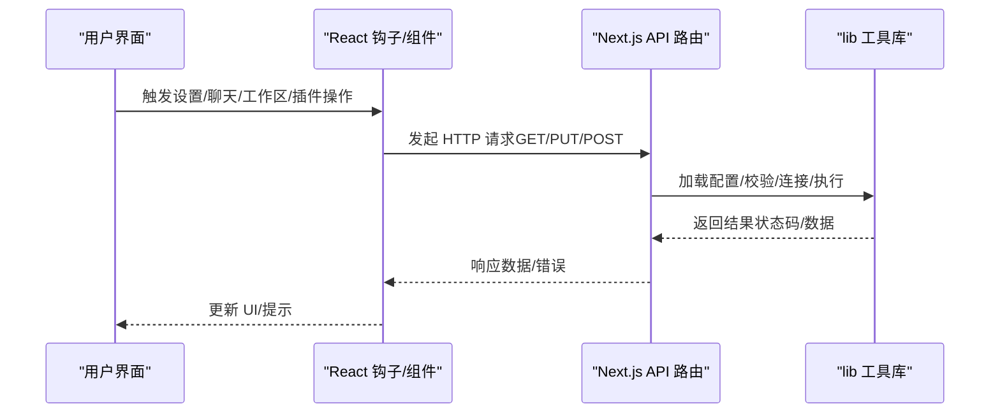
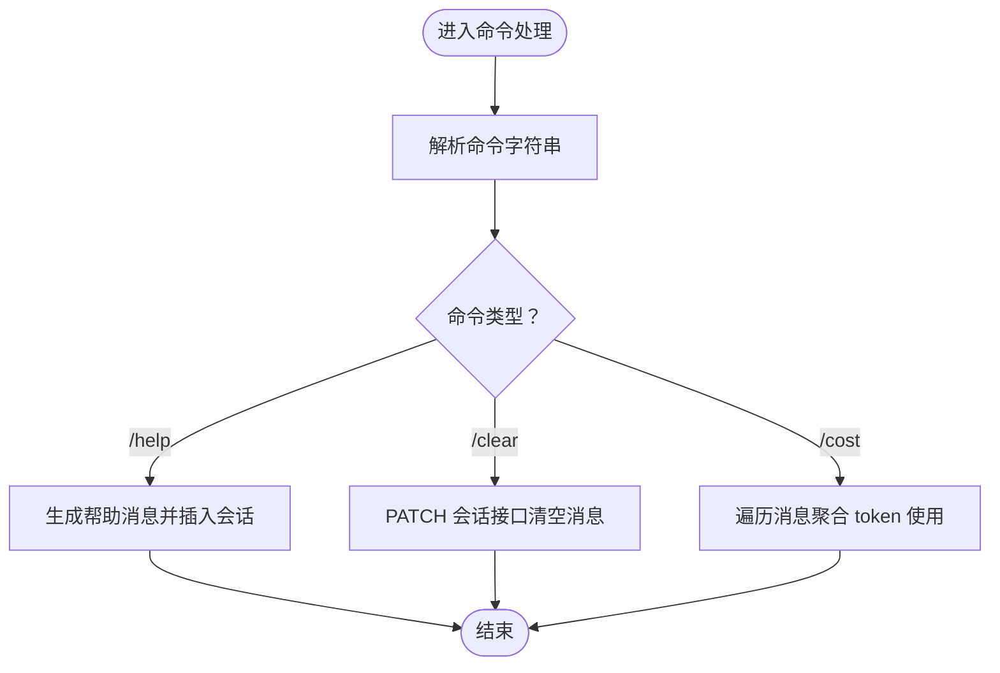
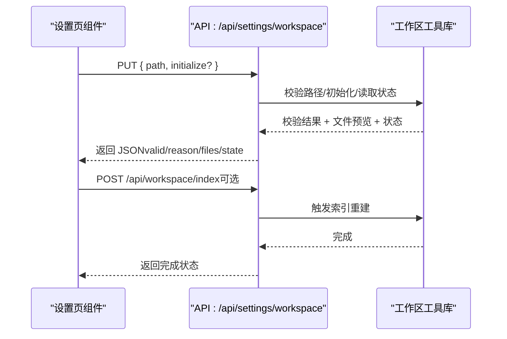
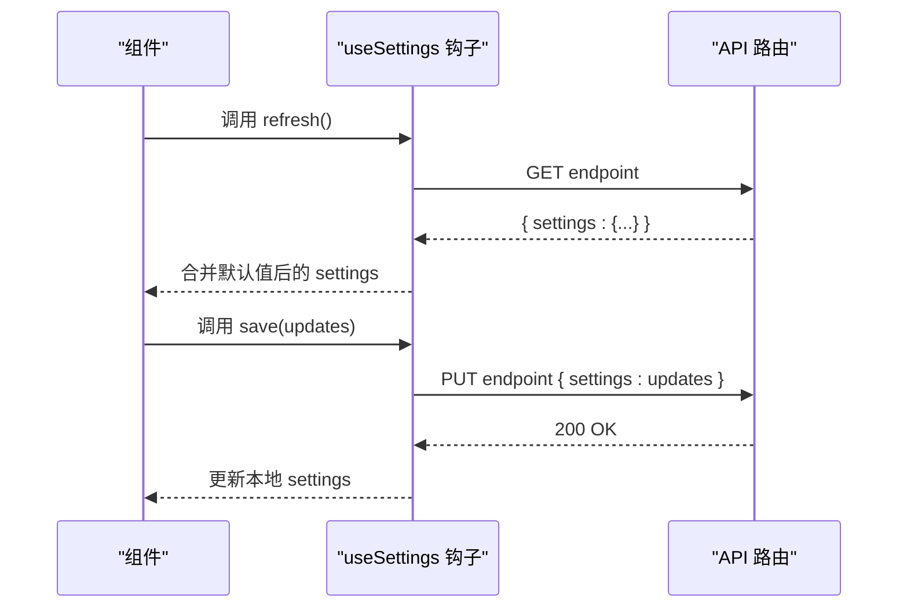
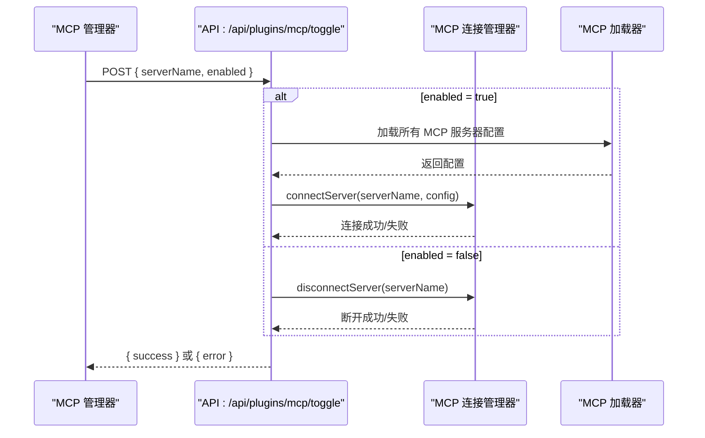
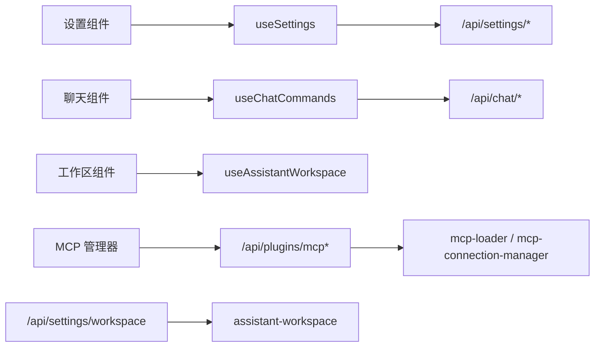

# 核心功能

<cite>
**本文引用的文件**
- [useChatCommands.ts](file://src/hooks/useChatCommands.ts)
- [useSettings.ts](file://src/hooks/useSettings.ts)
- [useAssistantWorkspace.ts](file://src/hooks/useAssistantWorkspace.ts)
- [assistant-workspace.ts](file://src/lib/assistant-workspace.ts)
- [route.ts（工作区校验）](file://src/app/api/settings/workspace/route.ts)
- [AssistantWorkspaceSection.tsx](file://src/components/settings/AssistantWorkspaceSection.tsx)
- [McpManager.tsx](file://src/components/plugins/McpManager.tsx)
- [route.ts（MCP 切换）](file://src/app/api/plugins/mcp/toggle/route.ts)
- [page.tsx（MCP 重定向）](file://src/app/plugins/mcp/page.tsx)
- [chat-runtime.ts](file://src/lib/chat-runtime.ts)
- [workspace-config.ts](file://src/lib/workspace-config.ts)
- [plugin-discovery.ts](file://src/lib/plugin-discovery.ts)
- [mcp-loader.ts](file://src/lib/mcp-loader.ts)
</cite>

## 目录
1. [引言](#引言)
2. [项目结构](#项目结构)
3. [核心组件](#核心组件)
4. [架构总览](#架构总览)
5. [详细组件分析](#详细组件分析)
6. [依赖分析](#依赖分析)
7. [性能考虑](#性能考虑)
8. [故障排查指南](#故障排查指南)
9. [结论](#结论)
10. [附录](#附录)

## 引言
本文件面向 CodePilot 的核心功能模块，系统梳理聊天对话系统、文件管理系统、设置管理与插件系统的设计原理、实现方式与使用场景，并给出配置项、参数说明、返回值描述、交互流程图与常见问题处理建议。目标是帮助初学者快速上手，同时为高级用户提供深入的技术细节。

## 项目结构
围绕核心功能，前端通过 React Hook 与 Next.js App Router 的 API 路由进行交互；后端在 API 层完成业务编排，调用 lib 层工具库完成具体能力（如聊天运行时、工作区状态与索引、MCP 管理等）。插件系统以 MCP 为核心扩展点，支持动态启用/禁用与持久化配置。

图表来源
- [useSettings.ts:1-58](file://src/hooks/useSettings.ts#L1-L58)
- [useChatCommands.ts:1-65](file://src/hooks/useChatCommands.ts#L1-L65)
- [AssistantWorkspaceSection.tsx:192-350](file://src/components/settings/AssistantWorkspaceSection.tsx#L192-L350)
- [McpManager.tsx:186-230](file://src/components/plugins/McpManager.tsx#L186-L230)
- [route.ts（工作区校验）:38-72](file://src/app/api/settings/workspace/route.ts#L38-L72)
- [route.ts（MCP 切换）:1-34](file://src/app/api/plugins/mcp/toggle/route.ts#L1-L34)
- [assistant-workspace.ts:300-343](file://src/lib/assistant-workspace.ts#L300-L343)
- [workspace-config.ts](file://src/lib/workspace-config.ts)
- [plugin-discovery.ts](file://src/lib/plugin-discovery.ts)
- [mcp-loader.ts](file://src/lib/mcp-loader.ts)

章节来源
- [useSettings.ts:1-58](file://src/hooks/useSettings.ts#L1-L58)
- [useChatCommands.ts:1-65](file://src/hooks/useChatCommands.ts#L1-L65)
- [AssistantWorkspaceSection.tsx:192-350](file://src/components/settings/AssistantWorkspaceSection.tsx#L192-L350)
- [McpManager.tsx:186-230](file://src/components/plugins/McpManager.tsx#L186-L230)
- [route.ts（工作区校验）:38-72](file://src/app/api/settings/workspace/route.ts#L38-L72)
- [route.ts（MCP 切换）:1-34](file://src/app/api/plugins/mcp/toggle/route.ts#L1-L34)
- [assistant-workspace.ts:300-343](file://src/lib/assistant-workspace.ts#L300-L343)

## 核心组件
- 聊天对话系统：通过命令钩子实现内置命令（如帮助、清空、计费统计），并与会话 API 协作更新消息与上下文。
- 文件管理系统：工作区路径校验、初始化、状态读取与 UI 展示；支持索引重建与归档组织。
- 设置管理：通用设置钩子封装 GET/PUT 接口，统一加载与保存逻辑。
- 插件系统：MCP 服务器的增删改查、启用/禁用与持久化，路由层即时断开或延迟生效。

章节来源
- [useChatCommands.ts:11-65](file://src/hooks/useChatCommands.ts#L11-L65)
- [useSettings.ts:7-58](file://src/hooks/useSettings.ts#L7-L58)
- [useAssistantWorkspace.ts:45-97](file://src/hooks/useAssistantWorkspace.ts#L45-L97)
- [route.ts（工作区校验）:38-72](file://src/app/api/settings/workspace/route.ts#L38-L72)
- [route.ts（MCP 切换）:13-34](file://src/app/api/plugins/mcp/toggle/route.ts#L13-L34)

## 架构总览
下图展示从用户操作到后端处理与库层执行的关键路径，以及各模块间的耦合关系。

图表来源
- [useSettings.ts:21-55](file://src/hooks/useSettings.ts#L21-L55)
- [useChatCommands.ts:12-36](file://src/hooks/useChatCommands.ts#L12-L36)
- [AssistantWorkspaceSection.tsx:206-234](file://src/components/settings/AssistantWorkspaceSection.tsx#L206-L234)
- [McpManager.tsx:209-227](file://src/components/plugins/McpManager.tsx#L209-L227)
- [route.ts（工作区校验）:38-72](file://src/app/api/settings/workspace/route.ts#L38-L72)
- [route.ts（MCP 切换）:13-34](file://src/app/api/plugins/mcp/toggle/route.ts#L13-L34)

## 详细组件分析

### 聊天对话系统
- 设计要点
  - 命令解析与执行：在客户端根据输入命令分派到不同分支，如显示帮助、清空会话、统计用量等。
  - 与后端协作：部分命令通过 PATCH 请求更新会话状态（例如清空消息），并异步刷新 UI。
  - 数据聚合：对会话内消息的 token 使用情况进行汇总，计算输入/输出/缓存相关用量与成本。
- 关键流程
  - 命令入口：接收命令字符串，匹配内置命令列表。
  - 清空会话：构造请求体，向会话接口发起 PATCH，成功后刷新消息列表。
  - 统计用量：遍历消息中的 token 使用字段，累加各类指标，生成摘要信息。
- 参数与返回
  - 输入：命令字符串（如 "/help"、"/clear"、"/cost"）。
  - 行为：触发 UI 提示、网络请求或本地聚合。
  - 返回：无直接返回值，但会更新组件状态或触发网络响应。
- 使用场景
  - 快速清理历史、查看用量、获取帮助信息。
- 代码片段路径
  - [useChatCommands.ts:11-65](file://src/hooks/useChatCommands.ts#L11-L65)

图表来源
- [useChatCommands.ts:11-65](file://src/hooks/useChatCommands.ts#L11-L65)

章节来源
- [useChatCommands.ts:11-65](file://src/hooks/useChatCommands.ts#L11-L65)

### 文件管理系统（工作区）
- 设计要点
  - 路径校验：检查目录存在性、可读写性与权限，避免非法路径。
  - 初始化：按约定创建状态目录与必要文件，支持批量创建。
  - 状态加载：读取工作区状态文件，构建 UI 所需的数据结构。
  - UI 集成：提供设置页组件用于选择/保存路径、初始化工作区、重新索引与归档。
- 关键流程
  - 设置路径：前端调用 PUT /api/settings/workspace，传入目标路径或初始化标志。
  - 校验与预览：服务端校验目录合法性，读取关键文件的前几行作为预览。
  - 加载状态：读取工作区状态并返回给前端渲染。
  - 操作：支持重新索引、归档组织等维护动作。
- 参数与返回
  - 请求体（设置路径）：{ path: string, initialize?: boolean }。
  - 校验结果：{ exists: boolean, isDirectory: boolean, readable: boolean, writable: boolean, files: Record, state: any }。
  - 返回值：HTTP 2xx 成功，JSON 包含校验与状态信息。
- 使用场景
  - 配置开发助手的工作区根目录，确保可读写与完整性。
- 代码片段路径
  - [route.ts（工作区校验）:38-72](file://src/app/api/settings/workspace/route.ts#L38-L72)
  - [assistant-workspace.ts:300-343](file://src/lib/assistant-workspace.ts#L300-L343)
  - [useAssistantWorkspace.ts:45-97](file://src/hooks/useAssistantWorkspace.ts#L45-L97)
  - [AssistantWorkspaceSection.tsx:206-234](file://src/components/settings/AssistantWorkspaceSection.tsx#L206-L234)

图表来源
- [route.ts（工作区校验）:38-72](file://src/app/api/settings/workspace/route.ts#L38-L72)
- [assistant-workspace.ts:300-343](file://src/lib/assistant-workspace.ts#L300-L343)
- [AssistantWorkspaceSection.tsx:306-331](file://src/components/settings/AssistantWorkspaceSection.tsx#L306-L331)

章节来源
- [route.ts（工作区校验）:38-72](file://src/app/api/settings/workspace/route.ts#L38-L72)
- [assistant-workspace.ts:300-343](file://src/lib/assistant-workspace.ts#L300-L343)
- [useAssistantWorkspace.ts:45-97](file://src/hooks/useAssistantWorkspace.ts#L45-L97)
- [AssistantWorkspaceSection.tsx:192-350](file://src/components/settings/AssistantWorkspaceSection.tsx#L192-L350)

### 设置管理
- 设计要点
  - 通用设置钩子：封装 GET/PUT 请求，自动合并默认值与后端返回值，统一 loading/saving 状态。
  - 适用范围：适用于任意键值型设置集合，如模型、外观、健康检查等。
- 关键流程
  - 初次加载：调用 endpoint 获取当前设置，合并默认值。
  - 保存设置：PUT 请求发送增量更新，成功后合并到本地状态。
- 参数与返回
  - endpoint：设置资源的 API 路径。
  - defaults：默认设置对象，类型为键值映射。
  - 返回：{ settings, loading, saving, save, refresh }。
- 使用场景
  - 在设置页中读取并保存用户偏好。
- 代码片段路径
  - [useSettings.ts:7-58](file://src/hooks/useSettings.ts#L7-L58)

图表来源
- [useSettings.ts:21-55](file://src/hooks/useSettings.ts#L21-L55)

章节来源
- [useSettings.ts:7-58](file://src/hooks/useSettings.ts#L7-L58)

### 插件系统（MCP）
- 设计要点
  - MCP 服务器管理：支持新增、修改、删除、启用/禁用与持久化。
  - 实时控制：启用时立即尝试连接；禁用时立即断开；未找到配置时延迟到下次消息触发。
  - 兼容性：旧路径 /plugins/mcp 自动重定向至统一插件页的 MCP 标签。
- 关键流程
  - 新增/修改：POST /api/plugins/mcp 或 PUT /api/plugins/mcp（持久化）。
  - 启用/禁用：POST /api/plugins/mcp/toggle，携带 serverName 与 enabled。
  - 重定向：旧路由页面跳转到 /plugins#mcp。
- 参数与返回
  - /api/plugins/mcp/toggle
    - 请求体：{ serverName: string, enabled: boolean }。
    - 成功：{ success: true }。
    - 失败：{ error: string }（400/500）。
  - /api/plugins/mcp（持久化）
    - 请求体：{ mcpServers: Record<string, ServerConfig> }。
- 使用场景
  - 动态接入第三方 MCP 服务，按需启停以节省资源。
- 代码片段路径
  - [McpManager.tsx:186-230](file://src/components/plugins/McpManager.tsx#L186-L230)
  - [route.ts（MCP 切换）:13-34](file://src/app/api/plugins/mcp/toggle/route.ts#L13-L34)
  - [page.tsx（MCP 重定向）:11-17](file://src/app/plugins/mcp/page.tsx#L11-L17)

图表来源
- [route.ts（MCP 切换）:13-34](file://src/app/api/plugins/mcp/toggle/route.ts#L13-L34)
- [McpManager.tsx:209-227](file://src/components/plugins/McpManager.tsx#L209-L227)

章节来源
- [McpManager.tsx:186-230](file://src/components/plugins/McpManager.tsx#L186-L230)
- [route.ts（MCP 切换）:13-34](file://src/app/api/plugins/mcp/toggle/route.ts#L13-L34)
- [page.tsx（MCP 重定向）:11-17](file://src/app/plugins/mcp/page.tsx#L11-L17)

## 依赖分析
- 组件耦合
  - 设置页组件依赖 useSettings 钩子；聊天命令依赖 useChatCommands 钩子；工作区设置依赖 useAssistantWorkspace 钩子与 API 路由；MCP 管理依赖 API 路由与连接管理器。
- 外部依赖
  - API 路由依赖 lib 层工具库（工作区、MCP、聊天运行时等）。
- 循环依赖
  - 未见明显循环依赖；各模块职责清晰，通过 API 路由解耦。
- 接口契约
  - API 路由与 lib 工具库之间通过明确的函数签名与返回值进行契约约束。

图表来源
- [useSettings.ts:7-58](file://src/hooks/useSettings.ts#L7-L58)
- [useChatCommands.ts:11-65](file://src/hooks/useChatCommands.ts#L11-L65)
- [useAssistantWorkspace.ts:45-97](file://src/hooks/useAssistantWorkspace.ts#L45-L97)
- [route.ts（工作区校验）:38-72](file://src/app/api/settings/workspace/route.ts#L38-L72)
- [route.ts（MCP 切换）:13-34](file://src/app/api/plugins/mcp/toggle/route.ts#L13-L34)
- [assistant-workspace.ts:300-343](file://src/lib/assistant-workspace.ts#L300-L343)
- [mcp-loader.ts](file://src/lib/mcp-loader.ts)

章节来源
- [useSettings.ts:7-58](file://src/hooks/useSettings.ts#L7-L58)
- [useChatCommands.ts:11-65](file://src/hooks/useChatCommands.ts#L11-L65)
- [useAssistantWorkspace.ts:45-97](file://src/hooks/useAssistantWorkspace.ts#L45-L97)
- [route.ts（工作区校验）:38-72](file://src/app/api/settings/workspace/route.ts#L38-L72)
- [route.ts（MCP 切换）:13-34](file://src/app/api/plugins/mcp/toggle/route.ts#L13-L34)
- [assistant-workspace.ts:300-343](file://src/lib/assistant-workspace.ts#L300-L343)
- [mcp-loader.ts](file://src/lib/mcp-loader.ts)

## 性能考虑
- 请求合并与节流
  - 设置保存与工作区校验建议在短时间内合并多次变更，减少网络往返。
- 缓存策略
  - 对工作区文件预览与状态可做短期缓存，避免频繁读取磁盘。
- 并发控制
  - MCP 启停操作应串行化，避免并发连接导致的资源竞争。
- 延迟生效
  - 禁用 MCP 采用延迟生效策略，降低对主回路的影响。

## 故障排查指南
- 工作区路径无效
  - 现象：设置路径后返回 not_a_directory/not_readable/not_writable。
  - 处理：确认路径存在且具备读写权限；使用 /api/workspace/inspect 校验后再保存。
  - 参考
    - [route.ts（工作区校验）:38-47](file://src/app/api/settings/workspace/route.ts#L38-L47)
    - [AssistantWorkspaceSection.tsx:214-234](file://src/components/settings/AssistantWorkspaceSection.tsx#L214-L234)
- MCP 启用失败
  - 现象：/api/plugins/mcp/toggle 返回 400 或 500。
  - 处理：检查 serverName 是否正确、enabled 类型是否为布尔；查看 mcp-loader 配置是否存在。
  - 参考
    - [route.ts（MCP 切换）:17-19](file://src/app/api/plugins/mcp/toggle/route.ts#L17-L19)
    - [mcp-loader.ts](file://src/lib/mcp-loader.ts)
- 设置保存不生效
  - 现象：save() 成功但 UI 未更新。
  - 处理：确认 API 返回 200；调用 refresh() 主动拉取最新设置。
  - 参考
    - [useSettings.ts:42-55](file://src/hooks/useSettings.ts#L42-L55)
- 聊天命令无响应
  - 现象：输入 /clear 或 /cost 无效果。
  - 处理：确认命令格式正确；检查会话接口是否返回成功；查看控制台错误。
  - 参考
    - [useChatCommands.ts:12-36](file://src/hooks/useChatCommands.ts#L12-L36)

章节来源
- [route.ts（工作区校验）:38-47](file://src/app/api/settings/workspace/route.ts#L38-L47)
- [AssistantWorkspaceSection.tsx:214-234](file://src/components/settings/AssistantWorkspaceSection.tsx#L214-L234)
- [route.ts（MCP 切换）:17-19](file://src/app/api/plugins/mcp/toggle/route.ts#L17-L19)
- [useSettings.ts:42-55](file://src/hooks/useSettings.ts#L42-L55)
- [useChatCommands.ts:12-36](file://src/hooks/useChatCommands.ts#L12-L36)

## 结论
CodePilot 的核心功能以“前端 Hook + Next.js API 路由 + lib 工具库”的分层架构实现，聊天、文件、设置与插件四大模块边界清晰、职责明确。通过统一的设置钩子与工作区校验流程，保证了配置的一致性与安全性；通过 MCP 的即启即停机制，提供了灵活的扩展能力。建议在生产环境中结合缓存与并发控制策略，持续优化用户体验与系统稳定性。

## 附录
- 相关文件清单
  - 聊天命令：[useChatCommands.ts:1-65](file://src/hooks/useChatCommands.ts#L1-L65)
  - 设置管理：[useSettings.ts:1-58](file://src/hooks/useSettings.ts#L1-L58)
  - 工作区设置：[useAssistantWorkspace.ts:1-97](file://src/hooks/useAssistantWorkspace.ts#L1-L97)，[AssistantWorkspaceSection.tsx:192-350](file://src/components/settings/AssistantWorkspaceSection.tsx#L192-L350)，[route.ts（工作区校验）:38-72](file://src/app/api/settings/workspace/route.ts#L38-L72)，[assistant-workspace.ts:300-343](file://src/lib/assistant-workspace.ts#L300-L343)
  - 插件（MCP）：[McpManager.tsx:186-230](file://src/components/plugins/McpManager.tsx#L186-L230)，[route.ts（MCP 切换）:1-34](file://src/app/api/plugins/mcp/toggle/route.ts#L1-L34)，[page.tsx（MCP 重定向）:1-17](file://src/app/plugins/mcp/page.tsx#L1-L17)，[mcp-loader.ts](file://src/lib/mcp-loader.ts)
  - 聊天运行时：[chat-runtime.ts](file://src/lib/chat-runtime.ts)
  - 工作区配置：[workspace-config.ts](file://src/lib/workspace-config.ts)
  - 插件发现：[plugin-discovery.ts](file://src/lib/plugin-discovery.ts)