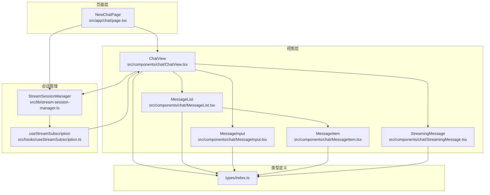
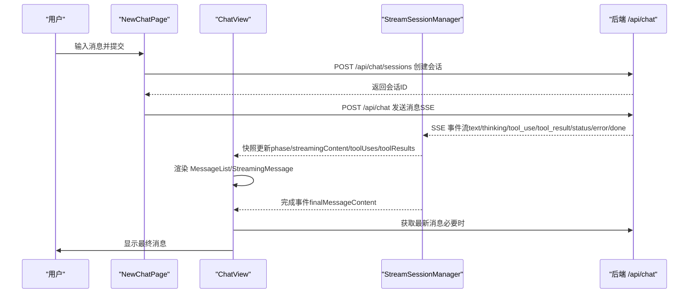
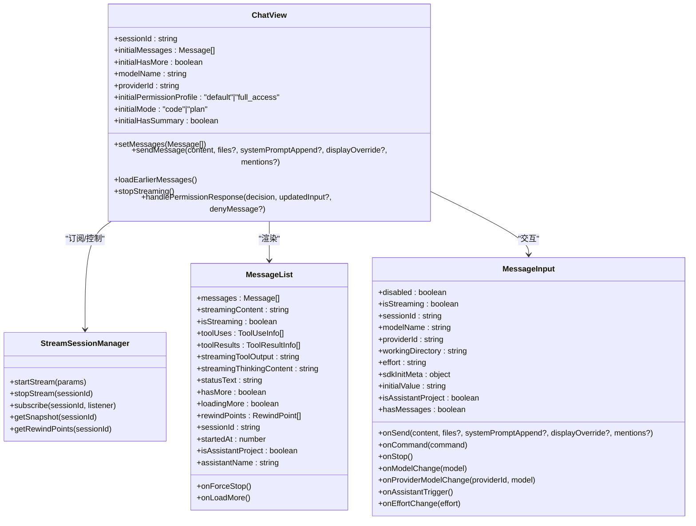
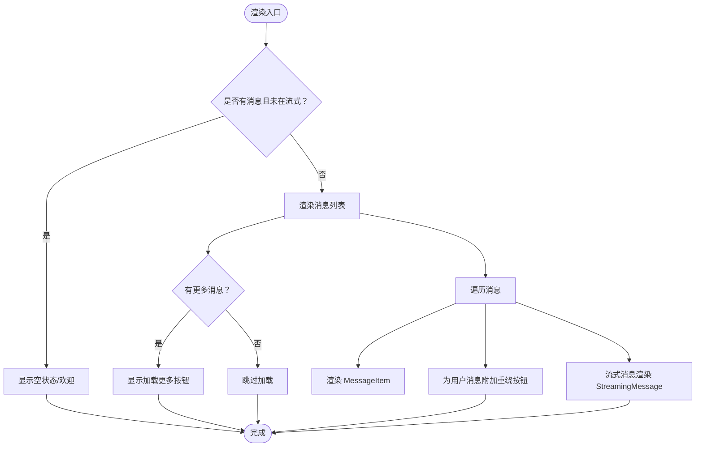
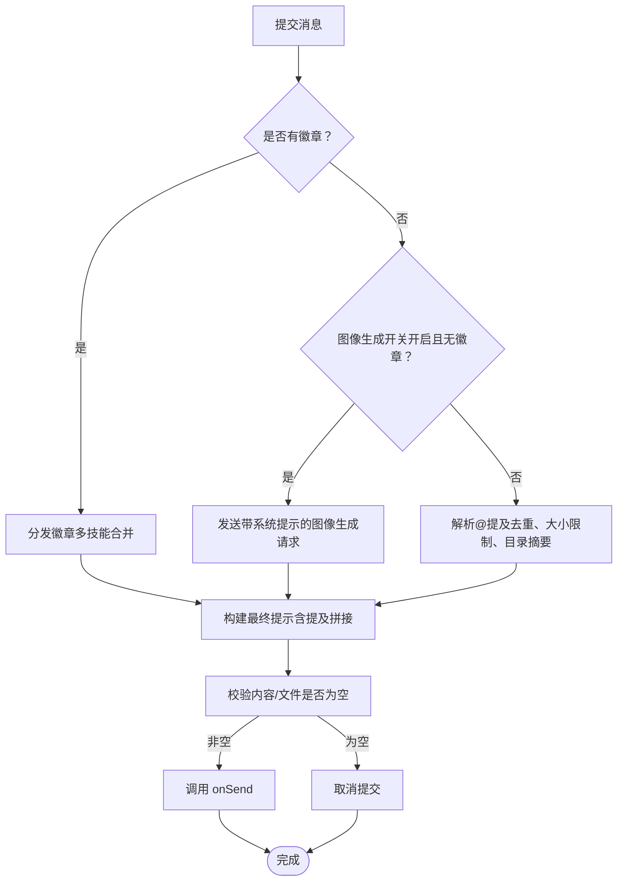
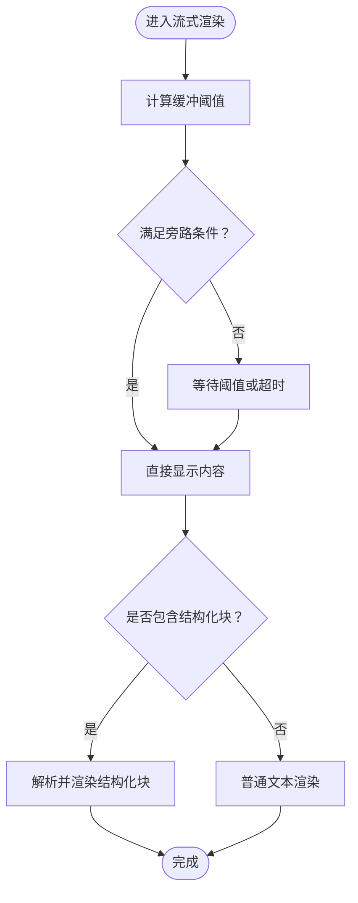
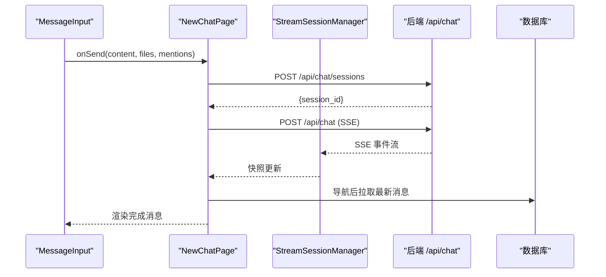
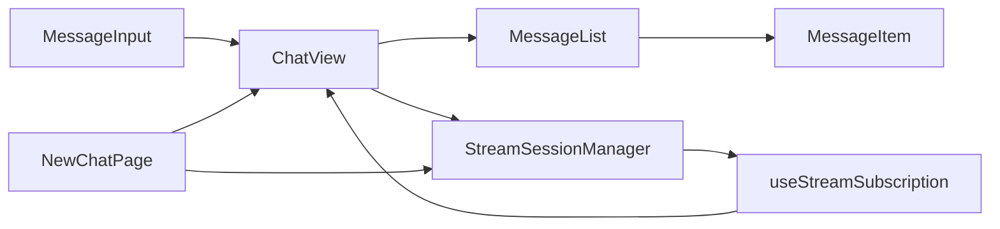

# 聊天对话系统

<cite>
**本文档引用的文件**
- [src/app/chat/page.tsx](file://src/app/chat/page.tsx)
- [src/components/chat/ChatView.tsx](file://src/components/chat/ChatView.tsx)
- [src/components/chat/MessageList.tsx](file://src/components/chat/MessageList.tsx)
- [src/components/chat/MessageInput.tsx](file://src/components/chat/MessageInput.tsx)
- [src/components/chat/MessageItem.tsx](file://src/components/chat/MessageItem.tsx)
- [src/components/chat/StreamingMessage.tsx](file://src/components/chat/StreamingMessage.tsx)
- [src/lib/stream-session-manager.ts](file://src/lib/stream-session-manager.ts)
- [src/hooks/useStreamSubscription.ts](file://src/hooks/useStreamSubscription.ts)
- [src/types/index.ts](file://src/types/index.ts)
</cite>

## 目录
1. [简介](#简介)
2. [项目结构](#项目结构)
3. [核心组件](#核心组件)
4. [架构总览](#架构总览)
5. [详细组件分析](#详细组件分析)
6. [依赖关系分析](#依赖关系分析)
7. [性能考虑](#性能考虑)
8. [故障排除指南](#故障排除指南)
9. [结论](#结论)

## 简介
本文件面向 CodePilot 的聊天对话系统，提供从架构到实现细节的完整文档。重点覆盖以下方面：
- 聊天界面实现架构：ChatView 组件、消息列表渲染、消息输入处理
- 消息生命周期：用户输入 → 消息规范化 → 会话引擎处理 → AI 响应流式返回
- 消息类型处理、实时消息显示、输入验证、错误处理机制
- 与后端 API 的交互方式（SSE 流）
- 性能优化策略（节流、内存限制、增量渲染）

## 项目结构
聊天系统主要由三层构成：
- 页面层：负责初始化会话、发起首次消息、管理全局状态（工作目录、模型/提供商选择、权限等）
- 视图层：负责渲染消息列表、输入框、工具调用、思维内容、状态栏等
- 会话管理器：负责 SSE 流的生命周期、事件聚合、快照分发、自动重试与垃圾回收

**图表来源**
- [src/app/chat/page.tsx:1-915](file://src/app/chat/page.tsx#L1-L915)
- [src/components/chat/ChatView.tsx:1-1035](file://src/components/chat/ChatView.tsx#L1-L1035)
- [src/components/chat/MessageList.tsx:1-334](file://src/components/chat/MessageList.tsx#L1-L334)
- [src/components/chat/MessageInput.tsx:1-876](file://src/components/chat/MessageInput.tsx#L1-L876)
- [src/components/chat/MessageItem.tsx:1-938](file://src/components/chat/MessageItem.tsx#L1-L938)
- [src/components/chat/StreamingMessage.tsx:1-555](file://src/components/chat/StreamingMessage.tsx#L1-L555)
- [src/lib/stream-session-manager.ts:1-918](file://src/lib/stream-session-manager.ts#L1-L918)
- [src/hooks/useStreamSubscription.ts:1-134](file://src/hooks/useStreamSubscription.ts#L1-L134)
- [src/types/index.ts:1-1321](file://src/types/index.ts#L1-L1321)

**章节来源**
- [src/app/chat/page.tsx:1-915](file://src/app/chat/page.tsx#L1-L915)
- [src/components/chat/ChatView.tsx:1-1035](file://src/components/chat/ChatView.tsx#L1-L1035)
- [src/lib/stream-session-manager.ts:1-918](file://src/lib/stream-session-manager.ts#L1-L918)

## 核心组件
- ChatView：会话级聊天视图，负责订阅流快照、管理消息窗口、处理工具调用与思维内容、处理终端动作与速率限制提示、处理权限请求、加载更早消息等
- MessageList：消息列表渲染器，支持滚动锚点、加载更多、消息项渲染、工具调用与思维块渲染、文件附件预览
- MessageInput：消息输入组件，支持命令/技能徽章、@文件/目录提及、文件拖拽、Effort/Model/Provider 选择、快捷操作、图像生成模式切换
- StreamingMessage：流式消息渲染器，支持缓冲首屏文本、结构化块（show-widget、batch-plan、image-gen-request）解析、工具输出与状态栏
- StreamSessionManager：SSE 流管理器，独立于组件生命周期运行，聚合事件、构建快照、派发监听者、自动重试、垃圾回收
- useStreamSubscription：订阅 Hook，连接 ChatView 与 StreamSessionManager，消费最终消息并清理快照

**章节来源**
- [src/components/chat/ChatView.tsx:66-805](file://src/components/chat/ChatView.tsx#L66-L805)
- [src/components/chat/MessageList.tsx:182-334](file://src/components/chat/MessageList.tsx#L182-L334)
- [src/components/chat/MessageInput.tsx:103-876](file://src/components/chat/MessageInput.tsx#L103-L876)
- [src/components/chat/StreamingMessage.tsx:263-555](file://src/components/chat/StreamingMessage.tsx#L263-L555)
- [src/lib/stream-session-manager.ts:187-697](file://src/lib/stream-session-manager.ts#L187-L697)
- [src/hooks/useStreamSubscription.ts:20-134](file://src/hooks/useStreamSubscription.ts#L20-L134)

## 架构总览
聊天系统采用“页面层 + 视图层 + 会话管理器”的分层设计。页面层负责首次消息与会话创建；视图层负责 UI 渲染与用户交互；会话管理器负责与后端 SSE 流的解耦与事件聚合。

**图表来源**
- [src/app/chat/page.tsx:432-774](file://src/app/chat/page.tsx#L432-L774)
- [src/lib/stream-session-manager.ts:291-498](file://src/lib/stream-session-manager.ts#L291-L498)
- [src/hooks/useStreamSubscription.ts:84-126](file://src/hooks/useStreamSubscription.ts#L84-L126)

## 详细组件分析

### ChatView 组件分析
ChatView 是会话级聊天视图的核心，承担以下职责：
- 订阅流快照并驱动 UI 更新
- 管理消息窗口（上限裁剪、加载更多、回溯数据库同步）
- 处理工具调用、思维内容、状态栏、权限请求
- 处理终端原因动作（压缩上下文重试、启用1M上下文、切换模型、继续轮次、重试）
- 处理速率限制提示与上下文使用快照
- 处理工作空间不匹配提示与助手项目头像
- 支持消息队列（在流式响应期间排队后续消息）

**图表来源**
- [src/components/chat/ChatView.tsx:52-805](file://src/components/chat/ChatView.tsx#L52-L805)
- [src/lib/stream-session-manager.ts:56-82](file://src/lib/stream-session-manager.ts#L56-L82)
- [src/components/chat/MessageList.tsx:159-180](file://src/components/chat/MessageList.tsx#L159-L180)
- [src/components/chat/MessageInput.tsx:44-68](file://src/components/chat/MessageInput.tsx#L44-L68)

**章节来源**
- [src/components/chat/ChatView.tsx:66-805](file://src/components/chat/ChatView.tsx#L66-L805)
- [src/hooks/useStreamSubscription.ts:20-134](file://src/hooks/useStreamSubscription.ts#L20-L134)

### 消息列表渲染与实时显示
MessageList 负责：
- 滚动锚点：新消息到达或开始流式时自动滚动到底部
- 加载更多：当存在更早消息时显示按钮并按需加载
- 消息项渲染：根据角色渲染用户/助手消息，支持文件附件、工具调用、思维内容、媒体预览
- 重绕点：为用户消息显示“重绕到此处”按钮（基于 SDK 提供的重绕点）
- 助手项目头像：在助手工作空间中显示伙伴头像

**图表来源**
- [src/components/chat/MessageList.tsx:182-334](file://src/components/chat/MessageList.tsx#L182-L334)
- [src/components/chat/MessageItem.tsx:531-766](file://src/components/chat/MessageItem.tsx#L531-L766)

**章节来源**
- [src/components/chat/MessageList.tsx:182-334](file://src/components/chat/MessageList.tsx#L182-L334)
- [src/components/chat/MessageItem.tsx:531-766](file://src/components/chat/MessageItem.tsx#L531-L766)

### 消息输入处理与验证
MessageInput 负责：
- 命令/技能徽章：支持斜杠命令与技能徽章，避免在流式期间执行破坏性命令
- @文件/目录提及：解析并限制提及数量与大小，支持目录摘要预览
- 文件上传：支持拖拽目录（浏览器会以 0 字节文件表示），通过提及管道处理为目录引用
- 模型/Provider 选择：自动校验当前 Provider 下模型有效性，回退到首个可用模型
- Effort 选择：支持自适应 Effort，向后端发送时过滤 'auto' 以让后端应用模型默认值
- 图像生成模式：当启用图像生成开关且无徽章时，通过系统提示注入图像生成逻辑
- 快捷操作：记忆驱动的建议芯片，一键发送

**图表来源**
- [src/components/chat/MessageInput.tsx:346-533](file://src/components/chat/MessageInput.tsx#L346-L533)

**章节来源**
- [src/components/chat/MessageInput.tsx:103-876](file://src/components/chat/MessageInput.tsx#L103-L876)

### 流式消息渲染与缓冲策略
StreamingMessage 负责：
- 文本缓冲：前 40 个词或遇到结构化块时立即显示，否则最多等待 2.5 秒
- 结构化块解析：支持 show-widget、batch-plan、image-gen-request 三类块的流式与非流式解析
- 工具调用与输出：渲染工具组、媒体预览、工具输出流
- 状态栏：显示工具运行时间、警告/危险提示、强制停止按钮
- 思维内容：在文本生成前显示“思考中/深度思考中/准备回复”阶段标签

**图表来源**
- [src/components/chat/StreamingMessage.tsx:126-173](file://src/components/chat/StreamingMessage.tsx#L126-L173)
- [src/components/chat/StreamingMessage.tsx:263-555](file://src/components/chat/StreamingMessage.tsx#L263-L555)

**章节来源**
- [src/components/chat/StreamingMessage.tsx:126-555](file://src/components/chat/StreamingMessage.tsx#L126-L555)

### 消息生命周期与后端交互
消息生命周期从用户输入到最终持久化，涉及以下关键步骤：
- 用户输入：MessageInput 校验并规范化（提及、文件、徽章、Effort）
- 首次消息（NewChatPage）：创建会话 → 发送消息（SSE）→ 实时渲染 → 完成后导航到会话页
- 后续消息（ChatView）：通过 StreamSessionManager 启动 SSE 流 → 聚合事件 → 构建最终消息 → 写入数据库 → 清理快照
- 权限请求：当需要用户授权时，弹出权限提示并等待响应
- 错误处理：网络中断、工具超时、速率限制、结构化错误分类显示

**图表来源**
- [src/app/chat/page.tsx:432-774](file://src/app/chat/page.tsx#L432-L774)
- [src/lib/stream-session-manager.ts:291-498](file://src/lib/stream-session-manager.ts#L291-L498)
- [src/hooks/useStreamSubscription.ts:84-126](file://src/hooks/useStreamSubscription.ts#L84-L126)

**章节来源**
- [src/app/chat/page.tsx:432-774](file://src/app/chat/page.tsx#L432-L774)
- [src/lib/stream-session-manager.ts:243-697](file://src/lib/stream-session-manager.ts#L243-L697)
- [src/hooks/useStreamSubscription.ts:20-134](file://src/hooks/useStreamSubscription.ts#L20-L134)

### 类型系统与数据模型
聊天系统使用统一的类型定义，确保前后端一致性：
- Message：消息模型，content 存储结构化内容块（文本、思维、工具调用、工具结果、代码块）
- MessageContentBlock：结构化内容块类型集合
- TokenUsage：令牌用量统计
- SSEEventType/SSEEvent：SSE 事件类型与数据结构
- PermissionRequestEvent：权限请求事件
- FileAttachment/MediaBlock：文件附件与媒体块
- ChatSession：会话模型（用于页面层创建会话）

**章节来源**
- [src/types/index.ts:143-186](file://src/types/index.ts#L143-L186)
- [src/types/index.ts:306-312](file://src/types/index.ts#L306-L312)
- [src/types/index.ts:500-522](file://src/types/index.ts#L500-L522)
- [src/types/index.ts:535-544](file://src/types/index.ts#L535-L544)
- [src/types/index.ts:799-800](file://src/types/index.ts#L799-L800)

## 依赖关系分析
- ChatView 依赖 StreamSessionManager 进行流式订阅与控制，依赖 useStreamSubscription 连接快照与消息列表
- MessageList 依赖 MessageItem 渲染具体消息，依赖 MessageInput 的状态进行滚动与锚点
- MessageInput 依赖 Provider/Model 选择、命令/技能徽章、提及解析、文件上传
- StreamSessionManager 依赖 SSE 事件消费器，负责事件聚合、快照构建、自动重试与垃圾回收
- NewChatPage 作为页面入口，负责首次消息与会话创建，并在完成后导航至 ChatView

**图表来源**
- [src/components/chat/ChatView.tsx:278-285](file://src/components/chat/ChatView.tsx#L278-L285)
- [src/hooks/useStreamSubscription.ts:20-134](file://src/hooks/useStreamSubscription.ts#L20-L134)
- [src/lib/stream-session-manager.ts:187-241](file://src/lib/stream-session-manager.ts#L187-L241)

**章节来源**
- [src/components/chat/ChatView.tsx:278-285](file://src/components/chat/ChatView.tsx#L278-L285)
- [src/hooks/useStreamSubscription.ts:20-134](file://src/hooks/useStreamSubscription.ts#L20-L134)
- [src/lib/stream-session-manager.ts:187-241](file://src/lib/stream-session-manager.ts#L187-L241)

## 性能考虑
- 文本节流：StreamSessionManager 对文本更新进行 100ms 节流，减少 React 重渲染频率
- 消息上限：ChatView 使用 300 条消息上限，超出时裁剪并延迟从数据库重新同步
- 缓冲策略：StreamingMessage 对首屏文本进行缓冲，避免闪烁与空闲等待
- 增量渲染：工具输出与状态栏采用增量更新，避免全量重绘
- 垃圾回收：闲置流在 5 分钟后清理，释放内存与定时器
- 文件大小限制：@文件提及最大 256KB，目录引用最多 3 个，防止大负载影响性能

**章节来源**
- [src/lib/stream-session-manager.ts:262-289](file://src/lib/stream-session-manager.ts#L262-L289)
- [src/components/chat/ChatView.tsx:63-127](file://src/components/chat/ChatView.tsx#L63-L127)
- [src/components/chat/StreamingMessage.tsx:122-173](file://src/components/chat/StreamingMessage.tsx#L122-L173)
- [src/components/chat/MessageInput.tsx:39-42](file://src/components/chat/MessageInput.tsx#L39-L42)

## 故障排除指南
- 网络中断/空闲超时：StreamSessionManager 捕获 AbortError 并标记为 idle timeout，显示“连接可能断开”提示，必要时清理 SDK 会话
- 工具超时：检测到工具超时后，自动重试并提示用户更换方法
- 权限请求：当后端需要用户授权时，弹出权限提示，支持允许/允许本次会话/拒绝三种决策
- 速率限制：接收 rate_limit 事件并在 UI 中显示提示，保持提示在会话切换时稳定
- 结构化错误：后端可返回结构化错误，前端解析并给出用户友好提示与诊断建议链接
- 会话重建：当 ChatView 重新挂载时，从 StreamSessionManager 恢复快照，必要时从数据库补全最终消息

**章节来源**
- [src/lib/stream-session-manager.ts:565-697](file://src/lib/stream-session-manager.ts#L565-L697)
- [src/components/chat/ChatView.tsx:614-620](file://src/components/chat/ChatView.tsx#L614-L620)
- [src/app/chat/page.tsx:696-724](file://src/app/chat/page.tsx#L696-L724)

## 结论
CodePilot 的聊天对话系统通过清晰的分层架构与事件驱动的设计，实现了高可用、高性能的流式对话体验。页面层负责会话创建与首次消息，视图层专注 UI 渲染与交互，会话管理器独立处理 SSE 生命周期与事件聚合。配合严格的输入验证、缓冲与节流策略，系统在复杂场景下仍能保持流畅与稳定。