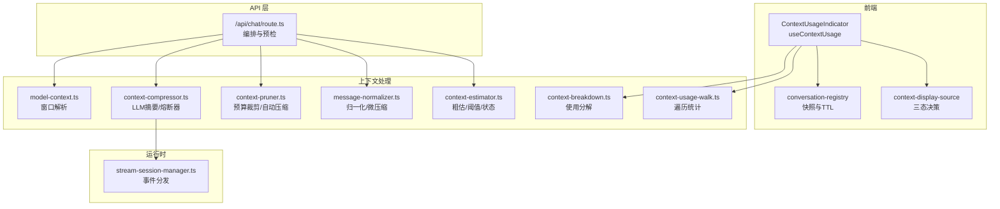
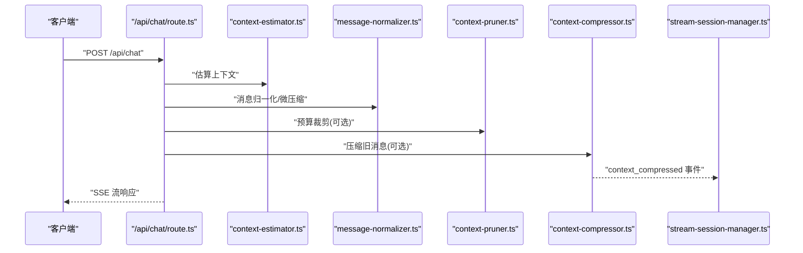
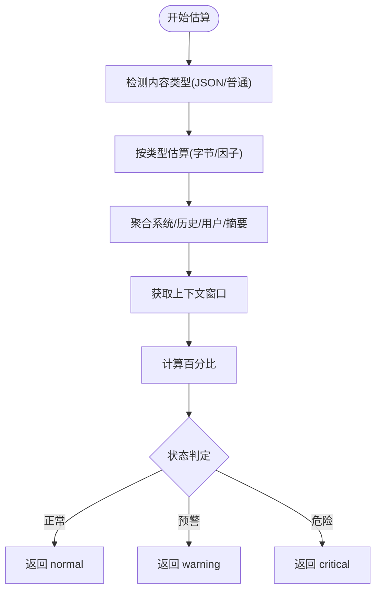
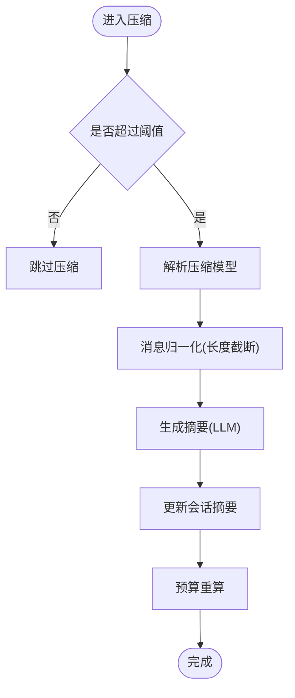
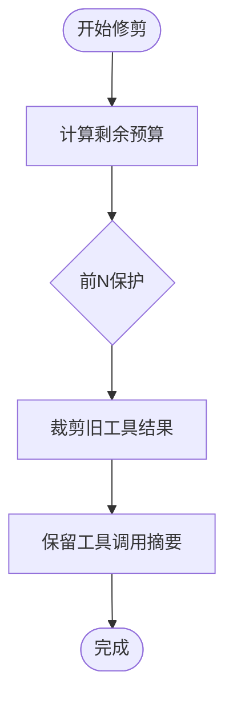
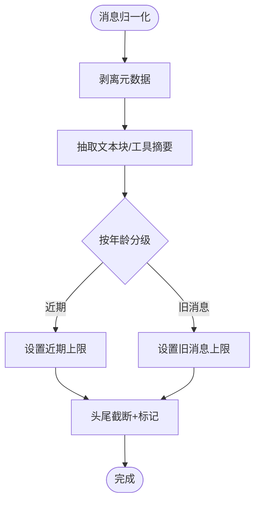
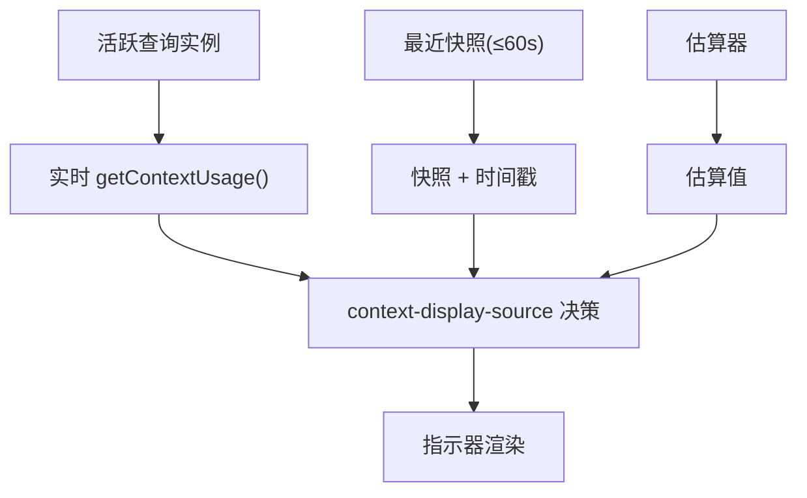
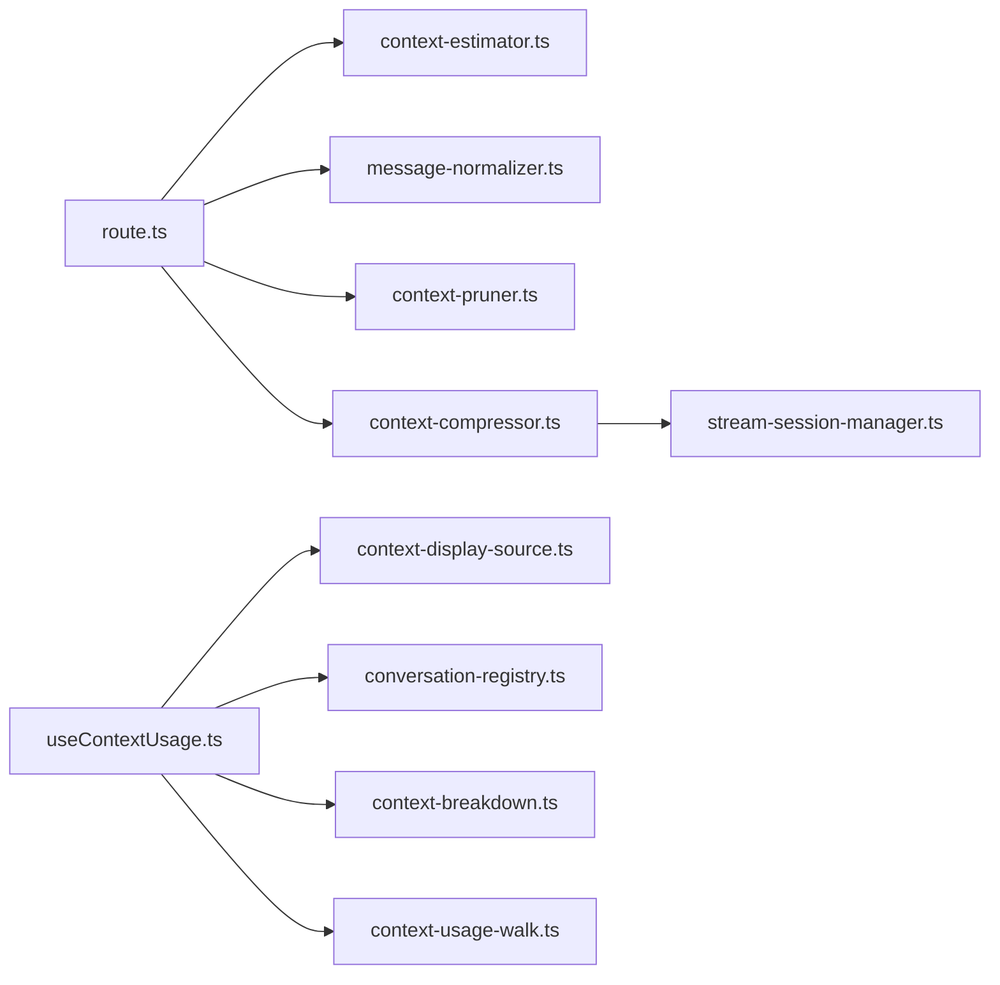

# 上下文管理

<cite>
**本文档引用的文件**
- [context-estimator.ts](file://src/lib/context-estimator.ts)
- [context-compressor.ts](file://src/lib/context-compressor.ts)
- [context-pruner.ts](file://src/lib/context-pruner.ts)
- [context-breakdown.ts](file://src/lib/context-breakdown.ts)
- [context-usage-walk.ts](file://src/lib/context-usage-walk.ts)
- [message-normalizer.ts](file://src/lib/message-normalizer.ts)
- [model-context.ts](file://src/lib/model-context.ts)
- [route.ts](file://src/app/api/chat/route.ts)
- [useContextUsage.ts](file://src/hooks/useContextUsage.ts)
- [ContextUsageIndicator.tsx](file://src/components/chat/ContextUsageIndicator.tsx)
- [stream-session-manager.ts](file://src/lib/stream-session-manager.ts)
- [conversation-registry.ts](file://src/lib/conversation-registry.ts)
- [context-display-source.ts](file://src/lib/context-display-source.ts)
- [context-chips-send-clear.test.ts](file://src/__tests__/unit/context-chips-send-clear.test.ts)
- [context-pruner.test.ts](file://src/__tests__/unit/context-pruner.test.ts)
- [context-estimator.test.ts](file://src/__tests__/unit/context-estimator.test.ts)
- [context-compressor-handoff.test.ts](file://src/__tests__/unit/context-compressor-handoff.test.ts)
- [context-usage-walk.test.ts](file://src/__tests__/unit/context-usage-walk.test.ts)
- [context-breakdown.test.ts](file://src/__tests__/unit/context-breakdown.test.ts)
- [context-accounting.test.ts](file://src/__tests__/unit/context-accounting.test.ts)
- [context-assembler.test.ts](file://src/__tests__/unit/context-assembler.test.ts)
- [context-dot-matrix.test.ts](file://src/__tests__/unit/context-dot-matrix.test.ts)
- [context-chips-send-clear.test.ts](file://src/__tests__/unit/context-chips-send-clear.test.ts)
- [context-pruner.test.ts](file://src/__tests__/unit/context-pruner.test.ts)
- [context-estimator.test.ts](file://src/__tests__/unit/context-estimator.test.ts)
- [context-compressor-handoff.test.ts](file://src/__tests__/unit/context-compressor-handoff.test.ts)
- [context-usage-walk.test.ts](file://src/__tests__/unit/context-usage-walk.test.ts)
- [context-breakdown.test.ts](file://src/__tests__/unit/context-breakdown.test.ts)
- [context-accounting.test.ts](file://src/__tests__/unit/context-accounting.test.ts)
- [context-assembler.test.ts](file://src/__tests__/unit/context-assembler.test.ts)
- [context-dot-matrix.test.ts](file://src/__tests__/unit/context-dot-matrix.test.ts)
- [context-management.md](file://docs/handover/context-management.md)
- [context-management-optimization.md](file://docs/future/context-management-optimization.md)
- [phase-6-context-breakdown-data-audit.md](file://docs/research/phase-6-context-breakdown-data-audit.md)
- [agent-sdk-0-2-111-adoption.md](file://docs/exec-plans/active/agent-sdk-0-2-111-adoption.md)
- [session-management-and-context-compaction.md](file://docs/research/session-management-and-context-compaction.md)
- [hermes-inspired-runtime-upgrade.md](file://docs/exec-plans/completed/hermes-inspired-runtime-upgrade.md)
</cite>

## 目录
1. [引言](#引言)
2. [项目结构](#项目结构)
3. [核心组件](#核心组件)
4. [架构概览](#架构概览)
5. [详细组件分析](#详细组件分析)
6. [依赖关系分析](#依赖关系分析)
7. [性能考量](#性能考量)
8. [故障排除指南](#故障排除指南)
9. [结论](#结论)
10. [附录](#附录)

## 引言
本文件系统性阐述 CodePilot 的上下文管理机制，覆盖聊天上下文的收集、压缩、修剪与估算，上下文窗口大小控制、信息权重计算与相关性评估，上下文状态跟踪、历史信息管理与实时更新策略，并给出与 AI 模型性能的关系及优化方法，以及上下文丢失的预防与恢复机制。文档同时提供可视化图示与测试用例路径，帮助读者快速定位实现细节。

## 项目结构
上下文管理相关代码主要分布在以下模块：
- 估算与预算：context-estimator.ts、context-usage-walk.ts、model-context.ts
- 压缩与熔断：context-compressor.ts、stream-session-manager.ts
- 修剪与预算模式：context-pruner.ts
- 消息归一化与微压缩：message-normalizer.ts
- API 编排：app/api/chat/route.ts
- 前端指标与状态：hooks/useContextUsage.ts、components/chat/ContextUsageIndicator.tsx、lib/context-display-source.ts、lib/conversation-registry.ts
- 数据分解与审计：lib/context-breakdown.ts
- 文档与演进：docs/handover/context-management.md、docs/future/context-management-optimization.md 等

**图表来源**
- [route.ts:557-579](file://src/app/api/chat/route.ts#L557-L579)
- [context-estimator.ts:45-56](file://src/lib/context-estimator.ts#L45-L56)
- [context-pruner.ts:1-37](file://src/lib/context-pruner.ts#L1-L37)
- [context-compressor.ts:231-267](file://src/lib/context-compressor.ts#L231-L267)
- [message-normalizer.ts:82-106](file://src/lib/message-normalizer.ts#L82-L106)
- [context-breakdown.ts:47-65](file://src/lib/context-breakdown.ts#L47-L65)
- [context-usage-walk.ts](file://src/lib/context-usage-walk.ts)
- [model-context.ts](file://src/lib/model-context.ts)
- [stream-session-manager.ts](file://src/lib/stream-session-manager.ts)
- [useContextUsage.ts:1-34](file://src/hooks/useContextUsage.ts#L1-L34)
- [ContextUsageIndicator.tsx](file://src/components/chat/ContextUsageIndicator.tsx)
- [conversation-registry.ts](file://src/lib/conversation-registry.ts)
- [context-display-source.ts](file://src/lib/context-display-source.ts)

**章节来源**
- [context-management.md:19-41](file://docs/handover/context-management.md#L19-L41)
- [context-management-optimization.md:325-390](file://docs/future/context-management-optimization.md#L325-L390)

## 核心组件
- 上下文估算器：提供粗略 token 估算、阈值计算与状态判断，支持 JSON 内容识别与不同估算策略。
- 上下文压缩器：基于 LLM 生成摘要，具备熔断器与阈值控制，支持会话摘要更新与预算重算。
- 上下文修剪器：支持基于 token 预算的旧工具结果裁剪、前 N 保护与工具调用摘要保留。
- 消息归一化与微压缩：剥离元数据、抽取关键摘要、按年龄分级截断，保障传输效率与相关性。
- API 编排：在请求进入模型前进行预估、阈值检查、压缩与预算重算，确保不超过上下文窗口。
- 前端指标与状态：实时/快照/估算三态展示，结合会话注册表与显示源决策模块，提供稳定反馈。
- 使用分解与遍历：对上下文使用进行结构化分解与统计，支撑 UI 与审计。

**章节来源**
- [context-estimator.ts:45-56](file://src/lib/context-estimator.ts#L45-L56)
- [context-compressor.ts:231-267](file://src/lib/context-compressor.ts#L231-L267)
- [context-pruner.ts:1-37](file://src/lib/context-pruner.ts#L1-L37)
- [message-normalizer.ts:82-106](file://src/lib/message-normalizer.ts#L82-L106)
- [route.ts:557-579](file://src/app/api/chat/route.ts#L557-L579)
- [useContextUsage.ts:1-34](file://src/hooks/useContextUsage.ts#L1-L34)
- [context-breakdown.ts:47-65](file://src/lib/context-breakdown.ts#L47-L65)

## 架构概览
上下文管理采用"预估-阈值-压缩-预算重算"的流水线式编排，前端通过三态指示器实时反馈上下文占用状态，API 层在生成前完成预检与压缩决策，运行时通过事件分发保证压缩状态的传播与恢复。

**图表来源**
- [route.ts:557-579](file://src/app/api/chat/route.ts#L557-L579)
- [context-estimator.ts:45-56](file://src/lib/context-estimator.ts#L45-L56)
- [message-normalizer.ts:82-106](file://src/lib/message-normalizer.ts#L82-L106)
- [context-pruner.ts:1-37](file://src/lib/context-pruner.ts#L1-L37)
- [context-compressor.ts:231-267](file://src/lib/context-compressor.ts#L231-L267)
- [stream-session-manager.ts](file://src/lib/stream-session-manager.ts)

## 详细组件分析

### 上下文估算器（context-estimator.ts）
- 功能要点
  - 粗略 token 估算：针对普通文本与 JSON 内容分别采用不同估算因子。
  - 消息与上下文估算：聚合 system、历史、用户消息与摘要，计算总 token 预估。
  - 阈值与状态：基于窗口大小计算百分比，返回 normal/warning/critical 三态。
- 关键接口
  - roughTokenEstimate(text, isJson?)
  - estimateMessageTokens(content)
  - estimateContextTokens(params)
  - calculateContextPercentage(tokens, window)

**图表来源**
- [context-estimator.ts:45-56](file://src/lib/context-estimator.ts#L45-L56)

**章节来源**
- [context-estimator.ts:45-56](file://src/lib/context-estimator.ts#L45-L56)
- [context-estimator.test.ts](file://src/__tests__/unit/context-estimator.test.ts)

### 上下文压缩器（context-compressor.ts）
- 功能要点
  - 压缩阈值：当估算 token 占比达到阈值且会话未熔断时触发压缩。
  - LLM 摘要：通过解析压缩用模型，对旧消息进行摘要生成，保留关键信息。
  - 熔断器：连续失败达到上限后停止压缩，避免反复失败影响体验。
- 关键接口
  - needsCompression(estimatedTokens, contextWindow, sessionId)
  - compressConversation(params)

**图表来源**
- [context-compressor.ts:231-267](file://src/lib/context-compressor.ts#L231-L267)
- [context-compressor-handoff.test.ts](file://src/__tests__/unit/context-compressor-handoff.test.ts)

**章节来源**
- [context-compressor.ts:231-267](file://src/lib/context-compressor.ts#L231-L267)
- [context-compressor-handoff.test.ts](file://src/__tests__/unit/context-compressor-handoff.test.ts)

### 上下文修剪器（context-pruner.ts）
- 功能要点
  - 基于 token 预算的旧工具结果裁剪，保护前 N 条消息，保留工具调用摘要。
  - 自动压缩触发条件：结合上下文窗口与使用比例，决定是否进行修剪。
- 关键接口
  - pruneOldToolResults(messages, options)
  - pruneOldToolResultsByBudget(messages, tokenBudget, options)
  - shouldAutoCompact(messages, contextWindow)

**图表来源**
- [context-pruner.ts:1-37](file://src/lib/context-pruner.ts#L1-L37)
- [context-pruner.test.ts:1-37](file://src/__tests__/unit/context-pruner.test.ts#L1-L37)

**章节来源**
- [context-pruner.ts:1-37](file://src/lib/context-pruner.ts#L1-L37)
- [context-pruner.test.ts:1-37](file://src/__tests__/unit/context-pruner.test.ts#L1-L37)

### 消息归一化与微压缩（message-normalizer.ts）
- 功能要点
  - 归一化：剥离元数据、抽取 assistant JSON 中的文本块与工具摘要、跳过重复的 tool_result。
  - 微压缩：按消息年龄分级设置字符上限，采用头尾截断策略并在中间插入截断标记。
- 关键接口
  - normalizeMessageContent(role, raw)
  - microCompactMessage(role, content, ageFromEnd)
  - headTailTruncate(text, limit)

**图表来源**
- [message-normalizer.ts:82-106](file://src/lib/message-normalizer.ts#L82-L106)

**章节来源**
- [message-normalizer.ts:82-106](file://src/lib/message-normalizer.ts#L82-L106)

### API 编排（/api/chat/route.ts）
- 功能要点
  - 在请求进入模型前完成预估、归一化、预算裁剪与压缩决策。
  - 基于最近预算确定保留与压缩的消息边界，压缩后更新摘要并重算预算。
- 关键流程
  - 估算总 token → 归一化与微压缩 → 预算裁剪 → 压缩旧消息 → 重算预算 → SSE 响应

**章节来源**
- [route.ts:557-579](file://src/app/api/chat/route.ts#L557-L579)

### 前端上下文状态与指示器（useContextUsage.ts、ContextUsageIndicator.tsx、context-display-source.ts、conversation-registry.ts）
- 功能要点
  - 三态展示：实时（🎯）、快照（📌）、估算（~），依据当前可用数据源选择。
  - 状态决策：结合会话注册表的最近快照与 TTL，以及估算器的预估值。
  - 指示器：环形进度与悬浮卡片，展示实际与预估指标、摘要状态等。
- 关键接口
  - useContextUsage：聚合 contextWindow、used、estimatedNextTurn、hasSummary 等。
  - context-display-source：三态数据源决策。
  - conversation-registry：保存最近一次 usage 快照与时间戳。

**图表来源**
- [useContextUsage.ts:1-34](file://src/hooks/useContextUsage.ts#L1-L34)
- [context-display-source.ts](file://src/lib/context-display-source.ts)
- [conversation-registry.ts](file://src/lib/conversation-registry.ts)
- [ContextUsageIndicator.tsx](file://src/components/chat/ContextUsageIndicator.tsx)

**章节来源**
- [useContextUsage.ts:1-34](file://src/hooks/useContextUsage.ts#L1-L34)
- [context-display-source.ts](file://src/lib/context-display-source.ts)
- [conversation-registry.ts](file://src/lib/conversation-registry.ts)
- [ContextUsageIndicator.tsx](file://src/components/chat/ContextUsageIndicator.tsx)
- [agent-sdk-0-2-111-adoption.md:887-1015](file://docs/exec-plans/active/agent-sdk-0-2-111-adoption.md#L887-L1015)

### 使用分解与遍历（context-breakdown.ts、context-usage-walk.ts）
- 功能要点
  - buildContextUsageBreakdown：构建上下文使用分解，覆盖排序、累加不变量、负数钳制、未知窗口、待定状态不污染、缓存计入等。
  - walkContextUsage：遍历上下文使用，捕获 cacheRead、cacheCreation、output 等指标。
- 应用价值
  - 为 UI 提供更细粒度的上下文使用视图，支撑审计与优化。

**章节来源**
- [context-breakdown.ts:47-65](file://src/lib/context-breakdown.ts#L47-L65)
- [context-breakdown.test.ts](file://src/__tests__/unit/context-breakdown.test.ts)
- [context-usage-walk.ts](file://src/lib/context-usage-walk.ts)
- [context-usage-walk.test.ts](file://src/__tests__/unit/context-usage-walk.test.ts)

### 上下文窗口大小控制与模型感知（model-context.ts）
- 功能要点
  - 解析模型上下文窗口，支持 context_1m 感知，作为估算与阈值计算的基础。
- 重要性
  - 窗口大小直接影响压缩阈值与预算分配，是上下文管理的基石。

**章节来源**
- [model-context.ts](file://src/lib/model-context.ts)

## 依赖关系分析
- 组件耦合
  - API 编排依赖估算、归一化、修剪与压缩模块，形成强内聚的预处理链。
  - 前端指标依赖显示源决策与会话注册表，确保三态切换的正确性。
  - 压缩器与运行时事件管理器协作，实现压缩状态的传播与恢复。
- 外部依赖
  - AI SDK 的上下文使用接口用于实时精确值采集，作为前端指示器的权威来源。
  - 令牌估算器作为预检与阈值判断的依据，避免昂贵的 SDK 调用。

**图表来源**
- [route.ts:557-579](file://src/app/api/chat/route.ts#L557-L579)
- [context-compressor.ts:231-267](file://src/lib/context-compressor.ts#L231-L267)
- [useContextUsage.ts:1-34](file://src/hooks/useContextUsage.ts#L1-L34)
- [context-display-source.ts](file://src/lib/context-display-source.ts)
- [conversation-registry.ts](file://src/lib/conversation-registry.ts)
- [context-breakdown.ts:47-65](file://src/lib/context-breakdown.ts#L47-L65)
- [context-usage-walk.ts](file://src/lib/context-usage-walk.ts)

## 性能考量
- 估算成本
  - 估算器采用粗略估算，避免昂贵的精确计数，适合预检与阈值判断。
- 压缩成本
  - 压缩器具备熔断器，防止连续失败导致的额外开销；压缩后预算重算减少后续请求的 token 消耗。
- 传输效率
  - 归一化与微压缩显著降低消息体积，提高传输效率，同时保留关键信息。
- 实时性
  - 前端三态指示器结合会话注册表的快照 TTL，平衡实时性与稳定性。

[本节为通用性能讨论，无需特定文件来源]

## 故障排除指南
- 压缩失败与熔断
  - 现象：连续压缩失败后停止压缩。
  - 排查：检查压缩器的熔断器状态与会话 ID，必要时重置压缩状态。
  - 参考：[context-compressor.ts:231-233](file://src/lib/context-compressor.ts#L231-L233)
- 预算不足与截断异常
  - 现象：消息被过度截断或预算计算不准确。
  - 排查：核对修剪器的预算参数与前 N 保护设置，确保工具调用摘要保留。
  - 参考：[context-pruner.ts:1-37](file://src/lib/context-pruner.ts#L1-L37)
- 实时指示器不更新
  - 现象：前端指示器未显示实时值或快照。
  - 排查：确认会话注册表的快照 TTL 与显示源决策逻辑。
  - 参考：[conversation-registry.ts](file://src/lib/conversation-registry.ts)、[context-display-source.ts](file://src/lib/context-display-source.ts)
- 估算器偏差
  - 现象：估算值与 SDK 实际值存在偏差。
  - 排查：启用估算器校准，对比 estimator 与 SDK 官方值，记录偏差并进行动态调整。
  - 参考：[agent-sdk-0-2-111-adoption.md:887-1015](file://docs/exec-plans/active/agent-sdk-0-2-111-adoption.md#L887-L1015)

**章节来源**
- [context-compressor.ts:231-233](file://src/lib/context-compressor.ts#L231-L233)
- [context-pruner.ts:1-37](file://src/lib/context-pruner.ts#L1-L37)
- [conversation-registry.ts](file://src/lib/conversation-registry.ts)
- [context-display-source.ts](file://src/lib/context-display-source.ts)
- [agent-sdk-0-2-111-adoption.md:887-1015](file://docs/exec-plans/active/agent-sdk-0-2-111-adoption.md#L887-L1015)

## 结论
CodePilot 的上下文管理通过"预估-阈值-压缩-预算重算"的闭环机制，结合前端三态指示器与运行时事件分发，实现了对上下文窗口的有效控制与优化。估算器、压缩器、修剪器与消息归一化共同构成高效稳定的上下文处理链，既保证了 AI 模型性能，又提升了用户体验。未来可在精确计数、提示词缓存控制与会话记忆压缩等方面进一步优化。

[本节为总结性内容，无需特定文件来源]

## 附录
- 相关文档与演进
  - [context-management.md](file://docs/handover/context-management.md)
  - [context-management-optimization.md](file://docs/future/context-management-optimization.md)
  - [phase-6-context-breakdown-data-audit.md](file://docs/research/phase-6-context-breakdown-data-audit.md)
  - [agent-sdk-0-2-111-adoption.md](file://docs/exec-plans/active/agent-sdk-0-2-111-adoption.md)
  - [session-management-and-context-compaction.md](file://docs/research/session-management-and-context-compaction.md)
  - [hermes-inspired-runtime-upgrade.md](file://docs/exec-plans/completed/hermes-inspired-runtime-upgrade.md)

**章节来源**
- [context-management.md:19-41](file://docs/handover/context-management.md#L19-L41)
- [context-management-optimization.md:325-390](file://docs/future/context-management-optimization.md#L325-L390)
- [phase-6-context-breakdown-data-audit.md:47-65](file://docs/research/phase-6-context-breakdown-data-audit.md#L47-L65)
- [agent-sdk-0-2-111-adoption.md:887-1015](file://docs/exec-plans/active/agent-sdk-0-2-111-adoption.md#L887-L1015)
- [session-management-and-context-compaction.md](file://docs/research/session-management-and-context-compaction.md)
- [hermes-inspired-runtime-upgrade.md:399-433](file://docs/exec-plans/completed/hermes-inspired-runtime-upgrade.md#L399-L433)