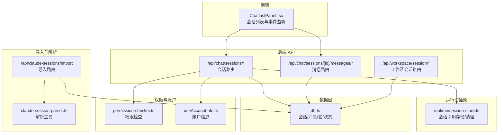
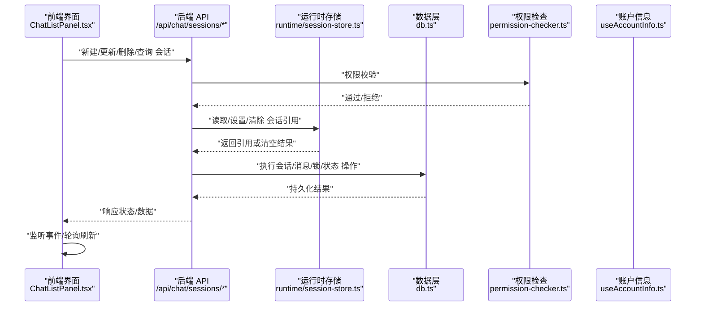
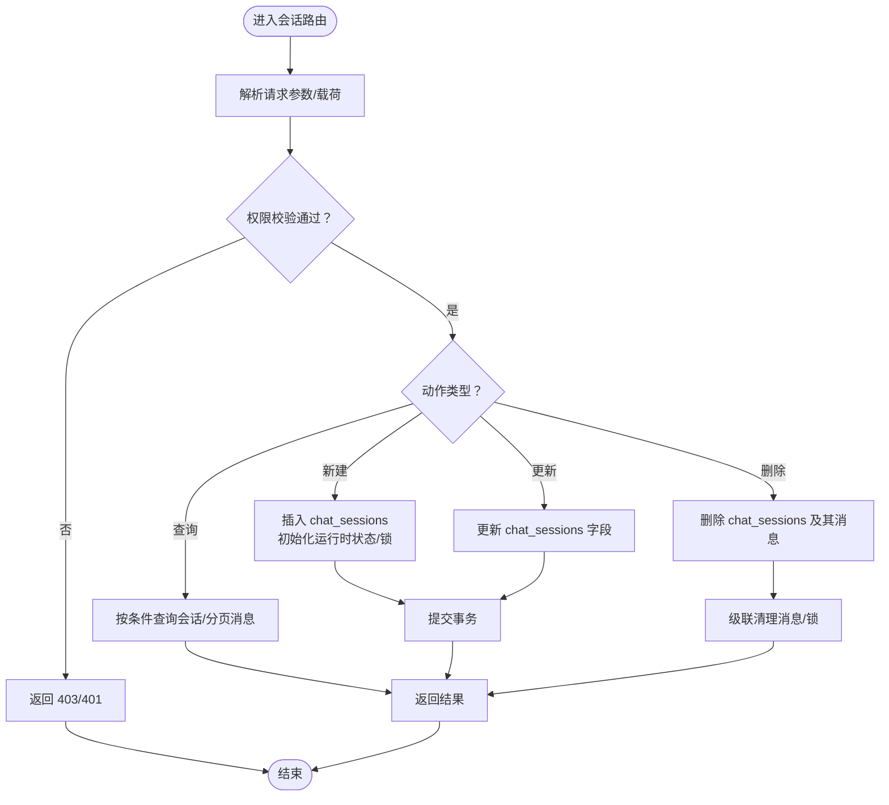
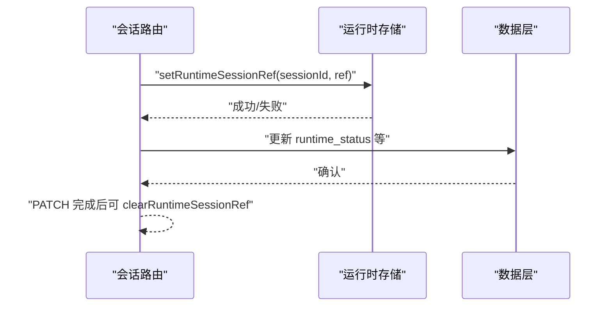
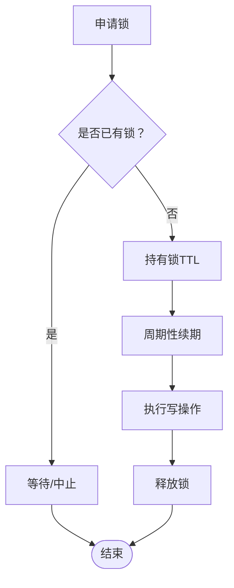
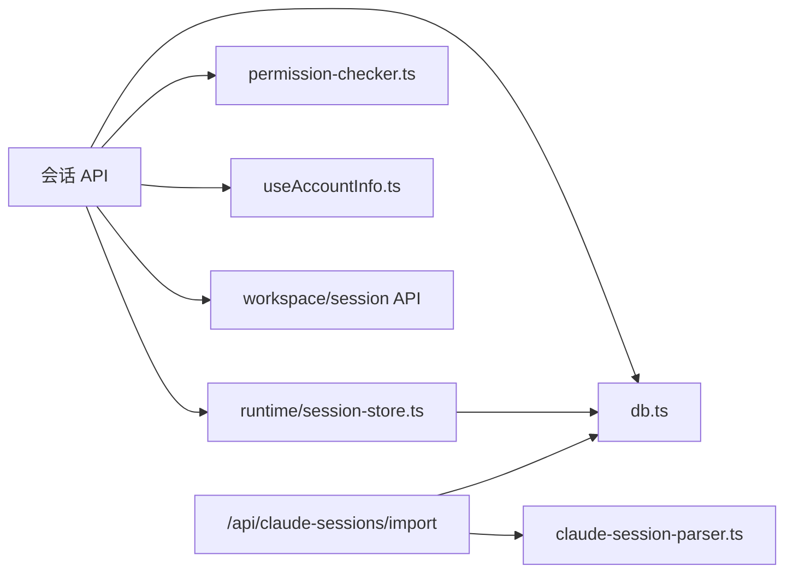

# 会话管理

<cite>
**本文引用的文件**
- [src/lib/db.ts](file://src/lib/db.ts)
- [src/lib/runtime/session-store.ts](file://src/lib/runtime/session-store.ts)
- [src/app/api/chat/sessions/route.ts](file://src/app/api/chat/sessions/route.ts)
- [src/app/api/chat/sessions/[id]/route.ts](file://src/app/api/chat/sessions/[id]/route.ts)
- [src/app/api/chat/sessions/[id]/messages/route.ts](file://src/app/api/chat/sessions/[id]/messages/route.ts)
- [src/components/layout/ChatListPanel.tsx](file://src/components/layout/ChatListPanel.tsx)
- [src/lib/stream-session-manager.ts](file://src/lib/stream-session-manager.ts)
- [src/lib/claude-session-parser.ts](file://src/lib/claude-session-parser.ts)
- [src/app/api/claude-sessions/import/route.ts](file://src/app/api/claude-sessions/import/route.ts)
- [src/lib/resolve-session-model.ts](file://src/lib/resolve-session-model.ts)
- [src/lib/permission-checker.ts](file://src/lib/permission-checker.ts)
- [src/hooks/useAccountInfo.ts](file://src/hooks/useAccountInfo.ts)
- [src/app/api/workspace/latest-session/route.ts](file://src/app/api/workspace/latest-session/route.ts)
- [src/app/api/workspace/session/route.ts](file://src/app/api/workspace/session/route.ts)
- [src/lib/bridge/adapters/weixin/weixin-session-guard.ts](file://src/lib/bridge/adapters/weixin/weixin-session-guard.ts)
- [src/__tests__/unit/runtime-session-store.test.ts](file://src/__tests__/unit/runtime-session-store.test.ts)
- [src/__tests__/unit/session-search.test.ts](file://src/__tests__/unit/session-search.test.ts)
- [src/__tests__/unit/weixin-session-guard.test.ts](file://src/__tests__/unit/weixin-session-guard.test.ts)
</cite>

## 目录
1. [引言](#引言)
2. [项目结构](#项目结构)
3. [核心组件](#核心组件)
4. [架构总览](#架构总览)
5. [详细组件分析](#详细组件分析)
6. [依赖分析](#依赖分析)
7. [性能考虑](#性能考虑)
8. [故障排查指南](#故障排查指南)
9. [结论](#结论)
10. [附录](#附录)

## 引言
本文件系统性阐述聊天会话的生命周期管理：从创建、维护到销毁；覆盖状态跟踪、数据持久化、并发控制、会话切换与恢复、清理策略，以及与用户账户的关联与权限控制。文档同时给出关键实现位置与调用序列图，帮助开发者快速定位与扩展。

## 项目结构
围绕“会话”的主要代码分布在以下区域：
- 后端 API：负责会话 CRUD、消息读写、运行时状态更新、工作区会话绑定等
- 数据层：SQLite 访问封装，提供会话与消息的增删改查、锁与运行时状态管理
- 前端组件：会话列表、事件监听与轮询、删除与跳转
- 运行时抽象：统一的会话引用存储与清理接口
- 权限与账户：权限检查、账户信息钩子、桥接通道的会话守卫
- 导入与解析：Claude 会话导入与解析工具

图表来源
- [src/components/layout/ChatListPanel.tsx](file://src/components/layout/ChatListPanel.tsx)
- [src/app/api/chat/sessions/route.ts](file://src/app/api/chat/sessions/route.ts)
- [src/app/api/chat/sessions/[id]/messages/route.ts](file://src/app/api/chat/sessions/[id]/messages/route.ts)
- [src/app/api/workspace/session/route.ts](file://src/app/api/workspace/session/route.ts)
- [src/lib/runtime/session-store.ts](file://src/lib/runtime/session-store.ts)
- [src/lib/db.ts](file://src/lib/db.ts)
- [src/lib/permission-checker.ts](file://src/lib/permission-checker.ts)
- [src/hooks/useAccountInfo.ts](file://src/hooks/useAccountInfo.ts)
- [src/app/api/claude-sessions/import/route.ts](file://src/app/api/claude-sessions/import/route.ts)
- [src/lib/claude-session-parser.ts](file://src/lib/claude-session-parser.ts)

章节来源
- [src/components/layout/ChatListPanel.tsx](file://src/components/layout/ChatListPanel.tsx)
- [src/app/api/chat/sessions/route.ts](file://src/app/api/chat/sessions/route.ts)
- [src/app/api/chat/sessions/[id]/messages/route.ts](file://src/app/api/chat/sessions/[id]/messages/route.ts)
- [src/app/api/workspace/session/route.ts](file://src/app/api/workspace/session/route.ts)
- [src/lib/runtime/session-store.ts](file://src/lib/runtime/session-store.ts)
- [src/lib/db.ts](file://src/lib/db.ts)
- [src/lib/permission-checker.ts](file://src/lib/permission-checker.ts)
- [src/hooks/useAccountInfo.ts](file://src/hooks/useAccountInfo.ts)
- [src/app/api/claude-sessions/import/route.ts](file://src/app/api/claude-sessions/import/route.ts)
- [src/lib/claude-session-parser.ts](file://src/lib/claude-session-parser.ts)

## 核心组件
- 会话数据库层（db.ts）
  - 提供会话表与消息表的读写、分页、过滤、运行时状态与错误字段更新、会话锁（排他）管理、锁续期与释放
- 会话 API 层（/api/chat/sessions/*）
  - 新建、查询、更新、删除会话；按目录查询；消息读写；模式与权限配置更新
- 运行时会话存储抽象（runtime/session-store.ts）
  - 统一的 get/set/clear 会话引用接口，保证不同运行时（如 claude_code、codex 等）的兼容与扩展
- 前端会话列表（ChatListPanel.tsx）
  - 监听会话事件、定时轮询、删除会话并处理路由跳转
- 权限与账户（permission-checker.ts、useAccountInfo.ts）
  - 会话操作前的权限校验与账户上下文注入
- 工作区会话绑定（/api/workspace/session/*）
  - 将当前工作区与最近会话进行绑定，支持最新会话查询
- 导入与解析（/api/claude-sessions/import、claude-session-parser.ts）
  - 支持从 Claude 导出的会话数据导入到本地会话体系

章节来源
- [src/lib/db.ts](file://src/lib/db.ts)
- [src/app/api/chat/sessions/route.ts](file://src/app/api/chat/sessions/route.ts)
- [src/app/api/chat/sessions/[id]/route.ts](file://src/app/api/chat/sessions/[id]/route.ts)
- [src/lib/runtime/session-store.ts](file://src/lib/runtime/session-store.ts)
- [src/components/layout/ChatListPanel.tsx](file://src/components/layout/ChatListPanel.tsx)
- [src/lib/permission-checker.ts](file://src/lib/permission-checker.ts)
- [src/hooks/useAccountInfo.ts](file://src/hooks/useAccountInfo.ts)
- [src/app/api/workspace/session/route.ts](file://src/app/api/workspace/session/route.ts)
- [src/app/api/claude-sessions/import/route.ts](file://src/app/api/claude-sessions/import/route.ts)
- [src/lib/claude-session-parser.ts](file://src/lib/claude-session-parser.ts)

## 架构总览
下图展示了会话生命周期的关键交互：从前端触发到后端 API 处理，再到数据层持久化与运行时抽象，以及权限与账户的参与。

图表来源
- [src/components/layout/ChatListPanel.tsx](file://src/components/layout/ChatListPanel.tsx)
- [src/app/api/chat/sessions/route.ts](file://src/app/api/chat/sessions/route.ts)
- [src/lib/runtime/session-store.ts](file://src/lib/runtime/session-store.ts)
- [src/lib/db.ts](file://src/lib/db.ts)
- [src/lib/permission-checker.ts](file://src/lib/permission-checker.ts)
- [src/hooks/useAccountInfo.ts](file://src/hooks/useAccountInfo.ts)

## 详细组件分析

### 会话创建与维护（API 与数据层）
- 创建会话
  - 入口：POST /api/chat/sessions
  - 行为：接收请求体参数，写入 chat_sessions 表，初始化运行时状态与锁记录（如需要），返回新会话标识
  - 关键实现位置：[src/app/api/chat/sessions/route.ts](file://src/app/api/chat/sessions/route.ts)
- 更新会话元数据
  - 模式与权限配置更新：PATCH /api/chat/sessions/[id]（由会话路由处理）
  - 运行时状态更新：PUT /api/chat/sessions/[id]（由会话路由处理）
  - 关键实现位置：[src/app/api/chat/sessions/[id]/route.ts](file://src/app/api/chat/sessions/[id]/route.ts)
- 会话锁与并发控制
  - 获取锁：INSERT session_runtime_locks（排他）
  - 续期锁：UPDATE session_runtime_locks.expiry
  - 释放锁：DELETE session_runtime_locks
  - 关键实现位置：[src/lib/db.ts](file://src/lib/db.ts)
- 消息读写
  - 分页读取：按 rowid 降序取 N+1 条以判断是否还有更多
  - 过滤心跳 ACK：可选排除 is_heartbeat_ack=1 的消息
  - 写入消息：INSERT INTO messages
  - 关键实现位置：[src/lib/db.ts](file://src/lib/db.ts)，[src/app/api/chat/sessions/[id]/messages/route.ts](file://src/app/api/chat/sessions/[id]/messages/route.ts)

图表来源
- [src/app/api/chat/sessions/route.ts](file://src/app/api/chat/sessions/route.ts)
- [src/app/api/chat/sessions/[id]/route.ts](file://src/app/api/chat/sessions/[id]/route.ts)
- [src/lib/db.ts](file://src/lib/db.ts)

章节来源
- [src/app/api/chat/sessions/route.ts](file://src/app/api/chat/sessions/route.ts)
- [src/app/api/chat/sessions/[id]/route.ts](file://src/app/api/chat/sessions/[id]/route.ts)
- [src/app/api/chat/sessions/[id]/messages/route.ts](file://src/app/api/chat/sessions/[id]/messages/route.ts)
- [src/lib/db.ts](file://src/lib/db.ts)

### 会话状态跟踪与运行时集成
- 运行时会话引用存储
  - 统一接口：getRuntimeSessionRef / setRuntimeSessionRef / clearRuntimeSessionRef
  - 作用：屏蔽不同运行时（如 claude_code、codex）差异，确保会话在运行时侧的唯一引用与清理
  - 关键实现位置：[src/lib/runtime/session-store.ts](file://src/lib/runtime/session-store.ts)
- 运行时状态更新
  - 更新 runtime_status、runtime_updated_at、runtime_error
  - 用于前端或桥接通道感知会话运行态
  - 关键实现位置：[src/lib/db.ts](file://src/lib/db.ts)
- 会话切换与恢复
  - 切换：通过设置新的运行时引用完成
  - 恢复：读取已保存的运行时引用以继续上次会话
  - 清理：在 API PATCH 或异常场景调用 clearRuntimeSessionRef
  - 关键实现位置：[src/lib/runtime/session-store.ts](file://src/lib/runtime/session-store.ts)，[src/__tests__/unit/runtime-session-store.test.ts](file://src/__tests__/unit/runtime-session-store.test.ts)

图表来源
- [src/lib/runtime/session-store.ts](file://src/lib/runtime/session-store.ts)
- [src/lib/db.ts](file://src/lib/db.ts)
- [src/__tests__/unit/runtime-session-store.test.ts](file://src/__tests__/unit/runtime-session-store.test.ts)

章节来源
- [src/lib/runtime/session-store.ts](file://src/lib/runtime/session-store.ts)
- [src/lib/db.ts](file://src/lib/db.ts)
- [src/__tests__/unit/runtime-session-store.test.ts](file://src/__tests__/unit/runtime-session-store.test.ts)

### 并发控制与锁机制
- 锁模型
  - 排他锁：同一时间仅允许一个持有者对会话进行写操作
  - TTL：锁带过期时间，避免死锁
  - 续期：持有者定期 renewSessionLock 延长有效期
  - 释放：任务完成后 releaseSessionLock
- 使用场景
  - 编辑/重写消息、中断/重启运行、批量导入等高风险写操作
- 关键实现位置：[src/lib/db.ts](file://src/lib/db.ts)

图表来源
- [src/lib/db.ts](file://src/lib/db.ts)

章节来源
- [src/lib/db.ts](file://src/lib/db.ts)

### 会话切换、恢复与清理
- 切换
  - 通过 setRuntimeSessionRef 将当前运行时指向新的会话引用
- 恢复
  - 通过 getRuntimeSessionRef 读取上次运行时引用，继续对话流
- 清理
  - 在 PATCH 或异常场景调用 clearRuntimeSessionRef，确保引用被安全清除
- 测试保障
  - 单测验证导出的三个生命周期函数存在、类型分支穷尽、claude_code 分支兼容历史列
  - 关键实现位置：[src/__tests__/unit/runtime-session-store.test.ts](file://src/__tests__/unit/runtime-session-store.test.ts)

章节来源
- [src/lib/runtime/session-store.ts](file://src/lib/runtime/session-store.ts)
- [src/__tests__/unit/runtime-session-store.test.ts](file://src/__tests__/unit/runtime-session-store.test.ts)

### 会话与用户账户的关联与权限控制
- 用户账户
  - 通过 useAccountInfo.ts 获取当前账户上下文，作为会话归属与权限判定依据
- 权限控制
  - 所有会话操作前调用 permission-checker.ts 进行权限校验
  - 支持基于账户角色、会话所有权、租户隔离等策略
- 工作区绑定
  - 通过 /api/workspace/session/* 将当前工作区与最近会话绑定，便于上下文恢复
- 关键实现位置：[src/hooks/useAccountInfo.ts](file://src/hooks/useAccountInfo.ts)，[src/lib/permission-checker.ts](file://src/lib/permission-checker.ts)，[src/app/api/workspace/session/route.ts](file://src/app/api/workspace/session/route.ts)

章节来源
- [src/hooks/useAccountInfo.ts](file://src/hooks/useAccountInfo.ts)
- [src/lib/permission-checker.ts](file://src/lib/permission-checker.ts)
- [src/app/api/workspace/session/route.ts](file://src/app/api/workspace/session/route.ts)

### 会话数据的备份、迁移与恢复
- 导入 Claude 会话
  - 路由：POST /api/claude-sessions/import
  - 解析：claude-session-parser.ts 将外部格式转换为内部消息与会话结构
  - 存储：写入 chat_sessions 与 messages 表
- 搜索与检索
  - 会话搜索工具：builtin-tools/session-search.ts
  - API：/api/chat/sessions/search（若存在）
- 最近会话
  - /api/workspace/latest-session 提供最近会话查询能力
- 关键实现位置：[src/app/api/claude-sessions/import/route.ts](file://src/app/api/claude-sessions/import/route.ts)，[src/lib/claude-session-parser.ts](file://src/lib/claude-session-parser.ts)，[src/lib/builtin-tools/session-search.ts](file://src/lib/builtin-tools/session-search.ts)，[src/app/api/workspace/latest-session/route.ts](file://src/app/api/workspace/latest-session/route.ts)

章节来源
- [src/app/api/claude-sessions/import/route.ts](file://src/app/api/claude-sessions/import/route.ts)
- [src/lib/claude-session-parser.ts](file://src/lib/claude-session-parser.ts)
- [src/lib/builtin-tools/session-search.ts](file://src/lib/builtin-tools/session-search.ts)
- [src/app/api/workspace/latest-session/route.ts](file://src/app/api/workspace/latest-session/route.ts)

### 前端会话列表与事件驱动刷新
- 事件监听
  - 监听 window.session-created 与 session-updated，触发会话列表刷新
- 轮询兜底
  - 每 5 秒轮询一次，捕获服务端创建的会话（如桥接通道）
- 删除会话
  - DELETE /api/chat/sessions/[id]，成功后移除列表项、解除拆分组、必要时跳转首页
- 关键实现位置：[src/components/layout/ChatListPanel.tsx](file://src/components/layout/ChatListPanel.tsx)

章节来源
- [src/components/layout/ChatListPanel.tsx](file://src/components/layout/ChatListPanel.tsx)

### 流式会话管理（Stream Session Manager）
- 作用：管理流式响应的会话状态，协调中断、重试、错误传播
- 适用场景：长文本生成、工具调用链路中的会话保持
- 关键实现位置：[src/lib/stream-session-manager.ts](file://src/lib/stream-session-manager.ts)

章节来源
- [src/lib/stream-session-manager.ts](file://src/lib/stream-session-manager.ts)

### 桥接通道的会话守卫（微信）
- 作用：在桥接通道（如微信）中对会话进行守卫，防止越权访问或并发冲突
- 关键实现位置：[src/lib/bridge/adapters/weixin/weixin-session-guard.ts](file://src/lib/bridge/adapters/weixin/weixin-session-guard.ts)

章节来源
- [src/lib/bridge/adapters/weixin/weixin-session-guard.ts](file://src/lib/bridge/adapters/weixin/weixin-session-guard.ts)

## 依赖分析
- 组件耦合
  - API 路由依赖数据层与运行时存储；运行时存储为多运行时提供统一抽象；权限与账户贯穿于 API 前置校验
- 外部依赖
  - SQLite（通过 db.ts 封装）
  - Next.js App Router（API 路由组织）
- 循环依赖
  - 当前结构以“API → 数据层/运行时存储”单向依赖为主，未见明显循环

图表来源
- [src/app/api/chat/sessions/route.ts](file://src/app/api/chat/sessions/route.ts)
- [src/lib/db.ts](file://src/lib/db.ts)
- [src/lib/runtime/session-store.ts](file://src/lib/runtime/session-store.ts)
- [src/lib/permission-checker.ts](file://src/lib/permission-checker.ts)
- [src/hooks/useAccountInfo.ts](file://src/hooks/useAccountInfo.ts)
- [src/app/api/workspace/session/route.ts](file://src/app/api/workspace/session/route.ts)
- [src/app/api/claude-sessions/import/route.ts](file://src/app/api/claude-sessions/import/route.ts)
- [src/lib/claude-session-parser.ts](file://src/lib/claude-session-parser.ts)

章节来源
- [src/app/api/chat/sessions/route.ts](file://src/app/api/chat/sessions/route.ts)
- [src/lib/db.ts](file://src/lib/db.ts)
- [src/lib/runtime/session-store.ts](file://src/lib/runtime/session-store.ts)
- [src/lib/permission-checker.ts](file://src/lib/permission-checker.ts)
- [src/hooks/useAccountInfo.ts](file://src/hooks/useAccountInfo.ts)
- [src/app/api/workspace/session/route.ts](file://src/app/api/workspace/session/route.ts)
- [src/app/api/claude-sessions/import/route.ts](file://src/app/api/claude-sessions/import/route.ts)
- [src/lib/claude-session-parser.ts](file://src/lib/claude-session-parser.ts)

## 性能考虑
- 分页与游标
  - 消息读取采用 rowid 降序分页，并多取一条以判断是否存在更多，减少多次往返
- 轮询频率
  - 会话列表轮询间隔 5 秒，兼顾实时性与服务器压力
- 锁的 TTL
  - 合理设置锁过期时间，避免长时间占用导致写放大
- 运行时状态更新
  - 仅在必要时更新 runtime_status，避免频繁写入

## 故障排查指南
- 会话无法删除
  - 检查权限校验是否通过；查看前端删除流程与路由返回状态
  - 关键实现位置：[src/components/layout/ChatListPanel.tsx](file://src/components/layout/ChatListPanel.tsx)
- 会话锁冲突
  - 确认是否已有其他持有者；检查 renewSessionLock 是否按时调用；查看锁表状态
  - 关键实现位置：[src/lib/db.ts](file://src/lib/db.ts)
- 运行时引用未清理
  - 确认 PATCH 后是否调用 clearRuntimeSessionRef；查看单测断言是否通过
  - 关键实现位置：[src/lib/runtime/session-store.ts](file://src/lib/runtime/session-store.ts)，[src/__tests__/unit/runtime-session-store.test.ts](file://src/__tests__/unit/runtime-session-store.test.ts)
- 权限拒绝
  - 检查 permission-checker.ts 的策略配置；核对 useAccountInfo.ts 的账户上下文
  - 关键实现位置：[src/lib/permission-checker.ts](file://src/lib/permission-checker.ts)，[src/hooks/useAccountInfo.ts](file://src/hooks/useAccountInfo.ts)
- 桥接通道异常
  - 检查 weixin-session-guard.ts 的守卫逻辑与日志输出
  - 关键实现位置：[src/lib/bridge/adapters/weixin/weixin-session-guard.ts](file://src/lib/bridge/adapters/weixin/weixin-session-guard.ts)

章节来源
- [src/components/layout/ChatListPanel.tsx](file://src/components/layout/ChatListPanel.tsx)
- [src/lib/db.ts](file://src/lib/db.ts)
- [src/lib/runtime/session-store.ts](file://src/lib/runtime/session-store.ts)
- [src/__tests__/unit/runtime-session-store.test.ts](file://src/__tests__/unit/runtime-session-store.test.ts)
- [src/lib/permission-checker.ts](file://src/lib/permission-checker.ts)
- [src/hooks/useAccountInfo.ts](file://src/hooks/useAccountInfo.ts)
- [src/lib/bridge/adapters/weixin/weixin-session-guard.ts](file://src/lib/bridge/adapters/weixin/weixin-session-guard.ts)

## 结论
本会话管理体系以“API 路由 + 数据层 + 运行时抽象 + 权限与账户”为核心，结合锁机制与事件/轮询驱动，实现了可靠的会话生命周期管理。通过统一的运行时存储接口与严格的权限控制，系统在多运行时与多通道环境下仍能保持一致性与安全性。建议在后续迭代中进一步完善会话搜索与归档策略，增强跨设备同步与审计能力。

## 附录
- 会话模型与字段
  - 会话表：包含 id、runtime_status、runtime_updated_at、runtime_error、permission_profile、mode 等
  - 消息表：包含 session_id、content、is_heartbeat_ack 等
  - 锁表：session_id、lock_id、expires_at、updated_at
- 常用操作路径
  - 新建会话：POST /api/chat/sessions
  - 查询会话：GET /api/chat/sessions
  - 更新会话：PATCH /api/chat/sessions/[id]
  - 删除会话：DELETE /api/chat/sessions/[id]
  - 读取消息：GET /api/chat/sessions/[id]/messages
  - 设置运行时引用：runtime/session-store.ts
  - 导入 Claude 会话：POST /api/claude-sessions/import