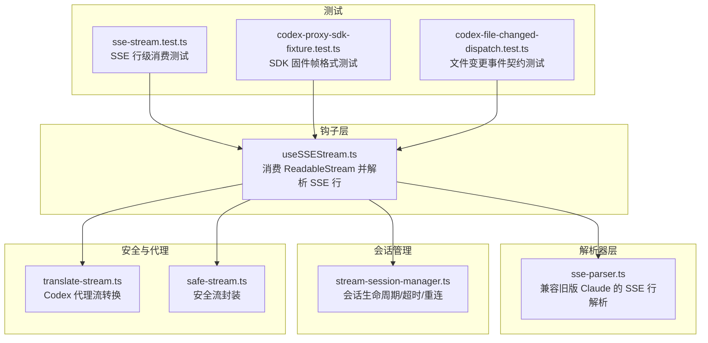
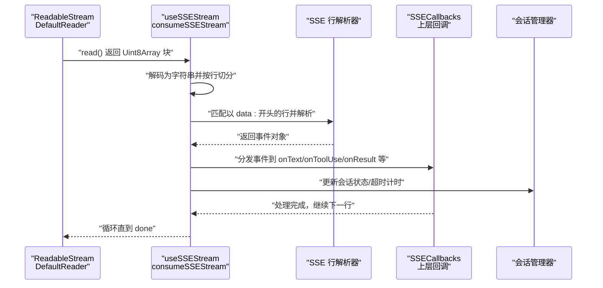
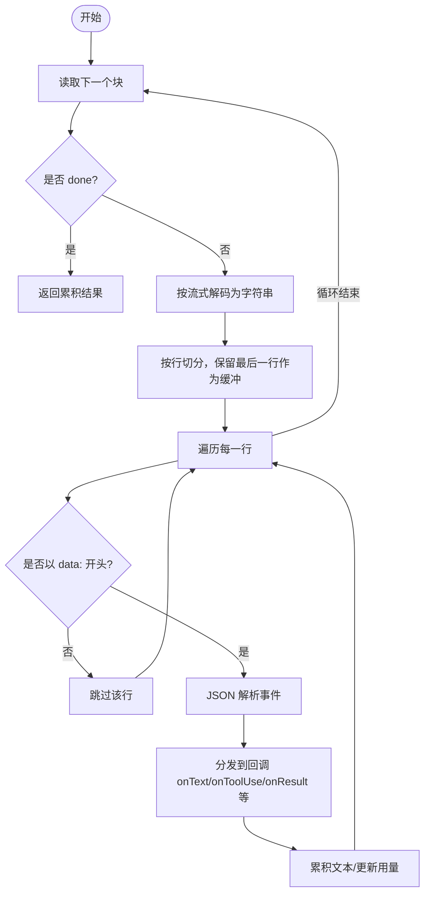
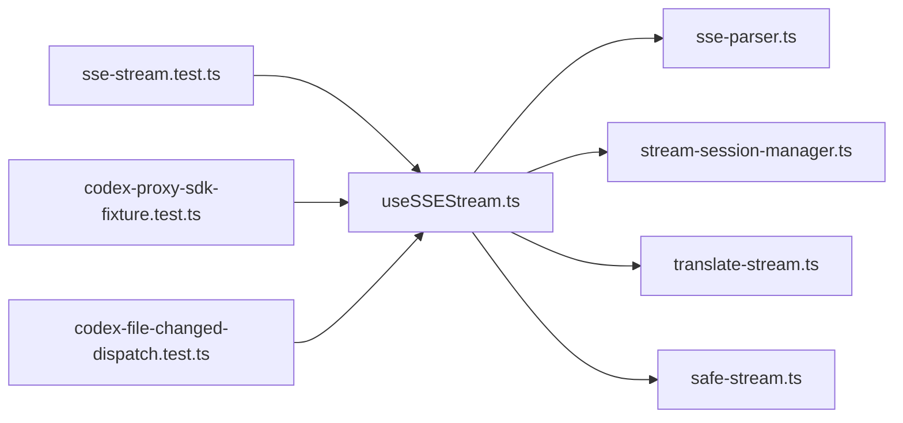

# 流式响应处理

<cite>
**本文引用的文件**
- [useSSEStream.ts](file://src/hooks/useSSEStream.ts)
- [sse-parser.ts](file://src/lib/claude-code-compat/sse-parser.ts)
- [headless-claude.ts](file://src/lib/headless-claude.ts)
- [stream-session-manager.ts](file://src/lib/stream-session-manager.ts)
- [safe-stream.ts](file://src/lib/safe-stream.ts)
- [translate-stream.ts](file://src/lib/codex/proxy/translate-stream.ts)
- [sse-stream.test.ts](file://src/__tests__/unit/sse-stream.test.ts)
- [codex-proxy-sdk-fixture.test.ts](file://src/__tests__/unit/codex-proxy-sdk-fixture.test.ts)
- [codex-file-changed-dispatch.test.ts](file://src/__tests__/unit/codex-file-changed-dispatch.test.ts)
</cite>

## 目录
1. [引言](#引言)
2. [项目结构](#项目结构)
3. [核心组件](#核心组件)
4. [架构总览](#架构总览)
5. [详细组件分析](#详细组件分析)
6. [依赖关系分析](#依赖关系分析)
7. [性能考量](#性能考量)
8. [故障排查指南](#故障排查指南)
9. [结论](#结论)
10. [附录](#附录)

## 引言
本文件系统性阐述本仓库中的流式响应处理能力，重点围绕服务器推送事件（SSE）的实现原理、连接管理、数据流解析与缓冲、渲染与回调分发、错误重连与超时恢复策略，并对比传统请求-响应模式的优势。文档同时提供可操作的调试与性能监控建议，帮助开发者在前端与后端协同场景中稳定地消费流式数据。

## 项目结构
与流式响应直接相关的核心模块分布如下：
- 钩子层：负责消费浏览器/运行时的 ReadableStream 并按行解析 SSE，分发到上层回调
- 解析器层：兼容旧版 Claude 的 SSE 行格式解析
- 会话管理：对长连接进行生命周期管理、超时与重试策略
- 安全与代理：对流进行安全转换与代理适配
- 测试用例：覆盖 SSE 帧格式、事件类型与文件变更事件的契约

图表来源
- [useSSEStream.ts:418-495](file://src/hooks/useSSEStream.ts#L418-L495)
- [sse-parser.ts](file://src/lib/claude-code-compat/sse-parser.ts)
- [stream-session-manager.ts](file://src/lib/stream-session-manager.ts)
- [translate-stream.ts](file://src/lib/codex/proxy/translate-stream.ts)
- [safe-stream.ts](file://src/lib/safe-stream.ts)
- [sse-stream.test.ts:1-38](file://src/__tests__/unit/sse-stream.test.ts#L1-L38)
- [codex-proxy-sdk-fixture.test.ts:77-89](file://src/__tests__/unit/codex-proxy-sdk-fixture.test.ts#L77-L89)
- [codex-file-changed-dispatch.test.ts:49-66](file://src/__tests__/unit/codex-file-changed-dispatch.test.ts#L49-L66)

章节来源
- [useSSEStream.ts:418-495](file://src/hooks/useSSEStream.ts#L418-L495)
- [sse-parser.ts](file://src/lib/claude-code-compat/sse-parser.ts)
- [stream-session-manager.ts](file://src/lib/stream-session-manager.ts)
- [translate-stream.ts](file://src/lib/codex/proxy/translate-stream.ts)
- [safe-stream.ts](file://src/lib/safe-stream.ts)
- [sse-stream.test.ts:1-38](file://src/__tests__/unit/sse-stream.test.ts#L1-L38)
- [codex-proxy-sdk-fixture.test.ts:77-89](file://src/__tests__/unit/codex-proxy-sdk-fixture.test.ts#L77-L89)
- [codex-file-changed-dispatch.test.ts:49-66](file://src/__tests__/unit/codex-file-changed-dispatch.test.ts#L49-L66)

## 核心组件
- 流式消费与解析
  - 使用浏览器/运行时提供的 ReadableStreamDefaultReader 迭代读取二进制块，按字节解码为字符串，按行切分，识别以“data: ”开头的数据行，解析为 JSON 事件对象，分发到上层回调。
  - 通过闭包与 ref 包装回调，避免闭包捕获陈旧状态，确保 onText/onToolUse 等回调始终绑定最新逻辑。
- SSE 行格式兼容
  - 兼容旧版 Claude 的 SSE 行格式解析，保证事件类型与数据结构的一致性。
- 会话生命周期与超时
  - 对长连接设置总时长与空闲时长双重超时，超时后优雅结束；支持在会话管理器层面进行重连与退避策略。
- 安全与代理
  - 提供安全流封装与 Codex 代理流转换，确保跨域或中间层代理场景下的稳定性与安全性。
- 测试保障
  - 单元测试覆盖 SSE 行级消费、SDK 固件帧格式以及特定事件（如文件变更）的契约，确保行为稳定。

章节来源
- [useSSEStream.ts:418-495](file://src/hooks/useSSEStream.ts#L418-L495)
- [sse-parser.ts](file://src/lib/claude-code-compat/sse-parser.ts)
- [stream-session-manager.ts](file://src/lib/stream-session-manager.ts)
- [safe-stream.ts](file://src/lib/safe-stream.ts)
- [translate-stream.ts](file://src/lib/codex/proxy/translate-stream.ts)
- [sse-stream.test.ts:1-38](file://src/__tests__/unit/sse-stream.test.ts#L1-L38)
- [codex-proxy-sdk-fixture.test.ts:77-89](file://src/__tests__/unit/codex-proxy-sdk-fixture.test.ts#L77-L89)
- [codex-file-changed-dispatch.test.ts:49-66](file://src/__tests__/unit/codex-file-changed-dispatch.test.ts#L49-L66)

## 架构总览
下图展示了从底层 ReadableStream 到上层回调的完整链路，包括解析、缓冲、事件分发与会话管理。

图表来源
- [useSSEStream.ts:418-495](file://src/hooks/useSSEStream.ts#L418-L495)
- [sse-parser.ts](file://src/lib/claude-code-compat/sse-parser.ts)

## 详细组件分析

### 组件一：SSE 流消费与回调分发（useSSEStream）
- 职责
  - 消费 ReadableStream 的二进制块，解码为文本，按行切分，过滤非 data 行，解析 JSON 事件并分发到回调。
  - 通过 ref 包装回调，避免闭包捕获陈旧状态，确保 onText/onToolUse 等回调始终绑定最新逻辑。
  - 维护累积文本与令牌用量等上下文，最终返回处理结果。
- 关键流程
  - 读取 -> 解码 -> 行切分 -> 过滤 data 行 -> JSON 解析 -> 分发回调 -> 更新上下文 -> 循环
- 错误处理
  - 对于无法解析的行，跳过并继续处理后续行，保证整体流不中断。
- 性能要点
  - 使用流式解码减少内存占用；按行处理避免一次性解析大块数据。
  - 通过 ref 包装回调，避免频繁重建函数导致的额外开销。

图表来源
- [useSSEStream.ts:418-495](file://src/hooks/useSSEStream.ts#L418-L495)

章节来源
- [useSSEStream.ts:418-495](file://src/hooks/useSSEStream.ts#L418-L495)

### 组件二：SSE 行解析器（sse-parser）
- 职责
  - 兼容旧版 Claude 的 SSE 行格式解析，确保事件类型与数据结构一致。
- 应用点
  - 在消费阶段调用，将 data 行转换为事件对象，供上层回调处理。

章节来源
- [sse-parser.ts](file://src/lib/claude-code-compat/sse-parser.ts)

### 组件三：会话生命周期与超时（stream-session-manager）
- 职责
  - 管理长连接的生命周期，设置总时长与空闲时长双重超时，超时后结束会话。
  - 支持在会话管理器层面进行重连与退避策略，提升网络异常场景的恢复能力。
- 关键点
  - 同时考虑总耗时与空闲时间，防止长时间无数据导致的资源占用。
  - 结合消费端的读取融合超时，形成“读取超时”与“会话超时”的双保险。

章节来源
- [stream-session-manager.ts](file://src/lib/stream-session-manager.ts)

### 组件四：安全与代理（safe-stream、translate-stream）
- 职责
  - safe-stream：对流进行安全封装，避免异常中断影响整体流程。
  - translate-stream：在 Codex 代理场景中对流进行转换，确保跨域或中间层代理的稳定性。
- 应用点
  - 在消费前对底层流进行包装，或在代理层进行转换，保证下游解析不受上游异常影响。

章节来源
- [safe-stream.ts](file://src/lib/safe-stream.ts)
- [translate-stream.ts](file://src/lib/codex/proxy/translate-stream.ts)

### 组件五：Headless Claude 的流式读取与超时融合
- 职责
  - 在 headless 场景中，将流式读取与总时长/空闲时长超时融合，一旦触发任一超时，立即结束读取并返回。
- 关键点
  - 使用 Promise.race 将读取与超时竞争，确保及时退出。
  - 清理定时器，避免内存泄漏。

章节来源
- [headless-claude.ts:240-272](file://src/lib/headless-claude.ts#L240-L272)

### 组件六：测试用例与契约验证
- sse-stream.test.ts
  - 验证 SSE 行级消费的正确性，模拟 Reader 并断言回调被调用。
- codex-proxy-sdk-fixture.test.ts
  - 验证 SSE 帧格式与 SDK 固件一致，每个事件前缀包含“event: 类型”，随后是“data: JSON”，最后以两个换行结尾。
- codex-file-changed-dispatch.test.ts
  - 验证特定事件类型（如 file_changed）在运行时中以专用事件类型发出，而非回退到 status。

章节来源
- [sse-stream.test.ts:1-38](file://src/__tests__/unit/sse-stream.test.ts#L1-L38)
- [codex-proxy-sdk-fixture.test.ts:77-89](file://src/__tests__/unit/codex-proxy-sdk-fixture.test.ts#L77-L89)
- [codex-file-changed-dispatch.test.ts:49-66](file://src/__tests__/unit/codex-file-changed-dispatch.test.ts#L49-L66)

## 依赖关系分析
- 组件耦合
  - useSSEStream 依赖 SSE 行解析器与会话管理器；在代理场景下可能进一步依赖 translate-stream 与 safe-stream。
  - 测试用例独立于实现细节，仅通过公开接口验证行为。
- 外部依赖
  - 浏览器/运行时的 ReadableStream API；Node 环境下的测试工具（如 node:test、assert）。
- 可能的循环依赖
  - 当前模块间为单向依赖，未见循环导入迹象。

图表来源
- [useSSEStream.ts:418-495](file://src/hooks/useSSEStream.ts#L418-L495)
- [sse-parser.ts](file://src/lib/claude-code-compat/sse-parser.ts)
- [stream-session-manager.ts](file://src/lib/stream-session-manager.ts)
- [translate-stream.ts](file://src/lib/codex/proxy/translate-stream.ts)
- [safe-stream.ts](file://src/lib/safe-stream.ts)
- [sse-stream.test.ts:1-38](file://src/__tests__/unit/sse-stream.test.ts#L1-L38)
- [codex-proxy-sdk-fixture.test.ts:77-89](file://src/__tests__/unit/codex-proxy-sdk-fixture.test.ts#L77-L89)
- [codex-file-changed-dispatch.test.ts:49-66](file://src/__tests__/unit/codex-file-changed-dispatch.test.ts#L49-L66)

## 性能考量
- 内存占用
  - 使用流式解码与按行处理，避免一次性加载整段数据，降低峰值内存。
- CPU 与 I/O
  - 逐块读取与增量解析，减少阻塞；合理设置超时，避免长时间等待。
- 回调稳定性
  - 通过 ref 包装回调，避免闭包重建带来的额外开销。
- 代理与安全
  - 在代理层进行流转换与安全封装，减少异常对整体流程的影响。

## 故障排查指南
- 常见问题
  - SSE 行格式不正确：检查是否以“data: ”开头，且 JSON 结构完整。
  - 事件类型缺失：确认事件类型是否在枚举中定义，测试用例可验证契约。
  - 超时退出：若出现提前结束，检查总时长与空闲时长配置，以及网络波动。
  - 文件变更事件未到达：确认运行时是否以专用事件类型发出，而非回退到 status。
- 排查步骤
  - 打开浏览器/运行时控制台，观察 SSE 数据流与回调触发情况。
  - 使用单元测试定位问题：参考 SSE 行级消费测试与 SDK 固件帧格式测试。
  - 检查会话管理器的超时配置与重连策略，必要时调整参数。
- 相关测试参考
  - SSE 行级消费测试：验证 Reader 行为与回调调用。
  - SDK 固件帧格式测试：验证事件与数据行格式。
  - 文件变更事件契约测试：验证专用事件类型。

章节来源
- [sse-stream.test.ts:1-38](file://src/__tests__/unit/sse-stream.test.ts#L1-L38)
- [codex-proxy-sdk-fixture.test.ts:77-89](file://src/__tests__/unit/codex-proxy-sdk-fixture.test.ts#L77-L89)
- [codex-file-changed-dispatch.test.ts:49-66](file://src/__tests__/unit/codex-file-changed-dispatch.test.ts#L49-L66)

## 结论
本仓库的流式响应处理以 useSSEStream 为核心，结合 SSE 行解析器、会话管理与安全/代理封装，形成了稳定可靠的流式数据消费链路。通过严格的测试用例与契约验证，确保了事件格式与行为一致性。在实际应用中，建议根据业务场景合理配置超时与重连策略，并利用现有测试与调试工具持续优化性能与稳定性。

## 附录
- 与传统请求-响应模式的区别与优势
  - 实时性：流式响应可在服务端逐步产生数据时即时推送，无需等待完整响应。
  - 交互体验：适合长任务、生成式对话与实时反馈场景，提升用户感知速度。
  - 资源效率：按需消费与增量解析，降低内存与带宽压力。
- 性能监控与调试建议
  - 监控指标：吞吐量、延迟、超时率、重连次数、回调处理耗时。
  - 调试手段：启用详细日志记录、断点观察回调分发、使用单元测试复现问题。
  - 工具参考：浏览器/运行时开发者工具、Node 测试框架与断言库。