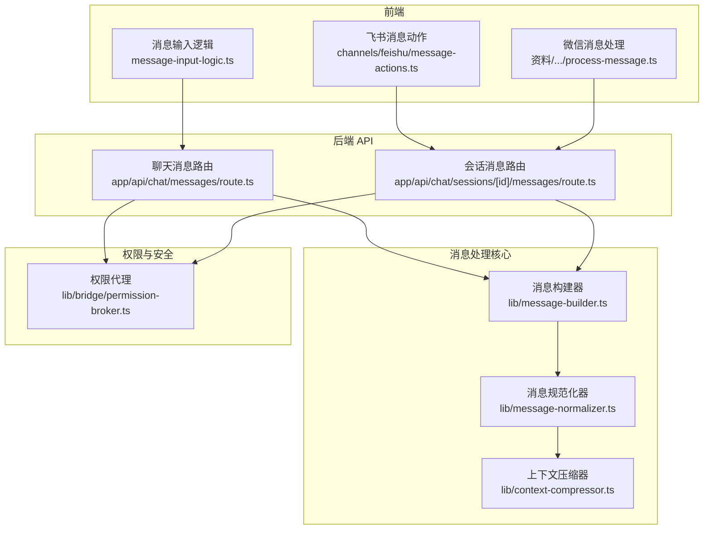
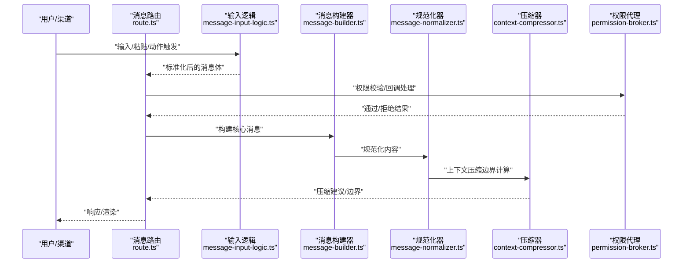
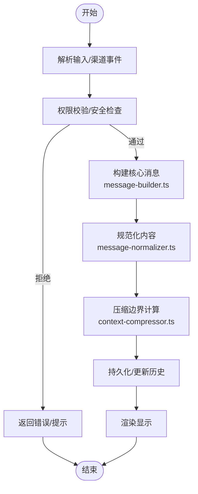
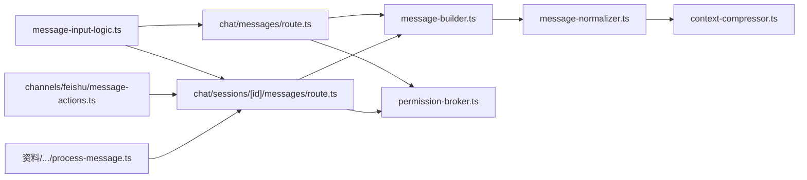

# 消息处理机制

<cite>
**本文引用的文件**
- [message-builder.ts](file://src/lib/message-builder.ts)
- [message-normalizer.ts](file://src/lib/message-normalizer.ts)
- [context-compressor.ts](file://src/lib/context-compressor.ts)
- [permission-broker.ts](file://src/lib/bridge/permission-broker.ts)
- [route.ts（会话消息路由）](file://src/app/api/chat/sessions/[id]/messages/route.ts)
- [route.ts（聊天消息路由）](file://src/app/api/chat/messages/route.ts)
- [message-input-logic.ts](file://src/lib/message-input-logic.ts)
- [message-actions.ts（飞书消息动作）](file://src/lib/channels/feishu/message-actions.ts)
- [process-message.ts（微信消息处理）](file://资料/weixin-openclaw-package/package/src/messaging/process-message.ts)
- [system.js（系统消息转换器）](file://资料/feishu-openclaw-plugin/package/src/messaging/converters/system.js)
- [agent-loop-messages.test.ts](file://src/__tests__/unit/agent-loop-messages.test.ts)
- [message-normalizer.test.ts](file://src/__tests__/unit/message-normalizer.test.ts)
- [message-persistence.test.ts](file://src/__tests__/unit/message-persistence.test.ts)
- [context-compressor-handoff.test.ts](file://src/__tests__/unit/context-compressor-handoff.test.ts)
</cite>

## 目录
1. [引言](#引言)
2. [项目结构](#项目结构)
3. [核心组件](#核心组件)
4. [架构总览](#架构总览)
5. [详细组件分析](#详细组件分析)
6. [依赖关系分析](#依赖关系分析)
7. [性能考量](#性能考量)
8. [故障排查指南](#故障排查指南)
9. [结论](#结论)
10. [附录](#附录)

## 引言
本文件系统性阐述本项目的“消息处理机制”，覆盖消息的创建、转换、渲染与存储全流程；明确消息类型分类、格式化规则与显示逻辑；说明消息状态管理、权限验证与安全检查；给出编辑、删除、转发等操作的实现要点；并解释消息历史记录的存储结构与查询优化策略。文档以代码为依据，结合测试用例与关键实现文件，帮助读者快速理解并正确使用消息处理能力。

## 项目结构
消息处理涉及多个层次：前端输入与交互、后端 API 路由、消息构建与规范化、上下文压缩与持久化、渠道适配与权限控制。下图概览了主要模块及其交互关系：

图表来源
- [message-input-logic.ts](file://src/lib/message-input-logic.ts)
- [message-actions.ts（飞书消息动作）](file://src/lib/channels/feishu/message-actions.ts)
- [process-message.ts（微信消息处理）](file://资料/weixin-openclaw-package/package/src/messaging/process-message.ts)
- [route.ts（聊天消息路由）](file://src/app/api/chat/messages/route.ts)
- [route.ts（会话消息路由）](file://src/app/api/chat/sessions/[id]/messages/route.ts)
- [message-builder.ts](file://src/lib/message-builder.ts)
- [message-normalizer.ts](file://src/lib/message-normalizer.ts)
- [context-compressor.ts](file://src/lib/context-compressor.ts)
- [permission-broker.ts](file://src/lib/bridge/permission-broker.ts)

章节来源
- [message-input-logic.ts](file://src/lib/message-input-logic.ts)
- [message-actions.ts（飞书消息动作）](file://src/lib/channels/feishu/message-actions.ts)
- [process-message.ts（微信消息处理）](file://资料/weixin-openclaw-package/package/src/messaging/process-message.ts)
- [route.ts（聊天消息路由）](file://src/app/api/chat/messages/route.ts)
- [route.ts（会话消息路由）](file://src/app/api/chat/sessions/[id]/messages/route.ts)
- [message-builder.ts](file://src/lib/message-builder.ts)
- [message-normalizer.ts](file://src/lib/message-normalizer.ts)
- [context-compressor.ts](file://src/lib/context-compressor.ts)
- [permission-broker.ts](file://src/lib/bridge/permission-broker.ts)

## 核心组件
- 消息构建器（message-builder.ts）
  - 将数据库消息记录转换为模型可消费的结构化内容，支持合并连续用户消息、处理多模态内容（文本+图片）、跳过心跳确认消息等。
- 消息规范化器（message-normalizer.ts）
  - 清理内部元数据、提取工具摘要、按年龄进行轻度截断，用于回退上下文与压缩场景。
- 上下文压缩器（context-compressor.ts）
  - 基于边界行号（rowid）推进压缩边界，确保压缩不回退，并在测试中强调 rowid 的传播与保持。
- 权限代理（permission-broker.ts）
  - 处理跨消息的权限回调，校验来源消息与聊天一致性，原子性去重，保障允许会话语义。
- 路由层（app/api/chat/*）
  - 接收消息请求，调用构建与规范化流程，执行权限校验与安全检查，最终写入或更新消息历史。
- 输入逻辑（message-input-logic.ts）
  - 统一处理输入框交互、快捷键、粘贴上传等，保证消息进入系统前的格式一致。
- 渠道适配（飞书/微信）
  - 飞书：消息动作（如回复、转发、删除）通过动作处理器对接到路由层。
  - 微信：消息处理入口负责解析与预处理，再交由路由层统一处理。

章节来源
- [message-builder.ts](file://src/lib/message-builder.ts)
- [message-normalizer.ts](file://src/lib/message-normalizer.ts)
- [context-compressor.ts](file://src/lib/context-compressor.ts)
- [permission-broker.ts](file://src/lib/bridge/permission-broker.ts)
- [route.ts（聊天消息路由）](file://src/app/api/chat/messages/route.ts)
- [route.ts（会话消息路由）](file://src/app/api/chat/sessions/[id]/messages/route.ts)
- [message-input-logic.ts](file://src/lib/message-input-logic.ts)
- [message-actions.ts（飞书消息动作）](file://src/lib/channels/feishu/message-actions.ts)
- [process-message.ts（微信消息处理）](file://资料/weixin-openclaw-package/package/src/messaging/process-message.ts)

## 架构总览
消息从输入到持久化的整体流程如下：

图表来源
- [route.ts（聊天消息路由）](file://src/app/api/chat/messages/route.ts)
- [route.ts（会话消息路由）](file://src/app/api/chat/sessions/[id]/messages/route.ts)
- [message-input-logic.ts](file://src/lib/message-input-logic.ts)
- [message-builder.ts](file://src/lib/message-builder.ts)
- [message-normalizer.ts](file://src/lib/message-normalizer.ts)
- [context-compressor.ts](file://src/lib/context-compressor.ts)
- [permission-broker.ts](file://src/lib/bridge/permission-broker.ts)

## 详细组件分析

### 消息类型与格式化规则
- 类型分类
  - 用户消息：普通文本、多模态（文本+图片）。
  - 助手消息：结构化 JSON（含工具调用摘要），需提取文本与工具摘要。
  - 系统消息：模板占位符替换（如来自/至/分隔符），清理未匹配占位符。
  - 心跳确认消息：标记后直接跳过，不参与上下文。
- 格式化规则
  - 连续用户消息合并为单条字符串，保留多模态时维持结构。
  - 助手消息中的工具块提取摘要，去除内部附件元数据。
  - 最旧消息采用更激进的字符限制，避免上下文膨胀。
- 显示逻辑
  - 文本直显；图片以附件形式渲染；工具调用以摘要卡片呈现；系统消息经模板替换后显示。

章节来源
- [message-builder.ts](file://src/lib/message-builder.ts)
- [message-normalizer.ts](file://src/lib/message-normalizer.ts)
- [system.js（系统消息转换器）](file://资料/feishu-openclaw-plugin/package/src/messaging/converters/system.js)
- [agent-loop-messages.test.ts](file://src/__tests__/unit/agent-loop-messages.test.ts)
- [message-normalizer.test.ts](file://src/__tests__/unit/message-normalizer.test.ts)

### 消息创建与转换流程

图表来源
- [message-builder.ts](file://src/lib/message-builder.ts)
- [message-normalizer.ts](file://src/lib/message-normalizer.ts)
- [context-compressor.ts](file://src/lib/context-compressor.ts)
- [permission-broker.ts](file://src/lib/bridge/permission-broker.ts)

### 消息状态管理与权限验证
- 状态管理
  - 消息状态包括：待处理、已构建、已规范化、已压缩、已持久化、已渲染。
  - 心跳确认消息在构建阶段即被过滤，不进入后续流程。
- 权限验证
  - 回调来源校验：确保回调来自发起该权限请求的同一聊天与消息。
  - 去重保护：原子性标记已解决，防止并发点击导致重复授权。
  - 允许会话语义：将更新后的权限集合传递给后续处理，形成会话级允许策略。

章节来源
- [permission-broker.ts](file://src/lib/bridge/permission-broker.ts)
- [message-builder.ts](file://src/lib/message-builder.ts)

### 编辑、删除与转发实现要点
- 编辑
  - 通过路由层接收编辑请求，定位目标消息（基于会话与消息标识），应用新内容并重新规范化与压缩。
- 删除
  - 标记删除或物理删除取决于策略；删除后需更新压缩边界，避免残留历史影响上下文。
- 转发
  - 提取目标消息的规范化内容与资源，生成新的消息记录并走常规流程。

章节来源
- [route.ts（聊天消息路由）](file://src/app/api/chat/messages/route.ts)
- [route.ts（会话消息路由）](file://src/app/api/chat/sessions/[id]/messages/route.ts)
- [message-actions.ts（飞书消息动作）](file://src/lib/channels/feishu/message-actions.ts)

### 消息历史记录存储结构与查询优化
- 存储结构
  - 使用 SQLite 表保存消息，主键为自增 rowid；会话维度分区存储，便于按会话检索。
  - 压缩边界以 rowid 记录，确保单调递增且不受同秒写入影响。
- 查询优化
  - 仅查询边界之前的行，减少上下文大小。
  - 在路由层映射历史时保留 rowid，避免压缩回退与重复压缩。
  - 测试用例强调：压缩成功路径与无操作路径均不得持久化命令反馈行，以免泄漏到模型转录。

章节来源
- [context-compressor.ts](file://src/lib/context-compressor.ts)
- [context-compressor-handoff.test.ts](file://src/__tests__/unit/context-compressor-handoff.test.ts)
- [route.ts（聊天消息路由）](file://src/app/api/chat/messages/route.ts)
- [route.ts（会话消息路由）](file://src/app/api/chat/sessions/[id]/messages/route.ts)

### 不同类型消息处理流程示例（路径指引）
- 用户文本消息
  - 输入逻辑标准化 -> 路由层接收 -> 构建器合并连续用户消息 -> 规范化器清理元数据 -> 写入历史 -> 渲染。
  - 参考：[message-input-logic.ts](file://src/lib/message-input-logic.ts)、[route.ts（聊天消息路由）](file://src/app/api/chat/messages/route.ts)、[message-builder.ts](file://src/lib/message-builder.ts)、[message-normalizer.test.ts](file://src/__tests__/unit/message-normalizer.test.ts)
- 助手工具消息
  - 构建器提取结构化内容 -> 规范化器摘要工具块 -> 压缩器推进边界 -> 写入历史 -> 渲染摘要卡片。
  - 参考：[message-builder.ts](file://src/lib/message-builder.ts)、[message-normalizer.ts](file://src/lib/message-normalizer.ts)、[context-compressor.ts](file://src/lib/context-compressor.ts)
- 系统消息（模板替换）
  - 渠道侧解析 -> 模板占位符替换 -> 清理未匹配项 -> 写入历史 -> 渲染。
  - 参考：[system.js（系统消息转换器）](file://资料/feishu-openclaw-plugin/package/src/messaging/converters/system.js)
- 飞书/微信消息动作
  - 动作触发 -> 路由层处理 -> 权限代理校验 -> 执行编辑/删除/转发 -> 更新历史 -> 渲染。
  - 参考：[message-actions.ts（飞书消息动作）](file://src/lib/channels/feishu/message-actions.ts)、[process-message.ts（微信消息处理）](file://资料/weixin-openclaw-package/package/src/messaging/process-message.ts)、[permission-broker.ts](file://src/lib/bridge/permission-broker.ts)

## 依赖关系分析
消息处理模块之间的耦合与协作如下：

图表来源
- [message-input-logic.ts](file://src/lib/message-input-logic.ts)
- [route.ts（聊天消息路由）](file://src/app/api/chat/messages/route.ts)
- [route.ts（会话消息路由）](file://src/app/api/chat/sessions/[id]/messages/route.ts)
- [message-builder.ts](file://src/lib/message-builder.ts)
- [message-normalizer.ts](file://src/lib/message-normalizer.ts)
- [context-compressor.ts](file://src/lib/context-compressor.ts)
- [permission-broker.ts](file://src/lib/bridge/permission-broker.ts)
- [message-actions.ts（飞书消息动作）](file://src/lib/channels/feishu/message-actions.ts)
- [process-message.ts（微信消息处理）](file://资料/weixin-openclaw-package/package/src/messaging/process-message.ts)

章节来源
- [message-input-logic.ts](file://src/lib/message-input-logic.ts)
- [route.ts（聊天消息路由）](file://src/app/api/chat/messages/route.ts)
- [route.ts（会话消息路由）](file://src/app/api/chat/sessions/[id]/messages/route.ts)
- [message-builder.ts](file://src/lib/message-builder.ts)
- [message-normalizer.ts](file://src/lib/message-normalizer.ts)
- [context-compressor.ts](file://src/lib/context-compressor.ts)
- [permission-broker.ts](file://src/lib/bridge/permission-broker.ts)
- [message-actions.ts（飞书消息动作）](file://src/lib/channels/feishu/message-actions.ts)
- [process-message.ts（微信消息处理）](file://资料/weixin-openclaw-package/package/src/messaging/process-message.ts)

## 性能考量
- 合并与截断
  - 连续用户消息合并减少令牌占用；对最旧消息采用更严格字符限制，降低上下文体积。
- 边界推进
  - 基于 rowid 的边界推进确保单调性，避免回退带来的重复压缩。
- 查询范围
  - 仅扫描边界之前的行，显著降低查询成本。
- 并发与去重
  - 权限回调原子性标记，避免并发重复处理。

章节来源
- [message-normalizer.ts](file://src/lib/message-normalizer.ts)
- [context-compressor.ts](file://src/lib/context-compressor.ts)
- [permission-broker.ts](file://src/lib/bridge/permission-broker.ts)

## 故障排查指南
- 心跳确认消息未显示
  - 检查构建器是否正确过滤心跳确认标记。
  - 参考：[message-builder.ts](file://src/lib/message-builder.ts)、[agent-loop-messages.test.ts](file://src/__tests__/unit/agent-loop-messages.test.ts)
- 工具消息摘要缺失
  - 确认规范化器对结构化助手消息的摘要提取逻辑。
  - 参考：[message-normalizer.ts](file://src/lib/message-normalizer.ts)
- 压缩边界异常
  - 确保历史映射保留 rowid，且边界不回退。
  - 参考：[context-compressor.ts](file://src/lib/context-compressor.ts)、[context-compressor-handoff.test.ts](file://src/__tests__/unit/context-compressor-handoff.test.ts)
- 权限回调无效
  - 校验回调来源聊天与消息一致性，确认原子性标记与去重。
  - 参考：[permission-broker.ts](file://src/lib/bridge/permission-broker.ts)
- 命令反馈泄漏到上下文
  - 确保压缩成功与无操作路径均不持久化命令反馈行。
  - 参考：[context-compressor-handoff.test.ts](file://src/__tests__/unit/context-compressor-handoff.test.ts)

章节来源
- [agent-loop-messages.test.ts](file://src/__tests__/unit/agent-loop-messages.test.ts)
- [message-normalizer.test.ts](file://src/__tests__/unit/message-normalizer.test.ts)
- [message-persistence.test.ts](file://src/__tests__/unit/message-persistence.test.ts)
- [context-compressor-handoff.test.ts](file://src/__tests__/unit/context-compressor-handoff.test.ts)
- [permission-broker.ts](file://src/lib/bridge/permission-broker.ts)

## 结论
本项目的消息处理机制以“构建—规范化—压缩—持久化—渲染”为主线，辅以严格的权限校验与安全检查。通过 rowid 边界推进与轻度截断策略，有效控制上下文规模；通过输入逻辑与渠道适配，确保消息进入系统的格式一致性。测试用例进一步验证了关键行为（如合并、摘要、边界传播、回调去重等）。遵循本文档的流程与规范，可稳定实现消息的创建、转换、渲染与存储，并安全地支持编辑、删除与转发等操作。

## 附录
- 关键实现文件路径
  - 消息构建与规范化：[message-builder.ts](file://src/lib/message-builder.ts)、[message-normalizer.ts](file://src/lib/message-normalizer.ts)
  - 上下文压缩：[context-compressor.ts](file://src/lib/context-compressor.ts)
  - 权限与安全：[permission-broker.ts](file://src/lib/bridge/permission-broker.ts)
  - 路由层：[route.ts（聊天消息路由）](file://src/app/api/chat/messages/route.ts)、[route.ts（会话消息路由）](file://src/app/api/chat/sessions/[id]/messages/route.ts)
  - 输入与渠道：[message-input-logic.ts](file://src/lib/message-input-logic.ts)、[message-actions.ts（飞书消息动作）](file://src/lib/channels/feishu/message-actions.ts)、[process-message.ts（微信消息处理）](file://资料/weixin-openclaw-package/package/src/messaging/process-message.ts)
- 测试参考
  - [agent-loop-messages.test.ts](file://src/__tests__/unit/agent-loop-messages.test.ts)
  - [message-normalizer.test.ts](file://src/__tests__/unit/message-normalizer.test.ts)
  - [message-persistence.test.ts](file://src/__tests__/unit/message-persistence.test.ts)
  - [context-compressor-handoff.test.ts](file://src/__tests__/unit/context-compressor-handoff.test.ts)