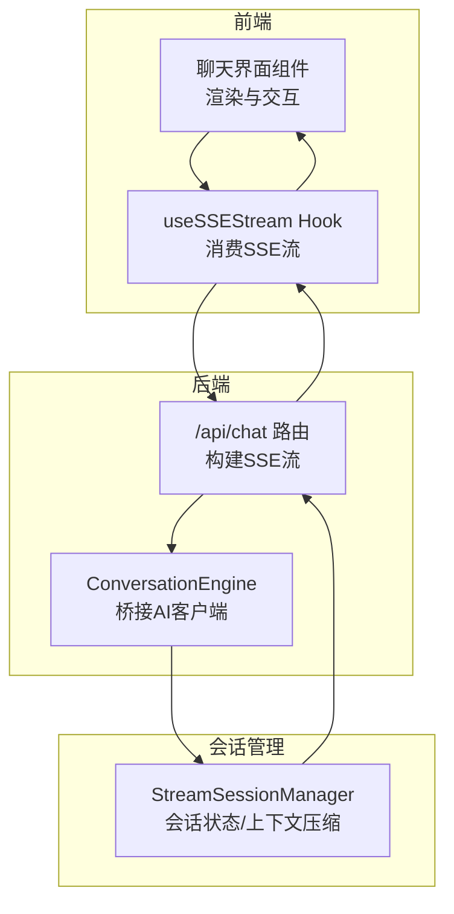
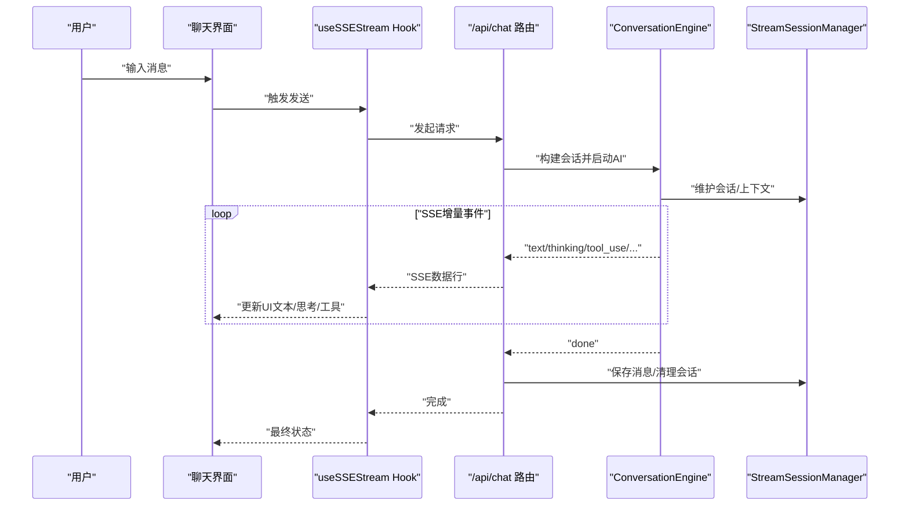
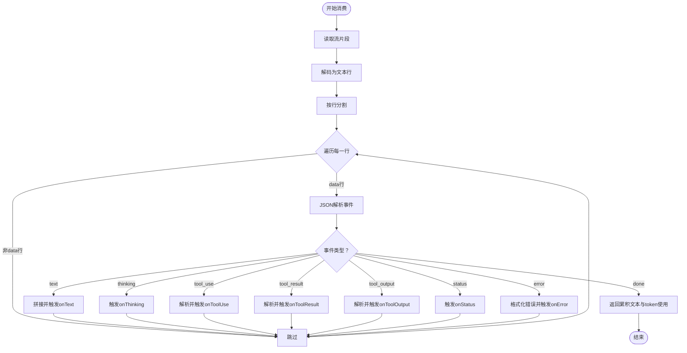
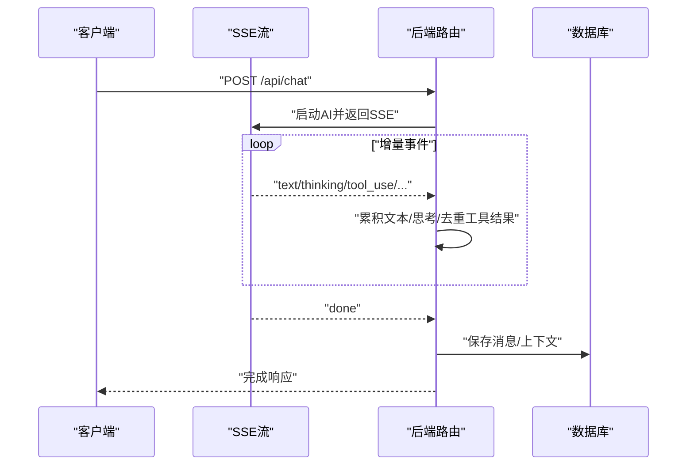
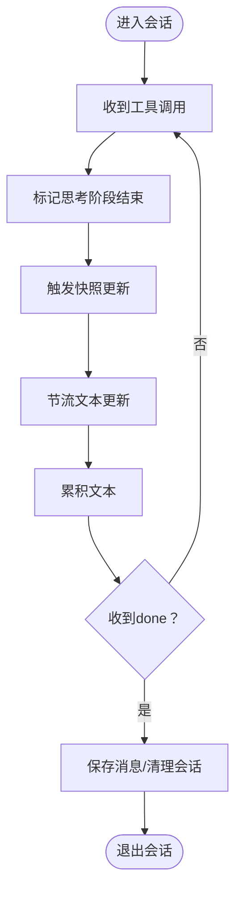
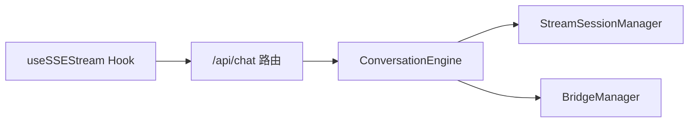

# 聊天对话系统

<cite>
**本文引用的文件**
- [src/app/api/chat/route.ts](file://src/app/api/chat/route.ts)
- [src/hooks/useSSEStream.ts](file://src/hooks/useSSEStream.ts)
- [src/lib/stream-session-manager.ts](file://src/lib/stream-session-manager.ts)
- [src/lib/bridge/conversation-engine.ts](file://src/lib/bridge/conversation-engine.ts)
- [src/lib/bridge/bridge-manager.ts](file://src/lib/bridge/bridge-manager.ts)
- [src/__tests__/unit/sse-stream.test.ts](file://src/__tests__/unit/sse-stream.test.ts)
- [src/__tests__/unit/codex-proxy-error-visibility.test.ts](file://src/__tests__/unit/codex-proxy-error-visibility.test.ts)
- [src/__tests__/unit/session-runtime-immunity.test.ts](file://src/__tests__/unit/session-runtime-immunity.test.ts)
- [src/__tests__/unit/stream-result-error-guard.test.ts](file://src/__tests__/unit/stream-result-error-guard.test.ts)
</cite>

## 目录
1. [引言](#引言)
2. [项目结构](#项目结构)
3. [核心组件](#核心组件)
4. [架构总览](#架构总览)
5. [详细组件分析](#详细组件分析)
6. [依赖关系分析](#依赖关系分析)
7. [性能考虑](#性能考虑)
8. [故障排查指南](#故障排查指南)
9. [结论](#结论)
10. [附录](#附录)

## 引言
本文件面向“聊天对话系统”的前端与后端实现，聚焦以下主题：
- 聊天界面组件架构与消息渲染流程
- 消息处理逻辑与实时响应（SSE）机制
- 会话管理与上下文压缩、历史记录持久化
- 与 AI 客户端的集成方式与错误处理
- 性能优化策略与用户体验改进方案

目标是帮助开发者与产品人员快速理解系统如何从用户输入到实时流式输出、再到最终消息落库的全链路。

## 项目结构
聊天系统主要由三部分构成：
- 前端 Hook：负责消费 SSE 流、分发事件回调、驱动 UI 更新
- 后端路由：接收请求、调用 AI 客户端、以 SSE 形式返回增量数据
- 会话管理器：维护会话状态、处理工具调用、错误与重试、上下文压缩

图表来源
- [src/hooks/useSSEStream.ts:457-495](file://src/hooks/useSSEStream.ts#L457-L495)
- [src/app/api/chat/route.ts:763-795](file://src/app/api/chat/route.ts#L763-L795)
- [src/lib/bridge/conversation-engine.ts:313-354](file://src/lib/bridge/conversation-engine.ts#L313-L354)
- [src/lib/stream-session-manager.ts:484-519](file://src/lib/stream-session-manager.ts#L484-L519)

章节来源
- [src/hooks/useSSEStream.ts:457-495](file://src/hooks/useSSEStream.ts#L457-L495)
- [src/app/api/chat/route.ts:763-795](file://src/app/api/chat/route.ts#L763-L795)
- [src/lib/bridge/conversation-engine.ts:313-354](file://src/lib/bridge/conversation-engine.ts#L313-L354)
- [src/lib/stream-session-manager.ts:484-519](file://src/lib/stream-session-manager.ts#L484-L519)

## 核心组件
- useSSEStream Hook：稳定地消费可读流，解析 SSE 事件，按类型分发回调（文本、思考、工具调用、工具结果、状态、错误等），并支持节流与去重。
- /api/chat 路由：接收请求参数，构造会话上下文，调用 AI 客户端，将响应以 SSE 形式流式返回；在流结束时进行落库与清理。
- ConversationEngine：桥接层，将 AI 客户端的增量输出转换为内容块（文本/思考/工具），并支持预览文本更新。
- StreamSessionManager：会话生命周期管理，处理工具调用、上下文压缩、错误码透传、结果保存与清理。

章节来源
- [src/hooks/useSSEStream.ts:131-407](file://src/hooks/useSSEStream.ts#L131-L407)
- [src/app/api/chat/route.ts:763-795](file://src/app/api/chat/route.ts#L763-L795)
- [src/lib/bridge/conversation-engine.ts:313-354](file://src/lib/bridge/conversation-engine.ts#L313-L354)
- [src/lib/stream-session-manager.ts:484-519](file://src/lib/stream-session-manager.ts#L484-L519)

## 架构总览
下图展示了从前端到后端、再到会话管理与 AI 客户端的整体交互：

图表来源
- [src/hooks/useSSEStream.ts:413-451](file://src/hooks/useSSEStream.ts#L413-L451)
- [src/app/api/chat/route.ts:763-795](file://src/app/api/chat/route.ts#L763-L795)
- [src/lib/bridge/conversation-engine.ts:313-354](file://src/lib/bridge/conversation-engine.ts#L313-L354)
- [src/lib/stream-session-manager.ts:484-519](file://src/lib/stream-session-manager.ts#L484-L519)

## 详细组件分析

### 组件一：SSE 流消费与事件分发（useSSEStream）
- 功能要点
  - 解析可读流中的每行数据，识别以"data: "开头的 SSE 行
  - 将事件按类型分发至回调：onText、onThinking、onToolUse、onToolResult、onStatus、onError 等
  - 支持 onResult 回调中携带 token 使用统计
  - 通过 ref 包装回调，避免闭包捕获旧回调导致的事件丢失
  - 对于工具调用与工具结果，进行 JSON 解析与容错处理
- 关键行为
  - 文本事件：拼接到累积字符串并触发 onText
  - 思考事件：仅触发 onThinking，不改变累积文本
  - 工具事件：解析并触发 onToolUse
  - 工具结果事件：解析并触发 onToolResult
  - 错误事件：格式化错误显示并触发 onError
  - 结束事件：返回最终累积文本与 token 使用

图表来源
- [src/hooks/useSSEStream.ts:131-407](file://src/hooks/useSSEStream.ts#L131-L407)
- [src/hooks/useSSEStream.ts:413-451](file://src/hooks/useSSEStream.ts#L413-L451)

章节来源
- [src/hooks/useSSEStream.ts:131-407](file://src/hooks/useSSEStream.ts#L131-L407)
- [src/hooks/useSSEStream.ts:413-451](file://src/hooks/useSSEStream.ts#L413-L451)
- [src/hooks/useSSEStream.ts:457-495](file://src/hooks/useSSEStream.ts#L457-L495)

### 组件二：后端 SSE 路由与消息落库
- 功能要点
  - 从 SSE 流中读取增量事件，维护累积文本与思考内容
  - 对工具调用进行去重（基于工具 use id）
  - 在流结束后，将消息写入数据库，并清理会话状态
  - 对错误进行标记与透传，确保 UI 与服务端一致的错误呈现
- 关键行为
  - 逐行解析 data: JSON，区分事件类型
  - 文本与思考内容分别累积，支持思考阶段分隔符
  - 工具结果事件用于补充消息内容或媒体
  - 最终保存消息并触发清理

图表来源
- [src/app/api/chat/route.ts:763-795](file://src/app/api/chat/route.ts#L763-L795)

章节来源
- [src/app/api/chat/route.ts:763-795](file://src/app/api/chat/route.ts#L763-L795)

### 组件三：会话管理与上下文压缩（StreamSessionManager）
- 功能要点
  - 维护会话状态、活跃标记、思考阶段控制
  - 处理工具调用与结果，支持节流与快照更新
  - 在工具调用后触发思考阶段重置，保证 UI 只显示当前阶段
  - 对错误进行分类与透传，支持特定错误码（如无效会话提供方）的分支处理
- 关键行为
  - onText/onThinking/onToolUse/onToolResult 回调驱动状态更新
  - 思考阶段结束标志位用于分隔不同阶段的思考内容
  - 错误码透传到抛出的 Error 对象，便于上层分支处理

图表来源
- [src/lib/stream-session-manager.ts:484-519](file://src/lib/stream-session-manager.ts#L484-L519)

章节来源
- [src/lib/stream-session-manager.ts:484-519](file://src/lib/stream-session-manager.ts#L484-L519)

### 组件四：桥接层（ConversationEngine）
- 功能要点
  - 将 AI 客户端的增量输出转换为内容块（文本/思考/工具）
  - 支持预览文本更新（onPartialText）
  - 在遇到非空文本时，将累积文本写入内容块并清空缓冲
- 关键行为
  - 思考事件：追加到最后一个思考块
  - 文本事件：拼接到 currentText，并在需要时触发预览
  - 工具事件：在当前文本块之后插入工具调用块

章节来源
- [src/lib/bridge/conversation-engine.ts:313-354](file://src/lib/bridge/conversation-engine.ts#L313-L354)

### 组件五：渠道适配与渲染（BridgeManager）
- 功能要点
  - 针对不同渠道（如 Telegram、Discord）进行 Markdown 到目标格式的转换与分片
  - 将渲染后的响应通过适配器投递
- 关键行为
  - Telegram：Markdown → HTML 分块投递
  - Discord：原生 Markdown，按字符数分块并修复围栏

章节来源
- [src/lib/bridge/bridge-manager.ts:92-132](file://src/lib/bridge/bridge-manager.ts#L92-L132)

## 依赖关系分析
- 前端 Hook 依赖后端路由提供的 SSE 数据
- 后端路由依赖 ConversationEngine 生成的内容块与事件
- ConversationEngine 依赖 StreamSessionManager 提供的会话状态与上下文
- BridgeManager 依赖 ConversationEngine 的内容块进行渠道渲染

图表来源
- [src/hooks/useSSEStream.ts:457-495](file://src/hooks/useSSEStream.ts#L457-L495)
- [src/app/api/chat/route.ts:763-795](file://src/app/api/chat/route.ts#L763-L795)
- [src/lib/bridge/conversation-engine.ts:313-354](file://src/lib/bridge/conversation-engine.ts#L313-L354)
- [src/lib/stream-session-manager.ts:484-519](file://src/lib/stream-session-manager.ts#L484-L519)
- [src/lib/bridge/bridge-manager.ts:92-132](file://src/lib/bridge/bridge-manager.ts#L92-L132)

章节来源
- [src/hooks/useSSEStream.ts:457-495](file://src/hooks/useSSEStream.ts#L457-L495)
- [src/app/api/chat/route.ts:763-795](file://src/app/api/chat/route.ts#L763-L795)
- [src/lib/bridge/conversation-engine.ts:313-354](file://src/lib/bridge/conversation-engine.ts#L313-L354)
- [src/lib/stream-session-manager.ts:484-519](file://src/lib/stream-session-manager.ts#L484-L519)
- [src/lib/bridge/bridge-manager.ts:92-132](file://src/lib/bridge/bridge-manager.ts#L92-L132)

## 性能考虑
- 流式渲染与节流
  - 前端对 onText 进行节流，避免频繁重渲染
  - 通过“思考阶段”控制，仅显示当前阶段的思考内容，减少 UI 抖动
- 上下文压缩与清理
  - 会话管理器在工具调用后重置思考累积，降低内存占用
  - 对工具结果进行去重，避免重复保存与渲染
- 渲染分片
  - 不同渠道对长文本进行分片与格式转换，提升传输与渲染效率
- 错误快速失败
  - 对错误事件进行格式化并提前返回，避免无意义的后续处理

## 故障排查指南
- 错误事件格式一致性
  - 服务端与客户端均使用统一的错误前缀格式，确保刷新后对话一致
- 错误码透传
  - 后端在抛出异常前将错误码附加到 Error 对象，便于上层分支处理（如无效会话提供方）
- 结果发射保护
  - 成功回合的 SDK 会话 ID 仅在未发出结果时清除，避免重复发射
- 上下文压缩通知
  - 通过 status 事件携带压缩统计，前端可据此提示用户

章节来源
- [src/__tests__/unit/codex-proxy-error-visibility.test.ts:53-76](file://src/__tests__/unit/codex-proxy-error-visibility.test.ts#L53-L76)
- [src/__tests__/unit/session-runtime-immunity.test.ts:695-722](file://src/__tests__/unit/session-runtime-immunity.test.ts#L695-L722)
- [src/__tests__/unit/stream-result-error-guard.test.ts:62-83](file://src/__tests__/unit/stream-result-error-guard.test.ts#L62-L83)
- [src/__tests__/unit/sse-stream.test.ts:210-240](file://src/__tests__/unit/sse-stream.test.ts#L210-L240)

## 结论
该聊天系统通过“前端 Hook + 后端路由 + 会话管理器 + 桥接层”的分层设计，实现了从输入到流式输出再到持久化的完整闭环。SSE 事件的标准化与去重、思考阶段的分隔、工具调用的节流与快照更新，共同保障了实时性与稳定性。配合渠道适配与上下文压缩，系统在复杂多轮对话场景下仍能保持良好的性能与用户体验。

## 附录
- 实际代码示例路径（不展示具体代码内容）
  - 发送消息与接收流式响应的完整流程参考：
    - [src/hooks/useSSEStream.ts:413-451](file://src/hooks/useSSEStream.ts#L413-L451)
    - [src/app/api/chat/route.ts:763-795](file://src/app/api/chat/route.ts#L763-L795)
  - 会话管理与上下文压缩：
    - [src/lib/stream-session-manager.ts:484-519](file://src/lib/stream-session-manager.ts#L484-L519)
  - 桥接层内容块构建与预览：
    - [src/lib/bridge/conversation-engine.ts:313-354](file://src/lib/bridge/conversation-engine.ts#L313-L354)
  - 渠道渲染适配：
    - [src/lib/bridge/bridge-manager.ts:92-132](file://src/lib/bridge/bridge-manager.ts#L92-L132)
  - 单元测试验证（事件格式、错误一致性、结果保护、上下文压缩）：
    - [src/__tests__/unit/sse-stream.test.ts:210-240](file://src/__tests__/unit/sse-stream.test.ts#L210-L240)
    - [src/__tests__/unit/codex-proxy-error-visibility.test.ts:53-76](file://src/__tests__/unit/codex-proxy-error-visibility.test.ts#L53-L76)
    - [src/__tests__/unit/session-runtime-immunity.test.ts:695-722](file://src/__tests__/unit/session-runtime-immunity.test.ts#L695-L722)
    - [src/__tests__/unit/stream-result-error-guard.test.ts:62-83](file://src/__tests__/unit/stream-result-error-guard.test.ts#L62-L83)