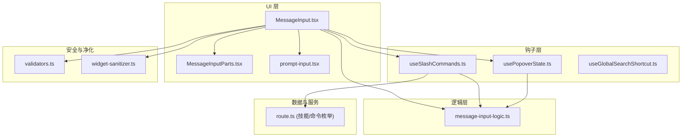
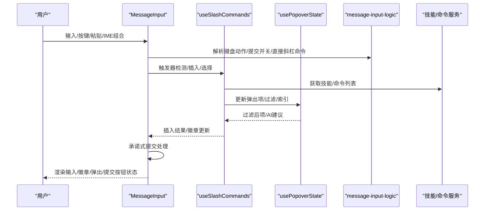
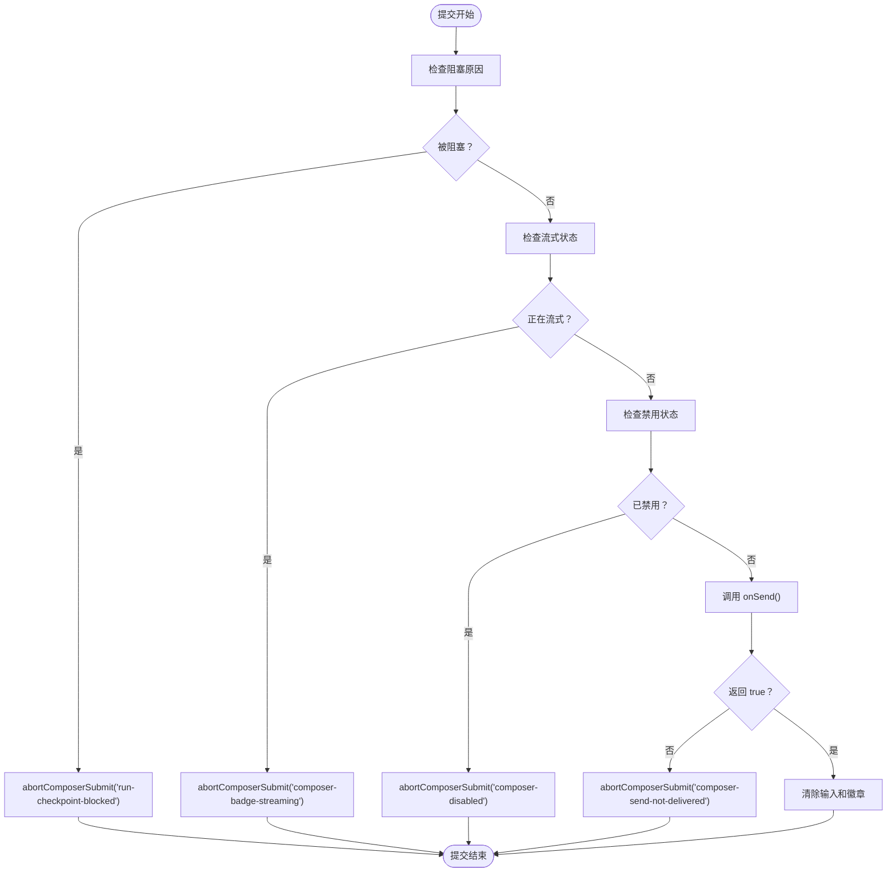
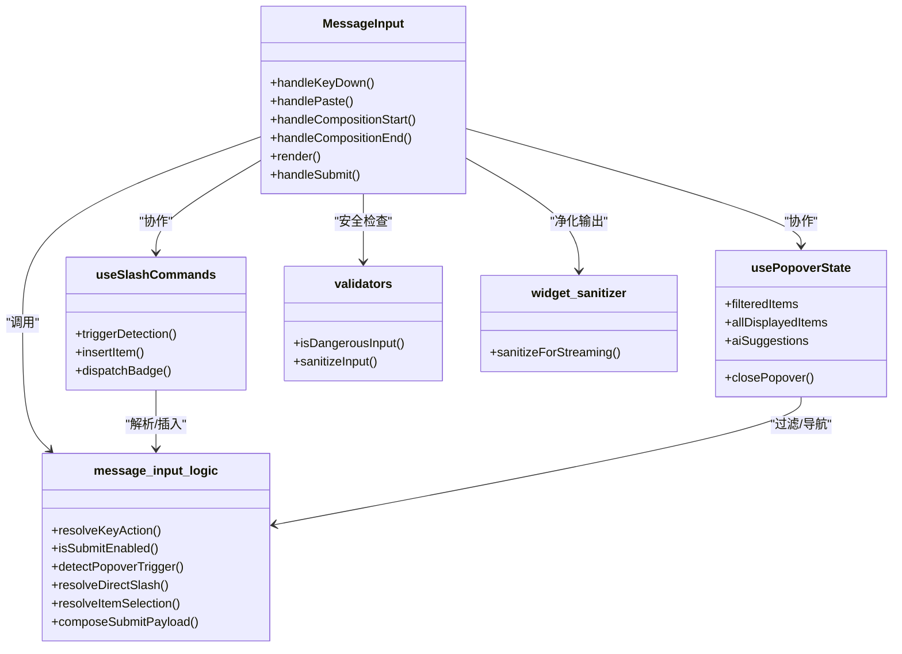

# 输入交互处理

<cite>
**本文引用的文件**
- [message-input-logic.ts](file://src/lib/message-input-logic.ts)
- [MessageInput.tsx](file://src/components/chat/MessageInput.tsx)
- [MessageInputParts.tsx](file://src/components/chat/MessageInputParts.tsx)
- [useSlashCommands.ts](file://src/hooks/useSlashCommands.ts)
- [usePopoverState.ts](file://src/hooks/usePopoverState.ts)
- [useGlobalSearchShortcut.ts](file://src/hooks/useGlobalSearchShortcut.ts)
- [prompt-input.tsx](file://src/components/ai-elements/prompt-input.tsx)
- [validators.ts](file://src/lib/bridge/security/validators.ts)
- [widget-sanitizer.ts](file://src/lib/widget-sanitizer.ts)
- [message-input-interactions.test.ts](file://src/__tests__/unit/message-input-interactions.test.ts)
- [chat.spec.ts](file://src/__tests__/e2e/chat.spec.ts)
- [route.ts](file://src/app/api/skills/route.ts)
</cite>

## 更新摘要
**所做更改**
- 新增承诺式提交方法和 abortComposerSubmit 函数的实现分析
- 更新提交流程和错误处理机制
- 增强输入状态管理和用户体验优化
- 完善截图保存系统的重新设计说明

## 目录
1. [引言](#引言)
2. [项目结构](#项目结构)
3. [核心组件](#核心组件)
4. [架构总览](#架构总览)
5. [详细组件分析](#详细组件分析)
6. [依赖关系分析](#依赖关系分析)
7. [性能考量](#性能考量)
8. [故障排查指南](#故障排查指南)
9. [结论](#结论)
10. [附录](#附录)

## 引言
本文件系统性梳理输入交互处理的实现，覆盖消息输入框、命令解析、快捷键处理、输入验证、自动完成与智能提示、特殊命令与参数解析、输入状态管理与焦点控制、用户体验优化、输入限制与安全过滤以及性能考虑。文档以代码级分析为主，并辅以可视化图示帮助理解。

**更新** 本次更新重点关注截图保存系统的重新设计，包括 MessageInput.tsx 中的承诺式提交方法和 abortComposerSubmit 函数的实现，确保用户输入不会在提交被阻止时丢失。

## 项目结构
输入交互处理涉及多个层次：UI 组件负责呈现与事件捕获；逻辑层封装输入状态、键盘动作解析、提交开关与弹出选择器行为；钩子层协调弹出面板、过滤与 AI 建议；安全层对输入进行危险模式检测与净化；测试用例覆盖关键交互行为与边界条件。



**图表来源**
- [MessageInput.tsx](file://src/components/chat/MessageInput.tsx)
- [message-input-logic.ts](file://src/lib/message-input-logic.ts)
- [useSlashCommands.ts](file://src/hooks/useSlashCommands.ts)
- [usePopoverState.ts](file://src/hooks/usePopoverState.ts)
- [prompt-input.tsx](file://src/components/ai-elements/prompt-input.tsx)
- [validators.ts](file://src/lib/bridge/security/validators.ts)
- [widget-sanitizer.ts](file://src/lib/widget-sanitizer.ts)
- [route.ts](file://src/app/api/skills/route.ts)

**章节来源**
- [MessageInput.tsx](file://src/components/chat/MessageInput.tsx)
- [message-input-logic.ts](file://src/lib/message-input-logic.ts)
- [useSlashCommands.ts](file://src/hooks/useSlashCommands.ts)
- [usePopoverState.ts](file://src/hooks/usePopoverState.ts)
- [prompt-input.tsx](file://src/components/ai-elements/prompt-input.tsx)
- [validators.ts](file://src/lib/bridge/security/validators.ts)
- [widget-sanitizer.ts](file://src/lib/widget-sanitizer.ts)
- [route.ts](file://src/app/api/skills/route.ts)

## 核心组件
- 消息输入框与提交按钮：负责文本输入、快捷键、粘贴、组合输入（IME）等事件处理，以及在流式响应期间切换为"停止"按钮。**新增承诺式提交机制**确保提交被阻止时用户输入不会丢失。
- 命令徽章与触发器：支持"/"直接命令、技能命令、文件提及等，通过徽章承载非即时命令，避免重复输入。
- 弹出选择器与智能建议：根据输入上下文触发技能/文件/CLI 等模式，支持键盘导航、AI 语义建议与防抖。
- 键盘动作解析：统一将按键映射到具体动作（如导航、选择、关闭、移除徽章等），保证一致的交互体验。
- 提交开关逻辑：综合输入内容、徽章、文件与流式状态决定是否启用提交或停止按钮。
- 安全与净化：对输入进行长度、危险模式检测与净化，保障运行时安全。

**章节来源**
- [MessageInput.tsx](file://src/components/chat/MessageInput.tsx)
- [MessageInputParts.tsx](file://src/components/chat/MessageInputParts.tsx)
- [message-input-logic.ts](file://src/lib/message-input-logic.ts)
- [useSlashCommands.ts](file://src/hooks/useSlashCommands.ts)
- [usePopoverState.ts](file://src/hooks/usePopoverState.ts)
- [validators.ts](file://src/lib/bridge/security/validators.ts)
- [widget-sanitizer.ts](file://src/lib/widget-sanitizer.ts)

## 架构总览
输入交互处理采用"组件-逻辑-钩子-安全"的分层设计。UI 组件负责事件与状态呈现，逻辑层提供纯函数式的解析与决策，钩子层协调外部状态与副作用，安全层贯穿输入生命周期。



**图表来源**
- [MessageInput.tsx](file://src/components/chat/MessageInput.tsx)
- [message-input-logic.ts](file://src/lib/message-input-logic.ts)
- [useSlashCommands.ts](file://src/hooks/useSlashCommands.ts)
- [usePopoverState.ts](file://src/hooks/usePopoverState.ts)
- [route.ts](file://src/app/api/skills/route.ts)

## 详细组件分析

### 消息输入框与事件处理
- 事件绑定：监听组合输入开始/结束、粘贴、键盘按下、受控/非受控值同步。
- 流式状态：当处于流式响应时，提交按钮替换为"停止"，禁用输入框并允许中断。
- 焦点控制：在弹出面板打开/关闭时维持焦点一致性，避免意外失焦导致的交互中断。
- 用户体验：支持 Shift+Enter 换行、全局搜索快捷键（Cmd/Ctrl+K）从任意位置唤起。

**章节来源**
- [prompt-input.tsx](file://src/components/ai-elements/prompt-input.tsx)
- [useGlobalSearchShortcut.ts](file://src/hooks/useGlobalSearchShortcut.ts)
- [chat.spec.ts:104-104](file://src/__tests__/e2e/chat.spec.ts#L104-L104)

### 承诺式提交方法与错误处理
**新增** MessageInput.tsx 实现了承诺式提交机制，通过 abortComposerSubmit 函数确保提交被阻止时用户输入不会丢失。

- abortComposerSubmit 函数：抛出包含原因的错误，阻止 PromptInput 清除用户文本和附件
- 提交前验证：检查运行检查点阻塞、流式状态、禁用状态、提供程序加载状态
- 提交后处理：等待 onSend 返回值，如果返回 false 则再次触发 abortComposerSubmit
- 截图保护：通过承诺式处理确保用户输入不会被"吃掉"（#615 截图问题）



**图表来源**
- [MessageInput.tsx:60-70](file://src/components/chat/MessageInput.tsx#L60-L70)
- [MessageInput.tsx:503-713](file://src/components/chat/MessageInput.tsx#L503-L713)

**章节来源**
- [MessageInput.tsx:60-70](file://src/components/chat/MessageInput.tsx#L60-L70)
- [MessageInput.tsx:503-713](file://src/components/chat/MessageInput.tsx#L503-L713)

### 命令解析与徽章系统
- 直接斜杠命令：以"/"开头的命令在提交时立即识别，区分即时命令与需要以徽章形式保留的命令。
- 技能命令与文件提及：通过"/"或"@"触发器进入弹出选择器，选择后以徽章或文本片段插入。
- 徽章渲染：支持多种命令类型（SDK、CodePilot 等），提供可移除的 UI 片段，便于批量操作与快速清理。

```mermaid
flowchart TD
Start(["输入变化"]) --> Detect["检测触发器<br/>\"/\" 或 \"@\""]
Detect --> Mode{"模式？"}
Mode --> |"/"| Slash["斜杠命令模式"]
Mode --> |"@"| Mention["文件提及模式"]
Slash --> Picker["弹出命令选择器"]
Mention --> Picker
Picker --> Select{"选择项"}
Select --> |即时命令| Immediate["立即执行"]
Select --> |非即时命令| Badge["生成徽章"]
Badge --> Insert["插入到输入中"]
Insert --> Submit["等待提交"]
Immediate --> Submit
```

**图表来源**
- [message-input-logic.ts:59-162](file://src/lib/message-input-logic.ts#L59-L162)
- [MessageInputParts.tsx:316-326](file://src/components/chat/MessageInputParts.tsx#L316-L326)

**章节来源**
- [message-input-logic.ts:286-310](file://src/lib/message-input-logic.ts#L286-L310)
- [MessageInputParts.tsx:316-326](file://src/components/chat/MessageInputParts.tsx#L316-L326)
- [route.ts:285-318](file://src/app/api/skills/route.ts#L285-L318)

### 快捷键处理机制
- 键盘动作解析：根据当前弹出面板状态与输入内容，将 ArrowUp/ArrowDown/Enter/Tab/Escape 等映射为导航、选择、关闭或移除徽章等动作。
- 全局搜索快捷键：在任意页面（含输入框）按 Cmd/Ctrl+K 打开全局搜索，阻止默认行为避免页面跳转。
- CLI 弹出面板：对 CLI 模式下的 Esc 进行特殊处理，确保只关闭面板而非误触其他逻辑。

**章节来源**
- [message-input-logic.ts:244-284](file://src/lib/message-input-logic.ts#L244-L284)
- [useGlobalSearchShortcut.ts:1-20](file://src/hooks/useGlobalSearchShortcut.ts#L1-L20)

### 输入验证、自动完成与智能提示
- 危险输入检测：检查超长、空字节、路径穿越、命令注入等危险模式，必要时拒绝或告警。
- 文本净化：对流式预览场景剥离脚本、事件处理器、危险 URL 等，确保安全输出。
- 自动完成与智能建议：基于子串匹配优先，不足时触发防抖的 AI 语义搜索，合并内置与外部项供键盘导航。
- 过滤与索引：弹出项按名称/描述/标签等字段过滤，支持键盘在混合列表中循环导航。

**章节来源**
- [validators.ts:76-97](file://src/lib/bridge/security/validators.ts#L76-L97)
- [widget-sanitizer.ts:44-64](file://src/lib/widget-sanitizer.ts#L44-L64)
- [usePopoverState.ts:55-151](file://src/hooks/usePopoverState.ts#L55-L151)

### 特殊命令处理、参数解析与执行流程
- 内置命令集合：定义即时命令与非即时命令，前者在提交时直接执行，后者以徽章形式保留以便后续执行。
- 参数解析：通过徽章携带命令与描述信息，结合上下文拼接最终提示词或执行体。
- 执行流程：徽章点击或提交时，根据命令类型路由到对应执行器（SDK、Agent、CodePilot 等）。

**章节来源**
- [message-input-logic.ts:286-310](file://src/lib/message-input-logic.ts#L286-L310)
- [route.ts:285-318](file://src/app/api/skills/route.ts#L285-L318)

### 输入状态管理、焦点控制与用户体验优化
- 状态聚合：输入值、徽章列表、文件附件、流式状态、禁用标志等共同决定提交按钮可用性。
- 提交开关：空输入且无徽章/文件时禁用；流式时始终启用（显示停止按钮）；禁用标志具有最高优先级。
- 焦点策略：打开弹出面板时将焦点锁定在输入框；点击外部关闭面板；Esc 关闭面板并恢复焦点。
- 无障碍：为徽章移除按钮提供 ARIA 标签，确保键盘可达性与屏幕阅读器友好。

**章节来源**
- [message-input-logic.ts:228-242](file://src/lib/message-input-logic.ts#L228-L242)
- [usePopoverState.ts:160-169](file://src/hooks/usePopoverState.ts#L160-L169)
- [MessageInputParts.tsx:297-307](file://src/components/chat/MessageInputParts.tsx#L297-L307)

### 性能考虑
- 防抖与取消：AI 语义搜索使用定时器与 AbortController，避免频繁请求与资源浪费。
- 列表合并：将子串匹配与 AI 建议合并为单一可导航列表，减少重复计算。
- 最大长度与截断：对输入进行最大长度限制与截断标记，防止异常输入影响性能。
- 组合输入：正确处理 IME 组合阶段，避免中间态触发不必要的重排与校验。

**章节来源**
- [usePopoverState.ts:138-151](file://src/hooks/usePopoverState.ts#L138-L151)
- [validators.ts:104-107](file://src/lib/bridge/security/validators.ts#L104-L107)

## 依赖关系分析



**图表来源**
- [MessageInput.tsx](file://src/components/chat/MessageInput.tsx)
- [message-input-logic.ts](file://src/lib/message-input-logic.ts)
- [useSlashCommands.ts](file://src/hooks/useSlashCommands.ts)
- [usePopoverState.ts](file://src/hooks/usePopoverState.ts)
- [validators.ts](file://src/lib/bridge/security/validators.ts)
- [widget-sanitizer.ts](file://src/lib/widget-sanitizer.ts)

**章节来源**
- [MessageInput.tsx](file://src/components/chat/MessageInput.tsx)
- [message-input-logic.ts](file://src/lib/message-input-logic.ts)
- [useSlashCommands.ts](file://src/hooks/useSlashCommands.ts)
- [usePopoverState.ts](file://src/hooks/usePopoverState.ts)
- [validators.ts](file://src/lib/bridge/security/validators.ts)
- [widget-sanitizer.ts](file://src/lib/widget-sanitizer.ts)

## 性能考量
- 防抖与取消：对 AI 建议的搜索设置 500ms 防抖，及时取消上一次请求，避免竞态与资源浪费。
- 过滤与缓存：子串过滤结果稳定复用，仅在输入或列表变更时重新计算。
- 最大长度与截断：对输入进行长度限制与截断标记，降低后续处理成本。
- 组合输入：正确处理 IME 组合阶段，避免中间态触发不必要的重排与校验。

[本节为通用指导，无需特定文件来源]

## 故障排查指南
- 提交按钮不可用：检查输入是否为空、是否存在徽章或文件附件、是否处于流式状态、是否被显式禁用。
- 弹出面板无法关闭：确认 Esc 是否被拦截、点击外部区域是否触发关闭、面板模式是否正确。
- 徽章未生效：确认命令是否为非即时命令、徽章是否正确插入、是否被移除。
- 危险输入被拒绝：检查输入长度、是否包含危险模式（路径穿越、命令注入等），必要时调整输入或联系管理员。
- 快捷键无效：确认是否在正确的平台（Mac/Windows）与组合键下触发，以及是否被其他组件拦截。
- **新增** 提交被阻止但输入丢失：检查 abortComposerSubmit 的调用是否正确，确认承诺式提交机制正常工作。

**章节来源**
- [message-input-interactions.test.ts:523-579](file://src/__tests__/unit/message-input-interactions.test.ts#L523-L579)
- [validators.ts:76-97](file://src/lib/bridge/security/validators.ts#L76-L97)

## 结论
输入交互处理通过清晰的分层设计与完善的逻辑抽象，实现了从事件捕获到命令执行的完整闭环。键盘动作解析、徽章系统、弹出选择器与智能建议、安全过滤与性能优化共同构成了高可用、易扩展的输入体验。

**更新** 本次更新特别强化了承诺式提交机制和错误处理流程，通过 abortComposerSubmit 函数确保用户输入在各种阻塞情况下都不会丢失，显著提升了用户体验和系统可靠性。建议在后续迭代中持续完善测试覆盖与性能监控，确保在复杂场景下的稳定性与流畅度。

## 附录
- 代码示例路径（不展示具体代码内容）：
  - [消息输入框主入口](file://src/components/chat/MessageInput.tsx)
  - [输入逻辑与键盘动作解析](file://src/lib/message-input-logic.ts)
  - [徽章渲染与移除](file://src/components/chat/MessageInputParts.tsx)
  - [斜杠命令与弹出选择器](file://src/hooks/useSlashCommands.ts)
  - [弹出面板状态与智能建议](file://src/hooks/usePopoverState.ts)
  - [全局搜索快捷键](file://src/hooks/useGlobalSearchShortcut.ts)
  - [Prompt 输入组件](file://src/components/ai-elements/prompt-input.tsx)
  - [危险输入检测与净化](file://src/lib/bridge/security/validators.ts)
  - [Widget 输出净化](file://src/lib/widget-sanitizer.ts)
  - [技能/命令枚举接口](file://src/app/api/skills/route.ts)
  - [单元测试：输入交互行为](file://src/__tests__/unit/message-input-interactions.test.ts)
  - [端到端测试：发送消息与停止按钮](file://src/__tests__/e2e/chat.spec.ts)