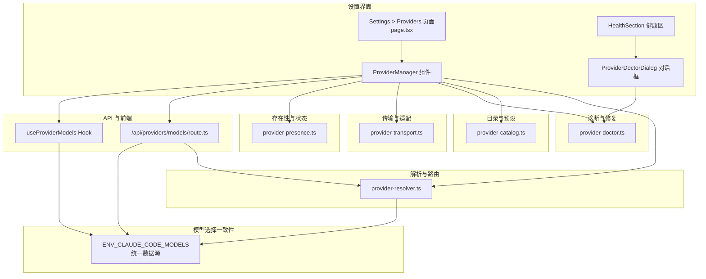
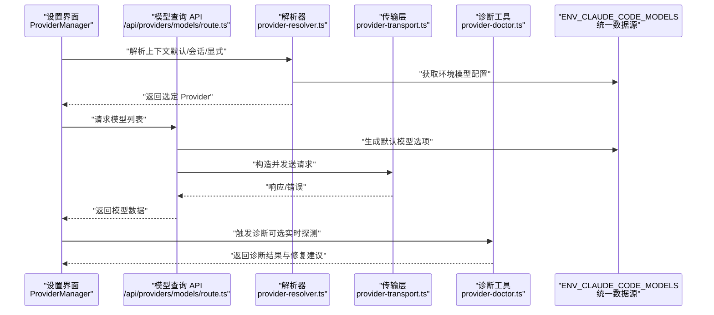
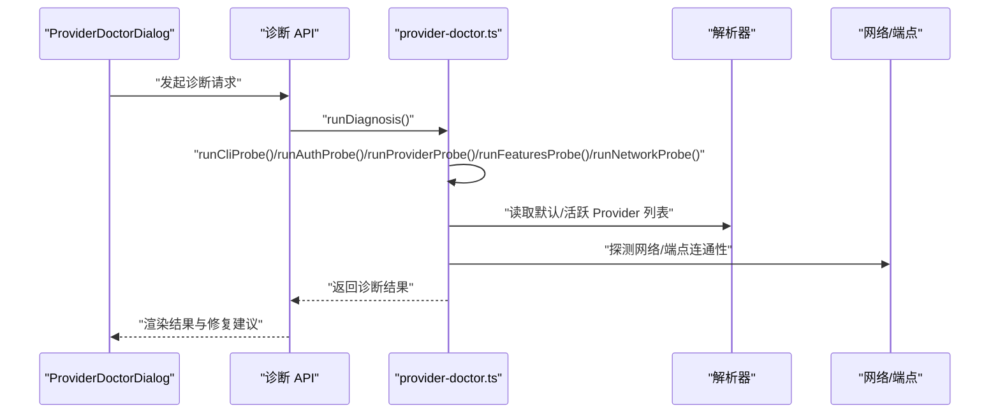
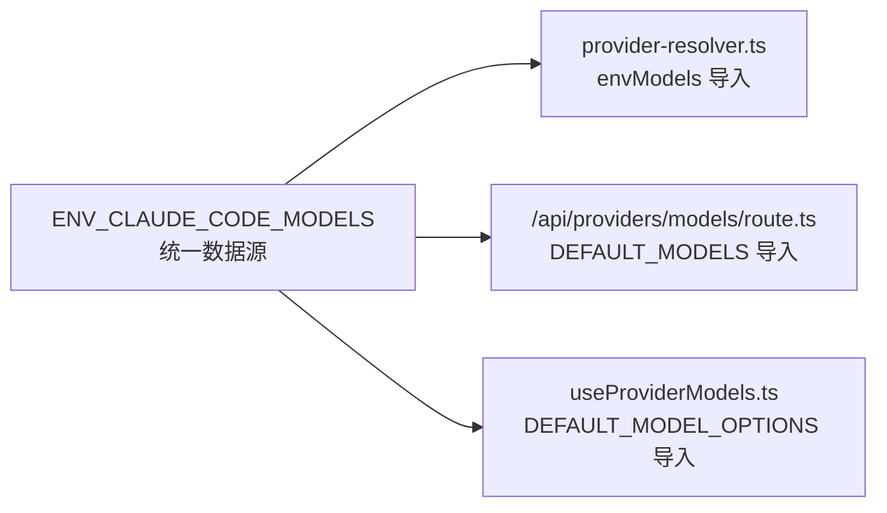
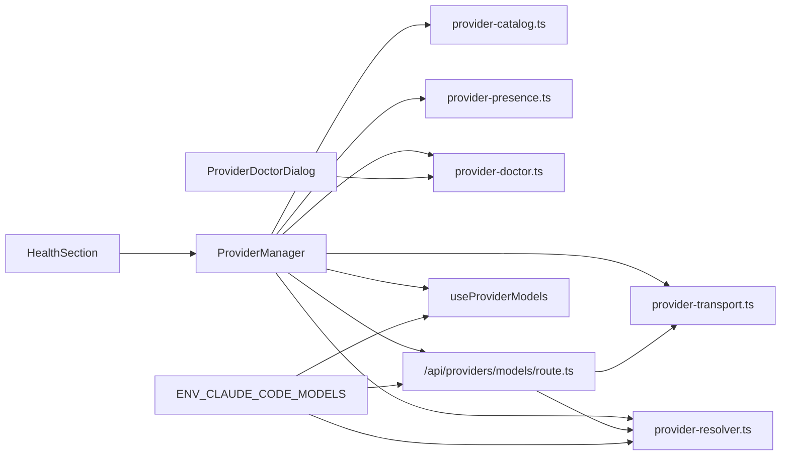

# Provider 管理

<cite>
**本文档引用的文件**
- [src/lib/provider-resolver.ts](file://src/lib/provider-resolver.ts)
- [src/lib/provider-catalog.ts](file://src/lib/provider-catalog.ts)
- [src/lib/provider-doctor.ts](file://src/lib/provider-doctor.ts)
- [src/lib/provider-transport.ts](file://src/lib/provider-transport.ts)
- [src/lib/provider-presence.ts](file://src/lib/provider-presence.ts)
- [src/app/settings/providers/page.tsx](file://src/app/settings/providers/page.tsx)
- [src/components/settings/ProviderManager.tsx](file://src/components/settings/ProviderManager.tsx)
- [src/components/settings/ProviderDoctorDialog.tsx](file://src/components/settings/ProviderDoctorDialog.tsx)
- [src/components/settings/HealthSection.tsx](file://src/components/settings/HealthSection.tsx)
- [src/app/api/providers/models/route.ts](file://src/app/api/providers/models/route.ts)
- [src/hooks/useProviderModels.ts](file://src/hooks/useProviderModels.ts)
- [src/__tests__/unit/stale-default-provider.test.ts](file://src/__tests__/unit/stale-default-provider.test.ts)
- [src/__tests__/unit/provider-resolver.test.ts](file://src/__tests__/unit/provider-resolver.test.ts)
- [src/__tests__/unit/env-models-single-source.test.ts](file://src/__tests__/unit/env-models-single-source.test.ts)
- [src/__tests__/unit/fable-5-model.test.ts](file://src/__tests__/unit/fable-5-model.test.ts)
- [src/__tests__/unit/opus-4-8-sonnet-4-6.test.ts](file://src/__tests__/unit/opus-4-8-sonnet-4-6.test.ts)
- [docs/guardrails/ProviderManagement.md](file://docs/guardrails/ProviderManagement.md)
</cite>

## 更新摘要
**所做更改**
- 新增模型选择一致性章节，详细说明 ENV_CLAUDE_CODE_MODELS 统一来源实现
- 更新 Provider 目录与预设章节，强调单一数据源的重要性
- 新增模型选择一致性测试章节，展示相关单元测试
- 更新架构图以反映模型选择一致性改进
- 新增模型别名映射与上游模型 ID 的统一管理机制

## 目录
1. [简介](#简介)
2. [项目结构](#项目结构)
3. [核心组件](#核心组件)
4. [架构总览](#架构总览)
5. [详细组件分析](#详细组件分析)
6. [模型选择一致性改进](#模型选择一致性改进)
7. [依赖关系分析](#依赖关系分析)
8. [性能考量](#性能考量)
9. [故障排查指南](#故障排查指南)
10. [结论](#结论)
11. [附录](#附录)

## 简介
本文件系统化阐述 CodePilot 中"Provider 管理"的设计与实现，覆盖以下主题：
- Provider 的注册、配置与管理机制
- Provider 的发现、验证与切换流程
- 认证管理、配额监控与性能统计
- 添加、配置与使用的完整流程示例路径
- Provider 的优先级、负载均衡与故障转移策略
- 扩展接口与自定义实现方式
- 健康检查、错误诊断与自动修复能力
- **新增** 模型选择一致性改进，包括 ENV_CLAUDE_CODE_MODELS 统一来源的实现

## 项目结构
围绕 Provider 的核心代码主要分布在以下模块：
- 解析与路由：provider-resolver.ts
- 预设与目录：provider-catalog.ts
- 诊断与修复：provider-doctor.ts
- 传输与适配：provider-transport.ts
- 存在性与状态：provider-presence.ts
- 设置界面与路由：settings/providers 页面、ProviderManager 组件
- 健康检查与诊断对话框：HealthSection、ProviderDoctorDialog
- 模型查询 API：/api/providers/models/route.ts
- 前端 Hook：useProviderModels
- **新增** 模型选择一致性：ENV_CLAUDE_CODE_MODELS 统一数据源

**图表来源**
- [src/app/settings/providers/page.tsx:1-7](file://src/app/settings/providers/page.tsx#L1-L7)
- [src/components/settings/ProviderManager.tsx](file://src/components/settings/ProviderManager.tsx)
- [src/components/settings/ProviderDoctorDialog.tsx:1-423](file://src/components/settings/ProviderDoctorDialog.tsx#L1-L423)
- [src/components/settings/HealthSection.tsx:107-140](file://src/components/settings/HealthSection.tsx#L107-L140)
- [src/lib/provider-resolver.ts](file://src/lib/provider-resolver.ts)
- [src/lib/provider-catalog.ts](file://src/lib/provider-catalog.ts)
- [src/lib/provider-doctor.ts:1031-1077](file://src/lib/provider-doctor.ts#L1031-L1077)
- [src/lib/provider-transport.ts](file://src/lib/provider-transport.ts)
- [src/lib/provider-presence.ts](file://src/lib/provider-presence.ts)
- [src/app/api/providers/models/route.ts](file://src/app/api/providers/models/route.ts)
- [src/hooks/useProviderModels.ts](file://src/hooks/useProviderModels.ts)
- [src/lib/provider-catalog.ts:401-414](file://src/lib/provider-catalog.ts#L401-L414)

**章节来源**
- [src/app/settings/providers/page.tsx:1-7](file://src/app/settings/providers/page.tsx#L1-L7)
- [src/components/settings/ProviderManager.tsx](file://src/components/settings/ProviderManager.tsx)
- [src/components/settings/ProviderDoctorDialog.tsx:1-423](file://src/components/settings/ProviderDoctorDialog.tsx#L1-L423)
- [src/components/settings/HealthSection.tsx:107-140](file://src/components/settings/HealthSection.tsx#L107-L140)
- [src/lib/provider-resolver.ts](file://src/lib/provider-resolver.ts)
- [src/lib/provider-catalog.ts](file://src/lib/provider-catalog.ts)
- [src/lib/provider-doctor.ts:1031-1077](file://src/lib/provider-doctor.ts#L1031-L1077)
- [src/lib/provider-transport.ts](file://src/lib/provider-transport.ts)
- [src/lib/provider-presence.ts](file://src/lib/provider-presence.ts)
- [src/app/api/providers/models/route.ts](file://src/app/api/providers/models/route.ts)
- [src/hooks/useProviderModels.ts](file://src/hooks/useProviderModels.ts)

## 核心组件
- Provider 解析器（provider-resolver.ts）
  - 负责根据上下文（全局默认、会话、显式请求）解析并选择合适的 Provider
  - 支持"默认 Provider""活跃 Provider""显式 ProviderId"等分支，并处理失效或停用的回退逻辑
  - **更新** 现在从 ENV_CLAUDE_CODE_MODELS 导入环境模型配置，确保与 API 和客户端保持一致
- Provider 目录（provider-catalog.ts）
  - 提供内置预设（如官方/第三方厂商模板），用于快速添加与配置
  - **新增** ENV_CLAUDE_CODE_MODELS 作为单一数据源，统一管理环境模型列表
  - 包含完整的模型别名映射和上游模型 ID 关系
- Provider 诊断（provider-doctor.ts）
  - 运行多类探测（CLI/鉴权/Provider/特性/网络），汇总严重度并生成修复建议
- Provider 传输（provider-transport.ts）
  - 将上层调用转换为具体协议（HTTP/WS/MCP 等）请求，负责重试、超时与错误映射
- Provider 存在性（provider-presence.ts）
  - 维护 Provider 的可用性状态与可见性，支持按需刷新与缓存
- 设置界面与路由
  - Settings > Providers 页面承载 Provider 管理入口；ProviderManager 负责增删改查与默认设置
  - ProviderDoctorDialog 展示诊断结果与一键修复操作
  - HealthSection 在健康面板中提示 Provider 连接状态
- 模型查询 API 与前端 Hook
  - /api/providers/models/route.ts 提供模型列表查询
  - **更新** 使用 ENV_CLAUDE_CODE_MODELS 生成默认模型选项，确保与解析器一致
  - useProviderModels Hook 用于在前端拉取与缓存模型数据

**章节来源**
- [src/lib/provider-resolver.ts](file://src/lib/provider-resolver.ts)
- [src/lib/provider-catalog.ts](file://src/lib/provider-catalog.ts)
- [src/lib/provider-doctor.ts:1031-1077](file://src/lib/provider-doctor.ts#L1031-L1077)
- [src/lib/provider-transport.ts](file://src/lib/provider-transport.ts)
- [src/lib/provider-presence.ts](file://src/lib/provider-presence.ts)
- [src/app/settings/providers/page.tsx:1-7](file://src/app/settings/providers/page.tsx#L1-L7)
- [src/components/settings/ProviderManager.tsx](file://src/components/settings/ProviderManager.tsx)
- [src/components/settings/ProviderDoctorDialog.tsx:1-423](file://src/components/settings/ProviderDoctorDialog.tsx#L1-L423)
- [src/components/settings/HealthSection.tsx:107-140](file://src/components/settings/HealthSection.tsx#L107-L140)
- [src/app/api/providers/models/route.ts](file://src/app/api/providers/models/route.ts)
- [src/hooks/useProviderModels.ts](file://src/hooks/useProviderModels.ts)

## 架构总览
Provider 管理的端到端流程包括：设置界面触发配置变更，解析器根据上下文选择 Provider，传输层执行请求，模型 API 返回数据，诊断工具进行健康检查与修复。**更新** 现在所有模型选择都基于 ENV_CLAUDE_CODE_MODELS 统一数据源。

**图表来源**
- [src/components/settings/ProviderManager.tsx](file://src/components/settings/ProviderManager.tsx)
- [src/app/api/providers/models/route.ts](file://src/app/api/providers/models/route.ts)
- [src/lib/provider-resolver.ts](file://src/lib/provider-resolver.ts)
- [src/lib/provider-transport.ts](file://src/lib/provider-transport.ts)
- [src/lib/provider-doctor.ts:1031-1077](file://src/lib/provider-doctor.ts#L1031-L1077)
- [src/lib/provider-catalog.ts:401-414](file://src/lib/provider-catalog.ts#L401-L414)

## 详细组件分析

### Provider 解析器（provider-resolver.ts）
职责与行为要点：
- 上下文解析
  - 优先级顺序：显式 providerId > 会话 providerId > 默认 providerId > 活跃 provider > 回退链
  - 显式请求绕过"is_active"过滤；会话 providerId 在 is_active=0 时触发回退；默认 providerId 即使 is_active=0 也应返回
- 回退策略
  - 当默认或会话 Provider 不存在或不可用时，按层级扫描其他 Provider
  - 对无效协议或异常数据进行安全过滤，避免污染枚举过程
- 会话与全局默认的隔离
  - 确保 session 上下文不会错误地绑定到全局默认 Provider 的小容量槽位（如 small/haiku）
- **更新** 环境模型配置
  - 现在从 ENV_CLAUDE_CODE_MODELS 导入环境模型配置，确保与 API 和客户端保持一致
  - 支持完整的模型别名映射和上游模型 ID 关系

**图表来源**
- [src/lib/provider-resolver.ts](file://src/lib/provider-resolver.ts)
- [src/__tests__/unit/stale-default-provider.test.ts:128-163](file://src/__tests__/unit/stale-default-provider.test.ts#L128-L163)
- [src/__tests__/unit/provider-resolver.test.ts:2371-2425](file://src/__tests__/unit/provider-resolver.test.ts#L2371-L2425)

**章节来源**
- [src/lib/provider-resolver.ts](file://src/lib/provider-resolver.ts)
- [src/__tests__/unit/stale-default-provider.test.ts:128-163](file://src/__tests__/unit/stale-default-provider.test.ts#L128-L163)
- [src/__tests__/unit/provider-resolver.test.ts:2371-2425](file://src/__tests__/unit/provider-resolver.test.ts#L2371-L2425)

### Provider 目录与预设（provider-catalog.ts）
- 提供内置厂商模板（preset），便于快速添加常见 Provider
- 与解析器配合，确保新增 Provider 的协议与模型映射正确
- 与设置界面联动，支持"添加服务"对话框中的预设选择
- **新增** ENV_CLAUDE_CODE_MODELS 作为单一数据源，统一管理环境模型列表
- 包含完整的模型别名映射和上游模型 ID 关系，确保所有消费者使用一致的配置

**章节来源**
- [src/lib/provider-catalog.ts](file://src/lib/provider-catalog.ts)
- [docs/guardrails/ProviderManagement.md:1-21](file://docs/guardrails/ProviderManagement.md#L1-L21)

### Provider 诊断与修复（provider-doctor.ts）
- 探测类型
  - CLI 健康、鉴权来源、Provider/模型、功能兼容性、网络/端点、实时连通性（可选）
- 诊断输出
  - 汇总严重度（ok/warn/error），列出具体发现（findings），并附带修复动作（repairActions）
- 修复建议
  - 设置默认 Provider、应用到会话、清理陈旧恢复状态、切换鉴权方式、重新导入环境配置等

**图表来源**
- [src/components/settings/ProviderDoctorDialog.tsx:1-423](file://src/components/settings/ProviderDoctorDialog.tsx#L1-L423)
- [src/lib/provider-doctor.ts:1031-1077](file://src/lib/provider-doctor.ts#L1031-L1077)
- [src/lib/provider-resolver.ts](file://src/lib/provider-resolver.ts)

**章节来源**
- [src/lib/provider-doctor.ts:40-1077](file://src/lib/provider-doctor.ts#L40-L1077)
- [src/components/settings/ProviderDoctorDialog.tsx:1-423](file://src/components/settings/ProviderDoctorDialog.tsx#L1-L423)

### Provider 传输与适配（provider-transport.ts）
- 负责将高层调用转换为具体协议请求（HTTP/WS/MCP 等）
- 实现重试、超时、错误映射与响应解析
- 与解析器协作，确保请求落到正确的 Provider

**章节来源**
- [src/lib/provider-transport.ts](file://src/lib/provider-transport.ts)

### Provider 存在性与状态（provider-presence.ts）
- 维护 Provider 的可用性状态与可见性
- 支持按需刷新与缓存，保障 UI 与解析器的数据一致性

**章节来源**
- [src/lib/provider-presence.ts](file://src/lib/provider-presence.ts)

### 设置界面与健康检查（settings/providers 与 HealthSection）
- Settings > Providers 页面承载 Provider 管理入口
- ProviderManager 负责增删改查、默认设置与预设选择
- HealthSection 在健康面板中提示 Provider 连接状态，引导用户前往 Providers

**章节来源**
- [src/app/settings/providers/page.tsx:1-7](file://src/app/settings/providers/page.tsx#L1-L7)
- [src/components/settings/HealthSection.tsx:107-140](file://src/components/settings/HealthSection.tsx#L107-L140)

### 模型查询 API 与前端 Hook
- /api/providers/models/route.ts 提供模型列表查询
- **更新** 使用 ENV_CLAUDE_CODE_MODELS 生成默认模型选项，确保与解析器一致
- useProviderModels Hook 用于在前端拉取与缓存模型数据，驱动 UI 渲染

**章节来源**
- [src/app/api/providers/models/route.ts](file://src/app/api/providers/models/route.ts)
- [src/hooks/useProviderModels.ts](file://src/hooks/useProviderModels.ts)

## 模型选择一致性改进

### ENV_CLAUDE_CODE_MODELS 统一数据源
**新增** CodePilot 在 2026 年 6 月实施了重要的模型选择一致性改进，消除了多个手动维护的模型列表副本：

#### 背景问题
在改进之前，环境模型列表存在三个独立的手工维护副本：
- provider-resolver.ts 中的 envModels
- /api/providers/models 路由中的 DEFAULT_MODELS + ENV_ALIAS_TO_UPSTREAM
- useProviderModels.ts 中的客户端 fallback

这些副本出现了漂移：解析器包含了 opus-4-8 + fable-5，而另外两份却缺少这些新模型，导致用户在模型选择器的 Claude Code 组里看不到新模型。

#### 解决方案
引入 ENV_CLAUDE_CODE_MODELS 作为单一真实来源，所有消费者都必须从这个导出派生，不再各自硬编码一份。

**图表来源**
- [src/lib/provider-catalog.ts:401-414](file://src/lib/provider-catalog.ts#L401-L414)
- [src/app/api/providers/models/route.ts:25-41](file://src/app/api/providers/models/route.ts#L25-L41)
- [src/hooks/useProviderModels.ts:22-37](file://src/hooks/useProviderModels.ts#L22-L37)

#### 数据结构与内容
ENV_CLAUDE_CODE_MODELS 包含以下关键模型：
- **sonnet**: claude-sonnet-4-6（4.6 版本）
- **opus**: claude-opus-4-7（4.7 版本）
- **opus-4-8**: claude-opus-4-8（4.8 版本，新增）
- **fable-5**: claude-fable-5（Fable 5，新增）
- **haiku**: claude-haiku-4-5-20251001（4.5 版本）

每个模型都包含完整的能力信息：
- supportsEffort: 支持推理努力级别
- supportedEffortLevels: 支持的努力级别数组（low, medium, high, xhigh, max）
- supportsAdaptiveThinking: 支持自适应思维
- contextWindow: 上下文窗口大小（如 1,000,000）

#### 测试验证
通过严格的单元测试确保一致性：
- ENV_CLAUDE_CODE_MODELS 包含完整的别名集合（sonnet, opus, opus-4-8, fable-5, haiku）
- fable-5 正确映射到 claude-fable-5，支持完整努力级别和自适应思维
- 三个消费者（解析器、API 路由、客户端 Hook）都必须从 ENV_CLAUDE_CODE_MODELS 导入
- 不允许再次硬编码环境模型条目

**章节来源**
- [src/__tests__/unit/env-models-single-source.test.ts:1-109](file://src/__tests__/unit/env-models-single-source.test.ts#L1-L109)
- [src/lib/provider-catalog.ts:401-414](file://src/lib/provider-catalog.ts#L401-L414)
- [src/app/api/providers/models/route.ts:25-41](file://src/app/api/providers/models/route.ts#L25-L41)
- [src/hooks/useProviderModels.ts:22-37](file://src/hooks/useProviderModels.ts#L22-L37)

## 依赖关系分析
- 组件耦合
  - ProviderManager 依赖解析器、目录、传输、存在性与诊断模块
  - 诊断对话框依赖诊断模块与解析器
  - 健康区依赖 Provider 数量统计
  - 模型 API 依赖解析器与传输层
  - **更新** 所有模型相关组件现在依赖 ENV_CLAUDE_CODE_MODELS 作为统一数据源
- 外部依赖
  - 网络/端点连通性、第三方服务（如 OAuth）影响 Provider 可用性
- 潜在循环依赖
  - 当前模块以单向依赖为主，解析器与传输层分别承担"选择"和"执行"的职责，未见明显循环
  - **更新** ENV_CLAUDE_CODE_MODELS 作为只读数据源，避免循环依赖

**图表来源**
- [src/components/settings/ProviderManager.tsx](file://src/components/settings/ProviderManager.tsx)
- [src/lib/provider-resolver.ts](file://src/lib/provider-resolver.ts)
- [src/lib/provider-catalog.ts](file://src/lib/provider-catalog.ts)
- [src/lib/provider-transport.ts](file://src/lib/provider-transport.ts)
- [src/lib/provider-presence.ts](file://src/lib/provider-presence.ts)
- [src/lib/provider-doctor.ts:1031-1077](file://src/lib/provider-doctor.ts#L1031-L1077)
- [src/app/api/providers/models/route.ts](file://src/app/api/providers/models/route.ts)
- [src/hooks/useProviderModels.ts](file://src/hooks/useProviderModels.ts)
- [src/components/settings/ProviderDoctorDialog.tsx:1-423](file://src/components/settings/ProviderDoctorDialog.tsx#L1-L423)
- [src/components/settings/HealthSection.tsx:107-140](file://src/components/settings/HealthSection.tsx#L107-L140)
- [src/lib/provider-catalog.ts:401-414](file://src/lib/provider-catalog.ts#L401-L414)

**章节来源**
- [src/components/settings/ProviderManager.tsx](file://src/components/settings/ProviderManager.tsx)
- [src/lib/provider-resolver.ts](file://src/lib/provider-resolver.ts)
- [src/lib/provider-catalog.ts](file://src/lib/provider-catalog.ts)
- [src/lib/provider-transport.ts](file://src/lib/provider-transport.ts)
- [src/lib/provider-presence.ts](file://src/lib/provider-presence.ts)
- [src/lib/provider-doctor.ts:1031-1077](file://src/lib/provider-doctor.ts#L1031-L1077)
- [src/app/api/providers/models/route.ts](file://src/app/api/providers/models/route.ts)
- [src/hooks/useProviderModels.ts](file://src/hooks/useProviderModels.ts)
- [src/components/settings/ProviderDoctorDialog.tsx:1-423](file://src/components/settings/ProviderDoctorDialog.tsx#L1-L423)
- [src/components/settings/HealthSection.tsx:107-140](file://src/components/settings/HealthSection.tsx#L107-L140)

## 性能考量
- 解析路径优化
  - 显式 providerId 直接返回，避免回退扫描
  - 默认 Provider 即使 is_active=0 也直接返回，减少不必要的枚举
- 传输层优化
  - 合理设置超时与重试次数，避免阻塞 UI
  - 对高频模型查询进行本地缓存（由 useProviderModels Hook 承担）
- 诊断开销控制
  - 实时探测单独触发，避免阻塞快速诊断
- **更新** 模型选择一致性优化
  - ENV_CLAUDE_CODE_MODELS 作为内存中的只读数组，避免重复计算
  - 三个消费者共享同一数据源，减少内存占用和初始化时间

## 故障排查指南
- 常见问题与定位
  - 默认 Provider 丢失：诊断工具会检测默认 Provider 是否存在与鉴权信息是否完整
  - 陈旧默认 Provider：当默认指向已删除记录时，解析器不会自动修复，需手动更换
  - 会话 Provider 失效：会话上下文下的 Provider 若 is_active=0，解析器会触发回退
  - 协议异常：数据库中存在无效协议字符串时，解析器会跳过并继续回退
  - **新增** 模型选择不一致：如果发现某些模型在解析器中可用但在 API 或客户端中缺失，检查是否仍在使用硬编码的模型列表
- 一键修复
  - 通过 ProviderDoctorDialog 展示修复建议，支持设置默认 Provider、切换鉴权方式、重新导入环境配置等
  - **新增** 模型一致性修复：如果检测到模型列表不一致，系统会自动提示并引导用户更新配置

**章节来源**
- [src/lib/provider-doctor.ts:311-344](file://src/lib/provider-doctor.ts#L311-L344)
- [src/__tests__/unit/stale-default-provider.test.ts:128-163](file://src/__tests__/unit/stale-default-provider.test.ts#L128-L163)
- [src/__tests__/unit/provider-resolver.test.ts:2419-2425](file://src/__tests__/unit/provider-resolver.test.ts#L2419-L2425)
- [src/components/settings/ProviderDoctorDialog.tsx:1-423](file://src/components/settings/ProviderDoctorDialog.tsx#L1-L423)

## 结论
Provider 管理在 CodePilot 中通过"解析器 + 目录 + 传输 + 诊断 + 界面"的协同实现，既保证了灵活性（支持预设、显式与会话上下文），又提供了完善的健康检查与自动修复能力。**更新** 最新的模型选择一致性改进通过 ENV_CLAUDE_CODE_MODELS 统一数据源，消除了多个手动维护的模型列表副本，确保解析器、API 路由和客户端 Hook 使用完全一致的模型配置。解析器对默认与活跃状态的语义进行了明确区分，避免误判；诊断工具覆盖多维度健康指标，帮助用户快速定位并修复问题。

## 附录

### Provider 添加、配置与使用的完整流程（示例路径）
- 添加 Provider
  - 打开设置页面：[src/app/settings/providers/page.tsx:1-7](file://src/app/settings/providers/page.tsx#L1-L7)
  - 使用 ProviderManager 组件进行添加与配置
- 配置 Provider
  - 选择预设（来自 provider-catalog.ts）
  - 设置鉴权信息与端点参数
- 使用 Provider
  - 通过解析器选择 Provider（provider-resolver.ts）
  - 发送请求至传输层（provider-transport.ts）
  - 获取模型列表（/api/providers/models/route.ts）
  - 前端使用 useProviderModels Hook 拉取与缓存数据

**章节来源**
- [src/app/settings/providers/page.tsx:1-7](file://src/app/settings/providers/page.tsx#L1-L7)
- [src/components/settings/ProviderManager.tsx](file://src/components/settings/ProviderManager.tsx)
- [src/lib/provider-catalog.ts](file://src/lib/provider-catalog.ts)
- [src/lib/provider-resolver.ts](file://src/lib/provider-resolver.ts)
- [src/lib/provider-transport.ts](file://src/lib/provider-transport.ts)
- [src/app/api/providers/models/route.ts](file://src/app/api/providers/models/route.ts)
- [src/hooks/useProviderModels.ts](file://src/hooks/useProviderModels.ts)

### 扩展接口与自定义实现
- 自定义 Provider
  - 在 provider-catalog.ts 中增加预设项
  - 在 provider-resolver.ts 中完善解析分支
  - 在 provider-transport.ts 中实现对应协议适配
- 自定义诊断
  - 在 provider-doctor.ts 中新增探测与修复动作
- 自定义 UI
  - 在 ProviderManager 中扩展表单字段与校验逻辑
- **新增** 自定义模型配置
  - 通过 ENV_CLAUDE_CODE_MODELS 扩展模型列表
  - 确保所有消费者都从统一数据源导入

**章节来源**
- [src/lib/provider-catalog.ts](file://src/lib/provider-catalog.ts)
- [src/lib/provider-resolver.ts](file://src/lib/provider-resolver.ts)
- [src/lib/provider-transport.ts](file://src/lib/provider-transport.ts)
- [src/lib/provider-doctor.ts:1031-1077](file://src/lib/provider-doctor.ts#L1031-L1077)
- [src/components/settings/ProviderManager.tsx](file://src/components/settings/ProviderManager.tsx)

### 模型选择一致性测试示例
- ENV_CLAUDE_CODE_MODELS 单元测试
  - 验证包含完整的模型别名集合
  - 确保 fable-5 正确映射到 claude-fable-5
  - 测试 opus-4-8 和 fable-5 的能力配置
- 消费者一致性测试
  - 确保解析器从 ENV_CLAUDE_CODE_MODELS 导入
  - 验证 API 路由使用 ENV_CLAUDE_CODE_MODELS 生成默认模型
  - 检查客户端 Hook 使用 ENV_CLAUDE_CODE_MODELS 作为回退

**章节来源**
- [src/__tests__/unit/env-models-single-source.test.ts:1-109](file://src/__tests__/unit/env-models-single-source.test.ts#L1-L109)
- [src/__tests__/unit/fable-5-model.test.ts:115-129](file://src/__tests__/unit/fable-5-model.test.ts#L115-L129)
- [src/__tests__/unit/opus-4-8-sonnet-4-6.test.ts:95-108](file://src/__tests__/unit/opus-4-8-sonnet-4-6.test.ts#L95-L108)