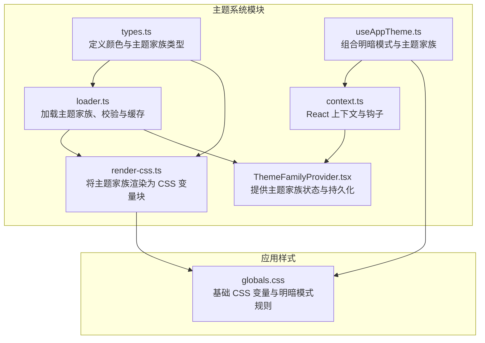
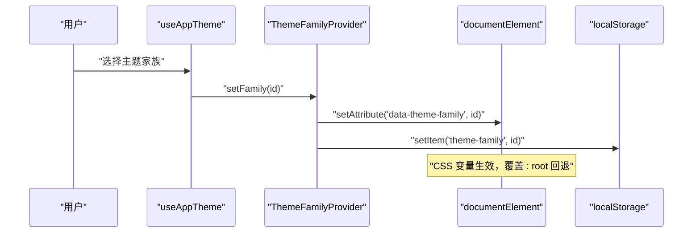
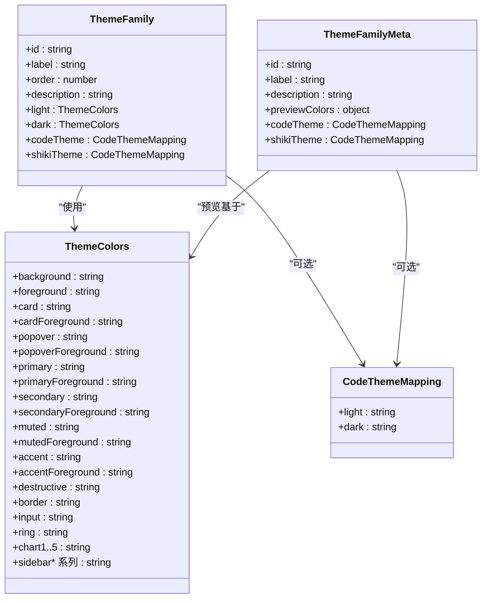
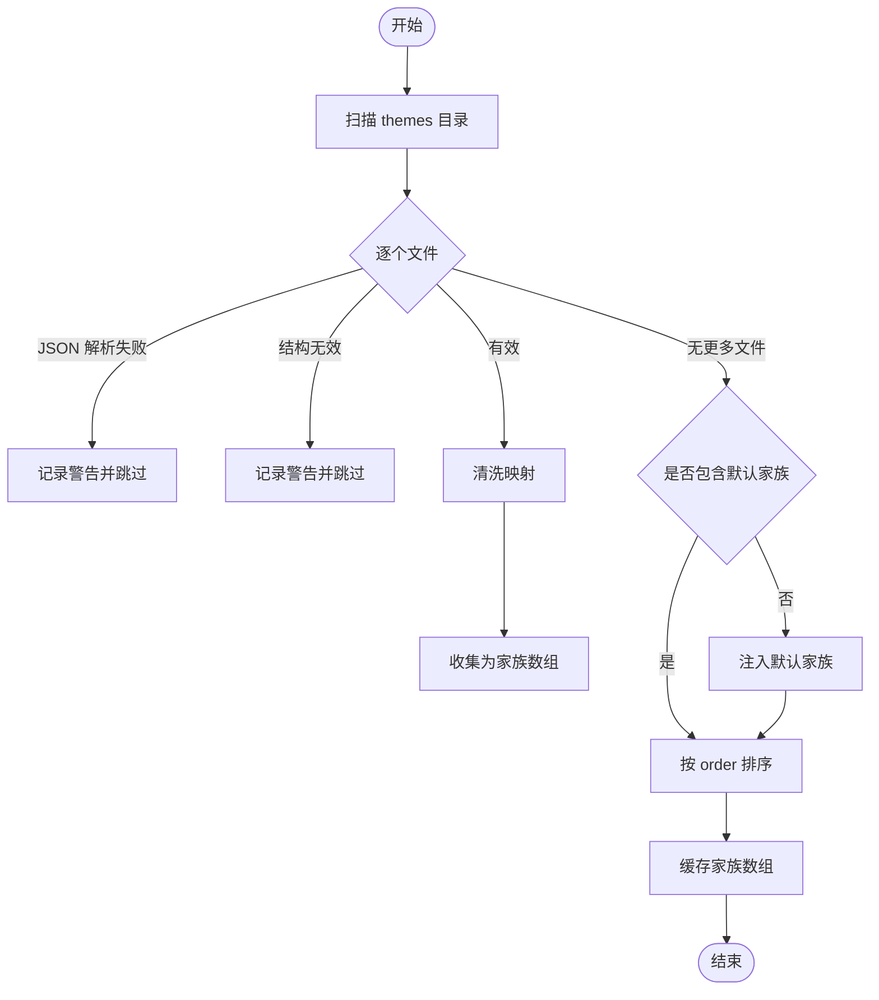
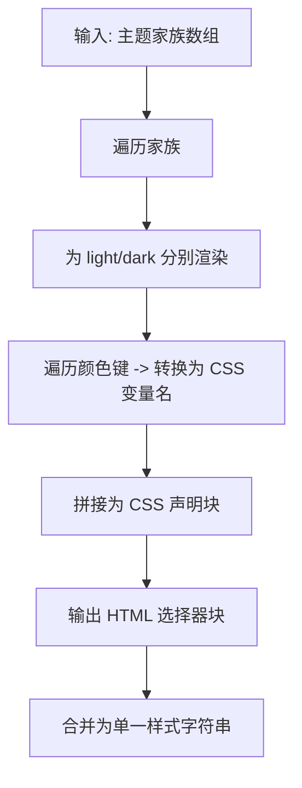
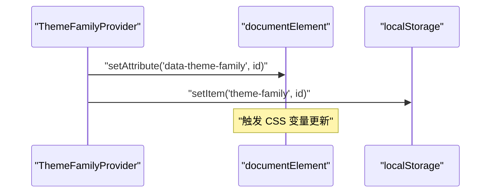
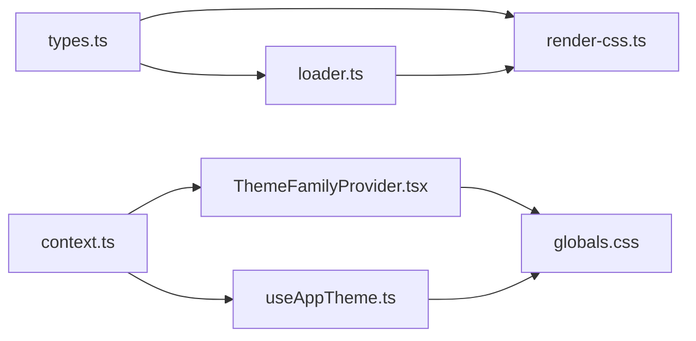

# 主题系统

<cite>
**本文引用的文件**
- [src/lib/theme/types.ts](file://src/lib/theme/types.ts)
- [src/lib/theme/loader.ts](file://src/lib/theme/loader.ts)
- [src/lib/theme/render-css.ts](file://src/lib/theme/render-css.ts)
- [src/lib/theme/context.ts](file://src/lib/theme/context.ts)
- [src/components/layout/ThemeFamilyProvider.tsx](file://src/components/layout/ThemeFamilyProvider.tsx)
- [src/hooks/useAppTheme.ts](file://src/hooks/useAppTheme.ts)
- [src/app/globals.css](file://src/app/globals.css)
- [src/__tests__/unit/theme-loader.test.ts](file://src/__tests__/unit/theme-loader.test.ts)
- [src/__tests__/unit/theme-render-css.test.ts](file://src/__tests__/unit/theme-render-css.test.ts)
</cite>

## 目录
1. [引言](#引言)
2. [项目结构](#项目结构)
3. [核心组件](#核心组件)
4. [架构总览](#架构总览)
5. [详细组件分析](#详细组件分析)
6. [依赖分析](#依赖分析)
7. [性能考虑](#性能考虑)
8. [故障排查指南](#故障排查指南)
9. [结论](#结论)
10. [附录](#附录)

## 引言
本文件系统性阐述本项目的“主题系统”，重点覆盖以下方面：
- 主题架构与颜色系统：以“主题家族（Theme Family）”为核心，独立于明暗模式，通过 CSS 变量驱动。
- 字体配置：在现有实现中，主题系统主要管理颜色变量；字体相关能力可按需扩展。
- 主题加载、切换与持久化：从磁盘加载主题 JSON、生成 CSS 变量块、在客户端即时切换并持久化。
- 内置主题：通过 themes 目录下的 JSON 文件组织，支持默认主题回退与排序。
- 自定义主题：提供开发规范与最佳实践，确保变量完整性与一致性。
- 性能与缓存：解析与渲染结果缓存、最小化 DOM 操作与本地存储写入。

## 项目结构
主题系统由“类型定义、加载器、CSS 渲染器、上下文与提供者、钩子”等模块组成，并与全局样式协同工作。

图表来源
- [src/lib/theme/types.ts:1-78](file://src/lib/theme/types.ts#L1-L78)
- [src/lib/theme/loader.ts:1-214](file://src/lib/theme/loader.ts#L1-L214)
- [src/lib/theme/render-css.ts:1-46](file://src/lib/theme/render-css.ts#L1-L46)
- [src/lib/theme/context.ts:1-18](file://src/lib/theme/context.ts#L1-L18)
- [src/components/layout/ThemeFamilyProvider.tsx:34-60](file://src/components/layout/ThemeFamilyProvider.tsx#L34-L60)
- [src/hooks/useAppTheme.ts:1-16](file://src/hooks/useAppTheme.ts#L1-L16)
- [src/app/globals.css](file://src/app/globals.css)

章节来源
- [src/lib/theme/types.ts:1-78](file://src/lib/theme/types.ts#L1-L78)
- [src/lib/theme/loader.ts:1-214](file://src/lib/theme/loader.ts#L1-L214)
- [src/lib/theme/render-css.ts:1-46](file://src/lib/theme/render-css.ts#L1-L46)
- [src/lib/theme/context.ts:1-18](file://src/lib/theme/context.ts#L1-L18)
- [src/components/layout/ThemeFamilyProvider.tsx:34-60](file://src/components/layout/ThemeFamilyProvider.tsx#L34-L60)
- [src/hooks/useAppTheme.ts:1-16](file://src/hooks/useAppTheme.ts#L1-L16)
- [src/app/globals.css](file://src/app/globals.css)

## 核心组件
- 类型与数据模型
  - 颜色键集合：覆盖背景、卡片、弹出层、主色、次色、强调色、破坏性、边框、输入、环形高亮、图表系列、侧边栏及其前景与关键态等。
  - 主题家族：包含 id、label、order、description、light/dark 两套颜色集，以及可选的代码高亮映射（react-syntax-highlighter 与 Shiki）。
  - 轻量元信息：用于选择器 UI 的预览颜色与代码主题映射。
- 加载器
  - 读取 themes 目录下的 JSON 文件，校验结构有效性，标准化映射，保证默认家族存在并按 order 排序，缓存结果。
- CSS 渲染器
  - 将颜色键转换为 CSS 变量名（驼峰转连字符，含数字处理），生成针对明/暗模式的 CSS 块。
- 上下文与提供者
  - React 上下文暴露当前家族 id、设置函数与家族列表；Provider 负责状态同步到 documentElement 属性与 localStorage。
- 组合钩子
  - useAppTheme 将 next-themes 的明暗模式与主题家族状态统一对外暴露。

章节来源
- [src/lib/theme/types.ts:8-78](file://src/lib/theme/types.ts#L8-L78)
- [src/lib/theme/loader.ts:1-214](file://src/lib/theme/loader.ts#L1-L214)
- [src/lib/theme/render-css.ts:1-46](file://src/lib/theme/render-css.ts#L1-L46)
- [src/lib/theme/context.ts:1-18](file://src/lib/theme/context.ts#L1-L18)
- [src/components/layout/ThemeFamilyProvider.tsx:34-60](file://src/components/layout/ThemeFamilyProvider.tsx#L34-L60)
- [src/hooks/useAppTheme.ts:1-16](file://src/hooks/useAppTheme.ts#L1-L16)

## 架构总览
主题系统采用“家族级颜色变量 + 明暗模式”的双层设计。家族负责颜色语义，明暗模式负责明暗对比度与饱和度调整。DOM 通过 data 属性选择家族，CSS 变量优先级高于全局回退。

图表来源
- [src/hooks/useAppTheme.ts:1-16](file://src/hooks/useAppTheme.ts#L1-L16)
- [src/components/layout/ThemeFamilyProvider.tsx:34-60](file://src/components/layout/ThemeFamilyProvider.tsx#L34-L60)

## 详细组件分析

### 类型与数据模型
主题家族的核心是颜色键集合，覆盖 UI 的主要视觉元素。类型定义确保加载器与渲染器的一致性与可维护性。

图表来源
- [src/lib/theme/types.ts:8-78](file://src/lib/theme/types.ts#L8-L78)

章节来源
- [src/lib/theme/types.ts:8-78](file://src/lib/theme/types.ts#L8-L78)

### 主题加载与缓存
- 目录扫描：遍历 themes 目录，仅处理 .json 文件。
- 结构校验：对每个文件进行 JSON 解析与主题家族结构校验，无效文件跳过并记录警告。
- 标准化：对代码主题映射进行清洗，确保字段完整。
- 默认回退：若未发现默认家族，则注入一个基于全局样式的回退家族。
- 排序与缓存：按 order 排序后缓存结果，避免重复 IO。

图表来源
- [src/lib/theme/loader.ts:160-197](file://src/lib/theme/loader.ts#L160-L197)

章节来源
- [src/lib/theme/loader.ts:160-197](file://src/lib/theme/loader.ts#L160-L197)
- [src/__tests__/unit/theme-loader.test.ts:1-65](file://src/__tests__/unit/theme-loader.test.ts#L1-L65)

### CSS 变量渲染与优先级
- 键名转换：将驼峰键转为 CSS 变量名（如 cardForeground → --card-foreground；chart1 → --chart-1）。
- 生成块：为每个家族分别输出明/暗两组 CSS 块，选择器具备较高优先级，可覆盖全局回退。
- 全局回退：globals.css 中的 :root 与 .dark 作为最终兜底。

图表来源
- [src/lib/theme/render-css.ts:14-46](file://src/lib/theme/render-css.ts#L14-L46)
- [src/app/globals.css](file://src/app/globals.css)

章节来源
- [src/lib/theme/render-css.ts:14-46](file://src/lib/theme/render-css.ts#L14-L46)
- [src/__tests__/unit/theme-render-css.test.ts:1-107](file://src/__tests__/unit/theme-render-css.test.ts#L1-L107)

### 主题家族上下文与提供者
- 上下文：暴露 family、setFamily、families 三个字段，便于组件树内消费。
- 提供者：在初始化时从 localStorage 读取家族 id，设置到 documentElement 的 data 属性；每次变更立即同步 DOM 并持久化。

图表来源
- [src/lib/theme/context.ts:1-18](file://src/lib/theme/context.ts#L1-L18)
- [src/components/layout/ThemeFamilyProvider.tsx:34-60](file://src/components/layout/ThemeFamilyProvider.tsx#L34-L60)

章节来源
- [src/lib/theme/context.ts:1-18](file://src/lib/theme/context.ts#L1-L18)
- [src/components/layout/ThemeFamilyProvider.tsx:34-60](file://src/components/layout/ThemeFamilyProvider.tsx#L34-L60)

### 明暗模式与主题家族的组合
- useAppTheme 将 next-themes 的 theme/resolvedTheme 与主题家族状态统一，形成应用级主题控制入口。
- DOM 选择器组合：html[data-theme-family="..."] 与 html.dark[data-theme-family="..."] 实现家族与明暗模式的叠加。

章节来源
- [src/hooks/useAppTheme.ts:1-16](file://src/hooks/useAppTheme.ts#L1-16)
- [src/lib/theme/render-css.ts:22-46](file://src/lib/theme/render-css.ts#L22-L46)

## 依赖分析
- 模块耦合
  - loader.ts 依赖 types.ts 的类型定义；render-css.ts 同样依赖 types.ts。
  - ThemeFamilyProvider 依赖 context.ts 与 localStorage；useAppTheme 依赖 next-themes 与 context.ts。
- 外部依赖
  - next-themes：提供明暗模式切换与 resolvedTheme。
  - 浏览器 API：documentElement、localStorage。
- 潜在循环依赖
  - 当前模块间为单向依赖，无循环导入风险。

图表来源
- [src/lib/theme/types.ts:1-78](file://src/lib/theme/types.ts#L1-L78)
- [src/lib/theme/loader.ts:1-214](file://src/lib/theme/loader.ts#L1-L214)
- [src/lib/theme/render-css.ts:1-46](file://src/lib/theme/render-css.ts#L1-L46)
- [src/lib/theme/context.ts:1-18](file://src/lib/theme/context.ts#L1-L18)
- [src/components/layout/ThemeFamilyProvider.tsx:34-60](file://src/components/layout/ThemeFamilyProvider.tsx#L34-L60)
- [src/hooks/useAppTheme.ts:1-16](file://src/hooks/useAppTheme.ts#L1-L16)
- [src/app/globals.css](file://src/app/globals.css)

章节来源
- [src/lib/theme/types.ts:1-78](file://src/lib/theme/types.ts#L1-L78)
- [src/lib/theme/loader.ts:1-214](file://src/lib/theme/loader.ts#L1-L214)
- [src/lib/theme/render-css.ts:1-46](file://src/lib/theme/render-css.ts#L1-L46)
- [src/lib/theme/context.ts:1-18](file://src/lib/theme/context.ts#L1-L18)
- [src/components/layout/ThemeFamilyProvider.tsx:34-60](file://src/components/layout/ThemeFamilyProvider.tsx#L34-L60)
- [src/hooks/useAppTheme.ts:1-16](file://src/hooks/useAppTheme.ts#L1-L16)
- [src/app/globals.css](file://src/app/globals.css)

## 性能考虑
- 缓存策略
  - loader.ts 对主题家族数组进行缓存，避免重复读取与解析。
  - render-css.ts 生成的 CSS 字符串可在构建期或服务端渲染阶段复用，减少运行时计算。
- DOM 操作最小化
  - 切换主题时仅设置一次 data 属性，随后由 CSS 变量自动生效。
- I/O 与异常
  - 文件读取与 JSON 解析失败时记录警告并跳过，不影响其他主题加载。
  - localStorage 写入失败时静默忽略，保证功能可用性。
- 选择器优先级
  - 家族选择器具备较高优先级，避免与全局回退产生复杂冲突，提升渲染稳定性。

章节来源
- [src/lib/theme/loader.ts:160-197](file://src/lib/theme/loader.ts#L160-L197)
- [src/lib/theme/render-css.ts:22-46](file://src/lib/theme/render-css.ts#L22-L46)
- [src/components/layout/ThemeFamilyProvider.tsx:34-60](file://src/components/layout/ThemeFamilyProvider.tsx#L34-L60)

## 故障排查指南
- 主题未生效
  - 检查 documentElement 是否存在 data-theme-family 属性；确认对应家族 CSS 已注入。
  - 确认 globals.css 中的回退变量是否存在，避免变量缺失导致渲染异常。
- 主题加载失败
  - 查看控制台警告，定位无效 JSON 或结构不合法的主题文件。
  - 确保默认家族存在（即使手动删除也会被自动注入）。
- 切换不持久
  - 检查 localStorage 是否可用；确认 setItem 调用未抛出异常。
- 单元测试参考
  - 使用官方测试用例验证键名转换与 CSS 渲染行为，确保自定义主题符合预期。

章节来源
- [src/lib/theme/loader.ts:160-197](file://src/lib/theme/loader.ts#L160-L197)
- [src/components/layout/ThemeFamilyProvider.tsx:34-60](file://src/components/layout/ThemeFamilyProvider.tsx#L34-L60)
- [src/__tests__/unit/theme-loader.test.ts:1-65](file://src/__tests__/unit/theme-loader.test.ts#L1-L65)
- [src/__tests__/unit/theme-render-css.test.ts:1-107](file://src/__tests__/unit/theme-render-css.test.ts#L1-L107)

## 结论
本主题系统通过“家族级颜色变量 + 明暗模式”的双层设计，实现了灵活且高性能的主题体系。其核心优势在于：
- 结构清晰：类型定义明确、加载与渲染职责分离。
- 行为稳定：默认回退、缓存与异常容错保障了可用性。
- 扩展友好：新增主题仅需补充 JSON 文件，即可无缝接入选择器与渲染链路。

## 附录

### 内置主题与配置结构
- 存放位置：themes 目录下的 JSON 文件即为主题家族定义。
- 必备字段：id、label、order、light/dark 两套颜色集。
- 可选字段：description、codeTheme、shikiTheme。
- 默认回退：若未检测到默认家族，系统会注入一个基于全局样式的回退家族。

章节来源
- [src/lib/theme/loader.ts:160-197](file://src/lib/theme/loader.ts#L160-L197)

### 主题创建、应用与持久化流程（步骤）
- 创建
  - 在 themes 目录新增 JSON 文件，定义 id、label、order、light/dark 颜色集与可选映射。
  - 运行时加载器会自动扫描并校验该文件。
- 应用
  - 通过 useAppTheme 或 ThemeFamilyProvider 的 setFamily 设置目标家族 id。
  - DOM 即时响应，CSS 变量生效。
- 持久化
  - 家族 id 写入 localStorage，刷新页面后自动恢复。

章节来源
- [src/lib/theme/loader.ts:160-197](file://src/lib/theme/loader.ts#L160-L197)
- [src/components/layout/ThemeFamilyProvider.tsx:34-60](file://src/components/layout/ThemeFamilyProvider.tsx#L34-L60)
- [src/hooks/useAppTheme.ts:1-16](file://src/hooks/useAppTheme.ts#L1-L16)

### 开发规范与最佳实践
- 颜色键完整性
  - 确保 light/dark 两套颜色均包含所有键，避免变量缺失导致 UI 异常。
- 命名一致性
  - 保持 id 与 label 的语义化命名，order 控制选择器中的显示顺序。
- 映射可选但建议完善
  - 若涉及代码高亮，建议同时提供 codeTheme 与 shikiTheme 映射，确保明暗模式一致。
- 变更最小化
  - 新增主题尽量复用现有键集合，减少维护成本。
- 性能优先
  - 避免在运行时频繁重算 CSS；利用缓存与一次性 DOM 更新。

章节来源
- [src/lib/theme/types.ts:8-78](file://src/lib/theme/types.ts#L8-L78)
- [src/lib/theme/render-css.ts:14-46](file://src/lib/theme/render-css.ts#L14-L46)