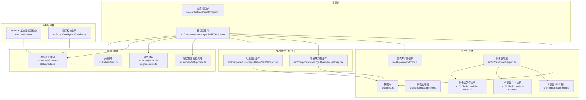
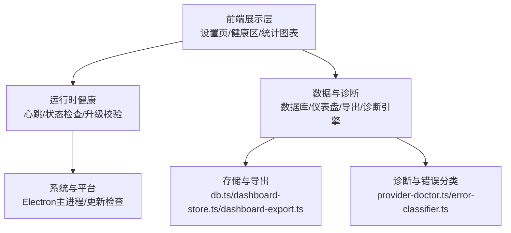
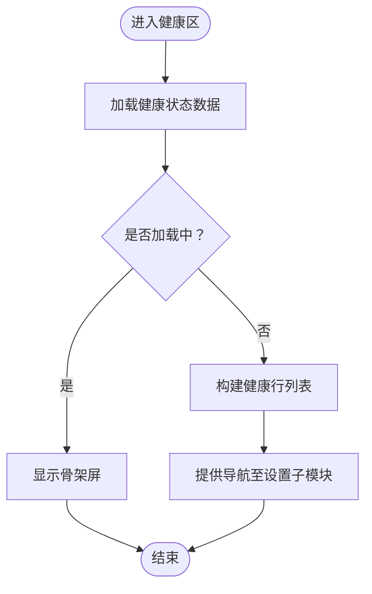
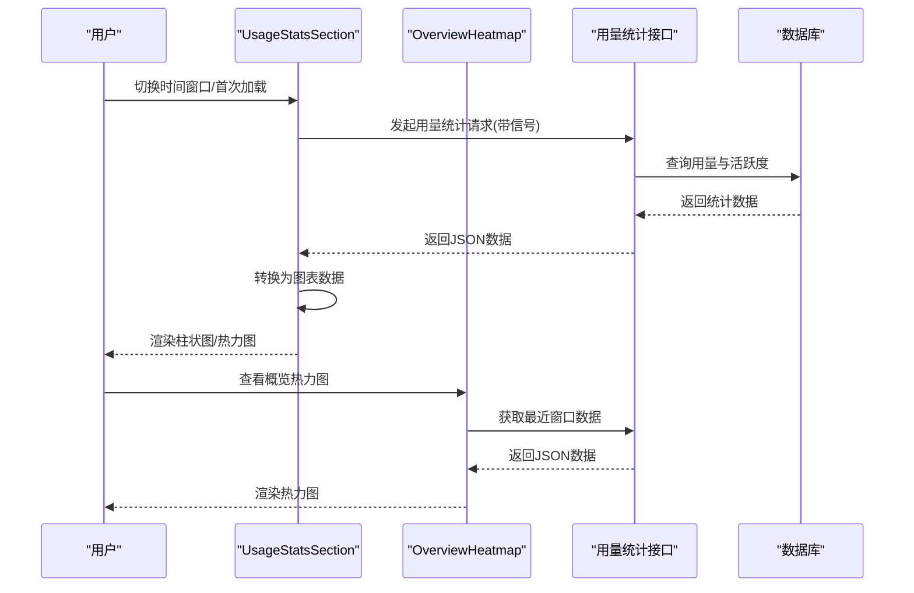
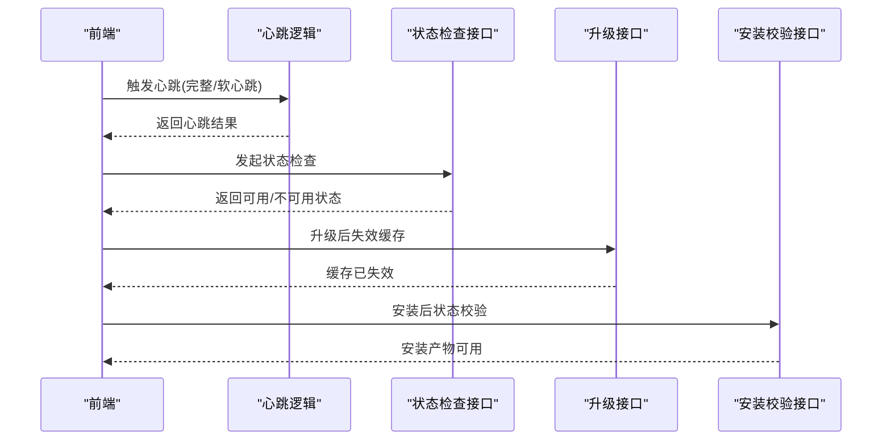
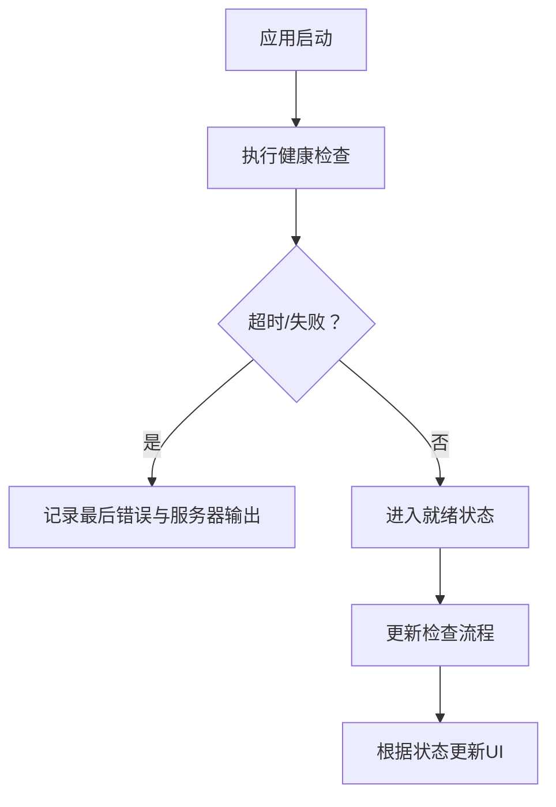
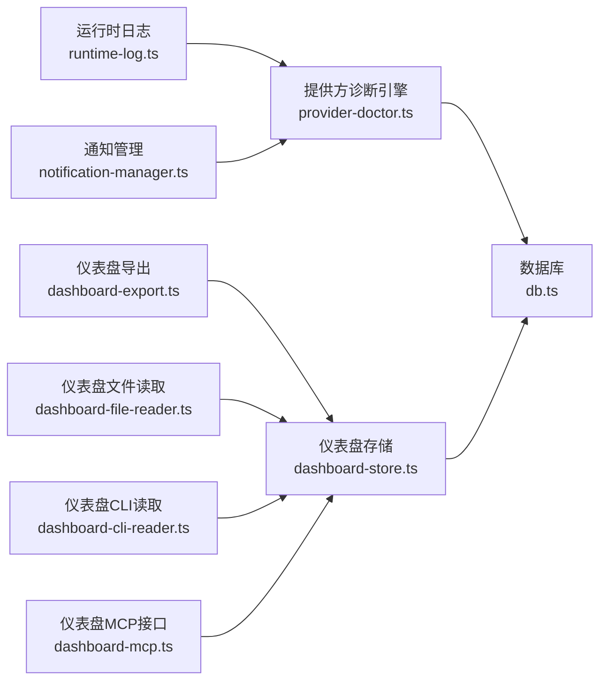
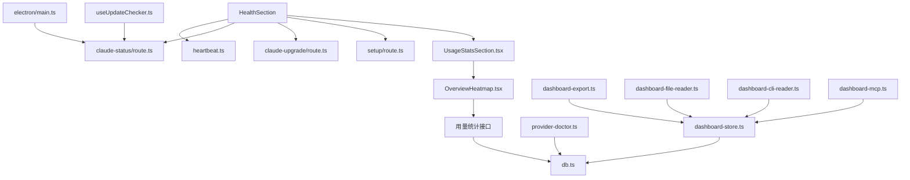

# 健康监控

<cite>
**本文引用的文件**
- [src/app/settings/health/page.tsx](file://src/app/settings/health/page.tsx)
- [src/components/settings/HealthSection.tsx](file://src/components/settings/HealthSection.tsx)
- [src/components/settings/OverviewHeatmap.tsx](file://src/components/settings/OverviewHeatmap.tsx)
- [src/components/settings/UsageStatsSection.tsx](file://src/components/settings/UsageStatsSection.tsx)
- [src/lib/heartbeat.ts](file://src/lib/heartbeat.ts)
- [electron/main.ts](file://electron/main.ts)
- [src/hooks/useUpdateChecker.ts](file://src/hooks/useUpdateChecker.ts)
- [src/app/api/claude-status/route.ts](file://src/app/api/claude-status/route.ts)
- [src/app/api/claude-upgrade/route.ts](file://src/app/api/claude-upgrade/route.ts)
- [src/app/api/setup/route.ts](file://src/app/api/setup/route.ts)
- [src/lib/provider-doctor.ts](file://src/lib/provider-doctor.ts)
- [src/lib/runtime-log.ts](file://src/lib/runtime-log.ts)
- [src/lib/notification-manager.ts](file://src/lib/notification-manager.ts)
- [src/lib/db.ts](file://src/lib/db.ts)
- [src/lib/dashboard-store.ts](file://src/lib/dashboard-store.ts)
- [src/lib/dashboard-export.ts](file://src/lib/dashboard-export.ts)
- [src/lib/dashboard-cli-reader.ts](file://src/lib/dashboard-cli-reader.ts)
- [src/lib/dashboard-file-reader.ts](file://src/lib/dashboard-file-reader.ts)
- [src/lib/dashboard-mcp.ts](file://src/lib/dashboard-mcp.ts)
- [src/lib/sdk-model-usage.ts](file://src/lib/sdk-model-usage.ts)
- [src/lib/model-context.ts](file://src/lib/model-context.ts)
- [src/lib/context-estimator.ts](file://src/lib/context-estimator.ts)
- [src/lib/memory-extractor.ts](file://src/lib/memory-extractor.ts)
- [src/lib/task-scheduler.ts](file://src/lib/task-scheduler.ts)
- [src/lib/job-executor.ts](file://src/lib/job-executor.ts)
- [src/lib/error-classifier.ts](file://src/lib/error-classifier.ts)
- [src/lib/utils.ts](file://src/lib/utils.ts)
</cite>

## 目录
1. [简介](#简介)
2. [项目结构](#项目结构)
3. [核心组件](#核心组件)
4. [架构总览](#架构总览)
5. [详细组件分析](#详细组件分析)
6. [依赖关系分析](#依赖关系分析)
7. [性能考量](#性能考量)
8. [故障排查指南](#故障排查指南)
9. [结论](#结论)
10. [附录](#附录)

## 简介
本文件围绕“健康监控”主题，系统性梳理应用的健康状态监测、统计与报告机制。内容覆盖系统资源与运行健康、性能指标统计、异常告警、健康数据采集与可视化、评估算法与阈值设定、预警机制、健康报告生成与导出、以及历史趋势分析。文档以实际代码文件为依据，通过图示与分层讲解帮助读者快速理解并落地实现。

## 项目结构
健康监控相关能力主要分布在以下区域：
- 设置页入口与健康面板：页面路由与健康区组件
- 运行时与系统健康：心跳、状态检查、升级与安装校验
- 使用统计与热力图：用量与活跃度可视化
- 数据库与存储：健康数据持久化与导出
- 诊断与错误分类：异常检测与定位
- 通知与日志：告警与可观测性

图表来源
- [src/app/settings/health/page.tsx:1-7](file://src/app/settings/health/page.tsx#L1-L7)
- [src/components/settings/HealthSection.tsx:76-111](file://src/components/settings/HealthSection.tsx#L76-L111)
- [src/lib/heartbeat.ts](file://src/lib/heartbeat.ts)
- [src/app/api/claude-status/route.ts:97](file://src/app/api/claude-status/route.ts#L97)
- [src/app/api/claude-upgrade/route.ts:28](file://src/app/api/claude-upgrade/route.ts#L28)
- [src/app/api/setup/route.ts:25](file://src/app/api/setup/route.ts#L25)
- [src/components/settings/UsageStatsSection.tsx:183-449](file://src/components/settings/UsageStatsSection.tsx#L183-L449)
- [src/components/settings/OverviewHeatmap.tsx:244-277](file://src/components/settings/OverviewHeatmap.tsx#L244-L277)
- [electron/main.ts:815](file://electron/main.ts#L815)
- [src/hooks/useUpdateChecker.ts:85](file://src/hooks/useUpdateChecker.ts#L85)
- [src/lib/provider-doctor.ts](file://src/lib/provider-doctor.ts)
- [src/lib/db.ts](file://src/lib/db.ts)
- [src/lib/dashboard-store.ts](file://src/lib/dashboard-store.ts)
- [src/lib/dashboard-export.ts](file://src/lib/dashboard-export.ts)
- [src/lib/dashboard-file-reader.ts](file://src/lib/dashboard-file-reader.ts)
- [src/lib/dashboard-cli-reader.ts](file://src/lib/dashboard-cli-reader.ts)
- [src/lib/dashboard-mcp.ts](file://src/lib/dashboard-mcp.ts)

章节来源
- [src/app/settings/health/page.tsx:1-7](file://src/app/settings/health/page.tsx#L1-L7)
- [src/components/settings/HealthSection.tsx:76-111](file://src/components/settings/HealthSection.tsx#L76-L111)
- [src/components/settings/UsageStatsSection.tsx:183-449](file://src/components/settings/UsageStatsSection.tsx#L183-L449)
- [src/components/settings/OverviewHeatmap.tsx:244-277](file://src/components/settings/OverviewHeatmap.tsx#L244-L277)
- [electron/main.ts:815](file://electron/main.ts#L815)
- [src/hooks/useUpdateChecker.ts:85](file://src/hooks/useUpdateChecker.ts#L85)
- [src/app/api/claude-status/route.ts:97](file://src/app/api/claude-status/route.ts#L97)
- [src/app/api/claude-upgrade/route.ts:28](file://src/app/api/claude-upgrade/route.ts#L28)
- [src/app/api/setup/route.ts:25](file://src/app/api/setup/route.ts#L25)
- [src/lib/provider-doctor.ts](file://src/lib/provider-doctor.ts)
- [src/lib/db.ts](file://src/lib/db.ts)
- [src/lib/dashboard-store.ts](file://src/lib/dashboard-store.ts)
- [src/lib/dashboard-export.ts](file://src/lib/dashboard-export.ts)
- [src/lib/dashboard-file-reader.ts](file://src/lib/dashboard-file-reader.ts)
- [src/lib/dashboard-cli-reader.ts](file://src/lib/dashboard-cli-reader.ts)
- [src/lib/dashboard-mcp.ts](file://src/lib/dashboard-mcp.ts)

## 核心组件
- 设置页健康入口：负责渲染健康监控页面，承载健康区组件。
- 健康区组件：聚合健康状态展示、提供方连接性、模型可用性、心跳状态、系统状态等健康维度，并提供导航至各子模块的能力。
- 使用统计与热力图：提供用量统计图表与365天活动热力图，支持按时间窗口切换。
- 运行时健康：心跳逻辑、状态检查接口、升级与安装校验接口，保障运行时健康。
- 系统健康：Electron 主进程健康检查、更新检查钩子。
- 诊断与存储：提供方诊断引擎、数据库与仪表盘存储、导出与读取工具链。

章节来源
- [src/app/settings/health/page.tsx:1-7](file://src/app/settings/health/page.tsx#L1-L7)
- [src/components/settings/HealthSection.tsx:76-111](file://src/components/settings/HealthSection.tsx#L76-L111)
- [src/components/settings/UsageStatsSection.tsx:183-449](file://src/components/settings/UsageStatsSection.tsx#L183-L449)
- [src/components/settings/OverviewHeatmap.tsx:244-277](file://src/components/settings/OverviewHeatmap.tsx#L244-L277)
- [electron/main.ts:815](file://electron/main.ts#L815)
- [src/hooks/useUpdateChecker.ts:85](file://src/hooks/useUpdateChecker.ts#L85)
- [src/lib/provider-doctor.ts](file://src/lib/provider-doctor.ts)
- [src/lib/db.ts](file://src/lib/db.ts)
- [src/lib/dashboard-store.ts](file://src/lib/dashboard-store.ts)
- [src/lib/dashboard-export.ts](file://src/lib/dashboard-export.ts)
- [src/lib/dashboard-file-reader.ts](file://src/lib/dashboard-file-reader.ts)
- [src/lib/dashboard-cli-reader.ts](file://src/lib/dashboard-cli-reader.ts)
- [src/lib/dashboard-mcp.ts](file://src/lib/dashboard-mcp.ts)

## 架构总览
健康监控体系由“前端展示层—运行时健康—系统与平台—数据与诊断”四层构成。前端通过设置页健康区组件统一呈现；运行时健康通过心跳与状态检查保障；系统与平台层负责启动健康检查与更新；数据与诊断层负责统计、存储、导出与异常定位。

图表来源
- [src/app/settings/health/page.tsx:1-7](file://src/app/settings/health/page.tsx#L1-L7)
- [src/components/settings/HealthSection.tsx:76-111](file://src/components/settings/HealthSection.tsx#L76-L111)
- [src/lib/heartbeat.ts](file://src/lib/heartbeat.ts)
- [src/app/api/claude-status/route.ts:97](file://src/app/api/claude-status/route.ts#L97)
- [src/app/api/claude-upgrade/route.ts:28](file://src/app/api/claude-upgrade/route.ts#L28)
- [electron/main.ts:815](file://electron/main.ts#L815)
- [src/hooks/useUpdateChecker.ts:85](file://src/hooks/useUpdateChecker.ts#L85)
- [src/lib/db.ts](file://src/lib/db.ts)
- [src/lib/dashboard-store.ts](file://src/lib/dashboard-store.ts)
- [src/lib/dashboard-export.ts](file://src/lib/dashboard-export.ts)
- [src/lib/provider-doctor.ts](file://src/lib/provider-doctor.ts)
- [src/lib/error-classifier.ts](file://src/lib/error-classifier.ts)

## 详细组件分析

### 健康区组件（HealthSection）
健康区组件负责健康状态的聚合展示与导航。其核心职责包括：
- 加载与渲染健康状态骨架屏，避免初次加载时的零值误报
- 维护健康行列表，按维度展示状态（如提供方连接数、模型可用数、心跳状态等）
- 提供导航至设置子模块的路由跳转
- 与心跳、状态检查、升级等运行时健康能力联动

图表来源
- [src/components/settings/HealthSection.tsx:76-111](file://src/components/settings/HealthSection.tsx#L76-L111)

章节来源
- [src/components/settings/HealthSection.tsx:76-111](file://src/components/settings/HealthSection.tsx#L76-L111)

### 使用统计与热力图（UsageStatsSection 与 OverviewHeatmap）
使用统计组件提供用量统计图表与365天活动热力图，支持按时间窗口切换。其核心流程包括：
- 请求用量统计接口，支持可中断请求避免竞态
- 将返回数据转换为图表所需格式
- 渲染柱状图与热力图，提供“无数据”占位与加载状态
- 概览热力图组件独立封装，支持隐藏详情链接

图表来源
- [src/components/settings/UsageStatsSection.tsx:183-449](file://src/components/settings/UsageStatsSection.tsx#L183-L449)
- [src/components/settings/OverviewHeatmap.tsx:244-277](file://src/components/settings/OverviewHeatmap.tsx#L244-L277)

章节来源
- [src/components/settings/UsageStatsSection.tsx:183-449](file://src/components/settings/UsageStatsSection.tsx#L183-L449)
- [src/components/settings/OverviewHeatmap.tsx:244-277](file://src/components/settings/OverviewHeatmap.tsx#L244-L277)

### 运行时健康（心跳、状态检查、升级与安装校验）
- 心跳逻辑：通过心跳模块实现“完整心跳”和“软心跳”，用于每日健康检查与会话内提示。
- 状态检查接口：提供 Claude 状态检查与缓存失效处理，确保新版本或新安装能被及时识别。
- 升级接口：在升级后使缓存失效，保证下一次状态检查能反映最新状态。
- 安装校验：在安装流程中进行状态检查，确保安装产物可用。

图表来源
- [src/lib/heartbeat.ts](file://src/lib/heartbeat.ts)
- [src/app/api/claude-status/route.ts:97](file://src/app/api/claude-status/route.ts#L97)
- [src/app/api/claude-upgrade/route.ts:28](file://src/app/api/claude-upgrade/route.ts#L28)
- [src/app/api/setup/route.ts:25](file://src/app/api/setup/route.ts#L25)

章节来源
- [src/lib/heartbeat.ts](file://src/lib/heartbeat.ts)
- [src/app/api/claude-status/route.ts:97](file://src/app/api/claude-status/route.ts#L97)
- [src/app/api/claude-upgrade/route.ts:28](file://src/app/api/claude-upgrade/route.ts#L28)
- [src/app/api/setup/route.ts:25](file://src/app/api/setup/route.ts#L25)

### 系统健康（Electron 主进程与更新检查）
- Electron 主进程健康检查：在应用启动阶段执行健康检查，超时或失败时输出最后错误与服务器输出摘要。
- 更新检查钩子：在更新检查过程中根据事件状态调整 UI 与行为，确保健康状态与更新流程一致。

图表来源
- [electron/main.ts:815](file://electron/main.ts#L815)
- [src/hooks/useUpdateChecker.ts:85](file://src/hooks/useUpdateChecker.ts#L85)

章节来源
- [electron/main.ts:815](file://electron/main.ts#L815)
- [src/hooks/useUpdateChecker.ts:85](file://src/hooks/useUpdateChecker.ts#L85)

### 诊断与存储（Provider Doctor、数据库、仪表盘）
- 提供方诊断引擎：对提供方/CLI/认证进行健康诊断，辅助定位问题。
- 数据库与仪表盘存储：提供数据持久化与仪表盘状态管理。
- 导出与读取：支持仪表盘导出、文件读取与 CLI 读取，便于离线分析与迁移。
- 日志与通知：运行时日志与通知管理，支撑健康告警与可观测性。

图表来源
- [src/lib/provider-doctor.ts](file://src/lib/provider-doctor.ts)
- [src/lib/db.ts](file://src/lib/db.ts)
- [src/lib/dashboard-store.ts](file://src/lib/dashboard-store.ts)
- [src/lib/dashboard-export.ts](file://src/lib/dashboard-export.ts)
- [src/lib/dashboard-file-reader.ts](file://src/lib/dashboard-file-reader.ts)
- [src/lib/dashboard-cli-reader.ts](file://src/lib/dashboard-cli-reader.ts)
- [src/lib/dashboard-mcp.ts](file://src/lib/dashboard-mcp.ts)
- [src/lib/runtime-log.ts](file://src/lib/runtime-log.ts)
- [src/lib/notification-manager.ts](file://src/lib/notification-manager.ts)

章节来源
- [src/lib/provider-doctor.ts](file://src/lib/provider-doctor.ts)
- [src/lib/db.ts](file://src/lib/db.ts)
- [src/lib/dashboard-store.ts](file://src/lib/dashboard-store.ts)
- [src/lib/dashboard-export.ts](file://src/lib/dashboard-export.ts)
- [src/lib/dashboard-file-reader.ts](file://src/lib/dashboard-file-reader.ts)
- [src/lib/dashboard-cli-reader.ts](file://src/lib/dashboard-cli-reader.ts)
- [src/lib/dashboard-mcp.ts](file://src/lib/dashboard-mcp.ts)
- [src/lib/runtime-log.ts](file://src/lib/runtime-log.ts)
- [src/lib/notification-manager.ts](file://src/lib/notification-manager.ts)

## 依赖关系分析
健康监控涉及多个模块间的耦合与协作：
- 健康区组件依赖心跳、状态检查、升级与安装校验接口，以及用量统计组件。
- 用量统计组件依赖用量统计接口与数据库。
- 系统健康依赖 Electron 主进程与更新检查钩子。
- 诊断与存储依赖数据库与多种读取/导出工具。

图表来源
- [src/components/settings/HealthSection.tsx:76-111](file://src/components/settings/HealthSection.tsx#L76-L111)
- [src/lib/heartbeat.ts](file://src/lib/heartbeat.ts)
- [src/app/api/claude-status/route.ts:97](file://src/app/api/claude-status/route.ts#L97)
- [src/app/api/claude-upgrade/route.ts:28](file://src/app/api/claude-upgrade/route.ts#L28)
- [src/app/api/setup/route.ts:25](file://src/app/api/setup/route.ts#L25)
- [src/components/settings/UsageStatsSection.tsx:183-449](file://src/components/settings/UsageStatsSection.tsx#L183-L449)
- [src/components/settings/OverviewHeatmap.tsx:244-277](file://src/components/settings/OverviewHeatmap.tsx#L244-L277)
- [src/lib/db.ts](file://src/lib/db.ts)
- [electron/main.ts:815](file://electron/main.ts#L815)
- [src/hooks/useUpdateChecker.ts:85](file://src/hooks/useUpdateChecker.ts#L85)
- [src/lib/provider-doctor.ts](file://src/lib/provider-doctor.ts)
- [src/lib/dashboard-store.ts](file://src/lib/dashboard-store.ts)
- [src/lib/dashboard-export.ts](file://src/lib/dashboard-export.ts)
- [src/lib/dashboard-file-reader.ts](file://src/lib/dashboard-file-reader.ts)
- [src/lib/dashboard-cli-reader.ts](file://src/lib/dashboard-cli-reader.ts)
- [src/lib/dashboard-mcp.ts](file://src/lib/dashboard-mcp.ts)

章节来源
- [src/components/settings/HealthSection.tsx:76-111](file://src/components/settings/HealthSection.tsx#L76-L111)
- [src/lib/heartbeat.ts](file://src/lib/heartbeat.ts)
- [src/app/api/claude-status/route.ts:97](file://src/app/api/claude-status/route.ts#L97)
- [src/app/api/claude-upgrade/route.ts:28](file://src/app/api/claude-upgrade/route.ts#L28)
- [src/app/api/setup/route.ts:25](file://src/app/api/setup/route.ts#L25)
- [src/components/settings/UsageStatsSection.tsx:183-449](file://src/components/settings/UsageStatsSection.tsx#L183-L449)
- [src/components/settings/OverviewHeatmap.tsx:244-277](file://src/components/settings/OverviewHeatmap.tsx#L244-L277)
- [src/lib/db.ts](file://src/lib/db.ts)
- [electron/main.ts:815](file://electron/main.ts#L815)
- [src/hooks/useUpdateChecker.ts:85](file://src/hooks/useUpdateChecker.ts#L85)
- [src/lib/provider-doctor.ts](file://src/lib/provider-doctor.ts)
- [src/lib/dashboard-store.ts](file://src/lib/dashboard-store.ts)
- [src/lib/dashboard-export.ts](file://src/lib/dashboard-export.ts)
- [src/lib/dashboard-file-reader.ts](file://src/lib/dashboard-file-reader.ts)
- [src/lib/dashboard-cli-reader.ts](file://src/lib/dashboard-cli-reader.ts)
- [src/lib/dashboard-mcp.ts](file://src/lib/dashboard-mcp.ts)

## 性能考量
- 请求中断与去重：用量统计组件使用可中断控制器避免竞态与重复请求，提升交互流畅性。
- 图表渲染优化：使用响应式容器与柱状图配置减少重绘开销。
- 骨架屏与懒加载：健康区组件在初次加载时采用骨架屏，降低感知延迟。
- 数据窗口化：热力图与用量统计支持按窗口（7/30/90/365天）切换，平衡信息密度与渲染性能。
- 系统健康检查：主进程健康检查设置超时阈值，失败时仅记录必要信息，避免阻塞启动。

章节来源
- [src/components/settings/UsageStatsSection.tsx:183-449](file://src/components/settings/UsageStatsSection.tsx#L183-L449)
- [src/components/settings/OverviewHeatmap.tsx:244-277](file://src/components/settings/OverviewHeatmap.tsx#L244-L277)
- [src/components/settings/HealthSection.tsx:76-111](file://src/components/settings/HealthSection.tsx#L76-L111)
- [electron/main.ts:815](file://electron/main.ts#L815)

## 故障排查指南
- 状态检查失败：检查状态检查接口返回与缓存失效策略，确认升级后是否正确失效缓存。
- 安装产物不可用：通过安装校验接口与提供方诊断引擎定位问题。
- 启动超时：查看主进程健康检查日志，获取最后错误与服务器输出摘要。
- 用量统计为空：确认用量统计接口可用与数据库连通，检查请求中断与信号处理。
- 心跳未触发：核对心跳逻辑与自动触发开关，确认服务端 needsHeartbeat 标记与前端触发条件一致。

章节来源
- [src/app/api/claude-status/route.ts:97](file://src/app/api/claude-status/route.ts#L97)
- [src/app/api/claude-upgrade/route.ts:28](file://src/app/api/claude-upgrade/route.ts#L28)
- [src/app/api/setup/route.ts:25](file://src/app/api/setup/route.ts#L25)
- [src/lib/provider-doctor.ts](file://src/lib/provider-doctor.ts)
- [electron/main.ts:815](file://electron/main.ts#L815)
- [src/components/settings/UsageStatsSection.tsx:183-449](file://src/components/settings/UsageStatsSection.tsx#L183-L449)
- [src/lib/heartbeat.ts](file://src/lib/heartbeat.ts)

## 结论
健康监控体系通过“前端展示—运行时健康—系统与平台—数据与诊断”的分层设计，实现了对应用健康状态的全面观测与反馈。结合心跳、状态检查、用量统计与热力图、诊断与存储等能力，既能满足日常健康巡检，也能支撑异常告警与历史趋势分析。建议在实际部署中完善阈值与告警规则，持续优化数据采集与可视化体验。

## 附录
- 代码示例路径（不展示具体代码内容）：
  - 健康区组件渲染与导航：[src/components/settings/HealthSection.tsx:76-111](file://src/components/settings/HealthSection.tsx#L76-L111)
  - 用量统计请求与图表渲染：[src/components/settings/UsageStatsSection.tsx:183-449](file://src/components/settings/UsageStatsSection.tsx#L183-L449)
  - 概览热力图数据获取：[src/components/settings/OverviewHeatmap.tsx:244-277](file://src/components/settings/OverviewHeatmap.tsx#L244-L277)
  - 状态检查与缓存失效：[src/app/api/claude-status/route.ts:97](file://src/app/api/claude-status/route.ts#L97)
  - 升级后缓存失效：[src/app/api/claude-upgrade/route.ts:28](file://src/app/api/claude-upgrade/route.ts#L28)
  - 安装校验与状态检查：[src/app/api/setup/route.ts:25](file://src/app/api/setup/route.ts#L25)
  - 主进程健康检查与超时处理：[electron/main.ts:815](file://electron/main.ts#L815)
  - 更新检查钩子状态处理：[src/hooks/useUpdateChecker.ts:85](file://src/hooks/useUpdateChecker.ts#L85)
  - 提供方诊断引擎：[src/lib/provider-doctor.ts](file://src/lib/provider-doctor.ts)
  - 数据库与仪表盘存储：[src/lib/db.ts](file://src/lib/db.ts)、[src/lib/dashboard-store.ts](file://src/lib/dashboard-store.ts)
  - 仪表盘导出与读取：[src/lib/dashboard-export.ts](file://src/lib/dashboard-export.ts)、[src/lib/dashboard-file-reader.ts](file://src/lib/dashboard-file-reader.ts)、[src/lib/dashboard-cli-reader.ts](file://src/lib/dashboard-cli-reader.ts)、[src/lib/dashboard-mcp.ts](file://src/lib/dashboard-mcp.ts)
  - 运行时日志与通知：[src/lib/runtime-log.ts](file://src/lib/runtime-log.ts)、[src/lib/notification-manager.ts](file://src/lib/notification-manager.ts)