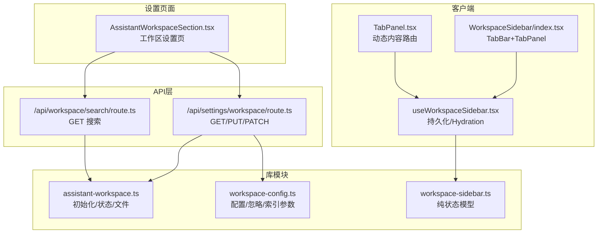
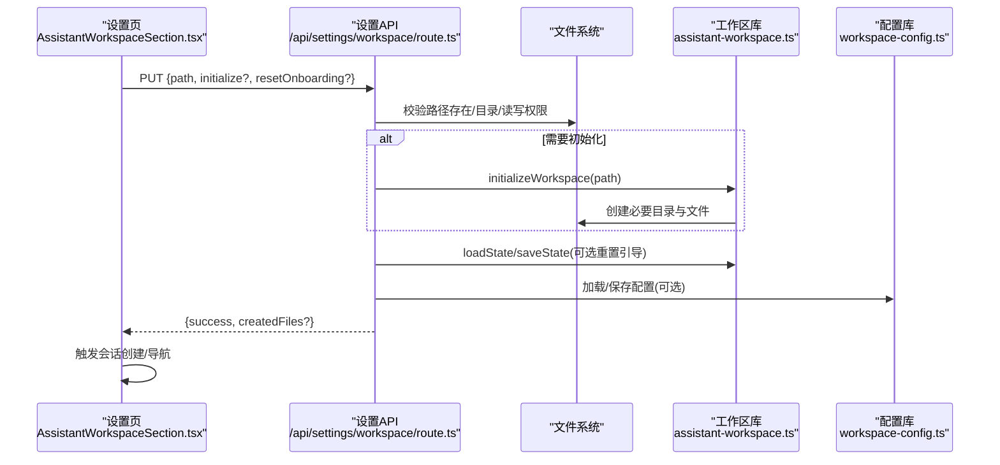
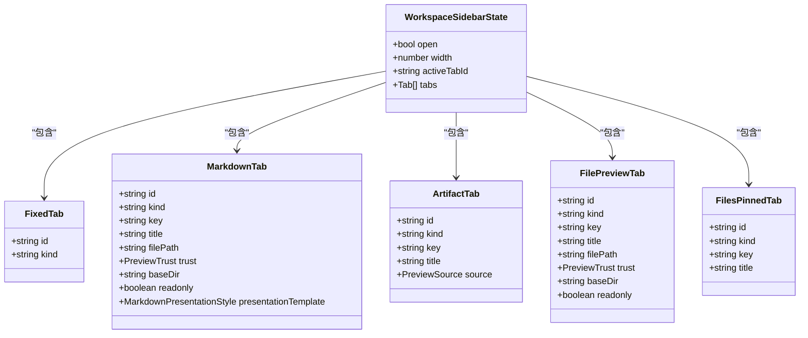
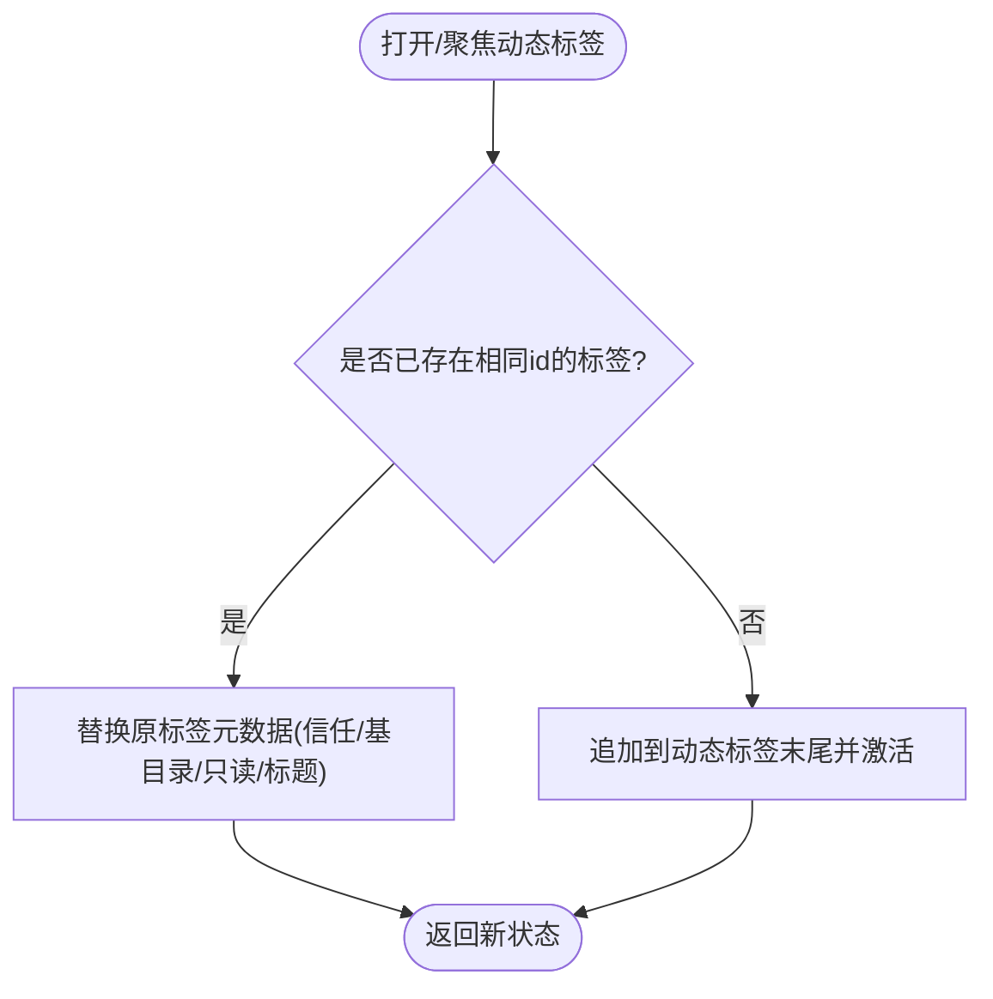
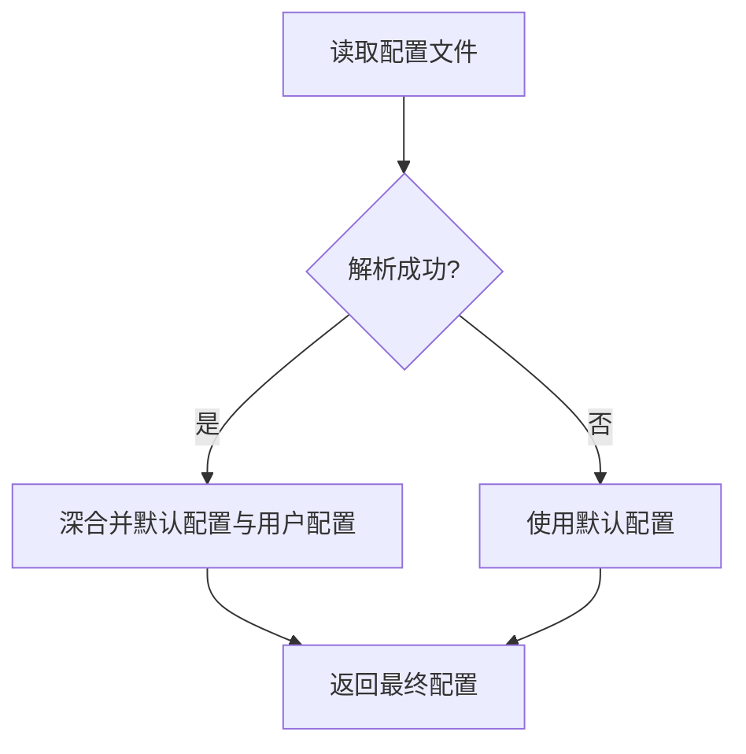
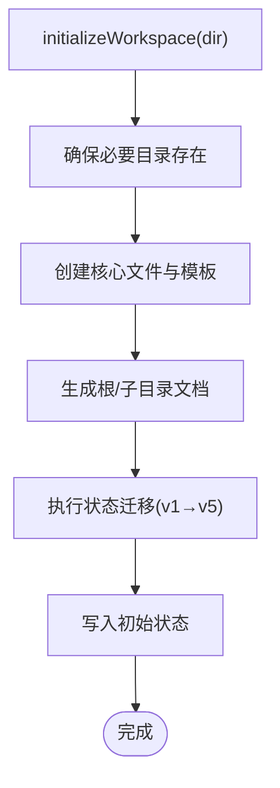
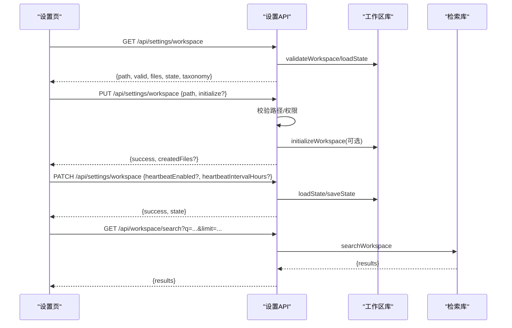
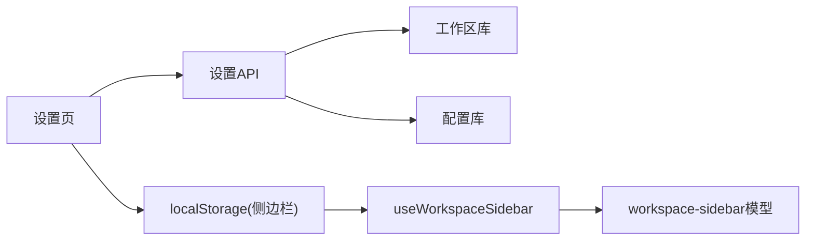

# 工作区设置

<cite>
**本文档引用的文件**
- [src/lib/workspace-sidebar.ts](file://src/lib/workspace-sidebar.ts)
- [src/hooks/useWorkspaceSidebar.tsx](file://src/hooks/useWorkspaceSidebar.tsx)
- [src/components/layout/WorkspaceSidebar/index.tsx](file://src/components/layout/WorkspaceSidebar/index.tsx)
- [src/components/layout/WorkspaceSidebar/TabPanel.tsx](file://src/components/layout/WorkspaceSidebar/TabPanel.tsx)
- [src/lib/workspace-config.ts](file://src/lib/workspace-config.ts)
- [src/lib/assistant-workspace.ts](file://src/lib/assistant-workspace.ts)
- [src/app/api/settings/workspace/route.ts](file://src/app/api/settings/workspace/route.ts)
- [src/app/api/workspace/search/route.ts](file://src/app/api/workspace/search/route.ts)
- [src/components/settings/AssistantWorkspaceSection.tsx](file://src/components/settings/AssistantWorkspaceSection.tsx)
- [src/__tests__/unit/workspace-sidebar.test.ts](file://src/__tests__/unit/workspace-sidebar.test.ts)
</cite>

## 目录
1. [简介](#简介)
2. [项目结构](#项目结构)
3. [核心组件](#核心组件)
4. [架构总览](#架构总览)
5. [详细组件分析](#详细组件分析)
6. [依赖关系分析](#依赖关系分析)
7. [性能考量](#性能考量)
8. [故障排查指南](#故障排查指南)
9. [结论](#结论)
10. [附录](#附录)

## 简介
本文件围绕“工作区设置”主题，系统性阐述工作区的配置、侧边栏管理与状态卡片实现机制，覆盖工作区的创建、切换、配置与持久化流程；解释文件过滤、搜索范围与显示选项；说明工作区与项目的关系、数据隔离与共享机制；并提供导入导出、模板管理与批量操作的实践建议。文档同时给出代码级架构图与流程图，帮助读者快速定位实现位置与调用链路。

## 项目结构
工作区相关能力横跨前端组件、Hooks、服务端API与底层库模块：
- 配置与索引：workspace-config.ts 提供工作区配置默认值与忽略规则；workspace-retrieval.ts 提供工作区内检索能力。
- 工作区状态与文件：assistant-workspace.ts 提供工作区初始化、状态迁移、文件加载与提示组装等。
- 侧边栏与标签页：workspace-sidebar.ts 定义纯状态模型；useWorkspaceSidebar.tsx 提供客户端持久化与Hydration；WorkspaceSidebar/index.tsx 与 TabPanel.tsx 组合渲染固定与动态标签页。
- 设置界面：AssistantWorkspaceSection.tsx 提供工作区路径选择、初始化、摘要、索引与整理等UI入口。
- API层：/api/settings/workspace 与 /api/workspace/search 提供工作区设置读取/保存/更新与工作区内搜索。

**图表来源**
- [src/components/settings/AssistantWorkspaceSection.tsx:1-618](file://src/components/settings/AssistantWorkspaceSection.tsx#L1-L618)
- [src/app/api/settings/workspace/route.ts:1-265](file://src/app/api/settings/workspace/route.ts#L1-L265)
- [src/app/api/workspace/search/route.ts:1-28](file://src/app/api/workspace/search/route.ts#L1-L28)
- [src/lib/assistant-workspace.ts:1-666](file://src/lib/assistant-workspace.ts#L1-L666)
- [src/lib/workspace-config.ts:1-119](file://src/lib/workspace-config.ts#L1-L119)
- [src/lib/workspace-sidebar.ts:1-415](file://src/lib/workspace-sidebar.ts#L1-L415)
- [src/hooks/useWorkspaceSidebar.tsx:42-76](file://src/hooks/useWorkspaceSidebar.tsx#L42-L76)
- [src/components/layout/WorkspaceSidebar/index.tsx:1-27](file://src/components/layout/WorkspaceSidebar/index.tsx#L1-L27)
- [src/components/layout/WorkspaceSidebar/TabPanel.tsx:1-32](file://src/components/layout/WorkspaceSidebar/TabPanel.tsx#L1-L32)

**章节来源**
- [src/components/settings/AssistantWorkspaceSection.tsx:1-618](file://src/components/settings/AssistantWorkspaceSection.tsx#L1-L618)
- [src/app/api/settings/workspace/route.ts:1-265](file://src/app/api/settings/workspace/route.ts#L1-L265)
- [src/app/api/workspace/search/route.ts:1-28](file://src/app/api/workspace/search/route.ts#L1-L28)
- [src/lib/assistant-workspace.ts:1-666](file://src/lib/assistant-workspace.ts#L1-L666)
- [src/lib/workspace-config.ts:1-119](file://src/lib/workspace-config.ts#L1-L119)
- [src/lib/workspace-sidebar.ts:1-415](file://src/lib/workspace-sidebar.ts#L1-L415)
- [src/hooks/useWorkspaceSidebar.tsx:42-76](file://src/hooks/useWorkspaceSidebar.tsx#L42-L76)
- [src/components/layout/WorkspaceSidebar/index.tsx:1-27](file://src/components/layout/WorkspaceSidebar/index.tsx#L1-L27)
- [src/components/layout/WorkspaceSidebar/TabPanel.tsx:1-32](file://src/components/layout/WorkspaceSidebar/TabPanel.tsx#L1-L32)

## 核心组件
- 工作区配置模型与忽略规则：workspace-config.ts 提供默认配置、深合并策略、忽略匹配与索引参数。
- 工作区状态与文件：assistant-workspace.ts 提供工作区初始化、状态迁移、文件加载与提示组装。
- 侧边栏状态模型：workspace-sidebar.ts 定义固定/动态标签页、状态变更函数与序列化/反序列化。
- 客户端持久化：useWorkspaceSidebar.tsx 基于localStorage按工作区+会话键空间持久化侧边栏状态。
- 设置页UI：AssistantWorkspaceSection.tsx 提供路径选择、初始化、摘要、索引与整理等入口。
- 搜索API：/api/workspace/search/route.ts 基于 workspace-retrieval.ts 在工作区内检索。

**章节来源**
- [src/lib/workspace-config.ts:1-119](file://src/lib/workspace-config.ts#L1-L119)
- [src/lib/assistant-workspace.ts:1-666](file://src/lib/assistant-workspace.ts#L1-L666)
- [src/lib/workspace-sidebar.ts:1-415](file://src/lib/workspace-sidebar.ts#L1-L415)
- [src/hooks/useWorkspaceSidebar.tsx:42-76](file://src/hooks/useWorkspaceSidebar.tsx#L42-L76)
- [src/components/settings/AssistantWorkspaceSection.tsx:1-618](file://src/components/settings/AssistantWorkspaceSection.tsx#L1-L618)
- [src/app/api/workspace/search/route.ts:1-28](file://src/app/api/workspace/search/route.ts#L1-L28)

## 架构总览
工作区设置的端到端流程包括：设置页发起保存请求 -> 服务端校验路径/权限 -> 初始化工作区（可选）-> 更新设置 -> 返回工作区状态与文件摘要 -> 客户端Hydration侧边栏状态 -> 侧边栏渲染固定与动态标签页。

**图表来源**
- [src/components/settings/AssistantWorkspaceSection.tsx:154-200](file://src/components/settings/AssistantWorkspaceSection.tsx#L154-L200)
- [src/app/api/settings/workspace/route.ts:107-192](file://src/app/api/settings/workspace/route.ts#L107-L192)
- [src/lib/assistant-workspace.ts:336-412](file://src/lib/assistant-workspace.ts#L336-L412)
- [src/lib/workspace-config.ts:70-77](file://src/lib/workspace-config.ts#L70-L77)

## 详细组件分析

### 侧边栏与标签页管理
- 状态模型：workspace-sidebar.ts 定义固定标签（git、widget）与动态标签（markdown、artifact、file、files-pinned），提供 openDynamicTab/closeTab/setActiveTab/setWidth 等纯函数式状态变更。
- 客户端持久化：useWorkspaceSidebar.tsx 基于 localStorage，以 workingDirectory::sessionId 为键空间持久化 open、width、activeTabId 与动态标签列表，避免SSR与CSR状态不一致。
- 渲染组合：WorkspaceSidebar/index.tsx 聚合 TabBar 与 TabPanel；TabPanel.tsx 基于当前激活标签同步 PreviewPanel 的预览源，确保切换标签时内容正确。

**图表来源**
- [src/lib/workspace-sidebar.ts:24-88](file://src/lib/workspace-sidebar.ts#L24-L88)

**图表来源**
- [src/lib/workspace-sidebar.ts:148-164](file://src/lib/workspace-sidebar.ts#L148-L164)

**章节来源**
- [src/lib/workspace-sidebar.ts:1-415](file://src/lib/workspace-sidebar.ts#L1-L415)
- [src/hooks/useWorkspaceSidebar.tsx:42-76](file://src/hooks/useWorkspaceSidebar.tsx#L42-L76)
- [src/components/layout/WorkspaceSidebar/index.tsx:1-27](file://src/components/layout/WorkspaceSidebar/index.tsx#L1-L27)
- [src/components/layout/WorkspaceSidebar/TabPanel.tsx:1-32](file://src/components/layout/WorkspaceSidebar/TabPanel.tsx#L1-L32)
- [src/__tests__/unit/workspace-sidebar.test.ts:1-52](file://src/__tests__/unit/workspace-sidebar.test.ts#L1-L52)

### 工作区配置与索引
- 默认配置：workspace-config.ts 提供默认工作区类型、组织风格、归档策略、忽略模式与索引参数（最大文件大小、分块大小/重叠、最大深度、包含扩展名）。
- 深合并：loadConfig 使用深合并策略将用户配置与默认配置合并，保证字段完整性。
- 忽略规则：shouldIgnore 将glob模式转换为正则进行匹配，支持 **/ 与 *? 等通配符。
- 保存：saveConfig 自动创建目录并写入配置文件。

**图表来源**
- [src/lib/workspace-config.ts:59-68](file://src/lib/workspace-config.ts#L59-L68)

**章节来源**
- [src/lib/workspace-config.ts:1-119](file://src/lib/workspace-config.ts#L1-L119)

### 工作区初始化与状态管理
- 初始化：initializeWorkspace 创建必要目录与文件，生成根目录与子目录文档，执行状态迁移，并在有内容时推断分类。
- 状态迁移：从v1到v5的多版本迁移，自动修复字段命名与默认值。
- 文件加载：loadWorkspaceFiles 读取核心文件并截断长度，组装提示时采用预算感知的拼接策略。
- 状态读写：loadState/saveState 通过临时文件写入与原子重命名保障一致性。

**图表来源**
- [src/lib/assistant-workspace.ts:336-412](file://src/lib/assistant-workspace.ts#L336-L412)

**章节来源**
- [src/lib/assistant-workspace.ts:1-666](file://src/lib/assistant-workspace.ts#L1-L666)

### 设置页与API交互
- 设置页：AssistantWorkspaceSection.tsx 提供路径选择、最近路径下拉、初始化开关、摘要/索引/整理入口与状态卡片。
- 保存流程：PUT 请求校验路径/权限，支持 initialize 与 resetOnboarding；PATCH 支持心跳开关与间隔调整；GET 返回工作区有效状态、文件摘要与分类。
- 搜索：/api/workspace/search/route.ts 基于 workspace-retrieval.ts 在工作区内检索，支持限制结果数量。

**图表来源**
- [src/components/settings/AssistantWorkspaceSection.tsx:71-151](file://src/components/settings/AssistantWorkspaceSection.tsx#L71-L151)
- [src/app/api/settings/workspace/route.ts:7-105](file://src/app/api/settings/workspace/route.ts#L7-L105)
- [src/app/api/settings/workspace/route.ts:107-192](file://src/app/api/settings/workspace/route.ts#L107-L192)
- [src/app/api/settings/workspace/route.ts:194-264](file://src/app/api/settings/workspace/route.ts#L194-L264)
- [src/app/api/workspace/search/route.ts:1-28](file://src/app/api/workspace/search/route.ts#L1-L28)

**章节来源**
- [src/components/settings/AssistantWorkspaceSection.tsx:1-618](file://src/components/settings/AssistantWorkspaceSection.tsx#L1-L618)
- [src/app/api/settings/workspace/route.ts:1-265](file://src/app/api/settings/workspace/route.ts#L1-L265)
- [src/app/api/workspace/search/route.ts:1-28](file://src/app/api/workspace/search/route.ts#L1-L28)

## 依赖关系分析
- 组件耦合
  - AssistantWorkspaceSection.tsx 依赖设置API与工作区库，负责UI与业务编排。
  - useWorkspaceSidebar.tsx 依赖 workspace-sidebar.ts 的纯状态模型，负责Hydration与持久化。
  - WorkspaceSidebar/index.tsx 与 TabPanel.tsx 依赖 Hooks 与 Preview 源，负责渲染。
- 外部依赖
  - 服务端API依赖文件系统与数据库设置项；工作区库依赖文件系统与可选的分类/索引模块。
- 数据流
  - 设置页 -> API -> 底层库 -> 文件系统；侧边栏状态 -> localStorage -> 客户端Hydration。

**图表来源**
- [src/components/settings/AssistantWorkspaceSection.tsx:1-618](file://src/components/settings/AssistantWorkspaceSection.tsx#L1-L618)
- [src/app/api/settings/workspace/route.ts:1-265](file://src/app/api/settings/workspace/route.ts#L1-L265)
- [src/lib/assistant-workspace.ts:1-666](file://src/lib/assistant-workspace.ts#L1-L666)
- [src/lib/workspace-config.ts:1-119](file://src/lib/workspace-config.ts#L1-L119)
- [src/hooks/useWorkspaceSidebar.tsx:42-76](file://src/hooks/useWorkspaceSidebar.tsx#L42-L76)
- [src/lib/workspace-sidebar.ts:1-415](file://src/lib/workspace-sidebar.ts#L1-L415)

**章节来源**
- [src/components/settings/AssistantWorkspaceSection.tsx:1-618](file://src/components/settings/AssistantWorkspaceSection.tsx#L1-L618)
- [src/app/api/settings/workspace/route.ts:1-265](file://src/app/api/settings/workspace/route.ts#L1-L265)
- [src/lib/assistant-workspace.ts:1-666](file://src/lib/assistant-workspace.ts#L1-L666)
- [src/lib/workspace-config.ts:1-119](file://src/lib/workspace-config.ts#L1-L119)
- [src/hooks/useWorkspaceSidebar.tsx:42-76](file://src/hooks/useWorkspaceSidebar.tsx#L42-L76)
- [src/lib/workspace-sidebar.ts:1-415](file://src/lib/workspace-sidebar.ts#L1-L415)

## 性能考量
- 侧边栏状态持久化：按工作区+会话键空间存储，避免跨项目/会话污染；仅持久动态标签，固定标签在Hydration时重建，降低存储体积。
- 工作区检索：workspace-retrieval.ts 对清单条目评分并结合热集提升命中优先级，限制结果数量，避免大规模扫描带来的I/O压力。
- 文件加载：assistant-workspace.ts 对文件内容进行预算感知截断，防止提示过长导致成本与延迟上升。
- 深合并配置：仅对对象字段进行深合并，减少无效写入与磁盘IO。

[本节为通用指导，无需特定文件来源]

## 故障排查指南
- 设置页无法保存工作区路径
  - 检查服务端返回的错误码与原因（路径不存在、非目录、不可读写、初始化失败等）。
  - 确认客户端已触发 Hydration，侧边栏状态已持久化。
- 侧边栏标签未正确切换
  - 确认 TabPanel.tsx 的同步逻辑是否生效，PreviewPanel 是否根据激活标签更新预览源。
- 工作区内搜索无结果
  - 检查 workspace-config.ts 中的忽略规则与索引参数是否过于严格；确认 workspace-retrieval.ts 的清单是否存在。
- 状态迁移异常
  - 查看 assistant-workspace.ts 的迁移日志与临时文件写入是否成功。

**章节来源**
- [src/app/api/settings/workspace/route.ts:107-192](file://src/app/api/settings/workspace/route.ts#L107-L192)
- [src/components/layout/WorkspaceSidebar/TabPanel.tsx:1-32](file://src/components/layout/WorkspaceSidebar/TabPanel.tsx#L1-L32)
- [src/lib/workspace-config.ts:111-119](file://src/lib/workspace-config.ts#L111-L119)
- [src/lib/assistant-workspace.ts:517-560](file://src/lib/assistant-workspace.ts#L517-L560)

## 结论
工作区设置通过“设置页 + API + 底层库 + 客户端持久化”的分层设计，实现了工作区路径的创建/切换、配置的保存与恢复、侧边栏状态的持久化与Hydration，以及工作区内检索与索引管理。其关键特性包括：
- 数据隔离：按工作区+会话键空间持久化侧边栏状态，避免跨项目污染。
- 配置可扩展：默认配置与用户配置深合并，支持灵活定制。
- 稳健初始化：自动创建目录与文件，执行多版本状态迁移，保障兼容性。
- 可观测性：设置页提供摘要、索引统计与整理入口，便于维护与优化。

[本节为总结，无需特定文件来源]

## 附录

### 工作区创建、切换与配置流程（代码示例路径）
- 创建/保存工作区路径
  - 设置页发起保存：[AssistantWorkspaceSection.tsx:154-200](file://src/components/settings/AssistantWorkspaceSection.tsx#L154-L200)
  - 服务端保存与初始化：[settings/workspace/route.ts:107-192](file://src/app/api/settings/workspace/route.ts#L107-L192)
- 切换工作区并自动导航
  - 执行保存后触发会话创建与路由跳转：[AssistantWorkspaceSection.tsx:176-193](file://src/components/settings/AssistantWorkspaceSection.tsx#L176-L193)
- 侧边栏状态持久化与Hydration
  - 客户端Hydration与存储键空间：[useWorkspaceSidebar.tsx:61-76](file://src/hooks/useWorkspaceSidebar.tsx#L61-L76)
  - 纯状态模型与序列化/反序列化：[workspace-sidebar.ts:205-267](file://src/lib/workspace-sidebar.ts#L205-L267)
- 工作区配置与忽略规则
  - 默认配置与深合并：[workspace-config.ts:59-68](file://src/lib/workspace-config.ts#L59-L68)
  - 忽略规则匹配：[workspace-config.ts:111-119](file://src/lib/workspace-config.ts#L111-L119)
- 工作区初始化与状态迁移
  - 初始化与迁移：[assistant-workspace.ts:336-412](file://src/lib/assistant-workspace.ts#L336-L412)
  - 状态读写与原子写入：[assistant-workspace.ts:517-560](file://src/lib/assistant-workspace.ts#L517-L560)
- 工作区内搜索
  - 搜索API与检索实现：[workspace/search/route.ts:1-28](file://src/app/api/workspace/search/route.ts#L1-L28)，[workspace-retrieval.ts:169-197](file://src/lib/workspace-retrieval.ts#L169-L197)

**章节来源**
- [src/components/settings/AssistantWorkspaceSection.tsx:154-200](file://src/components/settings/AssistantWorkspaceSection.tsx#L154-L200)
- [src/app/api/settings/workspace/route.ts:107-192](file://src/app/api/settings/workspace/route.ts#L107-L192)
- [src/hooks/useWorkspaceSidebar.tsx:61-76](file://src/hooks/useWorkspaceSidebar.tsx#L61-L76)
- [src/lib/workspace-sidebar.ts:205-267](file://src/lib/workspace-sidebar.ts#L205-L267)
- [src/lib/workspace-config.ts:59-68](file://src/lib/workspace-config.ts#L59-L68)
- [src/lib/workspace-config.ts:111-119](file://src/lib/workspace-config.ts#L111-L119)
- [src/lib/assistant-workspace.ts:336-412](file://src/lib/assistant-workspace.ts#L336-L412)
- [src/lib/assistant-workspace.ts:517-560](file://src/lib/assistant-workspace.ts#L517-L560)
- [src/app/api/workspace/search/route.ts:1-28](file://src/app/api/workspace/search/route.ts#L1-L28)
- [src/lib/workspace-retrieval.ts:169-197](file://src/lib/workspace-retrieval.ts#L169-L197)