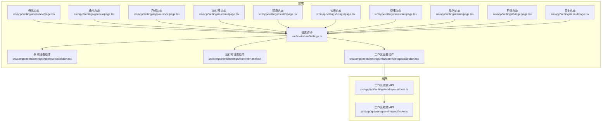
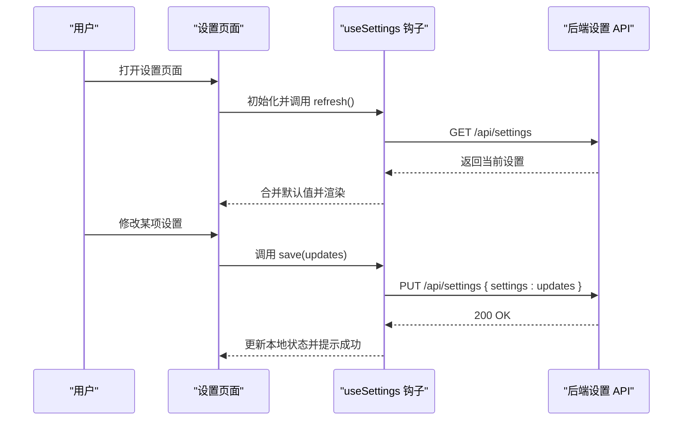
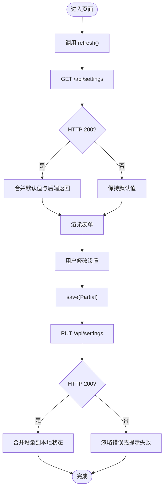
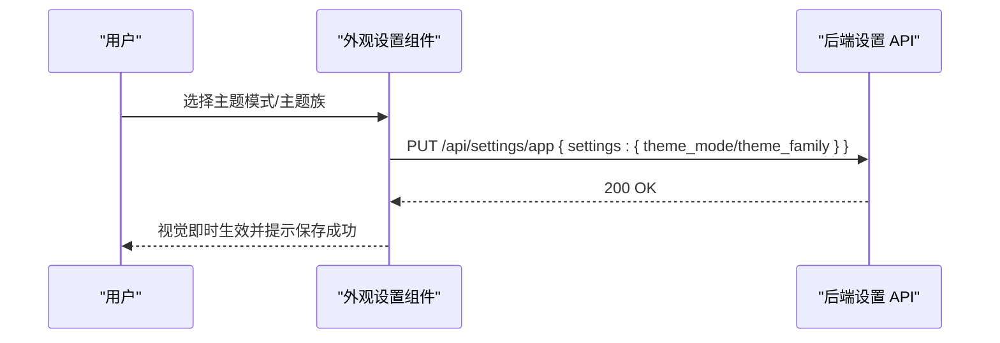
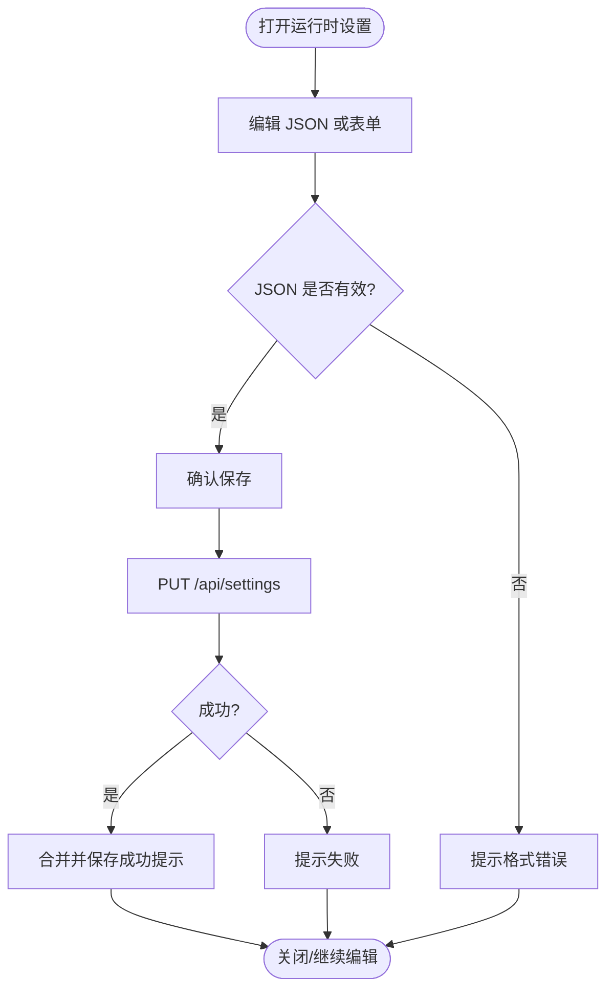
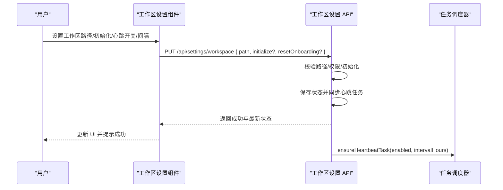
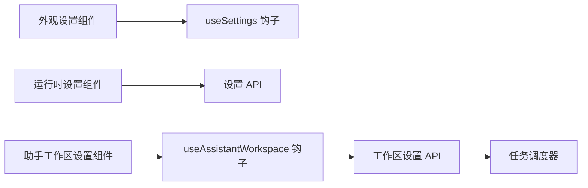

# 应用设置

<cite>
**本文引用的文件**
- [useSettings 钩子](file://src/hooks/useSettings.ts)
- [外观设置组件](file://src/components/settings/AppearanceSection.tsx)
- [运行时设置组件](file://src/components/settings/RuntimePanel.tsx)
- [设置导航配置](file://src/components/settings/nav-config.ts)
- [设置根页面（重定向）](file://src/app/settings/page.tsx)
- [外观设置页面](file://src/app/settings/appearance/page.tsx)
- [概览设置页面](file://src/app/settings/overview/page.tsx)
- [健康设置页面](file://src/app/settings/health/page.tsx)
- [关于设置页面](file://src/app/settings/about/page.tsx)
- [工作区设置 API](file://src/app/api/settings/workspace/route.ts)
- [工作区检查 API](file://src/app/api/workspace/inspect/route.ts)
- [助手工作区钩子](file://src/hooks/useAssistantWorkspace.ts)
- [助手工作区设置组件](file://src/components/settings/AssistantWorkspaceSection.tsx)
</cite>

## 目录
1. [简介](#简介)
2. [项目结构](#项目结构)
3. [核心组件](#核心组件)
4. [架构总览](#架构总览)
5. [详细组件分析](#详细组件分析)
6. [依赖关系分析](#依赖关系分析)
7. [性能考量](#性能考量)
8. [故障排查指南](#故障排查指南)
9. [结论](#结论)
10. [附录](#附录)

## 简介
本文件系统性阐述应用设置模块的设计与实现，覆盖通用设置、外观配置与概览信息管理；解释设置项的分类、验证与持久化策略；说明设置重置、默认值管理与批量修改能力；给出读取、更新与验证流程的代码路径指引；解析设置项间的依赖与联动；并涵盖设置界面的响应式布局与无障碍支持要点。同时，补充应用启动配置、工作区设置与通知偏好等关键功能的实现细节。

## 项目结构
设置系统由“前端页面 + 设置钩子 + 后端 API”三层构成：
- 前端页面：按功能划分的设置页面（概览、通用、外观、提供商、模型、运行时、健康、使用、助理、任务、桥接、关于），通过路由驱动。
- 设置钩子：统一的设置读写抽象，负责加载、保存与状态管理。
- 后端 API：提供设置读取、更新、校验与初始化等能力，并对工作区路径进行安全校验与权限检查。

图表来源
- [设置根页面（重定向）:33-50](file://src/app/settings/page.tsx#L33-L50)
- [外观设置页面:1-7](file://src/app/settings/appearance/page.tsx#L1-L7)
- [概览设置页面:1-7](file://src/app/settings/overview/page.tsx#L1-L7)
- [健康设置页面:1-7](file://src/app/settings/health/page.tsx#L1-L7)
- [关于设置页面:1-7](file://src/app/settings/about/page.tsx#L1-L7)
- [外观设置组件:137-204](file://src/components/settings/AppearanceSection.tsx#L137-L204)
- [运行时设置组件:857-907](file://src/components/settings/RuntimePanel.tsx#L857-L907)
- [工作区设置 API:107-264](file://src/app/api/settings/workspace/route.ts#L107-L264)
- [工作区检查 API:114-144](file://src/app/api/workspace/inspect/route.ts#L114-L144)

章节来源
- [设置根页面（重定向）:33-50](file://src/app/settings/page.tsx#L33-L50)
- [外观设置页面:1-7](file://src/app/settings/appearance/page.tsx#L1-L7)
- [概览设置页面:1-7](file://src/app/settings/overview/page.tsx#L1-L7)
- [健康设置页面:1-7](file://src/app/settings/health/page.tsx#L1-L7)
- [关于设置页面:1-7](file://src/app/settings/about/page.tsx#L1-L7)
- [外观设置组件:137-204](file://src/components/settings/AppearanceSection.tsx#L137-L204)
- [运行时设置组件:857-907](file://src/components/settings/RuntimePanel.tsx#L857-L907)
- [工作区设置 API:107-264](file://src/app/api/settings/workspace/route.ts#L107-L264)
- [工作区检查 API:114-144](file://src/app/api/workspace/inspect/route.ts#L114-L144)

## 核心组件
- 设置钩子 useSettings：提供统一的设置读取、保存与刷新能力，支持默认值合并与加载/保存状态管理。
- 外观设置组件：集中管理主题模式与主题族选择，并将变更持久化到后端。
- 运行时设置组件：提供 JSON 导入/导出、格式化与保存确认，支持重置与成功反馈。
- 工作区设置 API：对工作区路径进行存在性、可读写性校验，支持初始化与重置引导流程；同时维护心跳任务同步。
- 助手工作区设置组件：提供工作区路径设置、初始化与心跳开关/间隔调整，联动后端任务调度。

章节来源
- [useSettings 钩子:1-58](file://src/hooks/useSettings.ts#L1-L58)
- [外观设置组件:137-204](file://src/components/settings/AppearanceSection.tsx#L137-L204)
- [运行时设置组件:857-907](file://src/components/settings/RuntimePanel.tsx#L857-L907)
- [工作区设置 API:107-264](file://src/app/api/settings/workspace/route.ts#L107-L264)
- [助手工作区设置组件:493-524](file://src/components/settings/AssistantWorkspaceSection.tsx#L493-L524)

## 架构总览
设置系统采用“页面驱动 + 钩子抽象 + API 后端”的分层架构：
- 页面层：每个设置页对应一个客户端页面组件，负责渲染与交互。
- 钩子层：useSettings 提供统一的数据流与状态管理，避免重复的网络请求与状态逻辑。
- API 层：后端接口负责数据持久化、路径校验、权限检查与副作用（如任务调度）。

图表来源
- [useSettings 钩子:21-55](file://src/hooks/useSettings.ts#L21-L55)
- [外观设置组件:137-204](file://src/components/settings/AppearanceSection.tsx#L137-L204)
- [运行时设置组件:857-907](file://src/components/settings/RuntimePanel.tsx#L857-L907)

## 详细组件分析

### 设置钩子 useSettings
- 职责：封装设置的加载、保存、刷新与状态管理，支持默认值合并与错误兜底。
- 关键行为：
  - 初次加载：调用 refresh() 从后端拉取设置并合并默认值。
  - 保存：调用 save() 将增量更新提交至后端，成功后合并到本地状态。
  - 错误处理：网络异常或后端失败时保持本地状态不变，避免脏写。
- 默认值管理：在合并时以后端返回的 settings 字段为主，缺失项回退到 defaults。
- 批量修改：save 接受 Partial 类型，允许一次提交多个字段的增量更新。

图表来源
- [useSettings 钩子:17-55](file://src/hooks/useSettings.ts#L17-L55)

章节来源
- [useSettings 钩子:1-58](file://src/hooks/useSettings.ts#L1-L58)

### 外观设置（主题与主题族）
- 分类：外观设置包含“主题模式（跟随系统/浅色/深色）”和“主题族（字体族等）”两类。
- 验证与存储：组件内部调用后端接口将变更持久化；若处于系统模式，会显示当前系统所选明暗态的提示。
- 联动效果：主题模式切换会触发 UI 明暗态变化；主题族切换影响全局样式与排版。
- 无障碍与响应式：组件使用语义化标签与可访问性文案，卡片布局适配不同屏幕尺寸。

图表来源
- [外观设置组件:137-204](file://src/components/settings/AppearanceSection.tsx#L137-L204)

章节来源
- [外观设置组件:137-204](file://src/components/settings/AppearanceSection.tsx#L137-L204)

### 运行时设置（JSON 导入/导出与批量修改）
- 分类：运行时设置以“运行时配置”为核心，支持 JSON 文本导入/导出。
- 验证与存储：
  - JSON 校验：导入前进行 JSON.parse 校验，失败则提示错误。
  - 批量修改：支持一次性提交多字段更新，后端返回成功后本地立即反映。
- 重置与反馈：提供“重置为原始设置”与“格式化 JSON”功能；保存成功后短暂提示。
- 依赖关系：运行时设置变更可能影响任务调度与工作区状态，需确保后端一致性。

图表来源
- [运行时设置组件:857-907](file://src/components/settings/RuntimePanel.tsx#L857-L907)

章节来源
- [运行时设置组件:857-907](file://src/components/settings/RuntimePanel.tsx#L857-L907)

### 工作区设置（路径校验、初始化与心跳）
- 分类：工作区设置涉及“工作区路径”、“初始化”、“重置引导”、“心跳开关/间隔”等。
- 验证与存储：
  - 路径校验：检查路径是否存在、是否为目录、是否具备读写权限；不存在时仅在显式 initialize=true 时创建。
  - 初始化：在保存设置前执行初始化流程，保证原子性（失败不污染现有设置）。
  - 心跳同步：根据启用状态与间隔，调用任务调度器确保系统注入的心跳任务与用户设置一致。
- 与概览联动：工作区状态会影响概览中的引导完成度与最近心跳日期等指标。
- 与通知偏好联动：心跳触发可能产生通知，需结合通知偏好进行控制。

图表来源
- [工作区设置 API:107-264](file://src/app/api/settings/workspace/route.ts#L107-L264)
- [助手工作区设置组件:493-524](file://src/components/settings/AssistantWorkspaceSection.tsx#L493-L524)
- [助手工作区钩子:54-97](file://src/hooks/useAssistantWorkspace.ts#L54-L97)

章节来源
- [工作区设置 API:107-264](file://src/app/api/settings/workspace/route.ts#L107-L264)
- [助手工作区设置组件:493-524](file://src/components/settings/AssistantWorkspaceSection.tsx#L493-L524)
- [助手工作区钩子:54-97](file://src/hooks/useAssistantWorkspace.ts#L54-L97)

### 设置导航与页面组织
- 导航顺序：概览 → 通用 → 外观 → 提供商 → 模型 → 运行时 → 健康 → 使用 → 助理 → 任务 → 桥接 → 关于。
- 路由映射：每个设置页对应独立路由，根页面负责根据哈希重定向到目标页。
- 无障碍与响应式：导航使用语义化结构与可访问性标签，卡片式布局在移动端自适应。

章节来源
- [设置导航配置:37-78](file://src/components/settings/nav-config.ts#L37-L78)
- [设置根页面（重定向）:33-50](file://src/app/settings/page.tsx#L33-L50)

## 依赖关系分析
- 组件耦合：
  - 外观设置组件依赖 useSettings 与主题钩子，负责将变更持久化。
  - 运行时设置组件直接调用 /api/settings，内部包含 JSON 校验与保存流程。
  - 助手工作区设置组件依赖 useAssistantWorkspace 与工作区设置 API，负责路径设置、初始化与心跳同步。
- 外部依赖：
  - 后端 API 提供统一的设置读写入口与工作区管理能力。
  - 任务调度器用于确保心跳任务与用户设置保持一致。

图表来源
- [外观设置组件:137-204](file://src/components/settings/AppearanceSection.tsx#L137-L204)
- [运行时设置组件:857-907](file://src/components/settings/RuntimePanel.tsx#L857-L907)
- [助手工作区设置组件:493-524](file://src/components/settings/AssistantWorkspaceSection.tsx#L493-L524)
- [助手工作区钩子:54-97](file://src/hooks/useAssistantWorkspace.ts#L54-L97)
- [工作区设置 API:249-257](file://src/app/api/settings/workspace/route.ts#L249-L257)

章节来源
- [外观设置组件:137-204](file://src/components/settings/AppearanceSection.tsx#L137-L204)
- [运行时设置组件:857-907](file://src/components/settings/RuntimePanel.tsx#L857-L907)
- [助手工作区设置组件:493-524](file://src/components/settings/AssistantWorkspaceSection.tsx#L493-L524)
- [助手工作区钩子:54-97](file://src/hooks/useAssistantWorkspace.ts#L54-L97)
- [工作区设置 API:249-257](file://src/app/api/settings/workspace/route.ts#L249-L257)

## 性能考量
- 请求去抖与并发：useSettings 在刷新与保存时应避免重复请求；建议在高频更新场景中引入节流/防抖。
- 本地缓存：对于非关键设置，可在本地缓存以减少网络往返；但需注意与后端状态的最终一致性。
- 渲染优化：卡片式布局与懒加载有助于提升大列表设置的渲染性能。
- 任务调度：心跳任务的启用/禁用与间隔调整应幂等，避免重复注册导致资源浪费。

## 故障排查指南
- 设置保存失败：
  - 检查后端返回状态码与错误信息；常见原因包括网络异常、权限不足或路径无效。
  - 参考路径校验与权限检查逻辑，确认工作区路径存在且具备读写权限。
- JSON 导入报错：
  - 确认 JSON 格式正确；运行时设置组件会在解析失败时提示错误。
- 主题切换无效果：
  - 确认已调用持久化接口；若处于系统模式，组件会显示当前系统明暗态提示。
- 心跳未触发：
  - 检查工作区设置中的启用状态与间隔；后端会根据设置同步任务调度器。

章节来源
- [运行时设置组件:857-907](file://src/components/settings/RuntimePanel.tsx#L857-L907)
- [工作区设置 API:107-264](file://src/app/api/settings/workspace/route.ts#L107-L264)

## 结论
设置系统通过统一的钩子抽象与清晰的前后端职责划分，实现了设置项的标准化读取、验证与持久化。外观与运行时设置提供了直观的交互体验，而工作区设置则在安全性与一致性上做了充分保障。未来可在批量修改、离线缓存与更细粒度的联动规则方面进一步增强。

## 附录
- 代码示例路径（不含具体代码内容）：
  - 读取设置：[useSettings 钩子:21-33](file://src/hooks/useSettings.ts#L21-L33)
  - 更新设置：[useSettings 钩子:39-55](file://src/hooks/useSettings.ts#L39-L55)
  - 外观设置持久化：[外观设置组件:139-145](file://src/components/settings/AppearanceSection.tsx#L139-L145)
  - 运行时设置保存与重置：[运行时设置组件:857-907](file://src/components/settings/RuntimePanel.tsx#L857-L907)
  - 工作区路径设置与初始化：[助手工作区钩子:54-79](file://src/hooks/useAssistantWorkspace.ts#L54-L79)
  - 工作区状态同步与心跳任务：[工作区设置 API:249-257](file://src/app/api/settings/workspace/route.ts#L249-L257)