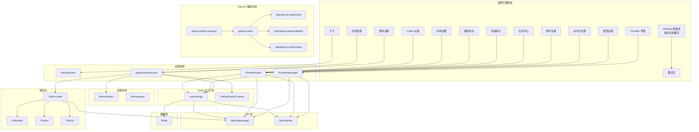
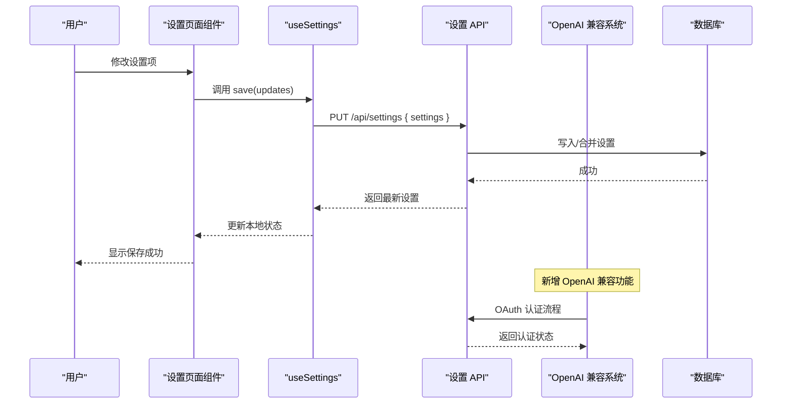
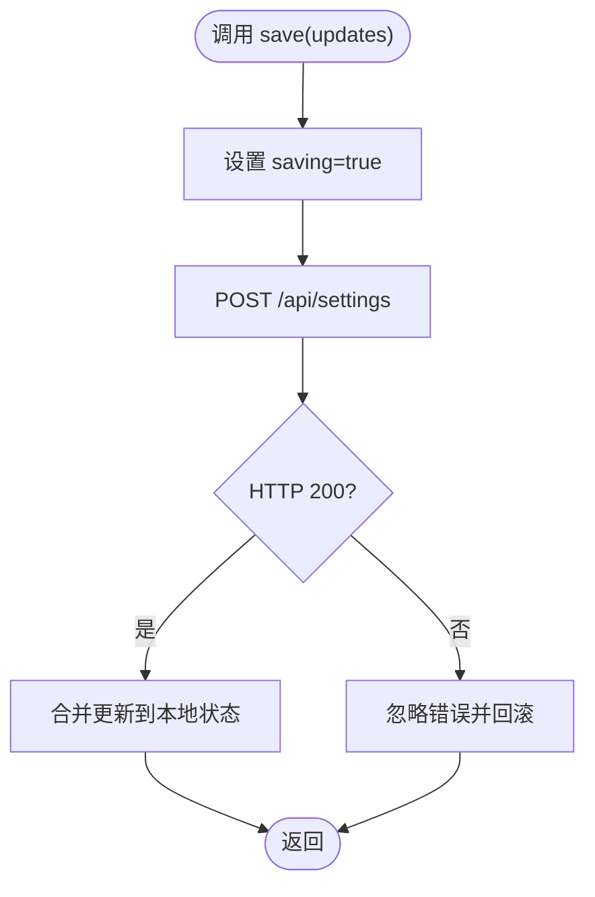
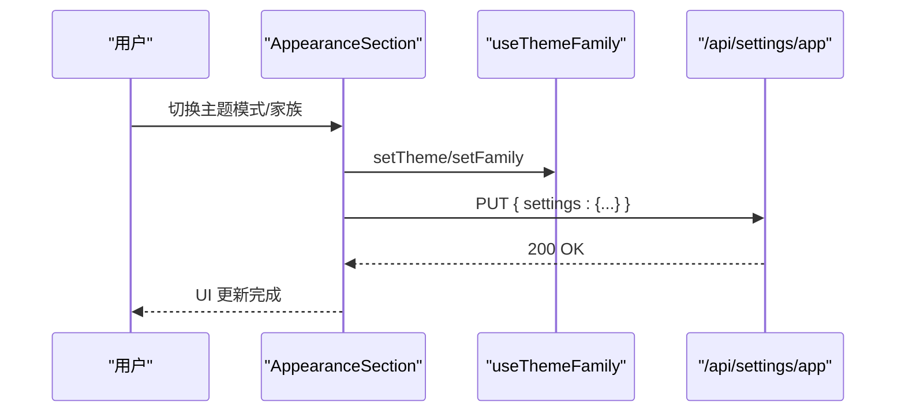
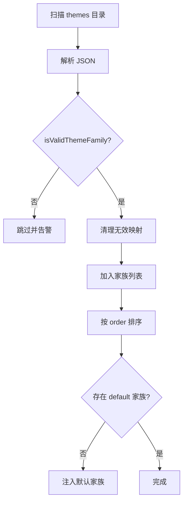
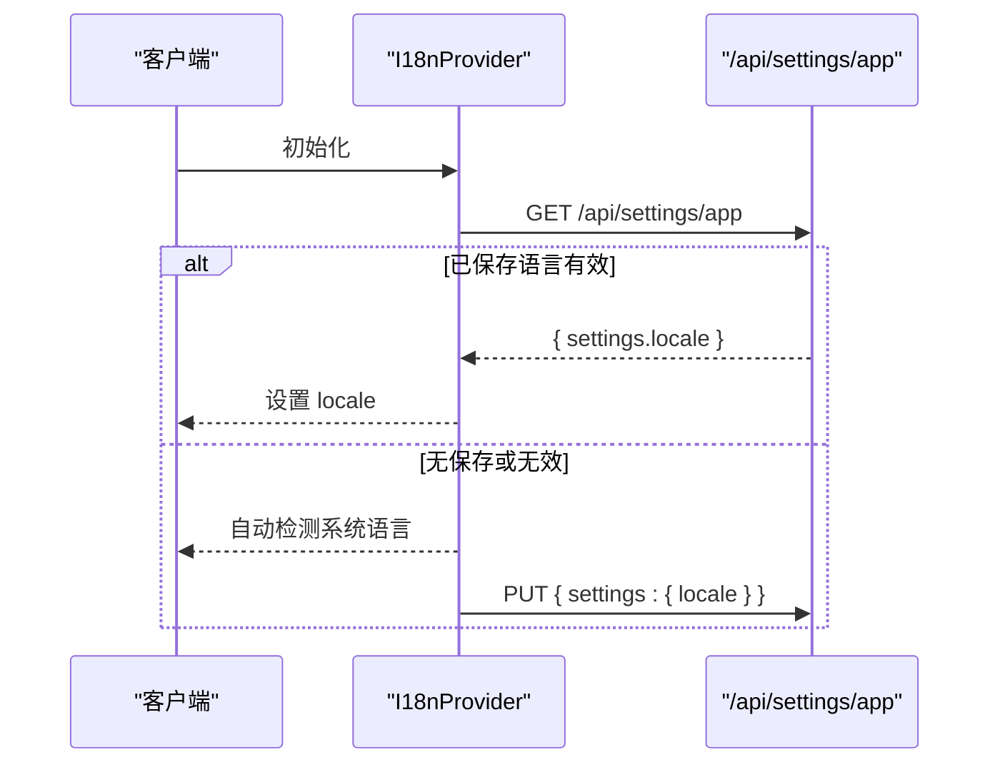
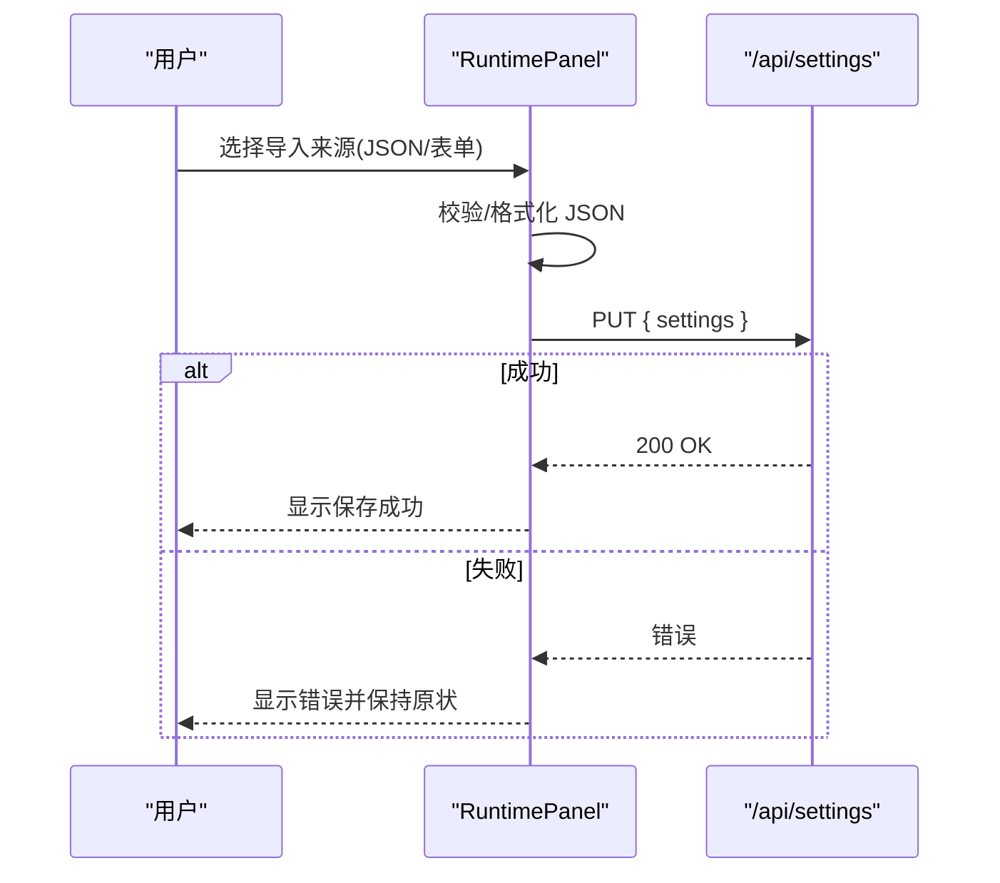
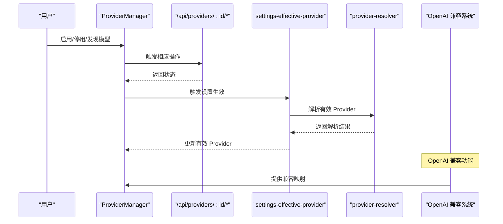
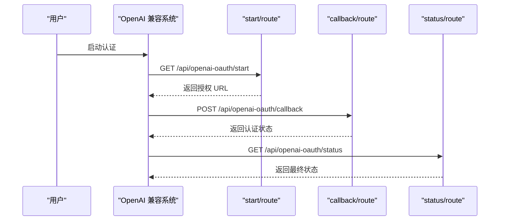
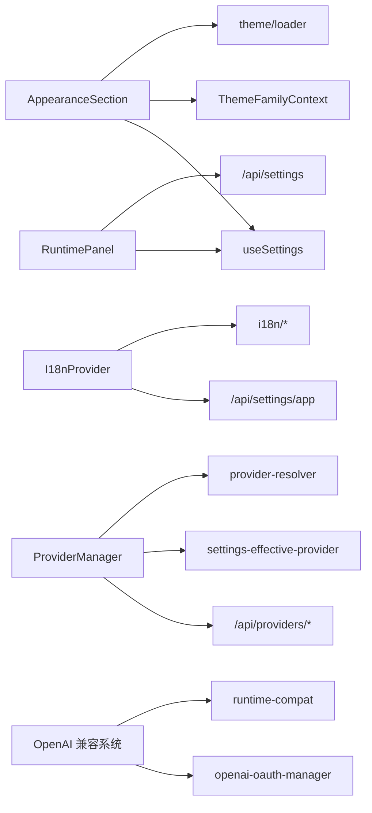

# 设置管理系统

<cite>
**本文引用的文件**
- [src/app/settings/layout.tsx](file://src/app/settings/layout.tsx)
- [src/app/settings/page.tsx](file://src/app/settings/page.tsx)
- [src/components/settings/AppearanceSection.tsx](file://src/components/settings/AppearanceSection.tsx)
- [src/lib/theme/loader.ts](file://src/lib/theme/loader.ts)
- [src/lib/theme/context.ts](file://src/lib/theme/context.ts)
- [src/lib/theme/types.ts](file://src/lib/theme/types.ts)
- [src/components/layout/I18nProvider.tsx](file://src/components/layout/I18nProvider.tsx)
- [src/hooks/useSettings.ts](file://src/hooks/useSettings.ts)
- [src/components/settings/RuntimePanel.tsx](file://src/components/settings/RuntimePanel.tsx)
- [src/app/api/settings/route.ts](file://src/app/api/settings/route.ts)
- [src/app/api/settings/app/route.ts](file://src/app/api/settings/app/route.ts)
- [src/components/settings/ProviderManager.tsx](file://src/components/settings/ProviderManager.tsx)
- [src/app/settings/providers/page.tsx](file://src/app/settings/providers/page.tsx)
- [src/lib/provider-resolver.ts](file://src/lib/provider-resolver.ts)
- [src/lib/harness/settings-effective-provider.ts](file://src/lib/harness/settings-effective-provider.ts)
- [src/i18n/index.ts](file://src/i18n/index.ts)
- [src/i18n/en.ts](file://src/i18n/en.ts)
- [src/i18n/zh.ts](file://src/i18n/zh.ts)
- [src/lib/db.ts](file://src/lib/db.ts)
- [src/components/settings/nav-config.ts](file://src/components/settings/nav-config.ts)
- [src/components/settings/AboutSection.tsx](file://src/components/settings/AboutSection.tsx)
- [src/app/settings/general/page.tsx](file://src/app/settings/general/page.tsx)
- [src/app/settings/appearance/page.tsx](file://src/app/settings/appearance/page.tsx)
- [src/app/settings/overview/page.tsx](file://src/app/settings/overview/page.tsx)
- [src/app/settings/about/page.tsx](file://src/app/settings/about/page.tsx)
- [src/app/settings/models/page.tsx](file://src/app/settings/models/page.tsx)
- [src/app/settings/runtime/page.tsx](file://src/app/settings/runtime/page.tsx)
- [src/app/settings/tasks/page.tsx](file://src/app/settings/tasks/page.tsx)
- [src/app/settings/usage/page.tsx](file://src/app/settings/usage/page.tsx)
- [src/app/settings/assistant/page.tsx](file://src/app/settings/assistant/page.tsx)
- [src/app/settings/health/page.tsx](file://src/app/settings/health/page.tsx)
- [src/app/settings/bridge/page.tsx](file://src/app/settings/bridge/page.tsx)
- [src/app/settings/codex/page.tsx](file://src/app/settings/codex/page.tsx)
- [src/lib/openai-oauth.ts](file://src/lib/openai-oauth.ts)
- [src/lib/openai-oauth-manager.ts](file://src/lib/openai-oauth-manager.ts)
- [src/app/api/openai-oauth/start/route.ts](file://src/app/api/openai-oauth/start/route.ts)
- [src/app/api/openai-oauth/callback/route.ts](file://src/app/api/openai-oauth/callback/route.ts)
- [src/app/api/openai-oauth/status/route.ts](file://src/app/api/openai-oauth/status/route.ts)
- [src/__tests__/unit/openai-compatible-provider.test.ts](file://src/__tests__/unit/openai-compatible-provider.test.ts)
- [src/lib/runtime-compat.ts](file://src/lib/runtime-compat.ts)
</cite>

## 目录
1. [引言](#引言)
2. [项目结构](#项目结构)
3. [核心组件](#核心组件)
4. [架构总览](#架构总览)
5. [详细组件分析](#详细组件分析)
6. [依赖分析](#依赖分析)
7. [性能考虑](#性能考虑)
8. [故障排查指南](#故障排查指南)
9. [结论](#结论)
10. [附录](#附录)

## 引言
本文件系统性梳理设置管理系统的实现，覆盖应用配置、主题设置与 Provider 管理三大部分。重点解释设置项的数据结构、验证规则与持久化存储；阐述设置导入导出、同步机制与备份恢复能力；给出设置管理和配置应用的完整流程示例；说明设置项的依赖关系、优先级与冲突处理；并介绍设置界面的国际化支持与动态配置更新机制。

**更新** 本次更新重点反映了 OpenAI 兼容提供程序集成能力的增强，包括通用 OpenAI 兼容预设、连接测试和运行时兼容映射的实现。

## 项目结构
设置系统由"页面路由 + 组件 + Hook + 主题库 + 国际化 + API 层 + 数据层"构成，采用分层设计与模块化组织，确保可维护性与扩展性。

**图表来源**
- [src/app/settings/layout.tsx](file://src/app/settings/layout.tsx)
- [src/app/settings/page.tsx](file://src/app/settings/page.tsx)
- [src/components/settings/AppearanceSection.tsx](file://src/components/settings/AppearanceSection.tsx)
- [src/lib/theme/loader.ts](file://src/lib/theme/loader.ts)
- [src/lib/theme/context.ts](file://src/lib/theme/context.ts)
- [src/components/layout/I18nProvider.tsx](file://src/components/layout/I18nProvider.tsx)
- [src/hooks/useSettings.ts](file://src/hooks/useSettings.ts)
- [src/components/settings/RuntimePanel.tsx](file://src/components/settings/RuntimePanel.tsx)
- [src/app/api/settings/route.ts](file://src/app/api/settings/route.ts)
- [src/app/api/settings/app/route.ts](file://src/app/api/settings/app/route.ts)
- [src/lib/db.ts](file://src/lib/db.ts)
- [src/lib/openai-oauth.ts](file://src/lib/openai-oauth.ts)
- [src/lib/openai-oauth-manager.ts](file://src/lib/openai-oauth-manager.ts)
- [src/app/api/openai-oauth/start/route.ts](file://src/app/api/openai-oauth/start/route.ts)
- [src/app/api/openai-oauth/callback/route.ts](file://src/app/api/openai-oauth/callback/route.ts)
- [src/app/api/openai-oauth/status/route.ts](file://src/app/api/openai-oauth/status/route.ts)

**章节来源**
- [src/app/settings/layout.tsx](file://src/app/settings/layout.tsx)
- [src/app/settings/page.tsx](file://src/app/settings/page.tsx)
- [src/components/settings/nav-config.ts](file://src/components/settings/nav-config.ts)

## 核心组件
- 应用设置 Hook：统一的设置读取、保存与刷新逻辑，支持并发安全与错误兜底。
- 外观设置组件：提供主题模式与主题家族选择，并持久化到后端。
- 主题加载器：从本地主题目录加载并校验主题家族，提供元数据与渲染支持。
- 国际化提供者：负责语言切换、持久化与自动检测。
- 运行时设置面板：提供设置导入导出、格式化、确认保存与成功提示。
- Provider 管理：集中管理 Provider 的启用、发现模型、应用变更等。
- 设置导航：将路由与侧边栏导航项映射，支持哈希重定向与高亮。
- OpenAI 兼容系统：提供通用 OpenAI 兼容预设、OAuth 认证与连接测试功能。

**章节来源**
- [src/hooks/useSettings.ts](file://src/hooks/useSettings.ts)
- [src/components/settings/AppearanceSection.tsx](file://src/components/settings/AppearanceSection.tsx)
- [src/lib/theme/loader.ts](file://src/lib/theme/loader.ts)
- [src/components/layout/I18nProvider.tsx](file://src/components/layout/I18nProvider.tsx)
- [src/components/settings/RuntimePanel.tsx](file://src/components/settings/RuntimePanel.tsx)
- [src/components/settings/ProviderManager.tsx](file://src/components/settings/ProviderManager.tsx)
- [src/components/settings/nav-config.ts](file://src/components/settings/nav-config.ts)
- [src/lib/openai-oauth.ts](file://src/lib/openai-oauth.ts)
- [src/lib/openai-oauth-manager.ts](file://src/lib/openai-oauth-manager.ts)

## 架构总览
设置系统遵循"前端组件 + Hook + API 层 + 数据层"的分层架构。前端通过 Hook 与 API 交互，API 将请求转发至数据层进行持久化；主题与国际化作为独立子系统被各页面复用。新增的 OpenAI 兼容系统提供了统一的 OpenAI 兼容协议支持，包括通用预设、OAuth 认证和运行时兼容映射。

**图表来源**
- [src/hooks/useSettings.ts](file://src/hooks/useSettings.ts)
- [src/app/api/settings/route.ts](file://src/app/api/settings/route.ts)
- [src/lib/db.ts](file://src/lib/db.ts)
- [src/lib/openai-oauth.ts](file://src/lib/openai-oauth.ts)

## 详细组件分析

### 应用设置 Hook：useSettings
- 功能要点
  - 初始化默认值与空状态
  - 首次挂载拉取远端设置，合并默认值
  - 提供 save 与 refresh 方法，内部封装并发控制与错误处理
  - 适用于任意键值对设置集合
- 数据结构
  - 泛型参数 T 表示设置对象的键值类型，如字符串键映射
  - 返回 settings、loading、saving、save、refresh
- 错误处理
  - 请求失败或解析异常时保持本地状态不变，避免 UI 抖动
- 性能特性
  - 使用 useCallback 缓解重渲染
  - 并发保存时仅保留最后一次结果

**图表来源**
- [src/hooks/useSettings.ts](file://src/hooks/useSettings.ts)

**章节来源**
- [src/hooks/useSettings.ts](file://src/hooks/useSettings.ts)

### 外观设置：AppearanceSection
- 功能要点
  - 通过 useTheme 与 useThemeFamily 获取当前主题模式与主题家族
  - 用户切换后立即调用持久化函数，异步写入后端
  - 支持主题预览与代码着色预览
- 持久化策略
  - 调用 /api/settings/app 的 PUT 接口，写入 { settings: { theme_mode, theme_family } }
  - 最佳努力写入，失败不阻塞 UI
- 依赖关系
  - 依赖 useSettings 的通用保存流程
  - 依赖主题加载器提供主题家族列表与元数据

**图表来源**
- [src/components/settings/AppearanceSection.tsx](file://src/components/settings/AppearanceSection.tsx)
- [src/app/api/settings/app/route.ts](file://src/app/api/settings/app/route.ts)

**章节来源**
- [src/components/settings/AppearanceSection.tsx](file://src/components/settings/AppearanceSection.tsx)

### 主题系统：加载与校验
- 主题家族数据结构
  - 包含 id、label、order、light/dark 颜色集、可选 codeTheme/shikiTheme 映射
  - 通过 isValidThemeFamily 与 isValidCodeThemeMapping 校验
- 加载流程
  - 读取 themes 目录下的 JSON 文件
  - 校验并清洗无效字段，保证健壮性
  - 若缺失默认家族则注入默认值，按 order 排序
- 渲染与预览
  - 提供 getThemeFamilyMetas 生成轻量元数据用于客户端选择
  - 代码主题映射用于编辑器着色

**图表来源**
- [src/lib/theme/loader.ts](file://src/lib/theme/loader.ts)
- [src/lib/theme/types.ts](file://src/lib/theme/types.ts)

**章节来源**
- [src/lib/theme/loader.ts](file://src/lib/theme/loader.ts)
- [src/lib/theme/context.ts](file://src/lib/theme/context.ts)
- [src/lib/theme/types.ts](file://src/lib/theme/types.ts)

### 国际化：I18nProvider
- 功能要点
  - 在客户端首次加载时尝试从 /api/settings/app 读取已保存的语言
  - 若未设置则根据浏览器/系统语言自动检测 zh 或 en
  - 提供 setLocale 与 t 翻译函数
- 持久化策略
  - 通过 /api/settings/app 的 PUT 接口写入 { settings: { locale } }
- 与设置页面联动
  - 语言变更会触发翻译函数重新计算，组件自动更新

**图表来源**
- [src/components/layout/I18nProvider.tsx](file://src/components/layout/I18nProvider.tsx)
- [src/app/api/settings/app/route.ts](file://src/app/api/settings/app/route.ts)

**章节来源**
- [src/components/layout/I18nProvider.tsx](file://src/components/layout/I18nProvider.tsx)

### 运行时设置面板：导入导出与同步
- 导入导出
  - 支持从表单或 JSON 文本导入设置
  - 提供 JSON 格式化与错误提示
- 同步与备份
  - 保存成功后更新本地副本与原始快照
  - 通过 /api/settings 的 PUT 接口写入全量设置
- 冲突与回滚
  - 保存失败保持原状，避免部分写入
  - 提供重置按钮恢复到原始快照

**图表来源**
- [src/components/settings/RuntimePanel.tsx](file://src/components/settings/RuntimePanel.tsx)
- [src/app/api/settings/route.ts](file://src/app/api/settings/route.ts)

**章节来源**
- [src/components/settings/RuntimePanel.tsx](file://src/components/settings/RuntimePanel.tsx)

### Provider 管理：声明式配置与治理
- 页面入口
  - /settings/providers 对应 ProviderManager 组件
- 管理能力
  - 启用/停用 Provider
  - 发现并应用模型
  - 与设置系统协同，影响全局默认 Provider 解析
- 与设置解析的关系
  - 通过 provider-resolver 与 settings-effective-provider 协作
  - 依据用户设置与激活状态决定有效 Provider
- OpenAI 兼容支持
  - 新增通用 OpenAI 兼容预设支持
  - 提供连接测试功能
  - 实现运行时兼容映射

**图表来源**
- [src/app/settings/providers/page.tsx](file://src/app/settings/providers/page.tsx)
- [src/components/settings/ProviderManager.tsx](file://src/components/settings/ProviderManager.tsx)
- [src/lib/harness/settings-effective-provider.ts](file://src/lib/harness/settings-effective-provider.ts)
- [src/lib/provider-resolver.ts](file://src/lib/provider-resolver.ts)
- [src/lib/openai-oauth.ts](file://src/lib/openai-oauth.ts)

**章节来源**
- [src/app/settings/providers/page.tsx](file://src/app/settings/providers/page.tsx)
- [src/components/settings/ProviderManager.tsx](file://src/components/settings/ProviderManager.tsx)
- [src/lib/harness/settings-effective-provider.ts](file://src/lib/harness/settings-effective-provider.ts)
- [src/lib/provider-resolver.ts](file://src/lib/provider-resolver.ts)

### OpenAI 兼容系统：通用预设与认证
- 功能概述
  - 提供通用 OpenAI 兼容预设，支持任意 OpenAI 兼容网关
  - 实现完整的 OAuth 认证流程
  - 提供连接测试与运行时兼容映射
- 认证流程
  - start/route.ts：启动 OAuth 流程
  - callback/route.ts：处理回调并验证状态
  - status/route.ts：查询认证状态
- 运行时兼容
  - 通过 runtime-compat.ts 实现协议兼容映射
  - 支持 openai-compatible 协议的有效协议解析

**图表来源**
- [src/lib/openai-oauth.ts](file://src/lib/openai-oauth.ts)
- [src/lib/openai-oauth-manager.ts](file://src/lib/openai-oauth-manager.ts)
- [src/app/api/openai-oauth/start/route.ts](file://src/app/api/openai-oauth/start/route.ts)
- [src/app/api/openai-oauth/callback/route.ts](file://src/app/api/openai-oauth/callback/route.ts)
- [src/app/api/openai-oauth/status/route.ts](file://src/app/api/openai-oauth/status/route.ts)
- [src/lib/runtime-compat.ts](file://src/lib/runtime-compat.ts)

**章节来源**
- [src/lib/openai-oauth.ts](file://src/lib/openai-oauth.ts)
- [src/lib/openai-oauth-manager.ts](file://src/lib/openai-oauth-manager.ts)
- [src/app/api/openai-oauth/start/route.ts](file://src/app/api/openai-oauth/start/route.ts)
- [src/app/api/openai-oauth/callback/route.ts](file://src/app/api/openai-oauth/callback/route.ts)
- [src/app/api/openai-oauth/status/route.ts](file://src/app/api/openai-oauth/status/route.ts)
- [src/lib/runtime-compat.ts](file://src/lib/runtime-compat.ts)

### 设置导航与页面布局
- 导航映射
  - 将 pathname 映射到设置分组，支持 /settings 重定向与哈希定位
- 页面布局
  - 设置根布局承载侧边栏与主内容区，确保一致的导航体验

**章节来源**
- [src/components/settings/nav-config.ts](file://src/components/settings/nav-config.ts)
- [src/app/settings/layout.tsx](file://src/app/settings/layout.tsx)
- [src/app/settings/page.tsx](file://src/app/settings/page.tsx)

### 关于页面：平台信息与版本
- 展示操作系统、渠道与应用版本等信息，便于问题定位与报告

**章节来源**
- [src/components/settings/AboutSection.tsx](file://src/components/settings/AboutSection.tsx)

## 依赖分析
- 组件耦合
  - AppearanceSection 依赖 useSettings 与主题上下文
  - RuntimePanel 依赖 useSettings 与 API
  - I18nProvider 依赖 API 与翻译字典
  - ProviderManager 依赖 API 与解析器
  - OpenAI 兼容系统依赖 OAuth 管理器与运行时兼容映射
- 外部依赖
  - API 层负责与数据库交互
  - 主题加载器依赖本地主题文件
  - 国际化依赖翻译键值与系统语言检测
  - OAuth 认证依赖外部服务提供商

**图表来源**
- [src/components/settings/AppearanceSection.tsx](file://src/components/settings/AppearanceSection.tsx)
- [src/hooks/useSettings.ts](file://src/hooks/useSettings.ts)
- [src/lib/theme/loader.ts](file://src/lib/theme/loader.ts)
- [src/components/layout/I18nProvider.tsx](file://src/components/layout/I18nProvider.tsx)
- [src/components/settings/RuntimePanel.tsx](file://src/components/settings/RuntimePanel.tsx)
- [src/app/api/settings/route.ts](file://src/app/api/settings/route.ts)
- [src/app/api/settings/app/route.ts](file://src/app/api/settings/app/route.ts)
- [src/components/settings/ProviderManager.tsx](file://src/components/settings/ProviderManager.tsx)
- [src/lib/harness/settings-effective-provider.ts](file://src/lib/harness/settings-effective-provider.ts)
- [src/lib/provider-resolver.ts](file://src/lib/provider-resolver.ts)
- [src/lib/openai-oauth-manager.ts](file://src/lib/openai-oauth-manager.ts)
- [src/lib/runtime-compat.ts](file://src/lib/runtime-compat.ts)

**章节来源**
- [src/components/settings/AppearanceSection.tsx](file://src/components/settings/AppearanceSection.tsx)
- [src/components/settings/RuntimePanel.tsx](file://src/components/settings/RuntimePanel.tsx)
- [src/components/layout/I18nProvider.tsx](file://src/components/layout/I18nProvider.tsx)
- [src/components/settings/ProviderManager.tsx](file://src/components/settings/ProviderManager.tsx)
- [src/lib/openai-oauth-manager.ts](file://src/lib/openai-oauth-manager.ts)
- [src/lib/runtime-compat.ts](file://src/lib/runtime-compat.ts)

## 性能考虑
- 减少重渲染
  - useSettings 中使用 useCallback 匫裹 save/refresh
  - AppearanceSection 使用 mounted 标记避免首屏闪烁
- 网络优化
  - 保存采用最佳努力策略，失败不阻塞 UI
  - 批量保存时仅保留最后一次结果
  - OAuth 认证流程采用异步处理，避免阻塞主线程
- 主题加载
  - 缓存主题家族列表，避免重复 IO
  - 严格校验与清洗，降低渲染期异常开销
- OpenAI 兼容优化
  - 连接测试采用超时机制，避免长时间等待
  - 兼容映射缓存，减少重复计算

## 故障排查指南
- 设置保存失败
  - 检查 /api/settings 是否可达，确认返回状态码
  - 查看 useSettings 的错误兜底逻辑是否触发
- 主题切换无效
  - 确认 /api/settings/app 的写入是否成功
  - 检查主题加载器是否正确解析主题文件
- 语言切换未生效
  - 确认 I18nProvider 是否正确读取与写入 locale
  - 检查翻译键是否存在对应文案
- Provider 变更未生效
  - 检查 /api/providers/* 的响应状态
  - 确认 settings-effective-provider 的解析链路
- OpenAI 兼容认证失败
  - 检查 /api/openai-oauth/start 的授权 URL 是否正确
  - 确认 /api/openai-oauth/callback 的回调处理是否正常
  - 验证 /api/openai-oauth/status 的状态查询
- 连接测试超时
  - 检查网络连接与代理设置
  - 确认目标服务的可用性
  - 验证兼容映射配置是否正确

**章节来源**
- [src/hooks/useSettings.ts](file://src/hooks/useSettings.ts)
- [src/lib/theme/loader.ts](file://src/lib/theme/loader.ts)
- [src/components/layout/I18nProvider.tsx](file://src/components/layout/I18nProvider.tsx)
- [src/lib/harness/settings-effective-provider.ts](file://src/lib/harness/settings-effective-provider.ts)
- [src/lib/openai-oauth.ts](file://src/lib/openai-oauth.ts)
- [src/app/api/openai-oauth/start/route.ts](file://src/app/api/openai-oauth/start/route.ts)
- [src/app/api/openai-oauth/callback/route.ts](file://src/app/api/openai-oauth/callback/route.ts)
- [src/app/api/openai-oauth/status/route.ts](file://src/app/api/openai-oauth/status/route.ts)

## 结论
设置管理系统以 Hook 为核心抽象，结合 API 层与数据层，实现了配置的统一读写、主题与国际化的解耦、Provider 的治理与解析。通过严格的校验与错误兜底，保障了用户体验与系统稳定性。

**更新** 新增的 OpenAI 兼容系统显著增强了系统的互操作性和扩展性，通过通用预设、OAuth 认证和运行时兼容映射，为用户提供了更加灵活和强大的配置管理能力。建议后续在以下方面持续演进：完善设置项的 Schema 校验、增强导入导出的幂等性与回滚能力、扩展多租户场景下的设置隔离与继承策略、优化 OpenAI 兼容系统的性能和可靠性。

## 附录
- 设置 API 路由
  - GET /api/settings → 获取全部设置
  - PUT /api/settings → 更新全部设置
  - GET /api/settings/app → 获取应用级设置
  - PUT /api/settings/app → 更新应用级设置
- OpenAI OAuth API 路由
  - GET /api/openai-oauth/start → 启动认证流程
  - POST /api/openai-oauth/callback → 处理回调
  - GET /api/openai-oauth/status → 查询认证状态
- 主题文件规范
  - 必填字段：id、label、order、light、dark
  - 可选字段：codeTheme、shikiTheme
  - 校验规则：颜色值非空，映射键为非空字符串
- 国际化键值
  - 使用 i18n/index.ts 的键空间，en/zh 分别提供翻译
- OpenAI 兼容协议
  - 支持 openai-compatible 协议
  - 提供通用预设和连接测试
  - 实现运行时兼容映射

**章节来源**
- [src/app/api/settings/route.ts](file://src/app/api/settings/route.ts)
- [src/app/api/settings/app/route.ts](file://src/app/api/settings/app/route.ts)
- [src/app/api/openai-oauth/start/route.ts](file://src/app/api/openai-oauth/start/route.ts)
- [src/app/api/openai-oauth/callback/route.ts](file://src/app/api/openai-oauth/callback/route.ts)
- [src/app/api/openai-oauth/status/route.ts](file://src/app/api/openai-oauth/status/route.ts)
- [src/lib/theme/loader.ts](file://src/lib/theme/loader.ts)
- [src/i18n/index.ts](file://src/i18n/index.ts)
- [src/i18n/en.ts](file://src/i18n/en.ts)
- [src/i18n/zh.ts](file://src/i18n/zh.ts)
- [src/lib/openai-oauth.ts](file://src/lib/openai-oauth.ts)
- [src/lib/runtime-compat.ts](file://src/lib/runtime-compat.ts)