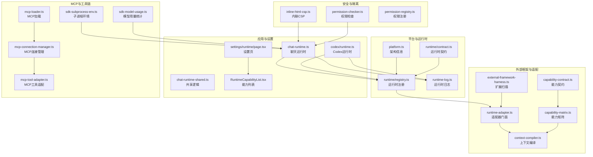
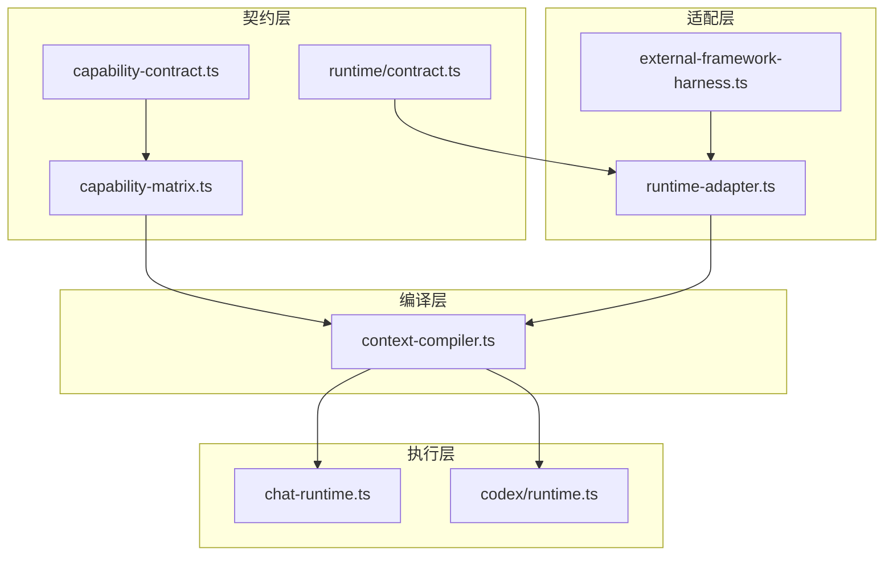
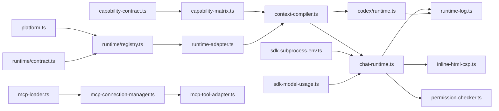

# 运行时管理

<cite>
**本文引用的文件**
- [src/lib/platform.ts](file://src/lib/platform.ts)
- [src/lib/rpc.ts](file://src/lib/rpc.ts)
- [src/lib/runtime-log.ts](file://src/lib/runtime-log.ts)
- [src/lib/runtime/contract.ts](file://src/lib/runtime/contract.ts)
- [src/lib/runtime/registry.ts](file://src/lib/runtime/registry.ts)
- [src/lib/runtime-compat.ts](file://src/lib/runtime-compat.ts)
- [src/lib/harness/capability-contract.ts](file://src/lib/harness/capability-contract.ts)
- [src/lib/harness/capability-matrix.ts](file://src/lib/harness/capability-matrix.ts)
- [src/lib/harness/context-compiler.ts](file://src/lib/harness/context-compiler.ts)
- [src/lib/harness/runtime-adapter.ts](file://src/lib/harness/runtime-adapter.ts)
- [src/lib/harness/external-framework-harness.ts](file://src/lib/harness/external-framework-harness.ts)
- [src/lib/chat-runtime.ts](file://src/lib/chat-runtime.ts)
- [src/lib/chat-runtime-shared.ts](file://src/lib/chat-runtime-shared.ts)
- [src/lib/codex/runtime.ts](file://src/lib/codex/runtime.ts)
- [src/lib/sdk-subprocess-env.ts](file://src/lib/sdk-subprocess-env.ts)
- [src/lib/sdk-model-usage.ts](file://src/lib/sdk-model-usage.ts)
- [src/app/settings/runtime/page.tsx](file://src/app/settings/runtime/page.tsx)
- [src/components/settings/RuntimeCapabilityList.tsx](file://src/components/settings/RuntimeCapabilityList.tsx)
- [src/hooks/useGlobalAgentRuntime.ts](file://src/hooks/useGlobalAgentRuntime.ts)
- [src/lib/permission-checker.ts](file://src/lib/permission-checker.ts)
- [src/lib/permission-registry.ts](file://src/lib/permission-registry.ts)
- [src/lib/inline-html-csp.ts](file://src/lib/inline-html-csp.ts)
- [src/lib/agent-loop.ts](file://src/lib/agent-loop.ts)
- [src/lib/agent-task-runner.ts](file://src/lib/agent-task-runner.ts)
- [src/lib/stream-session-manager.ts](file://src/lib/stream-session-manager.ts)
- [src/lib/mcp-loader.ts](file://src/lib/mcp-loader.ts)
- [src/lib/mcp-connection-manager.ts](file://src/lib/mcp-connection-manager.ts)
- [src/lib/mcp-tool-adapter.ts](file://src/lib/mcp-tool-adapter.ts)
- [src/lib/provider-resolver.ts](file://src/lib/provider-resolver.ts)
- [docs/guardrails/Runtime.md](file://docs/guardrails/Runtime.md)
- [docs/handover/new-runtime-playbook.md](file://docs/handover/new-runtime-playbook.md)
- [docs/research/phase-0-pocs/0.5-sandpack-integration.md](file://docs/research/phase-0-pocs/0.5-sandpack-integration.md)
- [资料/weixin-openclaw-package/package/src/util/logger.ts](file://资料/weixin-openclaw-package/package/src/util/logger.ts)
- [资料/weixin-openclaw-package/package/src/commands/diagnose.d.ts](file://资料/weixin-openclaw-package/package/src/commands/diagnose.d.ts)
</cite>

## 目录
1. [简介](#简介)
2. [项目结构](#项目结构)
3. [核心组件](#核心组件)
4. [架构总览](#架构总览)
5. [详细组件分析](#详细组件分析)
6. [依赖关系分析](#依赖关系分析)
7. [性能考量](#性能考量)
8. [故障排查指南](#故障排查指南)
9. [结论](#结论)
10. [附录](#附录)

## 简介
本文件系统化阐述运行时管理的设计与实现，覆盖运行时配置、检测、兼容性与版本管理、启动参数与环境变量、依赖管理、沙箱隔离与权限控制、安全策略、性能监控与日志采集、以及故障诊断流程。文档以代码为依据，结合架构图与流程图，帮助开发者快速理解并正确使用运行时体系。

## 项目结构
运行时管理相关代码主要分布在以下模块：
- 平台与运行时信息：平台架构探测、进程与主机架构识别
- 运行时契约与注册：运行时能力契约、运行时注册与解析
- 外部框架与适配：外部框架扩展扫描、运行时适配器门面
- 上下文编译与能力矩阵：基于运行时的能力暴露与编译
- 日志与监控：运行时日志缓冲与采集
- 设置与UI：运行时能力列表与设置页面
- 安全与隔离：CSP、权限检查、沙箱策略
- MCP与工具链：MCP连接、工具适配、模型使用统计
- 文档与验收：运行时接入手册、沙盒集成验收

图表来源
- [src/lib/platform.ts:1-49](file://src/lib/platform.ts#L1-L49)
- [src/lib/runtime/contract.ts:1-200](file://src/lib/runtime/contract.ts)
- [src/lib/runtime/registry.ts:1-200](file://src/lib/runtime/registry.ts)
- [src/lib/runtime-log.ts:83-114](file://src/lib/runtime-log.ts#L83-L114)
- [src/lib/harness/external-framework-harness.ts:68-101](file://src/lib/harness/external-framework-harness.ts#L68-L101)
- [src/lib/harness/runtime-adapter.ts:1-200](file://src/lib/harness/runtime-adapter.ts)
- [src/lib/harness/capability-contract.ts:1-200](file://src/lib/harness/capability-contract.ts)
- [src/lib/harness/capability-matrix.ts:1-200](file://src/lib/harness/capability-matrix.ts)
- [src/lib/harness/context-compiler.ts:465-503](file://src/lib/harness/context-compiler.ts#L465-L503)
- [src/lib/chat-runtime.ts:1-200](file://src/lib/chat-runtime.ts)
- [src/lib/chat-runtime-shared.ts:1-200](file://src/lib/chat-runtime-shared.ts)
- [src/lib/codex/runtime.ts:1-200](file://src/lib/codex/runtime.ts)
- [src/app/settings/runtime/page.tsx:1-200](file://src/app/settings/runtime/page.tsx)
- [src/components/settings/RuntimeCapabilityList.tsx:1-200](file://src/components/settings/RuntimeCapabilityList.tsx)
- [src/lib/inline-html-csp.ts:1-200](file://src/lib/inline-html-csp.ts)
- [src/lib/permission-checker.ts:1-200](file://src/lib/permission-checker.ts)
- [src/lib/permission-registry.ts:1-200](file://src/lib/permission-registry.ts)
- [src/lib/mcp-loader.ts:1-200](file://src/lib/mcp-loader.ts)
- [src/lib/mcp-connection-manager.ts:1-200](file://src/lib/mcp-connection-manager.ts)
- [src/lib/mcp-tool-adapter.ts:1-200](file://src/lib/mcp-tool-adapter.ts)
- [src/lib/sdk-subprocess-env.ts:1-200](file://src/lib/sdk-subprocess-env.ts)
- [src/lib/sdk-model-usage.ts:1-200](file://src/lib/sdk-model-usage.ts)

章节来源
- [src/lib/platform.ts:1-49](file://src/lib/platform.ts#L1-L49)
- [src/lib/runtime/contract.ts:1-200](file://src/lib/runtime/contract.ts)
- [src/lib/runtime/registry.ts:1-200](file://src/lib/runtime/registry.ts)
- [src/lib/runtime-log.ts:83-114](file://src/lib/runtime-log.ts#L83-L114)
- [src/lib/harness/external-framework-harness.ts:68-101](file://src/lib/harness/external-framework-harness.ts#L68-L101)
- [src/lib/harness/runtime-adapter.ts:1-200](file://src/lib/harness/runtime-adapter.ts)
- [src/lib/harness/capability-contract.ts:1-200](file://src/lib/harness/capability-contract.ts)
- [src/lib/harness/capability-matrix.ts:1-200](file://src/lib/harness/capability-matrix.ts)
- [src/lib/harness/context-compiler.ts:465-503](file://src/lib/harness/context-compiler.ts#L465-L503)
- [src/lib/chat-runtime.ts:1-200](file://src/lib/chat-runtime.ts)
- [src/lib/chat-runtime-shared.ts:1-200](file://src/lib/chat-runtime-shared.ts)
- [src/lib/codex/runtime.ts:1-200](file://src/lib/codex/runtime.ts)
- [src/app/settings/runtime/page.tsx:1-200](file://src/app/settings/runtime/page.tsx)
- [src/components/settings/RuntimeCapabilityList.tsx:1-200](file://src/components/settings/RuntimeCapabilityList.tsx)
- [src/lib/inline-html-csp.ts:1-200](file://src/lib/inline-html-csp.ts)
- [src/lib/permission-checker.ts:1-200](file://src/lib/permission-checker.ts)
- [src/lib/permission-registry.ts:1-200](file://src/lib/permission-registry.ts)
- [src/lib/mcp-loader.ts:1-200](file://src/lib/mcp-loader.ts)
- [src/lib/mcp-connection-manager.ts:1-200](file://src/lib/mcp-connection-manager.ts)
- [src/lib/mcp-tool-adapter.ts:1-200](file://src/lib/mcp-tool-adapter.ts)
- [src/lib/sdk-subprocess-env.ts:1-200](file://src/lib/sdk-subprocess-env.ts)
- [src/lib/sdk-model-usage.ts:1-200](file://src/lib/sdk-model-usage.ts)

## 核心组件
- 平台与架构信息：提供运行时架构信息，用于兼容性判断与能力暴露
- 运行时契约与注册：定义运行时能力契约、注册与解析流程
- 外部框架与适配：扫描外部框架扩展、通过适配器门面统一接入
- 能力矩阵与上下文编译：根据运行时能力生成上下文片段
- 日志与监控：运行时日志缓冲、获取与清理
- 设置与UI：运行时能力列表与设置页面
- 安全与隔离：内联HTML CSP、权限检查与注册
- MCP与工具链：MCP加载、连接管理、工具适配与子进程环境
- 文档与验收：运行时接入手册与沙盒集成验收标准

章节来源
- [src/lib/platform.ts:19-49](file://src/lib/platform.ts#L19-L49)
- [src/lib/runtime/contract.ts:1-200](file://src/lib/runtime/contract.ts)
- [src/lib/runtime/registry.ts:1-200](file://src/lib/runtime/registry.ts)
- [src/lib/harness/external-framework-harness.ts:68-101](file://src/lib/harness/external-framework-harness.ts#L68-L101)
- [src/lib/harness/runtime-adapter.ts:1-200](file://src/lib/harness/runtime-adapter.ts)
- [src/lib/harness/capability-contract.ts:1-200](file://src/lib/harness/capability-contract.ts)
- [src/lib/harness/capability-matrix.ts:1-200](file://src/lib/harness/capability-matrix.ts)
- [src/lib/harness/context-compiler.ts:465-503](file://src/lib/harness/context-compiler.ts#L465-L503)
- [src/lib/runtime-log.ts:83-114](file://src/lib/runtime-log.ts#L83-L114)
- [src/app/settings/runtime/page.tsx:1-200](file://src/app/settings/runtime/page.tsx)
- [src/components/settings/RuntimeCapabilityList.tsx:1-200](file://src/components/settings/RuntimeCapabilityList.tsx)
- [src/lib/inline-html-csp.ts:1-200](file://src/lib/inline-html-csp.ts)
- [src/lib/permission-checker.ts:1-200](file://src/lib/permission-checker.ts)
- [src/lib/permission-registry.ts:1-200](file://src/lib/permission-registry.ts)
- [src/lib/mcp-loader.ts:1-200](file://src/lib/mcp-loader.ts)
- [src/lib/mcp-connection-manager.ts:1-200](file://src/lib/mcp-connection-manager.ts)
- [src/lib/mcp-tool-adapter.ts:1-200](file://src/lib/mcp-tool-adapter.ts)
- [src/lib/sdk-subprocess-env.ts:1-200](file://src/lib/sdk-subprocess-env.ts)
- [src/lib/sdk-model-usage.ts:1-200](file://src/lib/sdk-model-usage.ts)

## 架构总览
运行时管理采用“契约驱动 + 适配器门面 + 能力矩阵 + 上下文编译”的分层架构：
- 契约层：定义运行时能力与暴露方式
- 适配层：对外部框架与内置运行时进行统一封装
- 编译层：根据启用能力与运行时暴露生成上下文片段
- 执行层：聊天运行时、Codex运行时等消费上下文并执行任务

图表来源
- [src/lib/harness/capability-contract.ts:1-200](file://src/lib/harness/capability-contract.ts)
- [src/lib/harness/capability-matrix.ts:1-200](file://src/lib/harness/capability-matrix.ts)
- [src/lib/runtime/contract.ts:1-200](file://src/lib/runtime/contract.ts)
- [src/lib/harness/runtime-adapter.ts:1-200](file://src/lib/harness/runtime-adapter.ts)
- [src/lib/harness/external-framework-harness.ts:68-101](file://src/lib/harness/external-framework-harness.ts#L68-L101)
- [src/lib/harness/context-compiler.ts:465-503](file://src/lib/harness/context-compiler.ts#L465-L503)
- [src/lib/chat-runtime.ts:1-200](file://src/lib/chat-runtime.ts)
- [src/lib/codex/runtime.ts:1-200](file://src/lib/codex/runtime.ts)

## 详细组件分析

### 平台与架构信息
- 功能要点
  - 平台与进程架构识别，区分 x64 与 ARM64（macOS）
  - Rosetta 状态检测，用于兼容性判断
  - Windows 下批处理脚本执行的 Shell 需求识别
- 关键接口
  - 获取运行时架构信息
  - 判断是否需要 Shell 执行二进制
- 性能与安全
  - 架构信息仅在初始化阶段读取，避免重复开销
  - 通过 sysctl 读取硬件能力，超时保护

章节来源
- [src/lib/platform.ts:19-49](file://src/lib/platform.ts#L19-L49)

### 运行时契约与注册
- 功能要点
  - 定义运行时能力契约，约束不同运行时暴露能力的方式
  - 注册运行时实现，解析当前运行时并提供选择与切换能力
- 关键接口
  - 运行时注册与解析
  - 运行时兼容性检查与版本管理
- 设计模式
  - 适配器门面：通过 runtime-adapter.ts 对外暴露统一接口

章节来源
- [src/lib/runtime/contract.ts:1-200](file://src/lib/runtime/contract.ts)
- [src/lib/runtime/registry.ts:1-200](file://src/lib/runtime/registry.ts)
- [src/lib/runtime-compat.ts:1-200](file://src/lib/runtime-compat.ts)

### 外部框架与适配
- 功能要点
  - 扫描用户目录下的外部框架配置，识别可执行扩展
  - 安全读取配置文件，限制大小与路径安全性
  - 根据当前运行时标记扩展可执行性，并提供感知提示
- 关键接口
  - 扩展扫描与可执行标记
  - 安全读取配置文件
- 安全策略
  - 文件名安全校验、文件类型与大小限制

章节来源
- [src/lib/harness/external-framework-harness.ts:68-101](file://src/lib/harness/external-framework-harness.ts#L68-L101)

### 能力矩阵与上下文编译
- 功能要点
  - 基于运行时暴露与能力状态生成能力矩阵
  - 编译上下文：按启用能力构建片段，去重与决策记录
- 关键接口
  - 能力矩阵推导与状态派生
  - 上下文编译入口与片段构建
- 复杂度分析
  - 编译复杂度与启用能力数量线性相关
  - 去重集合操作降低重复片段开销

章节来源
- [src/lib/harness/capability-matrix.ts:1-200](file://src/lib/harness/capability-matrix.ts)
- [src/lib/harness/context-compiler.ts:465-503](file://src/lib/harness/context-compiler.ts#L465-L503)

### 日志与监控
- 功能要点
  - 重定向 console.error/warn，缓冲最近日志条目
  - 提供获取与清空日志接口，便于运行时问题定位
- 关键接口
  - 初始化运行时日志
  - 获取最近日志与清空缓冲

章节来源
- [src/lib/runtime-log.ts:83-114](file://src/lib/runtime-log.ts#L83-L114)

### 设置与UI
- 功能要点
  - 设置页面展示运行时能力列表
  - 能力列表组件根据矩阵状态渲染
- 关键接口
  - 设置页路由与组件渲染
  - 能力列表组件消费矩阵数据

章节来源
- [src/app/settings/runtime/page.tsx:1-200](file://src/app/settings/runtime/page.tsx)
- [src/components/settings/RuntimeCapabilityList.tsx:1-200](file://src/components/settings/RuntimeCapabilityList.tsx)

### 安全与隔离
- 功能要点
  - 内联 HTML CSP 控制，限制脚本与同源策略
  - 权限检查与注册，确保工具调用边界可控
- 关键接口
  - CSP 配置与注入
  - 权限检查与注册

章节来源
- [src/lib/inline-html-csp.ts:1-200](file://src/lib/inline-html-csp.ts)
- [src/lib/permission-checker.ts:1-200](file://src/lib/permission-checker.ts)
- [src/lib/permission-registry.ts:1-200](file://src/lib/permission-registry.ts)

### MCP与工具链
- 功能要点
  - MCP 加载与连接管理，工具适配与结果处理
  - 子进程环境变量注入与模型用量统计
- 关键接口
  - MCP 加载器与连接管理器
  - 工具适配器与模型用量统计

章节来源
- [src/lib/mcp-loader.ts:1-200](file://src/lib/mcp-loader.ts)
- [src/lib/mcp-connection-manager.ts:1-200](file://src/lib/mcp-connection-manager.ts)
- [src/lib/mcp-tool-adapter.ts:1-200](file://src/lib/mcp-tool-adapter.ts)
- [src/lib/sdk-subprocess-env.ts:1-200](file://src/lib/sdk-subprocess-env.ts)
- [src/lib/sdk-model-usage.ts:1-200](file://src/lib/sdk-model-usage.ts)

### 运行时执行与会话
- 功能要点
  - 聊天运行时与共享逻辑
  - Codex 运行时适配
  - 全局运行时钩子与会话隔离
- 关键接口
  - 全局运行时钩子
  - 聊天运行时与共享逻辑
  - Codex 运行时入口

章节来源
- [src/lib/chat-runtime.ts:1-200](file://src/lib/chat-runtime.ts)
- [src/lib/chat-runtime-shared.ts:1-200](file://src/lib/chat-runtime-shared.ts)
- [src/lib/codex/runtime.ts:1-200](file://src/lib/codex/runtime.ts)
- [src/hooks/useGlobalAgentRuntime.ts:1-200](file://src/hooks/useGlobalAgentRuntime.ts)

### 沙箱与安全策略
- 功能要点
  - 沙盒集成验收：iframe 默认 sandbox 断言、bundle 按需加载、错误边界等
  - 运行时安全路径决策日志
- 关键接口
  - 沙盒断言与验收条件
  - 决策日志记录

章节来源
- [docs/research/phase-0-pocs/0.5-sandpack-integration.md:342-354](file://docs/research/phase-0-pocs/0.5-sandpack-integration.md#L342-L354)

### 运行时接入与文档
- 功能要点
  - 新运行时接入步骤与变更清单
  - 运行时守则与安全策略
- 关键接口
  - 接入手册与验收清单
  - 守则文档

章节来源
- [docs/handover/new-runtime-playbook.md:98-109](file://docs/handover/new-runtime-playbook.md#L98-L109)
- [docs/handover/new-runtime-playbook.md:249-275](file://docs/handover/new-runtime-playbook.md#L249-L275)
- [docs/guardrails/Runtime.md:1-200](file://docs/guardrails/Runtime.md)

## 依赖关系分析
运行时管理模块间存在清晰的依赖层次：
- 平台信息依赖 Node 平台 API
- 运行时注册依赖契约与适配器
- 能力矩阵依赖契约与编译器
- 上下文编译依赖能力矩阵与运行时暴露
- 执行层依赖编译产物与 MCP 工具链
- 安全层贯穿各执行路径

图表来源
- [src/lib/platform.ts:1-49](file://src/lib/platform.ts#L1-L49)
- [src/lib/runtime/contract.ts:1-200](file://src/lib/runtime/contract.ts)
- [src/lib/runtime/registry.ts:1-200](file://src/lib/runtime/registry.ts)
- [src/lib/harness/capability-contract.ts:1-200](file://src/lib/harness/capability-contract.ts)
- [src/lib/harness/capability-matrix.ts:1-200](file://src/lib/harness/capability-matrix.ts)
- [src/lib/harness/context-compiler.ts:465-503](file://src/lib/harness/context-compiler.ts#L465-L503)
- [src/lib/harness/runtime-adapter.ts:1-200](file://src/lib/harness/runtime-adapter.ts)
- [src/lib/chat-runtime.ts:1-200](file://src/lib/chat-runtime.ts)
- [src/lib/codex/runtime.ts:1-200](file://src/lib/codex/runtime.ts)
- [src/lib/runtime-log.ts:83-114](file://src/lib/runtime-log.ts#L83-L114)
- [src/lib/inline-html-csp.ts:1-200](file://src/lib/inline-html-csp.ts)
- [src/lib/permission-checker.ts:1-200](file://src/lib/permission-checker.ts)
- [src/lib/mcp-loader.ts:1-200](file://src/lib/mcp-loader.ts)
- [src/lib/mcp-connection-manager.ts:1-200](file://src/lib/mcp-connection-manager.ts)
- [src/lib/mcp-tool-adapter.ts:1-200](file://src/lib/mcp-tool-adapter.ts)
- [src/lib/sdk-subprocess-env.ts:1-200](file://src/lib/sdk-subprocess-env.ts)
- [src/lib/sdk-model-usage.ts:1-200](file://src/lib/sdk-model-usage.ts)

## 性能考量
- 架构信息读取：仅在初始化阶段执行，避免频繁调用
- 上下文编译：启用能力越多，编译成本越高；建议按需启用
- 日志缓冲：避免频繁 I/O，集中输出与清空
- MCP 连接：复用连接与批量请求，减少握手开销
- 按需加载：动态导入第三方库，降低首屏体积

## 故障排查指南
- 日志采集
  - 初始化运行时日志，获取最近日志条目，必要时清空缓冲
- 运行时兼容性
  - 检查平台架构与 Rosetta 状态，确认二进制可执行性
  - 核对运行时注册与解析流程
- 能力矩阵
  - 核对能力状态与暴露方式，确认矩阵派生逻辑
- 安全与隔离
  - 检查 CSP 配置与权限注册，确保工具调用边界
- MCP 与工具链
  - 检查 MCP 加载与连接状态，核对工具适配器
- 诊断工具
  - 使用诊断命令提取特定 message_id 的日志行，格式化输出并分析

章节来源
- [src/lib/runtime-log.ts:83-114](file://src/lib/runtime-log.ts#L83-L114)
- [src/lib/platform.ts:19-49](file://src/lib/platform.ts#L19-L49)
- [src/lib/runtime/registry.ts:1-200](file://src/lib/runtime/registry.ts)
- [src/lib/harness/capability-matrix.ts:1-200](file://src/lib/harness/capability-matrix.ts)
- [src/lib/inline-html-csp.ts:1-200](file://src/lib/inline-html-csp.ts)
- [src/lib/permission-checker.ts:1-200](file://src/lib/permission-checker.ts)
- [src/lib/mcp-loader.ts:1-200](file://src/lib/mcp-loader.ts)
- [src/lib/mcp-connection-manager.ts:1-200](file://src/lib/mcp-connection-manager.ts)
- [src/lib/mcp-tool-adapter.ts:1-200](file://src/lib/mcp-tool-adapter.ts)
- [资料/weixin-openclaw-package/package/src/commands/diagnose.d.ts:45-70](file://资料/weixin-openclaw-package/package/src/commands/diagnose.d.ts#L45-L70)

## 结论
运行时管理通过“契约 + 适配 + 矩阵 + 编译”的分层设计，实现了运行时的统一接入、能力暴露与上下文生成。配合安全策略、日志监控与 MCP 工具链，形成从配置、检测、兼容性到执行与诊断的完整闭环。接入新运行时应遵循接入手册，确保能力矩阵与上下文编译的正确性，并通过验收标准验证沙盒与安全策略。

## 附录
- 运行时安装与配置流程（示例路径）
  - 平台架构探测与兼容性检查：[src/lib/platform.ts:19-49](file://src/lib/platform.ts#L19-L49)
  - 运行时注册与解析：[src/lib/runtime/registry.ts:1-200](file://src/lib/runtime/registry.ts)
  - 能力矩阵与上下文编译：[src/lib/harness/capability-matrix.ts:1-200](file://src/lib/harness/capability-matrix.ts), [src/lib/harness/context-compiler.ts:465-503](file://src/lib/harness/context-compiler.ts#L465-L503)
  - 设置页面与能力列表：[src/app/settings/runtime/page.tsx:1-200](file://src/app/settings/runtime/page.tsx), [src/components/settings/RuntimeCapabilityList.tsx:1-200](file://src/components/settings/RuntimeCapabilityList.tsx)
  - 日志初始化与采集：[src/lib/runtime-log.ts:83-114](file://src/lib/runtime-log.ts#L83-L114)
  - 安全与隔离：[src/lib/inline-html-csp.ts:1-200](file://src/lib/inline-html-csp.ts), [src/lib/permission-checker.ts:1-200](file://src/lib/permission-checker.ts), [src/lib/permission-registry.ts:1-200](file://src/lib/permission-registry.ts)
  - MCP 工具链：[src/lib/mcp-loader.ts:1-200](file://src/lib/mcp-loader.ts), [src/lib/mcp-connection-manager.ts:1-200](file://src/lib/mcp-connection-manager.ts), [src/lib/mcp-tool-adapter.ts:1-200](file://src/lib/mcp-tool-adapter.ts)
  - 子进程环境与模型用量：[src/lib/sdk-subprocess-env.ts:1-200](file://src/lib/sdk-subprocess-env.ts), [src/lib/sdk-model-usage.ts:1-200](file://src/lib/sdk-model-usage.ts)
- 运行时调试流程（示例路径）
  - 运行时日志缓冲与获取：[src/lib/runtime-log.ts:83-114](file://src/lib/runtime-log.ts#L83-L114)
  - 诊断命令与消息追踪：[资料/weixin-openclaw-package/package/src/commands/diagnose.d.ts:45-70](file://资料/weixin-openclaw-package/package/src/commands/diagnose.d.ts#L45-L70)
  - 沙盒集成验收：[docs/research/phase-0-pocs/0.5-sandpack-integration.md:342-354](file://docs/research/phase-0-pocs/0.5-sandpack-integration.md#L342-L354)