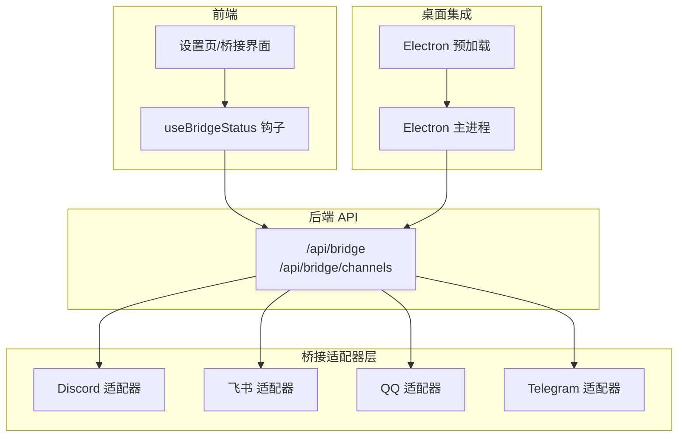
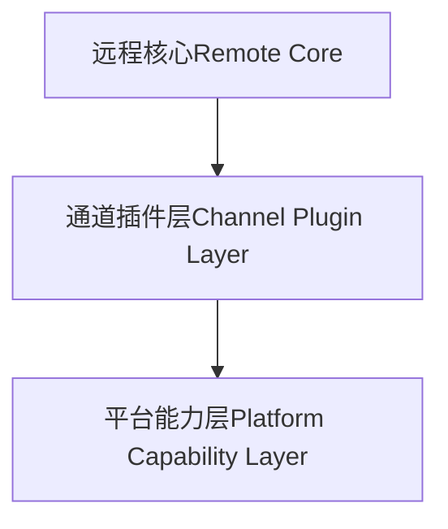
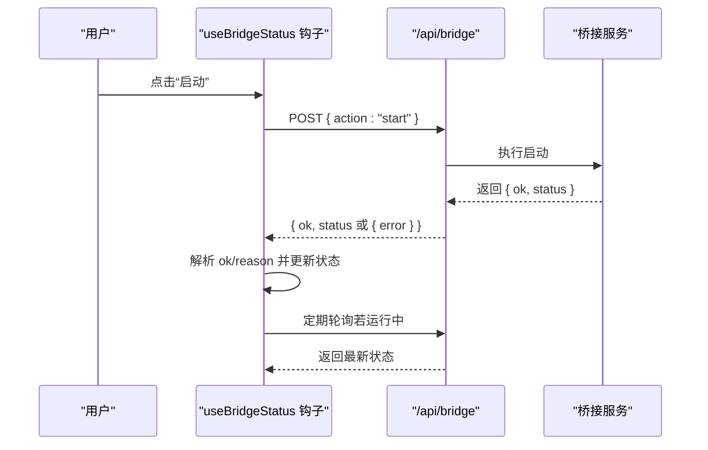
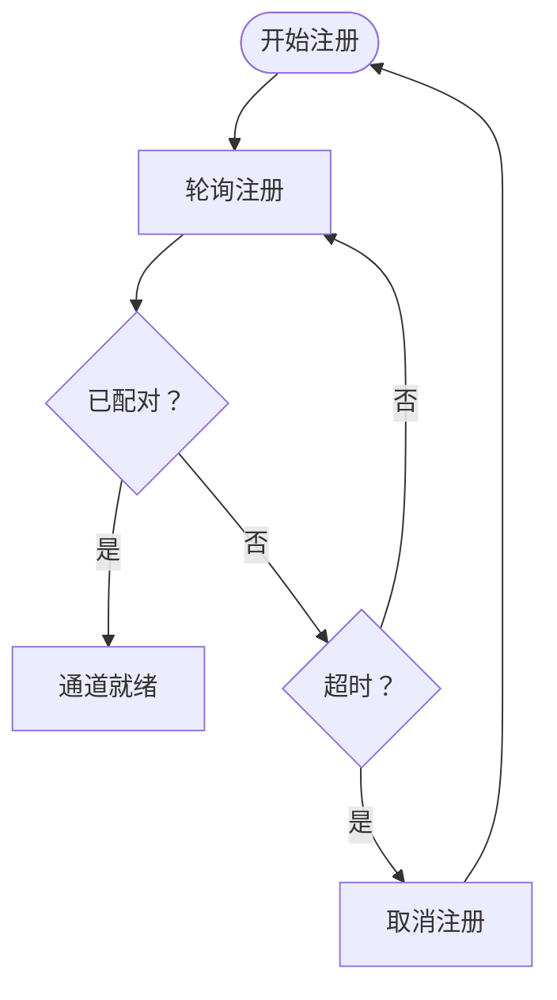
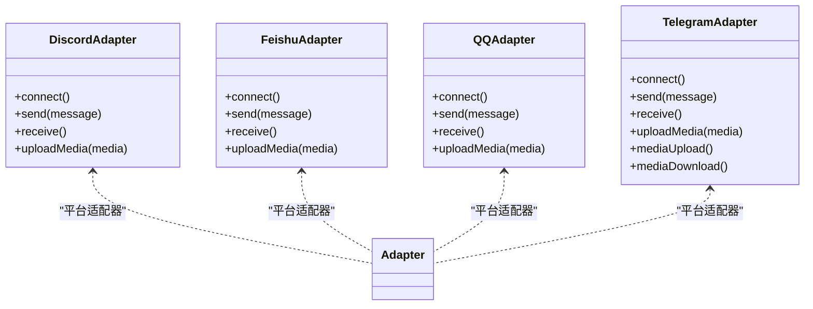
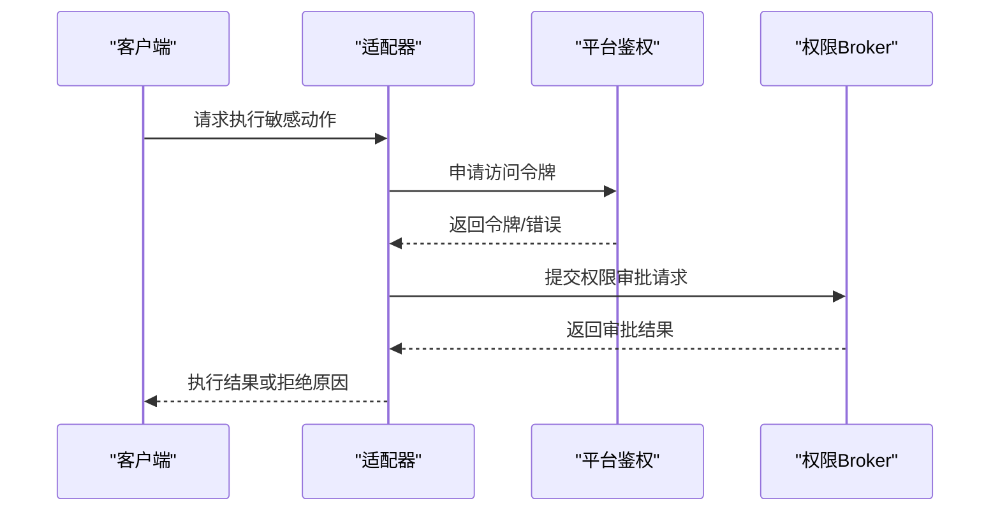
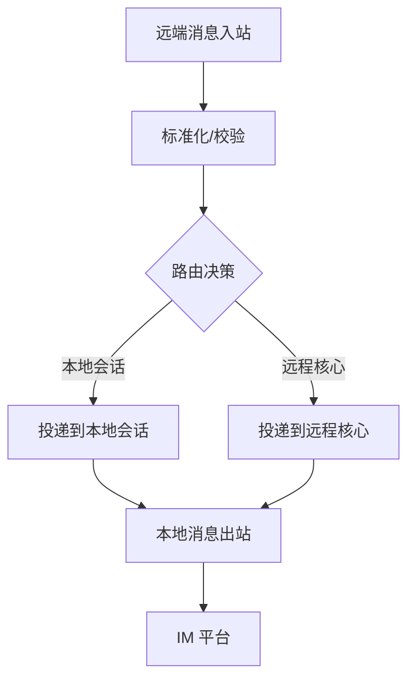
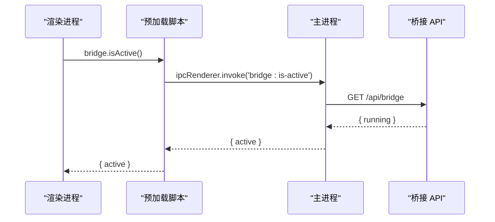
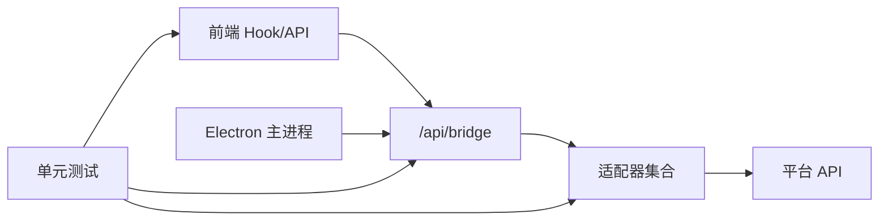

# 远程桥接系统

<cite>
**本文引用的文件**
- [bridge-system.md](file://docs/handover/bridge-system.md)
- [ARCHITECTURE.md](file://ARCHITECTURE.md)
- [useBridgeStatus.ts](file://src/hooks/useBridgeStatus.ts)
- [route.ts（桥接主入口）](file://src/app/api/bridge/route.ts)
- [route.ts（频道注册）](file://src/app/api/bridge/channels/route.ts)
- [discord-adapter.ts](file://src/lib/bridge/adapters/discord-adapter.ts)
- [feishu-adapter.ts](file://src/lib/bridge/adapters/feishu-adapter.ts)
- [qq-adapter.ts](file://src/lib/bridge/adapters/qq-adapter.ts)
- [telegram-adapter.ts](file://src/lib/bridge/adapters/telegram-adapter.ts)
- [telegram-media.ts](file://src/lib/bridge/adapters/telegram-media.ts)
- [qq-api.ts](file://src/lib/bridge/adapters/qq-api.ts)
- [main.ts（Electron 主进程）](file://electron/main.ts)
- [preload.ts（Electron 预加载）](file://electron/preload.ts)
- [bridge-delivery-visibility.test.ts](file://src/__tests__/unit/bridge-delivery-visibility.test.ts)
- [discord-bridge.test.ts](file://src/__tests__/unit/discord-bridge.test.ts)
- [codex-builtin-bridge.test.ts](file://src/__tests__/unit/codex-builtin-bridge.test.ts)
- [codex-builtin-bridge-parity.test.ts](file://src/__tests__/unit/codex-builtin-bridge-parity.test.ts)
- [codex-dynamic-tool-bridge.test.ts](file://src/__tests__/unit/codex-dynamic-tool-bridge.test.ts)
- [permission-broker-bridge.manual-test.ts](file://src/__tests__/unit/permission-broker-bridge.manual-test.ts)
</cite>

## 目录
1. [简介](#简介)
2. [项目结构](#项目结构)
3. [核心组件](#核心组件)
4. [架构总览](#架构总览)
5. [详细组件分析](#详细组件分析)
6. [依赖关系分析](#依赖关系分析)
7. [性能考量](#性能考量)
8. [故障排除指南](#故障排除指南)
9. [结论](#结论)
10. [附录](#附录)

## 简介
本文件面向远程桥接系统，聚焦于 IM 平台集成、消息路由与远程控制机制，系统性阐述桥接通道的配置、连接管理与消息转发流程；覆盖平台特定适配器、认证与权限控制；并提供可操作的配置与使用流程指引，以及监控、日志与故障排除方法。该系统通过“远程核心（Remote Core）—通道插件层（Channel Plugin Layer）—平台能力层（Platform Capability Layer）”的三层演进目标，逐步将桥接从“多 IM 会话桥接”升级为通用远程控制与会话编排基础设施。

章节来源
- [bridge-system.md:447-468](file://docs/handover/bridge-system.md#L447-L468)

## 项目结构
桥接系统主要由以下部分组成：
- 前端状态与控制：React Hook 用于桥接启停与状态轮询
- 后端 API：Next.js App Router 路由，提供桥接启停与状态查询
- 适配器层：针对不同 IM 平台（Discord、飞书、QQ、Telegram）的具体适配器
- Electron 集成：桌面端主进程与预加载脚本对桥接状态的探测与控制
- 测试与文档：单元测试与架构/设计文档支撑系统行为与演进方向

图表来源
- [useBridgeStatus.ts:65-103](file://src/hooks/useBridgeStatus.ts#L65-L103)
- [route.ts（桥接主入口）:39-56](file://src/app/api/bridge/route.ts#L39-L56)
- [discord-adapter.ts](file://src/lib/bridge/adapters/discord-adapter.ts)
- [feishu-adapter.ts](file://src/lib/bridge/adapters/feishu-adapter.ts)
- [qq-adapter.ts](file://src/lib/bridge/adapters/qq-adapter.ts)
- [telegram-adapter.ts](file://src/lib/bridge/adapters/telegram-adapter.ts)
- [main.ts（Electron 主进程）:134-188](file://electron/main.ts#L134-L188)
- [preload.ts（Electron 预加载）:43-44](file://electron/preload.ts#L43-L44)

章节来源
- [ARCHITECTURE.md:140-167](file://ARCHITECTURE.md#L140-L167)

## 核心组件
- 桥接状态钩子：封装启停请求、轮询刷新与错误返回码，便于 UI 快速响应
- 桥接主 API：接收 start/stop/auto-start 动作，返回当前桥接状态
- 通道注册 API：负责桥接通道的注册、轮询与取消流程
- 平台适配器：按平台特性实现连接、认证、消息收发与媒体处理
- Electron 集成：桌面端主动探测桥接是否运行，并支持启停控制

章节来源
- [useBridgeStatus.ts:44-103](file://src/hooks/useBridgeStatus.ts#L44-L103)
- [route.ts（桥接主入口）:39-56](file://src/app/api/bridge/route.ts#L39-L56)
- [route.ts（频道注册）:1-200](file://src/app/api/bridge/channels/route.ts#L1-L200)
- [main.ts（Electron 主进程）:134-188](file://electron/main.ts#L134-L188)
- [preload.ts（Electron 预加载）:43-44](file://electron/preload.ts#L43-L44)

## 架构总览
桥接系统采用三层演进目标：
- 远程核心（Remote Core）：负责会话、租约、流式事件、审批与多设备控制
- 通道插件层（Channel Plugin Layer）：负责各 IM 渠道的配对、能力、状态、策略与网关
- 平台能力层（Platform Capability Layer）：负责飞书文档、消息搜索、资源下载、任务、日历等平台深度能力

图表来源
- [bridge-system.md:447-468](file://docs/handover/bridge-system.md#L447-L468)

章节来源
- [bridge-system.md:447-468](file://docs/handover/bridge-system.md#L447-L468)

## 详细组件分析

### 组件一：桥接状态与控制（前端）
- 功能要点
  - 启动桥接：向 /api/bridge 发送 POST { action: "start" }，解析响应中的 ok/reason 字段
  - 停止桥接：发送 POST { action: "stop" }
  - 状态轮询：当桥接处于运行中时，每 5 秒轮询一次状态
  - 错误处理：网络异常返回特定错误码，UI 层据此提示用户
- 典型流程
  - 用户点击“启动”
  - 发起请求并等待响应
  - 若失败，读取 reason 并提示
  - 成功则刷新状态并停止轮询

图表来源
- [useBridgeStatus.ts:65-103](file://src/hooks/useBridgeStatus.ts#L65-L103)
- [route.ts（桥接主入口）:39-56](file://src/app/api/bridge/route.ts#L39-L56)

章节来源
- [useBridgeStatus.ts:44-103](file://src/hooks/useBridgeStatus.ts#L44-L103)
- [route.ts（桥接主入口）:39-56](file://src/app/api/bridge/route.ts#L39-L56)

### 组件二：通道注册与状态（后端）
- 功能要点
  - /api/bridge/channels：负责通道注册的开始、轮询与取消
  - 开始注册：触发平台侧配对流程（如飞书/微信等）
  - 轮询注册：持续查询配对状态直至完成或超时
  - 取消注册：中断配对流程
- 典型流程
  - 前端发起“开始注册”
  - 后端启动异步配对任务
  - 前端轮询“轮询注册”以获取最新状态
  - 成功后进入“已注册”状态，失败则允许“取消注册”

图表来源
- [route.ts（频道注册）:1-200](file://src/app/api/bridge/channels/route.ts#L1-L200)

章节来源
- [route.ts（频道注册）:1-200](file://src/app/api/bridge/channels/route.ts#L1-L200)

### 组件三：平台适配器（IM 集成）
- 适配器职责
  - 连接建立与心跳维护
  - 认证与令牌管理
  - 消息收发与媒体处理
  - 权限校验与策略执行
- 平台适配器概览
  - Discord：通过适配器对接官方 API，处理文本/媒体消息与权限
  - 飞书：实现企业级认证、群组与用户管理、文档与任务能力
  - QQ：基于开放平台 API，处理好友/群聊消息与多媒体
  - Telegram：支持媒体上传/下载、隐私模式与权限控制

图表来源
- [discord-adapter.ts](file://src/lib/bridge/adapters/discord-adapter.ts)
- [feishu-adapter.ts](file://src/lib/bridge/adapters/feishu-adapter.ts)
- [qq-adapter.ts](file://src/lib/bridge/adapters/qq-adapter.ts)
- [telegram-adapter.ts](file://src/lib/bridge/adapters/telegram-adapter.ts)
- [telegram-media.ts](file://src/lib/bridge/adapters/telegram-media.ts)
- [qq-api.ts](file://src/lib/bridge/adapters/qq-api.ts)

章节来源
- [discord-adapter.ts](file://src/lib/bridge/adapters/discord-adapter.ts)
- [feishu-adapter.ts](file://src/lib/bridge/adapters/feishu-adapter.ts)
- [qq-adapter.ts](file://src/lib/bridge/adapters/qq-adapter.ts)
- [telegram-adapter.ts](file://src/lib/bridge/adapters/telegram-adapter.ts)
- [telegram-media.ts](file://src/lib/bridge/adapters/telegram-media.ts)
- [qq-api.ts](file://src/lib/bridge/adapters/qq-api.ts)

### 组件四：认证与权限控制
- 认证机制
  - 各平台通过各自 OAuth/应用密钥进行鉴权
  - 适配器内部维护令牌刷新与失效重试
- 权限控制
  - 通道级别权限：仅允许授权群组/用户参与
  - 远程审批：关键动作需经远程审批 Broker 协调
  - 权限 Broker：统一的远程审批与策略执行入口

图表来源
- [permission-broker-bridge.manual-test.ts](file://src/__tests__/unit/permission-broker-bridge.manual-test.ts)

章节来源
- [permission-broker-bridge.manual-test.ts](file://src/__tests__/unit/permission-broker-bridge.manual-test.ts)

### 组件五：消息路由与双向同步
- 消息路由
  - 输入：来自 IM 平台的消息事件
  - 处理：标准化消息格式、提取元数据、执行权限校验
  - 输出：投递至远程核心或本地会话
- 双向同步
  - 本地到远端：用户在本地发起的消息经适配器转发至 IM
  - 远端到本地：IM 推送的消息经适配器到达本地并更新 UI
- 状态管理
  - 通道状态：连接、配对、运行、错误等
  - 会话状态：租约、心跳、超时与恢复

图表来源
- [bridge-system.md:447-468](file://docs/handover/bridge-system.md#L447-L468)

章节来源
- [bridge-system.md:447-468](file://docs/handover/bridge-system.md#L447-L468)

### 组件六：桌面端集成（Electron）
- 主进程探测桥接状态并支持启停
- 预加载脚本暴露 bridge:isActive 供渲染进程查询
- 与桥接 API 协同，确保桌面端体验一致

图表来源
- [main.ts（Electron 主进程）:134-188](file://electron/main.ts#L134-L188)
- [preload.ts（Electron 预加载）:43-44](file://electron/preload.ts#L43-L44)

章节来源
- [main.ts（Electron 主进程）:134-188](file://electron/main.ts#L134-L188)
- [preload.ts（Electron 预加载）:43-44](file://electron/preload.ts#L43-L44)

## 依赖关系分析
- 前端依赖后端 API 提供启停与状态查询
- 后端依赖各平台适配器实现具体通信
- 适配器依赖平台官方 API 与令牌管理
- Electron 主进程依赖本地 API 探测桥接状态
- 测试覆盖桥接可见性、动态工具桥接与内置桥接一致性

图表来源
- [useBridgeStatus.ts:65-103](file://src/hooks/useBridgeStatus.ts#L65-L103)
- [route.ts（桥接主入口）:39-56](file://src/app/api/bridge/route.ts#L39-L56)
- [discord-adapter.ts](file://src/lib/bridge/adapters/discord-adapter.ts)
- [feishu-adapter.ts](file://src/lib/bridge/adapters/feishu-adapter.ts)
- [qq-adapter.ts](file://src/lib/bridge/adapters/qq-adapter.ts)
- [telegram-adapter.ts](file://src/lib/bridge/adapters/telegram-adapter.ts)
- [main.ts（Electron 主进程）:134-188](file://electron/main.ts#L134-L188)
- [bridge-delivery-visibility.test.ts](file://src/__tests__/unit/bridge-delivery-visibility.test.ts)
- [codex-dynamic-tool-bridge.test.ts](file://src/__tests__/unit/codex-dynamic-tool-bridge.test.ts)
- [codex-builtin-bridge-parity.test.ts](file://src/__tests__/unit/codex-builtin-bridge-parity.test.ts)

章节来源
- [bridge-delivery-visibility.test.ts](file://src/__tests__/unit/bridge-delivery-visibility.test.ts)
- [discord-bridge.test.ts](file://src/__tests__/unit/discord-bridge.test.ts)
- [codex-builtin-bridge.test.ts](file://src/__tests__/unit/codex-builtin-bridge.test.ts)
- [codex-builtin-bridge-parity.test.ts](file://src/__tests__/unit/codex-builtin-bridge-parity.test.ts)
- [codex-dynamic-tool-bridge.test.ts](file://src/__tests__/unit/codex-dynamic-tool-bridge.test.ts)

## 性能考量
- 轮询频率：前端状态轮询建议在桥接运行时采用 5 秒间隔，避免过度请求
- 适配器并发：多通道并行时注意平台速率限制与令牌配额
- 媒体传输：优先使用平台直传能力，减少中间层复制
- 会话保活：心跳与租约机制需平衡延迟与资源占用

## 故障排除指南
- 启动失败
  - 检查 /api/bridge 返回的 reason 字段，定位具体错误
  - 确认平台凭证与权限是否正确
- 注册卡住
  - 使用“轮询注册”确认配对状态
  - 超时则执行“取消注册”并重新开始
- 消息不同步
  - 核对通道状态与会话租约
  - 检查权限 Broker 是否放行
- 桌面端不可用
  - 通过预加载脚本 bridge.isActive 查询桥接状态
  - 若无响应，检查本地 API 是否正常

章节来源
- [useBridgeStatus.ts:65-103](file://src/hooks/useBridgeStatus.ts#L65-L103)
- [route.ts（桥接主入口）:39-56](file://src/app/api/bridge/route.ts#L39-L56)
- [route.ts（频道注册）:1-200](file://src/app/api/bridge/channels/route.ts#L1-L200)
- [main.ts（Electron 主进程）:134-188](file://electron/main.ts#L134-L188)
- [preload.ts（Electron 预加载）:43-44](file://electron/preload.ts#L43-L44)

## 结论
远程桥接系统以三层演进为目标，通过统一的远程核心与通道插件层，实现跨 IM 平台的稳定连接与消息路由。平台适配器覆盖 Discord、飞书、QQ、Telegram 等主流渠道，结合认证与权限控制，保障安全可控的远程交互。前端通过 Hook 与后端 API 实现启停与状态管理，桌面端通过 Electron 主进程与预加载脚本提供一致体验。配合完善的测试与文档，系统具备良好的可维护性与扩展性。

## 附录
- 配置与使用流程（步骤化）
  1) 在设置页点击“启动桥接”
  2) 查看 /api/bridge 返回的状态与原因
  3) 若失败，根据 reason 修正凭证或权限
  4) 成功后，进入“通道注册”开始配对
  5) 使用“轮询注册”确认配对状态，必要时“取消注册”重试
  6) 消息双向同步验证：本地发送消息至 IM，IM 推送消息回显至本地
  7) 桌面端通过 bridge.isActive 检查桥接状态
- 监控与日志
  - 前端：轮询状态、错误码提示
  - 后端：API 日志与错误响应
  - 适配器：平台 API 调用日志与速率限制追踪
  - 桌面端：主进程探测与 IPC 日志

章节来源
- [useBridgeStatus.ts:65-103](file://src/hooks/useBridgeStatus.ts#L65-L103)
- [route.ts（桥接主入口）:39-56](file://src/app/api/bridge/route.ts#L39-L56)
- [route.ts（频道注册）:1-200](file://src/app/api/bridge/channels/route.ts#L1-L200)
- [main.ts（Electron 主进程）:134-188](file://electron/main.ts#L134-L188)
- [preload.ts（Electron 预加载）:43-44](file://electron/preload.ts#L43-L44)