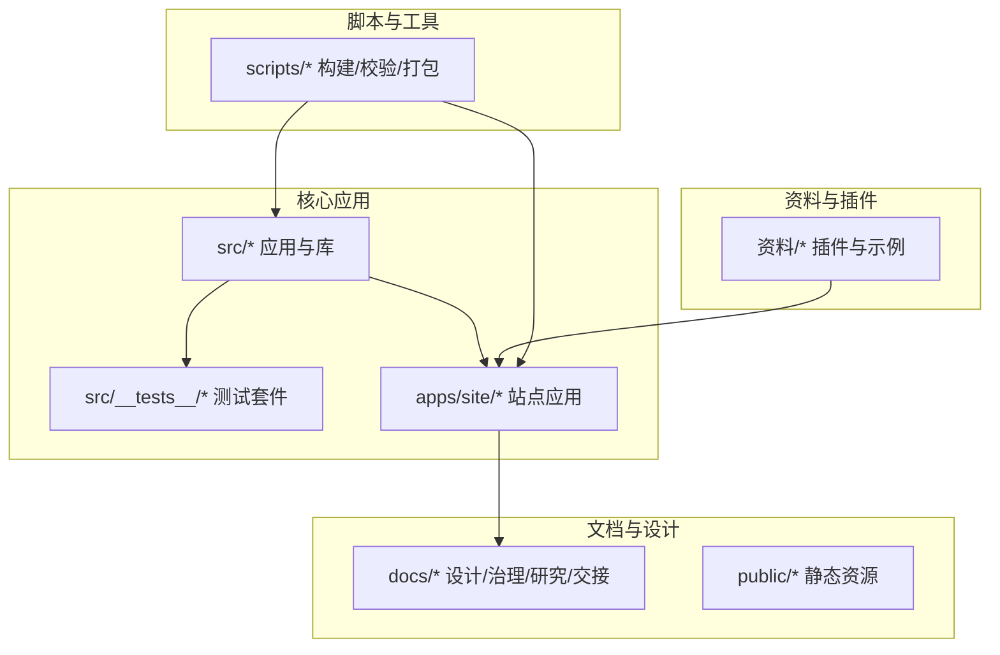
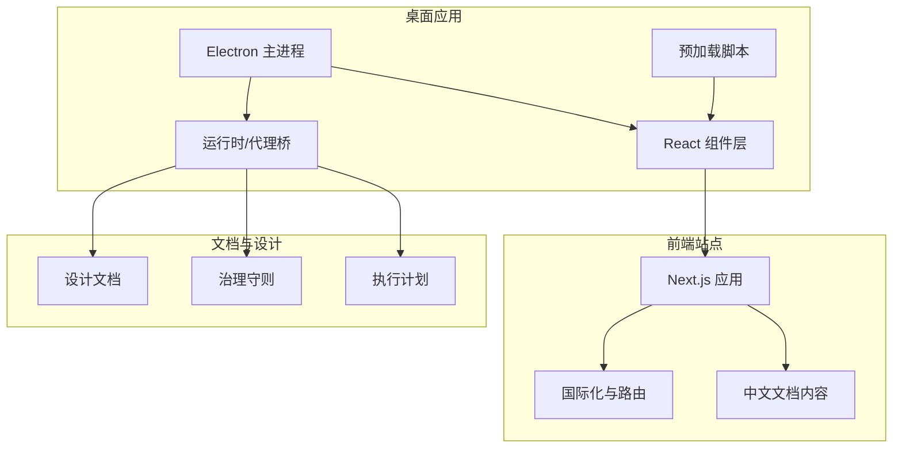
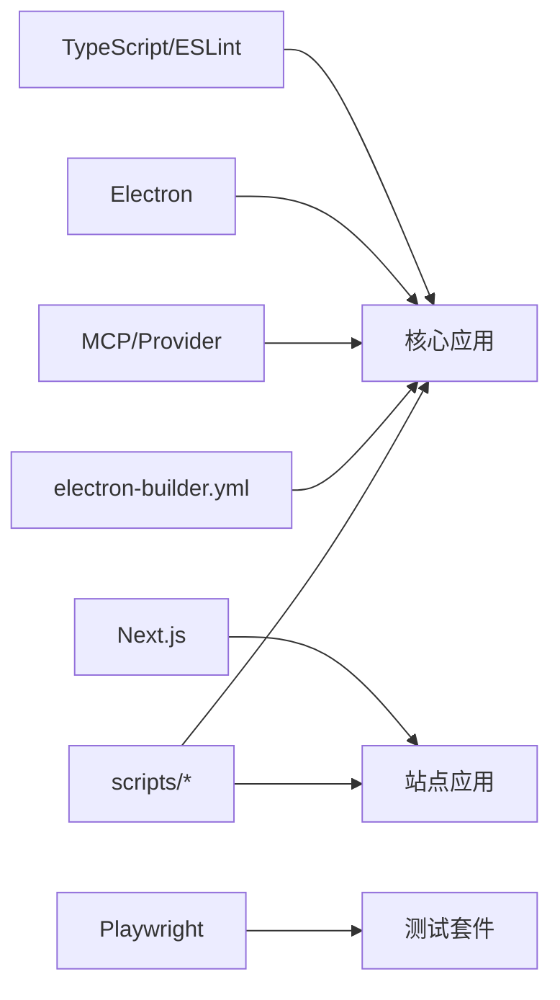

# 贡献指南

<cite>
**本文引用的文件**
- [README.md](file://README.md)
- [README_CN.md](file://README_CN.md)
- [ARCHITECTURE.md](file://ARCHITECTURE.md)
- [AGENTS.md](file://AGENTS.md)
- [eslint.config.mjs](file://eslint.config.mjs)
- [tsconfig.json](file://tsconfig.json)
- [package.json](file://package.json)
- [.editorconfig](file://.editorconfig)
- [playwright.config.ts](file://playwright.config.ts)
- [src/__tests__/test-plan.md](file://src/__tests__/test-plan.md)
- [scripts/lint-hooks.mjs](file://scripts/lint-hooks.mjs)
- [electron-builder.yml](file://electron-builder.yml)
- [next.config.ts](file://next.config.ts)
- [src/lib/agent-system-prompt.ts](file://src/lib/agent-system-prompt.ts)
- [docs/design.md](file://docs/design.md)
- [docs/ui-governance.md](file://docs/ui-governance.md)
- [docs/guardrails/README.md](file://docs/guardrails/README.md)
- [docs/research/README.md](file://docs/research/README.md)
- [docs/handover/README.md](file://docs/handover/README.md)
- [docs/insights/README.md](file://docs/insights/README.md)
- [docs/preview/README.md](file://docs/preview/README.md)
- [docs/future/assistant-ux-upgrade.md](file://docs/future/assistant-ux-upgrade.md)
- [docs/research/chat-latency-investigation-2026-03-20.md](file://docs/research/chat-latency-investigation-2026-03-20.md)
- [docs/handover/phase-4-markdown-artifact.md](file://docs/handover/phase-4-markdown-artifact.md)
- [docs/guardrails/Runtime.md](file://docs/guardrails/Runtime.md)
- [docs/guardrails/ProviderManagement.md](file://docs/guardrails/ProviderManagement.md)
- [docs/guardrails/MCP.md](file://docs/guardrails/MCP.md)
- [docs/guardrails/PermissionBoundary.md](file://docs/guardrails/PermissionBoundary.md)
- [docs/guardrails/ComposerModelSelection.md](file://docs/guardrails/ComposerModelSelection.md)
- [docs/guardrails/Onboarding.md](file://docs/guardrails/Onboarding.md)
- [docs/guardrails/Release.md](file://docs/guardrails/Release.md)
- [docs/guardrails/StreamSession.md](file://docs/guardrails/StreamSession.md)
- [docs/exec-plans/active/agent-sdk-0-2-111-adoption.md](file://docs/exec-plans/active/agent-sdk-0-2-111-adoption.md)
- [docs/exec-plans/completed/phase-5e-runtime-harness-architecture.md](file://docs/exec-plans/completed/phase-5e-runtime-harness-architecture.md)
- [docs/future/context-management-optimization.md](file://docs/future/context-management-optimization.md)
- [docs/future/memory-enhancements.md](file://docs/future/memory-enhancements.md)
- [docs/future/scheduled-tasks-and-notifications.md](file://docs/future/scheduled-tasks-and-notifications.md)
- [docs/future/voice-assistant.md](file://docs/future/voice-assistant.md)
- [docs/insights/performance-memory.md](file://docs/insights/performance-memory.md)
- [docs/insights/user-audience-analysis.md](file://docs/insights/user-audience-analysis.md)
- [apps/site/content/docs/zh/index.md](file://apps/site/content/docs/zh/index.md)
- [apps/site/src/lib/site.config.ts](file://apps/site/src/lib/site.config.ts)
- [apps/site/package.json](file://apps/site/package.json)
- [apps/site/source.config.ts](file://apps/site/source.config.ts)
- [apps/site/tsconfig.check.json](file://apps/site/tsconfig.check.json)
- [apps/site/tsconfig.json](file://apps/site/tsconfig.json)
- [apps/site/postcss.config.mjs](file://apps/site/postcss.config.mjs)
- [apps/site/next.config.mjs](file://apps/site/next.config.mjs)
- [apps/site/components.json](file://apps/site/components.json)
- [apps/site/src/middleware.ts](file://apps/site/src/middleware.ts)
- [apps/site/src/lib/utils.ts](file://apps/site/src/lib/utils.ts)
- [apps/site/src/lib/i18n.ts](file://apps/site/src/lib/i18n.ts)
- [apps/site/src/lib/layout.shared.tsx](file://apps/site/src/lib/layout.shared.tsx)
- [apps/site/src/lib/fonts.ts](file://apps/site/src/lib/fonts.ts)
- [apps/site/src/lib/source.ts](file://apps/site/src/lib/source.ts)
- [apps/site/src/app/global.css](file://apps/site/src/app/global.css)
- [apps/site/src/app/layout.tsx](file://apps/site/src/app/layout.tsx)
- [apps/site/src/app/manifest.ts](file://apps/site/src/app/manifest.ts)
- [apps/site/src/app/robots.ts](file://apps/site/src/app/robots.ts)
- [apps/site/src/app/sitemap.ts](file://apps/site/src/app/sitemap.ts)
- [apps/site/src/app/[lang]/layout.tsx](file://apps/site/src/app/[lang]/layout.tsx)
- [apps/site/src/app/api/search/route.ts](file://apps/site/src/app/api/search/route.ts)
- [apps/site/src/lib/site.config.ts](file://apps/site/src/lib/site.config.ts)
- [apps/site/src/lib/utils.ts](file://apps/site/src/lib/utils.ts)
- [apps/site/src/lib/i18n.ts](file://apps/site/src/lib/i18n.ts)
- [apps/site/src/lib/layout.shared.tsx](file://apps/site/src/lib/layout.shared.tsx)
- [apps/site/src/lib/fonts.ts](file://apps/site/src/lib/fonts.ts)
- [apps/site/src/lib/source.ts](file://apps/site/src/lib/source.ts)
- [apps/site/src/app/global.css](file://apps/site/src/app/global.css)
- [apps/site/src/app/layout.tsx](file://apps/site/src/app/layout.tsx)
- [apps/site/src/app/manifest.ts](file://apps/site/src/app/manifest.ts)
- [apps/site/src/app/robots.ts](file://apps/site/src/app/robots.ts)
- [apps/site/src/app/sitemap.ts](file://apps/site/src/app/sitemap.ts)
- [apps/site/src/app/[lang]/layout.tsx](file://apps/site/src/app/[lang]/layout.tsx)
- [apps/site/src/app/api/search/route.ts](file://apps/site/src/app/api/search/route.ts)
</cite>

## 目录
1. [简介](#简介)
2. [项目结构](#项目结构)
3. [核心组件](#核心组件)
4. [架构总览](#架构总览)
5. [详细组件分析](#详细组件分析)
6. [依赖关系分析](#依赖关系分析)
7. [性能考虑](#性能考虑)
8. [故障排查指南](#故障排查指南)
9. [结论](#结论)
10. [附录](#附录)

## 简介
本贡献指南面向希望参与 CodePilot 开发与维护的贡献者，涵盖从开发环境搭建、代码与文档贡献、问题反馈到设计文档阅读与理解的全流程。同时阐明项目的治理与协作机制、代码审查与质量保障标准、测试策略与提交流程，帮助新贡献者快速上手并高效协作。

## 项目结构
CodePilot 采用多包/多应用并存的组织方式：
- 核心桌面应用：位于仓库根目录，包含 Electron 主进程、渲染层、业务逻辑与测试。
- 文档与设计资产：位于 docs/ 目录，覆盖设计、治理、研究、交接、前瞻等主题。
- 官方站点：位于 apps/site，使用 Next.js 构建，提供中英双语文档与营销内容。
- 资料与插件示例：位于 资料/ 目录，包含微信/飞书等桥接插件与示例包。
- 脚本与工具：位于 scripts/，包含构建、签名、图标生成、Hook 校验等脚本。

图示来源
- [ARCHITECTURE.md](file://ARCHITECTURE.md)
- [apps/site/package.json](file://apps/site/package.json)
- [package.json](file://package.json)

章节来源
- [ARCHITECTURE.md](file://ARCHITECTURE.md)
- [README.md](file://README.md)
- [README_CN.md](file://README_CN.md)

## 核心组件
- 桌面应用（Electron）：主进程、预加载脚本、终端管理器、更新器等，负责本地运行时与系统集成。
- 运行时与代理桥：Codex、MCP、权限边界、Provider 管理、会话流等，支撑智能体与外部能力的连接。
- 前端应用：Next.js 页面、组件库、国际化、布局与样式体系，提供用户交互界面。
- 测试体系：单元测试、集成测试、端到端测试（Playwright），并有测试计划与验收标准。
- 文档与设计：设计文档、治理守则、研究洞察、执行计划与前瞻规划，形成知识沉淀与路线指引。
- 资料与插件：桥接通道（如微信/飞书）与示例包，便于扩展与生态接入。

章节来源
- [src/lib/agent-system-prompt.ts](file://src/lib/agent-system-prompt.ts)
- [docs/guardrails/README.md](file://docs/guardrails/README.md)
- [docs/design.md](file://docs/design.md)
- [playwright.config.ts](file://playwright.config.ts)
- [src/__tests__/test-plan.md](file://src/__tests__/test-plan.md)

## 架构总览
下图展示桌面应用、前端站点与文档之间的关系，以及关键模块间的交互路径。

图示来源
- [ARCHITECTURE.md](file://ARCHITECTURE.md)
- [apps/site/src/app/layout.tsx](file://apps/site/src/app/layout.tsx)
- [apps/site/src/lib/i18n.ts](file://apps/site/src/lib/i18n.ts)
- [docs/design.md](file://docs/design.md)
- [docs/guardrails/README.md](file://docs/guardrails/README.md)
- [docs/exec-plans/active/agent-sdk-0-2-111-adoption.md](file://docs/exec-plans/active/agent-sdk-0-2-111-adoption.md)

## 详细组件分析

### 开发环境设置
- 基础要求
  - Node.js 与包管理器：参考根目录与站点应用的 package.json 中的引擎与脚本定义。
  - TypeScript 与 ESLint：遵循 tsconfig.json 与 eslint.config.mjs 的规则。
  - 编辑器配置：使用 .editorconfig 保持一致风格。
- 启动步骤
  - 安装依赖后启动开发服务器，桌面应用与站点可并行运行。
  - 站点应用支持多语言路由与国际化配置。
- 构建与打包
  - 使用 electron-builder.yml 配置打包参数。
  - 脚本目录包含图标生成、签名与打包后的处理脚本。

章节来源
- [package.json](file://package.json)
- [apps/site/package.json](file://apps/site/package.json)
- [tsconfig.json](file://tsconfig.json)
- [eslint.config.mjs](file://eslint.config.mjs)
- [.editorconfig](file://.editorconfig)
- [electron-builder.yml](file://electron-builder.yml)
- [apps/site/next.config.mjs](file://apps/site/next.config.mjs)
- [apps/site/postcss.config.mjs](file://apps/site/postcss.config.mjs)
- [apps/site/components.json](file://apps/site/components.json)

### 代码贡献流程
- 分支与提交
  - 使用功能分支进行开发，遵循项目约定的提交信息格式。
  - 提交前通过 Husky 预提交钩子校验，确保测试命令携带必要的环境变量保护，避免与开发服务器竞争资源。
- 代码审查
  - 提交 Pull Request 后由维护者进行审查，重点检查变更范围、兼容性、性能与安全性。
  - 遵循治理守则与权限边界，确保对外部接口与敏感操作的约束符合规范。
- 合并与发布
  - 通过审查与测试后合并，按需触发构建与发布流程。

章节来源
- [scripts/lint-hooks.mjs](file://scripts/lint-hooks.mjs)
- [docs/guardrails/PermissionBoundary.md](file://docs/guardrails/PermissionBoundary.md)
- [docs/guardrails/Release.md](file://docs/guardrails/Release.md)

### 文档改进与设计阅读
- 文档结构
  - 设计文档：统一的设计原则与视觉/交互规范。
  - 治理守则：运行时、Provider、MCP、权限边界等关键领域的安全与合规约束。
  - 研究与洞察：技术调研、性能分析与用户画像等深度内容。
  - 执行计划：活跃与已完成的工程化执行计划，明确阶段性目标。
  - 前瞻规划：未来方向与能力演进蓝图。
- 阅读建议
  - 先浏览设计与治理守则，再结合执行计划与研究洞察理解背景与现状。
  - 对于新贡献者，建议从“设计”“治理守则”“执行计划”入手，再深入具体模块文档。

章节来源
- [docs/design.md](file://docs/design.md)
- [docs/guardrails/README.md](file://docs/guardrails/README.md)
- [docs/research/README.md](file://docs/research/README.md)
- [docs/handover/README.md](file://docs/handover/README.md)
- [docs/insights/README.md](file://docs/insights/README.md)
- [docs/preview/README.md](file://docs/preview/README.md)
- [docs/exec-plans/active/agent-sdk-0-2-111-adoption.md](file://docs/exec-plans/active/agent-sdk-0-2-111-adoption.md)
- [docs/exec-plans/completed/phase-5e-runtime-harness-architecture.md](file://docs/exec-plans/completed/phase-5e-runtime-harness-architecture.md)

### 测试与质量保证
- 测试类型
  - 单元测试与集成测试：覆盖运行时、代理桥、权限、Provider、会话等核心模块。
  - 端到端测试：使用 Playwright，支持并行与重试，并对截图差异进行阈值控制。
- 验收标准
  - 页面加载时间、交互响应时间、主题切换无闪烁、动画平滑、E2E 测试通过率等指标。
- 质量门禁
  - CI 环境下启用严格模式与重试策略；本地 Husky 预提交钩子校验测试命令的保护开关。

章节来源
- [playwright.config.ts](file://playwright.config.ts)
- [src/__tests__/test-plan.md](file://src/__tests__/test-plan.md)
- [scripts/lint-hooks.mjs](file://scripts/lint-hooks.mjs)

### 治理结构与社区规范
- 治理维度
  - 运行时与代理桥：确保流式会话、模型选择与 Provider 解析的安全与一致性。
  - 权限边界：限制高风险操作，要求在必要时进行用户确认或授权。
  - 发布与版本：遵循发布流程，确保变更可追踪与可回滚。
- 社区协作
  - 透明沟通：通过 Issue/PR 讨论方案与影响，记录决策依据。
  - 包容与尊重：遵守行为准则，鼓励不同背景的贡献者参与。

章节来源
- [docs/guardrails/Runtime.md](file://docs/guardrails/Runtime.md)
- [docs/guardrails/ProviderManagement.md](file://docs/guardrails/ProviderManagement.md)
- [docs/guardrails/MCP.md](file://docs/guardrails/MCP.md)
- [docs/guardrails/PermissionBoundary.md](file://docs/guardrails/PermissionBoundary.md)
- [docs/guardrails/Release.md](file://docs/guardrails/Release.md)
- [docs/guardrails/StreamSession.md](file://docs/guardrails/StreamSession.md)

### 新贡献者入门与学习资源
- 快速上手
  - 阅读项目总体介绍与架构说明，理解核心模块职责。
  - 从站点文档与设计守则开始，熟悉 UI/GUI 规范与交互约定。
- 学习路径
  - 设计与治理：掌握设计原则与安全边界。
  - 执行计划：了解当前阶段目标与优先级。
  - 研究与洞察：深入理解性能、内存与用户体验优化。
  - 示例与插件：参考资料目录中的桥接插件与示例包。

章节来源
- [README.md](file://README.md)
- [README_CN.md](file://README_CN.md)
- [ARCHITECTURE.md](file://ARCHITECTURE.md)
- [docs/design.md](file://docs/design.md)
- [docs/guardrails/README.md](file://docs/guardrails/README.md)
- [docs/exec-plans/active/agent-sdk-0-2-111-adoption.md](file://docs/exec-plans/active/agent-sdk-0-2-111-adoption.md)
- [docs/insights/performance-memory.md](file://docs/insights/performance-memory.md)
- [docs/insights/user-audience-analysis.md](file://docs/insights/user-audience-analysis.md)
- [apps/site/content/docs/zh/index.md](file://apps/site/content/docs/zh/index.md)

### 沟通渠道与协作机制
- 文档与站点
  - 站点应用提供中英双语文档入口与路由，便于全球用户查阅。
  - 国际化与布局配置支持多语言与共享布局。
- 内容与营销
  - apps/site/content/marketing 提供英文/中文营销文案，便于对外传播与社区互动。
- 协作流程
  - 通过 Issue/PR 讨论需求与变更，结合测试与文档完善，确保透明与可追溯。

章节来源
- [apps/site/src/lib/i18n.ts](file://apps/site/src/lib/i18n.ts)
- [apps/site/src/lib/layout.shared.tsx](file://apps/site/src/lib/layout.shared.tsx)
- [apps/site/src/app/[lang]/layout.tsx](file://apps/site/src/app/[lang]/layout.tsx)
- [apps/site/content/docs/zh/index.md](file://apps/site/content/docs/zh/index.md)

## 依赖关系分析
- 语言与工具链
  - TypeScript 与 ESLint：统一类型与风格，减少错误与分歧。
  - Next.js：站点应用的页面、路由与构建工具链。
  - Playwright：端到端测试框架，配合测试计划与验收标准。
- 外部依赖与集成
  - Electron：桌面应用运行时与系统集成。
  - MCP/Provider：外部能力接入与模型选择。
  - 发布与打包：electron-builder.yml 与脚本目录中的打包与签名流程。

图示来源
- [tsconfig.json](file://tsconfig.json)
- [eslint.config.mjs](file://eslint.config.mjs)
- [apps/site/package.json](file://apps/site/package.json)
- [playwright.config.ts](file://playwright.config.ts)
- [electron-builder.yml](file://electron-builder.yml)
- [package.json](file://package.json)

章节来源
- [tsconfig.json](file://tsconfig.json)
- [eslint.config.mjs](file://eslint.config.mjs)
- [apps/site/package.json](file://apps/site/package.json)
- [playwright.config.ts](file://playwright.config.ts)
- [electron-builder.yml](file://electron-builder.yml)
- [package.json](file://package.json)

## 性能考虑
- 性能与内存优化：参考洞察文档中的性能与内存分析，关注页面加载时间、交互响应时间与动画流畅度。
- 测试与回归：通过端到端测试与验收标准持续监控性能回归。
- 优化建议
  - 控制首屏与交互延迟，避免阻塞主线程。
  - 使用缓存与懒加载策略，减少不必要的重绘与回流。
  - 在 CI 中启用严格的测试与截图差异阈值，防止 UI 回归。

章节来源
- [src/__tests__/test-plan.md](file://src/__tests__/test-plan.md)
- [docs/insights/performance-memory.md](file://docs/insights/performance-memory.md)

## 故障排查指南
- 预提交钩子失败
  - 症状：本地提交被阻止，提示缺少测试命令的保护开关。
  - 排查：检查 .husky/pre-commit 是否包含必要的环境变量保护，确保测试命令与受支持的测试运行器匹配。
- 端到端测试异常
  - 症状：截图差异过大或交互不稳定。
  - 排查：调整 Playwright 配置中的重试次数与截图阈值，确认本地服务端口与基地址一致。
- 构建与打包问题
  - 症状：打包失败或签名错误。
  - 排查：核对 electron-builder.yml 配置与脚本目录中的签名与打包后处理脚本。

章节来源
- [scripts/lint-hooks.mjs](file://scripts/lint-hooks.mjs)
- [playwright.config.ts](file://playwright.config.ts)
- [electron-builder.yml](file://electron-builder.yml)

## 结论
通过本贡献指南，新老贡献者可以快速理解项目结构、开发流程与质量标准，明确文档与设计阅读路径，建立高效的协作机制。我们鼓励开放、透明与包容的社区文化，共同推动 CodePilot 的持续演进与价值交付。

## 附录
- 设计与治理要点
  - 设计：统一的视觉与交互规范，确保跨平台一致性。
  - 治理：运行时、Provider、MCP、权限边界与发布流程的约束与规范。
- 执行计划与前瞻
  - 当前阶段：聚焦 Agent SDK 适配、运行时编排与上下文层优化。
  - 前瞻方向：上下文管理优化、记忆增强、定时任务与通知、语音助手等。

章节来源
- [docs/design.md](file://docs/design.md)
- [docs/guardrails/README.md](file://docs/guardrails/README.md)
- [docs/exec-plans/active/agent-sdk-0-2-111-adoption.md](file://docs/exec-plans/active/agent-sdk-0-2-111-adoption.md)
- [docs/future/context-management-optimization.md](file://docs/future/context-management-optimization.md)
- [docs/future/memory-enhancements.md](file://docs/future/memory-enhancements.md)
- [docs/future/scheduled-tasks-and-notifications.md](file://docs/future/scheduled-tasks-and-notifications.md)
- [docs/future/voice-assistant.md](file://docs/future/voice-assistant.md)