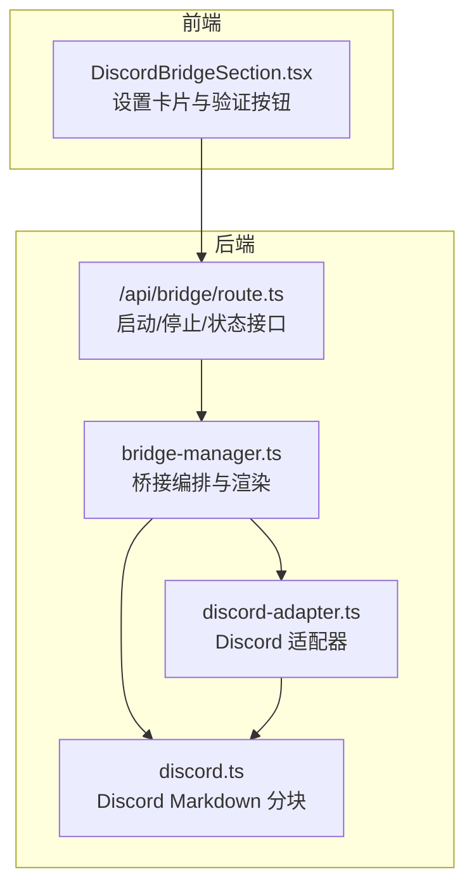
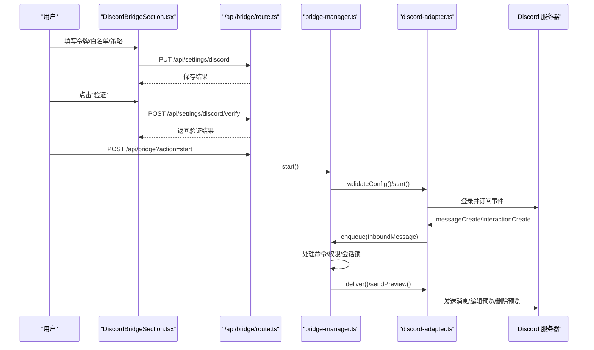
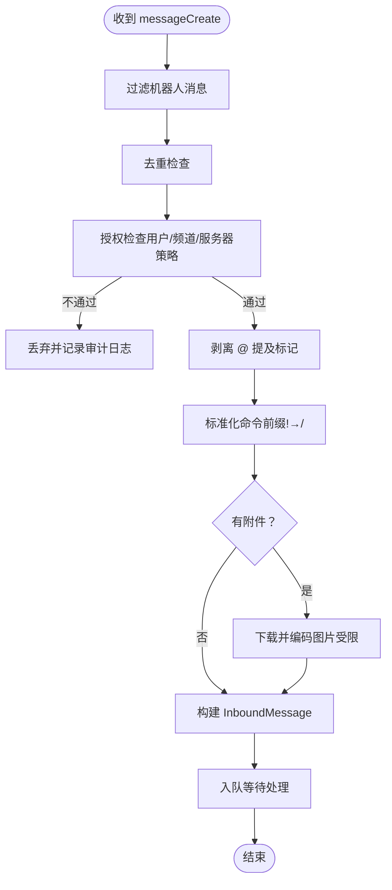
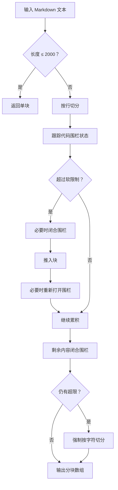
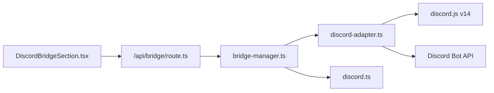

# Discord 桥接

<cite>
**本文引用的文件**
- [DiscordBridgeSection.tsx](file://src/components/bridge/DiscordBridgeSection.tsx)
- [discord-adapter.ts](file://src/lib/bridge/adapters/discord-adapter.ts)
- [discord.ts](file://src/lib/bridge/markdown/discord.ts)
- [bridge-manager.ts](file://src/lib/bridge/bridge-manager.ts)
- [route.ts](file://src/app/api/bridge/route.ts)
- [discord-bridge.test.ts](file://src/__tests__/unit/discord-bridge.test.ts)
</cite>

## 目录
1. [简介](#简介)
2. [项目结构](#项目结构)
3. [核心组件](#核心组件)
4. [架构总览](#架构总览)
5. [详细组件分析](#详细组件分析)
6. [依赖关系分析](#依赖关系分析)
7. [性能考量](#性能考量)
8. [故障排查指南](#故障排查指南)
9. [结论](#结论)
10. [附录](#附录)

## 简介
本文件面向希望在 CodePilot 中启用并管理 Discord 桥接的用户与开发者，系统性说明如何创建 Discord 应用与机器人、配置权限与频道、绑定服务器与频道、消息转发机制、消息格式处理、API 使用示例、错误处理与性能优化，并覆盖私有服务器与公共服务器的不同配置方法。

## 项目结构
与 Discord 桥接直接相关的前端界面、后端适配器、消息分块与桥接编排模块如下所示：



**图表来源**
- [DiscordBridgeSection.tsx:1-351](file://src/components/bridge/DiscordBridgeSection.tsx#L1-L351)
- [route.ts:1-57](file://src/app/api/bridge/route.ts#L1-L57)
- [bridge-manager.ts:1-800](file://src/lib/bridge/bridge-manager.ts#L1-L800)
- [discord-adapter.ts:1-663](file://src/lib/bridge/adapters/discord-adapter.ts#L1-L663)
- [discord.ts:1-111](file://src/lib/bridge/markdown/discord.ts#L1-L111)

**章节来源**
- [DiscordBridgeSection.tsx:1-351](file://src/components/bridge/DiscordBridgeSection.tsx#L1-L351)
- [route.ts:1-57](file://src/app/api/bridge/route.ts#L1-L57)
- [bridge-manager.ts:1-800](file://src/lib/bridge/bridge-manager.ts#L1-L800)
- [discord-adapter.ts:1-663](file://src/lib/bridge/adapters/discord-adapter.ts#L1-L663)
- [discord.ts:1-111](file://src/lib/bridge/markdown/discord.ts#L1-L111)

## 核心组件
- 前端设置界面：提供机器人令牌、允许用户/频道/服务器、群组策略、是否需要提及、流式预览开关等配置入口，并支持“验证”按钮校验令牌有效性。
- 适配器（DiscordAdapter）：负责 Discord 机器人登录、事件监听、入站消息授权过滤、消息发送、内联按钮回调、流式预览、附件下载与转码。
- 消息分块（markdownToDiscordChunks）：按 Discord 限制进行 Markdown 文本分块，自动平衡代码围栏。
- 桥接编排（BridgeManager）：统一调度各通道适配器、会话锁、命令处理、权限请求转发、流式预览与卡片流控。

**章节来源**
- [DiscordBridgeSection.tsx:20-42](file://src/components/bridge/DiscordBridgeSection.tsx#L20-L42)
- [discord-adapter.ts:55-132](file://src/lib/bridge/adapters/discord-adapter.ts#L55-L132)
- [discord.ts:20-111](file://src/lib/bridge/markdown/discord.ts#L20-L111)
- [bridge-manager.ts:106-195](file://src/lib/bridge/bridge-manager.ts#L106-L195)

## 架构总览
下图展示从用户在前端填写配置，到后端启动适配器、消费 Discord 消息、进入对话引擎、再回写 Discord 的完整链路。



**图表来源**
- [DiscordBridgeSection.tsx:62-160](file://src/components/bridge/DiscordBridgeSection.tsx#L62-L160)
- [route.ts:14-56](file://src/app/api/bridge/route.ts#L14-L56)
- [bridge-manager.ts:263-337](file://src/lib/bridge/bridge-manager.ts#L263-L337)
- [discord-adapter.ts:76-132](file://src/lib/bridge/adapters/discord-adapter.ts#L76-L132)

## 详细组件分析

### 前端设置界面（DiscordBridgeSection）
- 支持的设置项
  - 机器人令牌（可遮蔽输入）
  - 允许用户 ID 列表（逗号分隔）
  - 允许频道 ID 列表（逗号分隔）
  - 允许服务器（群组）ID 列表（逗号分隔）
  - 群组策略：开放/禁用
  - 是否需要 @ 提及
  - 流式预览开关
  - 最大附件大小、图片上传开关
- 行为
  - 保存凭据与群组设置
  - “验证”调用后端接口校验令牌有效性
  - 提供“设置向导”步骤提示

**章节来源**
- [DiscordBridgeSection.tsx:20-42](file://src/components/bridge/DiscordBridgeSection.tsx#L20-L42)
- [DiscordBridgeSection.tsx:62-160](file://src/components/bridge/DiscordBridgeSection.tsx#L62-L160)
- [DiscordBridgeSection.tsx:320-347](file://src/components/bridge/DiscordBridgeSection.tsx#L320-L347)

### Discord 适配器（DiscordAdapter）
- 启动与生命周期
  - 动态加载 discord.js，初始化 Client 并注册事件（消息创建、交互创建）
  - 登录成功后记录 bot 用户 ID，标记运行中
- 授权与过滤
  - 默认拒绝所有（安全优先），当允许列表为空时拒绝
  - 支持按用户 ID 或频道 ID 白名单放行
  - 服务器消息支持“禁用/开放”策略；开放时可要求 @ 提及或角色提及
- 消息入站处理
  - 去重（最多保留 1000 条消息 ID）
  - 过滤机器人自身消息
  - 剥离 @ 提及标记，标准化命令前缀（! → /）
  - 下载并编码图片附件（受最大尺寸限制）
  - 写入审计日志
  - 入队等待桥接编排处理
- 消息出站与流式预览
  - 发送文本（支持 Markdown），必要时转换 HTML 为 Discord Markdown
  - 内联按钮转为 Discord 组件
  - 流式预览：按聊天维度缓存预览消息 ID，支持编辑更新与最终删除
- 错误处理
  - 403/404 触发预览降级（后续跳过预览）
  - 交互超时前 deferUpdate，带 TTL 存储以便 answerCallback



**图表来源**
- [discord-adapter.ts:407-568](file://src/lib/bridge/adapters/discord-adapter.ts#L407-L568)

**章节来源**
- [discord-adapter.ts:55-132](file://src/lib/bridge/adapters/discord-adapter.ts#L55-L132)
- [discord-adapter.ts:371-402](file://src/lib/bridge/adapters/discord-adapter.ts#L371-L402)
- [discord-adapter.ts:407-568](file://src/lib/bridge/adapters/discord-adapter.ts#L407-L568)
- [discord-adapter.ts:313-355](file://src/lib/bridge/adapters/discord-adapter.ts#L313-L355)

### Discord Markdown 分块（markdownToDiscordChunks）
- 设计要点
  - Discord 原生支持 Markdown，限制单条消息不超过 2000 字符
  - 按行切分，自动平衡代码围栏（```）
  - 若仍有超限，进行硬切分
- 使用位置
  - 在桥接编排中对 Discord 输出文本进行分块发送



**图表来源**
- [discord.ts:20-111](file://src/lib/bridge/markdown/discord.ts#L20-L111)

**章节来源**
- [discord.ts:20-111](file://src/lib/bridge/markdown/discord.ts#L20-L111)
- [bridge-manager.ts:120-133](file://src/lib/bridge/bridge-manager.ts#L120-L133)

### 桥接编排（BridgeManager）
- 启停控制
  - 通过 /api/bridge 接口启动/停止/自动启动
  - 自动启动仅在设置开启时触发一次
- 渲染与投递
  - 针对 Discord：使用 markdownToDiscordChunks 分块，逐条 deliver
  - 针对 Telegram：使用 Telegram 分块与 HTML 渲染
  - 其他通道采用纯文本分块
- 流式预览
  - 为 Discord 配置专用流式参数（间隔、最小增量、最大字符）
  - 通过 flushPreview 定期发送预览，遇到 403/404 降级
- 会话并发
  - 同一会话串行处理，不同会话并发执行，避免乱序与死锁

**章节来源**
- [route.ts:14-56](file://src/app/api/bridge/route.ts#L14-L56)
- [bridge-manager.ts:60-72](file://src/lib/bridge/bridge-manager.ts#L60-L72)
- [bridge-manager.ts:74-95](file://src/lib/bridge/bridge-manager.ts#L74-L95)
- [bridge-manager.ts:106-195](file://src/lib/bridge/bridge-manager.ts#L106-L195)

## 依赖关系分析
- 组件耦合
  - 前端设置界面仅通过 /api/settings/* 与 /api/bridge/* 与后端交互
  - 适配器通过桥接编排统一接入，便于扩展其他通道
  - 分块逻辑独立于适配器，便于复用
- 外部依赖
  - discord.js v14（动态导入以规避打包问题）
  - Discord Bot API（REST 与 Gateway）



**图表来源**
- [discord-adapter.ts:48-53](file://src/lib/bridge/adapters/discord-adapter.ts#L48-L53)
- [discord-adapter.ts:88-99](file://src/lib/bridge/adapters/discord-adapter.ts#L88-L99)

**章节来源**
- [discord-adapter.ts:48-53](file://src/lib/bridge/adapters/discord-adapter.ts#L48-L53)
- [discord-adapter.ts:88-99](file://src/lib/bridge/adapters/discord-adapter.ts#L88-L99)

## 性能考量
- 流式预览参数
  - Discord 默认间隔 1500ms，最小增量 40 字，最大字符 1900（留出围栏修复空间）
  - 可通过设置键 bridge_discord_stream_interval_ms、bridge_discord_stream_min_delta_chars、bridge_discord_stream_max_chars 调整
- 附件处理
  - 图片下载超时 30 秒，过大附件直接跳过，避免阻塞
  - 默认最大附件大小 20MB，可通过 bridge_discord_max_attachment_size 覆盖
- 去重与内存
  - 最多保留 1000 条消息 ID，超出时移除最早条目，防止内存泄漏
- 会话锁
  - 同一会话串行处理，不同会话并发，提升吞吐同时保证一致性

**章节来源**
- [bridge-manager.ts:60-72](file://src/lib/bridge/bridge-manager.ts#L60-L72)
- [discord-adapter.ts:26-36](file://src/lib/bridge/adapters/discord-adapter.ts#L26-L36)
- [discord-adapter.ts:504-534](file://src/lib/bridge/adapters/discord-adapter.ts#L504-L534)
- [discord-adapter.ts:618-630](file://src/lib/bridge/adapters/discord-adapter.ts#L618-L630)

## 故障排查指南
- 验证失败
  - 检查机器人令牌是否正确，确认应用已添加至目标服务器且授予相应权限
  - 查看前端“验证”返回信息，若无响应，检查后端日志与网络连通性
- 无法接收消息
  - 确认“需要 @ 提及”策略与实际消息是否满足提及条件
  - 检查“允许用户/频道/服务器”白名单是否包含对应 ID
  - 若为私有服务器，确保服务器 ID 已加入允许列表
- 无法发送消息
  - 若出现 403/404，适配器会降级预览模式，后续不再尝试预览；请检查机器人权限与频道可见性
- 流式预览异常
  - 预览降级后，最终消息仍会发送；可在频道中手动删除预览消息
- 单元测试参考
  - 包含 Markdown 分块、授权逻辑、命令前缀规范化、HTML→Discord Markdown 转换的测试用例，便于对照定位问题

**章节来源**
- [DiscordBridgeSection.tsx:123-160](file://src/components/bridge/DiscordBridgeSection.tsx#L123-L160)
- [discord-adapter.ts:349-354](file://src/lib/bridge/adapters/discord-adapter.ts#L349-L354)
- [discord-bridge.test.ts:19-80](file://src/__tests__/unit/discord-bridge.test.ts#L19-L80)
- [discord-bridge.test.ts:84-135](file://src/__tests__/unit/discord-bridge.test.ts#L84-L135)
- [discord-bridge.test.ts:139-157](file://src/__tests__/unit/discord-bridge.test.ts#L139-L157)
- [discord-bridge.test.ts:161-200](file://src/__tests__/unit/discord-bridge.test.ts#L161-L200)

## 结论
本方案通过“前端配置 + 适配器 + 编排器 + 分块器”的清晰分层，实现了对 Discord 的稳定桥接。其特性包括：
- 明确的授权与过滤策略，兼顾私有与公共服务器场景
- 完备的消息格式处理与流式预览能力
- 可调的性能参数与完善的错误降级策略
- 与平台 API 的解耦设计，便于扩展与维护

## 附录

### 创建 Discord 应用与机器人（步骤概览）
- 在 Discord 开发者门户创建应用与机器人，复制“机器人令牌”
- 将机器人添加到目标服务器，确保具备“消息发送”“消息历史”“使用外部表情包/贴图”等基础权限
- 在服务器中创建目标频道，记录频道 ID 与服务器 ID
- 在前端设置中填入令牌与允许列表，选择“需要 @ 提及”或“开放”，并保存

[本节为通用流程说明，不直接分析具体源码文件]

### 权限与频道绑定要点
- 允许用户/频道/服务器三类白名单任选其一或组合，均为空则默认拒绝
- 服务器消息支持“禁用/开放”策略；开放时可强制 @ 提及
- 附件上传需在频道内启用，且受最大尺寸限制

**章节来源**
- [discord-adapter.ts:381-402](file://src/lib/bridge/adapters/discord-adapter.ts#L381-L402)
- [discord-adapter.ts:436-478](file://src/lib/bridge/adapters/discord-adapter.ts#L436-L478)

### 消息格式与转发机制
- 入站：剥离 @ 提及、标准化命令、下载图片附件、入队等待
- 出站：Markdown 分块（Discord），发送/编辑预览/删除预览
- 转发：命令与回调通过桥接编排统一处理，权限请求可即时转发

**章节来源**
- [discord-adapter.ts:483-534](file://src/lib/bridge/adapters/discord-adapter.ts#L483-L534)
- [bridge-manager.ts:120-133](file://src/lib/bridge/bridge-manager.ts#L120-L133)
- [bridge-manager.ts:513-573](file://src/lib/bridge/bridge-manager.ts#L513-L573)

### API 使用示例与错误处理
- 启动/停止/状态
  - POST /api/bridge?action=start
  - POST /api/bridge?action=stop
  - GET /api/bridge
- 配置与验证
  - PUT /api/settings/discord（保存凭据与策略）
  - POST /api/settings/discord/verify（验证令牌）
- 错误处理
  - 403/404 导致预览降级
  - 交互超时前 deferUpdate，带 TTL 回调
  - 附件下载超时与过大直接跳过

**章节来源**
- [route.ts:14-56](file://src/app/api/bridge/route.ts#L14-L56)
- [DiscordBridgeSection.tsx:86-160](file://src/components/bridge/DiscordBridgeSection.tsx#L86-L160)
- [discord-adapter.ts:295-309](file://src/lib/bridge/adapters/discord-adapter.ts#L295-L309)
- [discord-adapter.ts:349-354](file://src/lib/bridge/adapters/discord-adapter.ts#L349-L354)

### 私有服务器与公共服务器配置差异
- 私有服务器
  - 建议启用“需要 @ 提及”，并明确允许服务器 ID，降低误触发风险
- 公共服务器
  - 可选择“开放”策略，但务必配置允许频道列表，避免无关频道被占用
  - 如需更严格控制，保持“禁用”策略并配合白名单

**章节来源**
- [discord-adapter.ts:436-478](file://src/lib/bridge/adapters/discord-adapter.ts#L436-L478)