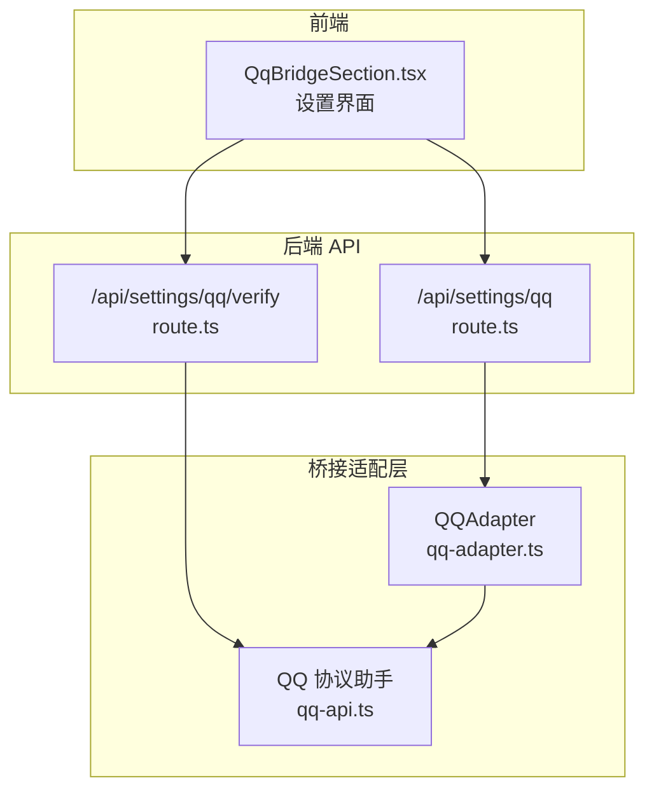
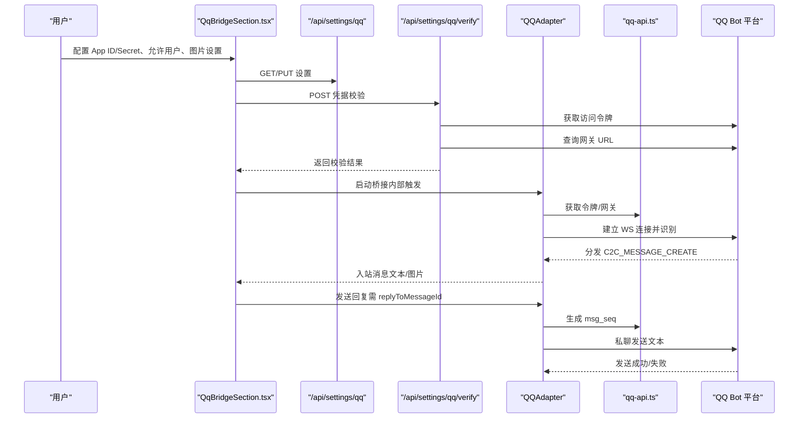
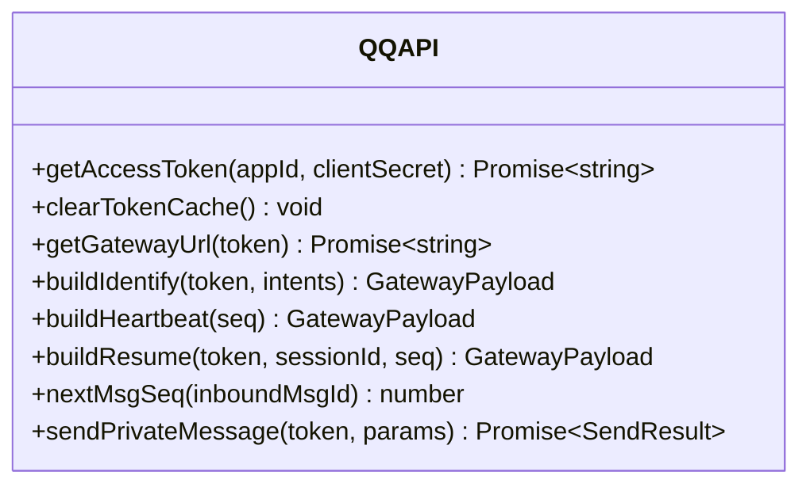
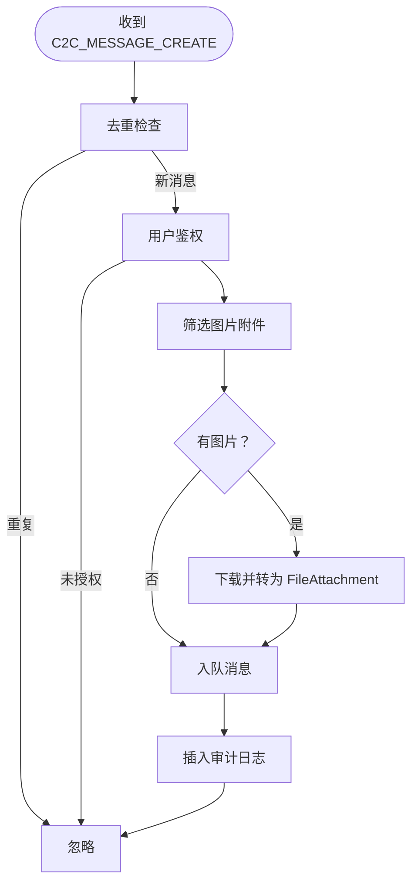
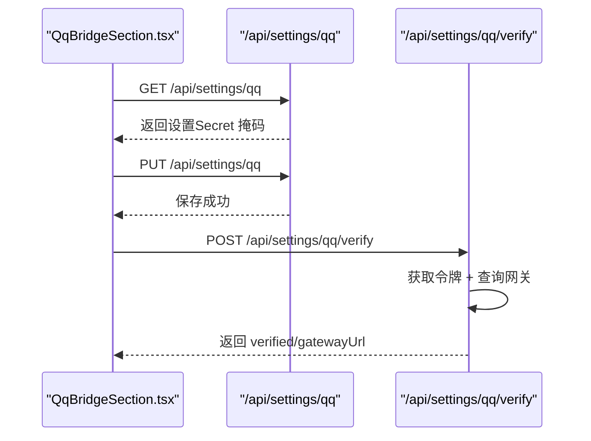
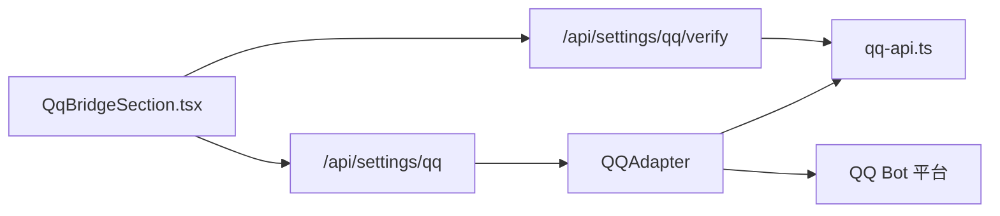

# QQ 桥接

<cite>
**本文引用的文件**
- [src/lib/bridge/adapters/qq-adapter.ts](file://src/lib/bridge/adapters/qq-adapter.ts)
- [src/lib/bridge/adapters/qq-api.ts](file://src/lib/bridge/adapters/qq-api.ts)
- [src/app/api/settings/qq/route.ts](file://src/app/api/settings/qq/route.ts)
- [src/app/api/settings/qq/verify/route.ts](file://src/app/api/settings/qq/verify/route.ts)
- [src/components/bridge/QqBridgeSection.tsx](file://src/components/bridge/QqBridgeSection.tsx)
- [docs/exec-plans/active/qq-bridge-channel.md](file://docs/exec-plans/active/qq-bridge-channel.md)
</cite>

## 目录
1. [简介](#简介)
2. [项目结构](#项目结构)
3. [核心组件](#核心组件)
4. [架构总览](#架构总览)
5. [详细组件分析](#详细组件分析)
6. [依赖关系分析](#依赖关系分析)
7. [性能考量](#性能考量)
8. [故障排查指南](#故障排查指南)
9. [结论](#结论)
10. [附录](#附录)

## 简介
本文件面向希望在 CodePilot 中启用 QQ 机器人桥接的用户与开发者，系统性说明如何配置 QQ 机器人以连接应用、完成认证与消息收发，并覆盖私聊（C2C）场景的消息格式转换、用户身份验证、图片附件处理、以及平台特性限制与注意事项。文档同时提供完整的配置步骤、API 使用示例路径与常见问题解决方案。

## 项目结构
与 QQ 桥接直接相关的模块分布如下：
- 协议与适配层：QQ 协议辅助函数与适配器实现
- 设置与校验：后端 API 提供设置读写与凭据校验
- 前端 UI：桥接设置页面与操作入口
- 执行计划：记录当前能力范围与实现里程碑

**图表来源**
- [src/components/bridge/QqBridgeSection.tsx:1-286](file://src/components/bridge/QqBridgeSection.tsx#L1-L286)
- [src/app/api/settings/qq/route.ts:1-67](file://src/app/api/settings/qq/route.ts#L1-L67)
- [src/app/api/settings/qq/verify/route.ts:1-73](file://src/app/api/settings/qq/verify/route.ts#L1-L73)
- [src/lib/bridge/adapters/qq-adapter.ts:1-492](file://src/lib/bridge/adapters/qq-adapter.ts#L1-L492)
- [src/lib/bridge/adapters/qq-api.ts:1-220](file://src/lib/bridge/adapters/qq-api.ts#L1-L220)

**章节来源**
- [src/components/bridge/QqBridgeSection.tsx:1-286](file://src/components/bridge/QqBridgeSection.tsx#L1-L286)
- [src/app/api/settings/qq/route.ts:1-67](file://src/app/api/settings/qq/route.ts#L1-L67)
- [src/app/api/settings/qq/verify/route.ts:1-73](file://src/app/api/settings/qq/verify/route.ts#L1-L73)
- [src/lib/bridge/adapters/qq-adapter.ts:1-492](file://src/lib/bridge/adapters/qq-adapter.ts#L1-L492)
- [src/lib/bridge/adapters/qq-api.ts:1-220](file://src/lib/bridge/adapters/qq-api.ts#L1-L220)
- [docs/exec-plans/active/qq-bridge-channel.md:1-36](file://docs/exec-plans/active/qq-bridge-channel.md#L1-L36)

## 核心组件
- QQ 协议助手（qq-api.ts）
  - 负责访问令牌获取与缓存、WebSocket 网关地址发现、心跳构建、会话恢复、私聊消息发送与消息序号生成等纯协议逻辑。
- QQ 适配器（qq-adapter.ts）
  - 实现适配器生命周期、WebSocket 连接与事件分发、去重、授权检查、图片下载与转换、入站消息队列与出站发送等业务逻辑。
- 设置与校验 API（/api/settings/qq 与 /api/settings/qq/verify）
  - 提供设置的读取/保存与凭据有效性验证（获取令牌与网关连通性）。
- 前端设置组件（QqBridgeSection.tsx）
  - 提供 App ID/Secret 输入、允许用户列表、图片开关与大小限制、保存与校验按钮等交互。

**章节来源**
- [src/lib/bridge/adapters/qq-api.ts:1-220](file://src/lib/bridge/adapters/qq-api.ts#L1-L220)
- [src/lib/bridge/adapters/qq-adapter.ts:1-492](file://src/lib/bridge/adapters/qq-adapter.ts#L1-L492)
- [src/app/api/settings/qq/route.ts:1-67](file://src/app/api/settings/qq/route.ts#L1-L67)
- [src/app/api/settings/qq/verify/route.ts:1-73](file://src/app/api/settings/qq/verify/route.ts#L1-L73)
- [src/components/bridge/QqBridgeSection.tsx:1-286](file://src/components/bridge/QqBridgeSection.tsx#L1-L286)

## 架构总览
下图展示从前端到后端、再到 QQ 平台的完整调用链路与数据流：

**图表来源**
- [src/components/bridge/QqBridgeSection.tsx:1-286](file://src/components/bridge/QqBridgeSection.tsx#L1-L286)
- [src/app/api/settings/qq/route.ts:1-67](file://src/app/api/settings/qq/route.ts#L1-L67)
- [src/app/api/settings/qq/verify/route.ts:1-73](file://src/app/api/settings/qq/verify/route.ts#L1-L73)
- [src/lib/bridge/adapters/qq-adapter.ts:1-492](file://src/lib/bridge/adapters/qq-adapter.ts#L1-L492)
- [src/lib/bridge/adapters/qq-api.ts:1-220](file://src/lib/bridge/adapters/qq-api.ts#L1-L220)

## 详细组件分析

### 组件一：QQ 协议助手（qq-api.ts）
- 访问令牌管理
  - 定期缓存并自动刷新，预留过期缓冲时间；支持显式清空缓存。
- 网关与握手
  - 获取 WebSocket 网关地址；构建识别与心跳包；支持断线续连。
- 私聊消息发送
  - 严格要求 msg_id 与 msg_seq；仅支持纯文本类型。
- 消息序号
  - 基于每条入站消息 ID 的自增计数器，避免重复与乱序。

**图表来源**
- [src/lib/bridge/adapters/qq-api.ts:1-220](file://src/lib/bridge/adapters/qq-api.ts#L1-L220)

**章节来源**
- [src/lib/bridge/adapters/qq-api.ts:1-220](file://src/lib/bridge/adapters/qq-api.ts#L1-L220)

### 组件二：QQ 适配器（qq-adapter.ts）
- 生命周期与连接
  - 启动时获取令牌与网关，建立 WS 连接，处理 HELLO/IDENTIFY/RESUME/INVALID_SESSION/RECONNECT 等事件。
- 入站消息处理（私聊）
  - 解析 C2C_MESSAGE_CREATE，去重、鉴权、提取文本与图片附件、异步下载图片并转为 FileAttachment、入队等待消费。
- 出站消息发送
  - 严格要求 replyToMessageId；将 HTML 内容剥离标签后发送；自动维护 msg_seq。
- 图片处理
  - 支持按配置开关与最大尺寸限制下载图片；失败时可回传错误提示。
- 心跳与重连
  - 周期性心跳；指数退避重连，最多尝试有限次数。

**图表来源**
- [src/lib/bridge/adapters/qq-adapter.ts:300-370](file://src/lib/bridge/adapters/qq-adapter.ts#L300-L370)

**章节来源**
- [src/lib/bridge/adapters/qq-adapter.ts:1-492](file://src/lib/bridge/adapters/qq-adapter.ts#L1-L492)

### 组件三：设置与校验 API（/api/settings/qq 与 /api/settings/qq/verify）
- 设置读取/保存
  - 支持读取与更新 App ID/Secret、允许用户列表、图片开关与最大尺寸等键值。
  - 对 App Secret 进行安全掩码返回；禁止回写被掩码的密文。
- 凭据校验
  - 通过平台接口获取访问令牌与网关 URL，验证连通性与可用性。

**图表来源**
- [src/app/api/settings/qq/route.ts:1-67](file://src/app/api/settings/qq/route.ts#L1-L67)
- [src/app/api/settings/qq/verify/route.ts:1-73](file://src/app/api/settings/qq/verify/route.ts#L1-L73)

**章节来源**
- [src/app/api/settings/qq/route.ts:1-67](file://src/app/api/settings/qq/route.ts#L1-L67)
- [src/app/api/settings/qq/verify/route.ts:1-73](file://src/app/api/settings/qq/verify/route.ts#L1-L73)

### 组件四：前端设置组件（QqBridgeSection.tsx）
- 功能点
  - App ID/Secret 输入与保存、凭据校验、允许用户逗号分隔列表、图片开关与最大尺寸输入、保存。
- 交互流程
  - 加载设置 → 用户编辑 → 保存或校验 → 展示状态横幅。

**章节来源**
- [src/components/bridge/QqBridgeSection.tsx:1-286](file://src/components/bridge/QqBridgeSection.tsx#L1-L286)

## 依赖关系分析
- 适配器依赖协议助手提供的令牌、网关、心跳与发送能力。
- 设置 API 与前端组件共同驱动适配器的启动与运行。
- 当前版本不支持群聊、Markdown、主动消息与流式预览。

**图表来源**
- [src/components/bridge/QqBridgeSection.tsx:1-286](file://src/components/bridge/QqBridgeSection.tsx#L1-L286)
- [src/app/api/settings/qq/route.ts:1-67](file://src/app/api/settings/qq/route.ts#L1-L67)
- [src/app/api/settings/qq/verify/route.ts:1-73](file://src/app/api/settings/qq/verify/route.ts#L1-L73)
- [src/lib/bridge/adapters/qq-adapter.ts:1-492](file://src/lib/bridge/adapters/qq-adapter.ts#L1-L492)
- [src/lib/bridge/adapters/qq-api.ts:1-220](file://src/lib/bridge/adapters/qq-api.ts#L1-L220)

**章节来源**
- [docs/exec-plans/active/qq-bridge-channel.md:1-36](file://docs/exec-plans/active/qq-bridge-channel.md#L1-L36)

## 性能考量
- 心跳与重连
  - 心跳周期由服务器下发；断线重连采用指数退避，避免频繁抖动。
- 去重与内存
  - 维护固定大小的消息 ID 去重窗口，防止内存无限增长。
- 图片下载
  - 异步下载并限制最大尺寸，超限直接报错；失败时尽量保证文本消息可达。
- 发送速率
  - 回复窗口较短且消耗配额，建议合并回复或延迟批量发送。

[本节为通用指导，无需特定文件来源]

## 故障排查指南
- 无法获取访问令牌
  - 检查 App ID/Secret 是否正确；确认网络可达性；查看校验接口返回的错误信息。
- 无法连接网关
  - 校验接口会返回网关 URL；若失败，检查令牌是否有效、服务端是否可达。
- 无消息到达
  - 确认适配器已启动；检查授权用户列表是否包含发送者；确认私聊消息事件已订阅。
- 图片无法下载
  - 检查图片开关与最大尺寸配置；确认图片 URL 可访问；关注下载超时与大小限制。
- 回复失败
  - 确保出站消息携带 replyToMessageId；检查 msg_seq 是否正确递增；确认发送内容为纯文本。

**章节来源**
- [src/app/api/settings/qq/verify/route.ts:1-73](file://src/app/api/settings/qq/verify/route.ts#L1-L73)
- [src/lib/bridge/adapters/qq-adapter.ts:147-178](file://src/lib/bridge/adapters/qq-adapter.ts#L147-L178)
- [src/lib/bridge/adapters/qq-api.ts:185-220](file://src/lib/bridge/adapters/qq-api.ts#L185-L220)

## 结论
当前版本的 QQ 桥接专注于私聊文本与图片的入站处理与被动回复，具备完善的凭据校验、鉴权、图片处理与稳健的连接管理机制。后续可基于现有基础扩展群聊、Markdown、主动消息与流式预览等功能。

[本节为总结性内容，无需特定文件来源]

## 附录

### 配置步骤（从零开始）
- 在前端设置页填写 App ID/Secret，并点击“保存”。
- 点击“校验”，验证令牌与网关连通性。
- 在“允许用户”中填入需要放行的用户 openid 列表（可选）。
- 如需启用图片，打开图片开关并设置最大尺寸（单位 MB）。
- 保存设置后，适配器将自动启动并监听私聊消息。

**章节来源**
- [src/components/bridge/QqBridgeSection.tsx:1-286](file://src/components/bridge/QqBridgeSection.tsx#L1-L286)
- [src/app/api/settings/qq/route.ts:1-67](file://src/app/api/settings/qq/route.ts#L1-L67)
- [src/app/api/settings/qq/verify/route.ts:1-73](file://src/app/api/settings/qq/verify/route.ts#L1-L73)

### API 使用示例（路径）
- 读取/保存设置
  - GET /api/settings/qq
  - PUT /api/settings/qq
- 凭据校验
  - POST /api/settings/qq/verify

**章节来源**
- [src/app/api/settings/qq/route.ts:1-67](file://src/app/api/settings/qq/route.ts#L1-L67)
- [src/app/api/settings/qq/verify/route.ts:1-73](file://src/app/api/settings/qq/verify/route.ts#L1-L73)

### QQ 平台特性与限制
- 仅支持私聊（C2C）消息，暂不支持群聊/频道。
- 出站消息必须为纯文本，不支持 Markdown。
- 不支持主动消息与流式预览。
- 回复需携带 replyToMessageId 与 msg_seq，且存在配额窗口。
- 图片下载受最大尺寸限制，失败时可回传错误提示。

**章节来源**
- [docs/exec-plans/active/qq-bridge-channel.md:1-36](file://docs/exec-plans/active/qq-bridge-channel.md#L1-L36)
- [src/lib/bridge/adapters/qq-adapter.ts:147-178](file://src/lib/bridge/adapters/qq-adapter.ts#L147-L178)
- [src/lib/bridge/adapters/qq-api.ts:185-220](file://src/lib/bridge/adapters/qq-api.ts#L185-L220)