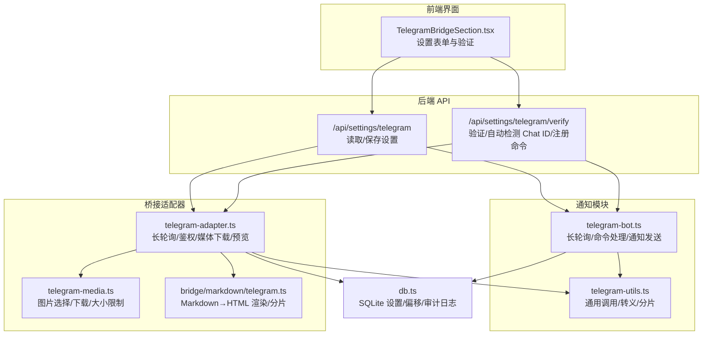
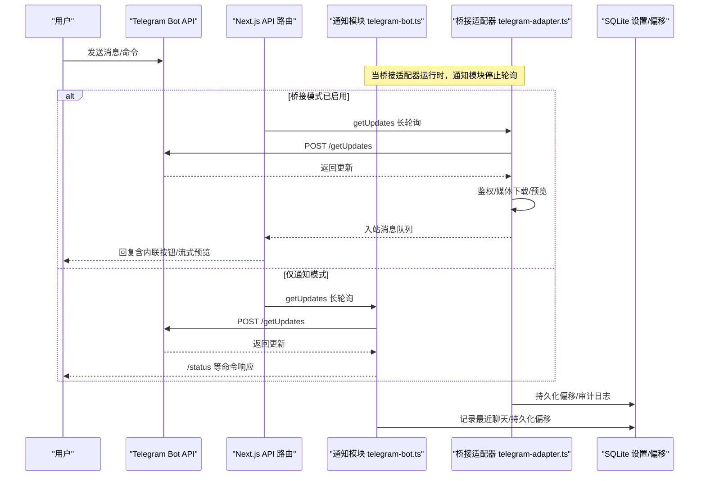
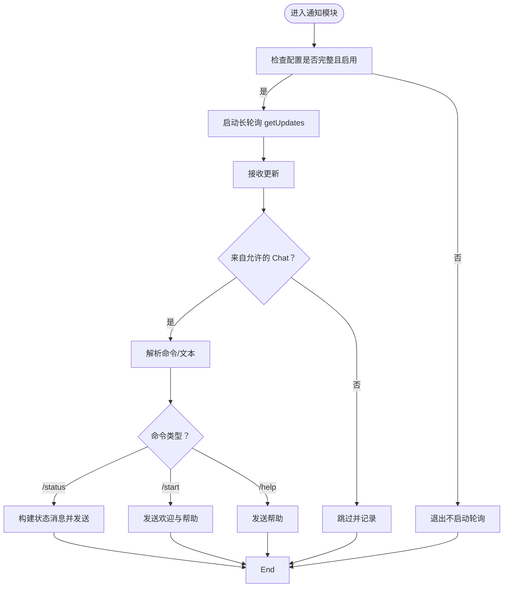
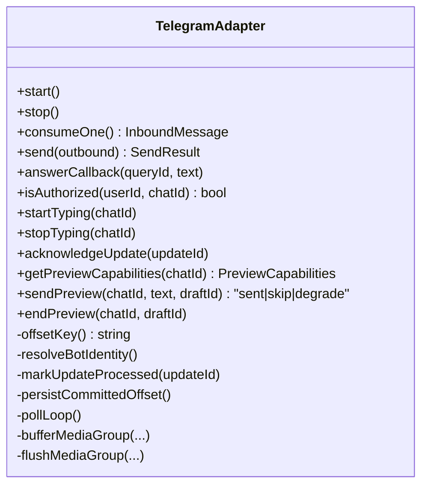
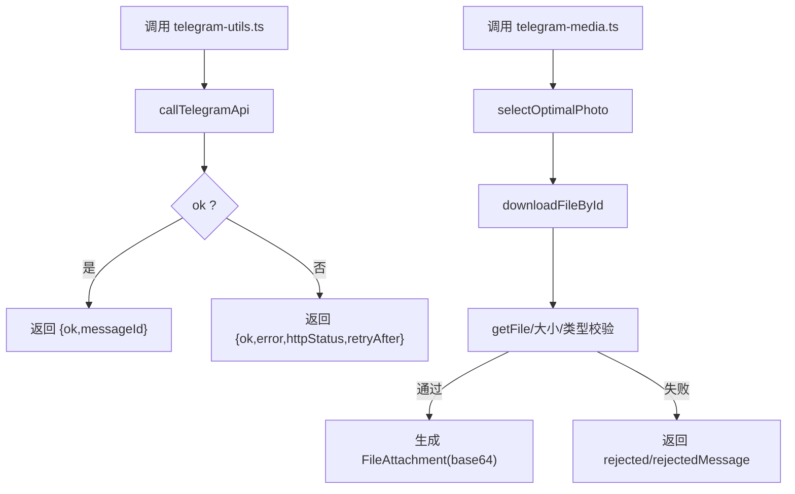
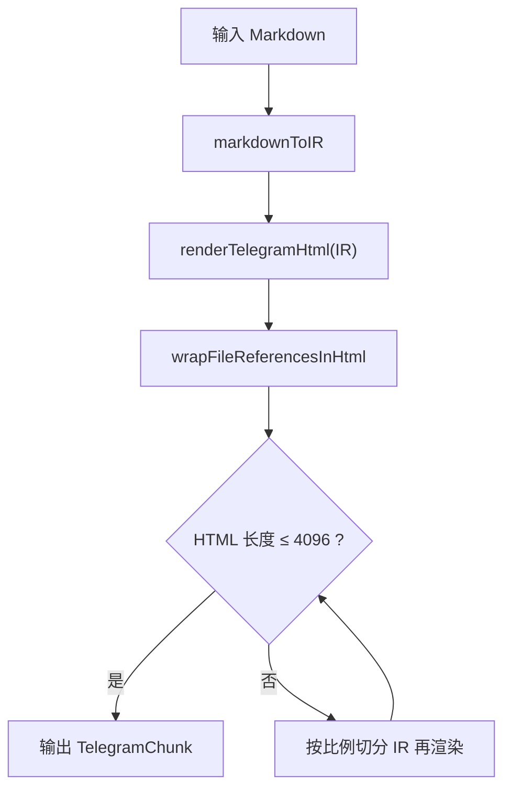
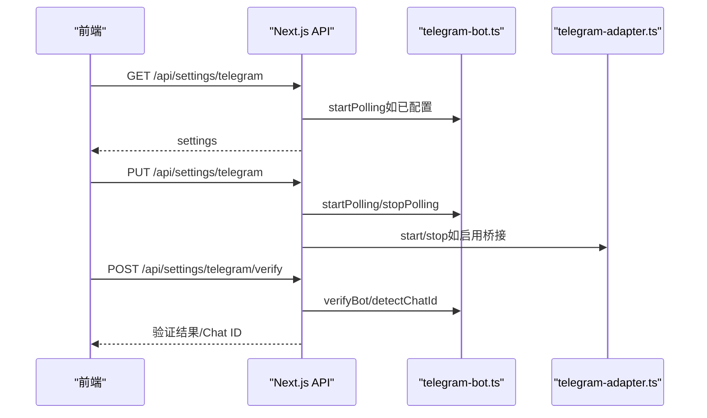
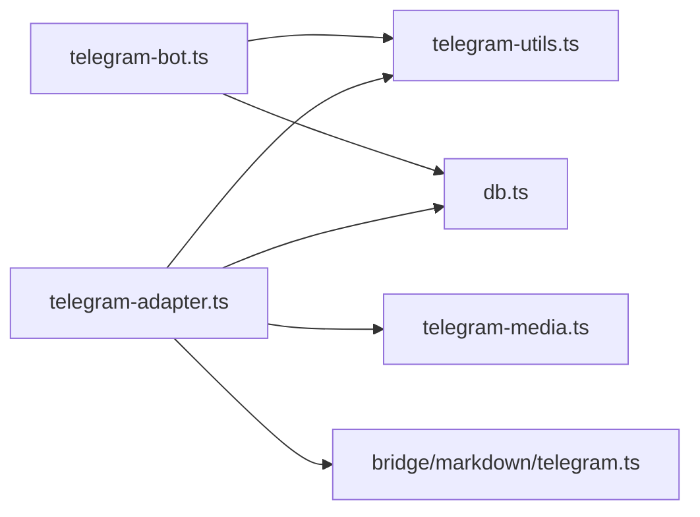

# Telegram 桥接

<cite>
**本文引用的文件**
- [src/lib/telegram-bot.ts](file://src/lib/telegram-bot.ts)
- [src/lib/bridge/adapters/telegram-adapter.ts](file://src/lib/bridge/adapters/telegram-adapter.ts)
- [src/lib/bridge/adapters/telegram-utils.ts](file://src/lib/bridge/adapters/telegram-utils.ts)
- [src/lib/bridge/adapters/telegram-media.ts](file://src/lib/bridge/adapters/telegram-media.ts)
- [src/lib/bridge/markdown/telegram.ts](file://src/lib/bridge/markdown/telegram.ts)
- [src/app/api/settings/telegram/route.ts](file://src/app/api/settings/telegram/route.ts)
- [src/app/api/settings/telegram/verify/route.ts](file://src/app/api/settings/telegram/verify/route.ts)
- [src/components/bridge/TelegramBridgeSection.tsx](file://src/components/bridge/TelegramBridgeSection.tsx)
- [apps/site/content/docs/zh/bridge/telegram.mdx](file://apps/site/content/docs/zh/bridge/telegram.mdx)
- [src/lib/db.ts](file://src/lib/db.ts)
</cite>

## 目录
1. [简介](#简介)
2. [项目结构](#项目结构)
3. [核心组件](#核心组件)
4. [架构总览](#架构总览)
5. [详细组件分析](#详细组件分析)
6. [依赖关系分析](#依赖关系分析)
7. [性能考虑](#性能考虑)
8. [故障排除指南](#故障排除指南)
9. [结论](#结论)
10. [附录](#附录)

## 简介
本文件面向希望在 CodePilot 中启用 Telegram 桥接的用户与开发者，系统性说明如何创建 Telegram Bot、获取 API 密钥、配置通知与桥接模式、消息路由机制、权限管理策略、常见问题排查与安全建议。文档同时提供代码级实现路径与可视化图示，帮助读者快速落地。

## 项目结构
Telegram 桥接涉及三层能力：
- 通知模式：通过长轮询监听命令并发送任务状态通知（单向）
- 桥接模式：通过长轮询消费 Telegram 消息，解析文本/图片，转发至 CodePilot 并回传结果（双向）
- Markdown 渲染：将 Claude 输出的 Markdown 转换为 Telegram 友好的 HTML 并进行分片

**图表来源**
- [src/components/bridge/TelegramBridgeSection.tsx:1-294](file://src/components/bridge/TelegramBridgeSection.tsx#L1-L294)
- [src/app/api/settings/telegram/route.ts:1-88](file://src/app/api/settings/telegram/route.ts#L1-L88)
- [src/app/api/settings/telegram/verify/route.ts:1-78](file://src/app/api/settings/telegram/verify/route.ts#L1-L78)
- [src/lib/telegram-bot.ts:1-578](file://src/lib/telegram-bot.ts#L1-L578)
- [src/lib/bridge/adapters/telegram-adapter.ts:1-867](file://src/lib/bridge/adapters/telegram-adapter.ts#L1-L867)
- [src/lib/bridge/adapters/telegram-utils.ts:1-142](file://src/lib/bridge/adapters/telegram-utils.ts#L1-L142)
- [src/lib/bridge/adapters/telegram-media.ts:1-300](file://src/lib/bridge/adapters/telegram-media.ts#L1-L300)
- [src/lib/bridge/markdown/telegram.ts:1-359](file://src/lib/bridge/markdown/telegram.ts#L1-L359)
- [src/lib/db.ts:1-200](file://src/lib/db.ts#L1-L200)

**章节来源**
- [src/components/bridge/TelegramBridgeSection.tsx:1-294](file://src/components/bridge/TelegramBridgeSection.tsx#L1-L294)
- [src/app/api/settings/telegram/route.ts:1-88](file://src/app/api/settings/telegram/route.ts#L1-L88)
- [src/app/api/settings/telegram/verify/route.ts:1-78](file://src/app/api/settings/telegram/verify/route.ts#L1-L78)
- [src/lib/telegram-bot.ts:1-578](file://src/lib/telegram-bot.ts#L1-L578)
- [src/lib/bridge/adapters/telegram-adapter.ts:1-867](file://src/lib/bridge/adapters/telegram-adapter.ts#L1-L867)
- [src/lib/bridge/adapters/telegram-utils.ts:1-142](file://src/lib/bridge/adapters/telegram-utils.ts#L1-L142)
- [src/lib/bridge/adapters/telegram-media.ts:1-300](file://src/lib/bridge/adapters/telegram-media.ts#L1-L300)
- [src/lib/bridge/markdown/telegram.ts:1-359](file://src/lib/bridge/markdown/telegram.ts#L1-L359)
- [src/lib/db.ts:1-200](file://src/lib/db.ts#L1-L200)

## 核心组件
- 通知模块（telegram-bot.ts）
  - 提供长轮询监听命令（/status 等）、发送任务状态通知、自动检测 Chat ID、验证 Bot Token 等能力
  - 与桥接适配器互斥：当桥接适配器处于“桥接模式”时，通知模块会停止轮询，避免冲突
- 桥接适配器（telegram-adapter.ts）
  - 实现 BaseChannelAdapter，负责长轮询消费 Telegram 更新、鉴权、媒体下载、流式预览、回调处理
  - 将入站消息转换为统一 InboundMessage，支持文本、图片、相册等
- 工具与媒体（telegram-utils.ts、telegram-media.ts）
  - 统一调用 Telegram Bot API、HTML 转义、消息分片、图片最优尺寸选择、下载与大小校验
- Markdown 渲染（bridge/markdown/telegram.ts）
  - 将 Markdown 转换为 Telegram HTML，包裹文件引用，按渲染后长度进行分片
- 设置与验证 API（/api/settings/telegram*）
  - 读取/保存 Telegram 设置；验证 Token、自动检测 Chat ID、注册命令菜单
- 前端设置页（TelegramBridgeSection.tsx）
  - 提供 Bot 凭据、允许用户列表、一键检测 Chat ID、测试连接等交互

**章节来源**
- [src/lib/telegram-bot.ts:1-578](file://src/lib/telegram-bot.ts#L1-L578)
- [src/lib/bridge/adapters/telegram-adapter.ts:1-867](file://src/lib/bridge/adapters/telegram-adapter.ts#L1-L867)
- [src/lib/bridge/adapters/telegram-utils.ts:1-142](file://src/lib/bridge/adapters/telegram-utils.ts#L1-L142)
- [src/lib/bridge/adapters/telegram-media.ts:1-300](file://src/lib/bridge/adapters/telegram-media.ts#L1-L300)
- [src/lib/bridge/markdown/telegram.ts:1-359](file://src/lib/bridge/markdown/telegram.ts#L1-L359)
- [src/app/api/settings/telegram/route.ts:1-88](file://src/app/api/settings/telegram/route.ts#L1-L88)
- [src/app/api/settings/telegram/verify/route.ts:1-78](file://src/app/api/settings/telegram/verify/route.ts#L1-L78)
- [src/components/bridge/TelegramBridgeSection.tsx:1-294](file://src/components/bridge/TelegramBridgeSection.tsx#L1-L294)

## 架构总览
下图展示了从用户在 Telegram 中发送消息到 CodePilot 处理并回传的完整链路，以及通知模块与桥接适配器的协作与互斥关系。

**图表来源**
- [src/lib/telegram-bot.ts:466-578](file://src/lib/telegram-bot.ts#L466-L578)
- [src/lib/bridge/adapters/telegram-adapter.ts:459-619](file://src/lib/bridge/adapters/telegram-adapter.ts#L459-L619)
- [src/app/api/settings/telegram/route.ts:36-49](file://src/app/api/settings/telegram/route.ts#L36-L49)

## 详细组件分析

### 通知模块（telegram-bot.ts）
- 配置项
  - telegram_bot_token、telegram_chat_id、telegram_enabled、telegram_notify_*、telegram_notify_permission
- 关键能力
  - 长轮询：仅在配置完成且未处于桥接模式时启动
  - 命令处理：/start、/status、/help，仅来自配置 Chat 的消息生效
  - 通知发送：任务开始/完成/错误/权限请求，自动分片与 HTML 转义
  - 自动检测 Chat ID：优先使用 getUpdates 最近消息，回退到轮询期间记录的最近聊天
  - Bot 验证：getMe 校验 Token，可选向 Chat 发送测试消息
- 互斥保护
  - setBridgeModeActive(true) 时，通知模块停止轮询，避免与桥接适配器争抢更新

**图表来源**
- [src/lib/telegram-bot.ts:466-578](file://src/lib/telegram-bot.ts#L466-L578)

**章节来源**
- [src/lib/telegram-bot.ts:86-101](file://src/lib/telegram-bot.ts#L86-L101)
- [src/lib/telegram-bot.ts:149-245](file://src/lib/telegram-bot.ts#L149-L245)
- [src/lib/telegram-bot.ts:314-357](file://src/lib/telegram-bot.ts#L314-L357)
- [src/lib/telegram-bot.ts:466-578](file://src/lib/telegram-bot.ts#L466-L578)

### 桥接适配器（telegram-adapter.ts）
- 配置校验：必须配置 telegram_bot_token 与 bridge_telegram_enabled=true
- 鉴权策略：
  - 优先使用 telegram_bridge_allowed_users（用户 ID 或 Chat ID 列表）
  - 若未配置，则回退到通知模块的 telegram_chat_id
- 长轮询与去重：
  - 使用 committedOffset 连续推进水位，结合 recentUpdateIds 集合去重
  - 支持媒体组（相册）缓冲与去抖，统一落盘
- 媒体处理：
  - 选择最优照片尺寸（长边≥1568px，否则取最大）
  - 下载文件并转为 base64 FileAttachment，支持大小限制与 MIME 校验
- 流式预览：
  - 通过 sendMessageDraft 实现草稿消息，支持私聊或受控范围
  - 遇到 429/400/404 等错误的降级策略
- 回调处理：
  - answerCallbackQuery 回应加载态，确保用户体验

**图表来源**
- [src/lib/bridge/adapters/telegram-adapter.ts:74-155](file://src/lib/bridge/adapters/telegram-adapter.ts#L74-L155)
- [src/lib/bridge/adapters/telegram-adapter.ts:230-248](file://src/lib/bridge/adapters/telegram-adapter.ts#L230-L248)
- [src/lib/bridge/adapters/telegram-adapter.ts:342-358](file://src/lib/bridge/adapters/telegram-adapter.ts#L342-L358)
- [src/lib/bridge/adapters/telegram-adapter.ts:459-619](file://src/lib/bridge/adapters/telegram-adapter.ts#L459-L619)
- [src/lib/bridge/adapters/telegram-adapter.ts:719-800](file://src/lib/bridge/adapters/telegram-adapter.ts#L719-L800)

**章节来源**
- [src/lib/bridge/adapters/telegram-adapter.ts:220-228](file://src/lib/bridge/adapters/telegram-adapter.ts#L220-L228)
- [src/lib/bridge/adapters/telegram-adapter.ts:230-248](file://src/lib/bridge/adapters/telegram-adapter.ts#L230-L248)
- [src/lib/bridge/adapters/telegram-adapter.ts:342-358](file://src/lib/bridge/adapters/telegram-adapter.ts#L342-L358)
- [src/lib/bridge/adapters/telegram-adapter.ts:459-619](file://src/lib/bridge/adapters/telegram-adapter.ts#L459-L619)
- [src/lib/bridge/adapters/telegram-adapter.ts:719-800](file://src/lib/bridge/adapters/telegram-adapter.ts#L719-L800)

### 工具与媒体（telegram-utils.ts、telegram-media.ts）
- 通用工具
  - callTelegramApi：封装 Telegram Bot API 调用，提取 httpStatus/retry_after
  - sendMessageDraft：流式预览草稿消息
  - escapeHtml/splitMessage/formatSessionHeader：HTML 转义、按行分片、会话头格式化
- 媒体处理
  - selectOptimalPhoto：按长边≥1568px 选择最优尺寸，否则取最大
  - downloadPhoto/downloadDocumentImage：getFile→下载→base64，带重试与大小/类型校验
  - isImageEnabled/isSupportedImageMime/inferMimeType：配置开关与类型判断

**图表来源**
- [src/lib/bridge/adapters/telegram-utils.ts:37-67](file://src/lib/bridge/adapters/telegram-utils.ts#L37-L67)
- [src/lib/bridge/adapters/telegram-media.ts:120-155](file://src/lib/bridge/adapters/telegram-media.ts#L120-L155)
- [src/lib/bridge/adapters/telegram-media.ts:193-288](file://src/lib/bridge/adapters/telegram-media.ts#L193-L288)

**章节来源**
- [src/lib/bridge/adapters/telegram-utils.ts:1-142](file://src/lib/bridge/adapters/telegram-utils.ts#L1-L142)
- [src/lib/bridge/adapters/telegram-media.ts:1-300](file://src/lib/bridge/adapters/telegram-media.ts#L1-L300)

### Markdown 渲染（bridge/markdown/telegram.ts）
- 将 Markdown 转为 IR（中间表示），再渲染为 Telegram HTML
- 文件引用包裹：<code> 防止 Telegram 生成域名预览
- 分片策略：先按 IR 文本切片，再渲染为 HTML，若超过限制则按比例再次切分

**图表来源**
- [src/lib/bridge/markdown/telegram.ts:329-359](file://src/lib/bridge/markdown/telegram.ts#L329-L359)

**章节来源**
- [src/lib/bridge/markdown/telegram.ts:1-359](file://src/lib/bridge/markdown/telegram.ts#L1-L359)

### 设置与验证 API（/api/settings/telegram*）
- GET /api/settings/telegram：读取 Telegram 设置（掩码显示 Bot Token），并在满足条件时自动启动轮询
- PUT /api/settings/telegram：保存设置，根据启用状态控制轮询启停
- POST /api/settings/telegram/verify：
  - verify：验证 Token，可选向 Chat 发送测试消息
  - detect_chat_id：自动检测 Chat ID
  - register_commands：注册 Bot 命令菜单

**图表来源**
- [src/app/api/settings/telegram/route.ts:21-87](file://src/app/api/settings/telegram/route.ts#L21-L87)
- [src/app/api/settings/telegram/verify/route.ts:17-77](file://src/app/api/settings/telegram/verify/route.ts#L17-L77)
- [src/lib/telegram-bot.ts:276-357](file://src/lib/telegram-bot.ts#L276-L357)
- [src/lib/telegram-bot.ts:466-490](file://src/lib/telegram-bot.ts#L466-L490)

**章节来源**
- [src/app/api/settings/telegram/route.ts:1-88](file://src/app/api/settings/telegram/route.ts#L1-L88)
- [src/app/api/settings/telegram/verify/route.ts:1-78](file://src/app/api/settings/telegram/verify/route.ts#L1-L78)
- [src/lib/telegram-bot.ts:276-357](file://src/lib/telegram-bot.ts#L276-L357)
- [src/lib/telegram-bot.ts:466-490](file://src/lib/telegram-bot.ts#L466-L490)

### 前端设置页（TelegramBridgeSection.tsx）
- 表单项：Bot Token、Chat ID、允许用户列表
- 功能：保存设置、一键检测 Chat ID、测试连接
- 交互：根据翻译文案动态展示步骤与提示

**章节来源**
- [src/components/bridge/TelegramBridgeSection.tsx:1-294](file://src/components/bridge/TelegramBridgeSection.tsx#L1-L294)

## 依赖关系分析
- 组件耦合
  - 通知模块与桥接适配器互斥：通过全局标志与 stopPolling 避免竞争
  - 两者均依赖 telegram-utils.ts 进行 API 调用
  - 桥接适配器依赖 telegram-media.ts 进行图片处理
  - Markdown 渲染独立于桥接，但被桥接适配器用于消息预览与最终发送
- 数据存储
  - 设置项存储于 SQLite settings 表，包括 telegram_*、bridge_telegram_*、通道偏移等
  - 通道偏移通过 getChannelOffset/setChannelOffset 管理，保证重启后从正确位置继续

**图表来源**
- [src/lib/telegram-bot.ts:18-24](file://src/lib/telegram-bot.ts#L18-L24)
- [src/lib/bridge/adapters/telegram-adapter.ts:17-28](file://src/lib/bridge/adapters/telegram-adapter.ts#L17-L28)
- [src/lib/bridge/adapters/telegram-utils.ts:1-142](file://src/lib/bridge/adapters/telegram-utils.ts#L1-L142)
- [src/lib/bridge/adapters/telegram-media.ts:1-300](file://src/lib/bridge/adapters/telegram-media.ts#L1-L300)
- [src/lib/bridge/markdown/telegram.ts:1-359](file://src/lib/bridge/markdown/telegram.ts#L1-L359)
- [src/lib/db.ts:121-126](file://src/lib/db.ts#L121-L126)

**章节来源**
- [src/lib/db.ts:121-126](file://src/lib/db.ts#L121-L126)
- [src/lib/bridge/adapters/telegram-adapter.ts:452-457](file://src/lib/bridge/adapters/telegram-adapter.ts#L452-L457)

## 性能考虑
- 长轮询参数
  - 超时时间与 allowed_updates 限制减少无效轮询
  - 错误退避（5 秒）降低突发错误对系统压力
- 偏移与去重
  - committedOffset 连续推进，recentUpdateIds 控制去重窗口，避免重复处理与内存膨胀
- 媒体下载
  - getFile 后立即校验 Content-Length 与实际大小，防止超大文件占用资源
  - 重试采用指数回退，降低 Telegram 限流影响
- Markdown 分片
  - 先按 IR 文本切片，再渲染为 HTML，若仍超限则按比例再次切分，避免无限循环

[本节为通用指导，无需特定文件引用]

## 故障排除指南
- Bot 没有响应
  - 确认桥接服务已启动（桥接页面显示“已连接”）
  - 确认 Telegram 渠道开关与桥接主开关均已开启
  - 重新测试连接，核对 Bot Token
  - 若配置了允许用户列表，确认当前用户 ID 在其中
- 收到错误消息
  - API 额度不足：检查提供商余额
  - 模型不可用：检查默认服务商与模型配置
  - 权限超时：Claude 等待权限确认超时，重新发送消息
- Chat ID 无法自动检测
  - 先在 Telegram 中向 Bot 发送任意消息，再尝试检测
  - 若仍失败，检查 Bot 是否能正常 getUpdates，或查看最近聊天记录回退逻辑

**章节来源**
- [apps/site/content/docs/zh/bridge/telegram.mdx:67-81](file://apps/site/content/docs/zh/bridge/telegram.mdx#L67-L81)
- [src/lib/telegram-bot.ts:314-357](file://src/lib/telegram-bot.ts#L314-L357)

## 结论
Telegram 桥接在 CodePilot 中提供了两种能力：通知模式与桥接模式。通知模式适合单向推送任务状态与命令响应；桥接模式则实现双向对话、权限确认、流式预览与媒体处理。通过严格的鉴权、偏移持久化与媒体校验，系统在可用性与稳定性之间取得平衡。建议在生产环境启用桥接模式时，配合细粒度的允许用户列表与合理的流式预览参数，以获得最佳体验。

[本节为总结性内容，无需特定文件引用]

## 附录

### 配置步骤（面向用户）
- 创建 Telegram Bot
  - 在 Telegram 搜索 [@BotFather](https://t.me/BotFather)，发送 `/newbot`，按提示输入名称与用户名，复制返回的 Bot Token
- 在 CodePilot 中配置
  - 打开“桥接”→“Telegram”，粘贴 Bot Token，点击“测试连接”
  - 点击“自动检测 Chat ID”：先在 Telegram 中向 Bot 发送任意消息，再点击检测
  - （可选）在“允许的用户”中填写允许使用的 Telegram 用户 ID，多个用逗号分隔
  - 点击“保存”
- 启用桥接
  - 回到桥接总览，确保 Telegram 渠道开关与桥接主开关均开启，点击“启动”

**章节来源**
- [apps/site/content/docs/zh/bridge/telegram.mdx:10-36](file://apps/site/content/docs/zh/bridge/telegram.mdx#L10-L36)

### API 与配置清单（面向开发者）
- 设置项（SQLite settings）
  - telegram_bot_token、telegram_chat_id、telegram_enabled、telegram_notify_start、telegram_notify_complete、telegram_notify_error、telegram_notify_permission、telegram_bridge_allowed_users
  - bridge_telegram_enabled、bridge_telegram_stream_enabled、bridge_telegram_stream_private_only、bridge_telegram_image_enabled、bridge_telegram_max_image_size
- 关键接口
  - GET /api/settings/telegram：读取设置（掩码显示 Token），自动启动轮询
  - PUT /api/settings/telegram：保存设置，按启用状态启停轮询
  - POST /api/settings/telegram/verify：
    - verify：验证 Token，可选发送测试消息
    - detect_chat_id：自动检测 Chat ID
    - register_commands：注册 Bot 命令菜单

**章节来源**
- [src/app/api/settings/telegram/route.ts:10-19](file://src/app/api/settings/telegram/route.ts#L10-L19)
- [src/app/api/settings/telegram/route.ts:21-87](file://src/app/api/settings/telegram/route.ts#L21-L87)
- [src/app/api/settings/telegram/verify/route.ts:9-16](file://src/app/api/settings/telegram/verify/route.ts#L9-L16)
- [src/app/api/settings/telegram/verify/route.ts:58-72](file://src/app/api/settings/telegram/verify/route.ts#L58-L72)