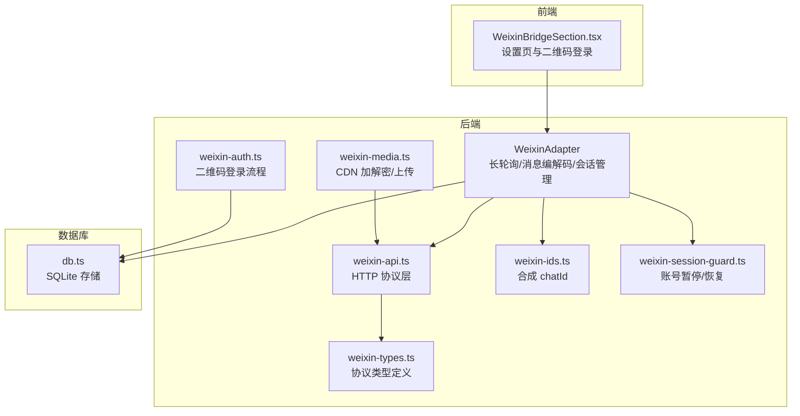
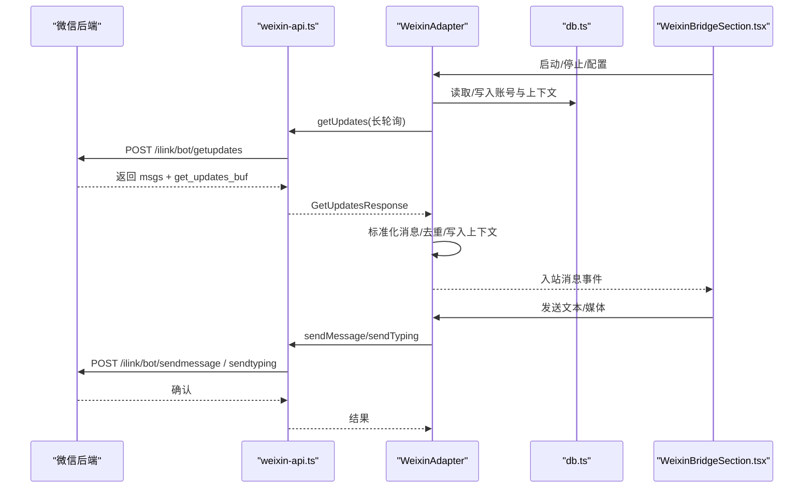
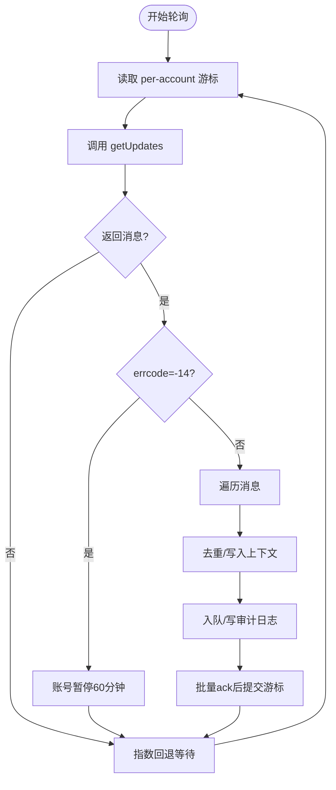
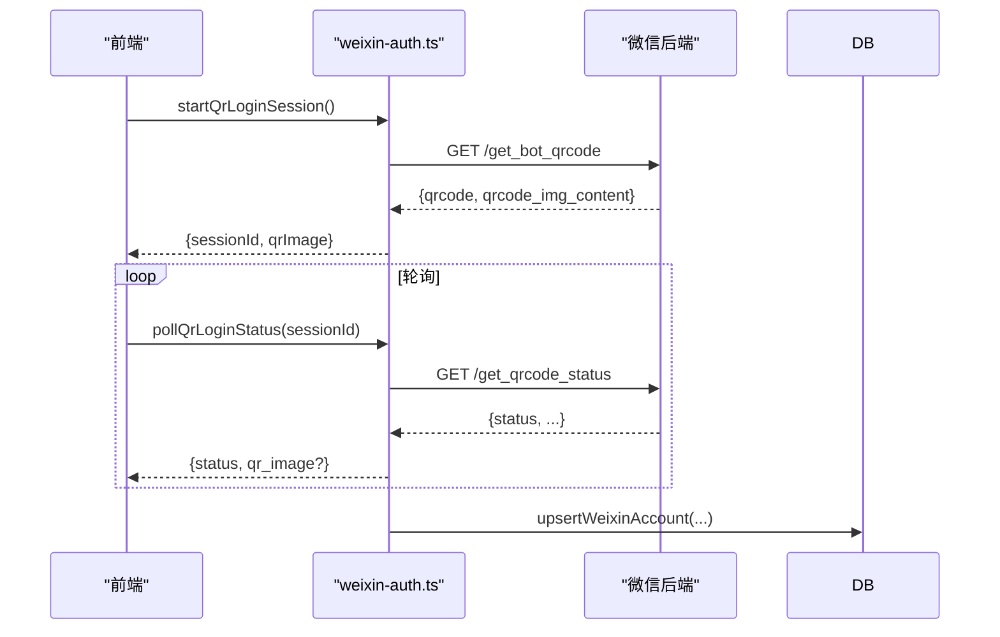
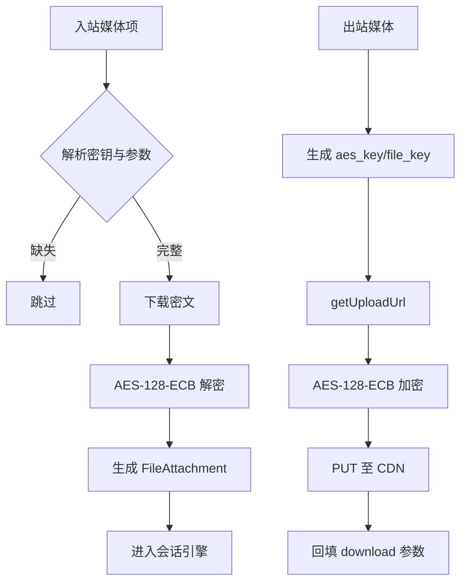
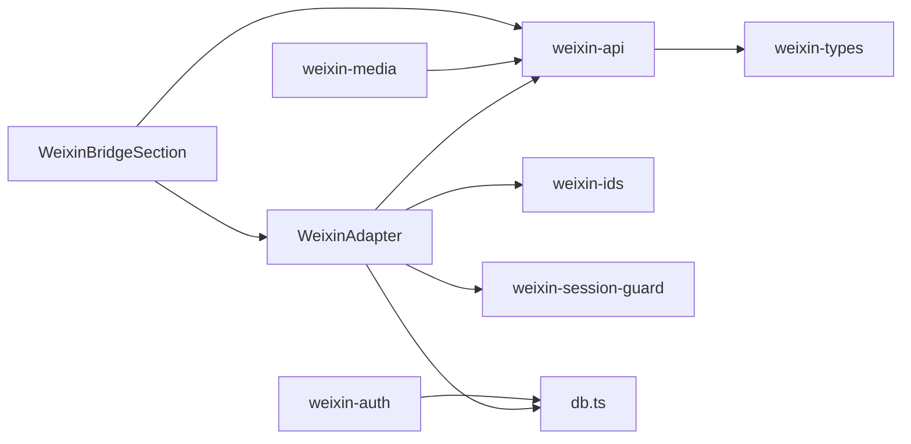

# 微信桥接

<cite>
**本文引用的文件**
- [weixin-adapter.ts](file://src/lib/bridge/adapters/weixin-adapter.ts)
- [weixin-api.ts](file://src/lib/bridge/adapters/weixin/weixin-api.ts)
- [weixin-auth.ts](file://src/lib/bridge/adapters/weixin/weixin-auth.ts)
- [weixin-types.ts](file://src/lib/bridge/adapters/weixin/weixin-types.ts)
- [weixin-media.ts](file://src/lib/bridge/adapters/weixin/weixin-media.ts)
- [weixin-ids.ts](file://src/lib/bridge/adapters/weixin/weixin-ids.ts)
- [weixin-session-guard.ts](file://src/lib/bridge/adapters/weixin/weixin-session-guard.ts)
- [WeixinBridgeSection.tsx](file://src/components/bridge/WeixinBridgeSection.tsx)
- [route.ts（微信全局设置）](file://src/app/api/settings/weixin/route.ts)
- [weixin-adapter-ack.test.ts](file://src/__tests__/unit/weixin-adapter-ack.test.ts)
- [weixin-api.test.ts](file://src/__tests__/unit/weixin-api.test.ts)
- [weixin-bridge-channel.md](file://docs/exec-plans/active/weixin-bridge-channel.md)
- [db.ts](file://src/lib/db.ts)
- [zh.ts](file://src/i18n/zh.ts)
</cite>

## 目录
1. [简介](#简介)
2. [项目结构](#项目结构)
3. [核心组件](#核心组件)
4. [架构总览](#架构总览)
5. [详细组件分析](#详细组件分析)
6. [依赖关系分析](#依赖关系分析)
7. [性能考量](#性能考量)
8. [故障排除指南](#故障排除指南)
9. [结论](#结论)
10. [附录](#附录)

## 简介
本文件面向希望在 CodePilot 中接入微信桥接能力的工程师与运维人员，系统性说明如何通过二维码登录、长轮询接收消息、文本与媒体转发、typing 指示、用户会话管理与权限降级等能力，实现微信公众号或小程序的远程控制与消息交互。文档严格基于仓库现有实现进行说明，涵盖：
- 微信开放平台与后端 API 的对接方式
- 二维码登录流程与凭证持久化
- 长轮询消息消费与批量游标确认机制
- 文本与媒体处理、CDN 加解密与上传
- 用户会话隔离、权限审批降级与安全建议
- 常见问题定位与排障方法

## 项目结构
微信桥接相关代码主要分布在以下模块：
- 适配器层：负责与微信后端交互、消息编解码、长轮询与会话管理
- 协议与认证：封装 HTTP 请求头、协议字段、二维码登录流程
- 媒体处理：CDN 加密/解密、上传与下载
- 前端设置页：二维码登录、账号列表、启停与删除
- API 路由：全局设置、账号管理、登录流程
- 测试与文档：单元测试与集成计划



**图表来源**
- [weixin-adapter.ts:1-526](file://src/lib/bridge/adapters/weixin-adapter.ts#L1-L526)
- [weixin-api.ts:1-269](file://src/lib/bridge/adapters/weixin/weixin-api.ts#L1-L269)
- [weixin-auth.ts:1-174](file://src/lib/bridge/adapters/weixin/weixin-auth.ts#L1-L174)
- [weixin-media.ts:1-195](file://src/lib/bridge/adapters/weixin/weixin-media.ts#L1-L195)
- [weixin-ids.ts:1-30](file://src/lib/bridge/adapters/weixin/weixin-ids.ts#L1-L30)
- [weixin-session-guard.ts:1-72](file://src/lib/bridge/adapters/weixin/weixin-session-guard.ts#L1-L72)
- [weixin-types.ts:1-189](file://src/lib/bridge/adapters/weixin/weixin-types.ts#L1-L189)
- [db.ts:1-200](file://src/lib/db.ts#L1-L200)

**章节来源**
- [weixin-adapter.ts:1-526](file://src/lib/bridge/adapters/weixin-adapter.ts#L1-L526)
- [weixin-api.ts:1-269](file://src/lib/bridge/adapters/weixin/weixin-api.ts#L1-L269)
- [weixin-auth.ts:1-174](file://src/lib/bridge/adapters/weixin/weixin-auth.ts#L1-L174)
- [weixin-media.ts:1-195](file://src/lib/bridge/adapters/weixin/weixin-media.ts#L1-L195)
- [weixin-ids.ts:1-30](file://src/lib/bridge/adapters/weixin/weixin-ids.ts#L1-L30)
- [weixin-session-guard.ts:1-72](file://src/lib/bridge/adapters/weixin/weixin-session-guard.ts#L1-L72)
- [weixin-types.ts:1-189](file://src/lib/bridge/adapters/weixin/weixin-types.ts#L1-L189)
- [db.ts:1-200](file://src/lib/db.ts#L1-L200)

## 核心组件
- WeixinAdapter：实现长轮询、消息标准化、文本出站、typing 指示、批量游标确认与账号暂停控制
- weixin-api：HTTP 请求封装、头部构造、getUpdates/sendMessage/getUploadUrl/getConfig/sendTyping
- weixin-auth：二维码登录、状态轮询、凭证持久化
- weixin-media：AES-128-ECB 加解密、CDN 上传/下载、媒体项解析
- weixin-ids：合成 chatId，实现多账号会话隔离
- weixin-session-guard：账号级暂停/恢复，应对会话过期等异常
- 前端设置页：二维码登录、账号列表、启停与删除
- API 路由：全局设置、账号列表、登录流程

**章节来源**
- [weixin-adapter.ts:45-526](file://src/lib/bridge/adapters/weixin-adapter.ts#L45-L526)
- [weixin-api.ts:57-269](file://src/lib/bridge/adapters/weixin/weixin-api.ts#L57-L269)
- [weixin-auth.ts:42-174](file://src/lib/bridge/adapters/weixin/weixin-auth.ts#L42-L174)
- [weixin-media.ts:64-195](file://src/lib/bridge/adapters/weixin/weixin-media.ts#L64-L195)
- [weixin-ids.ts:12-30](file://src/lib/bridge/adapters/weixin/weixin-ids.ts#L12-L30)
- [weixin-session-guard.ts:21-72](file://src/lib/bridge/adapters/weixin/weixin-session-guard.ts#L21-L72)
- [WeixinBridgeSection.tsx:24-407](file://src/components/bridge/WeixinBridgeSection.tsx#L24-L407)
- [route.ts（微信全局设置）:10-46](file://src/app/api/settings/weixin/route.ts#L10-L46)

## 架构总览
微信桥接遵循 CodePilot 的 Bridge -> Router -> ConversationEngine -> Delivery 主链路，通过 WeixinAdapter 将微信消息标准化为 InboundMessage，再交由会话引擎处理；出站消息由 Adapter 调用微信 API 发送。



**图表来源**
- [weixin-adapter.ts:272-368](file://src/lib/bridge/adapters/weixin-adapter.ts#L272-L368)
- [weixin-api.ts:95-151](file://src/lib/bridge/adapters/weixin/weixin-api.ts#L95-L151)
- [WeixinBridgeSection.tsx:138-230](file://src/components/bridge/WeixinBridgeSection.tsx#L138-L230)

**章节来源**
- [weixin-adapter.ts:262-368](file://src/lib/bridge/adapters/weixin-adapter.ts#L262-L368)
- [weixin-api.ts:95-151](file://src/lib/bridge/adapters/weixin/weixin-api.ts#L95-L151)
- [WeixinBridgeSection.tsx:138-230](file://src/components/bridge/WeixinBridgeSection.tsx#L138-L230)

## 详细组件分析

### WeixinAdapter（适配器）
- 生命周期：start/stop/isRunning；每个启用账号启动独立轮询 worker
- 长轮询：从 channel_offsets 读取 per-account 游标，调用 getUpdates，处理 errcode=-14 暂停
- 消息处理：去重、上下文 token 持久化、引用消息拼接、媒体下载、审计日志
- 出站发送：文本出站，strip HTML/Markdown，返回 clientId
- Typing 指示：按 peer 缓存 typing_ticket，发送/取消
- 批量游标确认：维护 pendingCursors，待所有消息 ack 后提交游标



**图表来源**
- [weixin-adapter.ts:272-368](file://src/lib/bridge/adapters/weixin-adapter.ts#L272-L368)
- [weixin-adapter.ts:370-459](file://src/lib/bridge/adapters/weixin-adapter.ts#L370-L459)
- [weixin-session-guard.ts:49-57](file://src/lib/bridge/adapters/weixin/weixin-session-guard.ts#L49-L57)

**章节来源**
- [weixin-adapter.ts:68-107](file://src/lib/bridge/adapters/weixin-adapter.ts#L68-L107)
- [weixin-adapter.ts:272-368](file://src/lib/bridge/adapters/weixin-adapter.ts#L272-L368)
- [weixin-adapter.ts:370-459](file://src/lib/bridge/adapters/weixin-adapter.ts#L370-L459)
- [weixin-session-guard.ts:21-57](file://src/lib/bridge/adapters/weixin/weixin-session-guard.ts#L21-L57)

### weixin-api（协议层）
- 头部构造：AuthorizationType/ilink_bot_token、Authorization、X-WECHAT-UIN、可选 SKRouteTag
- 请求封装：weixinRequest，超时处理（长轮询超时视为正常空响应）
- 核心接口：getUpdates、sendMessage（含 base_info）、getUploadUrl、getConfig、sendTyping
- 二维码登录：startLoginQr、pollLoginQrStatus

```mermaid
classDiagram
class WeixinApi {
+getUpdates(creds, buf) GetUpdatesResponse
+sendMessage(creds, to, items, ctx) {clientId}
+getUploadUrl(creds, key, type, size, md5, csize) GetUploadUrlResponse
+getConfig(creds, uid?, ctx?) GetConfigResponse
+sendTyping(creds, uid, ticket, status) void
+startLoginQr() QrCodeStartResponse
+pollLoginQrStatus(qrcode) QrCodeStatusResponse
}
class Headers {
+AuthorizationType
+Authorization
+X-WECHAT-UIN
+SKRouteTag?
}
WeixinApi --> Headers : "构建请求头"
```

**图表来源**
- [weixin-api.ts:41-90](file://src/lib/bridge/adapters/weixin/weixin-api.ts#L41-L90)
- [weixin-api.ts:95-233](file://src/lib/bridge/adapters/weixin/weixin-api.ts#L95-L233)
- [weixin-types.ts:157-172](file://src/lib/bridge/adapters/weixin/weixin-types.ts#L157-L172)

**章节来源**
- [weixin-api.ts:41-90](file://src/lib/bridge/adapters/weixin/weixin-api.ts#L41-L90)
- [weixin-api.ts:95-233](file://src/lib/bridge/adapters/weixin/weixin-api.ts#L95-L233)
- [weixin-types.ts:157-172](file://src/lib/bridge/adapters/weixin/weixin-types.ts#L157-L172)

### weixin-auth（二维码登录）
- 生成二维码：startLoginQr，返回 qrcode 与 qrcode_img_content
- 轮询状态：pollLoginQrStatus，支持过期刷新与最大刷新次数
- 凭证持久化：登录成功后写入 weixin_accounts（含 bot_token、ilink_bot_id、baseurl）



**图表来源**
- [weixin-auth.ts:42-166](file://src/lib/bridge/adapters/weixin/weixin-auth.ts#L42-L166)
- [weixin-auth.ts:132-140](file://src/lib/bridge/adapters/weixin/weixin-auth.ts#L132-L140)

**章节来源**
- [weixin-auth.ts:42-166](file://src/lib/bridge/adapters/weixin/weixin-auth.ts#L42-L166)
- [weixin-auth.ts:132-140](file://src/lib/bridge/adapters/weixin/weixin-auth.ts#L132-L140)

### weixin-media（媒体处理）
- 加解密：AES-128-ECB，PKCS7 填充；支持 hex/base64 两种密钥格式
- 下载解密：根据 encrypt_query_param 拉取 CDN 密文并解密
- 上传加密：生成 file_key、aes_key，调用 getUploadUrl，PUT 加密后媒体至 CDN
- 媒体项解析：从 item_list 中提取图片/语音/文件/视频的下载参数与 MIME



**图表来源**
- [weixin-media.ts:64-151](file://src/lib/bridge/adapters/weixin/weixin-media.ts#L64-L151)
- [weixin-media.ts:157-194](file://src/lib/bridge/adapters/weixin/weixin-media.ts#L157-L194)

**章节来源**
- [weixin-media.ts:64-151](file://src/lib/bridge/adapters/weixin/weixin-media.ts#L64-L151)
- [weixin-media.ts:157-194](file://src/lib/bridge/adapters/weixin/weixin-media.ts#L157-L194)

### weixin-ids（合成 chatId）
- 格式：weixin::<accountId>::<peerUserId>
- 作用：在不改动 channel_bindings 唯一键的前提下，实现多账号会话隔离

```mermaid
classDiagram
class WeixinIds {
+encodeWeixinChatId(accountId, peerUserId) string
+decodeWeixinChatId(chatId) {accountId, peerUserId}?
+isWeixinChatId(chatId) bool
}
```

**图表来源**
- [weixin-ids.ts:12-30](file://src/lib/bridge/adapters/weixin/weixin-ids.ts#L12-L30)

**章节来源**
- [weixin-ids.ts:12-30](file://src/lib/bridge/adapters/weixin/weixin-ids.ts#L12-L30)

### weixin-session-guard（会话暂停）
- 账号级暂停：errcode=-14 时暂停 60 分钟，到期自动恢复
- 查询剩余暂停时长：用于 UI 展示

**章节来源**
- [weixin-session-guard.ts:21-57](file://src/lib/bridge/adapters/weixin/weixin-session-guard.ts#L21-L57)

### 前端设置页（WeixinBridgeSection）
- 功能：二维码登录、账号列表、启停、删除、状态提示
- 交互：定时轮询登录状态，成功后刷新账号列表

**章节来源**
- [WeixinBridgeSection.tsx:24-407](file://src/components/bridge/WeixinBridgeSection.tsx#L24-L407)

### API 路由（微信全局设置）
- GET/PUT：读取/更新 bridge_weixin_enabled、bridge_weixin_media_enabled 等全局设置

**章节来源**
- [route.ts（微信全局设置）:10-46](file://src/app/api/settings/weixin/route.ts#L10-L46)

## 依赖关系分析
- 适配器依赖协议层（weixin-api）与媒体层（weixin-media），并通过 db.ts 读写 weixin_accounts、weixin_context_tokens、channel_offsets
- 前端设置页通过 Next.js API 路由与后端交互
- 测试覆盖协议层空响应容忍、批量游标确认等关键路径



**图表来源**
- [weixin-adapter.ts:20-36](file://src/lib/bridge/adapters/weixin-adapter.ts#L20-L36)
- [weixin-api.ts:8-23](file://src/lib/bridge/adapters/weixin/weixin-api.ts#L8-L23)
- [weixin-auth.ts:9-11](file://src/lib/bridge/adapters/weixin/weixin-auth.ts#L9-L11)
- [weixin-media.ts:9-11](file://src/lib/bridge/adapters/weixin/weixin-media.ts#L9-L11)
- [WeixinBridgeSection.tsx:3-10](file://src/components/bridge/WeixinBridgeSection.tsx#L3-L10)

**章节来源**
- [weixin-adapter.ts:20-36](file://src/lib/bridge/adapters/weixin-adapter.ts#L20-L36)
- [weixin-api.ts:8-23](file://src/lib/bridge/adapters/weixin/weixin-api.ts#L8-L23)
- [weixin-auth.ts:9-11](file://src/lib/bridge/adapters/weixin/weixin-auth.ts#L9-L11)
- [weixin-media.ts:9-11](file://src/lib/bridge/adapters/weixin/weixin-media.ts#L9-L11)
- [WeixinBridgeSection.tsx:3-10](file://src/components/bridge/WeixinBridgeSection.tsx#L3-L10)

## 性能考量
- 长轮询超时：客户端超时被视为正常空响应，避免误报
- 指数回退：连续失败按 2^N 增长等待，上限保护
- 去重与游标：每账号维护去重集合与游标，减少重复处理
- 媒体下载：限制最大媒体体积，超时控制，解密后转为 base64 附件
- Typing 指示：失败不阻塞主流程

[本节为通用指导，无需特定文件来源]

## 故障排除指南
- 二维码登录失败
  - 检查 startLoginQr 与 pollLoginQrStatus 的网络连通性
  - 关注 QR 过期与刷新逻辑，必要时重新发起登录
- 会话过期（errcode=-14）
  - Adapter 会暂停账号 60 分钟；检查微信后端状态与凭证有效性
- 出站消息无响应
  - 确认 context_token 是否存在；若不存在，需先收到入站消息或触发一次 getConfig
  - 检查 AuthorizationType/Authorization/X-WECHAT-UIN 头是否正确
- 媒体下载失败
  - 检查 CDN 下载参数与 AES 密钥格式（hex/base64）
  - 确认媒体大小未超过限制
- 批量游标未前进
  - 确认所有消息均调用 acknowledgeUpdate；仅在批次密封且 remaining=0 时提交游标

**章节来源**
- [weixin-session-guard.ts:49-57](file://src/lib/bridge/adapters/weixin/weixin-session-guard.ts#L49-L57)
- [weixin-api.ts:110-116](file://src/lib/bridge/adapters/weixin/weixin-api.ts#L110-L116)
- [weixin-adapter.ts:118-123](file://src/lib/bridge/adapters/weixin-adapter.ts#L118-L123)
- [weixin-media.ts:79-81](file://src/lib/bridge/adapters/weixin/weixin-media.ts#L79-L81)
- [weixin-adapter-ack.test.ts:65-98](file://src/__tests__/unit/weixin-adapter-ack.test.ts#L65-L98)

## 结论
本实现以 CodePilot 原生适配器为基础，完整复刻了微信 ilink bot 协议的关键行为：二维码登录、长轮询、消息标准化、typing 指示、媒体加解密与上传、上下文 token 持久化、批量游标确认与账号暂停。通过合成 chatId 实现多账号隔离，配合前端设置页与 API 路由，形成端到端可落地的微信桥接方案。

[本节为总结，无需特定文件来源]

## 附录

### 配置指南（基于仓库实现）
- 启用微信桥接
  - 在全局设置中开启 bridge_weixin_enabled
  - 可选：bridge_weixin_media_enabled 控制媒体处理开关
- 二维码登录
  - 前端点击“连接微信账号”，获取二维码与 session_id
  - 轮询 /api/settings/weixin/login/wait，直到状态为 confirmed
  - 登录成功后账号写入 weixin_accounts，可在设置页查看
- 多账号与会话隔离
  - 合成 chatId：weixin::<accountId>::<peerUserId>
  - 不同 accountId 下相同 peerUserId 拥有独立会话
- 出站发送
  - 文本出站自动 strip HTML/Markdown
  - 发送前需具备 context_token；若缺失，先触发一次入站消息或 getConfig

**章节来源**
- [route.ts（微信全局设置）:15-45](file://src/app/api/settings/weixin/route.ts#L15-L45)
- [WeixinBridgeSection.tsx:206-230](file://src/components/bridge/WeixinBridgeSection.tsx#L206-L230)
- [weixin-ids.ts:12-25](file://src/lib/bridge/adapters/weixin/weixin-ids.ts#L12-L25)
- [weixin-adapter.ts:149-191](file://src/lib/bridge/adapters/weixin-adapter.ts#L149-L191)

### 安全与合规建议
- 传输安全
  - 使用 HTTPS 与 TLS 1.2+；确保 fetch 超时与重试策略合理
- 凭证管理
  - bot_token 仅存储于 weixin_accounts，不写入 settings 表
  - 登录成功后立即持久化，避免明文泄露
- 数据最小化
  - 仅保存必要的 base_url、cdn_base_url、token、name、enabled
  - 审计日志仅记录摘要，避免敏感信息外泄
- 会话与权限
  - 微信无内联按钮，权限审批通过 /perm 文本命令降级路径
  - 暂停期间不接收消息，防止异常状态下的重复处理

**章节来源**
- [weixin-auth.ts:132-140](file://src/lib/bridge/adapters/weixin/weixin-auth.ts#L132-L140)
- [weixin-session-guard.ts:49-57](file://src/lib/bridge/adapters/weixin/weixin-session-guard.ts#L49-L57)
- [weixin-adapter.ts:250-258](file://src/lib/bridge/adapters/weixin-adapter.ts#L250-L258)

### 微信平台特殊要求
- 协议头
  - AuthorizationType: ilink_bot_token
  - Authorization: Bearer <token>
  - X-WECHAT-UIN: 随机 uint32 base64
- 请求体
  - 基础字段 base_info.channel_version
  - getUpdates 的客户端超时视为正常空轮询
- 会话过期
  - errcode=-14 时暂停账号 60 分钟

**章节来源**
- [weixin-api.ts:41-52](file://src/lib/bridge/adapters/weixin/weixin-api.ts#L41-L52)
- [weixin-api.ts:100-116](file://src/lib/bridge/adapters/weixin/weixin-api.ts#L100-L116)
- [weixin-types.ts:181-189](file://src/lib/bridge/adapters/weixin/weixin-types.ts#L181-L189)

### 测试与验证清单
- 单元测试
  - weixin-api：空响应容忍、头部与超时行为
  - weixin-adapter：批量游标确认、ack 与游标提交
- 端到端验证
  - 前端：二维码登录、账号列表、启停、删除
  - 后端：长轮询、消息去重、上下文 token 持久化、typing 指示
  - 媒体：入站解密、出站加密上传

**章节来源**
- [weixin-api.test.ts:22-53](file://src/__tests__/unit/weixin-api.test.ts#L22-L53)
- [weixin-adapter-ack.test.ts:33-99](file://src/__tests__/unit/weixin-adapter-ack.test.ts#L33-L99)