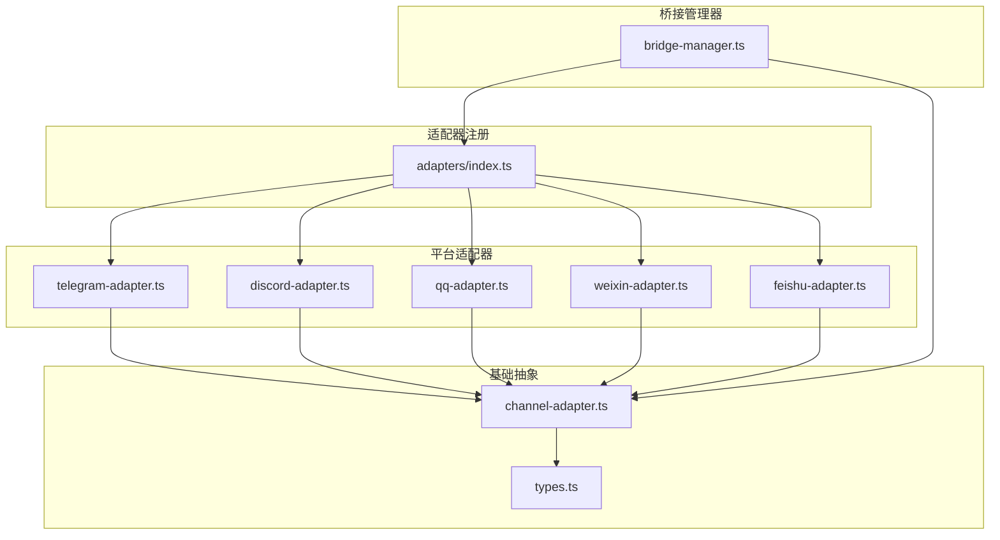
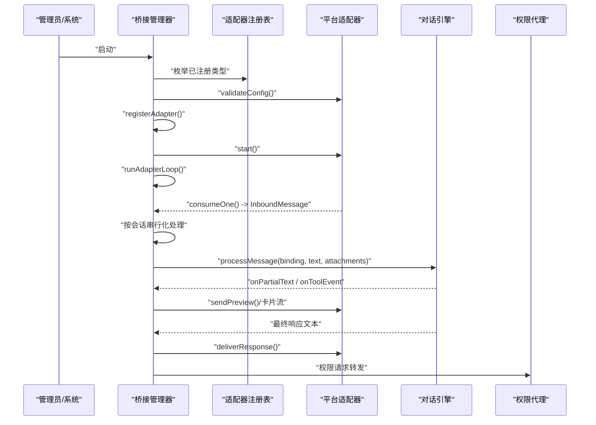
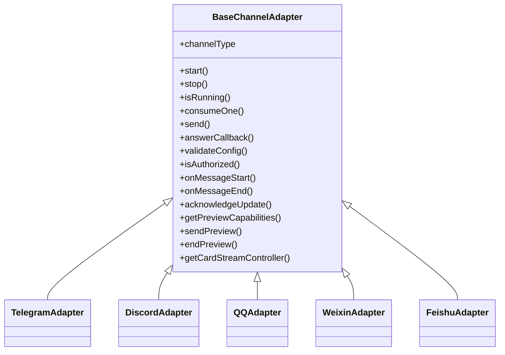
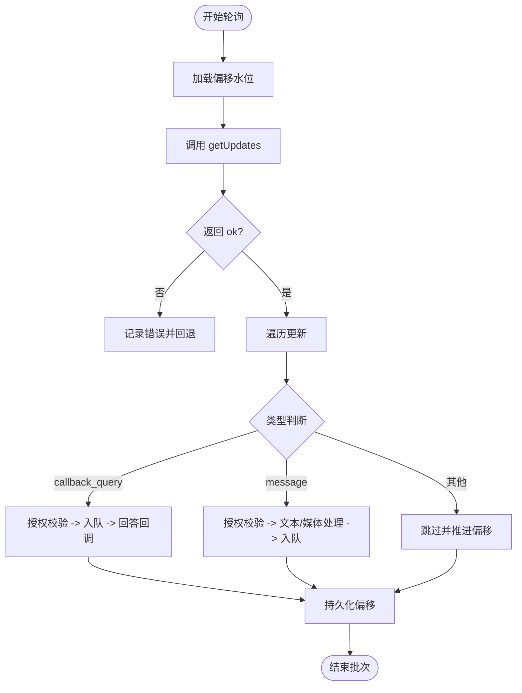
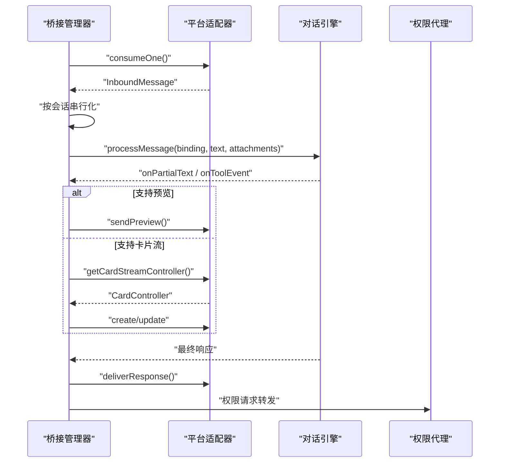
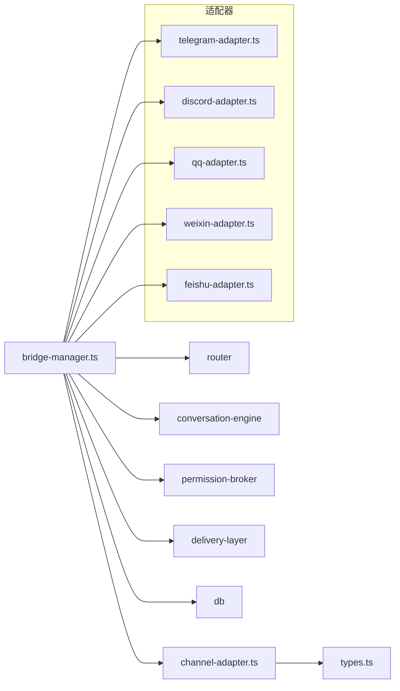

# 桥接管理

<cite>
**本文引用的文件**
- [src/lib/bridge/adapters/index.ts](file://src/lib/bridge/adapters/index.ts)
- [src/lib/bridge/adapters/telegram-adapter.ts](file://src/lib/bridge/adapters/telegram-adapter.ts)
- [src/lib/bridge/adapters/discord-adapter.ts](file://src/lib/bridge/adapters/discord-adapter.ts)
- [src/lib/bridge/adapters/qq-adapter.ts](file://src/lib/bridge/adapters/qq-adapter.ts)
- [src/lib/bridge/adapters/weixin-adapter.ts](file://src/lib/bridge/adapters/weixin-adapter.ts)
- [src/lib/bridge/adapters/feishu-adapter.ts](file://src/lib/bridge/adapters/feishu-adapter.ts)
- [src/lib/bridge/channel-adapter.ts](file://src/lib/bridge/channel-adapter.ts)
- [src/lib/bridge/types.ts](file://src/lib/bridge/types.ts)
- [src/lib/bridge/bridge-manager.ts](file://src/lib/bridge/bridge-manager.ts)
</cite>

## 目录
1. [简介](#简介)
2. [项目结构](#项目结构)
3. [核心组件](#核心组件)
4. [架构总览](#架构总览)
5. [详细组件分析](#详细组件分析)
6. [依赖关系分析](#依赖关系分析)
7. [性能考量](#性能考量)
8. [故障排查指南](#故障排查指南)
9. [结论](#结论)
10. [附录](#附录)

## 简介
本文件面向“桥接管理系统”，系统性阐述如何统一管理多个即时通讯平台（Telegram、Discord、QQ、微信、飞书）的桥接配置与运行状态，覆盖连接管理、状态监控、错误处理、权限控制、消息流与预览、并发与会话隔离、以及安全与访问控制策略。文档同时给出配置导入导出、批量操作与性能监控指标的实践建议，并提供维护与优化指南。

## 项目结构
桥接系统采用“适配器模式 + 管理器协调”的分层设计：
- 适配器层：各平台适配器实现统一接口，负责平台特定的消息消费、发送与回调处理。
- 管理器层：桥接管理器负责生命周期编排、消息路由、并发控制、预览与卡片流、权限转发等。
- 类型与注册：统一类型定义与适配器注册表，便于扩展新平台。

**图表来源**
- [src/lib/bridge/bridge-manager.ts:1-120](file://src/lib/bridge/bridge-manager.ts#L1-L120)
- [src/lib/bridge/adapters/index.ts:1-17](file://src/lib/bridge/adapters/index.ts#L1-L17)
- [src/lib/bridge/channel-adapter.ts:1-123](file://src/lib/bridge/channel-adapter.ts#L1-L123)
- [src/lib/bridge/types.ts:1-180](file://src/lib/bridge/types.ts#L1-L180)

**章节来源**
- [src/lib/bridge/adapters/index.ts:1-17](file://src/lib/bridge/adapters/index.ts#L1-L17)
- [src/lib/bridge/channel-adapter.ts:1-123](file://src/lib/bridge/channel-adapter.ts#L1-L123)
- [src/lib/bridge/types.ts:1-180](file://src/lib/bridge/types.ts#L1-L180)

## 核心组件
- 适配器基类：定义统一生命周期、消息队列、发送、授权校验、预览能力等抽象。
- 平台适配器：分别实现 Telegram、Discord、QQ、微信、飞书的长轮询/网关、鉴权、媒体下载、回调处理等。
- 桥接管理器：启动/停止、自动启动、状态聚合、消息路由、并发控制、预览/卡片流、权限转发、审计日志。
- 类型与常量：统一消息、绑定、状态、限流参数等。

关键职责与边界：
- 配置与自注册：通过适配器目录的 side-effect 导入完成注册；新增平台仅需创建适配器并在此注册。
- 生命周期：管理器统一调度各适配器的 start/stop，确保幂等与优雅关闭。
- 并发与会话隔离：按会话串行化处理，不同会话并发执行，避免竞态。
- 预览与卡片流：根据平台能力选择预览草稿或卡片流，支持节流与降级。
- 安全与审计：输入清洗、长度限制、超时与重试、审计日志记录。

**章节来源**
- [src/lib/bridge/channel-adapter.ts:16-123](file://src/lib/bridge/channel-adapter.ts#L16-L123)
- [src/lib/bridge/bridge-manager.ts:253-508](file://src/lib/bridge/bridge-manager.ts#L253-L508)
- [src/lib/bridge/types.ts:109-180](file://src/lib/bridge/types.ts#L109-L180)

## 架构总览
桥接系统以“管理器为中心”的事件驱动架构：
- 启动阶段：读取全局开关与各平台开关，逐个验证配置并通过注册表创建适配器，启动消费循环。
- 运行阶段：适配器持续消费平台消息，管理器按会话串行化处理，转发到对话引擎，再按平台格式渲染输出。
- 停止阶段：中止所有任务与消费循环，停止适配器，恢复通知机器人轮询。

**图表来源**
- [src/lib/bridge/bridge-manager.ts:263-508](file://src/lib/bridge/bridge-manager.ts#L263-L508)
- [src/lib/bridge/adapters/index.ts:12-16](file://src/lib/bridge/adapters/index.ts#L12-L16)

**章节来源**
- [src/lib/bridge/bridge-manager.ts:263-508](file://src/lib/bridge/bridge-manager.ts#L263-L508)

## 详细组件分析

### 适配器基类与注册
- 抽象接口：生命周期、消息队列、发送、授权、预览/卡片能力、回调处理等。
- 注册表：集中注册与工厂创建，新增平台只需在注册入口添加 side-effect 导入。

**图表来源**
- [src/lib/bridge/channel-adapter.ts:16-123](file://src/lib/bridge/channel-adapter.ts#L16-L123)
- [src/lib/bridge/adapters/telegram-adapter.ts:74-159](file://src/lib/bridge/adapters/telegram-adapter.ts#L74-L159)
- [src/lib/bridge/adapters/discord-adapter.ts:55-171](file://src/lib/bridge/adapters/discord-adapter.ts#L55-L171)
- [src/lib/bridge/adapters/qq-adapter.ts:61-121](file://src/lib/bridge/adapters/qq-adapter.ts#L61-L121)
- [src/lib/bridge/adapters/weixin-adapter.ts:45-111](file://src/lib/bridge/adapters/weixin-adapter.ts#L45-L111)
- [src/lib/bridge/adapters/feishu-adapter.ts:9-16](file://src/lib/bridge/adapters/feishu-adapter.ts#L9-L16)

**章节来源**
- [src/lib/bridge/channel-adapter.ts:16-123](file://src/lib/bridge/channel-adapter.ts#L16-L123)
- [src/lib/bridge/adapters/index.ts:12-16](file://src/lib/bridge/adapters/index.ts#L12-L16)

### Telegram 适配器
- 消费方式：长轮询 + 偏移水位（offset）持久化，重启后基于 bot 用户 ID 迁移偏移键。
- 授权：支持白名单用户/聊天或通知机器人聊天 ID。
- 预览：支持草稿预览，遇到永久失败（如方法不存在）进行降级。
- 媒体：相册去抖、图片下载、附件转码与审计日志。
- 错误处理：网络异常、超时、429 限流等场景的回退与重试。

**图表来源**
- [src/lib/bridge/adapters/telegram-adapter.ts:459-619](file://src/lib/bridge/adapters/telegram-adapter.ts#L459-L619)

**章节来源**
- [src/lib/bridge/adapters/telegram-adapter.ts:74-159](file://src/lib/bridge/adapters/telegram-adapter.ts#L74-L159)
- [src/lib/bridge/adapters/telegram-adapter.ts:459-619](file://src/lib/bridge/adapters/telegram-adapter.ts#L459-L619)

### Discord 适配器
- 消费方式：discord.js 客户端，启用必要意图，事件驱动消费。
- 授权：支持用户白名单与频道白名单，群组模式可要求 @ 提及。
- 预览：编辑已有消息实现预览草稿，遇到 403/404 永久降级。
- 媒体：附件下载与大小限制，HTML 转 Discord Markdown。
- 错误处理：动态引入避免打包问题，交互超时处理与清理。

**章节来源**
- [src/lib/bridge/adapters/discord-adapter.ts:55-171](file://src/lib/bridge/adapters/discord-adapter.ts#L55-L171)
- [src/lib/bridge/adapters/discord-adapter.ts:406-659](file://src/lib/bridge/adapters/discord-adapter.ts#L406-L659)

### QQ 适配器
- 消费方式：WebSocket 网关，心跳与断线重连，支持 RESUME。
- 授权：基于用户白名单。
- 媒体：私聊图片下载，大小限制与错误反馈。
- 错误处理：指数退避重连、会话无效识别与重新鉴权。

**章节来源**
- [src/lib/bridge/adapters/qq-adapter.ts:61-121](file://src/lib/bridge/adapters/qq-adapter.ts#L61-L121)
- [src/lib/bridge/adapters/qq-adapter.ts:251-486](file://src/lib/bridge/adapters/qq-adapter.ts#L251-L486)

### 微信（WeChat）适配器
- 消费方式：多账号长轮询，每账号独立工作线程，游标（cursor）持久化。
- 授权：合成 chatId，按账号维度授权。
- 预览：不支持预览，纯文本输出。
- 媒体：消息项媒体下载，上下文 token 维护。
- 错误处理：会话过期暂停、连续失败指数退避、批内事务式游标提交。

**章节来源**
- [src/lib/bridge/adapters/weixin-adapter.ts:45-111](file://src/lib/bridge/adapters/weixin-adapter.ts#L45-L111)
- [src/lib/bridge/adapters/weixin-adapter.ts:262-368](file://src/lib/bridge/adapters/weixin-adapter.ts#L262-L368)
- [src/lib/bridge/adapters/weixin-adapter.ts:370-521](file://src/lib/bridge/adapters/weixin-adapter.ts#L370-L521)

### 飞书适配器
- 实现：作为插件适配器的薄封装，实际逻辑由飞书通道插件提供，保持注册一致性。
- 作用：维持现有注册模式，便于管理器统一创建与调度。

**章节来源**
- [src/lib/bridge/adapters/feishu-adapter.ts:1-17](file://src/lib/bridge/adapters/feishu-adapter.ts#L1-L17)

### 桥接管理器
- 启停与自动启动：读取开关，逐个验证配置并启动，失败原因汇总；支持自动启动与重启。
- 状态聚合：运行状态、启动时间、各适配器最后消息时间与错误。
- 并发控制：按会话串行化，不同会话并发；任务可被 /stop 中止。
- 预览与卡片流：根据平台能力选择草稿预览或卡片流，支持节流与降级。
- 权限转发：将权限请求转发至 IM，支持按钮回调确认。
- 渲染与分块：按平台格式与长度限制进行渲染与分块发送。

**图表来源**
- [src/lib/bridge/bridge-manager.ts:513-800](file://src/lib/bridge/bridge-manager.ts#L513-L800)

**章节来源**
- [src/lib/bridge/bridge-manager.ts:263-508](file://src/lib/bridge/bridge-manager.ts#L263-L508)
- [src/lib/bridge/bridge-manager.ts:513-800](file://src/lib/bridge/bridge-manager.ts#L513-L800)

## 依赖关系分析
- 适配器注册：通过适配器目录的 side-effect 导入触发自注册，新增平台无需修改管理器。
- 管理器依赖：统一依赖适配器抽象、路由、对话引擎、权限代理、交付层与数据库工具。
- 平台差异：各适配器对平台 API 的封装与错误处理策略不同，但对外暴露一致接口。

**图表来源**
- [src/lib/bridge/bridge-manager.ts:10-34](file://src/lib/bridge/bridge-manager.ts#L10-L34)
- [src/lib/bridge/adapters/index.ts:12-16](file://src/lib/bridge/adapters/index.ts#L12-L16)

**章节来源**
- [src/lib/bridge/bridge-manager.ts:10-34](file://src/lib/bridge/bridge-manager.ts#L10-L34)
- [src/lib/bridge/adapters/index.ts:12-16](file://src/lib/bridge/adapters/index.ts#L12-L16)

## 性能考量
- 并发模型：按会话串行化，不同会话并发，避免同一会话内的资源竞争。
- 预览节流：按平台定制间隔与最小增量字符，降低 API 调用频率。
- 分块发送：按平台最大长度限制进行分块，避免超限失败与重试风暴。
- 媒体处理：异步下载与缓冲，失败时直接反馈给用户，避免阻塞主流程。
- 重试与退避：平台限流与网络异常采用指数退避，避免雪崩。
- 偏移/游标：持久化推进，崩溃后不重复消费，减少无效拉取。

[本节为通用指导，无需具体文件分析]

## 故障排查指南
- 启动失败
  - 检查全局开关与平台开关是否开启。
  - 查看适配器配置校验结果与错误汇总。
  - 若无适配器成功启动，检查配置错误列表。
- 连接异常
  - Telegram：检查 bot token、getMe 成功迁移偏移键；关注 429 与网络超时。
  - Discord：确认意图与权限、@ 提及策略、动态引入依赖是否正常。
  - QQ：关注 WebSocket 心跳、断线重连次数与 INVALID_SESSION 处理。
  - 微信：关注会话过期（暂停）、游标推进与批内事务提交。
- 权限与授权
  - 检查平台侧白名单设置与管理器授权逻辑。
  - 飞书通过插件适配器处理，确认插件可用。
- 预览与卡片流
  - 预览失败：检查平台能力与降级策略；卡片流：确认控制器可用与消息 ID 生命周期。
- 审计与日志
  - 使用审计日志定位消息去向与截断情况；结合管理器状态查看最后错误与时间。

**章节来源**
- [src/lib/bridge/bridge-manager.ts:263-337](file://src/lib/bridge/bridge-manager.ts#L263-L337)
- [src/lib/bridge/adapters/telegram-adapter.ts:459-619](file://src/lib/bridge/adapters/telegram-adapter.ts#L459-L619)
- [src/lib/bridge/adapters/discord-adapter.ts:406-659](file://src/lib/bridge/adapters/discord-adapter.ts#L406-L659)
- [src/lib/bridge/adapters/qq-adapter.ts:251-486](file://src/lib/bridge/adapters/qq-adapter.ts#L251-L486)
- [src/lib/bridge/adapters/weixin-adapter.ts:272-368](file://src/lib/bridge/adapters/weixin-adapter.ts#L272-L368)

## 结论
该桥接系统通过统一的适配器抽象与管理器编排，实现了多平台即时通讯的统一接入与治理。其特性包括：
- 可扩展的平台适配器注册机制；
- 严谨的生命周期与幂等控制；
- 会话级并发与平台级预览/卡片流；
- 完善的错误处理与降级策略；
- 强化的安全与审计能力。

建议在生产环境中配合完善的监控与告警体系，持续优化预览节流参数与分块策略，确保跨平台体验的一致性与稳定性。

[本节为总结，无需具体文件分析]

## 附录

### 桥接配置导入导出与批量操作建议
- 配置导入导出
  - 利用设置存储与数据库工具，将各平台 token、白名单、开关等序列化为配置包，支持版本化与回滚。
  - 批量导入：按平台类型与开关批量写入，校验通过后再启用。
- 批量操作
  - 通过管理器的自动启动与重启能力，实现配置变更后的平滑生效。
  - 对于大规模平台实例，建议分批启动并观察状态，逐步放量。

[本节为通用指导，无需具体文件分析]

### 桥接系统维护指南
- 日常巡检
  - 检查管理器状态与各适配器运行状态、最后消息时间与错误。
  - 关注平台限流与退避策略，避免集中触发。
- 升级与变更
  - 新增平台：创建适配器并在注册入口添加 side-effect 导入。
  - 配置变更：使用重启流程使新配置生效。
- 备份与恢复
  - 偏移/游标与审计日志定期备份，用于故障恢复与溯源。

[本节为通用指导，无需具体文件分析]

### 安全配置与访问控制策略
- 输入安全
  - 管理器对输入进行清洗与截断，记录审计日志。
- 授权策略
  - 平台侧白名单优先，管理器侧默认拒绝（默认安全）。
  - Discord 支持群组 @ 提及策略；Telegram/微信/飞书支持用户/聊天白名单。
- 传输与凭证
  - 凭证存储与访问控制遵循最小权限原则；定期轮换 token。
- 审计与合规
  - 审计日志保留与检索策略，满足合规要求。

**章节来源**
- [src/lib/bridge/bridge-manager.ts:586-597](file://src/lib/bridge/bridge-manager.ts#L586-L597)
- [src/lib/bridge/adapters/discord-adapter.ts:381-402](file://src/lib/bridge/adapters/discord-adapter.ts#L381-L402)
- [src/lib/bridge/adapters/telegram-adapter.ts:230-248](file://src/lib/bridge/adapters/telegram-adapter.ts#L230-L248)
- [src/lib/bridge/adapters/weixin-adapter.ts:250-258](file://src/lib/bridge/adapters/weixin-adapter.ts#L250-L258)