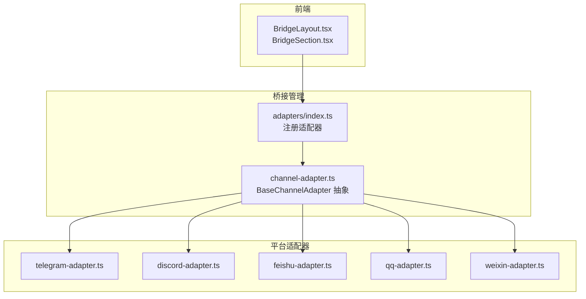
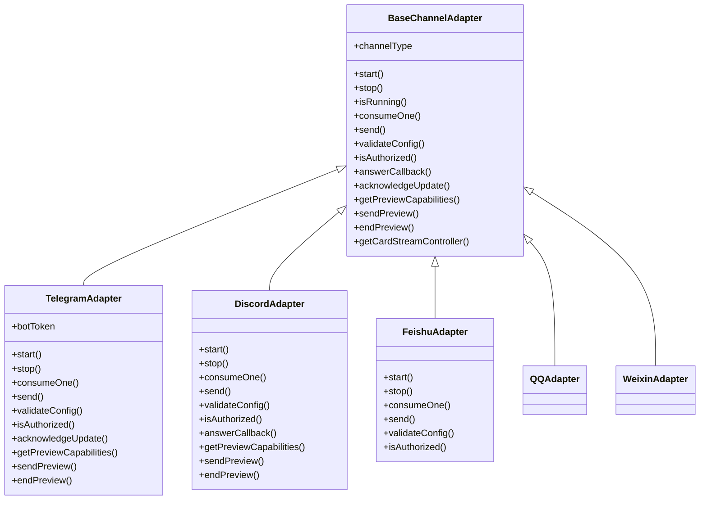
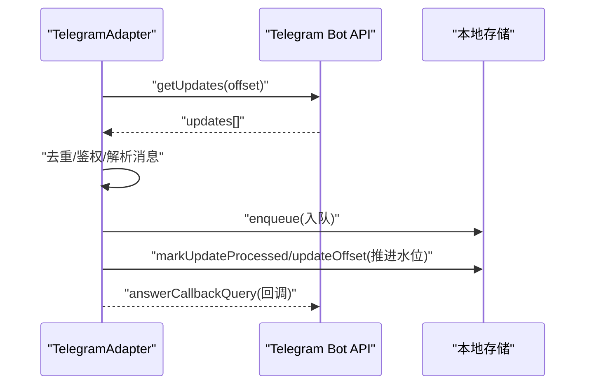
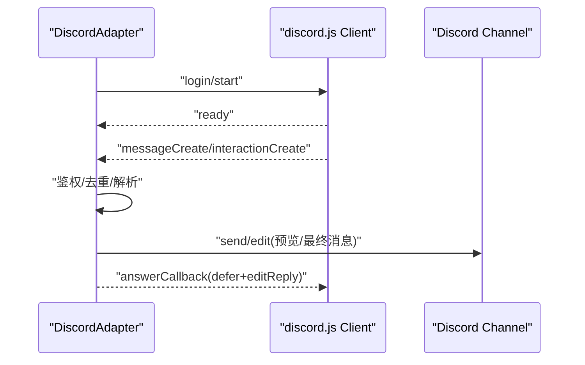
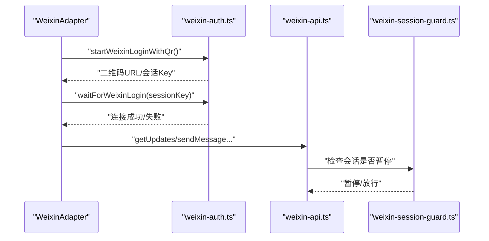
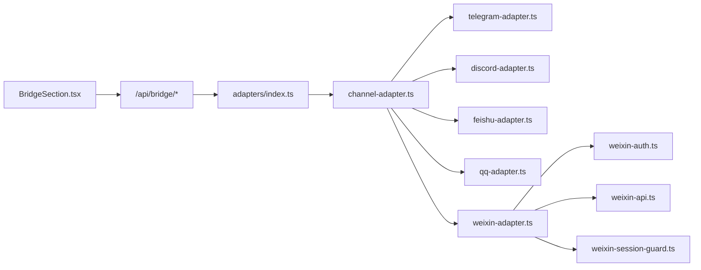

# 远程桥接系统

<cite>
**本文引用的文件**
- [src/app/bridge/page.tsx](file://src/app/bridge/page.tsx)
- [src/components/bridge/BridgeLayout.tsx](file://src/components/bridge/BridgeLayout.tsx)
- [src/components/bridge/BridgeSection.tsx](file://src/components/bridge/BridgeSection.tsx)
- [src/lib/bridge/adapters/index.ts](file://src/lib/bridge/adapters/index.ts)
- [src/lib/bridge/channel-adapter.ts](file://src/lib/bridge/channel-adapter.ts)
- [src/lib/bridge/adapters/telegram-adapter.ts](file://src/lib/bridge/adapters/telegram-adapter.ts)
- [src/lib/bridge/adapters/discord-adapter.ts](file://src/lib/bridge/adapters/discord-adapter.ts)
- [src/lib/bridge/adapters/feishu-adapter.ts](file://src/lib/bridge/adapters/feishu-adapter.ts)
- [src/lib/bridge/adapters/weixin-adapter.ts](file://src/lib/bridge/adapters/weixin-adapter.ts)
- [src/lib/bridge/adapters/weixin/weixin-auth.ts](file://src/lib/bridge/adapters/weixin/weixin-auth.ts)
- [src/lib/bridge/adapters/weixin/weixin-api.ts](file://src/lib/bridge/adapters/weixin/weixin-api.ts)
- [src/lib/bridge/adapters/weixin/weixin-session-guard.ts](file://src/lib/bridge/adapters/weixin/weixin-session-guard.ts)
- [src/lib/bridge/adapters/qq-adapter.ts](file://src/lib/bridge/adapters/qq-adapter.ts)
- [资料/weixin-openclaw-package/README.zh_CN.md](file://资料/weixin-openclaw-package/README.zh_CN.md)
- [资料/weixin-openclaw-package/package/src/auth/login-qr.ts](file://资料/weixin-openclaw-package/package/src/auth/login-qr.ts)
- [资料/weixin-openclaw-package/package/src/api/session-guard.ts](file://资料/weixin-openclaw-package/package/src/api/session-guard.ts)
</cite>

## 目录
1. [简介](#简介)
2. [项目结构](#项目结构)
3. [核心组件](#核心组件)
4. [架构总览](#架构总览)
5. [详细组件分析](#详细组件分析)
6. [依赖关系分析](#依赖关系分析)
7. [性能考量](#性能考量)
8. [故障排除指南](#故障排除指南)
9. [结论](#结论)
10. [附录](#附录)

## 简介
本文件面向 CodePilot 的远程桥接系统，系统允许通过多种即时通讯渠道（Telegram、飞书、Discord、QQ、微信）远程控制本地桌面应用。文档涵盖桥接适配器的工作原理、消息路由机制、权限管理策略，并提供各渠道的配置步骤、API 密钥获取与机器人创建流程、故障排除与安全最佳实践。

## 项目结构
桥接系统由“前端设置界面 + 后端桥接管理 + 多平台适配器”三层组成：
- 前端设置页面：提供开关、默认工作目录与模型、自动启动、适配器状态查看等。
- 适配器注册与基类：统一抽象不同平台的消息收发与鉴权逻辑。
- 平台适配器：分别实现 Telegram、Discord、飞书、QQ、微信的接入细节。

图表来源
- [src/components/bridge/BridgeLayout.tsx:1-110](file://src/components/bridge/BridgeLayout.tsx#L1-L110)
- [src/components/bridge/BridgeSection.tsx:1-510](file://src/components/bridge/BridgeSection.tsx#L1-L510)
- [src/lib/bridge/adapters/index.ts:1-17](file://src/lib/bridge/adapters/index.ts#L1-L17)
- [src/lib/bridge/channel-adapter.ts:1-123](file://src/lib/bridge/channel-adapter.ts#L1-L123)
- [src/lib/bridge/adapters/telegram-adapter.ts:1-867](file://src/lib/bridge/adapters/telegram-adapter.ts#L1-L867)
- [src/lib/bridge/adapters/discord-adapter.ts:1-663](file://src/lib/bridge/adapters/discord-adapter.ts#L1-L663)
- [src/lib/bridge/adapters/feishu-adapter.ts:1-17](file://src/lib/bridge/adapters/feishu-adapter.ts#L1-L17)
- [src/lib/bridge/adapters/qq-adapter.ts](file://src/lib/bridge/adapters/qq-adapter.ts)
- [src/lib/bridge/adapters/weixin-adapter.ts](file://src/lib/bridge/adapters/weixin-adapter.ts)

章节来源
- [src/app/bridge/page.tsx:1-20](file://src/app/bridge/page.tsx#L1-L20)
- [src/components/bridge/BridgeLayout.tsx:1-110](file://src/components/bridge/BridgeLayout.tsx#L1-L110)
- [src/components/bridge/BridgeSection.tsx:1-510](file://src/components/bridge/BridgeSection.tsx#L1-L510)
- [src/lib/bridge/adapters/index.ts:1-17](file://src/lib/bridge/adapters/index.ts#L1-L17)
- [src/lib/bridge/channel-adapter.ts:1-123](file://src/lib/bridge/channel-adapter.ts#L1-L123)

## 核心组件
- 适配器基类 BaseChannelAdapter：定义统一接口（启动/停止、消费/发送、鉴权、预览能力、回调处理等），并提供注册表工厂方法。
- 适配器注册入口：adapters/index.ts 通过“副作用导入”触发各平台适配器自注册，便于桥接管理器按类型创建实例。
- 平台适配器：
  - Telegram：长轮询拉取更新，去重与偏移水位持久化，媒体组合并与预览流式发送。
  - Discord：动态加载 discord.js，实时事件 + REST 发送，交互按钮应答与预览消息编辑。
  - 飞书：通过 ChannelPluginAdapter 将实际实现委托给 FeishuChannelPlugin。
  - QQ：适配器文件存在，具体实现位于对应模块。
  - 微信：通过 weixin-adapter.ts 注册，配合 weixin-auth.ts、weixin-api.ts、weixin-session-guard.ts 实现登录、消息与会话保护。

章节来源
- [src/lib/bridge/channel-adapter.ts:1-123](file://src/lib/bridge/channel-adapter.ts#L1-L123)
- [src/lib/bridge/adapters/index.ts:1-17](file://src/lib/bridge/adapters/index.ts#L1-L17)
- [src/lib/bridge/adapters/telegram-adapter.ts:1-867](file://src/lib/bridge/adapters/telegram-adapter.ts#L1-L867)
- [src/lib/bridge/adapters/discord-adapter.ts:1-663](file://src/lib/bridge/adapters/discord-adapter.ts#L1-L663)
- [src/lib/bridge/adapters/feishu-adapter.ts:1-17](file://src/lib/bridge/adapters/feishu-adapter.ts#L1-L17)
- [src/lib/bridge/adapters/qq-adapter.ts](file://src/lib/bridge/adapters/qq-adapter.ts)
- [src/lib/bridge/adapters/weixin-adapter.ts](file://src/lib/bridge/adapters/weixin-adapter.ts)

## 架构总览
桥接系统采用“前端设置 + 适配器注册 + 平台适配器”的分层设计。前端负责展示与控制，适配器注册表负责实例化，平台适配器负责与各自平台 API 交互。

图表来源
- [src/lib/bridge/channel-adapter.ts:1-123](file://src/lib/bridge/channel-adapter.ts#L1-L123)
- [src/lib/bridge/adapters/telegram-adapter.ts:1-867](file://src/lib/bridge/adapters/telegram-adapter.ts#L1-L867)
- [src/lib/bridge/adapters/discord-adapter.ts:1-663](file://src/lib/bridge/adapters/discord-adapter.ts#L1-L663)
- [src/lib/bridge/adapters/feishu-adapter.ts:1-17](file://src/lib/bridge/adapters/feishu-adapter.ts#L1-L17)
- [src/lib/bridge/adapters/qq-adapter.ts](file://src/lib/bridge/adapters/qq-adapter.ts)
- [src/lib/bridge/adapters/weixin-adapter.ts](file://src/lib/bridge/adapters/weixin-adapter.ts)

## 详细组件分析

### 适配器注册与基类
- 适配器注册：adapters/index.ts 通过导入各平台适配器文件触发自注册；桥接管理器通过工厂方法按类型创建实例。
- 基类职责：统一生命周期、消息队列、鉴权、预览能力与回调处理；各平台适配器覆盖平台特定实现。

章节来源
- [src/lib/bridge/adapters/index.ts:1-17](file://src/lib/bridge/adapters/index.ts#L1-L17)
- [src/lib/bridge/channel-adapter.ts:1-123](file://src/lib/bridge/channel-adapter.ts#L1-L123)

### Telegram 适配器
- 消息消费：长轮询 getUpdates，基于 bot 用户 ID 或 token 哈希确定偏移键，持久化 committedOffset，避免重启重复消费。
- 去重与幂等：维护 recentUpdateIds 集合，限制容量，连续推进水位。
- 媒体处理：单图与媒体组（album）合并，下载图片并注入附件；失败时直接通知用户。
- 预览流式：支持 sendMessageDraft，按聊天维度降级与退化处理。
- 鉴权：支持白名单用户/聊天，或回退到通知聊天 ID。

图表来源
- [src/lib/bridge/adapters/telegram-adapter.ts:459-619](file://src/lib/bridge/adapters/telegram-adapter.ts#L459-L619)
- [src/lib/bridge/adapters/telegram-adapter.ts:428-457](file://src/lib/bridge/adapters/telegram-adapter.ts#L428-L457)

章节来源
- [src/lib/bridge/adapters/telegram-adapter.ts:1-867](file://src/lib/bridge/adapters/telegram-adapter.ts#L1-L867)

### Discord 适配器
- 动态加载：通过动态 import 避免构建期解析原生模块；初始化 Client 并监听 messageCreate/interactionCreate。
- 事件处理：过滤机器人消息，@提及校验（可选），附件下载（限制大小），预览消息编辑。
- 回调处理：交互按钮立即 defer，延后应答，带过期清理。
- 预览能力：按聊天维度支持编辑预览消息，失败时降级。

图表来源
- [src/lib/bridge/adapters/discord-adapter.ts:76-132](file://src/lib/bridge/adapters/discord-adapter.ts#L76-L132)
- [src/lib/bridge/adapters/discord-adapter.ts:407-416](file://src/lib/bridge/adapters/discord-adapter.ts#L407-L416)
- [src/lib/bridge/adapters/discord-adapter.ts:571-614](file://src/lib/bridge/adapters/discord-adapter.ts#L571-L614)

章节来源
- [src/lib/bridge/adapters/discord-adapter.ts:1-663](file://src/lib/bridge/adapters/discord-adapter.ts#L1-L663)

### 飞书适配器
- 代理模式：通过 ChannelPluginAdapter 将功能委托给 FeishuChannelPlugin，保持适配器注册一致性。

章节来源
- [src/lib/bridge/adapters/feishu-adapter.ts:1-17](file://src/lib/bridge/adapters/feishu-adapter.ts#L1-L17)

### QQ 适配器
- 适配器文件存在，具体实现位于对应模块。注册方式遵循统一适配器模式。

章节来源
- [src/lib/bridge/adapters/qq-adapter.ts](file://src/lib/bridge/adapters/qq-adapter.ts)

### 微信适配器与登录流程
- 登录流程：通过 weixin-auth.ts 提供二维码获取与轮询状态，确认后保存账号信息并触发通道重载。
- 会话保护：weixin-session-guard.ts 在会话过期时暂停后续请求，防止频繁失败。
- API 文档：weixin-api.ts 对接 ilink 协议（长轮询、发送消息、上传等），README.zh_CN.md 提供接口规范与请求头说明。

图表来源
- [src/lib/bridge/adapters/weixin-adapter.ts](file://src/lib/bridge/adapters/weixin-adapter.ts)
- [src/lib/bridge/adapters/weixin/weixin-auth.ts](file://src/lib/bridge/adapters/weixin/weixin-auth.ts)
- [src/lib/bridge/adapters/weixin/weixin-api.ts](file://src/lib/bridge/adapters/weixin/weixin-api.ts)
- [src/lib/bridge/adapters/weixin/weixin-session-guard.ts](file://src/lib/bridge/adapters/weixin/weixin-session-guard.ts)

章节来源
- [src/lib/bridge/adapters/weixin-adapter.ts](file://src/lib/bridge/adapters/weixin-adapter.ts)
- [src/lib/bridge/adapters/weixin/weixin-auth.ts:126-333](file://src/lib/bridge/adapters/weixin/weixin-auth.ts#L126-L333)
- [src/lib/bridge/adapters/weixin/weixin-session-guard.ts:1-41](file://src/lib/bridge/adapters/weixin/weixin-session-guard.ts#L1-L41)
- [资料/weixin-openclaw-package/README.zh_CN.md:69-126](file://资料/weixin-openclaw-package/README.zh_CN.md#L69-L126)

## 依赖关系分析
- 组件耦合：前端设置页依赖桥接状态钩子与后端 API；适配器注册表解耦平台差异；平台适配器依赖各自平台 SDK 或 API。
- 外部依赖：Discord 通过 discord.js；Telegram 使用官方 Bot API；微信通过 ilink 协议；飞书通过插件适配器。
- 可能的循环依赖：适配器注册通过副作用导入，避免在注册表中显式引用适配器类，降低循环风险。

图表来源
- [src/components/bridge/BridgeSection.tsx:60-117](file://src/components/bridge/BridgeSection.tsx#L60-L117)
- [src/lib/bridge/adapters/index.ts:1-17](file://src/lib/bridge/adapters/index.ts#L1-L17)
- [src/lib/bridge/channel-adapter.ts:1-123](file://src/lib/bridge/channel-adapter.ts#L1-L123)
- [src/lib/bridge/adapters/telegram-adapter.ts:1-867](file://src/lib/bridge/adapters/telegram-adapter.ts#L1-L867)
- [src/lib/bridge/adapters/discord-adapter.ts:1-663](file://src/lib/bridge/adapters/discord-adapter.ts#L1-L663)
- [src/lib/bridge/adapters/feishu-adapter.ts:1-17](file://src/lib/bridge/adapters/feishu-adapter.ts#L1-L17)
- [src/lib/bridge/adapters/qq-adapter.ts](file://src/lib/bridge/adapters/qq-adapter.ts)
- [src/lib/bridge/adapters/weixin-adapter.ts](file://src/lib/bridge/adapters/weixin-adapter.ts)
- [src/lib/bridge/adapters/weixin/weixin-auth.ts:1-333](file://src/lib/bridge/adapters/weixin/weixin-auth.ts#L1-L333)
- [src/lib/bridge/adapters/weixin/weixin-api.ts](file://src/lib/bridge/adapters/weixin/weixin-api.ts)
- [src/lib/bridge/adapters/weixin/weixin-session-guard.ts:1-41](file://src/lib/bridge/adapters/weixin/weixin-session-guard.ts#L1-L41)

## 性能考量
- 长轮询与事件驱动：Telegram 使用长轮询，Discord 使用网关事件，均减少轮询开销。
- 去重与水位推进：Telegram 采用连续水位推进与去重集合，避免重复处理与内存膨胀。
- 预览流式：Telegram/ Discord 支持预览消息，提升交互体验；失败时降级或跳过，保证稳定性。
- 附件处理：Discord 限制附件大小；Telegram 下载图片后注入附件，失败时直接反馈。

[本节为通用性能讨论，无需列出章节来源]

## 故障排除指南
- 通用问题
  - 无法启动：检查各适配器 validateConfig 输出的配置错误；确保对应渠道开关已开启。
  - 无消息：确认鉴权配置（允许用户/聊天/群组）正确；检查 require_mention（Discord）等策略。
  - 预览失败：查看预览降级日志；调整预览开关或私聊策略。
- Telegram
  - 偏移丢失/重复：确认 getMe 解析 botUserId 成功，检查旧 token 哈希键到新 bot ID 键的迁移记录。
  - 图片处理失败：检查网络与磁盘空间；查看拒绝原因并提示用户。
- Discord
  - 403/404：预览消息编辑失败，进入降级；检查权限与频道可见性。
  - 交互超时：确认 deferUpdate 与 TTL 清理逻辑正常。
- 微信
  - 二维码过期：重新发起登录；注意会话有效期与轮询超时。
  - 会话过期：触发暂停冷却（一小时），等待冷却结束或重新登录。

章节来源
- [src/lib/bridge/adapters/telegram-adapter.ts:220-228](file://src/lib/bridge/adapters/telegram-adapter.ts#L220-L228)
- [src/lib/bridge/adapters/telegram-adapter.ts:428-457](file://src/lib/bridge/adapters/telegram-adapter.ts#L428-L457)
- [src/lib/bridge/adapters/discord-adapter.ts:313-355](file://src/lib/bridge/adapters/discord-adapter.ts#L313-L355)
- [src/lib/bridge/adapters/discord-adapter.ts:571-614](file://src/lib/bridge/adapters/discord-adapter.ts#L571-L614)
- [src/lib/bridge/adapters/weixin/weixin-auth.ts:191-333](file://src/lib/bridge/adapters/weixin/weixin-auth.ts#L191-L333)
- [src/lib/bridge/adapters/weixin/weixin-session-guard.ts:1-41](file://src/lib/bridge/adapters/weixin/weixin-session-guard.ts#L1-L41)

## 结论
CodePilot 的远程桥接系统通过统一的适配器基类与注册机制，将 Telegram、Discord、飞书、QQ、微信等多平台接入整合为一致的控制面。前端提供可视化配置与状态监控，平台适配器负责消息消费、鉴权与发送，结合预览流式与会话保护等特性，既保证易用性也兼顾稳定性与安全性。

[本节为总结性内容，无需列出章节来源]

## 附录

### 权限管理与鉴权策略
- Telegram：支持允许用户/聊天白名单，或回退到通知聊天 ID；回调查询同样鉴权。
- Discord：允许用户/频道白名单；群组策略支持 require_mention；默认拒绝空白名单。
- 飞书/QQ/微信：通过各自适配器的 isAuthorized 实现，结合配置项进行访问控制。

章节来源
- [src/lib/bridge/adapters/telegram-adapter.ts:230-248](file://src/lib/bridge/adapters/telegram-adapter.ts#L230-L248)
- [src/lib/bridge/adapters/discord-adapter.ts:381-402](file://src/lib/bridge/adapters/discord-adapter.ts#L381-L402)

### 配置与密钥获取（概要）
- Telegram
  - 获取 bot_token 并在设置中启用 telegram 渠道；配置允许用户/聊天白名单可选。
- Discord
  - 获取 bot token 并启用 discord 渠道；配置允许用户/频道白名单；可选 require_mention。
- 飞书
  - 通过安装与配置渠道插件，设置 appId/appSecret 等参数。
- QQ
  - 通过适配器配置项启用并设置必要参数。
- 微信
  - 使用 weixin-auth.ts 的登录流程获取 bot_token 与账号信息；保存后触发通道重载。

章节来源
- [src/lib/bridge/adapters/telegram-adapter.ts:220-228](file://src/lib/bridge/adapters/telegram-adapter.ts#L220-L228)
- [src/lib/bridge/adapters/discord-adapter.ts:371-379](file://src/lib/bridge/adapters/discord-adapter.ts#L371-L379)
- [src/lib/bridge/adapters/weixin/weixin-auth.ts:126-333](file://src/lib/bridge/adapters/weixin/weixin-auth.ts#L126-L333)