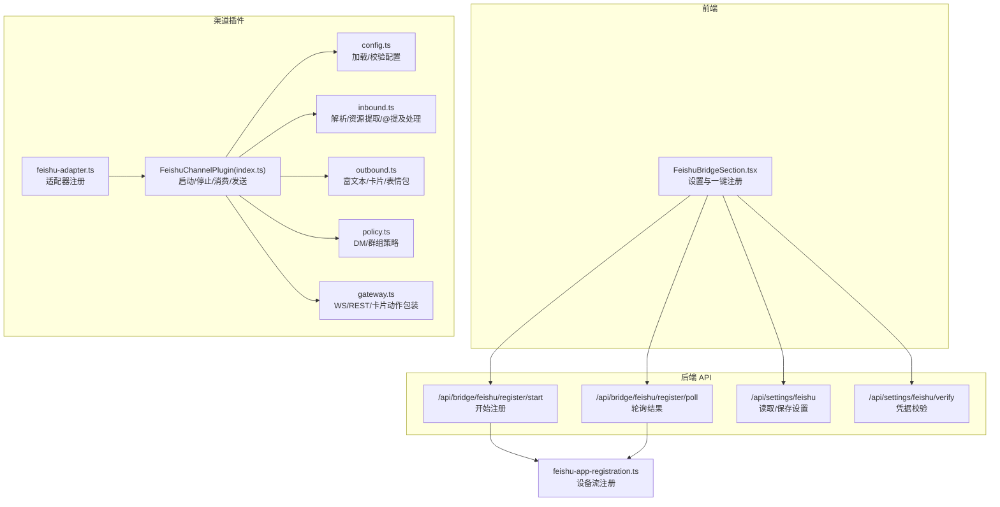
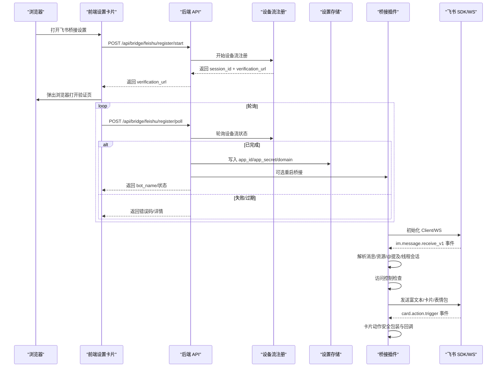
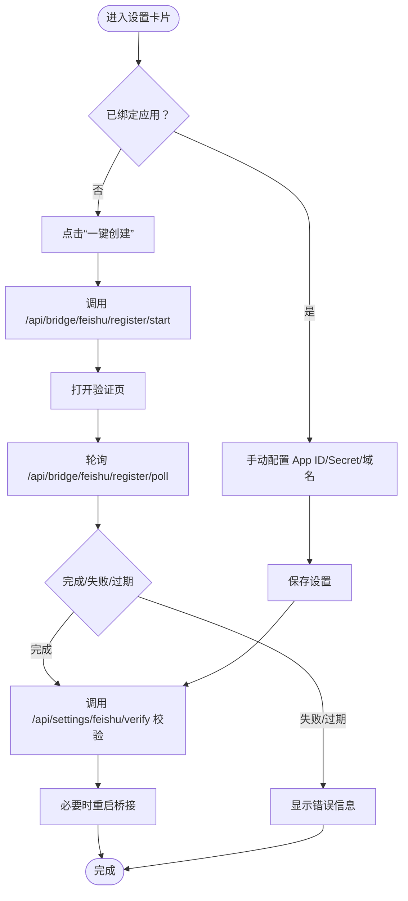
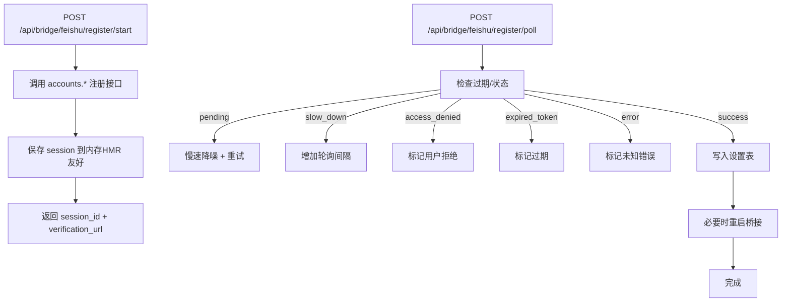
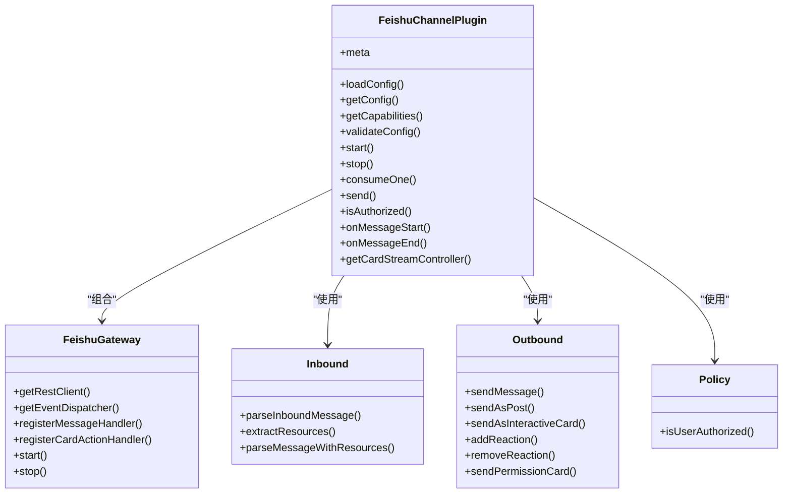
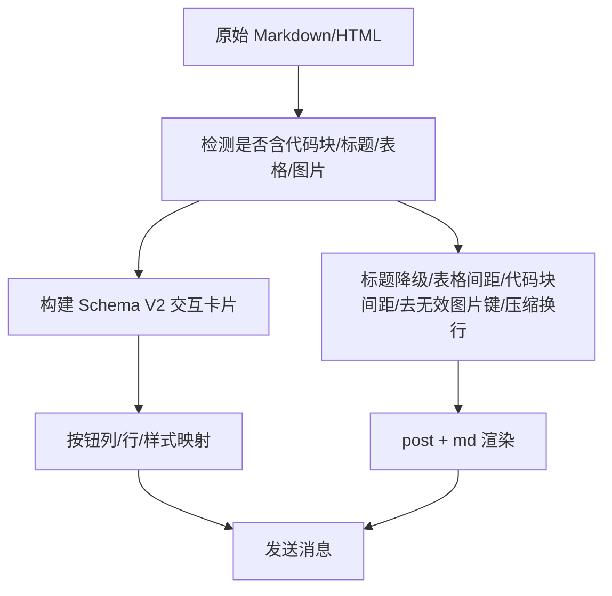
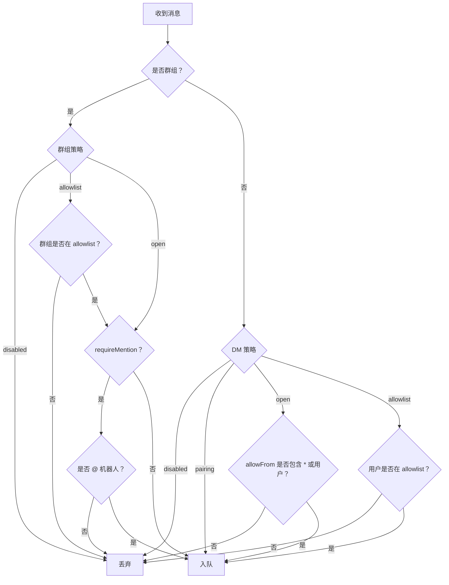
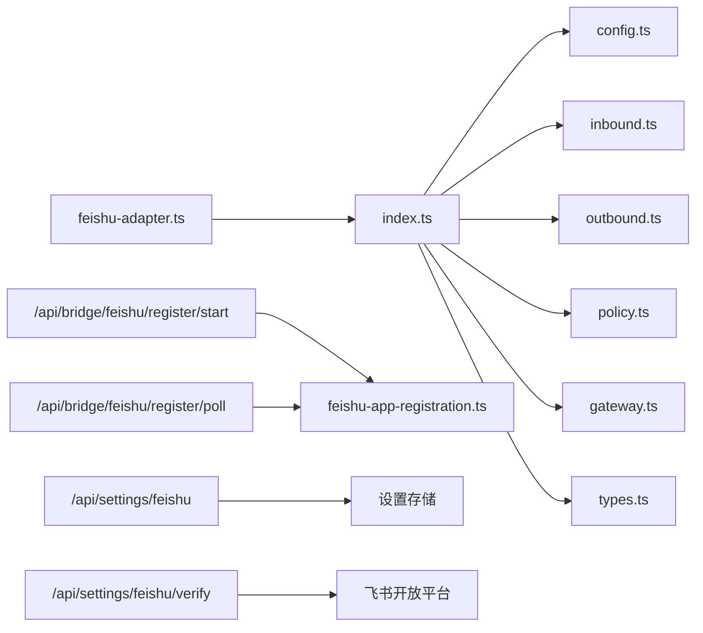

# 飞书桥接

<cite>
**本文引用的文件**
- [FeishuBridgeSection.tsx](file://src/components/bridge/FeishuBridgeSection.tsx)
- [feishu-adapter.ts](file://src/lib/bridge/adapters/feishu-adapter.ts)
- [feishu-app-registration.ts](file://src/lib/bridge/feishu-app-registration.ts)
- [index.ts](file://src/lib/channels/feishu/index.ts)
- [config.ts](file://src/lib/channels/feishu/config.ts)
- [inbound.ts](file://src/lib/channels/feishu/inbound.ts)
- [outbound.ts](file://src/lib/channels/feishu/outbound.ts)
- [policy.ts](file://src/lib/channels/feishu/policy.ts)
- [gateway.ts](file://src/lib/channels/feishu/gateway.ts)
- [types.ts](file://src/lib/channels/feishu/types.ts)
- [route.ts（注册开始）](file://src/app/api/bridge/feishu/register/start/route.ts)
- [route.ts（注册轮询）](file://src/app/api/bridge/feishu/register/poll/route.ts)
- [route.ts（设置读取/保存）](file://src/app/api/settings/feishu/route.ts)
- [route.ts（设置校验）](file://src/app/api/settings/feishu/verify/route.ts)
</cite>

## 目录
1. [简介](#简介)
2. [项目结构](#项目结构)
3. [核心组件](#核心组件)
4. [架构总览](#架构总览)
5. [详细组件分析](#详细组件分析)
6. [依赖关系分析](#依赖关系分析)
7. [性能与可靠性](#性能与可靠性)
8. [配置与使用指南](#配置与使用指南)
9. [API 使用示例](#api-使用示例)
10. [故障排除](#故障排除)
11. [结论](#结论)

## 简介
本文件面向在飞书/多鲸平台部署与使用 CodePilot 的工程团队，提供“飞书桥接”功能的完整说明。内容覆盖应用创建与配置、机器人权限策略、消息格式转换、用户认证与群组管理、API 使用与故障排除，并结合仓库中的实现细节，帮助你快速完成从零到一的桥接落地。

## 项目结构
飞书桥接由“前端配置界面 + 后端 API + 渠道插件 + SDK 网关 + 消息编解码与策略”五层组成：
- 前端：飞书桥接设置卡片，支持一键注册、手动配置、行为策略与验证
- 后端 API：设备流注册、轮询、设置读写、凭据校验
- 渠道插件：统一适配器、配置加载与校验、消息收发、卡片交互、资源下载
- SDK 网关：WebSocket 事件接入、卡片动作安全包装、REST 客户端
- 策略与编解码：访问控制、@提及检测、Markdown 优化、富文本卡片渲染

图表来源
- [FeishuBridgeSection.tsx:74-692](file://src/components/bridge/FeishuBridgeSection.tsx#L74-L692)
- [feishu-adapter.ts:1-17](file://src/lib/bridge/adapters/feishu-adapter.ts#L1-L17)
- [index.ts:39-457](file://src/lib/channels/feishu/index.ts#L39-L457)
- [config.ts:14-57](file://src/lib/channels/feishu/config.ts#L14-L57)
- [inbound.ts:65-156](file://src/lib/channels/feishu/inbound.ts#L65-L156)
- [outbound.ts:140-350](file://src/lib/channels/feishu/outbound.ts#L140-L350)
- [policy.ts:21-50](file://src/lib/channels/feishu/policy.ts#L21-L50)
- [gateway.ts:36-200](file://src/lib/channels/feishu/gateway.ts#L36-L200)
- [feishu-app-registration.ts:75-211](file://src/lib/bridge/feishu-app-registration.ts#L75-L211)
- [route.ts（注册开始）:11-21](file://src/app/api/bridge/feishu/register/start/route.ts#L11-L21)
- [route.ts（注册轮询）:40-96](file://src/app/api/bridge/feishu/register/poll/route.ts#L40-L96)
- [route.ts（设置读取/保存）:22-70](file://src/app/api/settings/feishu/route.ts#L22-L70)
- [route.ts（设置校验）:10-74](file://src/app/api/settings/feishu/verify/route.ts#L10-L74)

章节来源
- [FeishuBridgeSection.tsx:74-692](file://src/components/bridge/FeishuBridgeSection.tsx#L74-L692)
- [feishu-adapter.ts:1-17](file://src/lib/bridge/adapters/feishu-adapter.ts#L1-L17)
- [index.ts:39-457](file://src/lib/channels/feishu/index.ts#L39-L457)

## 核心组件
- 飞书桥接设置卡片：提供一键注册、手动配置、行为策略与验证入口
- 设备流注册：通过官方账户域发起设备流，自动写入凭据并可选重启桥接
- 渠道插件：统一适配器注册；加载配置；接入 WebSocket；解析消息；发送富文本/卡片；处理卡片动作；访问控制
- 策略模块：基于 DM/群组策略与白名单过滤消息
- 编解码模块：Markdown 优化、非文本资源提取与下载、@提及识别
- 网关模块：SDK 客户端封装、WS 生命周期、卡片动作超时保护

章节来源
- [FeishuBridgeSection.tsx:74-692](file://src/components/bridge/FeishuBridgeSection.tsx#L74-L692)
- [feishu-app-registration.ts:75-211](file://src/lib/bridge/feishu-app-registration.ts#L75-L211)
- [index.ts:39-457](file://src/lib/channels/feishu/index.ts#L39-L457)
- [policy.ts:21-50](file://src/lib/channels/feishu/policy.ts#L21-L50)
- [inbound.ts:65-156](file://src/lib/channels/feishu/inbound.ts#L65-L156)
- [outbound.ts:140-350](file://src/lib/channels/feishu/outbound.ts#L140-L350)
- [gateway.ts:36-200](file://src/lib/channels/feishu/gateway.ts#L36-L200)

## 架构总览
下图展示从浏览器到飞书开放平台的关键交互路径，包括设备流注册、凭据校验、消息收发与卡片动作处理。

图表来源
- [route.ts（注册开始）:11-21](file://src/app/api/bridge/feishu/register/start/route.ts#L11-L21)
- [route.ts（注册轮询）:40-96](file://src/app/api/bridge/feishu/register/poll/route.ts#L40-L96)
- [feishu-app-registration.ts:75-211](file://src/lib/bridge/feishu-app-registration.ts#L75-L211)
- [index.ts:90-238](file://src/lib/channels/feishu/index.ts#L90-L238)
- [gateway.ts:128-177](file://src/lib/channels/feishu/gateway.ts#L128-L177)
- [inbound.ts:65-156](file://src/lib/channels/feishu/inbound.ts#L65-L156)
- [outbound.ts:140-350](file://src/lib/channels/feishu/outbound.ts#L140-L350)

## 详细组件分析

### 组件 A：飞书桥接设置卡片（前端）
- 功能要点
  - 一键注册：发起设备流，弹出外部验证页，轮询状态，支持取消
  - 手动配置：输入 App ID/Secret、选择域名（飞书/Lark），保存并验证
  - 行为策略：DM 策略、群组策略、@提及要求、线程会话、允许来源等
  - 安全显示：敏感字段掩码展示
- 关键交互
  - POST /api/bridge/feishu/register/start 获取 verification_url
  - POST /api/bridge/feishu/register/poll 轮询注册状态
  - GET/PUT /api/settings/feishu 读取/保存设置
  - POST /api/settings/feishu/verify 校验凭据

图表来源
- [FeishuBridgeSection.tsx:184-308](file://src/components/bridge/FeishuBridgeSection.tsx#L184-L308)
- [route.ts（注册开始）:11-21](file://src/app/api/bridge/feishu/register/start/route.ts#L11-L21)
- [route.ts（注册轮询）:40-96](file://src/app/api/bridge/feishu/register/poll/route.ts#L40-L96)
- [route.ts（设置读取/保存）:22-70](file://src/app/api/settings/feishu/route.ts#L22-L70)
- [route.ts（设置校验）:10-74](file://src/app/api/settings/feishu/verify/route.ts#L10-L74)

章节来源
- [FeishuBridgeSection.tsx:74-692](file://src/components/bridge/FeishuBridgeSection.tsx#L74-L692)

### 组件 B：设备流注册（后端）
- 设计目标
  - 与官方 CLI 对齐的 PersonalAgent 原型，自动配置 Bot 权限、IM 范围、事件订阅与长连接
  - 支持慢速降噪、用户拒绝、过期、Lark 租户切换重试
- 关键流程
  - 开始：向 accounts.feishu.cn 发起设备流，生成 session_id 与 verification_url
  - 轮询：按间隔轮询，处理 authorization_pending/slow_down/expired_token/access_denied 等
  - 成功：写入 app_id/app_secret/domain 到设置表，可选重启桥接
  - 失败：记录错误码与详情

图表来源
- [feishu-app-registration.ts:75-211](file://src/lib/bridge/feishu-app-registration.ts#L75-L211)
- [route.ts（注册开始）:11-21](file://src/app/api/bridge/feishu/register/start/route.ts#L11-L21)
- [route.ts（注册轮询）:40-96](file://src/app/api/bridge/feishu/register/poll/route.ts#L40-L96)

章节来源
- [feishu-app-registration.ts:1-245](file://src/lib/bridge/feishu-app-registration.ts#L1-L245)
- [route.ts（注册开始）:1-22](file://src/app/api/bridge/feishu/register/start/route.ts#L1-L22)
- [route.ts（注册轮询）:1-97](file://src/app/api/bridge/feishu/register/poll/route.ts#L1-L97)

### 组件 C：渠道插件（消息编解码与策略）
- 配置加载与校验
  - 从设置表读取 app_id/app_secret/domain/策略/线程会话等
  - 校验必填项
- 入站消息处理
  - 解析 im.message.receive_v1 事件
  - 提取非文本资源（图片/文件/音频/视频），异步下载后入队
  - @提及检测（需解析 bot open_id，支持退避重试）
  - 线程会话地址编码（threadSession 开启时）
- 出站消息处理
  - 富文本 post + md 渲染
  - 交互式卡片（Schema V2），按钮类型与样式映射
  - 表情包反应（接收/处理中/完成）
- 访问控制
  - DM 策略：disabled/open/allowlist/pairing
  - 群组策略：disabled/open/allowlist
  - 允许来源：用户 open_id 白名单或通配符
- 卡片动作
  - 安全包装：3 秒内必须返回响应，否则回退提示
  - 支持两种按钮值格式：callback_data 与 action/operation_id

图表来源
- [index.ts:39-457](file://src/lib/channels/feishu/index.ts#L39-L457)
- [gateway.ts:36-200](file://src/lib/channels/feishu/gateway.ts#L36-L200)
- [inbound.ts:65-247](file://src/lib/channels/feishu/inbound.ts#L65-L247)
- [outbound.ts:140-426](file://src/lib/channels/feishu/outbound.ts#L140-L426)
- [policy.ts:21-50](file://src/lib/channels/feishu/policy.ts#L21-L50)

章节来源
- [index.ts:39-457](file://src/lib/channels/feishu/index.ts#L39-L457)
- [config.ts:14-57](file://src/lib/channels/feishu/config.ts#L14-L57)
- [inbound.ts:65-247](file://src/lib/channels/feishu/inbound.ts#L65-L247)
- [outbound.ts:140-426](file://src/lib/channels/feishu/outbound.ts#L140-L426)
- [policy.ts:21-50](file://src/lib/channels/feishu/policy.ts#L21-L50)
- [gateway.ts:36-200](file://src/lib/channels/feishu/gateway.ts#L36-L200)
- [types.ts:5-65](file://src/lib/channels/feishu/types.ts#L5-L65)

### 组件 D：消息格式转换与渲染
- Markdown 优化
  - 标题降级（避免 Feishu H1/H2/H3 过大）
  - 表格前后空行、代码块前后空行
  - 去除无效图片键，压缩多余换行
- HTML → Markdown 转换
  - 支持加粗、代码、预格式块
- 富文本与卡片
  - post + md：标准富文本渲染
  - interactive（Schema V2）：按钮列/行布局、权限/问答/项目切换等头样式

图表来源
- [outbound.ts:68-176](file://src/lib/channels/feishu/outbound.ts#L68-L176)
- [outbound.ts:225-350](file://src/lib/channels/feishu/outbound.ts#L225-L350)

章节来源
- [outbound.ts:68-176](file://src/lib/channels/feishu/outbound.ts#L68-L176)
- [outbound.ts:225-350](file://src/lib/channels/feishu/outbound.ts#L225-L350)

### 组件 E：用户认证与群组管理
- DM 策略
  - disabled：禁止
  - open：允许所有人（或 allowFrom 包含 '*' 或用户 open_id）
  - allowlist：仅允许 allowFrom 中的用户
  - pairing：配对模式（由其他机制处理）
- 群组策略
  - disabled：禁止
  - open：允许所有群组
  - allowlist：仅允许 groupAllowFrom 中的群组
- @提及要求
  - requireMention：群聊中必须 @ 机器人；DM 不受影响
  - botOpenId 解析失败时采用“宽松降级”（启动窗口内不拦截未 @ 的消息）

图表来源
- [policy.ts:21-50](file://src/lib/channels/feishu/policy.ts#L21-L50)
- [inbound.ts:84-99](file://src/lib/channels/feishu/inbound.ts#L84-L99)
- [index.ts:257-330](file://src/lib/channels/feishu/index.ts#L257-L330)

章节来源
- [policy.ts:21-50](file://src/lib/channels/feishu/policy.ts#L21-L50)
- [inbound.ts:84-99](file://src/lib/channels/feishu/inbound.ts#L84-L99)
- [index.ts:257-330](file://src/lib/channels/feishu/index.ts#L257-L330)

## 依赖关系分析
- 适配器注册
  - 通过适配器工厂注册 FeishuChannelPlugin，供桥接管理器统一调度
- 插件内部依赖
  - 配置加载依赖设置表；消息处理依赖 SDK 客户端；策略依赖配置；网关负责事件分发与卡片动作包装
- 外部依赖
  - 飞书开放平台（设备流、IM API、卡片事件）
  - Lark 平台（租户品牌识别与切换）

图表来源
- [feishu-adapter.ts:9-16](file://src/lib/bridge/adapters/feishu-adapter.ts#L9-L16)
- [index.ts:39-457](file://src/lib/channels/feishu/index.ts#L39-L457)
- [config.ts:14-57](file://src/lib/channels/feishu/config.ts#L14-L57)
- [inbound.ts:65-247](file://src/lib/channels/feishu/inbound.ts#L65-L247)
- [outbound.ts:140-426](file://src/lib/channels/feishu/outbound.ts#L140-L426)
- [policy.ts:21-50](file://src/lib/channels/feishu/policy.ts#L21-L50)
- [gateway.ts:36-200](file://src/lib/channels/feishu/gateway.ts#L36-L200)
- [types.ts:5-65](file://src/lib/channels/feishu/types.ts#L5-L65)
- [feishu-app-registration.ts:75-211](file://src/lib/bridge/feishu-app-registration.ts#L75-L211)
- [route.ts（注册开始）:11-21](file://src/app/api/bridge/feishu/register/start/route.ts#L11-L21)
- [route.ts（注册轮询）:40-96](file://src/app/api/bridge/feishu/register/poll/route.ts#L40-L96)
- [route.ts（设置读取/保存）:22-70](file://src/app/api/settings/feishu/route.ts#L22-L70)
- [route.ts（设置校验）:10-74](file://src/app/api/settings/feishu/verify/route.ts#L10-L74)

章节来源
- [feishu-adapter.ts:1-17](file://src/lib/bridge/adapters/feishu-adapter.ts#L1-L17)
- [index.ts:39-457](file://src/lib/channels/feishu/index.ts#L39-L457)

## 性能与可靠性
- 重试与退避
  - 出站消息对瞬时错误进行指数退避重试，避免雪崩
  - 设备流轮询支持慢速降噪，最大间隔限制
- 身份解析与降级
  - botOpenId 解析失败时采用“宽松降级”，启动后定期重试恢复
- 卡片动作超时保护
  - 确保 3 秒内返回响应，避免 SDK 报错与用户体验异常
- 资源下载
  - 非文本消息先入队，后台异步下载资源，部分失败不影响整体流转

章节来源
- [outbound.ts:140-176](file://src/lib/channels/feishu/outbound.ts#L140-L176)
- [feishu-app-registration.ts:141-144](file://src/lib/bridge/feishu-app-registration.ts#L141-L144)
- [index.ts:257-330](file://src/lib/channels/feishu/index.ts#L257-L330)
- [gateway.ts:105-126](file://src/lib/channels/feishu/gateway.ts#L105-L126)
- [inbound.ts:126-137](file://src/lib/channels/feishu/inbound.ts#L126-L137)

## 配置与使用指南

### 在飞书平台创建应用并配置 CodePilot 桥接
- 一键创建（推荐）
  - 在前端“飞书桥接设置”点击“一键创建”
  - 浏览器打开验证页，完成授权
  - 轮询完成后自动写入凭据并可选重启桥接
- 手动配置
  - 在前端填写 App ID、App Secret、域名（飞书/Lark）
  - 点击“保存”与“验证”，确认机器人信息
- 行为策略
  - DM 策略：根据业务需要选择 open/allowlist/disabled
  - 群组策略：open/allowlist/disabled
  - @提及要求：群聊中是否必须 @ 机器人
  - 线程会话：启用后按根消息拆分会话，避免上下文串扰

章节来源
- [FeishuBridgeSection.tsx:184-308](file://src/components/bridge/FeishuBridgeSection.tsx#L184-L308)
- [route.ts（注册开始）:11-21](file://src/app/api/bridge/feishu/register/start/route.ts#L11-L21)
- [route.ts（注册轮询）:40-96](file://src/app/api/bridge/feishu/register/poll/route.ts#L40-L96)
- [route.ts（设置读取/保存）:22-70](file://src/app/api/settings/feishu/route.ts#L22-L70)
- [route.ts（设置校验）:10-74](file://src/app/api/settings/feishu/verify/route.ts#L10-L74)

### 企业内部应用配置与机器人权限
- 设备流注册自动配置
  - PersonalAgent 原型自动开启 Bot 能力、IM 范围、事件订阅与长连接
- 凭据校验
  - 通过内部令牌与机器人信息接口校验可用性
- Lark 租户兼容
  - 自动识别租户品牌并在必要时切换至 Lark 账户域

章节来源
- [feishu-app-registration.ts:7-11](file://src/lib/bridge/feishu-app-registration.ts#L7-L11)
- [route.ts（注册轮询）:13-38](file://src/app/api/bridge/feishu/register/poll/route.ts#L13-L38)
- [feishu-app-registration.ts:165-192](file://src/lib/bridge/feishu-app-registration.ts#L165-L192)

### 消息格式转换与富文本渲染
- 文本消息
  - 使用 post + md 渲染，支持标题、列表、表格、代码块
- 富文本与卡片
  - 交互式卡片（Schema V2），按钮样式与头样式区分
- Markdown 优化
  - 标题降级、表格间距、代码块前后空行、无效图片键清理、换行压缩

章节来源
- [outbound.ts:68-176](file://src/lib/channels/feishu/outbound.ts#L68-L176)
- [outbound.ts:225-350](file://src/lib/channels/feishu/outbound.ts#L225-L350)

### 用户认证机制与群组管理
- DM 策略与允许来源
  - open：允许 '*' 或指定用户；allowlist：仅允许白名单用户；disabled：禁止；pairing：配对模式
- 群组策略
  - open：允许所有群组；allowlist：仅允许白名单群组；disabled：禁止
- @提及要求
  - 群聊中必须 @ 机器人；启动阶段身份解析失败时采用宽松降级

章节来源
- [policy.ts:21-50](file://src/lib/channels/feishu/policy.ts#L21-L50)
- [inbound.ts:84-99](file://src/lib/channels/feishu/inbound.ts#L84-L99)
- [index.ts:257-330](file://src/lib/channels/feishu/index.ts#L257-L330)

## API 使用示例

- 开始设备流注册
  - 方法：POST
  - 路径：/api/bridge/feishu/register/start
  - 返回：session_id、verification_url
- 轮询注册状态
  - 方法：POST
  - 路径：/api/bridge/feishu/register/poll
  - 请求体：{ session_id }
  - 返回：status、app_id、domain、bot_name、verify_error、error_code、error_detail、bridge_restart_error、interval_ms
- 读取/保存飞书设置
  - GET /api/settings/feishu：返回设置对象（敏感字段掩码）
  - PUT /api/settings/feishu：保存设置（忽略掩码回传的密钥）
- 校验凭据
  - POST /api/settings/feishu/verify：校验 app_id/app_secret/domain，返回机器人名称或错误

章节来源
- [route.ts（注册开始）:11-21](file://src/app/api/bridge/feishu/register/start/route.ts#L11-L21)
- [route.ts（注册轮询）:40-96](file://src/app/api/bridge/feishu/register/poll/route.ts#L40-L96)
- [route.ts（设置读取/保存）:22-70](file://src/app/api/settings/feishu/route.ts#L22-L70)
- [route.ts（设置校验）:10-74](file://src/app/api/settings/feishu/verify/route.ts#L10-L74)

## 故障排除
- 设备流注册失败
  - 用户拒绝：error_code=user_denied
  - 会话过期：error_code=timeout
  - 凭据为空：error_code=empty_credentials/lark_empty_credentials
  - 服务器错误：查看 error_detail
- 凭据校验失败
  - 无法获取令牌或机器人信息，检查 app_id/app_secret/domain
- 消息发送失败
  - 非重试性错误（如权限不足、接收方不存在）直接失败
  - 瞬时错误（网络/限流/5xx）自动重试
- 卡片动作超时
  - 上层处理器应在 2.5 秒内返回，否则返回默认提示
- @提及未生效
  - botOpenId 解析可能延迟，启动阶段可能出现宽松降级

章节来源
- [feishu-app-registration.ts:146-163](file://src/lib/bridge/feishu-app-registration.ts#L146-L163)
- [route.ts（注册轮询）:78-89](file://src/app/api/bridge/feishu/register/poll/route.ts#L78-L89)
- [outbound.ts:20-45](file://src/lib/channels/feishu/outbound.ts#L20-L45)
- [gateway.ts:105-126](file://src/lib/channels/feishu/gateway.ts#L105-L126)
- [index.ts:257-330](file://src/lib/channels/feishu/index.ts#L257-L330)

## 结论
本方案以“设备流注册 + 统一适配器 + 策略化消息编解码 + 卡片动作安全包装”为核心，实现了与飞书开放平台的稳定对接。通过前端一键注册与手动配置双通道、完善的 DM/群组策略与 @提及控制、以及富文本与交互式卡片渲染，满足企业级场景下的安全、可控与易用需求。建议在生产环境启用线程会话与严格的策略配置，并关注瞬时错误的自动重试与卡片动作的超时保护。