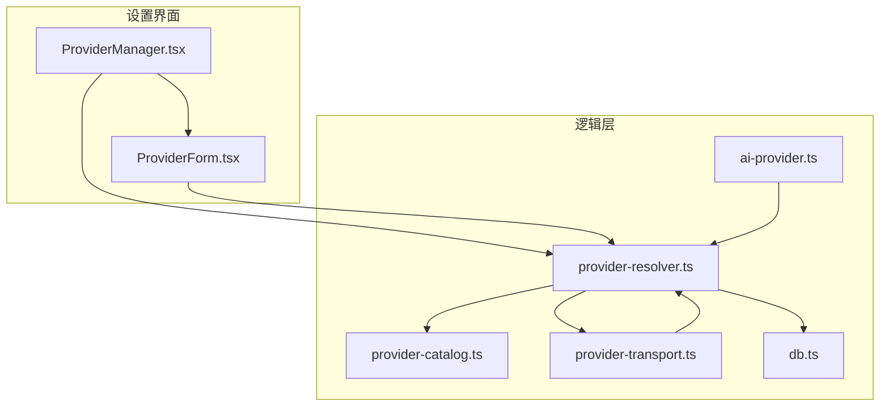
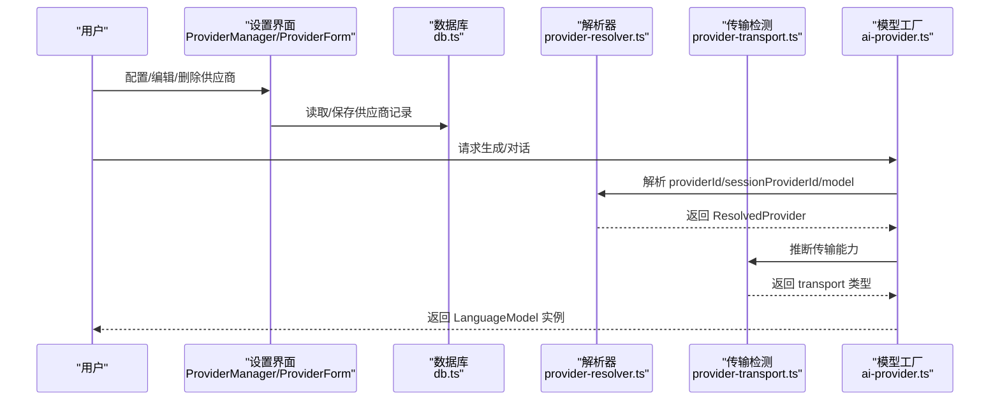
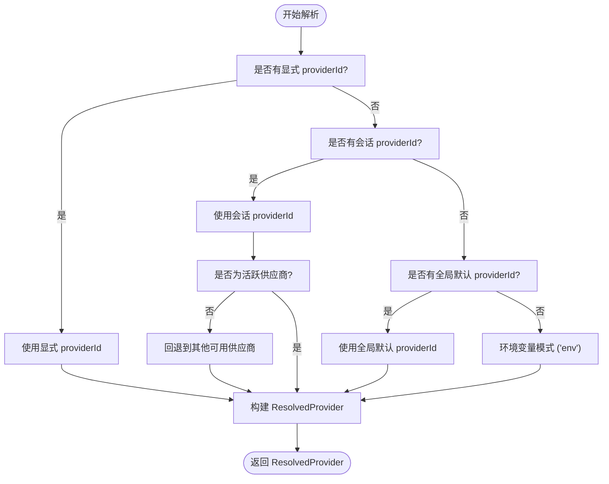
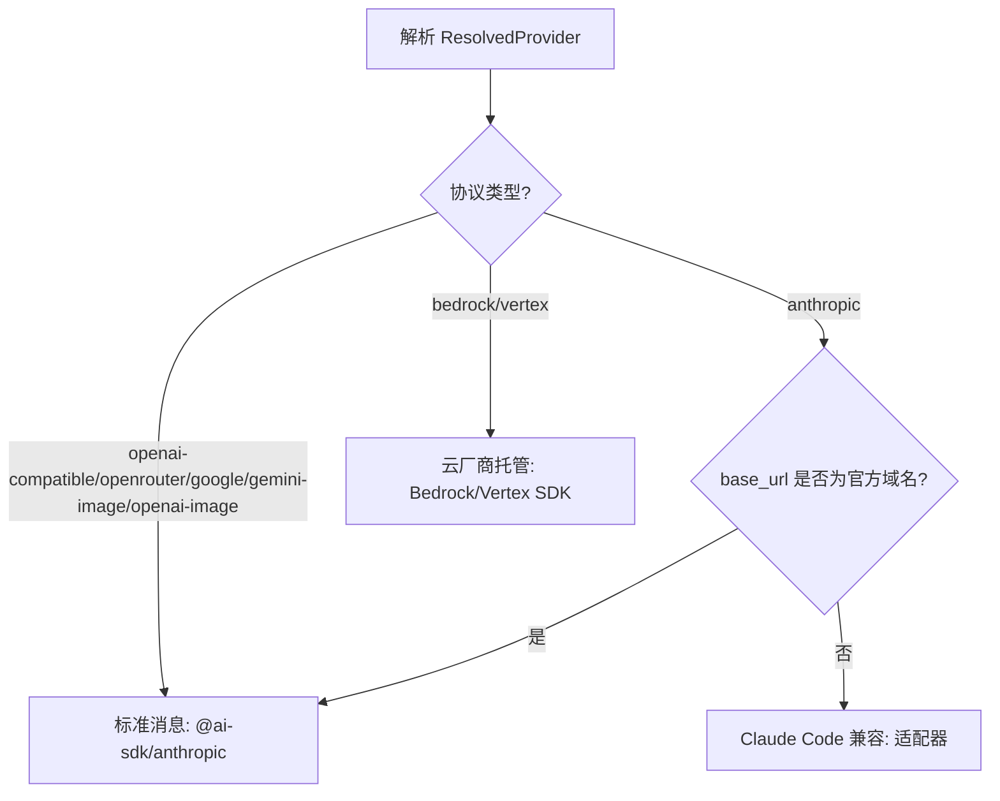
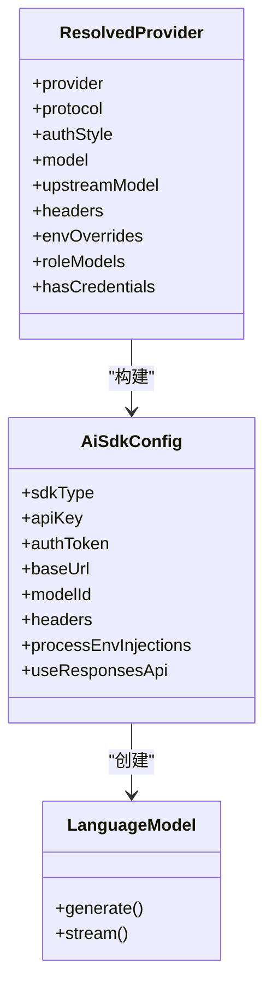
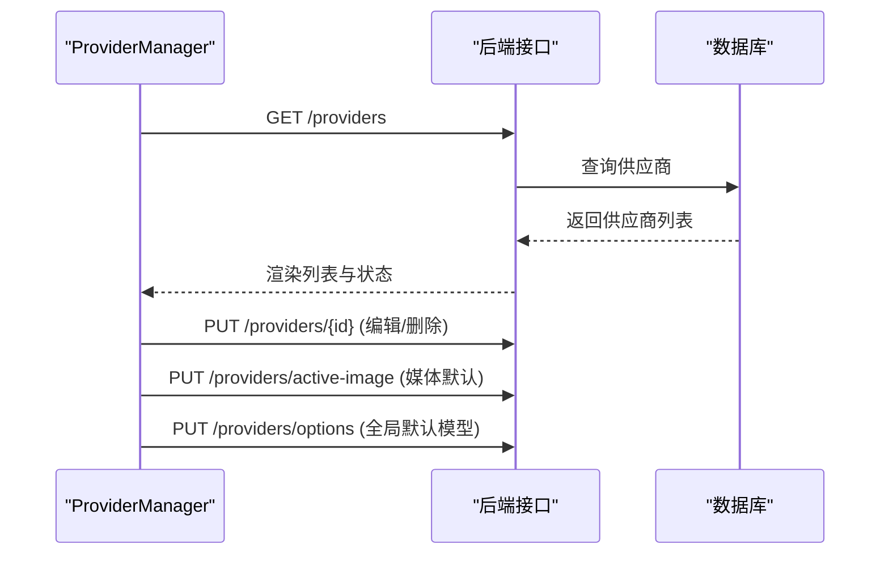
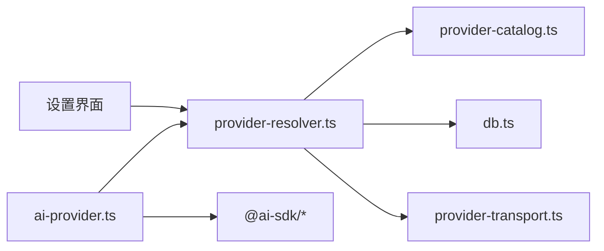

# AI 供应商设置

<cite>
**本文档引用的文件**
- [ai-provider.ts](file://src/lib/ai-provider.ts)
- [provider-resolver.ts](file://src/lib/provider-resolver.ts)
- [provider-transport.ts](file://src/lib/provider-transport.ts)
- [provider-catalog.ts](file://src/lib/provider-catalog.ts)
- [ProviderManager.tsx](file://src/components/settings/ProviderManager.tsx)
- [ProviderForm.tsx](file://src/components/settings/ProviderForm.tsx)
- [db.ts](file://src/lib/db.ts)
</cite>

## 更新摘要
**所做更改**
- 新增 DeepSeek 供应商配置支持，包括 V4 Pro 和 V4 Flash 模型
- 更新小米 MiMo 供应商配置，支持按量付费和 Token Plan 两种计费模式
- 改进环境变量清理机制，防止跨供应商凭据泄漏
- 增强推理思维提取中间件，支持 DeepSeek R1 等使用<think>标签的模型

## 目录
1. [简介](#简介)
2. [项目结构](#项目结构)
3. [核心组件](#核心组件)
4. [架构总览](#架构总览)
5. [详细组件分析](#详细组件分析)
6. [依赖关系分析](#依赖关系分析)
7. [性能考虑](#性能考虑)
8. [故障排除指南](#故障排除指南)
9. [结论](#结论)
10. [附录](#附录)

## 简介
本文件面向 CodePilot 的 AI 供应商设置功能，系统性说明如何配置与管理多供应商接入，涵盖以下主题：
- 供应商配置：API 密钥管理、模型选择、请求参数设置
- 供应商优先级与解析链路：环境变量、全局默认、会话覆盖
- 传输能力与适配：官方 API、第三方代理、云厂商托管
- 运行时集成：文本生成与智能体对话的统一入口
- 工具与运维：连接诊断、OAuth 登录、全局默认模型、媒体生成默认提供商

本指南既适用于开发者深入理解实现细节，也适合终端用户完成日常配置与排障。

## 项目结构
围绕 AI 供应商设置的核心代码分布在以下模块：
- 逻辑层（src/lib）
  - 供应商解析与建模：provider-resolver.ts、provider-catalog.ts
  - 传输能力检测：provider-transport.ts
  - 统一模型工厂：ai-provider.ts
  - 数据持久化：db.ts
- 设置界面（src/components/settings）
  - 供应商管理器：ProviderManager.tsx
  - 供应商表单：ProviderForm.tsx

**图表来源**
- [ProviderManager.tsx](file://src/components/settings/ProviderManager.tsx)
- [ProviderForm.tsx](file://src/components/settings/ProviderForm.tsx)
- [provider-resolver.ts](file://src/lib/provider-resolver.ts)
- [provider-catalog.ts](file://src/lib/provider-catalog.ts)
- [provider-transport.ts](file://src/lib/provider-transport.ts)
- [ai-provider.ts](file://src/lib/ai-provider.ts)
- [db.ts](file://src/lib/db.ts)

**章节来源**
- [ProviderManager.tsx](file://src/components/settings/ProviderManager.tsx)
- [ProviderForm.tsx](file://src/components/settings/ProviderForm.tsx)
- [provider-resolver.ts](file://src/lib/provider-resolver.ts)
- [provider-catalog.ts](file://src/lib/provider-catalog.ts)
- [provider-transport.ts](file://src/lib/provider-transport.ts)
- [ai-provider.ts](file://src/lib/ai-provider.ts)
- [db.ts](file://src/lib/db.ts)

## 核心组件
- 供应商解析器（provider-resolver.ts）
  - 统一解析优先级链路：显式 providerId → 会话 providerId → 全局默认 → 环境变量
  - 构建 ResolvedProvider 结果，包含协议、认证方式、可用模型、角色映射、头部与环境注入等
- 供应商目录（provider-catalog.ts）
  - 定义协议类型、认证风格、默认模型目录、角色映射、预设供应商元信息
  - 新增 DeepSeek 供应商支持和小米 MiMo 多计费模式支持
- 传输能力检测（provider-transport.ts）
  - 判定标准消息、Claude Code 兼容适配、云厂商托管三类传输路径
- 统一模型工厂（ai-provider.ts）
  - 将 ResolvedProvider 转换为 Vercel AI SDK LanguageModel 实例，注入中间件与请求参数
  - 增强推理思维提取中间件，支持 DeepSeek R1 等<think>标签模型
- 设置界面（ProviderManager.tsx / ProviderForm.tsx）
  - 提供供应商增删改查、快速预设、连接诊断、全局默认模型、媒体生成默认提供商等操作

**章节来源**
- [provider-resolver.ts](file://src/lib/provider-resolver.ts)
- [provider-catalog.ts](file://src/lib/provider-catalog.ts)
- [provider-transport.ts](file://src/lib/provider-transport.ts)
- [ai-provider.ts](file://src/lib/ai-provider.ts)
- [ProviderManager.tsx](file://src/components/settings/ProviderManager.tsx)
- [ProviderForm.tsx](file://src/components/settings/ProviderForm.tsx)

## 架构总览
下图展示从用户配置到模型调用的关键流程：

**图表来源**
- [ProviderManager.tsx](file://src/components/settings/ProviderManager.tsx)
- [ProviderForm.tsx](file://src/components/settings/ProviderForm.tsx)
- [db.ts](file://src/lib/db.ts)
- [provider-resolver.ts](file://src/lib/provider-resolver.ts)
- [provider-transport.ts](file://src/lib/provider-transport.ts)
- [ai-provider.ts](file://src/lib/ai-provider.ts)

## 详细组件分析

### 供应商解析与优先级
- 解析优先级链路
  - 显式 providerId（最高优先）→ 会话 providerId → 全局默认 providerId → 环境变量
- 会话安全回退
  - 对于非显式来源（如会话或全局默认），若供应商被标记为不活跃，则自动回退到其他可用供应商
- 环境变量模式
  - 当 providerId 为 'env' 或未指定时，解析器返回无数据库记录的环境模式，凭环境变量与历史设置进行认证
- OpenAI OAuth 虚拟供应商
  - 通过 'openai-oauth' 特殊 ID 使用 Codex API，无需数据库记录，仅在调用时校验 OAuth 凭据

**图表来源**
- [provider-resolver.ts](file://src/lib/provider-resolver.ts)

**章节来源**
- [provider-resolver.ts](file://src/lib/provider-resolver.ts)

### 传输能力与适配
- 传输类型
  - 标准消息：仅官方 Anthropic API（api.anthropic.com）
  - Claude Code 兼容：所有第三方 Anthropic 代理
  - 云厂商托管：AWS Bedrock、Google Vertex
- 适配策略
  - 官方 API 直连 @ai-sdk/anthropic
  - 第三方代理通过 ClaudeCodeCompatAdapter（兼容标准 Messages API）
  - 云厂商托管分别使用 Bedrock/Vertex SDK

**图表来源**
- [provider-transport.ts](file://src/lib/provider-transport.ts)
- [provider-resolver.ts](file://src/lib/provider-resolver.ts)

**章节来源**
- [provider-transport.ts](file://src/lib/provider-transport.ts)
- [provider-resolver.ts](file://src/lib/provider-resolver.ts)

### 统一模型工厂与中间件
- 模型工厂职责
  - 将 ResolvedProvider 转换为 Vercel AI SDK LanguageModel
  - 处理模型别名解析、URL 规范化、Beta 头部注入、第三方代理安全策略
- 中间件管线
  - 默认设置中间件：统一温度等参数
  - 思维抽取中间件：针对 OpenAI 兼容模型的 <think> 标签提取
  - 开发日志中间件：仅开发环境输出请求耗时与令牌用量

**图表来源**
- [ai-provider.ts](file://src/lib/ai-provider.ts)
- [provider-resolver.ts](file://src/lib/provider-resolver.ts)

**章节来源**
- [ai-provider.ts](file://src/lib/ai-provider.ts)
- [provider-resolver.ts](file://src/lib/provider-resolver.ts)

### 设置界面与供应商管理
- 供应商列表与状态
  - 展示已连接供应商、环境检测、OpenAI OAuth 状态
  - 支持编辑、删除、设置媒体生成默认提供商
- 快速预设与自定义
  - 内置多家供应商的快速连接预设，包括新增的 DeepSeek 和小米 MiMo
  - 自定义供应商支持高级字段：额外环境变量、请求头、环境覆盖、角色模型映射
- 全局默认模型
  - 支持按供应商维度设置全局默认模型，并同步 legacy 默认 provider id

**图表来源**
- [ProviderManager.tsx](file://src/components/settings/ProviderManager.tsx)
- [ProviderForm.tsx](file://src/components/settings/ProviderForm.tsx)
- [db.ts](file://src/lib/db.ts)

**章节来源**
- [ProviderManager.tsx](file://src/components/settings/ProviderManager.tsx)
- [ProviderForm.tsx](file://src/components/settings/ProviderForm.tsx)
- [db.ts](file://src/lib/db.ts)

### 新增供应商配置

#### DeepSeek 供应商配置
- 供应商特性
  - Anthropic 兼容 API，支持 V4 Pro 和 V4 Flash 模型
  - 默认禁用非必要流量，启用最大努力级别
  - 集成子代理模型配置
- 模型支持
  - DeepSeek V4 Pro：默认模型，支持所有角色
  - DeepSeek V4 Flash：轻量级模型，适合快速任务
- 环境配置
  - CLAUDE_CODE_SUBAGENT_MODEL: deepseek-v4-pro
  - CLAUDE_CODE_DISABLE_NONESSENTIAL_TRAFFIC: 1
  - CLAUDE_CODE_DISABLE_NONSTREAMING_FALLBACK: 1
  - CLAUDE_CODE_EFFORT_LEVEL: max

#### 小米 MiMo 供应商配置
- 供应商特性
  - 支持两种计费模式：按量付费和 Token Plan
  - MiMo-V2.5-Pro 作为默认模型
  - Anthropic 兼容 API 接口
- 计费模式
  - 按量付费：pay_as_you_go 模式
  - Token Plan：token_plan 模式，支持订阅套餐
- 环境配置
  - 统一的基础 URL 配置
  - 支持 API Key 认证
  - 默认模型映射到 mimo-v2.5-pro

**章节来源**
- [provider-catalog.ts](file://src/lib/provider-catalog.ts)

## 依赖关系分析
- 组件耦合
  - ai-provider.ts 依赖 provider-resolver.ts 与 provider-transport.ts 的解析结果
  - provider-resolver.ts 依赖 provider-catalog.ts 的协议与默认模型定义，并访问 db.ts 获取持久化数据
  - 设置界面依赖 db.ts 与后端 API，间接依赖 provider-resolver.ts 的解析能力
- 关键依赖链
  - 解析链：ProviderManager/ProviderForm → provider-resolver.ts → provider-catalog.ts/数据库
  - 执行链：ai-provider.ts → Vercel AI SDK → 供应商 API

**图表来源**
- [ProviderManager.tsx](file://src/components/settings/ProviderManager.tsx)
- [ProviderForm.tsx](file://src/components/settings/ProviderForm.tsx)
- [provider-resolver.ts](file://src/lib/provider-resolver.ts)
- [provider-catalog.ts](file://src/lib/provider-catalog.ts)
- [provider-transport.ts](file://src/lib/provider-transport.ts)
- [ai-provider.ts](file://src/lib/ai-provider.ts)
- [db.ts](file://src/lib/db.ts)

**章节来源**
- [provider-resolver.ts](file://src/lib/provider-resolver.ts)
- [provider-catalog.ts](file://src/lib/provider-catalog.ts)
- [provider-transport.ts](file://src/lib/provider-transport.ts)
- [ai-provider.ts](file://src/lib/ai-provider.ts)
- [db.ts](file://src/lib/db.ts)

## 性能考虑
- 解析与建模
  - 解析器采用一次性构建 ResolvedProvider，避免重复 IO；模型工厂按需创建 LanguageModel
- 传输适配
  - 通过传输检测避免不必要的 SDK 初始化与网络往返
- 中间件开销
  - 日志中间件仅在开发环境启用，生产环境无额外开销
- 数据访问
  - 数据库访问集中在设置界面与解析器，遵循索引与事务优化

## 故障排除指南
- 常见问题与定位
  - 无可用供应商凭据：当解析器未找到任何有效凭据时抛出错误，提示配置供应商或设置 ANTHROPIC_API_KEY
  - 第三方代理兼容性：若 base_url 非官方域名，自动切换到 Claude Code 兼容适配器
  - OpenAI OAuth 过期：Codex API 调用前校验 OAuth 凭据，过期时提示重新登录
  - 环境变量泄漏：切换供应商时清理 ANTHROPIC_* 与受管环境变量，防止跨供应商污染
- 诊断工具
  - 设置界面提供"运行诊断"按钮，辅助检查 CLI、认证、模型兼容性与网络连通性
  - 通过 ProviderManager 的事件广播（provider-changed）刷新相关 UI 与状态

**章节来源**
- [ai-provider.ts](file://src/lib/ai-provider.ts)
- [provider-resolver.ts](file://src/lib/provider-resolver.ts)
- [ProviderManager.tsx](file://src/components/settings/ProviderManager.tsx)

## 结论
CodePilot 的 AI 供应商设置通过"解析器 + 目录 + 传输检测 + 统一工厂"的分层设计，实现了：
- 一致的供应商解析与优先级策略
- 可扩展的协议与模型目录
- 对第三方代理与云厂商托管的透明适配
- 用户友好的配置界面与诊断工具

该体系为后续引入新供应商、增强配额监控与故障转移提供了清晰的扩展点。

## 附录

### 供应商配置模板与字段说明
- 基础字段
  - 名称：供应商显示名称
  - 供应商类型：Anthropic、OpenRouter、AWS Bedrock、Google Vertex、Custom 等
  - 基础 URL：API 基础地址（可选）
  - API 密钥：按认证方式注入（API Key 或 Auth Token）
- 高级字段（JSON）
  - 额外环境变量：用于注入 SDK/运行时所需环境变量
  - 请求头：附加到 SDK 请求的自定义头部
  - 环境覆盖：覆盖解析阶段的环境变量（空字符串表示删除）
  - 角色模型映射：将 default/reasoning/small/sonnet/opus/haiku 映射到具体模型
- 说明
  - 供应商类型与协议通常保持一致，但也可手动覆盖以适配特殊场景
  - 角色模型映射用于生成 ANTHROPIC_* 环境变量，影响 Claude Code SDK 的模型选择

**章节来源**
- [ProviderForm.tsx](file://src/components/settings/ProviderForm.tsx)
- [provider-catalog.ts](file://src/lib/provider-catalog.ts)
- [provider-resolver.ts](file://src/lib/provider-resolver.ts)

### 全局默认模型与媒体生成默认提供商
- 全局默认模型
  - 支持按供应商维度设置全局默认模型，并同步 legacy 默认 provider id
- 媒体生成默认提供商
  - 在同时配置 Gemini/OpenAI 图像生成时，可选择一个作为默认图像生成提供商
  - 若存储的默认提供商不可用（被删除、类型变更或密钥为空），界面会提示并允许一键清除

**章节来源**
- [ProviderManager.tsx](file://src/components/settings/ProviderManager.tsx)

### OpenAI OAuth 集成
- 登录流程
  - 启动授权：前端发起 /api/openai-oauth/start，打开外部授权页
  - 轮询状态：每 2 秒轮询 /api/openai-oauth/status，直到授权完成或超时
  - 注销：DELETE /api/openai-oauth/status 清除 OAuth 状态
- 使用场景
  - 通过虚拟供应商 openai-oauth 使用 Codex API，无需数据库记录

**章节来源**
- [ProviderManager.tsx](file://src/components/settings/ProviderManager.tsx)

### 数据模型与持久化
- 供应商表（api_providers）
  - 字段：id、name、provider_type、base_url、api_key、is_active、sort_order、extra_env、notes、created_at、updated_at
  - 新增字段：protocol、headers_json、env_overrides_json、role_models_json、options_json
- 供应商模型表（provider_models）
  - 字段：id、provider_id、model_id、upstream_model_id、display_name、capabilities_json、variants_json、sort_order、enabled、created_at
  - 索引：provider_id、唯一索引（provider_id, model_id）

**章节来源**
- [db.ts](file://src/lib/db.ts)

### 新增供应商配置详情

#### DeepSeek 供应商配置
- 协议与认证
  - 协议：anthropic
  - 认证方式：auth_token
  - 基础 URL：https://api.deepseek.com/anthropic
- 模型配置
  - 默认模型：deepseek-v4-pro（V4 Pro）
  - 角色映射：default、sonnet、opus → deepseek-v4-pro
  - 轻量模型：deepseek-v4-flash（V4 Flash）
- 环境变量
  - CLAUDE_CODE_SUBAGENT_MODEL: deepseek-v4-pro
  - CLAUDE_CODE_DISABLE_NONESSENTIAL_TRAFFIC: 1
  - CLAUDE_CODE_DISABLE_NONSTREAMING_FALLBACK: 1
  - CLAUDE_CODE_EFFORT_LEVEL: max

#### 小米 MiMo 供应商配置
- 按量付费模式
  - 协议：anthropic
  - 认证方式：auth_token
  - 基础 URL：https://api.xiaomimimo.com/anthropic
  - 计费模式：pay_as_you_go
- Token Plan 模式
  - 协议：anthropic
  - 认证方式：auth_token
  - 基础 URL：https://token-plan-cn.xiaomimimo.com/anthropic
  - 计费模式：token_plan
- 模型配置
  - 默认模型：mimo-v2.5-pro
  - 角色映射：所有角色 → mimo-v2.5-pro

**章节来源**
- [provider-catalog.ts](file://src/lib/provider-catalog.ts)

### 环境变量清理改进
- 清理机制
  - 切换供应商时自动清理 ANTHROPIC_* 环境变量
  - 防止跨供应商凭据泄漏
  - 支持受管环境变量的安全处理
- 安全策略
  - 仅清理与供应商认证相关的环境变量
  - 保留系统级重要环境变量
  - 支持增量清理和完整重置

**章节来源**
- [ai-provider.ts](file://src/lib/ai-provider.ts)
- [provider-resolver.ts](file://src/lib/provider-resolver.ts)

### 推理思维提取中间件增强
- 支持范围
  - DeepSeek R1 模型<think>标签提取
  - 兼容其他使用<think>标签的 OpenAI 兼容模型
- 配置选项
  - 标签名：think
  - 仅对 OpenAI 兼容供应商生效
  - 不影响原生 Anthropic 模型的推理处理

**章节来源**
- [ai-provider.ts](file://src/lib/ai-provider.ts)