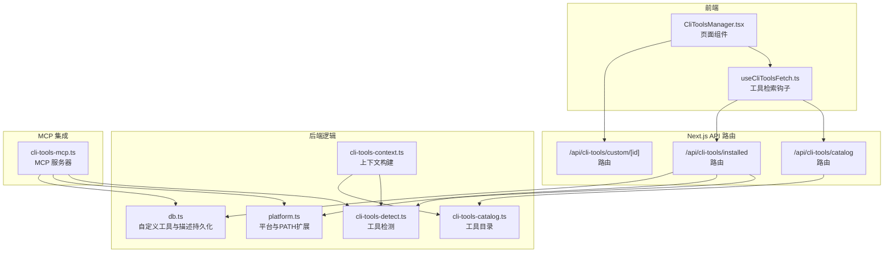
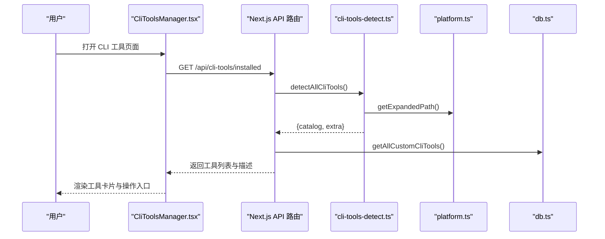
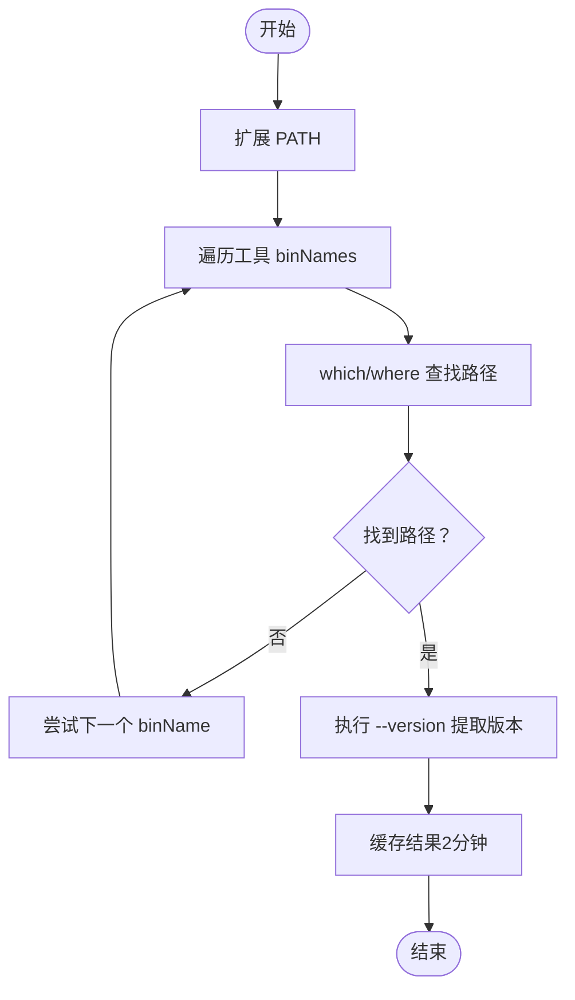
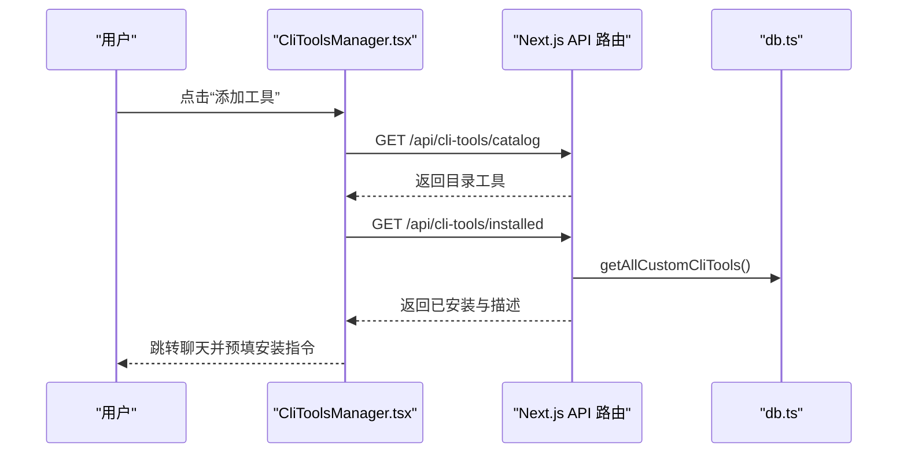
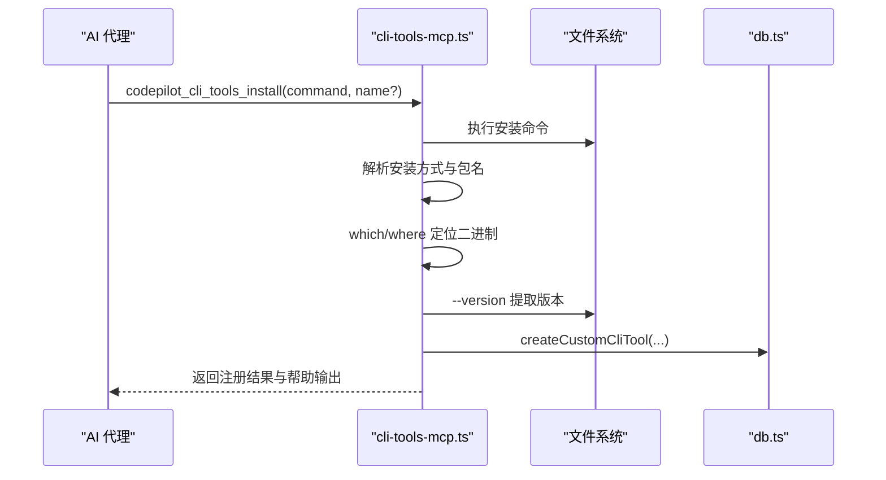
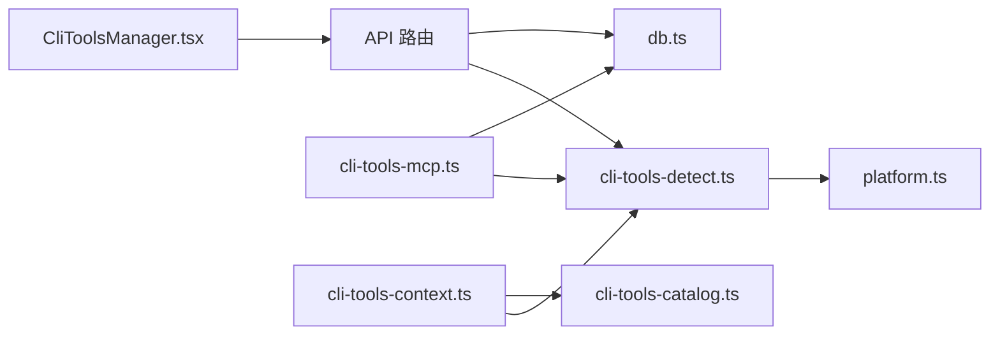

# CLI 工具设置

<cite>
**本文档引用的文件**
- [cli-tools-detect.ts](file://src/lib/cli-tools-detect.ts)
- [cli-tools-mcp.ts](file://src/lib/cli-tools-mcp.ts)
- [cli-tools-context.ts](file://src/lib/cli-tools-context.ts)
- [cli-tools-catalog.ts](file://src/lib/cli-tools-catalog.ts)
- [CliToolsManager.tsx](file://src/components/cli-tools/CliToolsManager.tsx)
- [page.tsx](file://src/app/cli-tools/page.tsx)
- [platform.ts](file://src/lib/platform.ts)
- [route.ts](file://src/app/api/cli-tools/catalog/route.ts)
- [route.ts](file://src/app/api/cli-tools/installed/route.ts)
- [route.ts](file://src/app/api/cli-tools/custom/[id]/route.ts)
- [useCliToolsFetch.ts](file://src/hooks/useCliToolsFetch.ts)
- [db.ts](file://src/lib/db.ts)
- [index.ts](file://src/types/index.ts)
</cite>

## 目录
1. [简介](#简介)
2. [项目结构](#项目结构)
3. [核心组件](#核心组件)
4. [架构总览](#架构总览)
5. [详细组件分析](#详细组件分析)
6. [依赖关系分析](#依赖关系分析)
7. [性能考虑](#性能考虑)
8. [故障排除指南](#故障排除指南)
9. [结论](#结论)
10. [附录](#附录)

## 简介
本文件系统性阐述 CodePilot CLI 工具设置功能，涵盖以下方面：
- CLI 工具的配置方法：工具路径检测、环境变量设置、参数配置
- CLI 工具的安装、更新、卸载流程，以及与 MCP 工具的集成方式
- CLI 工具的权限管理、执行上下文、输出格式等配置选项
- CLI 工具的调试、性能优化、错误处理等实用功能

目标是帮助开发者与用户理解并高效使用 CLI 工具管理能力，同时为维护者提供清晰的实现参考。

## 项目结构
CLI 工具设置功能由前端界面、后端 API、检测与上下文构建模块、MCP 集成模块以及数据库持久化组成。整体采用“前端页面 + Next.js API 路由 + 后端工具检测 + MCP 服务”的分层架构。

**图表来源**
- [CliToolsManager.tsx:19-429](file://src/components/cli-tools/CliToolsManager.tsx#L19-L429)
- [useCliToolsFetch.ts:41-171](file://src/hooks/useCliToolsFetch.ts#L41-L171)
- [route.ts:1-7](file://src/app/api/cli-tools/catalog/route.ts#L1-L7)
- [route.ts:24-52](file://src/app/api/cli-tools/installed/route.ts#L24-L52)
- [route.ts:1-18](file://src/app/api/cli-tools/custom/[id]/route.ts#L1-L18)
- [cli-tools-detect.ts:125-148](file://src/lib/cli-tools-detect.ts#L125-L148)
- [cli-tools-context.ts:10-45](file://src/lib/cli-tools-context.ts#L10-L45)
- [platform.ts:242-253](file://src/lib/platform.ts#L242-L253)
- [cli-tools-catalog.ts:3-422](file://src/lib/cli-tools-catalog.ts#L3-L422)
- [db.ts:98-200](file://src/lib/db.ts#L98-L200)
- [cli-tools-mcp.ts:115-800](file://src/lib/cli-tools-mcp.ts#L115-L800)

**章节来源**
- [page.tsx:1-12](file://src/app/cli-tools/page.tsx#L1-L12)
- [CliToolsManager.tsx:19-429](file://src/components/cli-tools/CliToolsManager.tsx#L19-L429)

## 核心组件
- 工具检测与缓存：负责扫描系统 PATH、识别已安装工具、提取版本信息，并提供 2 分钟缓存。
- 工具目录与描述：内置工具目录、额外已知二进制清单，以及工具描述与兼容性标记。
- 上下文构建：在聊天系统提示词中注入可用 CLI 工具信息，便于模型决策。
- MCP 集成：提供一组 MCP 工具，支持列出、安装、注册、删除、检查更新、更新 CLI 工具。
- 前端管理器：提供可视化界面，支持安装、注册、删除、批量描述生成等操作。
- API 路由：提供 catalog、installed、custom 删除等接口，供前端调用。
- 平台与环境：扩展 PATH、识别安装类型、检测 Claude CLI 二进制等。
- 数据库：持久化自定义 CLI 工具与描述信息。

**章节来源**
- [cli-tools-detect.ts:9-156](file://src/lib/cli-tools-detect.ts#L9-L156)
- [cli-tools-catalog.ts:3-452](file://src/lib/cli-tools-catalog.ts#L3-L452)
- [cli-tools-context.ts:10-45](file://src/lib/cli-tools-context.ts#L10-L45)
- [cli-tools-mcp.ts:115-800](file://src/lib/cli-tools-mcp.ts#L115-L800)
- [CliToolsManager.tsx:19-429](file://src/components/cli-tools/CliToolsManager.tsx#L19-L429)
- [route.ts:24-52](file://src/app/api/cli-tools/installed/route.ts#L24-L52)
- [platform.ts:242-253](file://src/lib/platform.ts#L242-L253)
- [db.ts:98-200](file://src/lib/db.ts#L98-L200)

## 架构总览
CLI 工具设置功能围绕“检测—展示—管理—执行”闭环展开：
- 检测：通过 PATH 扩展与缓存策略快速发现工具；对未知工具进行额外探测。
- 展示：前端聚合目录工具、系统探测工具与自定义工具，支持批量描述生成。
- 管理：提供安装、注册、删除、更新检查与更新等 MCP 工具。
- 执行：在聊天中通过 CLI 徽章或弹出面板选择工具，结合上下文提升模型决策质量。

**图表来源**
- [CliToolsManager.tsx:37-94](file://src/components/cli-tools/CliToolsManager.tsx#L37-L94)
- [route.ts:24-52](file://src/app/api/cli-tools/installed/route.ts#L24-L52)
- [cli-tools-detect.ts:125-148](file://src/lib/cli-tools-detect.ts#L125-L148)
- [platform.ts:242-253](file://src/lib/platform.ts#L242-L253)
- [db.ts:98-200](file://src/lib/db.ts#L98-L200)

## 详细组件分析

### 工具检测与缓存（cli-tools-detect.ts）
- 功能要点
  - 使用扩展 PATH 执行 which/where 查找二进制路径。
  - 对每个候选二进制执行 --version 提取版本号，支持普通语义版本与 JSON 输出。
  - 并行检测目录工具与额外已知二进制，分别返回 catalog 与 extra 结果。
  - 2 分钟 TTL 缓存，避免频繁文件系统探测。
- 关键行为
  - detectCliTool：逐个尝试 binNames，成功即返回安装状态与版本。
  - detectAllCliTools：并行检测，去重 extra 与 catalog，仅保留已安装的 extra 工具。
  - invalidateDetectCache：显式失效缓存，适配安装/卸载后立即刷新。

**图表来源**
- [cli-tools-detect.ts:16-74](file://src/lib/cli-tools-detect.ts#L16-L74)
- [cli-tools-detect.ts:125-148](file://src/lib/cli-tools-detect.ts#L125-L148)

**章节来源**
- [cli-tools-detect.ts:9-156](file://src/lib/cli-tools-detect.ts#L9-L156)

### 工具目录与额外已知二进制（cli-tools-catalog.ts）
- 工具目录（CLI_TOOLS_CATALOG）
  - 定义每个工具的标识、名称、二进制名、分类、安装方式、认证需求、使用场景、示例提示、兼容性标记（agentFriendly、supportsJson、supportsSchema、supportsDryRun、contextFriendly）、健康检查命令等。
- 额外已知二进制（EXTRA_WELL_KNOWN_BINS）
  - 列举系统常见二进制（如 wget、curl、git、python3、node、go、docker、kubectl、terraform、gh、aws、gcloud 等），用于在检测阶段识别未进入目录的工具。

**章节来源**
- [cli-tools-catalog.ts:3-452](file://src/lib/cli-tools-catalog.ts#L3-L452)

### 上下文构建（cli-tools-context.ts）
- 将已安装的目录工具、系统探测工具与自定义工具汇总为简洁的上下文块，注入到聊天系统提示词中，帮助模型了解可用工具及其简要描述。

**章节来源**
- [cli-tools-context.ts:10-45](file://src/lib/cli-tools-context.ts#L10-L45)

### 平台与环境（platform.ts）
- PATH 扩展：在不同平台追加额外可执行目录，提高检测覆盖率。
- 安装类型识别：区分 native、homebrew、npm、bun、winget 等安装方式，辅助升级与诊断。
- Claude CLI 二进制检测：提供候选路径、缓存策略与超时容错，增强跨平台稳定性。

**章节来源**
- [platform.ts:64-90](file://src/lib/platform.ts#L64-L90)
- [platform.ts:242-253](file://src/lib/platform.ts#L242-L253)
- [platform.ts:276-371](file://src/lib/platform.ts#L276-L371)

### 前端管理器（CliToolsManager.tsx）
- 功能概览
  - 加载目录工具与已安装工具，支持推荐安装与查看详情。
  - 支持添加自定义工具、删除自定义工具、批量生成描述。
  - 通过聊天预填充引导用户使用安装命令。
- 关键交互
  - handleInstall：根据工具的安装方式生成安装命令，跳转至聊天页面预填指令。
  - handleAddTool：引导用户在聊天中输入工具名称与安装命令。
  - handleDeleteCustomTool：调用 API 删除自定义工具。

**图表来源**
- [CliToolsManager.tsx:116-152](file://src/components/cli-tools/CliToolsManager.tsx#L116-L152)
- [route.ts:1-7](file://src/app/api/cli-tools/catalog/route.ts#L1-L7)
- [route.ts:24-52](file://src/app/api/cli-tools/installed/route.ts#L24-L52)
- [db.ts:98-200](file://src/lib/db.ts#L98-L200)

**章节来源**
- [CliToolsManager.tsx:19-429](file://src/components/cli-tools/CliToolsManager.tsx#L19-L429)

### API 路由（Next.js）
- /api/cli-tools/catalog
  - 返回工具目录数据。
- /api/cli-tools/installed
  - 并行检测工具、检测 Homebrew 可用性、加载描述与自定义工具，返回统一结构。
- /api/cli-tools/custom/[id]
  - 删除指定自定义工具。

**章节来源**
- [route.ts:1-7](file://src/app/api/cli-tools/catalog/route.ts#L1-L7)
- [route.ts:24-52](file://src/app/api/cli-tools/installed/route.ts#L24-L52)
- [route.ts:1-18](file://src/app/api/cli-tools/custom/[id]/route.ts#L1-L18)

### 数据库（db.ts）
- 自定义 CLI 工具表与描述表：保存用户添加的工具路径、名称、版本、安装方式、描述与结构化兼容性信息。
- 初始化与迁移：自动迁移旧位置数据库文件，确保数据一致性。

**章节来源**
- [db.ts:98-200](file://src/lib/db.ts#L98-L200)

### MCP 集成（cli-tools-mcp.ts）
- 提供的工具
  - codepilot_cli_tools_list：列出工具（支持 text/json 输出）。
  - codepilot_cli_tools_install：执行安装命令并自动检测注册。
  - codepilot_cli_tools_add：注册已安装工具并保存描述与兼容性评估。
  - codepilot_cli_tools_remove：删除自定义工具。
  - codepilot_cli_tools_check_updates：检查可更新项。
  - codepilot_cli_tools_update：根据安装方式生成更新命令并执行。
- 关键特性
  - 安装后自动提取帮助输出，辅助生成双语描述。
  - 针对不同安装方式（brew、npm、pipx、pip、cargo、apt）构建更新命令。
  - 通过系统提示词引导模型正确使用工具（agentFriendly、supportsJson、supportsSchema、supportsDryRun、contextFriendly）。

**图表来源**
- [cli-tools-mcp.ts:260-429](file://src/lib/cli-tools-mcp.ts#L260-L429)
- [db.ts:98-200](file://src/lib/db.ts#L98-L200)

**章节来源**
- [cli-tools-mcp.ts:115-800](file://src/lib/cli-tools-mcp.ts#L115-L800)

## 依赖关系分析
- 组件耦合
  - 前端管理器依赖 API 路由与工具目录；API 路由依赖检测模块与数据库。
  - 检测模块依赖平台模块扩展 PATH；MCP 模块依赖检测与数据库。
- 外部依赖
  - 子进程执行（which/where、--version、安装命令、brew/npm 等）。
  - better-sqlite3 数据库持久化。
- 潜在循环依赖
  - 无直接循环；各模块职责清晰，通过 API 与工具函数间接交互。

**图表来源**
- [CliToolsManager.tsx:19-429](file://src/components/cli-tools/CliToolsManager.tsx#L19-L429)
- [route.ts:24-52](file://src/app/api/cli-tools/installed/route.ts#L24-L52)
- [cli-tools-detect.ts:125-148](file://src/lib/cli-tools-detect.ts#L125-L148)
- [platform.ts:242-253](file://src/lib/platform.ts#L242-L253)
- [db.ts:98-200](file://src/lib/db.ts#L98-L200)
- [cli-tools-mcp.ts:115-800](file://src/lib/cli-tools-mcp.ts#L115-L800)
- [cli-tools-context.ts:10-45](file://src/lib/cli-tools-context.ts#L10-L45)
- [cli-tools-catalog.ts:3-452](file://src/lib/cli-tools-catalog.ts#L3-L452)

**章节来源**
- [useCliToolsFetch.ts:41-171](file://src/hooks/useCliToolsFetch.ts#L41-L171)
- [index.ts:118-125](file://src/types/index.ts#L118-L125)

## 性能考虑
- 检测缓存
  - 工具检测模块使用 2 分钟 TTL 缓存，减少重复文件系统探测。
  - Claude CLI 二进制检测使用 60 秒 TTL 缓存，避免频繁 IO。
- 并行化
  - 安装状态检测与 Homebrew 可用性检测并行执行，缩短响应时间。
- PATH 扩展
  - 在不同平台追加额外可执行目录，降低查找失败概率，减少多次探测。
- 超时控制
  - 所有子进程调用均设置合理超时，避免阻塞主线程。
- 建议
  - 对于频繁变更的 PATH，建议在安装/卸载后主动失效缓存（detectAllCliTools 支持 forceRefresh）。
  - 在 CI 环境中，可通过环境变量预设 PATH，减少探测范围。

[本节为通用指导，无需具体文件分析]

## 故障排除指南
- 工具未被检测到
  - 检查 PATH 是否包含工具所在目录；必要时扩展 PATH。
  - 确认二进制具备执行权限；Windows 下 .cmd/.bat 需要 shell 执行。
  - 强制刷新检测缓存后重试。
- 安装后无法定位二进制
  - 安装命令可能安装了不同于目录声明的二进制名；使用 codepilot_cli_tools_add 手动注册绝对路径。
- 更新失败
  - 检查安装方式是否受支持（brew、npm、pipx、pip、cargo、apt）。
  - 确认网络与包管理器可用性；必要时手动执行更新命令。
- 权限问题
  - 部分工具需要管理员权限；在聊天中预填 sudo 提示。
- MCP 工具报错
  - 查看返回的错误信息与 isError 标记；根据提示修正参数或权限。
- 数据库相关
  - 若描述未生效，确认结构化 JSON 是否正确保存；必要时重新生成描述。

**章节来源**
- [cli-tools-detect.ts:125-156](file://src/lib/cli-tools-detect.ts#L125-L156)
- [cli-tools-mcp.ts:260-429](file://src/lib/cli-tools-mcp.ts#L260-L429)
- [platform.ts:242-253](file://src/lib/platform.ts#L242-L253)

## 结论
CodePilot 的 CLI 工具设置功能通过“检测—展示—管理—执行”的完整链路，实现了对系统内 CLI 工具的自动化发现、注册与管理，并与 MCP 工具深度集成，为 AI 代理与用户提供了强大而灵活的命令行工具生态。其关键优势在于：
- 高效的检测与缓存策略
- 丰富的工具目录与兼容性标记
- 易用的前端管理界面与聊天引导
- 完整的 MCP 工具集，覆盖安装、注册、删除、更新等全生命周期

[本节为总结性内容，无需具体文件分析]

## 附录

### 配置方法与参数说明
- 工具路径检测
  - 通过扩展 PATH 与 which/where 查找二进制；支持 Windows 与类 Unix 平台差异。
- 环境变量设置
  - 使用 getExpandedPath 构建包含额外目录的 PATH；在执行安装命令与版本查询时传递环境变量。
- 参数配置
  - codepilot_cli_tools_list：format=json 获取结构化输出。
  - codepilot_cli_tools_install：command、name（可选）。
  - codepilot_cli_tools_add：binPath（必填）、name、descriptionZh、descriptionEn、toolId（更新描述时使用）、agentFriendly、supportsJson、supportsSchema、supportsDryRun、contextFriendly。
  - codepilot_cli_tools_remove：toolId。
  - codepilot_cli_tools_check_updates：无参数。
  - codepilot_cli_tools_update：toolId 或 name（任选其一）。

**章节来源**
- [cli-tools-mcp.ts:115-800](file://src/lib/cli-tools-mcp.ts#L115-L800)
- [platform.ts:242-253](file://src/lib/platform.ts#L242-L253)

### 安装、更新、卸载流程
- 安装
  - 通过聊天预填安装命令，或直接调用 codepilot_cli_tools_install。
  - 自动解析安装方式与包名，定位二进制并注册。
- 更新
  - 使用 codepilot_cli_tools_check_updates 检查可更新项，再调用 codepilot_cli_tools_update。
- 卸载
  - 仅允许删除自定义工具；目录与系统探测工具不可删除。

**章节来源**
- [CliToolsManager.tsx:116-152](file://src/components/cli-tools/CliToolsManager.tsx#L116-L152)
- [cli-tools-mcp.ts:587-702](file://src/lib/cli-tools-mcp.ts#L587-L702)
- [route.ts:1-18](file://src/app/api/cli-tools/custom/[id]/route.ts#L1-L18)

### 权限管理与执行上下文
- 权限管理
  - 安装与更新命令可能需要管理员权限；前端提供 sudo 提示。
  - MCP 工具调用遵循 invoke 机制进行权限检查。
- 执行上下文
  - 上下文构建模块将可用工具注入系统提示词，提升模型决策准确性。
  - 工具兼容性标记（agentFriendly、supportsJson、supportsSchema、supportsDryRun、contextFriendly）指导模型选择合适工具。

**章节来源**
- [cli-tools-context.ts:10-45](file://src/lib/cli-tools-context.ts#L10-L45)
- [cli-tools-catalog.ts:232-237](file://src/lib/cli-tools-catalog.ts#L232-L237)

### 输出格式与调试
- 输出格式
  - codepilot_cli_tools_list 支持 text 与 json 两种格式；json 便于机器消费。
- 调试
  - 安装后自动输出 --help 输出片段，辅助生成描述。
  - 错误响应包含 isError 标记与错误信息，便于定位问题。

**章节来源**
- [cli-tools-mcp.ts:120-257](file://src/lib/cli-tools-mcp.ts#L120-L257)
- [cli-tools-mcp.ts:398-409](file://src/lib/cli-tools-mcp.ts#L398-L409)