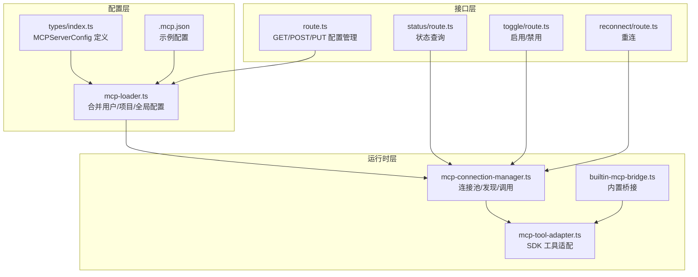
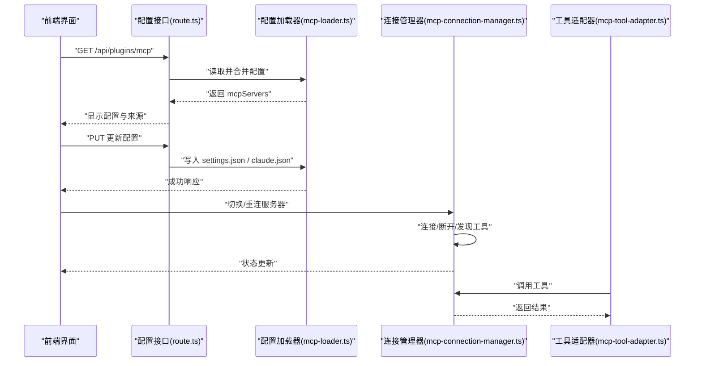
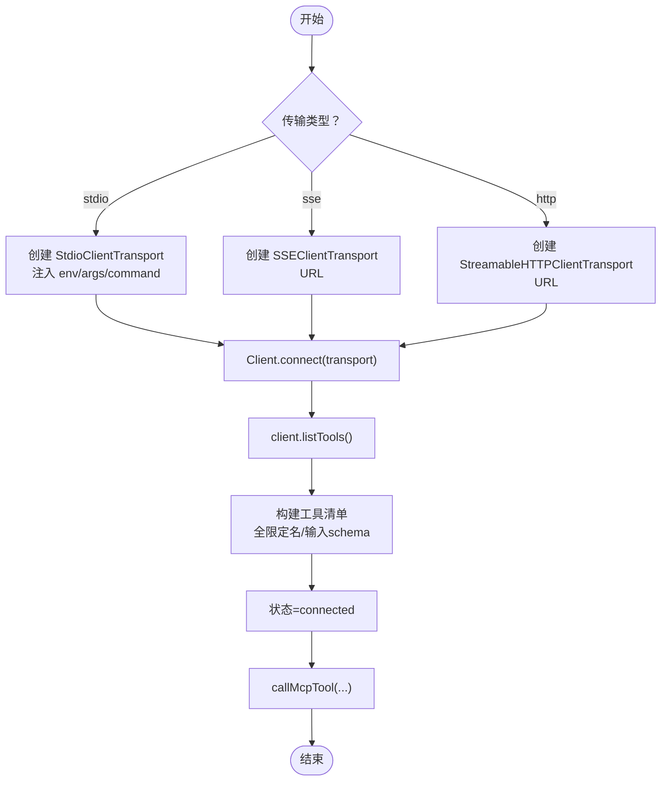
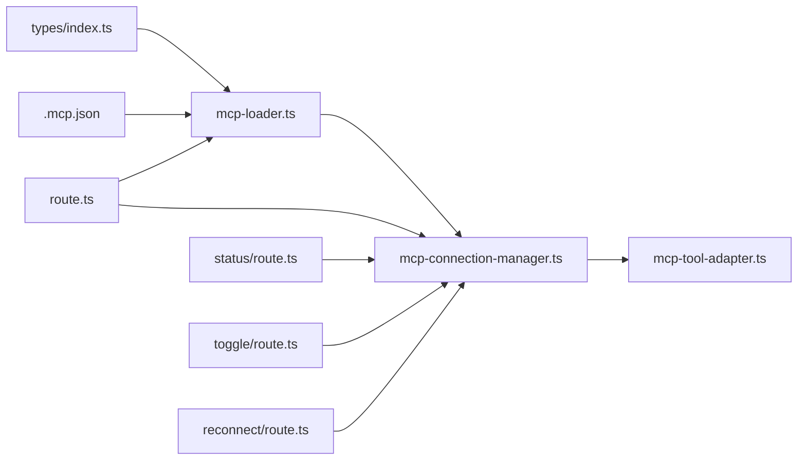

# MCP 服务器设置

<cite>
**本文引用的文件**
- [mcp-connection-manager.ts](file://src/lib/mcp-connection-manager.ts)
- [mcp-loader.ts](file://src/lib/mcp-loader.ts)
- [mcp-tool-adapter.ts](file://src/lib/mcp-tool-adapter.ts)
- [builtin-mcp-bridge.ts](file://src/lib/builtin-mcp-bridge.ts)
- [index.ts](file://src/types/index.ts)
- [.mcp.json](file://.mcp.json)
- [route.ts](file://src/app/api/plugins/mcp/route.ts)
- [status/route.ts](file://src/app/api/plugins/mcp/status/route.ts)
- [toggle/route.ts](file://src/app/api/plugins/mcp/toggle/route.ts)
- [reconnect/route.ts](file://src/app/api/plugins/mcp/reconnect/route.ts)
</cite>

## 目录
1. [简介](#简介)
2. [项目结构](#项目结构)
3. [核心组件](#核心组件)
4. [架构总览](#架构总览)
5. [详细组件分析](#详细组件分析)
6. [依赖关系分析](#依赖关系分析)
7. [性能考量](#性能考量)
8. [故障排除指南](#故障排除指南)
9. [结论](#结论)
10. [附录](#附录)

## 简介
本文件面向 CodePilot 的 MCP（Model Context Protocol）服务器设置与运行时管理，系统性说明以下内容：
- MCP 服务器配置方法：服务器地址、认证方式、传输协议选择
- MCP 服务器发现、连接管理、心跳检测、断线重连机制
- MCP 工具注册、权限控制、性能监控配置指南
- MCP 服务器调试、日志分析、故障排除高级功能

## 项目结构
围绕 MCP 的关键模块分布如下：
- 配置加载与合并：mcp-loader.ts
- 连接池与工具适配：mcp-connection-manager.ts、mcp-tool-adapter.ts
- 内置桥接与工具注册：builtin-mcp-bridge.ts
- 类型定义与 API 接口：types/index.ts、各路由接口
- 示例配置文件：.mcp.json

图表来源
- [mcp-loader.ts:101-136](file://src/lib/mcp-loader.ts#L101-L136)
- [mcp-connection-manager.ts:45-108](file://src/lib/mcp-connection-manager.ts#L45-L108)
- [mcp-tool-adapter.ts:17-26](file://src/lib/mcp-tool-adapter.ts#L17-L26)
- [builtin-mcp-bridge.ts:71-83](file://src/lib/builtin-mcp-bridge.ts#L71-L83)
- [index.ts:576-585](file://src/types/index.ts#L576-L585)
- [.mcp.json:1-14](file://.mcp.json#L1-L14)
- [route.ts:44-84](file://src/app/api/plugins/mcp/route.ts#L44-L84)
- [status/route.ts:8-36](file://src/app/api/plugins/mcp/status/route.ts#L8-L36)
- [toggle/route.ts:13-44](file://src/app/api/plugins/mcp/toggle/route.ts#L13-L44)
- [reconnect/route.ts:9-24](file://src/app/api/plugins/mcp/reconnect/route.ts#L9-L24)

章节来源
- [mcp-loader.ts:101-136](file://src/lib/mcp-loader.ts#L101-L136)
- [mcp-connection-manager.ts:45-108](file://src/lib/mcp-connection-manager.ts#L45-L108)
- [mcp-tool-adapter.ts:17-26](file://src/lib/mcp-tool-adapter.ts#L17-L26)
- [builtin-mcp-bridge.ts:71-83](file://src/lib/builtin-mcp-bridge.ts#L71-L83)
- [index.ts:576-585](file://src/types/index.ts#L576-L585)
- [.mcp.json:1-14](file://.mcp.json#L1-L14)
- [route.ts:44-84](file://src/app/api/plugins/mcp/route.ts#L44-L84)
- [status/route.ts:8-36](file://src/app/api/plugins/mcp/status/route.ts#L8-L36)
- [toggle/route.ts:13-44](file://src/app/api/plugins/mcp/toggle/route.ts#L13-L44)
- [reconnect/route.ts:9-24](file://src/app/api/plugins/mcp/reconnect/route.ts#L9-L24)

## 核心组件
- 配置加载器（mcp-loader.ts）
  - 合并用户级 ~/.claude.json、设置 ~/.claude/settings.json、项目级 .mcp.json
  - 支持环境变量占位符 ${key} 解析并缓存，过滤禁用服务器
  - 提供 UI 展示与 SDK 加载两套接口，避免重复传递与初始化开销
- 连接管理器（mcp-connection-manager.ts）
  - 单例连接池，按名称管理服务器连接
  - 支持传输类型：stdio、sse、http；自动发现工具并生成全限定名
  - 提供连接/断开、工具调用、状态查询、重连等能力
- 工具适配器（mcp-tool-adapter.ts）
  - 将 MCP 工具定义转换为 Vercel AI SDK 的 dynamicTool，统一执行入口
- 内置桥接（builtin-mcp-bridge.ts）
  - 将 SDK 风格的工具处理器桥接到 AI SDK 工具格式，便于原生运行时使用
- 类型定义（types/index.ts）
  - 定义 MCPServerConfig 结构，包含 type/url/command/headers/env 等字段
- API 接口（route.ts 及其子路由）
  - GET/PUT/POST 管理 MCP 服务器配置
  - GET 查询状态，POST 启用/禁用，POST 重连

章节来源
- [mcp-loader.ts:101-136](file://src/lib/mcp-loader.ts#L101-L136)
- [mcp-connection-manager.ts:45-108](file://src/lib/mcp-connection-manager.ts#L45-L108)
- [mcp-tool-adapter.ts:17-26](file://src/lib/mcp-tool-adapter.ts#L17-L26)
- [builtin-mcp-bridge.ts:71-83](file://src/lib/builtin-mcp-bridge.ts#L71-L83)
- [index.ts:576-585](file://src/types/index.ts#L576-L585)
- [route.ts:44-84](file://src/app/api/plugins/mcp/route.ts#L44-L84)

## 架构总览
下图展示 MCP 服务器从配置到运行时调用的关键流程。

图表来源
- [route.ts:44-84](file://src/app/api/plugins/mcp/route.ts#L44-L84)
- [mcp-loader.ts:101-136](file://src/lib/mcp-loader.ts#L101-L136)
- [mcp-connection-manager.ts:45-108](file://src/lib/mcp-connection-manager.ts#L45-L108)
- [mcp-tool-adapter.ts:17-26](file://src/lib/mcp-tool-adapter.ts#L17-L26)

## 详细组件分析

### 配置加载与合并（mcp-loader.ts）
- 配置来源与优先级
  - 用户级：~/.claude.json（mcpServers）
  - 设置级：~/.claude/settings.json（mcpServers、mcpServerOverrides）
  - 项目级：当前工作目录 .mcp.json（仅允许启用/禁用覆盖）
- 占位符解析
  - 对 env 中以 ${key} 形式的占位符，从数据库键值解析并替换
  - 仅对包含占位符且未显式禁用的服务器参与 CodePilot 特定处理
- 缓存策略
  - 30 秒 TTL，支持显式失效（invalidateMcpCache）
- 专用接口
  - loadCodePilotMcpServers：返回需要 CodePilot 处理的服务器集合（用于 SDK 之外的场景）
  - loadAllMcpServers：返回完整合并后的配置（用于 UI 展示）
  - loadProjectMcpServers：按实际项目工作目录读取并解析项目级配置

章节来源
- [mcp-loader.ts:101-136](file://src/lib/mcp-loader.ts#L101-L136)
- [mcp-loader.ts:162-211](file://src/lib/mcp-loader.ts#L162-L211)

### 连接管理与工具发现（mcp-connection-manager.ts）
- 连接池
  - 使用 Map 以服务器名为键，维护连接状态、工具清单、错误信息
  - 支持同步连接池：新增/变更/移除服务器
- 传输类型
  - stdio：通过命令行启动外部进程，支持 env 注入
  - sse：基于 URL 的 SSE 传输
  - http：基于可流式 HTTP 的传输
- 工具发现与命名
  - 调用 listTools 获取工具清单，并生成全限定名 mcp__{serverName}__{toolName}
  - 输入参数 schema 统一包装为 AI SDK 可用的 JSON Schema
- 工具调用
  - callMcpTool：在连接处于 connected 状态时调用指定工具
- 状态与重连
  - getMcpStatus：聚合各服务器状态、工具数量与错误
  - reconnectServer/disposeAll：支持单点重连与全部释放

图表来源
- [mcp-connection-manager.ts:191-220](file://src/lib/mcp-connection-manager.ts#L191-L220)
- [mcp-connection-manager.ts:69-108](file://src/lib/mcp-connection-manager.ts#L69-L108)
- [mcp-connection-manager.ts:124-140](file://src/lib/mcp-connection-manager.ts#L124-L140)

章节来源
- [mcp-connection-manager.ts:45-108](file://src/lib/mcp-connection-manager.ts#L45-L108)
- [mcp-connection-manager.ts:124-140](file://src/lib/mcp-connection-manager.ts#L124-L140)
- [mcp-connection-manager.ts:158-168](file://src/lib/mcp-connection-manager.ts#L158-L168)
- [mcp-connection-manager.ts:173-178](file://src/lib/mcp-connection-manager.ts#L173-L178)

### 工具适配与注册（mcp-tool-adapter.ts）
- 全量工具集构建
  - 从连接管理器获取已连接服务器的工具清单
  - 为每个工具生成 AI SDK dynamicTool，描述与输入 schema 来自 MCP 定义
- 执行逻辑
  - 调用 callMcpTool 并解析返回内容
  - 若返回包含 text 类型内容，拼接为字符串；否则序列化为 JSON
  - 错误标记时返回错误提示文本

章节来源
- [mcp-tool-adapter.ts:17-26](file://src/lib/mcp-tool-adapter.ts#L17-L26)
- [mcp-tool-adapter.ts:31-69](file://src/lib/mcp-tool-adapter.ts#L31-L69)

### 内置桥接（builtin-mcp-bridge.ts）
- 目标
  - 将 SDK 风格的工具处理器桥接为 AI SDK 工具，避免在原 SDK 文件外重复实现
- 适配要点
  - 输入 schema 与输出结构保持一致
  - 从 SDK 的 { content: [{ type: 'text', text }] } 提取文本作为工具返回值
  - 异常捕获并格式化为错误文本

章节来源
- [builtin-mcp-bridge.ts:25-48](file://src/lib/builtin-mcp-bridge.ts#L25-L48)
- [builtin-mcp-bridge.ts:71-83](file://src/lib/builtin-mcp-bridge.ts#L71-L83)

### 类型定义与配置结构（types/index.ts）
- MCPServerConfig 关键字段
  - type：'stdio' | 'sse' | 'http'
  - url：当 type=sse/http 时必填
  - command/args/env：当 type=stdio 时必填
  - headers：请求头（如需要）
  - enabled：持久启用/禁用标志
- API 请求/响应
  - UpdateMCPConfigRequest、AddMCPServerRequest、MCPConfigResponse 等

章节来源
- [index.ts:576-585](file://src/types/index.ts#L576-L585)
- [index.ts:337-344](file://src/types/index.ts#L337-L344)
- [index.ts:461-463](file://src/types/index.ts#L461-L463)

### 配置管理 API（route.ts）
- GET /api/plugins/mcp
  - 合并用户/设置/项目三层配置，标注来源，支持项目服务器启用覆盖
- PUT /api/plugins/mcp
  - 分发写入 settings.json 与 ~/.claude.json，支持项目服务器仅写入 enabled 覆盖
- POST /api/plugins/mcp
  - 新增服务器，校验名称与必要字段（本地或远程）

章节来源
- [route.ts:44-84](file://src/app/api/plugins/mcp/route.ts#L44-L84)
- [route.ts:86-141](file://src/app/api/plugins/mcp/route.ts#L86-L141)
- [route.ts:143-189](file://src/app/api/plugins/mcp/route.ts#L143-L189)

### 状态查询与控制（status/toggle/reconnect）
- GET /api/plugins/mcp/status
  - 支持按会话或全局查询 MCP 服务器能力状态与缓存时间
- POST /api/plugins/mcp/toggle
  - 立即启用：尝试读取配置并立即连接；禁用：断开连接
- POST /api/plugins/mcp/reconnect
  - 指定服务器重连

章节来源
- [status/route.ts:8-36](file://src/app/api/plugins/mcp/status/route.ts#L8-L36)
- [toggle/route.ts:13-44](file://src/app/api/plugins/mcp/toggle/route.ts#L13-L44)
- [reconnect/route.ts:9-24](file://src/app/api/plugins/mcp/reconnect/route.ts#L9-L24)

## 依赖关系分析
- 配置层依赖
  - mcp-loader 依赖 types 中的 MCPServerConfig 定义与数据库键值解析
  - .mcp.json 为项目级默认配置样例
- 运行时依赖
  - mcp-connection-manager 依赖 @modelcontextprotocol/sdk 的客户端与传输实现
  - mcp-tool-adapter 依赖 AI SDK 的 dynamicTool 与 jsonSchema
- 接口依赖
  - route.ts 依赖 mcp-loader 与 mcp-connection-manager 的状态与操作
  - status/toggle/reconnect 路由直接调用连接管理器

图表来源
- [index.ts:576-585](file://src/types/index.ts#L576-L585)
- [.mcp.json:1-14](file://.mcp.json#L1-L14)
- [mcp-loader.ts:101-136](file://src/lib/mcp-loader.ts#L101-L136)
- [mcp-connection-manager.ts:45-108](file://src/lib/mcp-connection-manager.ts#L45-L108)
- [mcp-tool-adapter.ts:17-26](file://src/lib/mcp-tool-adapter.ts#L17-L26)
- [route.ts:44-84](file://src/app/api/plugins/mcp/route.ts#L44-L84)
- [status/route.ts:8-36](file://src/app/api/plugins/mcp/status/route.ts#L8-L36)
- [toggle/route.ts:13-44](file://src/app/api/plugins/mcp/toggle/route.ts#L13-L44)
- [reconnect/route.ts:9-24](file://src/app/api/plugins/mcp/reconnect/route.ts#L9-L24)

章节来源
- [index.ts:576-585](file://src/types/index.ts#L576-L585)
- [mcp-loader.ts:101-136](file://src/lib/mcp-loader.ts#L101-L136)
- [mcp-connection-manager.ts:45-108](file://src/lib/mcp-connection-manager.ts#L45-L108)
- [mcp-tool-adapter.ts:17-26](file://src/lib/mcp-tool-adapter.ts#L17-L26)
- [route.ts:44-84](file://src/app/api/plugins/mcp/route.ts#L44-L84)
- [status/route.ts:8-36](file://src/app/api/plugins/mcp/status/route.ts#L8-L36)
- [toggle/route.ts:13-44](file://src/app/api/plugins/mcp/toggle/route.ts#L13-L44)
- [reconnect/route.ts:9-24](file://src/app/api/plugins/mcp/reconnect/route.ts#L9-L24)

## 性能考量
- 配置缓存
  - mcp-loader 使用 30 秒 TTL 缓存合并结果，减少频繁 IO
  - 显式失效（invalidateMcpCache）在 UI 添加/删除服务器后触发
- 连接复用
  - 连接池按服务器名复用连接，避免重复握手与发现开销
- 工具调用路径
  - 通过 mcp-tool-adapter 统一入口，减少重复封装成本
- 传输选择
  - 本地 stdio 适合轻量工具；远端 sse/http 适合跨网络服务
- 建议
  - 对频繁切换的服务器，优先使用本地 stdio 并保持长连接
  - 对远端服务，合理设置超时与重试策略（在上层调用处配置）

## 故障排除指南
- 无法连接 MCP 服务器
  - 检查传输类型与必要字段是否满足要求（本地需 command，远端需 url）
  - 查看连接状态与错误信息（getMcpStatus）
  - 尝试手动重连（/api/plugins/mcp/reconnect）
- 工具不可用或名称冲突
  - 确认服务器已连接（status=connected），工具已发现（tools>0）
  - 工具名采用全限定名 mcp__{serverName}__{toolName}，避免同名冲突
- 配置未生效
  - 确认配置写入目标正确（settings.json 或 ~/.claude.json）
  - 项目级服务器仅支持 enabled 覆盖，实际配置仍来自项目 .mcp.json
  - 触发缓存失效（invalidateMcpCache）后重新加载
- 权限与认证问题
  - 本地 stdio 可通过 env 传入认证信息
  - 远端 sse/http 可通过 headers 传入认证头
  - 如出现网关包裹 JSON-RPC envelope，工具适配器会自动解包
- 日志与诊断
  - 查看连接失败的错误消息（status 接口返回的 error 字段）
  - 在 UI 中查看服务器来源与启用状态
  - 使用 /api/plugins/mcp/status 获取能力缓存时间与状态快照

章节来源
- [mcp-connection-manager.ts:158-168](file://src/lib/mcp-connection-manager.ts#L158-L168)
- [mcp-connection-manager.ts:103-107](file://src/lib/mcp-connection-manager.ts#L103-L107)
- [route.ts:143-189](file://src/app/api/plugins/mcp/route.ts#L143-L189)
- [status/route.ts:8-36](file://src/app/api/plugins/mcp/status/route.ts#L8-L36)
- [toggle/route.ts:13-44](file://src/app/api/plugins/mcp/toggle/route.ts#L13-L44)
- [reconnect/route.ts:9-24](file://src/app/api/plugins/mcp/reconnect/route.ts#L9-L24)

## 结论
CodePilot 的 MCP 服务器设置围绕“配置合并—连接管理—工具适配—接口暴露”形成闭环。通过多源配置与缓存机制降低初始化成本，借助连接池与传输抽象提升可用性与扩展性。配合状态查询与重连接口，可实现稳定可靠的 MCP 工具链路。建议在生产环境中结合本地 stdio 与远端 sse/http 的混合策略，并完善认证与日志体系以保障可观测性。

## 附录

### 配置项说明（MCPServerConfig）
- type：传输类型（stdio/sse/http）
- url：远端服务地址（sse/http 必填）
- command/args/env：本地进程启动参数与环境变量（stdio 必填）
- headers：请求头（如需要）
- enabled：是否启用（持久覆盖）

章节来源
- [index.ts:576-585](file://src/types/index.ts#L576-L585)

### 示例配置文件
- 项目级 .mcp.json
  - 示例：chrome-devtools 以 stdio 方式启动
  - 位置：仓库根目录

章节来源
- [.mcp.json:1-14](file://.mcp.json#L1-L14)