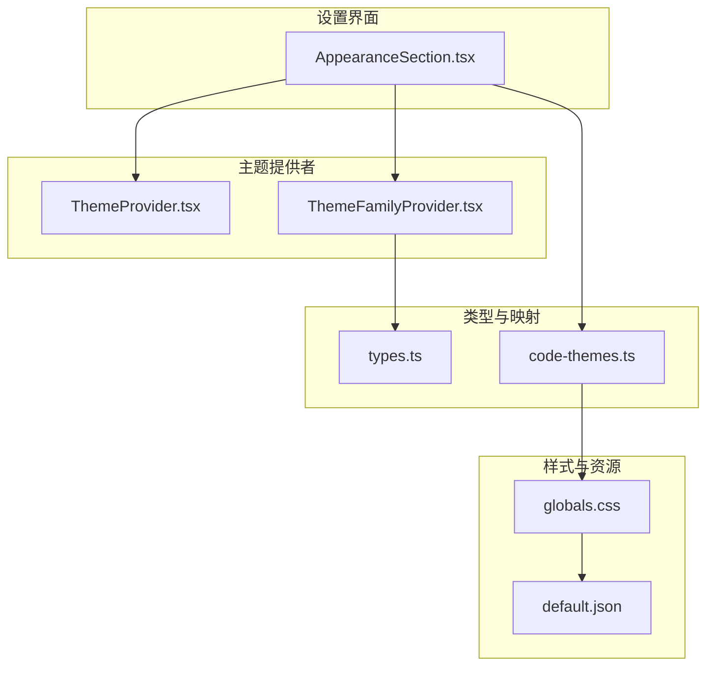
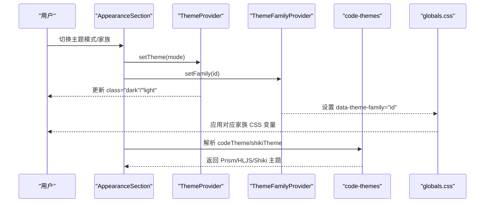
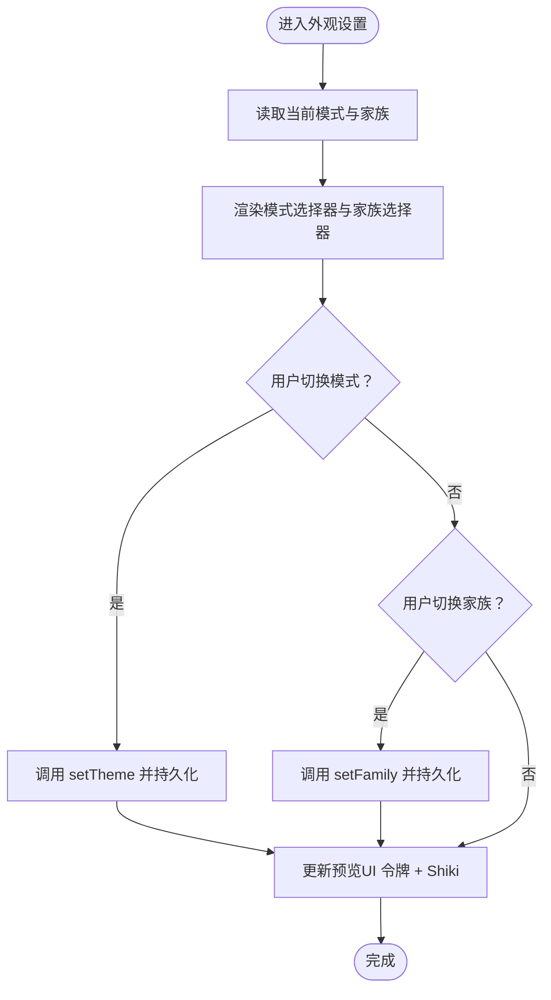
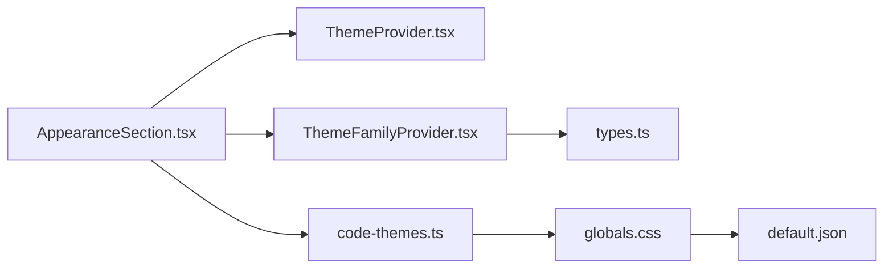

# 外观设置

<cite>
**本文引用的文件**
- [src/components/settings/AppearanceSection.tsx](file://src/components/settings/AppearanceSection.tsx)
- [src/components/layout/ThemeProvider.tsx](file://src/components/layout/ThemeProvider.tsx)
- [src/components/layout/ThemeFamilyProvider.tsx](file://src/components/layout/ThemeFamilyProvider.tsx)
- [src/hooks/useAppTheme.ts](file://src/hooks/useAppTheme.ts)
- [src/lib/theme/types.ts](file://src/lib/theme/types.ts)
- [src/lib/theme/code-themes.ts](file://src/lib/theme/code-themes.ts)
- [src/app/globals.css](file://src/app/globals.css)
- [themes/default.json](file://themes/default.json)
</cite>

## 目录
1. [简介](#简介)
2. [项目结构](#项目结构)
3. [核心组件](#核心组件)
4. [架构总览](#架构总览)
5. [详细组件分析](#详细组件分析)
6. [依赖关系分析](#依赖关系分析)
7. [性能考量](#性能考量)
8. [故障排查指南](#故障排查指南)
9. [结论](#结论)
10. [附录](#附录)

## 简介
本文件面向 CodePilot 的外观设置功能，系统性阐述主题系统的设计与实现，覆盖以下要点：
- 主题系统分层：模式（明/暗/跟随系统）与家族（颜色方案）双层控制
- 内置主题与自定义主题：默认主题与其他社区主题
- 颜色方案与 CSS 变量：基于 oklch 的设计令牌与 Tailwind v4 主题变量映射
- 代码高亮主题：Prism、HLJS、Shiki 的统一解析与回退策略
- 字体与缩放：全局字体变量与可扩展的字号体系
- 暗色/亮色模式切换：系统级联动与无过渡闪烁策略
- 动画与交互：搜索高亮、文件树闪烁、骨架屏等动效
- 响应式与无障碍：语义化结构、键盘可达性与对比度保障
- 设置持久化：主题模式与主题家族的跨会话保存

## 项目结构
外观设置涉及的前端关键文件组织如下：
- 设置页面组件：AppearanceSection 提供用户界面与持久化逻辑
- 主题提供者：ThemeProvider 负责模式层；ThemeFamilyProvider 负责家族层
- 类型与映射：types 定义主题家族与颜色令牌；code-themes 统一代码高亮主题解析
- 全局样式：globals.css 定义 CSS 变量与 Tailwind v4 主题变量映射
- 主题资源：themes 目录存放 JSON 主题家族定义

图表来源
- [src/components/settings/AppearanceSection.tsx:147-237](file://src/components/settings/AppearanceSection.tsx#L147-L237)
- [src/components/layout/ThemeProvider.tsx:1-18](file://src/components/layout/ThemeProvider.tsx#L1-L18)
- [src/components/layout/ThemeFamilyProvider.tsx:1-61](file://src/components/layout/ThemeFamilyProvider.tsx#L1-L61)
- [src/lib/theme/types.ts:49-78](file://src/lib/theme/types.ts#L49-L78)
- [src/lib/theme/code-themes.ts:139-191](file://src/lib/theme/code-themes.ts#L139-L191)
- [src/app/globals.css:6-64](file://src/app/globals.css#L6-L64)
- [themes/default.json:1-81](file://themes/default.json#L1-L81)

章节来源
- [src/components/settings/AppearanceSection.tsx:1-238](file://src/components/settings/AppearanceSection.tsx#L1-L238)
- [src/components/layout/ThemeProvider.tsx:1-18](file://src/components/layout/ThemeProvider.tsx#L1-L18)
- [src/components/layout/ThemeFamilyProvider.tsx:1-61](file://src/components/layout/ThemeFamilyProvider.tsx#L1-L61)
- [src/lib/theme/types.ts:1-79](file://src/lib/theme/types.ts#L1-L79)
- [src/lib/theme/code-themes.ts:1-192](file://src/lib/theme/code-themes.ts#L1-L192)
- [src/app/globals.css:1-378](file://src/app/globals.css#L1-L378)
- [themes/default.json:1-81](file://themes/default.json#L1-L81)

## 核心组件
- AppearanceSection：外观设置主界面，提供模式选择（亮/暗/系统）与主题家族选择，并实时预览 UI 令牌与代码高亮效果
- ThemeProvider：基于 next-themes 的模式提供者，默认“系统”，禁用过渡切换以避免闪烁
- ThemeFamilyProvider：基于本地存储的主题家族提供者，通过 data-theme-family 属性即时应用家族样式
- useAppTheme：组合访问模式与家族状态的 Hook
- globals.css：定义 CSS 变量与 Tailwind v4 主题变量映射，承载 oklch 设计令牌
- types.ts：定义 ThemeFamily、ThemeFamilyMeta、ThemeColors 等类型
- code-themes.ts：集中管理 Prism、HLJS、Shiki 的主题映射与解析函数

章节来源
- [src/components/settings/AppearanceSection.tsx:147-237](file://src/components/settings/AppearanceSection.tsx#L147-L237)
- [src/components/layout/ThemeProvider.tsx:6-17](file://src/components/layout/ThemeProvider.tsx#L6-L17)
- [src/components/layout/ThemeFamilyProvider.tsx:22-60](file://src/components/layout/ThemeFamilyProvider.tsx#L22-L60)
- [src/hooks/useAppTheme.ts:4-16](file://src/hooks/useAppTheme.ts#L4-L16)
- [src/app/globals.css:6-64](file://src/app/globals.css#L6-L64)
- [src/lib/theme/types.ts:49-78](file://src/lib/theme/types.ts#L49-L78)
- [src/lib/theme/code-themes.ts:139-191](file://src/lib/theme/code-themes.ts#L139-L191)

## 架构总览
外观系统采用“模式层 + 家族层”的双层架构：
- 模式层：由 next-themes 管理，支持 light/dark/system，自动同步系统偏好
- 家族层：由自定义 ThemeFamilyProvider 管理，通过 data-theme-family 属性与 CSS 变量联动
- 样式层：globals.css 将家族颜色映射到 Tailwind v4 主题变量，确保组件继承一致的令牌
- 代码高亮：code-themes.ts 将主题家族中的 codeTheme/shikiTheme 解析为具体渲染库所需主题

图表来源
- [src/components/settings/AppearanceSection.tsx:147-237](file://src/components/settings/AppearanceSection.tsx#L147-L237)
- [src/components/layout/ThemeProvider.tsx:6-17](file://src/components/layout/ThemeProvider.tsx#L6-L17)
- [src/components/layout/ThemeFamilyProvider.tsx:43-53](file://src/components/layout/ThemeFamilyProvider.tsx#L43-L53)
- [src/lib/theme/code-themes.ts:145-191](file://src/lib/theme/code-themes.ts#L145-L191)
- [src/app/globals.css:6-64](file://src/app/globals.css#L6-L64)

## 详细组件分析

### 外观设置界面（AppearanceSection）
- 模式选择器：提供亮/暗/系统三态按钮，使用无障碍属性 aria-checked 与 role="radiogroup"
- 家族选择器：从已加载的 ThemeFamilyMeta 列表中选择，支持预览色块
- 实时预览：
  - UI 令牌预览：展示按钮、标签、卡片等基础组件在当前家族下的呈现
  - 代码高亮预览：使用 Shiki 渲染 TypeScript 示例，按当前家族与模式选择主题
- 持久化：通过 /api/settings/app 接口 PUT 保存 theme_mode 与 theme_family

图表来源
- [src/components/settings/AppearanceSection.tsx:147-237](file://src/components/settings/AppearanceSection.tsx#L147-L237)

章节来源
- [src/components/settings/AppearanceSection.tsx:1-238](file://src/components/settings/AppearanceSection.tsx#L1-L238)

### 主题提供者（ThemeProvider）
- 使用 next-themes，attribute="class"，默认模式为 system，启用系统同步
- 禁用过渡切换（disableTransitionOnChange），避免首次渲染闪烁

章节来源
- [src/components/layout/ThemeProvider.tsx:1-18](file://src/components/layout/ThemeProvider.tsx#L1-L18)

### 主题家族提供者（ThemeFamilyProvider）
- 从 DOM data-theme-family 与 localStorage 中恢复初始家族
- setFamily 同步更新 DOM 属性与本地存储，保证即时视觉反馈
- 若存储的家族 ID 不再存在于已加载列表，则回退到默认家族

章节来源
- [src/components/layout/ThemeFamilyProvider.tsx:1-61](file://src/components/layout/ThemeFamilyProvider.tsx#L1-L61)

### 主题类型与映射（types、code-themes）
- ThemeFamily/ThemeFamilyMeta：描述家族元数据、颜色令牌、代码高亮映射
- ThemeColors：涵盖背景、前景、卡片、弹出层、主要/次要/强调/破坏性、边框/输入/环形光、图表色板、侧边栏系列等
- 代码高亮映射：
  - Prism/Hljs：提供多套主题名称到样式对象的映射，并定义默认主题
  - Shiki：提供默认浅色/深色主题名
  - 解析函数：根据家族与模式返回对应主题，若未配置则回退到默认主题

章节来源
- [src/lib/theme/types.ts:8-78](file://src/lib/theme/types.ts#L8-L78)
- [src/lib/theme/code-themes.ts:1-192](file://src/lib/theme/code-themes.ts#L1-L192)

### 全局样式与 CSS 变量（globals.css）
- 定义 :root 与 .dark 两套 CSS 变量，覆盖所有设计令牌
- 通过 @theme inline 将 CSS 变量映射到 Tailwind v4 主题变量，使组件直接消费
- 自定义滚动条、选择高亮、Prose（markdown）排版优化
- 动画：搜索高亮脉冲、文件树闪烁、骨架屏 shimmer
- 代码高亮隔离：针对 Bash/Shell 终端代码块的颜色覆盖与优先级处理

章节来源
- [src/app/globals.css:6-64](file://src/app/globals.css#L6-L64)
- [src/app/globals.css:66-187](file://src/app/globals.css#L66-L187)
- [src/app/globals.css:189-378](file://src/app/globals.css#L189-L378)

### 主题文件格式与示例（themes/default.json）
- 结构字段：
  - id、label、order、description：家族元信息
  - codeTheme/shikiTheme：分别指定 Prism/Hljs 与 Shiki 的浅色/深色主题名
  - light/dark：包含完整 ThemeColors 键集合
- 默认主题 default：提供完整的 oklch 颜色令牌，兼顾明/暗两套方案

章节来源
- [themes/default.json:1-81](file://themes/default.json#L1-L81)

## 依赖关系分析
- AppearanceSection 依赖：
  - next-themes（useTheme）用于模式控制
  - 自定义 ThemeFamilyProvider（useThemeFamily）用于家族控制
  - code-themes 解析代码高亮主题
  - 国际化 Hook 与 UI 组件库
- ThemeFamilyProvider 依赖：
  - ThemeFamilyMeta 类型
  - DOM 属性与 localStorage 进行持久化
- globals.css 依赖：
  - Tailwind v4 主题变量映射
  - CSS 变量定义与动画
- code-themes 依赖：
  - react-syntax-highlighter 的 Prism/Hljs 主题
  - Shiki 的 BundledTheme

图表来源
- [src/components/settings/AppearanceSection.tsx:1-238](file://src/components/settings/AppearanceSection.tsx#L1-L238)
- [src/components/layout/ThemeProvider.tsx:1-18](file://src/components/layout/ThemeProvider.tsx#L1-L18)
- [src/components/layout/ThemeFamilyProvider.tsx:1-61](file://src/components/layout/ThemeFamilyProvider.tsx#L1-L61)
- [src/lib/theme/code-themes.ts:1-192](file://src/lib/theme/code-themes.ts#L1-L192)
- [src/lib/theme/types.ts:1-79](file://src/lib/theme/types.ts#L1-L79)
- [src/app/globals.css:1-378](file://src/app/globals.css#L1-L378)
- [themes/default.json:1-81](file://themes/default.json#L1-L81)

## 性能考量
- 无过渡闪烁：ThemeProvider 禁用过渡切换，结合 FOUC 防护脚本（DOM 上的 data-theme-family）减少首屏闪烁
- 即时视觉反馈：ThemeFamilyProvider 在 setFamily 时立即更新 data-theme-family，避免等待重渲染
- 代码高亮预览：Shiki 预览在主题变化时异步生成 HTML，避免阻塞主线程
- CSS 变量驱动：Tailwind v4 主题变量映射减少重复样式计算，提升渲染效率

## 故障排查指南
- 切换主题后界面无变化
  - 检查 DOM 是否存在 data-theme-family 属性，确认 ThemeFamilyProvider 已正确写入
  - 确认 globals.css 中对应家族的 CSS 变量是否生效
- 模式切换无效
  - 检查 ThemeProvider 的 attribute="class" 是否被其他样式覆盖
  - 确认系统模式与浏览器设置一致
- 代码高亮预览空白
  - 确认 code-themes.ts 中的 shikiTheme 映射是否存在，或回退到默认主题
  - 检查 Shiki 渲染是否抛错（AppearanceSection 中有错误捕获）
- 设置未持久化
  - 确认 /api/settings/app 接口可用且返回成功
  - 检查浏览器是否禁用 localStorage

章节来源
- [src/components/layout/ThemeFamilyProvider.tsx:32-53](file://src/components/layout/ThemeFamilyProvider.tsx#L32-L53)
- [src/components/settings/AppearanceSection.tsx:84-93](file://src/components/settings/AppearanceSection.tsx#L84-L93)
- [src/lib/theme/code-themes.ts:183-191](file://src/lib/theme/code-themes.ts#L183-L191)

## 结论
CodePilot 的外观系统通过“模式层 + 家族层”的清晰分层，结合 CSS 变量与 Tailwind v4 主题变量映射，实现了稳定、可扩展且高性能的外观定制能力。内置主题 default 提供完整的 oklch 颜色体系，配合多种代码高亮主题与即时预览，满足不同用户的个性化需求。通过持久化与无障碍设计，系统在可用性与一致性方面达到较高水准。

## 附录

### 主题系统配置清单
- 模式（明/暗/系统）
  - 来源：ThemeProvider
  - 行为：自动同步系统偏好，禁用过渡闪烁
- 主题家族（颜色方案）
  - 来源：ThemeFamilyProvider + ThemeFamilyMeta
  - 行为：即时应用 data-theme-family，回退至默认家族
- 颜色方案与 CSS 变量
  - 来源：globals.css 的 :root/.dark 与 @theme inline
  - 覆盖：背景、前景、卡片、弹出层、主要/次要/强调/破坏性、边框/输入/环形光、图表色板、侧边栏系列
- 代码高亮主题
  - 来源：ThemeFamilyMeta.codeTheme/shikiTheme
  - 支持：Prism/Hljs（通过 react-syntax-highlighter）、Shiki（通过 shiki）
  - 回退：默认浅/深色主题
- 字体与缩放
  - 来源：globals.css 的 --font-sans/--font-mono
  - 扩展：可通过修改 CSS 变量调整字号与行高
- 动画与交互
  - 搜索高亮、文件树闪烁、骨架屏 shimmer
- 响应式与无障碍
  - 语义化结构、键盘可达性、对比度保障（基于设计令牌）

章节来源
- [src/components/layout/ThemeProvider.tsx:6-17](file://src/components/layout/ThemeProvider.tsx#L6-L17)
- [src/components/layout/ThemeFamilyProvider.tsx:22-60](file://src/components/layout/ThemeFamilyProvider.tsx#L22-L60)
- [src/app/globals.css:6-64](file://src/app/globals.css#L6-L64)
- [src/app/globals.css:272-330](file://src/app/globals.css#L272-L330)
- [src/lib/theme/code-themes.ts:139-191](file://src/lib/theme/code-themes.ts#L139-L191)
- [themes/default.json:1-81](file://themes/default.json#L1-L81)