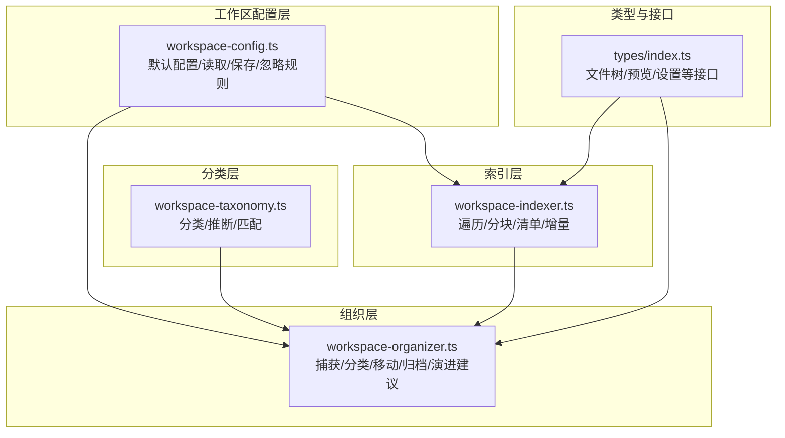
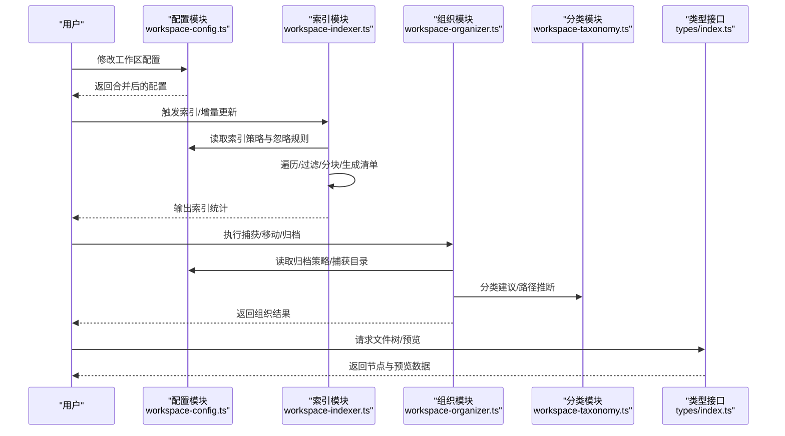
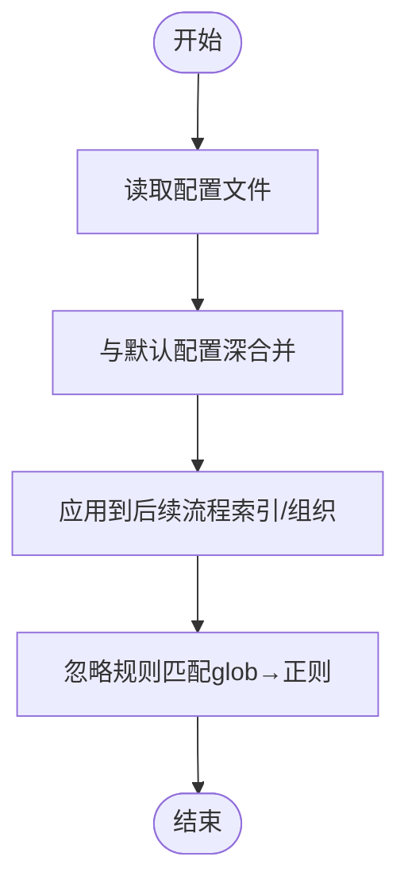
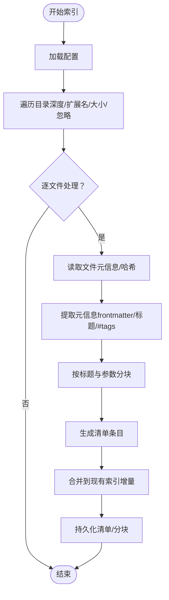
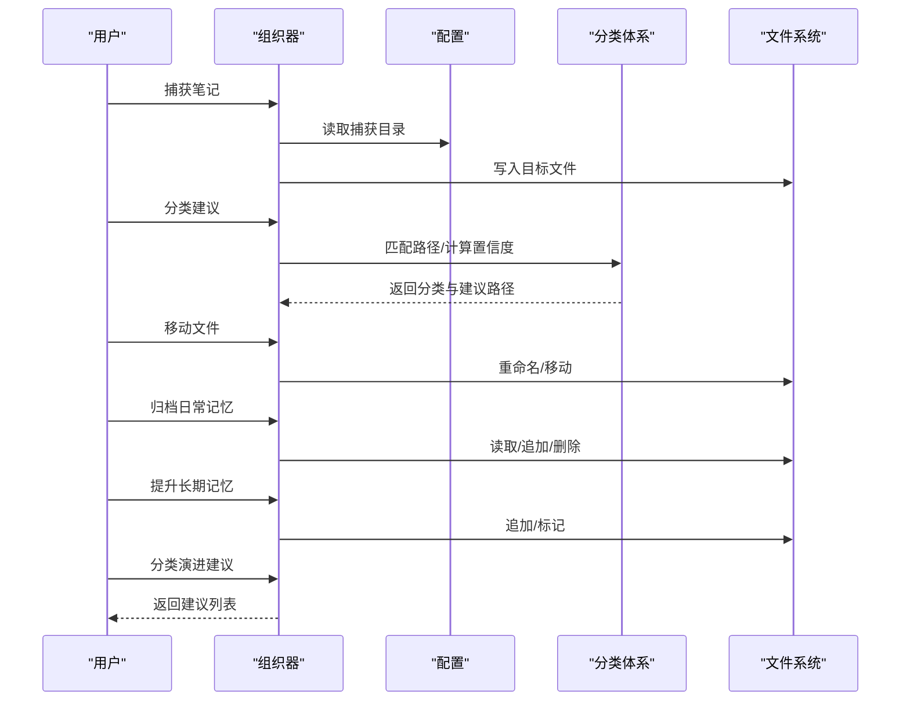
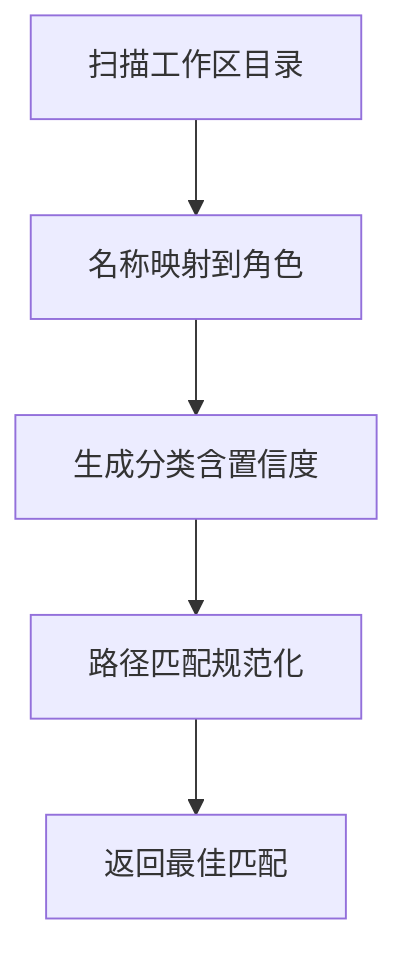
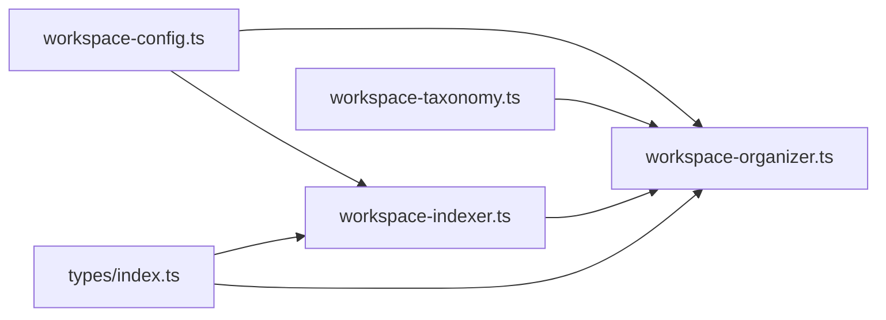

# 工作区设置

<cite>
**本文引用的文件**
- [workspace-config.ts](file://src/lib/workspace-config.ts)
- [workspace-indexer.ts](file://src/lib/workspace-indexer.ts)
- [workspace-organizer.ts](file://src/lib/workspace-organizer.ts)
- [workspace-taxonomy.ts](file://src/lib/workspace-taxonomy.ts)
- [index.ts](file://src/types/index.ts)
</cite>

## 目录
1. [简介](#简介)
2. [项目结构](#项目结构)
3. [核心组件](#核心组件)
4. [架构总览](#架构总览)
5. [详细组件分析](#详细组件分析)
6. [依赖关系分析](#依赖关系分析)
7. [性能考量](#性能考量)
8. [故障排查指南](#故障排查指南)
9. [结论](#结论)
10. [附录](#附录)

## 简介
本文件系统化阐述 CodePilot 的“工作区设置”能力，覆盖工作区配置项、项目路径管理、文件过滤规则、Git 集成建议、索引策略配置、工作区组织方式、文件树显示选项、搜索范围设置、工作区迁移与备份恢复、性能优化、工作区模板与批量配置、权限控制等主题。文档以仓库中的实际实现为依据，结合可视化图示帮助读者快速理解与落地使用。

## 项目结构
围绕工作区设置的关键模块位于 src/lib 与 src/types 中：
- 配置加载与合并：workspace-config.ts
- 索引构建与增量更新：workspace-indexer.ts
- 工作区组织与归档：workspace-organizer.ts
- 分类体系与分类建议：workspace-taxonomy.ts
- 类型与接口：types/index.ts（包含文件树节点、预览、设置等）

图表来源
- [workspace-config.ts:1-119](file://src/lib/workspace-config.ts#L1-L119)
- [workspace-indexer.ts:1-428](file://src/lib/workspace-indexer.ts#L1-L428)
- [workspace-organizer.ts:1-295](file://src/lib/workspace-organizer.ts#L1-L295)
- [workspace-taxonomy.ts:1-160](file://src/lib/workspace-taxonomy.ts#L1-L160)
- [index.ts:40-62](file://src/types/index.ts#L40-L62)

章节来源
- [workspace-config.ts:1-119](file://src/lib/workspace-config.ts#L1-L119)
- [workspace-indexer.ts:1-428](file://src/lib/workspace-indexer.ts#L1-L428)
- [workspace-organizer.ts:1-295](file://src/lib/workspace-organizer.ts#L1-L295)
- [workspace-taxonomy.ts:1-160](file://src/lib/workspace-taxonomy.ts#L1-L160)
- [index.ts:40-62](file://src/types/index.ts#L40-L62)

## 核心组件
- 工作区配置与忽略规则
  - 默认配置包含工作区类型、组织风格、捕获默认目录、归档策略、忽略规则、索引策略等。
  - 支持从工作区根目录的配置文件读取并深合并默认值，提供忽略规则的通配符匹配。
- 索引器
  - 基于配置进行递归遍历、大小与扩展名过滤、增量更新、清单与分块持久化。
  - 支持按标题与内容提取元信息，生成笔记标识与分类标签。
- 组织器
  - 提供捕获笔记、自动分类与路径建议、安全移动文件、每日记忆归档与长期记忆提升、分类体系演进建议。
- 分类体系
  - 通过目录名称推断角色（如 notes/projects/journal/archive/inbox/templates/resources/memory/daily 等），支持路径匹配与置信度评估。
- 类型支撑
  - 文件树节点、文件预览、设置等接口，用于前端展示与交互。

章节来源
- [workspace-config.ts:7-34](file://src/lib/workspace-config.ts#L7-L34)
- [workspace-config.ts:59-77](file://src/lib/workspace-config.ts#L59-L77)
- [workspace-config.ts:111-119](file://src/lib/workspace-config.ts#L111-L119)
- [workspace-indexer.ts:14-88](file://src/lib/workspace-indexer.ts#L14-L88)
- [workspace-indexer.ts:210-253](file://src/lib/workspace-indexer.ts#L210-L253)
- [workspace-indexer.ts:300-371](file://src/lib/workspace-indexer.ts#L300-L371)
- [workspace-organizer.ts:78-90](file://src/lib/workspace-organizer.ts#L78-L90)
- [workspace-organizer.ts:96-120](file://src/lib/workspace-organizer.ts#L96-L120)
- [workspace-organizer.ts:126-131](file://src/lib/workspace-organizer.ts#L126-L131)
- [workspace-organizer.ts:137-180](file://src/lib/workspace-organizer.ts#L137-L180)
- [workspace-organizer.ts:186-223](file://src/lib/workspace-organizer.ts#L186-L223)
- [workspace-organizer.ts:229-294](file://src/lib/workspace-organizer.ts#L229-L294)
- [workspace-taxonomy.ts:87-117](file://src/lib/workspace-taxonomy.ts#L87-L117)
- [workspace-taxonomy.ts:119-143](file://src/lib/workspace-taxonomy.ts#L119-L143)
- [index.ts:40-62](file://src/types/index.ts#L40-L62)

## 架构总览
工作区设置贯穿“配置—索引—组织—分类—展示”的闭环流程。配置决定索引范围与策略；索引产出清单与分块；组织器基于分类与策略对文件进行捕获、移动与归档；分类体系提供路径匹配与演进建议；类型接口支撑前端文件树与预览展示。

图表来源
- [workspace-config.ts:59-77](file://src/lib/workspace-config.ts#L59-L77)
- [workspace-indexer.ts:300-371](file://src/lib/workspace-indexer.ts#L300-L371)
- [workspace-organizer.ts:78-90](file://src/lib/workspace-organizer.ts#L78-L90)
- [workspace-organizer.ts:96-120](file://src/lib/workspace-organizer.ts#L96-L120)
- [workspace-organizer.ts:126-131](file://src/lib/workspace-organizer.ts#L126-L131)
- [workspace-organizer.ts:137-180](file://src/lib/workspace-organizer.ts#L137-L180)
- [workspace-taxonomy.ts:119-143](file://src/lib/workspace-taxonomy.ts#L119-L143)
- [index.ts:40-62](file://src/types/index.ts#L40-L62)

## 详细组件分析

### 工作区配置与忽略规则
- 配置项
  - 工作区类型、组织风格、捕获默认目录、归档策略（完成任务保留天数、关闭项目归档、日常记忆保留天数）、忽略规则（glob 语法）、索引策略（最大文件大小 KB、分块大小、分块重叠、最大深度、包含的扩展名）。
- 加载与合并
  - 读取工作区根目录下的配置文件，与默认配置进行深合并，保证未显式配置项采用默认值。
- 忽略规则
  - 将路径标准化为正斜杠，使用 globToRegex 将通配符模式转为正则表达式进行匹配，支持 **、*、? 等。

图表来源
- [workspace-config.ts:59-77](file://src/lib/workspace-config.ts#L59-L77)
- [workspace-config.ts:111-119](file://src/lib/workspace-config.ts#L111-L119)

章节来源
- [workspace-config.ts:7-34](file://src/lib/workspace-config.ts#L7-L34)
- [workspace-config.ts:59-77](file://src/lib/workspace-config.ts#L59-L77)
- [workspace-config.ts:111-119](file://src/lib/workspace-config.ts#L111-L119)

### 索引策略与增量更新
- 遍历与过滤
  - 递归遍历工作区，受最大深度、扩展名白名单、文件大小上限限制；忽略规则生效。
- 元信息提取
  - 解析 YAML 前言（title/tags/aliases）、标题行（headings）、内容中 #tag（排除代码块内）。
- 分块策略
  - 按标题分段，超过阈值再按 chunkSize 与 chunkOverlap 进行重叠切分，记录起止行号。
- 清单与分块持久化
  - 清单（manifest.jsonl）与分块（chunks.jsonl）分别存储；支持增量更新：仅对变更或缺失的文件重新索引。
- 统计与失效检测
  - 统计文件数、分块数、最后索引时间、失效条目数量（文件修改时间落后于索引）。

图表来源
- [workspace-indexer.ts:255-298](file://src/lib/workspace-indexer.ts#L255-L298)
- [workspace-indexer.ts:210-253](file://src/lib/workspace-indexer.ts#L210-L253)
- [workspace-indexer.ts:300-371](file://src/lib/workspace-indexer.ts#L300-L371)
- [workspace-indexer.ts:395-427](file://src/lib/workspace-indexer.ts#L395-L427)

章节来源
- [workspace-indexer.ts:14-88](file://src/lib/workspace-indexer.ts#L14-L88)
- [workspace-indexer.ts:210-253](file://src/lib/workspace-indexer.ts#L210-L253)
- [workspace-indexer.ts:300-371](file://src/lib/workspace-indexer.ts#L300-L371)
- [workspace-indexer.ts:395-427](file://src/lib/workspace-indexer.ts#L395-L427)

### 工作区组织与归档
- 捕获
  - 将新笔记写入配置指定的捕获目录（默认 Inbox），并进行安全路径校验（不允许绝对路径、~、越界）。
- 分类与建议
  - 基于分类体系对文件路径进行匹配，给出置信度与建议路径；无匹配时建议 Inbox。
- 移动
  - 安全移动文件，确保目标路径在工作区内且不越界。
- 归档与长期记忆提升
  - 按保留天数归档日常记忆；支持将“候选长期记忆”内容提升至长期记忆文件，并标记防重复。
- 分类演进建议
  - 基于清单统计，建议新增分类、合并或归档空分类，按置信度排序。

图表来源
- [workspace-organizer.ts:78-90](file://src/lib/workspace-organizer.ts#L78-L90)
- [workspace-organizer.ts:96-120](file://src/lib/workspace-organizer.ts#L96-L120)
- [workspace-organizer.ts:126-131](file://src/lib/workspace-organizer.ts#L126-L131)
- [workspace-organizer.ts:137-180](file://src/lib/workspace-organizer.ts#L137-L180)
- [workspace-organizer.ts:186-223](file://src/lib/workspace-organizer.ts#L186-L223)
- [workspace-organizer.ts:229-294](file://src/lib/workspace-organizer.ts#L229-L294)

章节来源
- [workspace-organizer.ts:78-90](file://src/lib/workspace-organizer.ts#L78-L90)
- [workspace-organizer.ts:96-120](file://src/lib/workspace-organizer.ts#L96-L120)
- [workspace-organizer.ts:126-131](file://src/lib/workspace-organizer.ts#L126-L131)
- [workspace-organizer.ts:137-180](file://src/lib/workspace-organizer.ts#L137-L180)
- [workspace-organizer.ts:186-223](file://src/lib/workspace-organizer.ts#L186-L223)
- [workspace-organizer.ts:229-294](file://src/lib/workspace-organizer.ts#L229-L294)

### 分类体系与路径匹配
- 目录推断
  - 通过常见目录名映射到角色（notes/projects/journal/archive/inbox/templates/resources/memory/daily 等），并赋予置信度。
- 路径匹配
  - 对文件路径进行规范化，匹配分类的路径前缀，返回最佳匹配与长度。
- 新分类建议
  - 基于目录名推断，生成新的分类建议。

图表来源
- [workspace-taxonomy.ts:87-117](file://src/lib/workspace-taxonomy.ts#L87-L117)
- [workspace-taxonomy.ts:119-143](file://src/lib/workspace-taxonomy.ts#L119-L143)
- [workspace-taxonomy.ts:145-159](file://src/lib/workspace-taxonomy.ts#L145-L159)

章节来源
- [workspace-taxonomy.ts:8-16](file://src/lib/workspace-taxonomy.ts#L8-L16)
- [workspace-taxonomy.ts:87-117](file://src/lib/workspace-taxonomy.ts#L87-L117)
- [workspace-taxonomy.ts:119-143](file://src/lib/workspace-taxonomy.ts#L119-L143)
- [workspace-taxonomy.ts:145-159](file://src/lib/workspace-taxonomy.ts#L145-L159)

### 文件树显示与搜索范围
- 文件树节点
  - 节点包含名称、路径、类型（文件/目录）、子节点、大小、扩展名等字段，便于前端渲染层级结构。
- 文件预览
  - 支持按路径与最大行数获取预览，返回内容、语言、行数、截断标记、字节读取量与总大小。
- 搜索范围
  - 索引范围由配置的忽略规则、扩展名白名单、最大深度与文件大小限制共同决定；组织器的分类建议与移动可影响搜索范围内的文件分布。

章节来源
- [index.ts:40-62](file://src/types/index.ts#L40-L62)
- [index.ts:49-62](file://src/types/index.ts#L49-L62)
- [workspace-indexer.ts:255-298](file://src/lib/workspace-indexer.ts#L255-L298)
- [workspace-config.ts:16-34](file://src/lib/workspace-config.ts#L16-L34)

## 依赖关系分析
- 配置模块为索引与组织提供策略输入；索引模块产出清单与分块供组织模块使用；分类模块为组织提供路径建议；类型模块为前端提供文件树与预览数据结构。

图表来源
- [workspace-config.ts:59-77](file://src/lib/workspace-config.ts#L59-L77)
- [workspace-indexer.ts:300-371](file://src/lib/workspace-indexer.ts#L300-L371)
- [workspace-organizer.ts:96-120](file://src/lib/workspace-organizer.ts#L96-L120)
- [workspace-taxonomy.ts:119-143](file://src/lib/workspace-taxonomy.ts#L119-L143)
- [index.ts:40-62](file://src/types/index.ts#L40-L62)

章节来源
- [workspace-config.ts:59-77](file://src/lib/workspace-config.ts#L59-L77)
- [workspace-indexer.ts:300-371](file://src/lib/workspace-indexer.ts#L300-L371)
- [workspace-organizer.ts:96-120](file://src/lib/workspace-organizer.ts#L96-L120)
- [workspace-taxonomy.ts:119-143](file://src/lib/workspace-taxonomy.ts#L119-L143)
- [index.ts:40-62](file://src/types/index.ts#L40-L62)

## 性能考量
- 增量索引
  - 通过比较文件修改时间与索引清单，仅对变更文件重新索引，减少 I/O 开销。
- 过滤前置
  - 在遍历阶段即按扩展名、大小、忽略规则过滤，避免无效读取。
- 分块与重叠
  - 合理设置分块大小与重叠，平衡检索精度与索引体积。
- 安全路径校验
  - 组织器对移动与捕获路径进行严格校验，避免越界与潜在错误导致的额外开销。

章节来源
- [workspace-indexer.ts:300-371](file://src/lib/workspace-indexer.ts#L300-L371)
- [workspace-indexer.ts:255-298](file://src/lib/workspace-indexer.ts#L255-L298)
- [workspace-organizer.ts:16-45](file://src/lib/workspace-organizer.ts#L16-L45)

## 故障排查指南
- 配置读取失败
  - 若配置文件不存在或解析异常，将回退到默认配置。检查工作区根目录配置文件是否存在与 JSON 格式是否正确。
- 忽略规则不生效
  - 确认路径使用正斜杠标准化；检查 glob 模式是否符合预期；确认忽略规则优先级高于包含规则。
- 索引未更新
  - 检查文件修改时间是否更新；确认未触发增量保护（文件未变更）；必要时强制重建索引。
- 组织操作失败
  - 捕获/移动路径需满足安全校验（相对路径、不越界、不使用符号链接逃逸）；若失败，检查路径与边界条件。
- 分类建议不准确
  - 检查分类体系文件是否正确；确认目录命名是否符合角色映射；必要时手动调整分类路径前缀。

章节来源
- [workspace-config.ts:65-67](file://src/lib/workspace-config.ts#L65-L67)
- [workspace-indexer.ts:192-208](file://src/lib/workspace-indexer.ts#L192-L208)
- [workspace-organizer.ts:16-45](file://src/lib/workspace-organizer.ts#L16-L45)
- [workspace-taxonomy.ts:22-39](file://src/lib/workspace-taxonomy.ts#L22-L39)

## 结论
工作区设置通过“配置—索引—组织—分类—展示”的闭环，实现了对项目路径、文件过滤、索引策略的精细控制，并提供了组织与归档自动化、分类体系演进与文件树/预览展示能力。遵循本文档的配置与使用建议，可在保证性能与安全的前提下，高效管理大规模知识资产。

## 附录

### 工作区配置选项速览
- 工作区类型：general
- 组织风格：mixed
- 捕获默认目录：Inbox
- 归档策略
  - 完成任务归档天数：30
  - 关闭项目归档：启用
  - 日常记忆保留天数：30
- 忽略规则（示例）
  - .obsidian/**
  - .trash/**
  - *.png, *.jpg, *.jpeg, *.gif, *.mp4
  - node_modules/**
  - .git/**
- 索引策略
  - 最大文件大小（KB）：512
  - 分块大小：1200
  - 分块重叠：150
  - 最大深度：8
  - 包含扩展名：.md, .txt, .markdown

章节来源
- [workspace-config.ts:7-34](file://src/lib/workspace-config.ts#L7-L34)

### 工作区组织方式与文件树显示
- 组织方式
  - 捕获：写入捕获目录（默认 Inbox）
  - 分类：基于分类体系建议路径
  - 移动：安全移动到建议位置
  - 归档：按保留天数归档日常记忆
  - 提升：将候选长期记忆提升至长期记忆文件
- 文件树显示
  - 节点字段：名称、路径、类型、子节点、大小、扩展名
  - 预览字段：内容、语言、行数、截断标记、字节读取量与总大小

章节来源
- [workspace-organizer.ts:78-90](file://src/lib/workspace-organizer.ts#L78-L90)
- [workspace-organizer.ts:96-120](file://src/lib/workspace-organizer.ts#L96-L120)
- [workspace-organizer.ts:126-131](file://src/lib/workspace-organizer.ts#L126-L131)
- [workspace-organizer.ts:137-180](file://src/lib/workspace-organizer.ts#L137-L180)
- [workspace-organizer.ts:186-223](file://src/lib/workspace-organizer.ts#L186-L223)
- [index.ts:40-62](file://src/types/index.ts#L40-L62)
- [index.ts:49-62](file://src/types/index.ts#L49-L62)

### 搜索范围设置
- 搜索范围由以下因素共同决定：
  - 忽略规则（glob）
  - 扩展名白名单
  - 最大深度
  - 文件大小上限
- 建议
  - 在配置中明确包含/排除规则，合理设置最大深度与文件大小上限，以控制索引规模与搜索效率。

章节来源
- [workspace-config.ts:16-34](file://src/lib/workspace-config.ts#L16-L34)
- [workspace-indexer.ts:255-298](file://src/lib/workspace-indexer.ts#L255-L298)

### 工作区迁移、备份与恢复
- 迁移
  - 将工作区根目录整体复制到新位置；在新环境重新初始化索引；必要时调整捕获目录与分类体系。
- 备份
  - 备份工作区根目录；同时备份索引目录（.assistant/index）以加速恢复。
- 恢复
  - 恢复根目录与索引；如需重新组织，可运行分类演进建议并手动调整分类体系。

章节来源
- [workspace-indexer.ts:8](file://src/lib/workspace-indexer.ts#L8)
- [workspace-organizer.ts:229-294](file://src/lib/workspace-organizer.ts#L229-L294)

### 权限控制与安全
- 路径安全
  - 组织器对捕获与移动路径进行严格校验，禁止绝对路径、~、越界与符号链接逃逸。
- 归档与提升
  - 归档与提升操作具备幂等性与重复防护（如长期记忆提升标记）。

章节来源
- [workspace-organizer.ts:16-45](file://src/lib/workspace-organizer.ts#L16-L45)
- [workspace-organizer.ts:186-223](file://src/lib/workspace-organizer.ts#L186-L223)

### 工作区模板与批量配置
- 模板
  - 可在模板目录下维护常用模板，配合捕获与分类建议统一管理。
- 批量配置
  - 通过调整配置文件中的忽略规则、扩展名白名单与索引参数，实现对多文件类型的批量处理策略。

章节来源
- [workspace-config.ts:16-34](file://src/lib/workspace-config.ts#L16-L34)
- [workspace-taxonomy.ts:145-159](file://src/lib/workspace-taxonomy.ts#L145-L159)