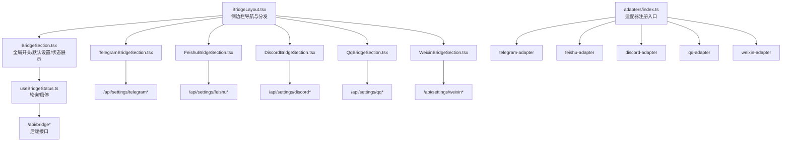
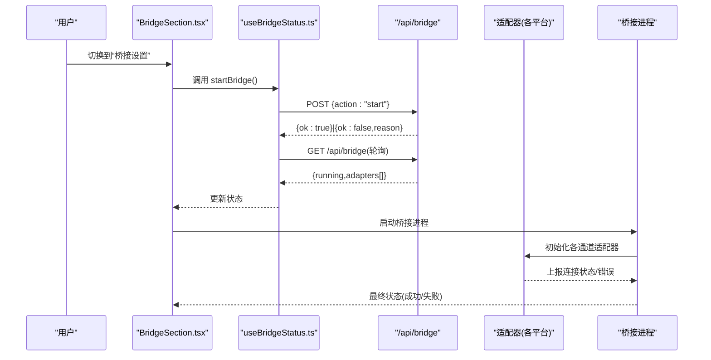
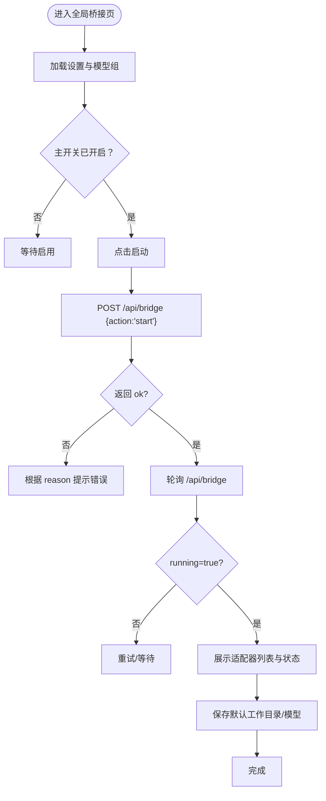
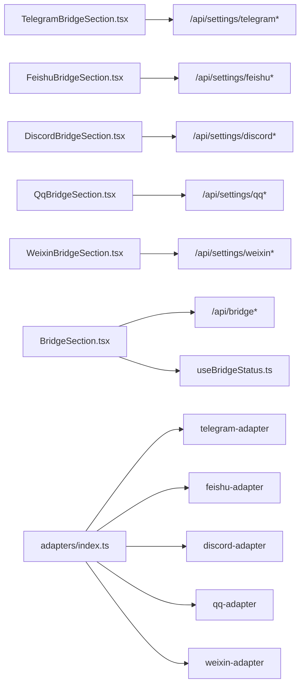

# 桥接通道设置

<cite>
**本文引用的文件**
- [BridgeLayout.tsx](file://src/components/bridge/BridgeLayout.tsx)
- [BridgeSection.tsx](file://src/components/bridge/BridgeSection.tsx)
- [TelegramBridgeSection.tsx](file://src/components/bridge/TelegramBridgeSection.tsx)
- [FeishuBridgeSection.tsx](file://src/components/bridge/FeishuBridgeSection.tsx)
- [DiscordBridgeSection.tsx](file://src/components/bridge/DiscordBridgeSection.tsx)
- [QqBridgeSection.tsx](file://src/components/bridge/QqBridgeSection.tsx)
- [WeixinBridgeSection.tsx](file://src/components/bridge/WeixinBridgeSection.tsx)
- [useBridgeStatus.ts](file://src/hooks/useBridgeStatus.ts)
- [adapters/index.ts](file://src/lib/bridge/adapters/index.ts)
</cite>

## 目录
1. [简介](#简介)
2. [项目结构](#项目结构)
3. [核心组件](#核心组件)
4. [架构总览](#架构总览)
5. [详细组件分析](#详细组件分析)
6. [依赖关系分析](#依赖关系分析)
7. [性能与可用性考虑](#性能与可用性考虑)
8. [故障排查指南](#故障排查指南)
9. [结论](#结论)
10. [附录：各平台配置清单与步骤](#附录各平台配置清单与步骤)

## 简介
本文件面向 CodePilot 的“桥接通道设置”功能，系统化说明如何在应用内配置与管理多平台即时通讯（IM）桥接通道，覆盖 Telegram、飞书、Discord、QQ、微信等渠道。内容包括：
- 认证流程与凭证保存
- Webhook/机器人接入要点
- 消息路由规则与权限控制
- 默认工作目录与模型设置
- 桥接状态监控、日志查看与故障诊断
- 桥接测试、消息格式转换与错误处理建议

## 项目结构
桥接设置界面由一个布局组件负责导航与分发，各 IM 渠道分别有独立的配置页面组件；底层通过自定义 Hook 获取桥接状态并提供启动/停止能力；适配器注册通过适配器目录统一导入。

图表来源
- [BridgeLayout.tsx:47-109](file://src/components/bridge/BridgeLayout.tsx#L47-L109)
- [BridgeSection.tsx:51-509](file://src/components/bridge/BridgeSection.tsx#L51-L509)
- [TelegramBridgeSection.tsx:23-293](file://src/components/bridge/TelegramBridgeSection.tsx#L23-L293)
- [FeishuBridgeSection.tsx:74-691](file://src/components/bridge/FeishuBridgeSection.tsx#L74-L691)
- [DiscordBridgeSection.tsx:44-351](file://src/components/bridge/DiscordBridgeSection.tsx#L44-L351)
- [QqBridgeSection.tsx:29-286](file://src/components/bridge/QqBridgeSection.tsx#L29-L286)
- [WeixinBridgeSection.tsx:24-407](file://src/components/bridge/WeixinBridgeSection.tsx#L24-L407)
- [useBridgeStatus.ts:21-103](file://src/hooks/useBridgeStatus.ts#L21-L103)
- [adapters/index.ts:12-16](file://src/lib/bridge/adapters/index.ts#L12-L16)

章节来源
- [BridgeLayout.tsx:1-110](file://src/components/bridge/BridgeLayout.tsx#L1-L110)
- [BridgeSection.tsx:1-510](file://src/components/bridge/BridgeSection.tsx#L1-L510)
- [useBridgeStatus.ts:1-104](file://src/hooks/useBridgeStatus.ts#L1-L104)
- [adapters/index.ts:1-17](file://src/lib/bridge/adapters/index.ts#L1-L17)

## 核心组件
- 布局与导航：侧边栏切换不同渠道配置页，支持从 URL hash 同步当前激活项。
- 全局桥接设置：主开关、自动启动、默认工作目录与默认模型选择、桥接运行状态与适配器列表。
- 启停控制：通过 Hook 轮询状态并在运行时定时刷新；启动失败返回原因码用于提示。
- 适配器注册：集中导入所有可用通道适配器，便于扩展新通道。

章节来源
- [BridgeLayout.tsx:47-109](file://src/components/bridge/BridgeLayout.tsx#L47-L109)
- [BridgeSection.tsx:51-509](file://src/components/bridge/BridgeSection.tsx#L51-L509)
- [useBridgeStatus.ts:21-103](file://src/hooks/useBridgeStatus.ts#L21-L103)
- [adapters/index.ts:12-16](file://src/lib/bridge/adapters/index.ts#L12-L16)

## 架构总览
桥接系统采用“前端配置 + 后端桥接进程 + 适配器”的分层设计：
- 前端：各渠道配置页负责收集凭证与策略；全局页负责启停与状态展示。
- 后端：桥接进程根据已启用的通道与适配器运行；提供状态查询与启停接口。
- 适配器：按通道类型实现消息收发、鉴权、路由与错误处理。

图表来源
- [BridgeSection.tsx:178-192](file://src/components/bridge/BridgeSection.tsx#L178-L192)
- [useBridgeStatus.ts:65-100](file://src/hooks/useBridgeStatus.ts#L65-L100)

## 详细组件分析

### 全局桥接设置（BridgeSection）
- 功能要点
  - 主开关：启用/禁用远程桥接。
  - 启停控制：调用后端启停接口；启动失败时根据原因码提示。
  - 通道开关：分别控制 Telegram、飞书、Discord、QQ、微信是否启用。
  - 自动启动：开机或服务重启后自动尝试启动。
  - 默认设置：默认工作目录、默认模型（来自 Provider 模型组）。
  - 状态展示：显示桥接运行状态、适配器数量、每个适配器最近消息时间与错误信息。
- 关键交互
  - 读取与保存设置：通过 /api/bridge/settings 进行 GET/PUT。
  - 获取 Provider 模型组：/api/providers/models。
  - 启停桥接：/api/bridge（POST），轮询 /api/bridge（GET）。

图表来源
- [BridgeSection.tsx:60-192](file://src/components/bridge/BridgeSection.tsx#L60-L192)
- [useBridgeStatus.ts:34-63](file://src/hooks/useBridgeStatus.ts#L34-L63)

章节来源
- [BridgeSection.tsx:51-509](file://src/components/bridge/BridgeSection.tsx#L51-L509)
- [useBridgeStatus.ts:21-103](file://src/hooks/useBridgeStatus.ts#L21-L103)

### Telegram 桥接（TelegramBridgeSection）
- 凭证与验证
  - 机器人令牌与聊天 ID；可一键检测聊天 ID；支持验证机器人连通性。
  - 支持允许用户白名单。
- 配置要点
  - 令牌与聊天 ID 保存至 /api/settings/telegram。
  - 验证接口支持“检测聊天 ID”和“验证连通性”两种动作。
- 设置向导
  - 提供官方文档中的典型步骤清单，便于对照配置。

章节来源
- [TelegramBridgeSection.tsx:23-293](file://src/components/bridge/TelegramBridgeSection.tsx#L23-L293)

### 飞书桥接（FeishuBridgeSection）
- 快速绑定
  - 提供“快速创建并绑定”流程，打开浏览器授权页，后台轮询授权结果。
  - 支持取消会话，避免遗留无效绑定。
- 手动配置
  - 应用 ID、应用密钥、域名（飞书/Lark）；支持验证。
  - 访问策略：私聊策略（开放/配对/白名单/禁用）、群组策略（开放/白名单/禁用）、允许来源组织/部门、是否需要 @ 机器人、线程会话模式。
- 设置向导
  - 提供官方文档中的典型步骤清单。

章节来源
- [FeishuBridgeSection.tsx:74-691](file://src/components/bridge/FeishuBridgeSection.tsx#L74-L691)

### Discord 桥接（DiscordBridgeSection）
- 凭证与验证
  - 机器人令牌；支持验证机器人信息。
- 权限与路由
  - 允许用户/频道/服务器 ID 白名单；群组策略（开放/禁用）；是否必须 @ 机器人；流式预览开关；最大附件尺寸。
- 设置向导
  - 提供官方文档中的典型步骤清单。

章节来源
- [DiscordBridgeSection.tsx:44-351](file://src/components/bridge/DiscordBridgeSection.tsx#L44-L351)

### QQ 桥接（QqBridgeSection）
- 凭证与验证
  - 应用 ID、应用密钥；支持验证。
- 权限与媒体
  - 允许用户白名单；图片开关与最大图片大小限制。
- 设置向导
  - 提供官方文档中的典型步骤清单。

章节来源
- [QqBridgeSection.tsx:29-286](file://src/components/bridge/QqBridgeSection.tsx#L29-L286)

### 微信桥接（WeixinBridgeSection）
- 多账号管理
  - 支持列出已绑定账号、启用/暂停、删除。
- 二维码登录
  - 启动二维码登录流程，轮询扫码状态；成功后自动刷新账号列表。
  - 成功确认可能触发桥接重启，若重启失败会给出警告提示。
- 风险提示
  - 明确风险提示，提醒用户注意安全与合规。

章节来源
- [WeixinBridgeSection.tsx:24-407](file://src/components/bridge/WeixinBridgeSection.tsx#L24-L407)

## 依赖关系分析
- 组件耦合
  - BridgeLayout 仅负责导航与分发，低耦合。
  - 各渠道配置页独立，仅依赖各自 API。
  - 全局页依赖 useBridgeStatus 以统一获取状态与启停。
- 适配器注册
  - 通过 adapters/index.ts 统一导入，新增通道只需添加适配器文件与导入行。
- 外部依赖
  - 各渠道均通过 /api/settings/* 与 /api/settings/<channel>/... 接口进行配置与验证。
  - 桥接进程与适配器负责实际的消息收发与错误上报。

图表来源
- [TelegramBridgeSection.tsx:37-172](file://src/components/bridge/TelegramBridgeSection.tsx#L37-L172)
- [FeishuBridgeSection.tsx:142-407](file://src/components/bridge/FeishuBridgeSection.tsx#L142-L407)
- [DiscordBridgeSection.tsx:62-160](file://src/components/bridge/DiscordBridgeSection.tsx#L62-L160)
- [QqBridgeSection.tsx:44-145](file://src/components/bridge/QqBridgeSection.tsx#L44-L145)
- [WeixinBridgeSection.tsx:37-241](file://src/components/bridge/WeixinBridgeSection.tsx#L37-L241)
- [BridgeSection.tsx:60-192](file://src/components/bridge/BridgeSection.tsx#L60-L192)
- [useBridgeStatus.ts:34-100](file://src/hooks/useBridgeStatus.ts#L34-L100)
- [adapters/index.ts:12-16](file://src/lib/bridge/adapters/index.ts#L12-L16)

章节来源
- [adapters/index.ts:1-17](file://src/lib/bridge/adapters/index.ts#L1-L17)

## 性能与可用性考虑
- 状态轮询
  - 启动后每 5 秒轮询一次桥接状态，避免频繁请求带来的压力。
- 保存与验证
  - 保存操作使用异步 PUT 请求，验证操作提供“正在验证/验证失败/验证成功”反馈。
- 错误提示
  - 启动失败时根据原因码区分“未启用桥接”“无通道启用”“适配器未启动”“网络错误”等场景，提升可诊断性。
- 适配器并发
  - 多通道适配器并行运行，注意资源占用与限流策略（如 Discord 附件大小、QQ 图片大小）。

[本节为通用建议，无需特定文件来源]

## 故障排查指南
- 启动失败
  - 若返回“适配器配置无效”，检查对应渠道的凭证与权限设置（如 Telegram 的聊天 ID、飞书的应用 ID/密钥、Discord 的机器人令牌与权限）。
  - 若返回“网络错误”，检查本地网络与代理设置。
- 无法接收消息
  - 确认通道开关已启用且适配器处于运行状态；检查白名单与@要求设置。
- 验证失败
  - 重新填写凭证并点击验证；确保网络可达；必要时清理缓存后重试。
- 微信登录异常
  - 若二维码登录失败或过期，重新发起登录流程；若确认后桥接重启失败，查看提示并按需手动重启桥接进程。
- 日志与监控
  - 在全局页查看适配器最后消息时间与错误信息；若长时间无消息，检查网络与凭证有效性。

章节来源
- [BridgeSection.tsx:178-192](file://src/components/bridge/BridgeSection.tsx#L178-L192)
- [WeixinBridgeSection.tsx:138-241](file://src/components/bridge/WeixinBridgeSection.tsx#L138-L241)

## 结论
桥接通道设置提供了统一的 UI 与后端接口，覆盖主流 IM 渠道的凭证配置、权限控制与状态监控。通过适配器注册机制，系统具备良好的扩展性；通过全局启停与轮询机制，保证了可观测性与可维护性。建议在生产环境中结合白名单、限额与日志策略，确保安全与稳定。

[本节为总结，无需特定文件来源]

## 附录：各平台配置清单与步骤
以下为各平台常见配置要点与步骤（基于各组件中提供的向导文本）：

- Telegram
  - 令牌与聊天 ID；可检测聊天 ID；验证连通性；允许用户白名单。
  - 步骤要点：创建机器人、获取令牌、与机器人对话获取聊天 ID、保存并验证。

- 飞书
  - 应用 ID、应用密钥、域名（飞书/Lark）；私聊/群组策略；允许来源；是否需要 @；线程会话；验证。
  - 快速绑定：浏览器授权、轮询结果、绑定成功后刷新列表。

- Discord
  - 机器人令牌；允许用户/频道/服务器白名单；群组策略；是否需要 @；流式预览；最大附件尺寸。
  - 步骤要点：开发者门户创建应用与机器人、复制令牌、授权链接、配置权限。

- QQ
  - 应用 ID、应用密钥；允许用户白名单；图片开关与最大图片大小。

- 微信
  - 多账号管理：启用/暂停/删除；二维码登录流程；确认后桥接重启可能失败的提示。

章节来源
- [TelegramBridgeSection.tsx:280-290](file://src/components/bridge/TelegramBridgeSection.tsx#L280-L290)
- [FeishuBridgeSection.tsx:681-688](file://src/components/bridge/FeishuBridgeSection.tsx#L681-L688)
- [DiscordBridgeSection.tsx:319-347](file://src/components/bridge/DiscordBridgeSection.tsx#L319-L347)
- [QqBridgeSection.tsx:273-282](file://src/components/bridge/QqBridgeSection.tsx#L273-L282)
- [WeixinBridgeSection.tsx:392-403](file://src/components/bridge/WeixinBridgeSection.tsx#L392-L403)