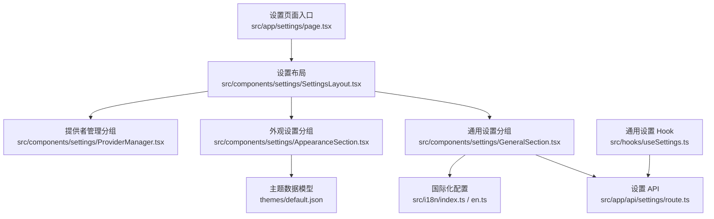
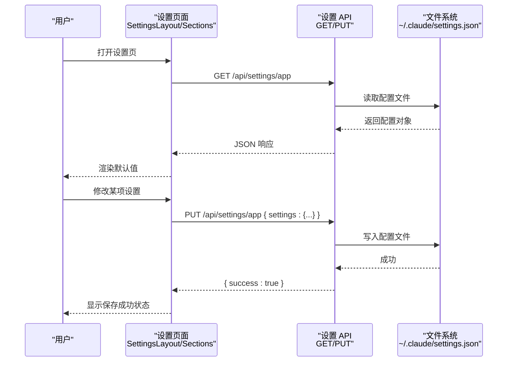
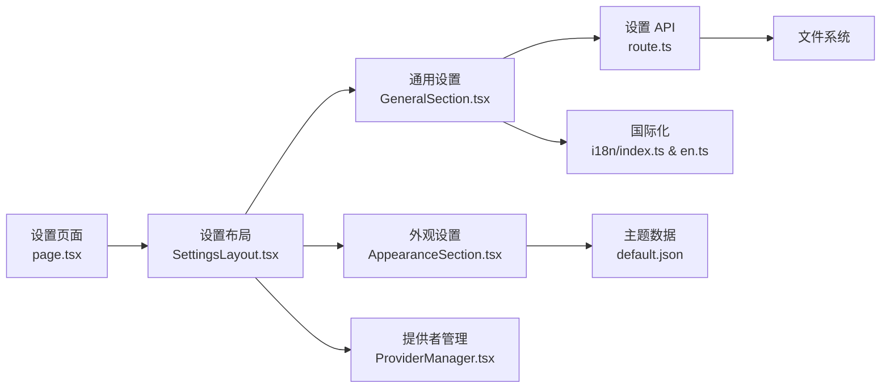

# 通用设置

<cite>
**本文引用的文件**
- [src/app/settings/page.tsx](file://src/app/settings/page.tsx)
- [src/components/settings/SettingsLayout.tsx](file://src/components/settings/SettingsLayout.tsx)
- [src/components/settings/GeneralSection.tsx](file://src/components/settings/GeneralSection.tsx)
- [src/components/settings/AppearanceSection.tsx](file://src/components/settings/AppearanceSection.tsx)
- [src/app/api/settings/route.ts](file://src/app/api/settings/route.ts)
- [src/hooks/useSettings.ts](file://src/hooks/useSettings.ts)
- [src/i18n/index.ts](file://src/i18n/index.ts)
- [src/i18n/en.ts](file://src/i18n/en.ts)
- [themes/default.json](file://themes/default.json)
- [src/components/settings/ProviderManager.tsx](file://src/components/settings/ProviderManager.tsx)
</cite>

## 目录
1. [简介](#简介)
2. [项目结构](#项目结构)
3. [核心组件](#核心组件)
4. [架构总览](#架构总览)
5. [详细组件分析](#详细组件分析)
6. [依赖关系分析](#依赖关系分析)
7. [性能考量](#性能考量)
8. [故障排除指南](#故障排除指南)
9. [结论](#结论)
10. [附录](#附录)

## 简介
本文件系统化梳理 CodePilot 的通用设置功能，覆盖应用基础配置项（语言、主题、界面布局、窗口行为等）、设置生效范围与优先级、默认值与可选项、导入导出与重置恢复、配置验证与最佳实践，并提供常见场景下的排障建议。目标是帮助开发者与用户以一致的方式理解、使用与维护设置。

## 项目结构
通用设置页面由客户端路由入口加载，通过设置布局组件组织多个设置分组；后端提供统一的设置读写 API；国际化模块负责多语言支持；主题系统提供颜色家族与代码高亮主题映射；提供者管理组件扩展了设置生态。

图表来源
- [src/app/settings/page.tsx:1-20](file://src/app/settings/page.tsx#L1-L20)
- [src/components/settings/SettingsLayout.tsx:1-113](file://src/components/settings/SettingsLayout.tsx#L1-L113)
- [src/components/settings/GeneralSection.tsx:1-414](file://src/components/settings/GeneralSection.tsx#L1-L414)
- [src/components/settings/AppearanceSection.tsx:1-238](file://src/components/settings/AppearanceSection.tsx#L1-L238)
- [src/app/api/settings/route.ts:1-61](file://src/app/api/settings/route.ts#L1-L61)
- [src/hooks/useSettings.ts:1-59](file://src/hooks/useSettings.ts#L1-L59)
- [src/i18n/index.ts:1-38](file://src/i18n/index.ts#L1-L38)
- [src/i18n/en.ts:1-200](file://src/i18n/en.ts#L1-L200)
- [themes/default.json:1-81](file://themes/default.json#L1-L81)

章节来源
- [src/app/settings/page.tsx:1-20](file://src/app/settings/page.tsx#L1-L20)
- [src/components/settings/SettingsLayout.tsx:1-113](file://src/components/settings/SettingsLayout.tsx#L1-L113)

## 核心组件
- 设置页面入口：负责懒加载与骨架屏展示，挂载设置布局。
- 设置布局：侧边导航与内容区，支持哈希驱动的分组切换。
- 通用设置分组：集中管理语言、默认面板、自动批准、生成式 UI、错误上报、更新检测等。
- 外观设置分组：主题模式（浅色/深色/系统）、主题家族选择、代码高亮预览与 UI 预览。
- 设置 API：读取与保存用户设置至本地用户目录下的配置文件。
- 国际化：支持中英双语，键值来自英文词典并按需回退。
- 主题数据模型：定义主题家族的颜色与代码高亮映射。
- 提供者管理：扩展设置生态，连接与管理各类大模型提供方。

章节来源
- [src/components/settings/GeneralSection.tsx:125-374](file://src/components/settings/GeneralSection.tsx#L125-L374)
- [src/components/settings/AppearanceSection.tsx:147-238](file://src/components/settings/AppearanceSection.tsx#L147-L238)
- [src/app/api/settings/route.ts:28-61](file://src/app/api/settings/route.ts#L28-L61)
- [src/i18n/index.ts:6-11](file://src/i18n/index.ts#L6-L11)
- [themes/default.json:1-81](file://themes/default.json#L1-L81)
- [src/components/settings/ProviderManager.tsx:50-834](file://src/components/settings/ProviderManager.tsx#L50-L834)

## 架构总览
设置系统采用“前端表单 + 后端持久化”的分层设计。前端通过通用 Hook 或直接调用 API 完成读取与保存；后端以用户主目录下的 JSON 文件作为持久化介质；国际化与主题系统分别在 UI 层与渲染层提供支撑。

图表来源
- [src/app/settings/page.tsx:7-19](file://src/app/settings/page.tsx#L7-L19)
- [src/components/settings/SettingsLayout.tsx:45-112](file://src/components/settings/SettingsLayout.tsx#L45-L112)
- [src/components/settings/GeneralSection.tsx:135-216](file://src/components/settings/GeneralSection.tsx#L135-L216)
- [src/components/settings/AppearanceSection.tsx:139-161](file://src/components/settings/AppearanceSection.tsx#L139-L161)
- [src/app/api/settings/route.ts:28-61](file://src/app/api/settings/route.ts#L28-L61)

## 详细组件分析

### 设置页面与布局
- 页面入口负责加载设置布局并提供骨架屏。
- 布局组件提供侧边栏导航，支持通过 URL 哈希切换分组；内部使用外部存储订阅实现无副作用的状态同步。
- 分组包括：通用、提供者、Claude CLI、使用统计、助理工作区。

章节来源
- [src/app/settings/page.tsx:7-19](file://src/app/settings/page.tsx#L7-L19)
- [src/components/settings/SettingsLayout.tsx:45-112](file://src/components/settings/SettingsLayout.tsx#L45-L112)

### 通用设置（语言、主题、界面布局、窗口行为）
- 语言选择：基于支持列表动态渲染，保存于本地存储并影响 UI 文案。
- 默认面板：控制新会话启动时自动打开的侧边面板（无/文件树/仪表盘/Git）。
- 自动批准：危险开关，绕过权限校验，需要二次确认弹窗。
- 生成式 UI：控制是否启用交互式可视化（图表/图示/原型），影响 token 消耗。
- 错误上报：匿名错误上报开关，同时更新本地存储与后端接口。
- 更新检测：内置版本号与更新提示，支持下载与安装流程。
- 外观设置：主题模式（浅色/深色/系统）、主题家族选择、代码高亮与 UI 预览。

章节来源
- [src/components/settings/GeneralSection.tsx:125-374](file://src/components/settings/GeneralSection.tsx#L125-L374)
- [src/components/settings/AppearanceSection.tsx:147-238](file://src/components/settings/AppearanceSection.tsx#L147-L238)
- [src/i18n/index.ts:6-11](file://src/i18n/index.ts#L6-L11)
- [src/i18n/en.ts:100-147](file://src/i18n/en.ts#L100-L147)

### 外观设置（主题与代码高亮）
- 主题模式：通过第三方主题库切换，支持系统跟随；持久化保存。
- 主题家族：从主题集合中选择，提供颜色预览与代码高亮映射。
- 代码高亮预览：根据所选主题家族与模式生成示例高亮片段。
- UI 预览：展示按钮、徽章、卡片等 UI 组件在当前主题下的呈现。

章节来源
- [src/components/settings/AppearanceSection.tsx:147-238](file://src/components/settings/AppearanceSection.tsx#L147-L238)
- [themes/default.json:1-81](file://themes/default.json#L1-L81)

### 设置 API（读取与保存）
- 读取：返回用户目录下配置文件中的 settings 对象。
- 保存：接收 settings 对象并写入配置文件；失败时返回错误。
- 存储位置：用户主目录下的特定子目录与文件名。

章节来源
- [src/app/api/settings/route.ts:28-61](file://src/app/api/settings/route.ts#L28-L61)

### 国际化与翻译
- 支持语言：中英双语，键值来源于英文词典，未命中时回退英文。
- 语言切换：在通用设置分组中选择，立即影响 UI 文案。

章节来源
- [src/i18n/index.ts:6-11](file://src/i18n/index.ts#L6-L11)
- [src/i18n/en.ts:100-147](file://src/i18n/en.ts#L100-L147)

### 主题数据模型
- 主题家族包含颜色体系与代码高亮映射，支持明暗两套配色。
- 外观设置通过主题家族与模式组合决定最终渲染效果。

章节来源
- [themes/default.json:1-81](file://themes/default.json#L1-L81)

### 提供者管理（扩展设置生态）
- 连接与断开提供者、快速预设接入、全局默认模型选择、媒体生成默认提供者等。
- 与设置系统协同工作，扩展设置边界。

章节来源
- [src/components/settings/ProviderManager.tsx:50-834](file://src/components/settings/ProviderManager.tsx#L50-L834)

## 依赖关系分析
- 设置页面依赖设置布局与各设置分组组件。
- 通用与外观设置分组依赖设置 API 与国际化模块。
- 外观设置依赖主题数据模型与第三方代码高亮库。
- 设置 API 依赖文件系统进行持久化。
- 提供者管理组件与设置系统并列存在，共同构成设置生态。

图表来源
- [src/app/settings/page.tsx:1-20](file://src/app/settings/page.tsx#L1-L20)
- [src/components/settings/SettingsLayout.tsx:1-113](file://src/components/settings/SettingsLayout.tsx#L1-L113)
- [src/components/settings/GeneralSection.tsx:1-414](file://src/components/settings/GeneralSection.tsx#L1-L414)
- [src/components/settings/AppearanceSection.tsx:1-238](file://src/components/settings/AppearanceSection.tsx#L1-L238)
- [src/app/api/settings/route.ts:1-61](file://src/app/api/settings/route.ts#L1-L61)
- [src/i18n/index.ts:1-38](file://src/i18n/index.ts#L1-L38)
- [src/i18n/en.ts:1-200](file://src/i18n/en.ts#L1-L200)
- [themes/default.json:1-81](file://themes/default.json#L1-L81)

## 性能考量
- 设置读取与保存均为轻量级网络请求，建议在首次渲染时一次性拉取并缓存。
- 外观设置的代码高亮预览仅在切换主题或模式时触发，避免频繁计算。
- 国际化切换即时生效，无需刷新页面。
- 提供者管理在加载与操作时可能涉及多次网络请求，注意节流与错误处理。

## 故障排除指南
- 设置无法保存
  - 检查设置 API 是否返回成功；若失败，查看后端日志与文件权限。
  - 确认用户主目录下的配置文件可写。
- 语言切换无效
  - 确认所选语言在支持列表内；检查本地存储的语言键值是否正确。
- 主题预览不显示
  - 确保主题家族与模式有效；检查代码高亮库初始化状态。
- 更新检测异常
  - 检查网络连通性与更新源可用性；必要时手动刷新。
- 提供者连接问题
  - 使用提供者管理的诊断功能排查认证、模型兼容与网络连接；按提示修复配置。

章节来源
- [src/app/api/settings/route.ts:28-61](file://src/app/api/settings/route.ts#L28-L61)
- [src/components/settings/GeneralSection.tsx:125-374](file://src/components/settings/GeneralSection.tsx#L125-L374)
- [src/components/settings/AppearanceSection.tsx:147-238](file://src/components/settings/AppearanceSection.tsx#L147-L238)
- [src/components/settings/ProviderManager.tsx:50-834](file://src/components/settings/ProviderManager.tsx#L50-L834)

## 结论
CodePilot 的通用设置以简洁直观的 UI 与可靠的后端持久化为核心，覆盖语言、主题、界面布局与窗口行为等关键配置。通过统一的 API 与国际化、主题系统集成，确保跨平台一致性与可扩展性。建议在团队内统一配置策略，并结合提供者管理完善企业级设置生态。

## 附录

### 设置项清单与默认值
- 语言（language）
  - 可选值：见支持列表
  - 默认值：系统语言回退至英文
- 默认面板（default_panel）
  - 可选值：无/文件树/仪表盘/Git
  - 默认值：文件树
- 自动批准（dangerously_skip_permissions）
  - 可选值：true/false（以字符串形式存储）
  - 默认值：false
- 生成式 UI（generative_ui_enabled）
  - 可选值：true/false
  - 默认值：true
- 主题模式（theme_mode）
  - 可选值：light/dark/system
  - 默认值：system
- 主题家族（theme_family）
  - 可选值：见主题集合
  - 默认值：默认主题家族
- 错误上报（匿名）
  - 可选值：true/false
  - 默认值：true（受本地存储与后端接口共同控制）

章节来源
- [src/components/settings/GeneralSection.tsx:125-374](file://src/components/settings/GeneralSection.tsx#L125-L374)
- [src/components/settings/AppearanceSection.tsx:147-238](file://src/components/settings/AppearanceSection.tsx#L147-L238)
- [src/i18n/index.ts:6-11](file://src/i18n/index.ts#L6-L11)
- [src/app/api/settings/route.ts:28-61](file://src/app/api/settings/route.ts#L28-L61)

### 生效范围与优先级
- 生效范围
  - 语言与错误上报：影响当前会话与后续会话。
  - 默认面板与自动批准：影响新会话启动行为与工具执行权限。
  - 主题模式与主题家族：影响当前会话 UI 渲染。
- 优先级
  - 语言与错误上报：即时生效，优先于其他设置。
  - 默认面板与自动批准：下次新建会话时生效。
  - 主题：切换即刻生效，重启应用后持久化。

章节来源
- [src/components/settings/GeneralSection.tsx:125-374](file://src/components/settings/GeneralSection.tsx#L125-L374)
- [src/components/settings/AppearanceSection.tsx:147-238](file://src/components/settings/AppearanceSection.tsx#L147-L238)

### 导入导出、重置恢复与配置验证
- 导入/导出
  - 当前设置 API 以单一 JSON 文件承载所有设置；可通过备份该文件实现导入/导出。
- 重置恢复
  - 删除配置文件可恢复默认；或在设置中逐项清空后保存。
- 配置验证
  - 保存时后端对 settings 对象进行基本校验；失败时返回错误信息，前端提示用户修正。

章节来源
- [src/app/api/settings/route.ts:28-61](file://src/app/api/settings/route.ts#L28-L61)

### 最佳实践
- 在团队内统一语言与主题策略，减少分歧。
- 将“自动批准”限制在可信任务中使用，并定期复核。
- 启用生成式 UI 以提升体验，但关注 token 消耗。
- 定期备份配置文件，便于迁移与灾难恢复。