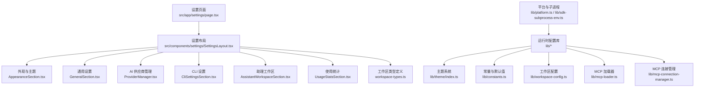
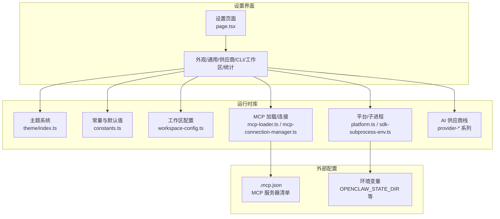
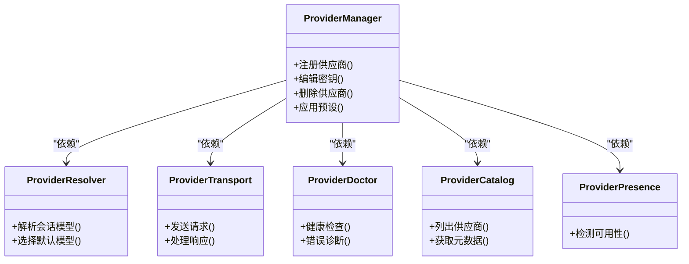
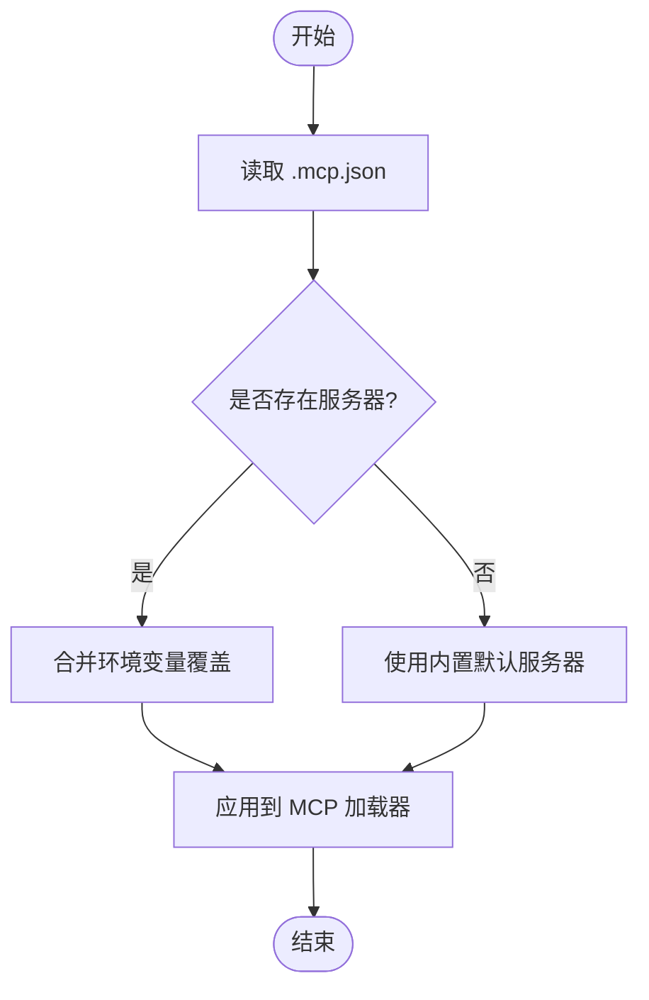
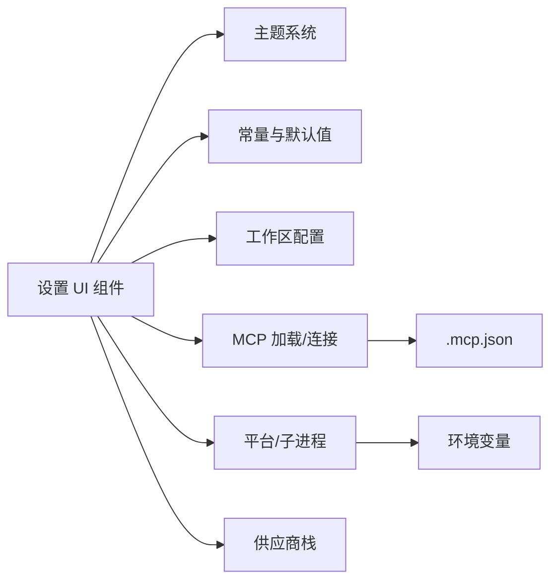

# 配置管理

<cite>
**本文引用的文件**
- [settings/page.tsx](file://src/app/settings/page.tsx)
- [.mcp.json](file://.mcp.json)
- [settings/AppearanceSection.tsx](file://src/components/settings/AppearanceSection.tsx)
- [settings/GeneralSection.tsx](file://src/components/settings/GeneralSection.tsx)
- [settings/ProviderManager.tsx](file://src/components/settings/ProviderManager.tsx)
- [settings/ProviderOptionsSection.tsx](file://src/components/settings/ProviderOptionsSection.tsx)
- [settings/CliSettingsSection.tsx](file://src/components/settings/CliSettingsSection.tsx)
- [settings/AssistantWorkspaceSection.tsx](file://src/components/settings/AssistantWorkspaceSection.tsx)
- [settings/UsageStatsSection.tsx](file://src/components/settings/UsageStatsSection.tsx)
- [settings/workspace-types.ts](file://src/components/settings/workspace-types.ts)
- [lib/theme/index.ts](file://src/lib/theme/index.ts)
- [lib/constants.ts](file://src/lib/constants.ts)
- [lib/workspace-config.ts](file://src/lib/workspace-config.ts)
- [lib/claude-settings.ts](file://src/lib/claude-settings.ts)
- [lib/ai-provider.ts](file://src/lib/ai-provider.ts)
- [lib/mcp-loader.ts](file://src/lib/mcp-loader.ts)
- [lib/mcp-connection-manager.ts](file://src/lib/mcp-connection-manager.ts)
- [lib/agent-sdk-capabilities.ts](file://src/lib/agent-sdk-capabilities.ts)
- [lib/sdk-subprocess-env.ts](file://src/lib/sdk-subprocess-env.ts)
- [lib/platform.ts](file://src/lib/platform.ts)
- [hooks/useSettings.ts](file://src/hooks/useSettings.ts)
- [lib/types/index.ts](file://src/types/index.ts)
- [lib/builtin-mcp-bridge.ts](file://src/lib/builtin-mcp-bridge.ts)
- [lib/bridge/index.ts](file://src/lib/bridge/index.ts)
- [lib/channels/index.ts](file://src/lib/channels/index.ts)
- [lib/runtime/index.ts](file://src/lib/runtime/index.ts)
- [lib/cli-tools-mcp.ts](file://src/lib/cli-tools-mcp.ts)
- [lib/openai-oauth.ts](file://src/lib/openai-oauth.ts)
- [lib/dashboard-mcp.ts](file://src/lib/dashboard-mcp.ts)
- [lib/memory-search-mcp.ts](file://src/lib/memory-search-mcp.ts)
- [lib/media-import-mcp.ts](file://src/lib/media-import-mcp.ts)
- [lib/image-gen-mcp.ts](file://src/lib/image-gen-mcp.ts)
- [lib/notification-mcp.ts](file://src/lib/notification-mcp.ts)
- [lib/provider-resolver.ts](file://src/lib/provider-resolver.ts)
- [lib/provider-transport.ts](file://src/lib/provider-transport.ts)
- [lib/provider-doctor.ts](file://src/lib/provider-doctor.ts)
- [lib/provider-presence.ts](file://src/lib/provider-presence.ts)
- [lib/provider-catalog.ts](file://src/lib/provider-catalog.ts)
- [lib/provider-key-lifecycle.ts](file://src/lib/provider-key-lifecycle.ts)
- [lib/provider-preset.ts](file://src/lib/provider-preset.ts)
- [lib/provider-governance.ts](file://src/lib/provider-governance.ts)
- [lib/agent-loop.ts](file://src/lib/agent-loop.ts)
- [lib/agent-tools.ts](file://src/lib/agent-tools.ts)
- [lib/agent-sdk-agents.ts](file://src/lib/agent-sdk-agents.ts)
- [lib/agent-system-prompt.ts](file://src/lib/agent-system-prompt.ts)
- [lib/context-assembler.ts](file://src/lib/context-assembler.ts)
- [lib/context-compressor.ts](file://src/lib/context-compressor.ts)
- [lib/context-estimator.ts](file://src/lib/context-estimator.ts)
- [lib/context-pruner.ts](file://src/lib/context-pruner.ts)
- [lib/message-builder.ts](file://src/lib/message-builder.ts)
- [lib/message-normalizer.ts](file://src/lib/message-normalizer.ts)
- [lib/model-context.ts](file://src/lib/model-context.ts)
- [lib/resolve-session-model.ts](file://src/lib/resolve-session-model.ts)
- [lib/stream-session-manager.ts](file://src/lib/stream-session-manager.ts)
- [lib/task-scheduler.ts](file://src/lib/task-scheduler.ts)
- [lib/text-generator.ts](file://src/lib/text-generator.ts)
- [lib/widget-css-bridge.ts](file://src/lib/widget-css-bridge.ts)
- [lib/widget-sanitizer.ts](file://src/lib/widget-sanitizer.ts)
- [lib/widget-guidelines.ts](file://src/lib/widget-guidelines.ts)
- [lib/heartbeat.ts](file://src/lib/heartbeat.ts)
- [lib/permission-checker.ts](file://src/lib/permission-checker.ts)
- [lib/permission-registry.ts](file://src/lib/permission-registry.ts)
- [lib/subdirectory-hint-tracker.ts](file://src/lib/subdirectory-hint-tracker.ts)
- [lib/working-directory.ts](file://src/lib/working-directory.ts)
- [lib/workspace-indexer.ts](file://src/lib/workspace-indexer.ts)
- [lib/workspace-organizer.ts](file://src/lib/workspace-organizer.ts)
- [lib/workspace-retrieval.ts](file://src/lib/workspace-retrieval.ts)
- [lib/workspace-taxonomy.ts](file://src/lib/workspace-taxonomy.ts)
- [lib/agent-registry.ts](file://src/lib/agent-registry.ts)
- [lib/agent-loop.ts](file://src/lib/agent-loop.ts)
- [lib/agent-tools.ts](file://src/lib/agent-tools.ts)
- [lib/agent-sdk-agents.ts](file://src/lib/agent-sdk-agents.ts)
- [lib/agent-system-prompt.ts](file://src/lib/agent-system-prompt.ts)
- [lib/context-assembler.ts](file://src/lib/context-assembler.ts)
- [lib/context-compressor.ts](file://src/lib/context-compressor.ts)
- [lib/context-estimator.ts](file://src/lib/context-estimator.ts)
- [lib/context-pruner.ts](file://src/lib/context-pruner.ts)
- [lib/message-builder.ts](file://src/lib/message-builder.ts)
- [lib/message-normalizer.ts](file://src/lib/message-normalizer.ts)
- [lib/model-context.ts](file://src/lib/model-context.ts)
- [lib/resolve-session-model.ts](file://src/lib/resolve-session-model.ts)
- [lib/stream-session-manager.ts](file://src/lib/stream-session-manager.ts)
- [lib/task-scheduler.ts](file://src/lib/task-scheduler.ts)
- [lib/text-generator.ts](file://src/lib/text-generator.ts)
- [lib/widget-css-bridge.ts](file://src/lib/widget-css-bridge.ts)
- [lib/widget-sanitizer.ts](file://src/lib/widget-sanitizer.ts)
- [lib/widget-guidelines.ts](file://src/lib/widget-guidelines.ts)
- [lib/heartbeat.ts](file://src/lib/heartbeat.ts)
- [lib/permission-checker.ts](file://src/lib/permission-checker.ts)
- [lib/permission-registry.ts](file://src/lib/permission-registry.ts)
- [lib/subdirectory-hint-tracker.ts](file://src/lib/subdirectory-hint-tracker.ts)
- [lib/working-directory.ts](file://src/lib/working-directory.ts)
- [lib/workspace-indexer.ts](file://src/lib/workspace-indexer.ts)
- [lib/workspace-organizer.ts](file://src/lib/workspace-organizer.ts)
- [lib/workspace-retrieval.ts](file://src/lib/workspace-retrieval.ts)
- [lib/workspace-taxonomy.ts](file://src/lib/workspace-taxonomy.ts)
- [lib/agent-registry.ts](file://src/lib/agent-registry.ts)
</cite>

## 目录
1. [简介](#简介)
2. [项目结构](#项目结构)
3. [核心组件](#核心组件)
4. [架构总览](#架构总览)
5. [详细组件分析](#详细组件分析)
6. [依赖分析](#依赖分析)
7. [性能考虑](#性能考虑)
8. [故障排查指南](#故障排查指南)
9. [结论](#结论)
10. [附录](#附录)

## 简介
本文件系统性梳理 CodePilot 的配置管理能力，覆盖设置页面的配置项、默认值与生效范围；AI 供应商配置、MCP 服务器设置、桥接通道配置、主题与语言设置；配置文件格式、环境变量与命令行参数；以及配置迁移、备份恢复与批量配置的实用方法。内容基于仓库源码与文档进行归纳总结，帮助开发者与运维人员快速理解并正确使用配置体系。

## 项目结构
设置页面由客户端路由入口加载，并通过布局组件承载各配置分组。核心配置逻辑分布在设置组件、运行时库与平台适配层中，同时支持本地配置文件与环境变量注入。

图表来源
- [settings/page.tsx:1-20](file://src/app/settings/page.tsx#L1-L20)
- [settings/AppearanceSection.tsx](file://src/components/settings/AppearanceSection.tsx)
- [settings/GeneralSection.tsx](file://src/components/settings/GeneralSection.tsx)
- [settings/ProviderManager.tsx](file://src/components/settings/ProviderManager.tsx)
- [settings/CliSettingsSection.tsx](file://src/components/settings/CliSettingsSection.tsx)
- [settings/AssistantWorkspaceSection.tsx](file://src/components/settings/AssistantWorkspaceSection.tsx)
- [settings/UsageStatsSection.tsx](file://src/components/settings/UsageStatsSection.tsx)
- [settings/workspace-types.ts](file://src/components/settings/workspace-types.ts)
- [lib/theme/index.ts](file://src/lib/theme/index.ts)
- [lib/constants.ts](file://src/lib/constants.ts)
- [lib/workspace-config.ts](file://src/lib/workspace-config.ts)
- [lib/mcp-loader.ts](file://src/lib/mcp-loader.ts)
- [lib/mcp-connection-manager.ts](file://src/lib/mcp-connection-manager.ts)
- [lib/platform.ts](file://src/lib/platform.ts)
- [lib/sdk-subprocess-env.ts](file://src/lib/sdk-subprocess-env.ts)

章节来源
- [settings/page.tsx:1-20](file://src/app/settings/page.tsx#L1-L20)

## 核心组件
- 设置页面与布局：负责渲染设置分组与交互容器。
- 外观与主题：控制界面主题家族、颜色方案与语言切换。
- 通用设置：全局行为开关、默认模型选择等。
- AI 供应商管理：供应商注册、密钥与预设管理、可用性检测与治理。
- CLI 设置：命令行工具集成与 MCP 工具链配置。
- 助理工作区：工作区类型与检索策略配置。
- 使用统计：遥测与统计上报配置。
- 运行时库：提供主题、常量、工作区、MCP、平台与子进程等能力。

章节来源
- [settings/AppearanceSection.tsx](file://src/components/settings/AppearanceSection.tsx)
- [settings/GeneralSection.tsx](file://src/components/settings/GeneralSection.tsx)
- [settings/ProviderManager.tsx](file://src/components/settings/ProviderManager.tsx)
- [settings/ProviderOptionsSection.tsx](file://src/components/settings/ProviderOptionsSection.tsx)
- [settings/CliSettingsSection.tsx](file://src/components/settings/CliSettingsSection.tsx)
- [settings/AssistantWorkspaceSection.tsx](file://src/components/settings/AssistantWorkspaceSection.tsx)
- [settings/UsageStatsSection.tsx](file://src/components/settings/UsageStatsSection.tsx)
- [lib/theme/index.ts](file://src/lib/theme/index.ts)
- [lib/constants.ts](file://src/lib/constants.ts)
- [lib/workspace-config.ts](file://src/lib/workspace-config.ts)
- [lib/mcp-loader.ts](file://src/lib/mcp-loader.ts)
- [lib/mcp-connection-manager.ts](file://src/lib/mcp-connection-manager.ts)
- [lib/platform.ts](file://src/lib/platform.ts)
- [lib/sdk-subprocess-env.ts](file://src/lib/sdk-subprocess-env.ts)

## 架构总览
配置管理采用“设置 UI + 运行时库 + 平台适配”的分层架构。设置页面通过钩子与运行时库交互，读取或写入配置；MCP 与桥接通道通过独立模块化能力接入；主题与语言通过统一的加载器与上下文提供。

图表来源
- [settings/page.tsx:1-20](file://src/app/settings/page.tsx#L1-L20)
- [lib/theme/index.ts](file://src/lib/theme/index.ts)
- [lib/constants.ts](file://src/lib/constants.ts)
- [lib/workspace-config.ts](file://src/lib/workspace-config.ts)
- [lib/mcp-loader.ts](file://src/lib/mcp-loader.ts)
- [lib/mcp-connection-manager.ts](file://src/lib/mcp-connection-manager.ts)
- [lib/platform.ts](file://src/lib/platform.ts)
- [lib/sdk-subprocess-env.ts](file://src/lib/sdk-subprocess-env.ts)
- [.mcp.json:1-14](file://.mcp.json#L1-L14)

## 详细组件分析

### 设置页面与生效范围
- 页面入口：客户端路由加载设置布局，懒加载各分组组件，避免首屏阻塞。
- 生效范围：
  - 外观与语言：影响当前会话的主题与 UI 文案。
  - 通用设置：影响全局行为与默认模型选择。
  - 供应商配置：影响消息构建与模型解析。
  - CLI/MCP：影响工具链与外部服务交互。
  - 工作区：影响检索与索引策略。
  - 使用统计：影响遥测上报策略。

章节来源
- [settings/page.tsx:1-20](file://src/app/settings/page.tsx#L1-L20)

### 外观与主题设置
- 主题家族与颜色方案：通过主题加载器与上下文提供，支持多套主题文件。
- 语言设置：通过国际化提供者与语言切换器，影响界面文案与提示。
- 默认值与覆盖：
  - 主题默认值由主题加载器提供，可被用户在设置中覆盖。
  - 语言默认值由平台与国际化配置决定，可在设置中切换。

章节来源
- [settings/AppearanceSection.tsx](file://src/components/settings/AppearanceSection.tsx)
- [lib/theme/index.ts](file://src/lib/theme/index.ts)

### 通用设置
- 全局行为开关：如是否启用某些实验特性、默认模型选择等。
- 默认值来源：常量与默认值库提供基础默认值，设置页允许覆盖。
- 生效范围：影响消息构建、上下文压缩与模型解析等流程。

章节来源
- [settings/GeneralSection.tsx](file://src/components/settings/GeneralSection.tsx)
- [lib/constants.ts](file://src/lib/constants.ts)

### AI 供应商配置
- 供应商注册与密钥管理：通过供应商管理器与密钥生命周期模块维护。
- 可用性检测与治理：通过供应商医生与存在性检测保障可用性。
- 预设与模型解析：通过解析器与传输层完成模型选择与请求转发。
- 默认值与覆盖：
  - 供应商默认模型与参数由供应商目录与解析器提供。
  - 用户可在设置中覆盖默认模型与参数。

图表来源
- [settings/ProviderManager.tsx](file://src/components/settings/ProviderManager.tsx)
- [lib/provider-resolver.ts](file://src/lib/provider-resolver.ts)
- [lib/provider-transport.ts](file://src/lib/provider-transport.ts)
- [lib/provider-doctor.ts](file://src/lib/provider-doctor.ts)
- [lib/provider-catalog.ts](file://src/lib/provider-catalog.ts)
- [lib/provider-presence.ts](file://src/lib/provider-presence.ts)

章节来源
- [settings/ProviderManager.tsx](file://src/components/settings/ProviderManager.tsx)
- [settings/ProviderOptionsSection.tsx](file://src/components/settings/ProviderOptionsSection.tsx)
- [lib/provider-resolver.ts](file://src/lib/provider-resolver.ts)
- [lib/provider-transport.ts](file://src/lib/provider-transport.ts)
- [lib/provider-doctor.ts](file://src/lib/provider-doctor.ts)
- [lib/provider-presence.ts](file://src/lib/provider-presence.ts)
- [lib/provider-catalog.ts](file://src/lib/provider-catalog.ts)

### MCP 服务器设置
- 配置文件格式：.mcp.json 提供 MCP 服务器清单，支持多种类型（如 stdio）、命令与参数、环境变量。
- 默认值与覆盖：
  - 默认服务器清单来自 .mcp.json；可通过设置界面添加/修改。
  - 环境变量可用于覆盖 MCP 端点或调试行为。
- 生效范围：影响工具链、媒体导入、通知、图像生成等模块的外部服务交互。

图表来源
- [.mcp.json:1-14](file://.mcp.json#L1-L14)
- [lib/mcp-loader.ts](file://src/lib/mcp-loader.ts)
- [lib/mcp-connection-manager.ts](file://src/lib/mcp-connection-manager.ts)

章节来源
- [.mcp.json:1-14](file://.mcp.json#L1-L14)
- [lib/mcp-loader.ts](file://src/lib/mcp-loader.ts)
- [lib/mcp-connection-manager.ts](file://src/lib/mcp-connection-manager.ts)

### 桥接通道配置
- 通道类型：支持多种即时通讯与协作平台的桥接通道。
- 配置入口：在设置页面的桥接相关分组中进行配置。
- 生效范围：影响消息路由、权限校验与通知策略。

章节来源
- [lib/bridge/index.ts](file://src/lib/bridge/index.ts)
- [lib/channels/index.ts](file://src/lib/channels/index.ts)

### CLI 与工具链设置
- CLI 工具集成：通过 CLI 设置分组管理工具安装、描述与自定义。
- MCP 工具链：与 MCP 服务器协同，执行外部工具调用与权限检查。
- 默认值与覆盖：
  - 工具链默认行为由 CLI 工具目录与 MCP 适配器提供。
  - 用户可在设置中调整工具链参数与行为。

章节来源
- [settings/CliSettingsSection.tsx](file://src/components/settings/CliSettingsSection.tsx)
- [lib/cli-tools-mcp.ts](file://src/lib/cli-tools-mcp.ts)

### 助理工作区设置
- 工作区类型：通过工作区类型定义与索引器、组织器、检索器协同。
- 默认值与覆盖：
  - 工作区默认策略由工作区配置库提供。
  - 用户可在设置中调整类型与检索策略。

章节来源
- [settings/AssistantWorkspaceSection.tsx](file://src/components/settings/AssistantWorkspaceSection.tsx)
- [settings/workspace-types.ts](file://src/components/settings/workspace-types.ts)
- [lib/workspace-config.ts](file://src/lib/workspace-config.ts)
- [lib/workspace-indexer.ts](file://src/lib/workspace-indexer.ts)
- [lib/workspace-organizer.ts](file://src/lib/workspace-organizer.ts)
- [lib/workspace-retrieval.ts](file://src/lib/workspace-retrieval.ts)
- [lib/workspace-taxonomy.ts](file://src/lib/workspace-taxonomy.ts)

### 使用统计设置
- 遥测与统计上报：通过使用统计分组控制上报策略与数据范围。
- 默认值与覆盖：默认关闭或按平台策略设定，用户可开启/关闭。

章节来源
- [settings/UsageStatsSection.tsx](file://src/components/settings/UsageStatsSection.tsx)

## 依赖分析
配置管理涉及多个运行时模块的耦合关系，包括主题、常量、工作区、MCP、平台与供应商栈。下图展示关键依赖：

图表来源
- [settings/AppearanceSection.tsx](file://src/components/settings/AppearanceSection.tsx)
- [settings/GeneralSection.tsx](file://src/components/settings/GeneralSection.tsx)
- [settings/ProviderManager.tsx](file://src/components/settings/ProviderManager.tsx)
- [lib/theme/index.ts](file://src/lib/theme/index.ts)
- [lib/constants.ts](file://src/lib/constants.ts)
- [lib/workspace-config.ts](file://src/lib/workspace-config.ts)
- [lib/mcp-loader.ts](file://src/lib/mcp-loader.ts)
- [lib/mcp-connection-manager.ts](file://src/lib/mcp-connection-manager.ts)
- [lib/platform.ts](file://src/lib/platform.ts)
- [lib/sdk-subprocess-env.ts](file://src/lib/sdk-subprocess-env.ts)
- [.mcp.json:1-14](file://.mcp.json#L1-L14)

## 性能考虑
- 设置页面采用懒加载与骨架屏提升首屏体验。
- 主题与语言切换仅影响渲染层，对业务逻辑无额外开销。
- MCP 服务器启动与连接采用异步加载与重试策略，避免阻塞主流程。
- 供应商解析与模型选择尽量复用缓存，减少重复计算。

## 故障排查指南
- MCP 服务器不可用
  - 检查 .mcp.json 中服务器配置与命令参数。
  - 查看 MCP 连接管理器日志，确认启动与连接状态。
  - 使用环境变量覆盖端点进行临时修复。
- 供应商认证失败
  - 在供应商管理器中重新输入密钥并保存。
  - 使用供应商医生进行健康检查与错误诊断。
- 主题/语言异常
  - 切换回默认主题与语言，确认是否为特定主题/语言包问题。
  - 清除浏览器缓存后重试。
- CLI 工具链问题
  - 检查 CLI 工具目录与 MCP 工具适配器配置。
  - 确认子进程环境变量与权限。

章节来源
- [lib/mcp-connection-manager.ts](file://src/lib/mcp-connection-manager.ts)
- [lib/provider-doctor.ts](file://src/lib/provider-doctor.ts)
- [lib/sdk-subprocess-env.ts](file://src/lib/sdk-subprocess-env.ts)

## 结论
CodePilot 的配置管理以设置页面为核心入口，结合运行时库与平台适配，形成覆盖主题、语言、供应商、MCP、桥接通道、CLI 与工作区的完整配置体系。通过默认值与覆盖机制、环境变量与配置文件，满足从个人开发到团队协作的多样化需求。建议在生产环境中配合备份与迁移策略，确保配置安全与可追溯。

## 附录

### 配置文件格式与位置
- MCP 服务器清单：.mcp.json
  - 示例字段：服务器名称、类型、命令、参数、环境变量。
  - 生效范围：MCP 工具链与外部服务交互。
- 状态目录与环境变量
  - OPENCLAW_STATE_DIR：状态与配置存储根目录。
  - CLAWDBOT_STATE_DIR：兼容旧环境变量。
  - 生效范围：平台适配层与运行时库。

章节来源
- [.mcp.json:1-14](file://.mcp.json#L1-L14)
- [lib/sdk-subprocess-env.ts](file://src/lib/sdk-subprocess-env.ts)
- [lib/platform.ts](file://src/lib/platform.ts)

### 环境变量与命令行参数
- 环境变量
  - OPENCLAW_STATE_DIR：指定状态目录。
  - CLAWDBOT_STATE_DIR：兼容旧变量名。
  - MCP 端点覆盖：通过运行时接口或环境变量覆盖。
- 命令行参数
  - CLI 工具链支持参数传递与子进程环境注入。
  - MCP 工具链支持通过命令行参数与环境变量组合。

章节来源
- [lib/sdk-subprocess-env.ts](file://src/lib/sdk-subprocess-env.ts)
- [lib/cli-tools-mcp.ts](file://src/lib/cli-tools-mcp.ts)

### 配置迁移、备份与恢复
- 备份
  - 备份状态目录（默认位于用户主目录下的状态目录）。
  - 导出设置页面中的供应商密钥与 MCP 服务器清单。
- 迁移
  - 在新环境设置 OPENCLAW_STATE_DIR 或 CLAWDBOT_STATE_DIR。
  - 将备份的状态目录复制到新路径。
  - 在设置页面重新导入供应商密钥与 MCP 服务器配置。
- 恢复
  - 恢复状态目录后重启应用。
  - 在设置页面核对并修正网络与权限配置。

章节来源
- [lib/sdk-subprocess-env.ts](file://src/lib/sdk-subprocess-env.ts)
- [lib/mcp-loader.ts](file://src/lib/mcp-loader.ts)

### 批量配置方法
- 供应商批量管理
  - 使用供应商管理器的导入/导出功能，批量更新密钥与预设。
- MCP 服务器批量配置
  - 编辑 .mcp.json，统一添加/修改多台服务器配置。
- 主题与语言批量应用
  - 通过设置页面的批量操作或脚本方式统一应用主题与语言。

章节来源
- [settings/ProviderManager.tsx](file://src/components/settings/ProviderManager.tsx)
- [.mcp.json:1-14](file://.mcp.json#L1-L14)
- [settings/AppearanceSection.tsx](file://src/components/settings/AppearanceSection.tsx)