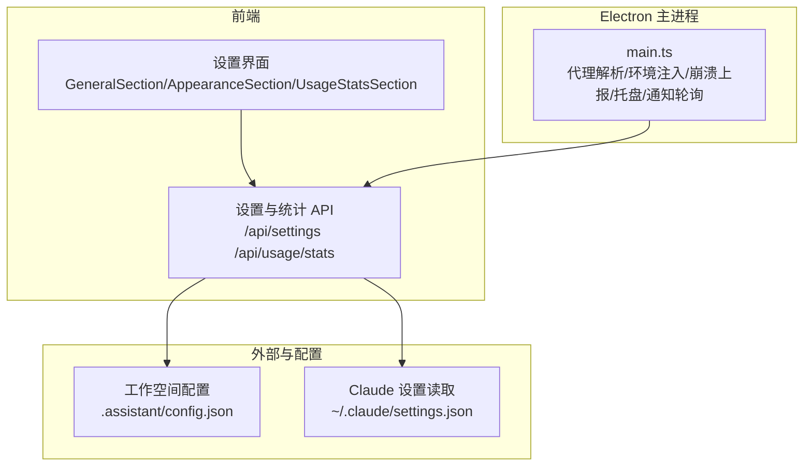
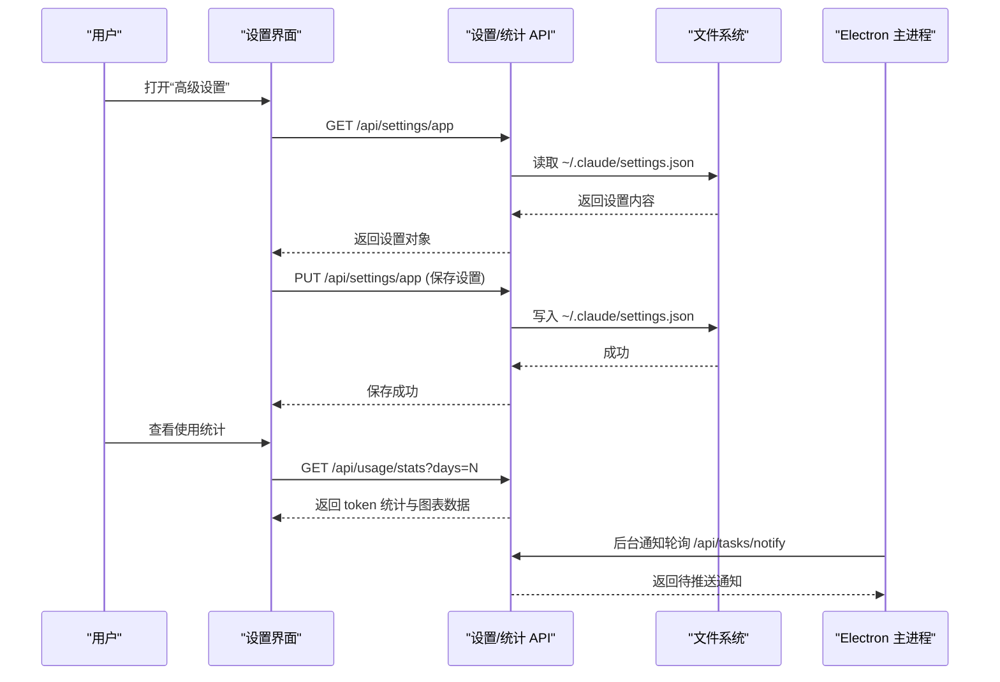
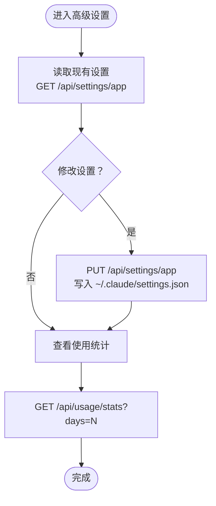
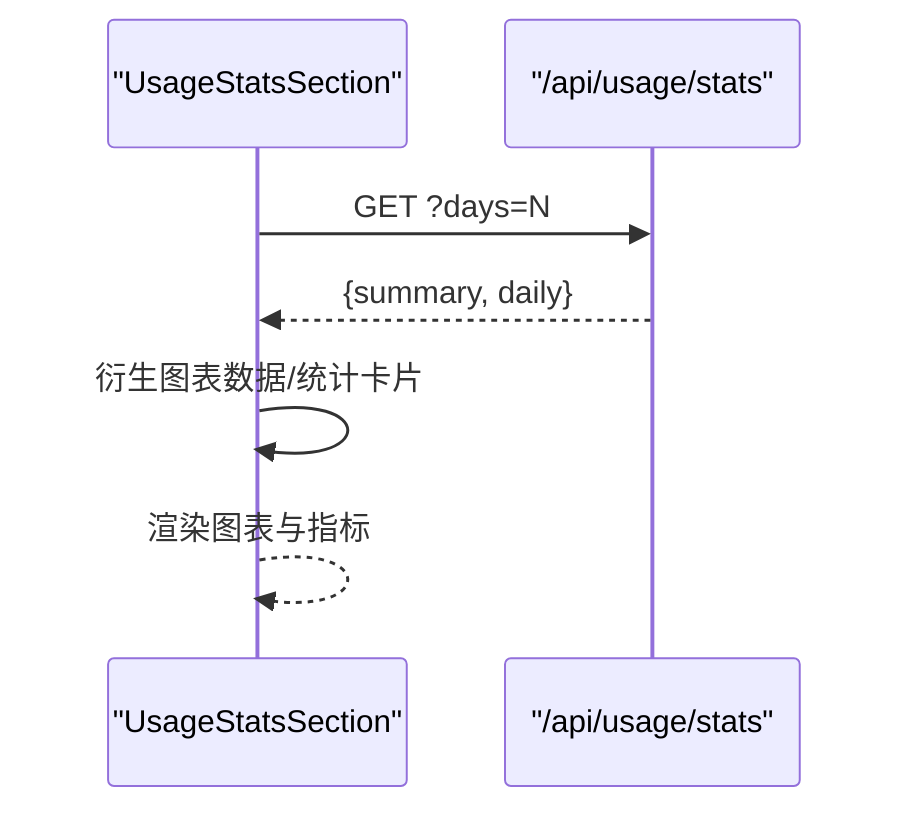
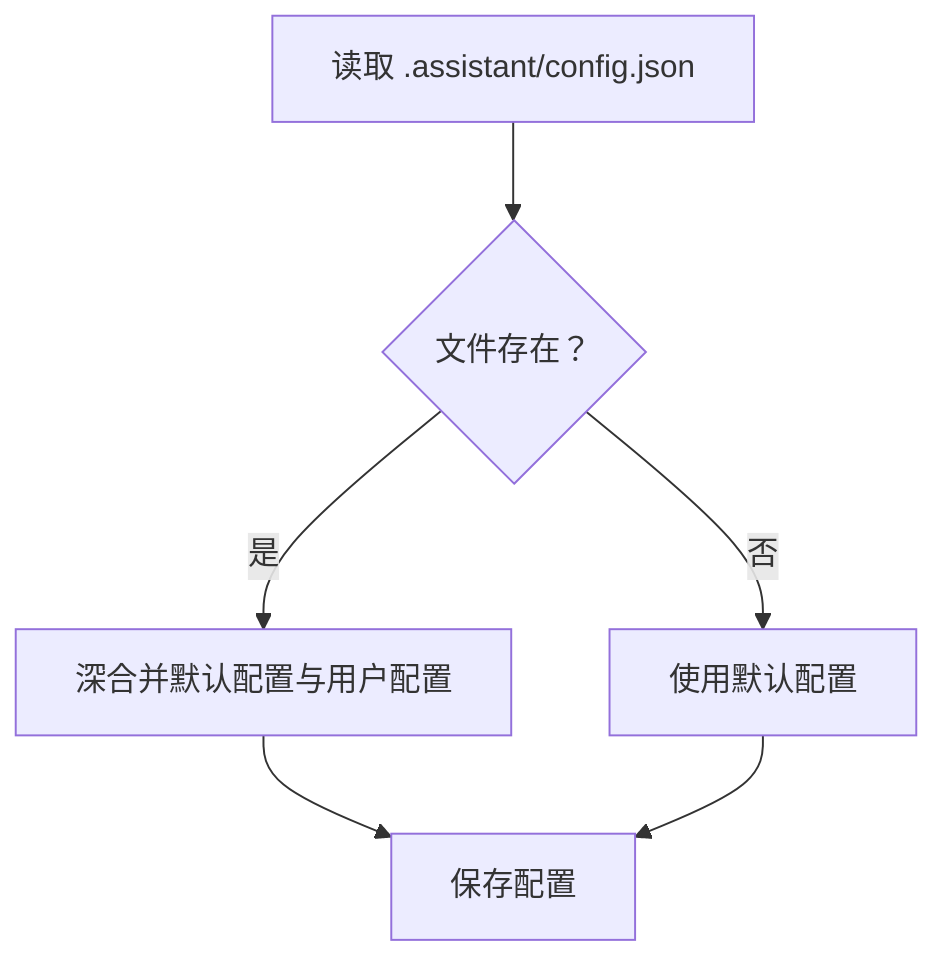
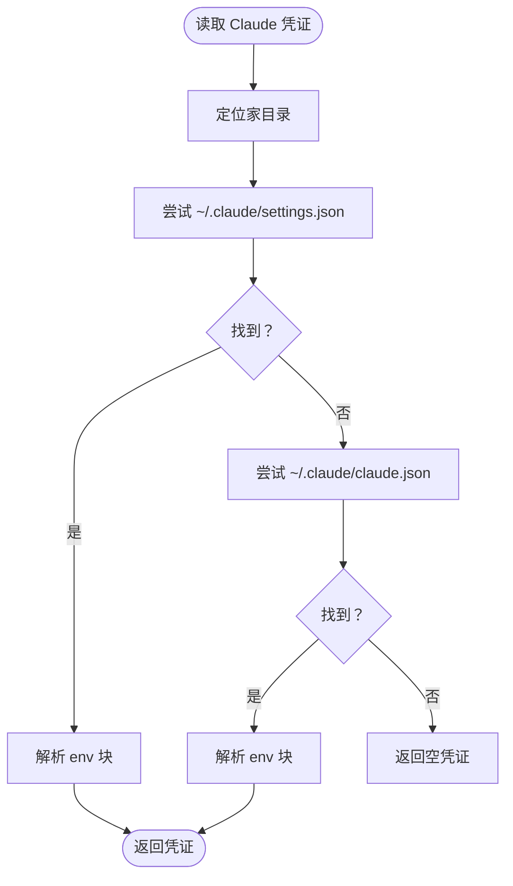
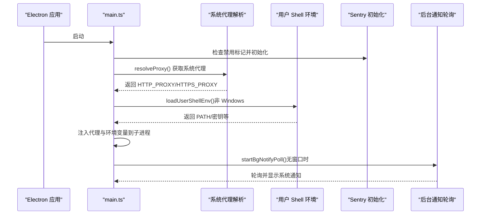

# 高级设置

<cite>
**本文引用的文件**
- [src/components/settings/GeneralSection.tsx](file://src/components/settings/GeneralSection.tsx)
- [src/components/settings/AppearanceSection.tsx](file://src/components/settings/AppearanceSection.tsx)
- [src/components/settings/UsageStatsSection.tsx](file://src/components/settings/UsageStatsSection.tsx)
- [src/app/api/settings/route.ts](file://src/app/api/settings/route.ts)
- [src/app/api/usage/stats/route.ts](file://src/app/api/usage/stats/route.ts)
- [src/lib/claude-settings.ts](file://src/lib/claude-settings.ts)
- [src/lib/workspace-config.ts](file://src/lib/workspace-config.ts)
- [electron/main.ts](file://electron/main.ts)
- [package.json](file://package.json)
</cite>

## 目录
1. [简介](#简介)
2. [项目结构](#项目结构)
3. [核心组件](#核心组件)
4. [架构总览](#架构总览)
5. [详细组件分析](#详细组件分析)
6. [依赖分析](#依赖分析)
7. [性能考虑](#性能考虑)
8. [故障排查指南](#故障排查指南)
9. [结论](#结论)
10. [附录](#附录)

## 简介
本章节面向高级用户与运维人员，系统化梳理 CodePilot 的“高级设置”能力，覆盖以下主题：
- 性能调优参数：端口选择策略、子进程环境注入、代理解析与注入、本地存储一致性保障
- 日志级别与调试：前端 Sentry 开关、Electron 主进程错误上报控制、日志最小级别动态调整
- 网络代理配置：系统代理自动探测、HTTP/HTTPS 代理注入、Windows Git Bash 可用性检测
- 使用统计与隐私：使用统计采集与可视化、错误报告开关、遥测与崩溃上报的用户控制
- 配置文件与环境变量：应用设置持久化、工作空间配置、Claude 凭证读取、状态目录与路径扩展
- 配置迁移与兼容：工作空间配置合并策略、历史兼容路径、状态目录兼容变量
- 安全加固：敏感环境变量过滤、本地存储跨实例一致性、原生模块 ABI 兼容性检查

## 项目结构
高级设置涉及三层：
- 前端设置界面与 API：负责用户交互、设置持久化与统计展示
- Electron 主进程：负责服务启动、代理解析、崩溃上报、系统托盘与后台通知轮询
- 工作空间与外部工具集成：负责工作空间配置、Claude 凭证读取

图示来源
- [src/components/settings/GeneralSection.tsx](file://src/components/settings/GeneralSection.tsx)
- [src/components/settings/AppearanceSection.tsx](file://src/components/settings/AppearanceSection.tsx)
- [src/components/settings/UsageStatsSection.tsx](file://src/components/settings/UsageStatsSection.tsx)
- [src/app/api/settings/route.ts](file://src/app/api/settings/route.ts)
- [src/app/api/usage/stats/route.ts](file://src/app/api/usage/stats/route.ts)
- [src/lib/workspace-config.ts](file://src/lib/workspace-config.ts)
- [src/lib/claude-settings.ts](file://src/lib/claude-settings.ts)
- [electron/main.ts](file://electron/main.ts)

章节来源
- [src/components/settings/GeneralSection.tsx](file://src/components/settings/GeneralSection.tsx)
- [src/components/settings/AppearanceSection.tsx](file://src/components/settings/AppearanceSection.tsx)
- [src/components/settings/UsageStatsSection.tsx](file://src/components/settings/UsageStatsSection.tsx)
- [src/app/api/settings/route.ts](file://src/app/api/settings/route.ts)
- [src/app/api/usage/stats/route.ts](file://src/app/api/usage/stats/route.ts)
- [src/lib/workspace-config.ts](file://src/lib/workspace-config.ts)
- [src/lib/claude-settings.ts](file://src/lib/claude-settings.ts)
- [electron/main.ts](file://electron/main.ts)

## 核心组件
- 应用设置持久化与读取：通过前端设置页面与后端 API 实现，支持自动批准权限、默认面板、语言、生成式 UI 开关、错误报告开关等
- 使用统计：提供 token 使用统计的聚合与图表展示，支持按天数窗口查询
- 工作空间配置：提供默认配置、深合并策略、忽略规则与索引参数
- Claude 凭证读取：从用户家目录读取 Anthropic 凭证，供运行时解析器使用
- Electron 主进程：负责系统代理解析、环境变量注入、崩溃上报初始化、托盘与后台通知轮询、端口分配与稳定性保障

章节来源
- [src/app/api/settings/route.ts](file://src/app/api/settings/route.ts)
- [src/app/api/usage/stats/route.ts](file://src/app/api/usage/stats/route.ts)
- [src/lib/workspace-config.ts](file://src/lib/workspace-config.ts)
- [src/lib/claude-settings.ts](file://src/lib/claude-settings.ts)
- [electron/main.ts](file://electron/main.ts)

## 架构总览
下图展示高级设置在系统中的交互关系与数据流。

图示来源
- [src/app/api/settings/route.ts](file://src/app/api/settings/route.ts)
- [src/app/api/usage/stats/route.ts](file://src/app/api/usage/stats/route.ts)
- [electron/main.ts](file://electron/main.ts)

## 详细组件分析

### 应用设置持久化与隐私控制
- 设置项
  - 自动批准权限：dangerously_skip_permissions，用于跳过权限确认，存在安全风险
  - 默认面板：default_panel，支持 none/file_tree/git/dashboard
  - 语言：locale，切换界面语言
  - 生成式 UI：generative_ui_enabled，默认开启
  - 错误报告：通过 localStorage 标记与后端 /api/settings/sentry 接口同步，控制 Sentry 上报
- 存储位置
  - 设置写入到 ~/.claude/settings.json
  - 语言与主题偏好通过后端 API 写入数据库或持久化层
- 隐私与安全
  - 错误报告可由用户完全关闭，且关闭标记会持久化
  - 自动批准权限为高风险开关，界面提供警告提示

图示来源
- [src/app/api/settings/route.ts](file://src/app/api/settings/route.ts)
- [src/app/api/usage/stats/route.ts](file://src/app/api/usage/stats/route.ts)
- [src/components/settings/GeneralSection.tsx](file://src/components/settings/GeneralSection.tsx)
- [src/components/settings/UsageStatsSection.tsx](file://src/components/settings/UsageStatsSection.tsx)

章节来源
- [src/app/api/settings/route.ts](file://src/app/api/settings/route.ts)
- [src/components/settings/GeneralSection.tsx](file://src/components/settings/GeneralSection.tsx)
- [src/components/settings/UsageStatsSection.tsx](file://src/components/settings/UsageStatsSection.tsx)

### 使用统计与可视化
- 查询参数
  - days：窗口天数，默认 30，范围 1–365
- 数据结构
  - summary：总输入/输出 token、缓存命中、会话数、成本
  - daily：按日期与模型聚合的 token 与成本明细
- 可视化
  - 支持 7D/30D/90D 时间窗口切换
  - 柱状图堆叠展示各模型 token 占比
  - 缓存命中率计算与展示

图示来源
- [src/app/api/usage/stats/route.ts](file://src/app/api/usage/stats/route.ts)
- [src/components/settings/UsageStatsSection.tsx](file://src/components/settings/UsageStatsSection.tsx)

章节来源
- [src/app/api/usage/stats/route.ts](file://src/app/api/usage/stats/route.ts)
- [src/components/settings/UsageStatsSection.tsx](file://src/components/settings/UsageStatsSection.tsx)

### 工作空间配置与迁移
- 默认配置
  - workspaceType、organizationStyle、captureDefault、archivePolicy、ignore 列表、index 参数（最大文件大小、分块大小、重叠、最大深度、扩展名）
- 加载与保存
  - 读取 .assistant/config.json，若不存在则回退到默认值
  - 深合并策略：仅对对象字段进行深合并，避免覆盖整段配置
- 忽略规则
  - 支持通配符匹配，统一以正斜杠分隔路径进行匹配
- 迁移与兼容
  - 提供兼容逻辑，处理不同版本的配置文件命名与结构差异

图示来源
- [src/lib/workspace-config.ts](file://src/lib/workspace-config.ts)

章节来源
- [src/lib/workspace-config.ts](file://src/lib/workspace-config.ts)

### Claude 凭证读取
- 读取顺序
  - 优先 ~/.claude/settings.json；若不存在则尝试 ~/.claude/claude.json（兼容旧版）
- 解析范围
  - 仅提取 env 块中的 Anthropic 相关键（API Key、Auth Token、Base URL）
- 用途
  - 供运行时解析器可见，避免在某些场景下需要额外权限

图示来源
- [src/lib/claude-settings.ts](file://src/lib/claude-settings.ts)

章节来源
- [src/lib/claude-settings.ts](file://src/lib/claude-settings.ts)

### Electron 主进程：性能、代理与安全
- 端口与稳定性
  - 稳定端口范围：47823–47830，避免每次重启 localStorage 跨域失效
  - 若全部失败，回退至系统分配端口，并记录风险
- 系统代理解析
  - 通过 Chromium 代理解析获取系统代理，自动注入 HTTP_PROXY/HTTPS_PROXY
  - 仅在 shell 环境未显式设置时注入
- 用户 Shell 环境
  - 在非 Windows 平台加载登录 shell 环境，确保 PATH 与密钥等变量可用
- 崩溃上报与隐私
  - 启动前检查 ~/.codepilot/sentry-disabled 标记，决定是否初始化 Sentry
  - 初始化 Sentry 于主进程，捕获早期崩溃
- 原生模块 ABI 兼容性
  - 检测 better-sqlite3.node 是否与 Electron ABI 兼容，避免运行时崩溃
- 后台通知轮询
  - 当无渲染窗口时，定时轮询服务器通知队列并通过系统通知显示

图示来源
- [electron/main.ts](file://electron/main.ts)

章节来源
- [electron/main.ts](file://electron/main.ts)

## 依赖分析
- 外部依赖与版本
  - Sentry（浏览器/Node/Electron）：用于错误上报与崩溃捕获
  - electron-updater：用于应用更新
  - better-sqlite3：SQLite 原生驱动，需与 Electron ABI 兼容
  - next、react、recharts：前端框架与可视化
- 关键依赖与高级设置的关系
  - Sentry 控制错误上报开关
  - electron-updater 控制更新流程
  - better-sqlite3 影响本地数据存储稳定性
  - next-themes、recharts 影响外观与统计可视化

章节来源
- [package.json](file://package.json)

## 性能考虑
- 端口稳定性
  - 固定端口范围减少 localStorage 跨域问题，提升用户体验一致性
- 代理注入
  - 自动代理解析避免手动配置，减少网络延迟与连接失败
- 通知轮询
  - 仅在无窗口时启用，降低资源占用
- 统计查询
  - 限制 days 范围，避免大数据集导致的前端卡顿

## 故障排查指南
- 设置无法保存
  - 检查 ~/.claude/settings.json 权限与磁盘空间
  - 确认后端 API 返回状态码与错误信息
- 使用统计为空
  - 确认 days 参数在 1–365 范围内
  - 检查数据库中是否存在 token 使用记录
- 代理无效
  - 确认系统代理解析结果是否被 shell 环境变量覆盖
  - 在 Windows 上检查 Git Bash 可用性与路径扩展
- 崩溃上报未生效
  - 检查 ~/.codepilot/sentry-disabled 文件是否存在且内容为 true
  - 确认 Sentry 初始化是否在主进程执行
- 原生模块崩溃
  - 观察 ABI 检查日志，确认 better-sqlite3.node 与 Electron ABI 匹配
  - 重新构建应用或更换 Electron 版本

章节来源
- [src/app/api/settings/route.ts](file://src/app/api/settings/route.ts)
- [src/app/api/usage/stats/route.ts](file://src/app/api/usage/stats/route.ts)
- [electron/main.ts](file://electron/main.ts)

## 结论
CodePilot 的高级设置围绕“可配置、可观测、可迁移、可安全”的目标设计：
- 通过稳定的端口策略与代理注入提升网络与体验稳定性
- 通过工作空间配置与深合并策略保障配置迁移与兼容
- 通过 Sentry 开关与自动批准权限开关实现隐私与安全可控
- 通过使用统计与可视化帮助用户评估资源消耗与优化策略

## 附录

### 配置文件与环境变量清单
- 应用设置
  - 文件位置：~/.claude/settings.json
  - 关键键：dangerously_skip_permissions、default_panel、generative_ui_enabled、locale 等
- 工作空间配置
  - 文件位置：项目根目录 .assistant/config.json
  - 关键键：workspaceType、organizationStyle、captureDefault、archivePolicy、ignore、index
- Claude 凭证
  - 文件位置：~/.claude/settings.json 或 ~/.claude/claude.json
  - 关键键：env 中的 ANTHROPIC_API_KEY、ANTHROPIC_AUTH_TOKEN、ANTHROPIC_BASE_URL
- Electron 状态与日志
  - 状态目录：~/.codepilot（可通过主进程注入）
  - Sentry 禁用标记：~/.codepilot/sentry-disabled

章节来源
- [src/app/api/settings/route.ts](file://src/app/api/settings/route.ts)
- [src/lib/workspace-config.ts](file://src/lib/workspace-config.ts)
- [src/lib/claude-settings.ts](file://src/lib/claude-settings.ts)
- [electron/main.ts](file://electron/main.ts)