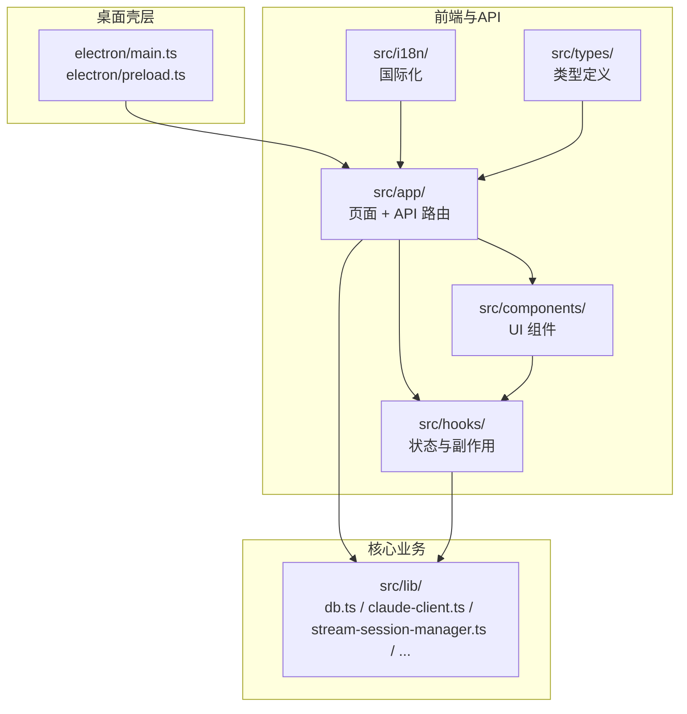
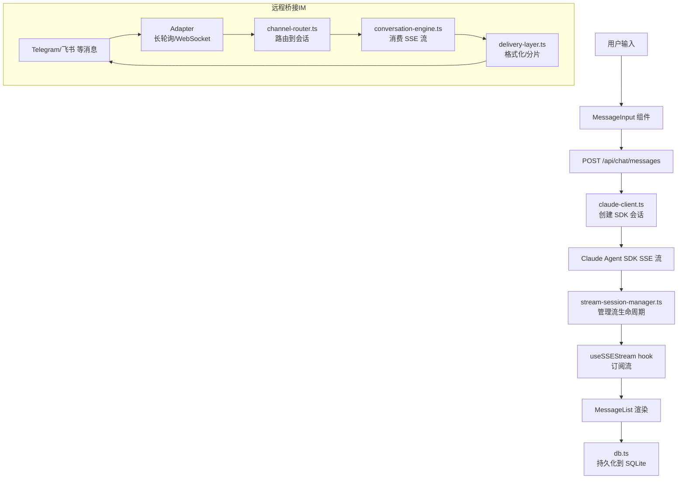
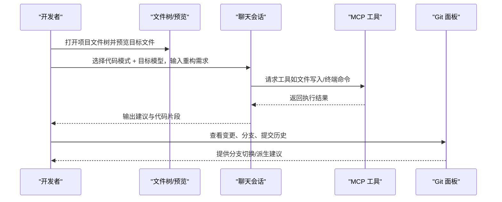
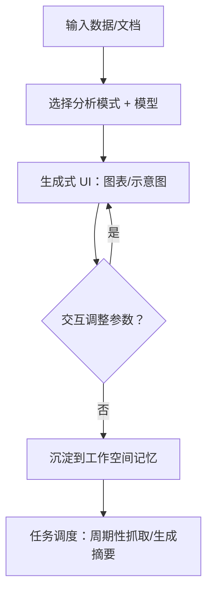
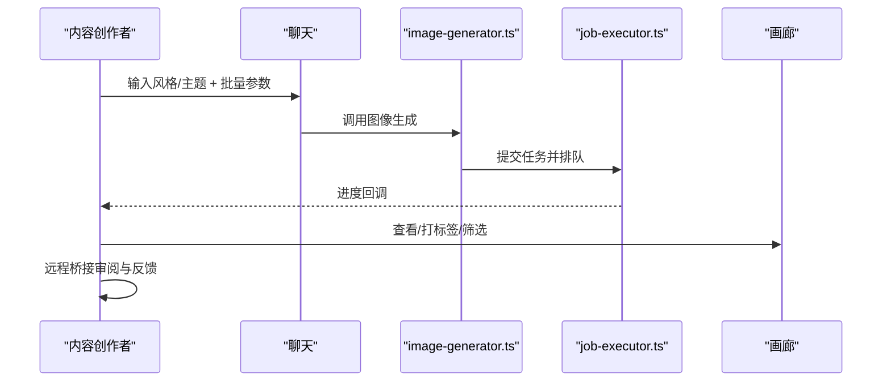
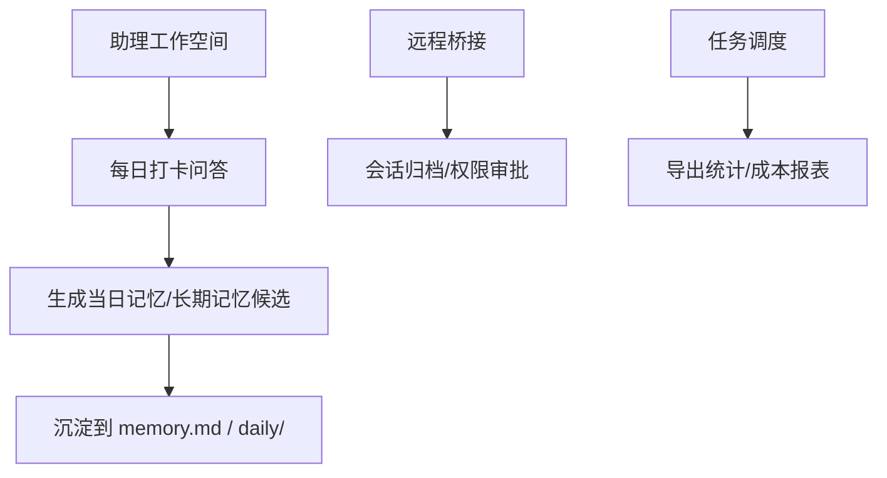
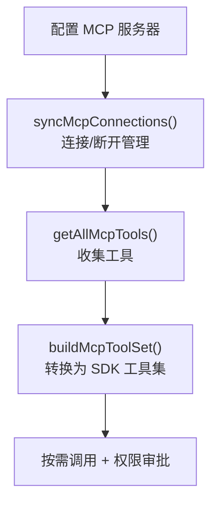
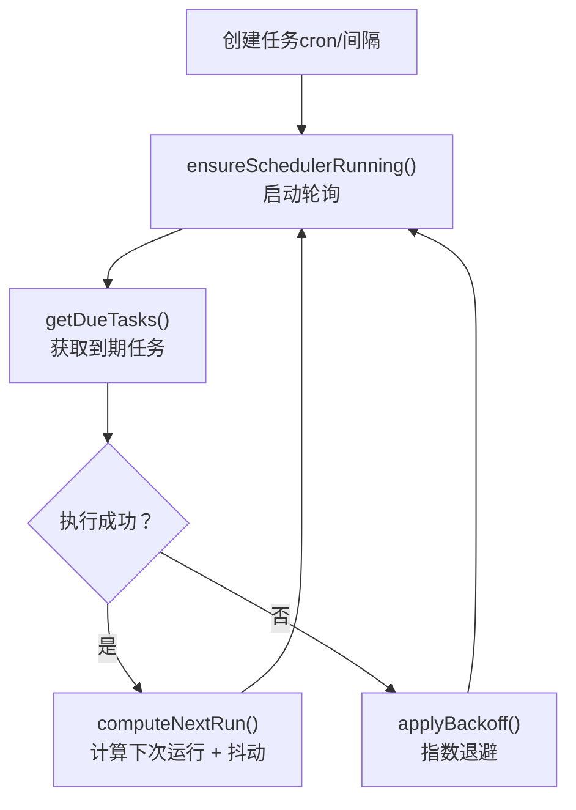
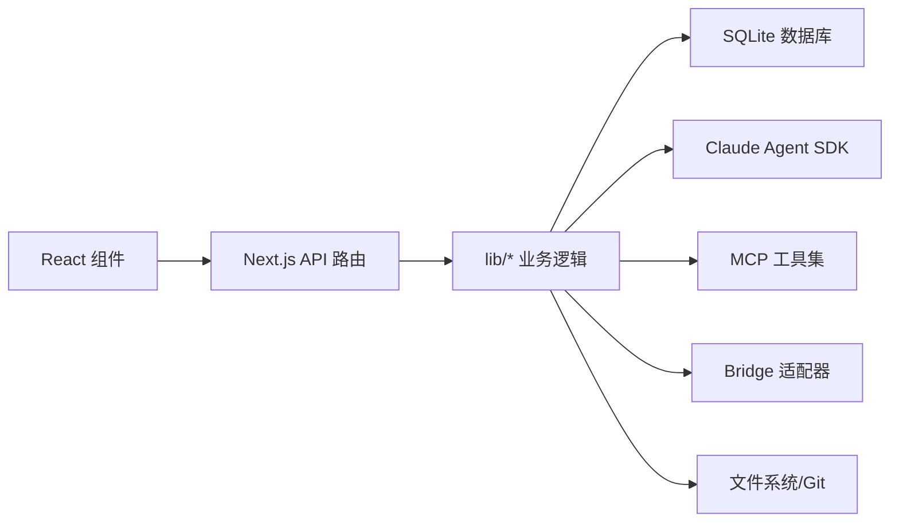

# 应用场景

<cite>
**本文引用的文件**
- [README.md](file://README.md)
- [ARCHITECTURE.md](file://ARCHITECTURE.md)
- [AGENTS.md](file://AGENTS.md)
- [docs/generative-ui-article.md](file://docs/generative-ui-article.md)
- [apps/site/content/docs/zh/generative-ui.mdx](file://apps/site/content/docs/zh/generative-ui.mdx)
- [apps/site/content/docs/zh/bridge/meta.json](file://apps/site/content/docs/zh/bridge/meta.json)
- [apps/site/content/docs/zh/git-and-workspace.mdx](file://apps/site/content/docs/zh/git-and-workspace.mdx)
- [src/lib/checkin-processor.ts](file://src/lib/checkin-processor.ts)
- [src/app/api/workspace/onboarding/route.ts](file://src/app/api/workspace/onboarding/route.ts)
- [src/lib/mcp-tool-adapter.ts](file://src/lib/mcp-tool-adapter.ts)
- [src/lib/mcp-connection-manager.ts](file://src/lib/mcp-connection-manager.ts)
- [src/lib/image-generator.ts](file://src/lib/image-generator.ts)
- [src/app/api/media/jobs/route.ts](file://src/app/api/media/jobs/route.ts)
- [src/app/api/media/gallery/route.ts](file://src/app/api/media/gallery/route.ts)
- [src/lib/job-executor.ts](file://src/lib/job-executor.ts)
- [src/lib/db.ts](file://src/lib/db.ts)
- [src/app/api/media/[id]/route.ts](file://src/app/api/media/[id]/route.ts)
- [src/__tests__/unit/task-scheduler.test.ts](file://src/__tests__/unit/task-scheduler.test.ts)
- [src/lib/task-scheduler.ts](file://src/lib/task-scheduler.ts)
- [docs/handover/bridge-system.md](file://docs/handover/bridge-system.md)
- [src/components/project/FileTree.tsx](file://src/components/project/FileTree.tsx)
- [src/components/project/FilePreview.tsx](file://src/components/project/FilePreview.tsx)
- [src/lib/git/service.ts](file://src/lib/git/service.ts)
- [src/components/git/GitPanel.tsx](file://src/components/git/GitPanel.tsx)
</cite>

## 目录
1. [简介](#简介)
2. [项目结构](#项目结构)
3. [核心能力与组件](#核心能力与组件)
4. [架构总览](#架构总览)
5. [详细场景与使用指南](#详细场景与使用指南)
6. [依赖关系分析](#依赖关系分析)
7. [性能与稳定性考量](#性能与稳定性考量)
8. [故障排查与最佳实践](#故障排查与最佳实践)
9. [结论](#结论)
10. [附录](#附录)

## 简介
本文件面向不同用户群体，系统梳理 CodePilot 在软件开发、数据分析、内容创作、项目管理等场景中的典型应用路径，并结合项目特性（多提供商、MCP 技能、远程桥接、生成式 UI、任务调度、媒体生成、Git/工作区集成等）给出可落地的工作流与效率优化建议。目标是帮助开发者、研究人员、企业用户快速上手并最大化提升日常工作的效率与体验。

## 项目结构
CodePilot 采用 Electron + Next.js 的桌面应用架构，前端通过 App Router 提供页面与 API 路由，业务逻辑集中在 lib 目录，数据持久化使用 SQLite（WAL）。整体目录与职责概览如下：

**图表来源**
- [ARCHITECTURE.md: 55-66:55-66](file://ARCHITECTURE.md#L55-L66)
- [ARCHITECTURE.md: 79-98:79-98](file://ARCHITECTURE.md#L79-L98)

**章节来源**
- [ARCHITECTURE.md: 5-53:5-53](file://ARCHITECTURE.md#L5-L53)

## 核心能力与组件
- 多提供商与模型切换：支持 17+ AI 提供商，支持在会话中随时切换模型且保留上下文。
- 会话与权限控制：支持暂停/恢复/回溯到任意检查点、权限审批、分割屏双会话。
- MCP 与技能：可接入 MCP 服务器，动态注入工具；支持技能市场与自定义技能。
- 生成式 UI：AI 在对话中生成交互式可视化（图表、示意图、计算器等）。
- 媒体生成与画廊：批量图像生成、任务队列、标签与检索。
- 远程桥接：通过 Telegram、飞书、Discord、QQ、微信等通道远程控制与交互。
- 任务调度：基于 cron 或间隔的任务调度，支持过期与抖动控制。
- Git/工作区：文件树浏览、语法高亮预览、Git 面板（状态/分支/历史/工作树）。
- 助理工作空间：每日打卡、长期记忆、个人档案与每日记忆沉淀。

**章节来源**
- [README.md: 36-70:36-70](file://README.md#L36-L70)
- [README.md: 102-141:102-141](file://README.md#L102-L141)
- [ARCHITECTURE.md: 169-183:169-183](file://ARCHITECTURE.md#L169-L183)

## 架构总览
下图展示了从用户输入到消息渲染与持久化的端到端数据流，以及 Bridge 远程通道的数据流。

**图表来源**
- [ARCHITECTURE.md: 55-77:55-77](file://ARCHITECTURE.md#L55-L77)
- [ARCHITECTURE.md: 100-140:100-140](file://ARCHITECTURE.md#L100-L140)

**章节来源**
- [ARCHITECTURE.md: 55-77:55-77](file://ARCHITECTURE.md#L55-L77)
- [ARCHITECTURE.md: 100-140:100-140](file://ARCHITECTURE.md#L100-L140)

## 详细场景与使用指南

### 场景一：开发者日常开发（代码、调试、重构）
- 典型角色：全栈/后端/前端工程师、测试工程师、DevOps 工程师
- 关键能力：多提供商、模型切换、权限控制、分割屏、文件树与语法高亮、Git 面板、MCP 工具、Claude Code CLI（可选）

推荐工作流（以“重构与审查”为例）：
1) 选择工作目录，进入项目文件树，定位待重构文件并打开语法高亮预览。
2) 选择“代码模式”，切换到目标模型，向 AI 描述重构目标与约束（如保持接口不变、提升可读性）。
3) 使用分割屏并行对比原实现与 AI 建议，必要时开启权限审批以逐步应用改动。
4) 若需与本地工具联动，配置 MCP 服务器注入文件写入、终端命令、Git 操作等工具。
5) 通过 Git 面板查看变更、分支与提交历史，必要时派生工作树进行实验性修改。

最佳实践：
- 使用“权限审批”逐项确认 MCP 工具调用，降低误操作风险。
- 利用“回溯检查点”能力在实验失败时快速回到稳定状态。
- 将常见任务固化为技能或 MCP 工具，减少重复劳动。

**章节来源**
- [README.md: 102-141:102-141](file://README.md#L102-L141)
- [apps/site/content/docs/zh/git-and-workspace.mdx: 87-130:87-130](file://apps/site/content/docs/zh/git-and-workspace.mdx#L87-L130)
- [src/components/project/FileTree.tsx: 88-238:88-238](file://src/components/project/FileTree.tsx#L88-L238)
- [src/components/project/FilePreview.tsx: 102-141:102-141](file://src/components/project/FilePreview.tsx#L102-L141)
- [src/lib/git/service.ts: 325-374:325-374](file://src/lib/git/service.ts#L325-L374)
- [src/components/git/GitPanel.tsx: 1-32:1-32](file://src/components/git/GitPanel.tsx#L1-L32)

### 场景二：研究人员与分析师（数据解读、可视化、报告）
- 典型角色：数据科学家、产品经理、研究员
- 关键能力：生成式 UI、多提供商、权限控制、任务调度、媒体生成（可选）

推荐工作流（以“趋势分析与可视化”为例）：
1) 输入数据或上传文档，选择“分析模式”，要求 AI 生成交互式图表（折线/柱状/饼图）。
2) 通过生成式 UI 的交互控件调整参数，观察结果变化，必要时追加追问。
3) 将分析结论与可视化嵌入到工作空间的记忆中，形成可复用的知识资产。
4) 使用任务调度定期抓取最新数据并生成报告摘要，减少手工重复。

最佳实践：
- 优先使用生成式 UI 的“零配置”能力，让模型自主判断何时可视化。
- 将可视化组件与追问链路打通，支持“点击钻取”深入细节。
- 利用“权限控制”限制高风险操作，确保分析过程可控。

**章节来源**
- [docs/generative-ui-article.md: 1-23:1-23](file://docs/generative-ui-article.md#L1-L23)
- [apps/site/content/docs/zh/generative-ui.mdx: 1-42:1-42](file://apps/site/content/docs/zh/generative-ui.mdx#L1-L42)
- [README.md: 51-61:51-61](file://README.md#L51-L61)

### 场景三：内容创作者（文案、设计、素材管理）
- 典型角色：文案策划、设计师、运营
- 关键能力：媒体生成、画廊、标签、批量任务、远程桥接

推荐工作流（以“批量海报设计”为例）：
1) 在聊天中描述风格与主题，触发批量图像生成任务。
2) 通过画廊筛选与打标签，快速定位满意作品。
3) 使用远程桥接在手机上审阅与反馈，回到桌面端继续迭代。
4) 将最终作品纳入项目素材库，建立标签化检索体系。

最佳实践：
- 合理设置并发与重试策略，平衡速度与成本。
- 使用标签与检索提升素材复用效率。
- 通过远程桥接实现“移动办公 + 桌面深度创作”的无缝衔接。

**章节来源**
- [src/lib/image-generator.ts: 342-376:342-376](file://src/lib/image-generator.ts#L342-L376)
- [src/app/api/media/jobs/route.ts: 45-73:45-73](file://src/app/api/media/jobs/route.ts#L45-L73)
- [src/lib/job-executor.ts: 1-45:1-45](file://src/lib/job-executor.ts#L1-L45)
- [src/app/api/media/gallery/route.ts: 157-174:157-174](file://src/app/api/media/gallery/route.ts#L157-L174)
- [src/app/api/media/[id]/route.ts: 43-73](file://src/app/api/media/[id]/route.ts#L43-L73)
- [apps/site/content/docs/zh/bridge/meta.json: 1-10:1-10](file://apps/site/content/docs/zh/bridge/meta.json#L1-L10)

### 场景四：企业用户（跨团队协作、知识沉淀、合规与审计）
- 典型角色：项目经理、知识管理员、合规人员
- 关键能力：远程桥接、权限审批、会话归档、使用统计、任务调度

推荐工作流（以“每日站会与知识沉淀”为例）：
1) 启用助理工作空间，配置每日打卡（Check-in）问答，生成当日记忆与长期记忆候选。
2) 通过远程桥接在即时通讯平台上接收与发送消息，统一入口管理。
3) 使用权限审批机制控制高风险操作，确保合规。
4) 通过任务调度定期导出使用统计与成本报表，辅助预算与资源规划。

最佳实践：
- 将“边界与优先级”等敏感信息写入长期记忆，避免每日波动干扰。
- 通过权限审批与会话归档实现可追溯的审计轨迹。
- 使用“分割屏”并行处理多个团队的跨渠道消息。

**章节来源**
- [src/lib/checkin-processor.ts: 1-104:1-104](file://src/lib/checkin-processor.ts#L1-L104)
- [src/app/api/workspace/onboarding/route.ts: 1-37:1-37](file://src/app/api/workspace/onboarding/route.ts#L1-L37)
- [docs/handover/bridge-system.md: 396-445:396-445](file://docs/handover/bridge-system.md#L396-L445)
- [README.md: 62-70:62-70](file://README.md#L62-L70)

### 场景五：MCP 工具与技能集成（扩展自动化能力）
- 典型角色：平台工程师、运维工程师、高级开发者
- 关键能力：MCP 工具适配、工具集构建、权限控制

推荐工作流（以“自动化巡检脚本注入”为例）：
1) 在 MCP 页面添加自建或第三方服务器，同步连接池并拉取工具清单。
2) 将 MCP 工具转换为 SDK 动态工具集，供会话中按需调用。
3) 通过权限审批与触发条件（关键词/工作区）控制工具暴露范围。

最佳实践：
- 为工具定义清晰的输入模式与触发条件，避免“工具泛滥”。
- 通过内置 Catalog 与单测校验工具名称一致性，降低漂移风险。

**章节来源**
- [src/lib/mcp-connection-manager.ts: 32-78:32-78](file://src/lib/mcp-connection-manager.ts#L32-L78)
- [src/lib/mcp-tool-adapter.ts: 1-41:1-41](file://src/lib/mcp-tool-adapter.ts#L1-L41)

### 场景六：任务调度与自动化（定时任务、过期处理、抖动）
- 典型角色：数据工程师、SRE、运营
- 关键能力：cron/间隔解析、过期处理、指数退避、抖动

推荐工作流（以“周期性健康检查”为例）：
1) 在设置中创建一次性或周期性任务，表达式支持 cron 与间隔。
2) 启动调度器后，系统自动计算下次运行时间并应用抖动避免“惊群效应”。
3) 失败时按指数退避策略延后重试，避免雪崩。

最佳实践：
- 对于稀疏表达式，若 4 年内无匹配，任务将被暂停，避免无效调度。
- 使用确定性抖动，使同一批任务均匀分布，降低集中压力。

**章节来源**
- [src/lib/task-scheduler.ts: 32-1067:32-1067](file://src/lib/task-scheduler.ts#L32-L1067)
- [src/__tests__/unit/task-scheduler.test.ts: 1-137:1-137](file://src/__tests__/unit/task-scheduler.test.ts#L1-L137)

## 依赖关系分析
- 前端与后端：Next.js App Router 提供页面与 API，React 组件负责 UI，Hooks 管理状态与副作用，Lib 负责业务逻辑与数据持久化。
- 数据层：SQLite（WAL）提供高性能并发读取与本地持久化，核心表覆盖会话、消息、设置、任务、媒体、通道绑定等。
- 外部集成：Claude Agent SDK、MCP 协议、IM 适配器（Telegram/飞书/微信等）、文件系统与 Git。

**图表来源**
- [ARCHITECTURE.md: 79-98:79-98](file://ARCHITECTURE.md#L79-L98)
- [ARCHITECTURE.md: 169-183:169-183](file://ARCHITECTURE.md#L169-L183)

**章节来源**
- [ARCHITECTURE.md: 79-98:79-98](file://ARCHITECTURE.md#L79-L98)
- [ARCHITECTURE.md: 169-183:169-183](file://ARCHITECTURE.md#L169-L183)

## 性能与稳定性考量
- 流式传输与并发：SSE 流生命周期管理与 Hook 订阅，确保消息渲染与持久化解耦。
- 数据库优化：WAL 模式 + 外键约束，提高并发读取性能与数据一致性。
- 任务调度抖动：确定性抖动避免“惊群效应”，指数退避降低失败风暴。
- 媒体生成并发：批量任务执行器支持并发与重试，保障吞吐与可靠性。
- 远程桥接：分片与速率限制，适配不同渠道的消息格式与容量。

**章节来源**
- [ARCHITECTURE.md: 55-77:55-77](file://ARCHITECTURE.md#L55-L77)
- [src/lib/task-scheduler.ts: 644-648:644-648](file://src/lib/task-scheduler.ts#L644-L648)
- [src/lib/job-executor.ts: 1-45:1-45](file://src/lib/job-executor.ts#L1-L45)
- [docs/handover/bridge-system.md: 396-445:396-445](file://docs/handover/bridge-system.md#L396-L445)

## 故障排查与最佳实践
- Provider 诊断：使用内置诊断工具检查连通性与凭据有效性，必要时运行“运行诊断”。
- Gatekeeper/SmartScreen：首次启动或安装时按平台提示处理安全警告。
- 模型不可见：确认 API Key 有效、端点可达，部分提供商需额外环境变量或 IAM 配置。
- 开发模式差异：区分浏览器模式与 Electron 桌面模式，二者端口与能力存在差异。
- 远程桥接：每种通道需独立配置令牌或应用凭证，按需创建机器人并提供 Token。

**章节来源**
- [README.md: 154-178:154-178](file://README.md#L154-L178)
- [README.md: 205-236:205-236](file://README.md#L205-L236)
- [AGENTS.md: 49-58:49-58](file://AGENTS.md#L49-L58)

## 结论
CodePilot 通过“多提供商 + 会话控制 + MCP 技能 + 生成式 UI + 媒体生成 + 远程桥接 + 任务调度 + Git/工作区”的组合拳，覆盖从开发、分析到内容创作与项目管理的广泛场景。建议用户结合自身角色与工作流，优先落地“权限审批 + 检查点回溯 + 媒体批量 + 生成式 UI + 远程桥接 + 任务调度”等能力，持续沉淀知识与自动化，实现效率与体验的双重跃迁。

## 附录
- 快速开始：下载安装 → 配置 Provider → 创建会话 → 可选：配置助理工作空间/MCP/CLI。
- 开发者指南：阅读 ARCHITECTURE.md 与 docs/handover/ 目录，了解数据流与交接文档。
- 社区与文档：英文/中文文档站点提供详细指南与 FAQ。

**章节来源**
- [README.md: 73-100:73-100](file://README.md#L73-L100)
- [README.md: 181-202:181-202](file://README.md#L181-L202)