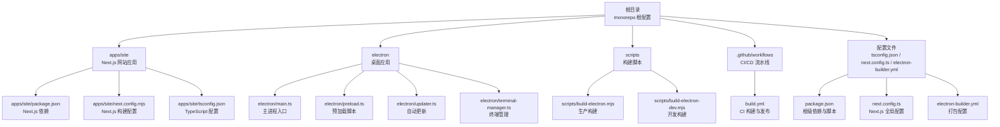
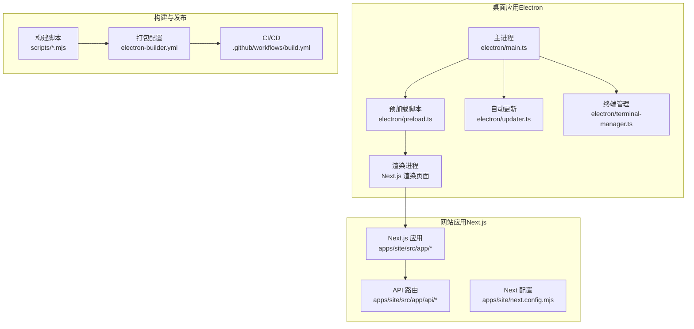
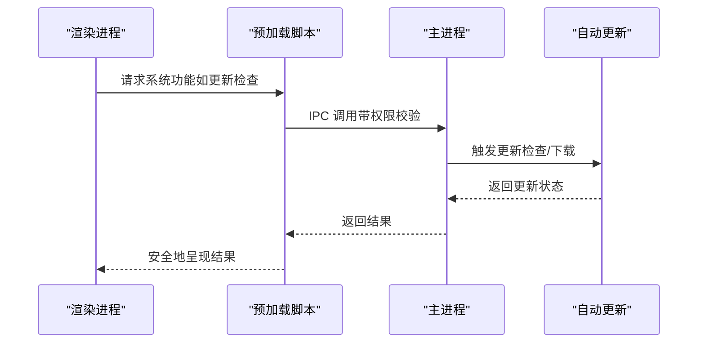
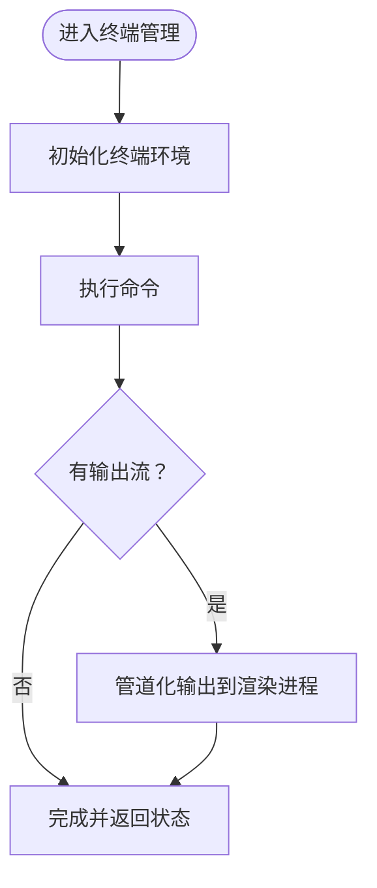
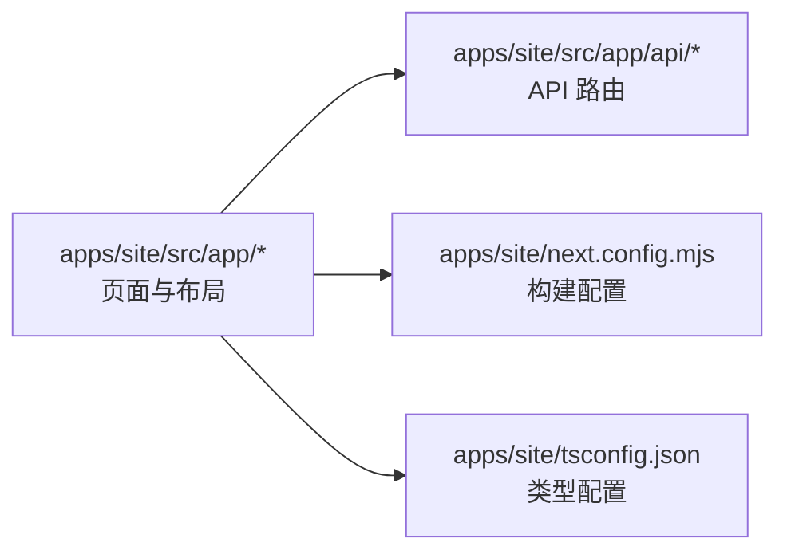
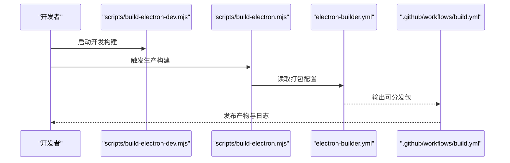
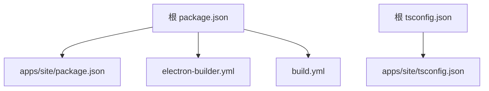

# 技术栈概览

<cite>
**本文引用的文件**
- [package.json](file://package.json)
- [next.config.ts](file://next.config.ts)
- [tsconfig.json](file://tsconfig.json)
- [electron/main.ts](file://electron/main.ts)
- [electron/preload.ts](file://electron/preload.ts)
- [electron/updater.ts](file://electron/updater.ts)
- [electron/terminal-manager.ts](file://electron/terminal-manager.ts)
- [apps/site/package.json](file://apps/site/package.json)
- [apps/site/next.config.mjs](file://apps/site/next.config.mjs)
- [apps/site/tsconfig.json](file://apps/site/tsconfig.json)
- [scripts/build-electron.mjs](file://scripts/build-electron.mjs)
- [scripts/build-electron-dev.mjs](file://scripts/build-electron-dev.mjs)
- [electron-builder.yml](file://electron-builder.yml)
- [.github/workflows/build.yml](file://.github/workflows/build.yml)
- [ARCHITECTURE.md](file://ARCHITECTURE.md)
</cite>

## 目录
1. [引言](#引言)
2. [项目结构](#项目结构)
3. [核心组件](#核心组件)
4. [架构总览](#架构总览)
5. [详细组件分析](#详细组件分析)
6. [依赖分析](#依赖分析)
7. [性能考量](#性能考量)
8. [故障排除指南](#故障排除指南)
9. [结论](#结论)

## 引言
本文件面向开发者与技术审阅者，系统性梳理 CodePilot 的技术栈与架构基础，重点覆盖以下方面：
- 核心技术组合：Electron、Next.js、React、TypeScript 的选择理由与协同方式
- 构建工具链与开发/运行时环境要求
- 应用分层与模块边界：桌面端主进程、渲染进程、预加载脚本、站点应用（Next.js）之间的职责划分
- 关键配置与 CI/CD 流程如何支撑多平台打包与发布
- 面向非技术读者的可读性说明与面向工程师的实现细节

## 项目结构
CodePilot 采用多包/多应用的组织方式：
- 根级 monorepo 结构，包含桌面应用（Electron）、Web 站点（Next.js）、共享源码与测试等
- apps/site 为独立的 Next.js 应用，负责文档/营销页面与部分 API 能力
- electron 子目录承载桌面应用的主进程、预加载脚本、终端管理器与更新逻辑
- scripts 提供构建脚本，electron-builder.yml 配置打包参数
- .github/workflows 定义自动化构建与发布流程

图表来源
- [package.json:1-200](file://package.json#L1-L200)
- [apps/site/package.json:1-200](file://apps/site/package.json#L1-L200)
- [apps/site/next.config.mjs:1-100](file://apps/site/next.config.mjs#L1-L100)
- [apps/site/tsconfig.json:1-100](file://apps/site/tsconfig.json#L1-L100)
- [electron/main.ts:1-100](file://electron/main.ts#L1-L100)
- [electron/preload.ts:1-100](file://electron/preload.ts#L1-L100)
- [electron/updater.ts:1-100](file://electron/updater.ts#L1-L100)
- [electron/terminal-manager.ts:1-100](file://electron/terminal-manager.ts#L1-L100)
- [scripts/build-electron.mjs:1-100](file://scripts/build-electron.mjs#L1-L100)
- [scripts/build-electron-dev.mjs:1-100](file://scripts/build-electron-dev.mjs#L1-L100)
- [electron-builder.yml:1-200](file://electron-builder.yml#L1-L200)
- [.github/workflows/build.yml:1-200](file://.github/workflows/build.yml#L1-L200)

章节来源
- [package.json:1-200](file://package.json#L1-L200)
- [apps/site/package.json:1-200](file://apps/site/package.json#L1-L200)
- [apps/site/next.config.mjs:1-100](file://apps/site/next.config.mjs#L1-L100)
- [apps/site/tsconfig.json:1-100](file://apps/site/tsconfig.json#L1-L100)
- [electron/main.ts:1-100](file://electron/main.ts#L1-L100)
- [electron/preload.ts:1-100](file://electron/preload.ts#L1-L100)
- [electron/updater.ts:1-100](file://electron/updater.ts#L1-L100)
- [electron/terminal-manager.ts:1-100](file://electron/terminal-manager.ts#L1-L100)
- [scripts/build-electron.mjs:1-100](file://scripts/build-electron.mjs#L1-L100)
- [scripts/build-electron-dev.mjs:1-100](file://scripts/build-electron-dev.mjs#L1-L100)
- [electron-builder.yml:1-200](file://electron-builder.yml#L1-L200)
- [.github/workflows/build.yml:1-200](file://.github/workflows/build.yml#L1-L200)

## 核心组件
- Electron 主进程：负责应用生命周期、窗口管理、系统集成与自动更新
- 预加载脚本：在受控上下文中暴露安全的 API 给渲染进程，隔离 Node.js 能力
- 终端管理器：封装跨平台终端交互，支持命令执行与输出流处理
- 自动更新：基于 GitHub Releases 的更新机制，支持静默下载与重启安装
- Next.js 网站应用：文档/营销页面与部分 API 能力，采用 App Router 与服务端特性
- TypeScript：全栈类型安全，统一的编译配置与严格模式约束
- 构建脚本：封装开发与生产构建流程，结合 electron-builder 实现多平台打包

章节来源
- [electron/main.ts:1-100](file://electron/main.ts#L1-L100)
- [electron/preload.ts:1-100](file://electron/preload.ts#L1-L100)
- [electron/terminal-manager.ts:1-100](file://electron/terminal-manager.ts#L1-L100)
- [electron/updater.ts:1-100](file://electron/updater.ts#L1-L100)
- [apps/site/next.config.mjs:1-100](file://apps/site/next.config.mjs#L1-L100)
- [tsconfig.json:1-100](file://tsconfig.json#L1-L100)
- [scripts/build-electron.mjs:1-100](file://scripts/build-electron.mjs#L1-L100)
- [scripts/build-electron-dev.mjs:1-100](file://scripts/build-electron-dev.mjs#L1-L100)

## 架构总览
整体架构由“桌面应用 + 网站应用”双引擎构成，通过 Electron 将 Next.js 的 Web 能力与原生系统能力整合。

图表来源
- [electron/main.ts:1-100](file://electron/main.ts#L1-L100)
- [electron/preload.ts:1-100](file://electron/preload.ts#L1-L100)
- [electron/updater.ts:1-100](file://electron/updater.ts#L1-L100)
- [electron/terminal-manager.ts:1-100](file://electron/terminal-manager.ts#L1-L100)
- [apps/site/src/app:1-200](file://apps/site/src/app#L1-L200)
- [apps/site/src/app/api:1-200](file://apps/site/src/app/api#L1-L200)
- [apps/site/next.config.mjs:1-100](file://apps/site/next.config.mjs#L1-L100)
- [scripts/build-electron.mjs:1-100](file://scripts/build-electron.mjs#L1-L100)
- [electron-builder.yml:1-200](file://electron-builder.yml#L1-L200)
- [.github/workflows/build.yml:1-200](file://.github/workflows/build.yml#L1-L200)

## 详细组件分析

### Electron 主进程与预加载脚本
- 主进程负责创建窗口、菜单、托盘、系统级事件监听与自动更新触发
- 预加载脚本在受限环境中注入安全的桥接 API，使渲染进程能调用主进程功能而不暴露完整 Node.js 环境
- 二者通过 IPC 通信，确保桌面应用的安全边界与功能完整性

图表来源
- [electron/preload.ts:1-100](file://electron/preload.ts#L1-L100)
- [electron/main.ts:1-100](file://electron/main.ts#L1-L100)
- [electron/updater.ts:1-100](file://electron/updater.ts#L1-L100)

章节来源
- [electron/main.ts:1-100](file://electron/main.ts#L1-L100)
- [electron/preload.ts:1-100](file://electron/preload.ts#L1-L100)
- [electron/updater.ts:1-100](file://electron/updater.ts#L1-L100)

### 终端管理器
- 负责跨平台终端初始化、命令执行、输出流处理与错误捕获
- 与主进程协作，提供稳定的本地开发体验与外部工具集成

图表来源
- [electron/terminal-manager.ts:1-100](file://electron/terminal-manager.ts#L1-L100)

章节来源
- [electron/terminal-manager.ts:1-100](file://electron/terminal-manager.ts#L1-L100)

### Next.js 网站应用
- 使用 App Router，具备服务端渲染、静态生成与 API 路由能力
- 通过独立的 package.json 与 tsconfig 管理站点依赖与类型配置
- 与桌面应用共享部分工具库与类型定义，保持一致的开发体验

图表来源
- [apps/site/src/app:1-200](file://apps/site/src/app#L1-L200)
- [apps/site/src/app/api:1-200](file://apps/site/src/app/api#L1-L200)
- [apps/site/next.config.mjs:1-100](file://apps/site/next.config.mjs#L1-L100)
- [apps/site/tsconfig.json:1-100](file://apps/site/tsconfig.json#L1-L100)

章节来源
- [apps/site/package.json:1-200](file://apps/site/package.json#L1-L200)
- [apps/site/next.config.mjs:1-100](file://apps/site/next.config.mjs#L1-L100)
- [apps/site/tsconfig.json:1-100](file://apps/site/tsconfig.json#L1-L100)

### 构建与发布流水线
- 开发构建：scripts/build-electron-dev.mjs 启动开发服务器与热重载
- 生产构建：scripts/build-electron.mjs 打包 Next.js 与 Electron 资源
- 打包配置：electron-builder.yml 指定图标、签名、目标平台与输出目录
- CI/CD：build.yml 在不同平台执行构建、测试与发布任务

图表来源
- [scripts/build-electron-dev.mjs:1-100](file://scripts/build-electron-dev.mjs#L1-L100)
- [scripts/build-electron.mjs:1-100](file://scripts/build-electron.mjs#L1-L100)
- [electron-builder.yml:1-200](file://electron-builder.yml#L1-L200)
- [.github/workflows/build.yml:1-200](file://.github/workflows/build.yml#L1-L200)

章节来源
- [scripts/build-electron-dev.mjs:1-100](file://scripts/build-electron-dev.mjs#L1-L100)
- [scripts/build-electron.mjs:1-100](file://scripts/build-electron.mjs#L1-L100)
- [electron-builder.yml:1-200](file://electron-builder.yml#L1-L200)
- [.github/workflows/build.yml:1-200](file://.github/workflows/build.yml#L1-L200)

## 依赖分析
- 根级 package.json 管理 monorepo 依赖与脚本，apps/site/package.json 独立声明 Next.js 生态依赖
- electron-builder.yml 与 CI 工作流共同决定打包目标与发布策略
- TypeScript 配置在根与站点分别约束编译选项与路径映射，保证类型一致性

图表来源
- [package.json:1-200](file://package.json#L1-L200)
- [apps/site/package.json:1-200](file://apps/site/package.json#L1-L200)
- [tsconfig.json:1-100](file://tsconfig.json#L1-L100)
- [apps/site/tsconfig.json:1-100](file://apps/site/tsconfig.json#L1-L100)
- [electron-builder.yml:1-200](file://electron-builder.yml#L1-L200)
- [.github/workflows/build.yml:1-200](file://.github/workflows/build.yml#L1-L200)

章节来源
- [package.json:1-200](file://package.json#L1-L200)
- [apps/site/package.json:1-200](file://apps/site/package.json#L1-L200)
- [tsconfig.json:1-100](file://tsconfig.json#L1-L100)
- [apps/site/tsconfig.json:1-100](file://apps/site/tsconfig.json#L1-L100)
- [electron-builder.yml:1-200](file://electron-builder.yml#L1-L200)
- [.github/workflows/build.yml:1-200](file://.github/workflows/build.yml#L1-L200)

## 性能考量
- Electron 主进程与渲染进程的职责分离有助于避免阻塞 UI 响应
- 预加载脚本限制 Node.js 能力暴露面，降低安全风险同时减少不必要的上下文切换
- Next.js 的 App Router 支持服务端渲染与静态生成，可显著降低首屏加载时间
- 终端管理器对输出流进行管道化处理，避免大体量日志阻塞主线程
- CI/CD 分阶段构建与缓存策略可缩短构建时间，提升迭代效率

## 故障排除指南
- 自动更新失败：检查 electron/updater.ts 中的更新源与网络策略，确认 electron-builder.yml 的发布配置
- 预加载脚本报错：核对 electron/preload.ts 的 API 注入与渲染进程调用是否匹配
- 终端命令无输出：排查 electron/terminal-manager.ts 的命令执行与流处理逻辑
- Next.js 构建异常：检查 apps/site/next.config.mjs 与 apps/site/tsconfig.json 的配置项与依赖版本
- CI 构建失败：查看 .github/workflows/build.yml 的步骤与日志，定位平台差异或依赖缺失

章节来源
- [electron/updater.ts:1-100](file://electron/updater.ts#L1-L100)
- [electron/preload.ts:1-100](file://electron/preload.ts#L1-L100)
- [electron/terminal-manager.ts:1-100](file://electron/terminal-manager.ts#L1-L100)
- [apps/site/next.config.mjs:1-100](file://apps/site/next.config.mjs#L1-L100)
- [apps/site/tsconfig.json:1-100](file://apps/site/tsconfig.json#L1-L100)
- [.github/workflows/build.yml:1-200](file://.github/workflows/build.yml#L1-L200)

## 结论
CodePilot 的技术栈以 Electron 为核心，结合 Next.js 的现代 Web 能力与 TypeScript 的类型安全，形成“桌面 + 网站”的双引擎架构。通过清晰的模块边界、严格的类型约束与完善的 CI/CD 流程，项目在功能扩展、安全性与可维护性之间取得平衡。开发者可据此快速理解架构基础并高效开展后续开发与优化工作。