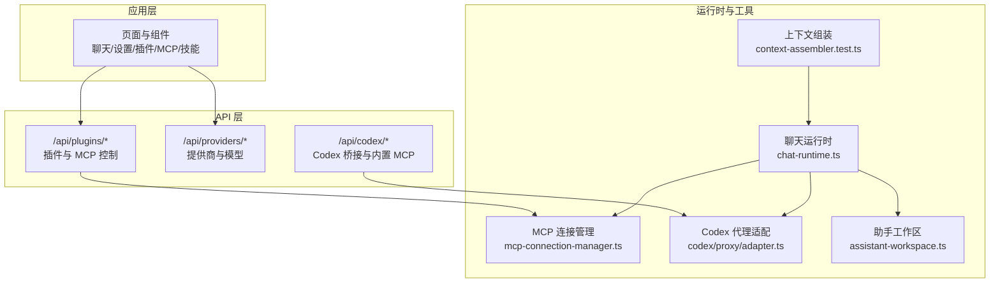
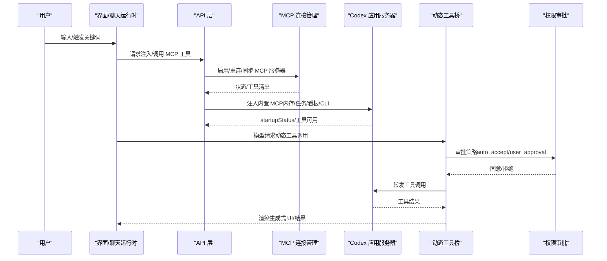
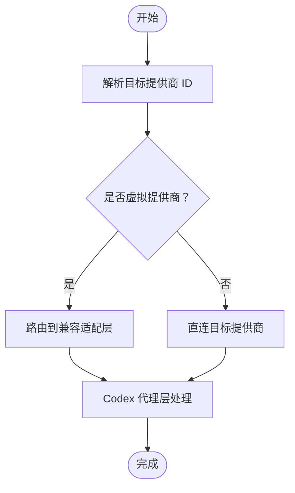
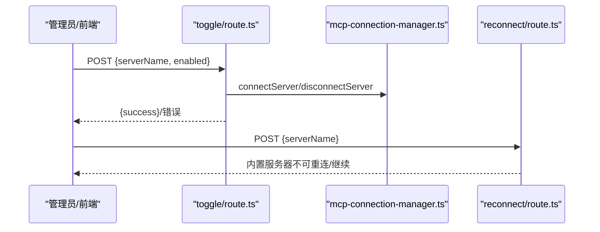
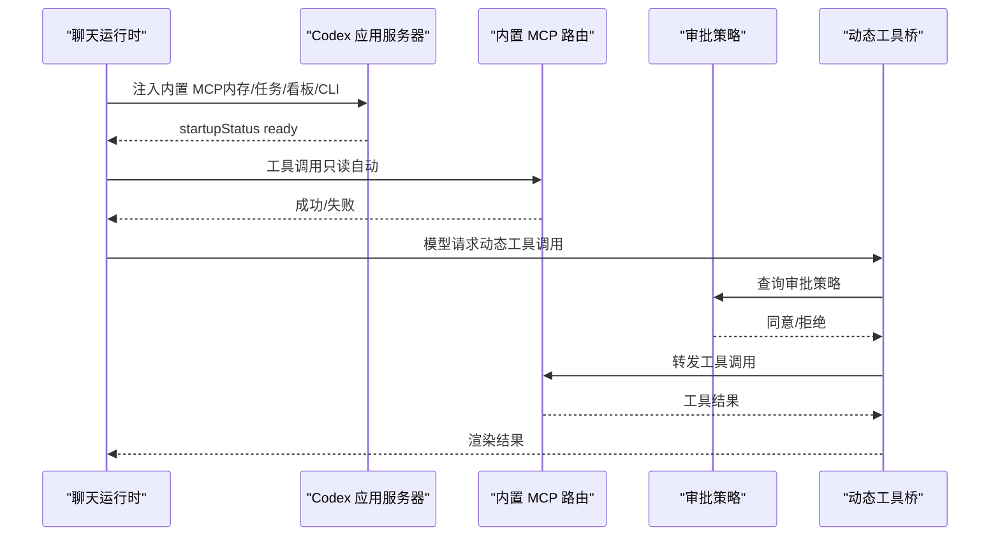
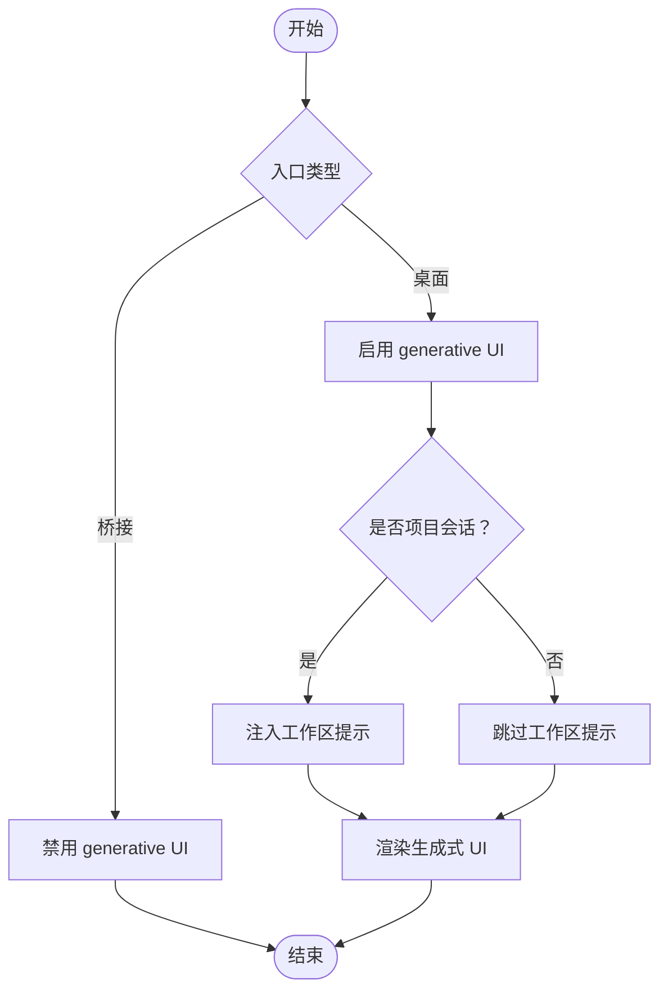
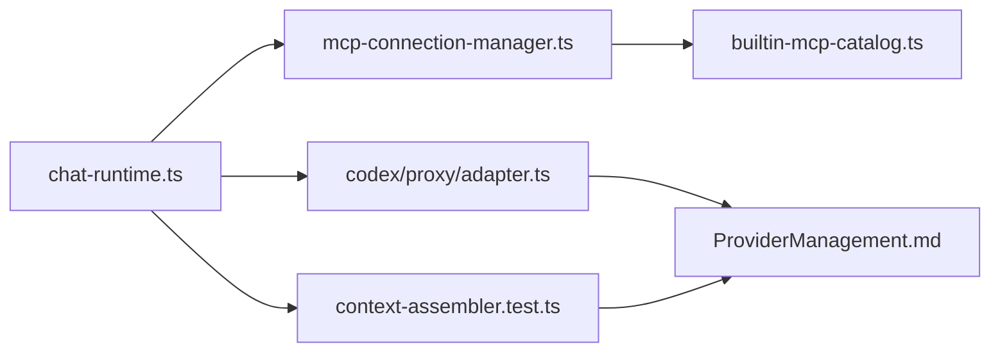

# 核心特性

<cite>
**本文引用的文件**
- [src/app/api/plugins/mcp/toggle/route.ts](file://src/app/api/plugins/mcp/toggle/route.ts)
- [src/app/api/plugins/mcp/reconnect/route.ts](file://src/app/api/plugins/mcp/reconnect/route.ts)
- [docs/guardrails/MCP.md](file://docs/guardrails/MCP.md)
- [src/lib/mcp-connection-manager.ts](file://src/lib/mcp-connection-manager.ts)
- [docs/insights/dashboard-generative-ui.md](file://docs/insights/dashboard-generative-ui.md)
- [src/__tests__/unit/context-assembler.test.ts](file://src/__tests__/unit/context-assembler.test.ts)
- [src/lib/codex/proxy/adapter.ts](file://src/lib/codex/proxy/adapter.ts)
- [src/__tests__/unit/codex-proxy-virtual-providers.test.ts](file://src/__tests__/unit/codex-proxy-virtual-providers.test.ts)
- [docs/exec-plans/completed/phase-8-codex-mcp-context-injection.md](file://docs/exec-plans/completed/phase-8-codex-mcp-context-injection.md)
- [src/lib/assistant-workspace.ts](file://src/lib/assistant-workspace.ts)
- [src/lib/builtin-mcp-catalog.ts](file://src/lib/builtin-mcp-catalog.ts)
- [src/lib/provider-resolver.ts](file://src/lib/provider-resolver.ts)
- [src/lib/chat-runtime.ts](file://src/lib/chat-runtime.ts)
- [docs/guardrails/ProviderManagement.md](file://docs/guardrails/ProviderManagement.md)
</cite>

## 目录
1. [简介](#简介)
2. [项目结构](#项目结构)
3. [核心组件](#核心组件)
4. [架构总览](#架构总览)
5. [详细组件分析](#详细组件分析)
6. [依赖分析](#依赖分析)
7. [性能考量](#性能考量)
8. [故障排查指南](#故障排查指南)
9. [结论](#结论)
10. [附录](#附录)

## 简介
本文件聚焦 CodePilot 的核心特性与实现，围绕以下主题展开：多提供商支持、MCP 协议扩展、远程桥接控制、生成式 UI、助手工作空间。文档同时给出技术原理、使用场景、优势、实践配置与常见问题排查，帮助不同技术背景的用户快速理解与上手。

## 项目结构
- 应用入口与页面：Next.js App Router 路由组织，包含聊天、设置、插件、MCP、技能等页面。
- API 层：位于 src/app/api 下，提供插件、桥接、聊天、模型、设置、工作区等接口。
- 核心运行时与工具：src/lib 下包含 MCP 连接管理、Codex 代理适配、上下文组装、工作区、内置 MCP 目录、提供商解析等模块。
- 文档与策略：docs/guardrails 与 docs/insights 提供治理与设计洞察，exec-plans 记录已完成的工程计划与落地细节。

**图表来源**
- [src/lib/chat-runtime.ts](file://src/lib/chat-runtime.ts)
- [src/lib/mcp-connection-manager.ts](file://src/lib/mcp-connection-manager.ts)
- [src/lib/codex/proxy/adapter.ts](file://src/lib/codex/proxy/adapter.ts)
- [src/lib/assistant-workspace.ts](file://src/lib/assistant-workspace.ts)
- [src/__tests__/unit/context-assembler.test.ts](file://src/__tests__/unit/context-assembler.test.ts)

**章节来源**
- [src/lib/chat-runtime.ts](file://src/lib/chat-runtime.ts)
- [src/lib/mcp-connection-manager.ts](file://src/lib/mcp-connection-manager.ts)
- [src/lib/codex/proxy/adapter.ts](file://src/lib/codex/proxy/adapter.ts)
- [src/lib/assistant-workspace.ts](file://src/lib/assistant-workspace.ts)
- [src/__tests__/unit/context-assembler.test.ts](file://src/__tests__/unit/context-assembler.test.ts)

## 核心组件
- 多提供商支持：通过 provider-resolver 与虚拟提供商适配，统一对接不同 AI 服务（含 OAuth、Codex Account 等）。
- MCP 协议扩展：内置 MCP 服务器目录与连接管理，支持外置 MCP 服务器的动态启用/重连与权限审批。
- 远程桥接控制：Codex 原生注入 MCP（内存、任务通知、仪表盘、CLI 工具等），结合动态工具桥接实现模型自主调用。
- 生成式 UI：将 AI 生成的可视化工件持久化为可交互组件，支持看板与项目入口的“同样数据，你想怎么看就怎么看”。
- 助手工作空间：以文件系统为“图书馆”，提供项目级上下文与可视化摘要，降低协作摩擦。

**章节来源**
- [src/lib/provider-resolver.ts](file://src/lib/provider-resolver.ts)
- [src/lib/builtin-mcp-catalog.ts](file://src/lib/builtin-mcp-catalog.ts)
- [src/lib/mcp-connection-manager.ts](file://src/lib/mcp-connection-manager.ts)
- [docs/exec-plans/completed/phase-8-codex-mcp-context-injection.md](file://docs/exec-plans/completed/phase-8-codex-mcp-context-injection.md)
- [docs/insights/dashboard-generative-ui.md](file://docs/insights/dashboard-generative-ui.md)
- [src/lib/assistant-workspace.ts](file://src/lib/assistant-workspace.ts)

## 架构总览
下图展示 MCP 与 Codex 注入、权限审批、动态工具桥接的关键交互路径，以及生成式 UI 的持久化与渲染。

**图表来源**
- [src/lib/mcp-connection-manager.ts](file://src/lib/mcp-connection-manager.ts)
- [docs/exec-plans/completed/phase-8-codex-mcp-context-injection.md](file://docs/exec-plans/completed/phase-8-codex-mcp-context-injection.md)
- [src/lib/codex/proxy/adapter.ts](file://src/lib/codex/proxy/adapter.ts)

## 详细组件分析

### 多提供商支持
- 设计要点
  - 虚拟提供商适配：将特定 provider_id（如 openai-oauth、codex_account）映射到兼容层，避免 provider_not_found，并在代理层进行路由与凭据注入。
  - 运行时一致性：Codex 与 Claude 路径共享上下文组装与提示注入策略，保证不同提供商下行为一致。
- 关键实现
  - 虚拟提供商注册与兼容性约束，确保 API 模型路由与代理适配一致。
  - 单元测试验证虚拟提供商解析不返回 provider_not_found，代理层正确接收虚拟 id。
- 使用场景与优势
  - 无缝对接多种 AI 服务（含 OAuth 与账户体系），减少 UI 与后端差异。
  - 通过虚拟 id 保持上游 API 的稳定性与可演进性。

**图表来源**
- [src/lib/codex/proxy/adapter.ts](file://src/lib/codex/proxy/adapter.ts)
- [src/__tests__/unit/codex-proxy-virtual-providers.test.ts](file://src/__tests__/unit/codex-proxy-virtual-providers.test.ts)

**章节来源**
- [src/lib/codex/proxy/adapter.ts](file://src/lib/codex/proxy/adapter.ts)
- [src/__tests__/unit/codex-proxy-virtual-providers.test.ts](file://src/__tests__/unit/codex-proxy-virtual-providers.test.ts)
- [src/lib/provider-resolver.ts](file://src/lib/provider-resolver.ts)

### MCP 协议扩展
- 设计要点
  - 内置 MCP 服务器目录与连接管理：集中管理服务器启停、状态同步与工具清单。
  - 插件 API：提供启用/禁用与重连接口，支持即时生效与延迟生效两种模式。
  - 治理与契约：MCP 状态查询自动解析 session→providerId，内置服务器不可重连，避免误导。
- 关键实现
  - 启用/禁用：POST /api/plugins/mcp/toggle，直接操作连接管理器，立即断开或在下一条消息时重连。
  - 重连：POST /api/plugins/mcp/reconnect，对内置服务器显式拒绝，避免错误路径。
  - 连接池同步：根据期望配置连接新服务器、断开移除的服务器。
- 使用场景与优势
  - 快速启用/禁用第三方工具链，降低集成门槛。
  - 通过内置治理避免“未知服务器”等模糊错误，提升可观测性与可维护性。

**图表来源**
- [src/app/api/plugins/mcp/toggle/route.ts](file://src/app/api/plugins/mcp/toggle/route.ts)
- [src/app/api/plugins/mcp/reconnect/route.ts](file://src/app/api/plugins/mcp/reconnect/route.ts)
- [src/lib/mcp-connection-manager.ts](file://src/lib/mcp-connection-manager.ts)

**章节来源**
- [src/app/api/plugins/mcp/toggle/route.ts](file://src/app/api/plugins/mcp/toggle/route.ts)
- [src/app/api/plugins/mcp/reconnect/route.ts](file://src/app/api/plugins/mcp/reconnect/route.ts)
- [docs/guardrails/MCP.md](file://docs/guardrails/MCP.md)
- [src/lib/mcp-connection-manager.ts](file://src/lib/mcp-connection-manager.ts)

### 远程桥接控制（Codex 原生注入与动态工具桥）
- 设计要点
  - 原生注入：Codex 应用服务器支持在 thread/start 时注入 config.mcp_servers，即时启动并上报 startupStatus。
  - 内置 MCP：内存搜索、任务通知、仪表盘、CLI 工具等内置 MCP 通过拆分 server 名称实现“只读自动、写入审批”的策略。
  - 动态工具桥：模型在 turn 内发起的工具调用通过 item/tool/call 转发至 MCP，结合权限策略进行审批。
- 关键实现
  - 注入与状态：构建 Codex MCP 配置、路由注册、监听 startupStatus 通知流。
  - 审批策略：基于内置 MCP 的 elicitPolicy（auto_accept/user_approval/decline）与权限请求 UI。
  - 动态转发：将动态工具调用映射为 MCP 工具调用，失败优雅处理。
- 使用场景与优势
  - 在不改变模型训练的情况下，将本地能力以 MCP 形式安全注入，支持模型在自然对话中主动调用。
  - 通过审批策略与权限 UI，确保敏感操作（如写入）得到用户确认。

**图表来源**
- [docs/exec-plans/completed/phase-8-codex-mcp-context-injection.md](file://docs/exec-plans/completed/phase-8-codex-mcp-context-injection.md)

**章节来源**
- [docs/exec-plans/completed/phase-8-codex-mcp-context-injection.md](file://docs/exec-plans/completed/phase-8-codex-mcp-context-injection.md)

### 生成式 UI
- 设计要点
  - 生成式 UI 作为可持久化的视觉工件，替代传统文档与看板，支持“同样的数据，你想怎么看就怎么看”。
  - 与工作区联动：桌面入口启用 generative UI，桥接入口禁用；项目会话注入工作区提示。
  - 看板与项目入口：通过 widget 渲染基础设施实现项目看板与可视化摘要。
- 关键实现
  - 上下文注入：根据入口类型与会话属性决定是否启用 generative UI 与工作区提示。
  - 文档与测试：insights 文档阐述设计理念，单元测试验证注入行为。
- 使用场景与优势
  - 提升协作效率：AI 生成的可视化工件可直接在工作区中查看、编辑与导出。
  - 降低摩擦：以原生格式（md/csv/html/代码）承载信息，减少转换成本。

**图表来源**
- [src/__tests__/unit/context-assembler.test.ts](file://src/__tests__/unit/context-assembler.test.ts)
- [docs/insights/dashboard-generative-ui.md](file://docs/insights/dashboard-generative-ui.md)

**章节来源**
- [src/__tests__/unit/context-assembler.test.ts](file://src/__tests__/unit/context-assembler.test.ts)
- [docs/insights/dashboard-generative-ui.md](file://docs/insights/dashboard-generative-ui.md)

### 助手工作空间
- 设计要点
  - 以文件系统为“图书馆”，提供项目级上下文与可视化摘要，支持项目面板、全局搜索与侧边栏标签。
  - 与生成式 UI 协同：工作区路径与生成式 UI 的渲染边界一致，确保访问安全与一致性。
- 关键实现
  - 工作区配置与索引：工作区路径、索引与检索逻辑。
  - 安全鉴权：内置 MCP 路由对 workspace 进行等值校验，防止越权访问。
- 使用场景与优势
  - 项目入口即“视觉摘要”：无需翻阅聊天历史，即可了解项目状态。
  - 跨平台一致体验：在桌面与桥接入口下，工作区能力保持一致的安全边界。

**章节来源**
- [src/lib/assistant-workspace.ts](file://src/lib/assistant-workspace.ts)
- [docs/exec-plans/completed/phase-8-codex-mcp-context-injection.md](file://docs/exec-plans/completed/phase-8-codex-mcp-context-injection.md)

## 依赖分析
- 组件耦合
  - chat-runtime 依赖 MCP 连接管理与 Codex 代理适配，以实现多提供商与 MCP 工具调用。
  - 上下文组装在不同入口与会话类型下选择性注入工作区提示与生成式 UI 开关。
  - 内置 MCP 目录与治理文档确保服务器生命周期与权限策略清晰可控。
- 外部依赖与集成点
  - Codex 应用服务器通过 stdio/streamable_http 与 HTTP 路由集成 MCP。
  - 提供商管理文档与治理规范约束提供商变更与迁移。

**图表来源**
- [src/lib/chat-runtime.ts](file://src/lib/chat-runtime.ts)
- [src/lib/mcp-connection-manager.ts](file://src/lib/mcp-connection-manager.ts)
- [src/lib/codex/proxy/adapter.ts](file://src/lib/codex/proxy/adapter.ts)
- [src/lib/builtin-mcp-catalog.ts](file://src/lib/builtin-mcp-catalog.ts)
- [docs/guardrails/ProviderManagement.md](file://docs/guardrails/ProviderManagement.md)
- [src/__tests__/unit/context-assembler.test.ts](file://src/__tests__/unit/context-assembler.test.ts)

**章节来源**
- [src/lib/chat-runtime.ts](file://src/lib/chat-runtime.ts)
- [src/lib/mcp-connection-manager.ts](file://src/lib/mcp-connection-manager.ts)
- [src/lib/codex/proxy/adapter.ts](file://src/lib/codex/proxy/adapter.ts)
- [src/lib/builtin-mcp-catalog.ts](file://src/lib/builtin-mcp-catalog.ts)
- [docs/guardrails/ProviderManagement.md](file://docs/guardrails/ProviderManagement.md)
- [src/__tests__/unit/context-assembler.test.ts](file://src/__tests__/unit/context-assembler.test.ts)

## 性能考量
- 连接池与增量同步：通过 syncMcpConnections 仅连接新增或失败的服务器，减少无效重连。
- 路由与传输：内置 MCP 使用 streamable_http 路由复用在跑的 Next 服务，避免 stdio 子进程打包态复杂度。
- 权限审批短路：auto_accept 的只读工具无需用户交互，降低延迟；写入类工具通过权限 UI 审批，避免阻塞主线程。

## 故障排查指南
- MCP 启用/禁用失败
  - 检查请求参数是否包含 serverName 与 enabled（布尔）。
  - 若服务器不存在或连接失败，将延迟到下一条消息生效；内置服务器不可重连。
- 内置 MCP 不可用
  - 确认内置服务器名称是否在内置目录中；内置服务器不可通过重连接口操作。
- Codex 注入异常
  - 查看 startupStatus 通知流而非轮询 list；失败时关注详细错误信息。
  - 确认工作区路径鉴权：路由对 x-codepilot-workspace-path 进行等值校验，防止越权。
- 权限审批未弹窗
  - 检查工具是否属于 user_approval 策略；确认审批请求 UI 是否正常注册与显示。

**章节来源**
- [src/app/api/plugins/mcp/toggle/route.ts](file://src/app/api/plugins/mcp/toggle/route.ts)
- [src/app/api/plugins/mcp/reconnect/route.ts](file://src/app/api/plugins/mcp/reconnect/route.ts)
- [docs/guardrails/MCP.md](file://docs/guardrails/MCP.md)
- [docs/exec-plans/completed/phase-8-codex-mcp-context-injection.md](file://docs/exec-plans/completed/phase-8-codex-mcp-context-injection.md)

## 结论
CodePilot 通过多提供商支持、MCP 协议扩展、远程桥接控制、生成式 UI 与助手工作空间，构建了“AI 原生工作空间”。其核心优势在于：
- 以统一的提供商与代理适配，屏蔽底层差异；
- 以 MCP 与 Codex 原生注入，将本地能力安全、可控地引入模型；
- 以生成式 UI 与工作区，提供“同样数据，你想怎么看就怎么看”的协作体验；
- 以严格的治理与权限策略，确保可观察、可审计、可回滚。

## 附录
- 使用示例与配置建议（概览）
  - 多提供商：在设置中添加/切换提供商，使用虚拟提供商 ID 以获得稳定路由。
  - MCP：通过插件页启用/禁用第三方 MCP 服务器；内置服务器通过治理文档确认。
  - Codex 注入：确保 thread/start 时注入 config.mcp_servers；只读工具自动可用，写入工具弹权限卡。
  - 生成式 UI：在桌面入口启用后，模型可生成可视化工件；项目会话自动注入工作区提示。
  - 助手工作区：配置工作区路径，确保路由鉴权通过；在看板中查看与导出生成式 UI。