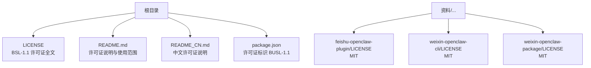
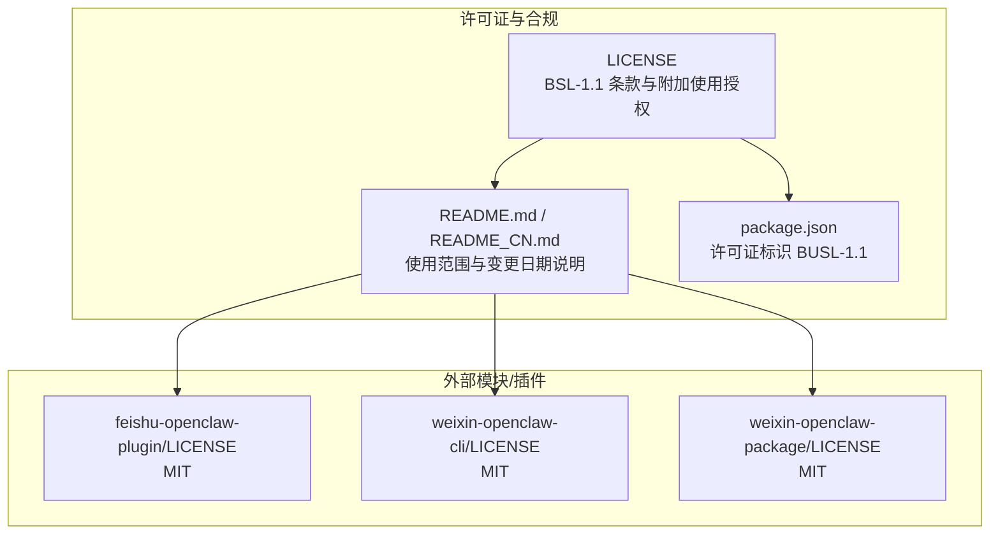
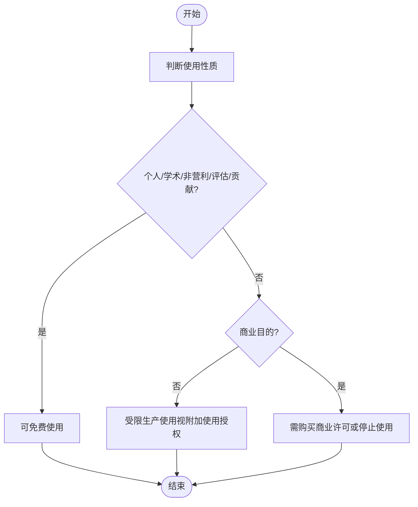
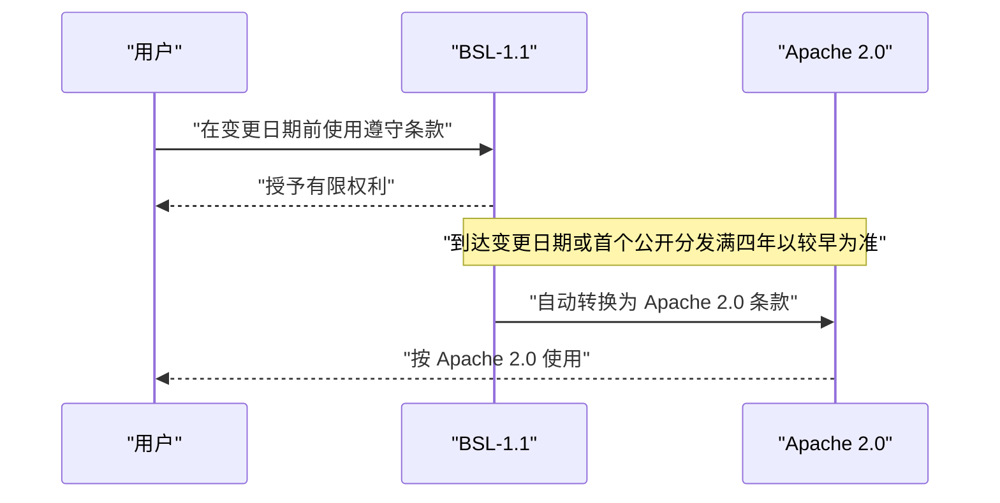
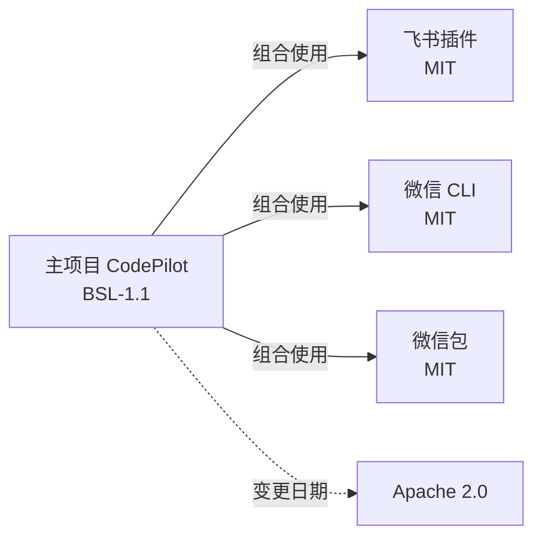

# 许可证信息

<cite>
**本文引用的文件**
- [LICENSE](file://LICENSE)
- [README.md](file://README.md)
- [README_CN.md](file://README_CN.md)
- [package.json](file://package.json)
- [资料/feishu-openclaw-plugin/package/LICENSE](file://资料/feishu-openclaw-plugin/package/LICENSE)
- [资料/weixin-openclaw-cli/package/LICENSE](file://资料/weixin-openclaw-cli/package/LICENSE)
- [资料/weixin-openclaw-package/package/LICENSE](file://资料/weixin-openclaw-package/package/LICENSE)
</cite>

## 目录
1. [简介](#简介)
2. [项目结构](#项目结构)
3. [核心组件](#核心组件)
4. [架构总览](#架构总览)
5. [详细组件分析](#详细组件分析)
6. [依赖分析](#依赖分析)
7. [性能考虑](#性能考虑)
8. [故障排查指南](#故障排查指南)
9. [结论](#结论)
10. [附录](#附录)

## 简介
本页面向使用者与组织，系统性说明 CodePilot 的许可证与合规使用要点。当前许可证为 Business Source License 1.1（简称“BSL-1.1”），包含明确的附加使用授权、变更日期与后续 Apache 2.0 转换安排。同时，项目 README 与 package.json 中也提供了关键的许可证标识与合规指引。

## 项目结构
围绕许可证与合规使用的关键文件分布如下：
- 根许可证文本：LICENSE
- 项目主页与许可证说明：README.md、README_CN.md
- 项目元数据与许可证标识：package.json
- 相关子模块/插件的独立许可证（MIT）：资料/feishu-openclaw-plugin/package/LICENSE、资料/weixin-openclaw-cli/package/LICENSE、资料/weixin-openclaw-package/package/LICENSE

**图表来源**
- [LICENSE](file://LICENSE)
- [README.md](file://README.md)
- [README_CN.md](file://README_CN.md)
- [package.json](file://package.json)
- [资料/feishu-openclaw-plugin/package/LICENSE](file://资料/feishu-openclaw-plugin/package/LICENSE)
- [资料/weixin-openclaw-cli/package/LICENSE](file://资料/weixin-openclaw-cli/package/LICENSE)
- [资料/weixin-openclaw-package/package/LICENSE](file://资料/weixin-openclaw-package/package/LICENSE)

**章节来源**
- [LICENSE](file://LICENSE)
- [README.md](file://README.md)
- [README_CN.md](file://README_CN.md)
- [package.json](file://package.json)

## 核心组件
- 许可证主体：Business Source License 1.1（BSL-1.1）
- 许可证变更日期：2029-03-16
- 变更后适用许可证：Apache License, Version 2.0
- 使用范围与限制：
  - 个人/学术/非营利使用：免费且无限制
  - 商业使用：需另行取得商业许可
- 许可证联系与替代许可咨询渠道：项目作者社交媒体账号

**章节来源**
- [LICENSE](file://LICENSE)
- [README.md](file://README.md)
- [README_CN.md](file://README_CN.md)
- [package.json](file://package.json)

## 架构总览
下图展示许可证相关文件之间的关系与职责分工，帮助理解许可证声明、变更与合规指引的来源。

**图表来源**
- [LICENSE](file://LICENSE)
- [README.md](file://README.md)
- [README_CN.md](file://README_CN.md)
- [package.json](file://package.json)
- [资料/feishu-openclaw-plugin/package/LICENSE](file://资料/feishu-openclaw-plugin/package/LICENSE)
- [资料/weixin-openclaw-cli/package/LICENSE](file://资料/weixin-openclaw-cli/package/LICENSE)
- [资料/weixin-openclaw-package/package/LICENSE](file://资料/weixin-openclaw-package/package/LICENSE)

## 详细组件分析

### BSL-1.1 条款与附加使用授权
- 许可证主体与作品：op7418 为许可人；Licensed Work 为 CodePilot
- 附加使用授权：允许复制、修改、创作衍生作品、再分发以及在非生产环境中使用 Licensed Work
- 生产使用限制：禁止用于商业目的；商业目的的判断标准包括但不限于向第三方出售/许可/提供收费服务，或组织内部员工超过一定规模（例如超过 100 人）
- 免费使用情形：个人使用、学术/教育使用、非营利组织使用、评估与测试、向本项目贡献改进等均不属于商业目的
- 变更日期与后续许可证：Change Date 为 2029-03-16；届时将转换为 Apache License, Version 2.0
- 违规处理：若使用不符合当前 BSL-1.1 要求，需购买商业许可或停止使用
- 显示义务：需在原始或修改副本上显著显示许可证文本

**图表来源**
- [LICENSE](file://LICENSE)

**章节来源**
- [LICENSE](file://LICENSE)

### 许可证变更与 Apache 2.0 转换
- 变更日期：2029-03-16
- 触发条件：在该日期或 Licensed Work 首次公开分发后的第四个周年日（以较早者为准）生效
- 变更后权利：许可人授予按照 Apache 2.0 条款使用的权利，此前授予的有限生产使用权利终止
- 影响范围：每个版本的 Licensed Work 可有不同的变更日期

**图表来源**
- [LICENSE](file://LICENSE)

**章节来源**
- [LICENSE](file://LICENSE)

### README 与 package.json 中的许可证标识与合规指引
- README 明确列出：
  - 许可证类型：BSL-1.1
  - 使用范围：个人/学术/非营利免费；商业使用需单独许可
  - 变更日期：2029-03-16
- package.json 中：
  - license 字段标注为 BUSL-1.1
  - 作者信息与联系方式可用于咨询替代许可安排

**章节来源**
- [README.md](file://README.md)
- [README_CN.md](file://README_CN.md)
- [package.json](file://package.json)

### 相关子模块/插件的许可证
- 飞书插件：MIT 许可证
- 微信 CLI 与微信包：MIT 许可证
- 以上为独立模块，其许可证不影响主项目 CodePilot 的 BSL-1.1 条款，但在组合使用时需分别遵循各模块的许可证要求

**章节来源**
- [资料/feishu-openclaw-plugin/package/LICENSE](file://资料/feishu-openclaw-plugin/package/LICENSE)
- [资料/weixin-openclaw-cli/package/LICENSE](file://资料/weixin-openclaw-cli/package/LICENSE)
- [资料/weixin-openclaw-package/package/LICENSE](file://资料/weixin-openclaw-package/package/LICENSE)

## 依赖分析
- 主项目许可证：BSL-1.1（BUSL-1.1）
- 变更日期：2029-03-16
- 变更后许可证：Apache 2.0
- 组合使用注意事项：若将主项目与 MIT 许可证的子模块/插件组合使用，需同时满足主项目与各子模块的许可证要求

**图表来源**
- [LICENSE](file://LICENSE)
- [资料/feishu-openclaw-plugin/package/LICENSE](file://资料/feishu-openclaw-plugin/package/LICENSE)
- [资料/weixin-openclaw-cli/package/LICENSE](file://资料/weixin-openclaw-cli/package/LICENSE)
- [资料/weixin-openclaw-package/package/LICENSE](file://资料/weixin-openclaw-package/package/LICENSE)

**章节来源**
- [LICENSE](file://LICENSE)
- [资料/feishu-openclaw-plugin/package/LICENSE](file://资料/feishu-openclaw-plugin/package/LICENSE)
- [资料/weixin-openclaw-cli/package/LICENSE](file://资料/weixin-openclaw-cli/package/LICENSE)
- [资料/weixin-openclaw-package/package/LICENSE](file://资料/weixin-openclaw-package/package/LICENSE)

## 性能考虑
- 本节为通用建议，不涉及具体文件分析
- 合规使用建议：
  - 个人/学术/非营利用户：可直接使用，注意保留许可证声明
  - 商业用户：尽早联系许可方获取商业许可，避免未来变更带来的不确定性
  - 关注变更日期：提前规划迁移至 Apache 2.0 后的使用策略

## 故障排查指南
- 常见问题与处理
  - 使用性质不确定：参考 BSL-1.1 的“商业目的”定义与“附加使用授权”的免商业用途清单
  - 何时需要商业许可：若使用行为属于商业目的，应购买商业许可或停止使用
  - 组合使用合规：若引入 MIT 许可证模块，请同时满足主项目与模块的许可证要求
  - 变更日期临近：关注 2029-03-16 的影响，提前评估迁移成本与收益

**章节来源**
- [LICENSE](file://LICENSE)
- [资料/feishu-openclaw-plugin/package/LICENSE](file://资料/feishu-openclaw-plugin/package/LICENSE)
- [资料/weixin-openclaw-cli/package/LICENSE](file://资料/weixin-openclaw-cli/package/LICENSE)
- [资料/weixin-openclaw-package/package/LICENSE](file://资料/weixin-openclaw-package/package/LICENSE)

## 结论
- CodePilot 当前采用 BSL-1.1，提供个人/学术/非营利免费使用权益
- 商业使用需另行取得许可
- 变更日期为 2029-03-16，届时将转换为 Apache 2.0
- 合规使用的关键在于准确识别使用性质、遵守附加使用授权、及时获取商业许可（如需），并在变更日期前后做好迁移准备

## 附录
- 许可证联系与替代许可咨询：项目作者社交媒体账号（README 与 package.json 中提供）

**章节来源**
- [README.md](file://README.md)
- [README_CN.md](file://README_CN.md)
- [package.json](file://package.json)