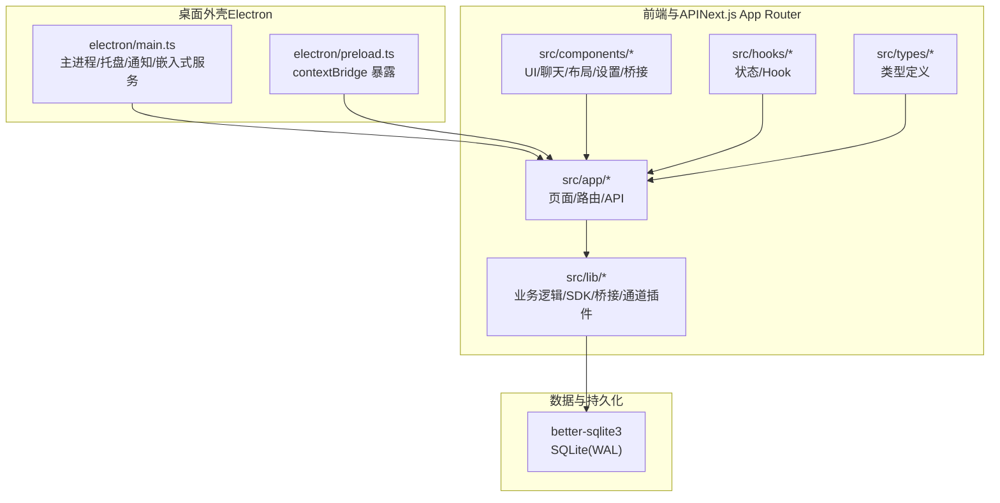
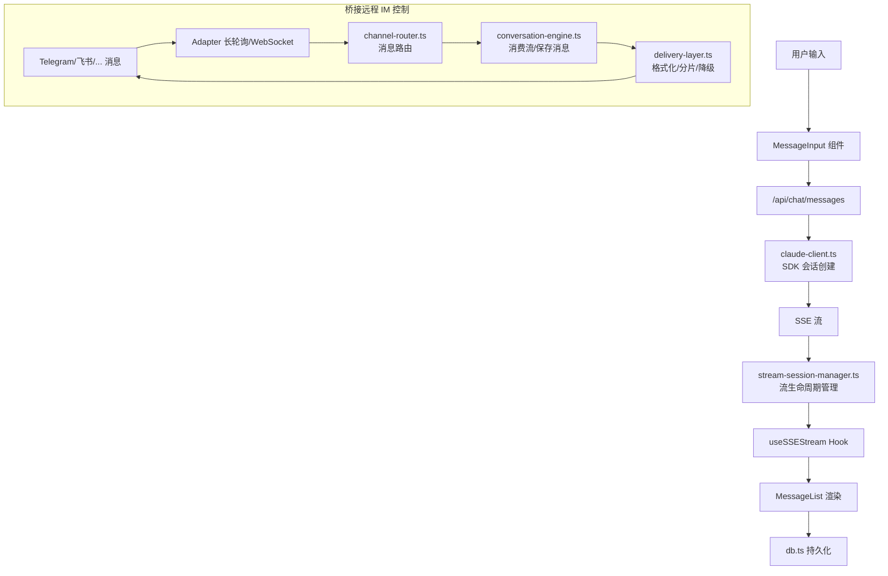
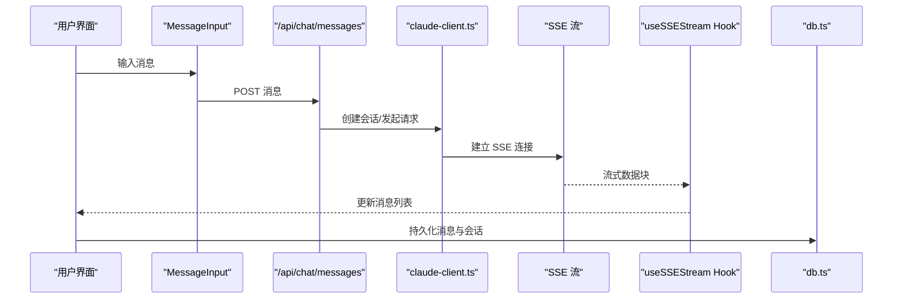
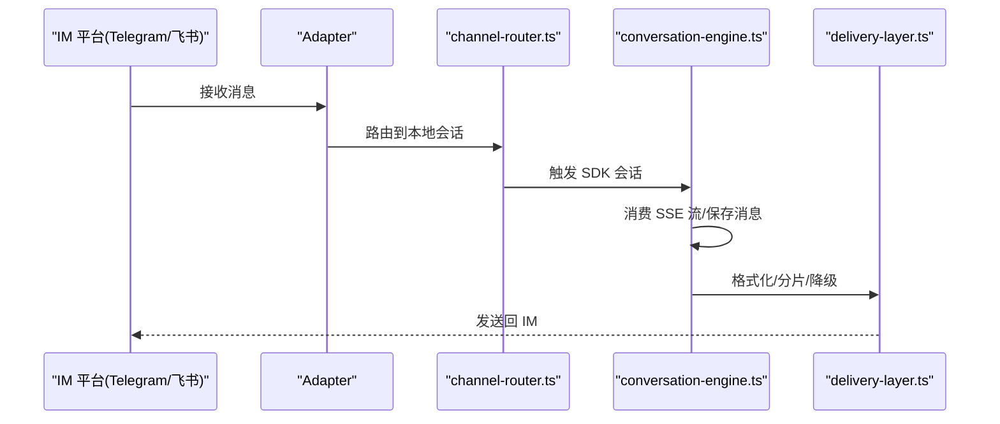
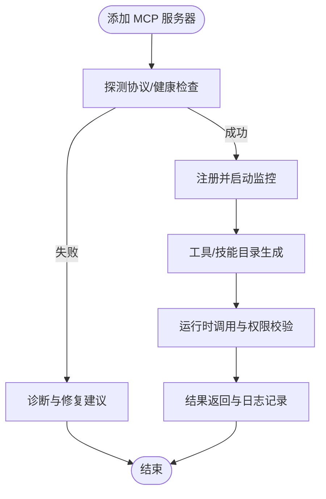
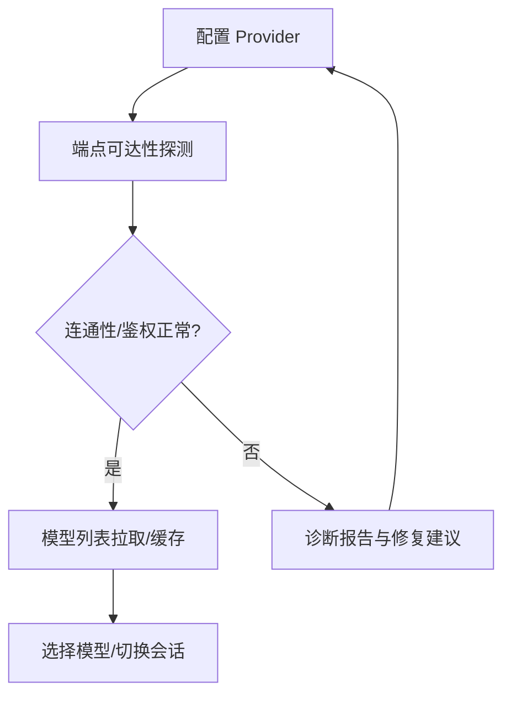
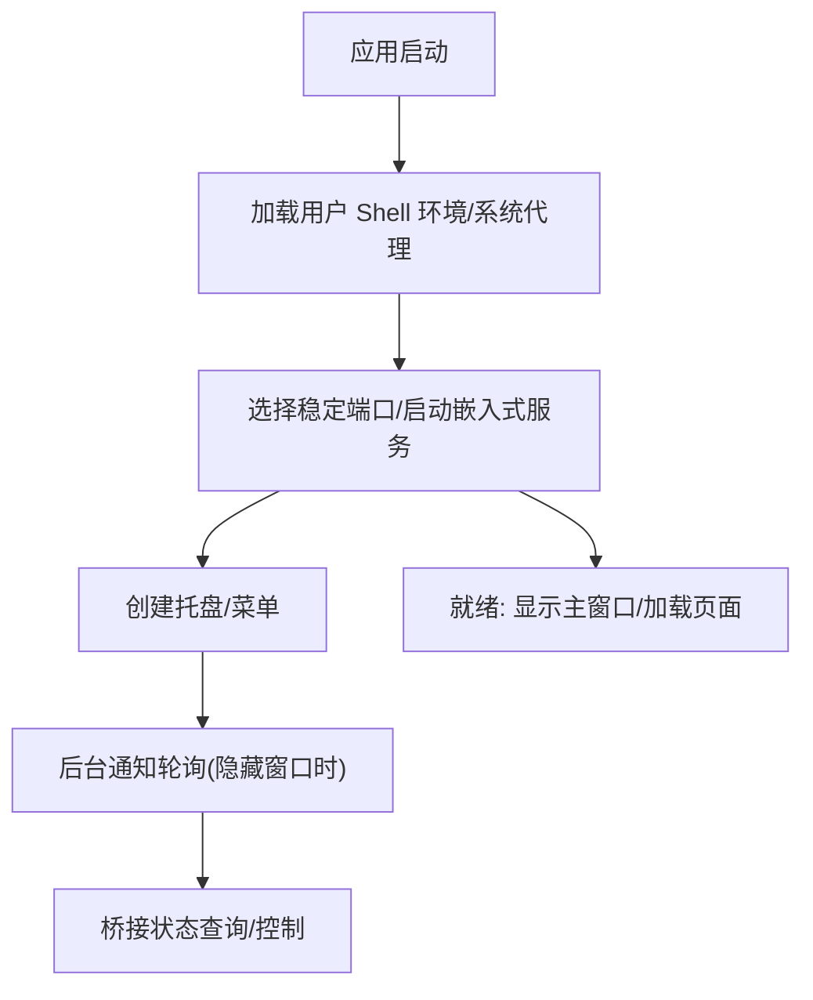
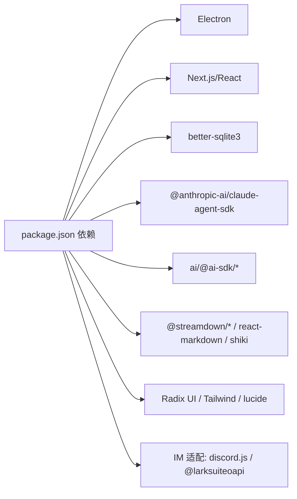

# 项目概述

<cite>
**本文引用的文件**   
- [README.md](file://README.md)
- [ARCHITECTURE.md](file://ARCHITECTURE.md)
- [package.json](file://package.json)
- [electron/main.ts](file://electron/main.ts)
- [src/app/layout.tsx](file://src/app/layout.tsx)
- [docs/handover/bridge-system.md](file://docs/handover/bridge-system.md)
- [docs/guardrails/MCP.md](file://docs/guardrails/MCP.md)
- [docs/guardrails/ProviderManagement.md](file://docs/guardrails/ProviderManagement.md)
- [docs/research/chat-sdk-integration-feasibility.md](file://docs/research/chat-sdk-integration-feasibility.md)
</cite>

## 目录
1. [简介](#简介)
2. [项目结构](#项目结构)
3. [核心组件](#核心组件)
4. [架构总览](#架构总览)
5. [详细组件分析](#详细组件分析)
6. [依赖关系分析](#依赖关系分析)
7. [性能考量](#性能考量)
8. [故障排查指南](#故障排查指南)
9. [结论](#结论)
10. [附录](#附录)

## 简介
CodePilot 是一款“多模型 AI Agent 桌面客户端”，旨在成为开发者与用户的通用智能助手。它支持接入 17+ AI 提供商（含云平台、本地自托管、自定义兼容端点），具备“远程桥接控制”（Telegram/飞书/微信等）与“MCP 协议扩展”能力，并提供“助理工作空间”“生成式 UI”“媒体工坊”“任务调度”等生产力特性。项目以 Electron 为外壳，Next.js App Router 作为前端与 API 层，采用 better-sqlite3 实现本地持久化，通过 Claude Agent SDK 与 AI 服务交互。

面向初学者，CodePilot 的核心价值在于“统一入口、即插即用、可远程控制、可扩展技能”。对于有经验的开发者，它提供了清晰的分层架构、可观测的数据流、完善的桥接与权限治理、以及可复用的工具与 MCP 扩展机制。

## 项目结构
项目采用“多工作区/多应用”的组织方式，核心目录与职责如下：
- electron：Electron 主进程与预加载脚本，负责窗口、托盘、系统通知、本地代理与环境注入、嵌入式 Next.js 服务器生命周期管理等。
- src/app：Next.js App Router 页面与 API 路由，覆盖聊天、设置、桥接、插件、画廊、技能等。
- src/components：按功能域划分的 React 组件库（UI、聊天、布局、桥接、设置、项目、画廊等）。
- src/lib：核心业务逻辑与基础设施（数据库、SDK 客户端、流会话管理、文件系统、桥接子系统、通道插件、远程合约、Provider 诊断、错误分类、主题与国际化等）。
- src/hooks：自定义 React Hooks（如 SSE 流订阅、设置、通知轮询、面板状态等）。
- src/types：全业务类型定义（会话、消息、MCPServerConfig 等）。
- docs：设计决策、交接文档、执行计划、研究与风险控制文档（如桥接系统、MCP、Provider 管理、Runtime 等）。
- themes：主题资源与变体。
- apps/site：独立的站点应用（文档与营销内容），与桌面客户端并行维护。

图表来源
- [electron/main.ts:1-800](file://electron/main.ts#L1-L800)
- [ARCHITECTURE.md:5-53](file://ARCHITECTURE.md#L5-L53)

章节来源
- [ARCHITECTURE.md:5-53](file://ARCHITECTURE.md#L5-L53)
- [package.json:1-157](file://package.json#L1-L157)

## 核心组件
- 多提供商支持：内置对多家主流与本地模型的接入能力，支持 Endpoint 校验、诊断与自动修复；提供模型发现与选择、权限控制与按次审批等安全机制。
- MCP 协议扩展：支持 stdio/SSE/HTTP 三种 MCP 服务器接入，具备运行时监控与事件追踪，便于扩展工具与技能生态。
- 远程桥接控制：通过 IM 适配器（Telegram、飞书等）实现“手机发消息、桌面响应”的远程控制体验，内置权限请求、消息分片与速率限制。
- 生成式 UI 与媒体工坊：AI 可直接生成可视化仪表盘与交互控件；支持批量图像生成、画廊与标签管理。
- 助理工作空间：Persona 文件（soul/user/claude/memory）、每日签到、长期记忆与持久化状态。
- 任务调度：基于 cron 与间隔的任务调度，具备持久化与可观测性。
- 本地持久化：SQLite（WAL 模式）+ 本地目录，所有数据驻留本地，保障隐私与离线可用。

章节来源
- [README.md:36-141](file://README.md#L36-L141)
- [ARCHITECTURE.md:100-141](file://ARCHITECTURE.md#L100-L141)
- [docs/guardrails/ProviderManagement.md](file://docs/guardrails/ProviderManagement.md)
- [docs/guardrails/MCP.md](file://docs/guardrails/MCP.md)

## 架构总览
整体架构以 Electron 为外壳，Next.js App Router 作为前端与 API 层，better-sqlite3 提供本地持久化，Claude Agent SDK 作为统一的 AI 交互通道。数据流从用户输入到消息发送、SDK 流处理、流会话管理、渲染与持久化形成闭环；桥接子系统将外部 IM 与本地会话打通，形成“远程控制”闭环。

图表来源
- [ARCHITECTURE.md:55-77](file://ARCHITECTURE.md#L55-L77)
- [electron/main.ts:137-191](file://electron/main.ts#L137-L191)

章节来源
- [ARCHITECTURE.md:55-77](file://ARCHITECTURE.md#L55-L77)
- [electron/main.ts:137-191](file://electron/main.ts#L137-L191)

## 详细组件分析

### 组件一：聊天与会话（数据流）
- 用户输入经 MessageInput 组件提交至 /api/chat/messages。
- 由 claude-client.ts 创建 SDK 会话，触发 SSE 流。
- stream-session-manager.ts 管理流生命周期，useSSEStream Hook 订阅并驱动 UI 更新。
- 最终消息与会话元数据写入 SQLite。

图表来源
- [ARCHITECTURE.md:55-66](file://ARCHITECTURE.md#L55-L66)

章节来源
- [ARCHITECTURE.md:55-66](file://ARCHITECTURE.md#L55-L66)

### 组件二：远程桥接（IM 通道）
- 适配器层负责长轮询/WS 接收消息，channel-router 将消息路由到本地会话。
- conversation-engine 消费 SDK SSE 响应，delivery-layer 负责格式化、分片与速率限制。
- 支持权限请求以 IM 内联按钮形式呈现，Markdown 到各渠道 IR 的转换由专用模块完成。

图表来源
- [ARCHITECTURE.md:68-77](file://ARCHITECTURE.md#L68-L77)
- [docs/handover/bridge-system.md](file://docs/handover/bridge-system.md)

章节来源
- [ARCHITECTURE.md:68-77](file://ARCHITECTURE.md#L68-L77)
- [docs/handover/bridge-system.md](file://docs/handover/bridge-system.md)

### 组件三：MCP 与技能系统
- 支持 stdio/SSE/HTTP MCP 服务器接入，运行时具备监控与事件追踪。
- 技能（skills）可自定义或从 marketplace 安装，与内置工具协同工作。
- MCP 与内置工具在统一的权限与安全边界内运行，避免越权操作。

图表来源
- [docs/guardrails/MCP.md](file://docs/guardrails/MCP.md)

章节来源
- [docs/guardrails/MCP.md](file://docs/guardrails/MCP.md)

### 组件四：Provider 管理与诊断
- 提供多种提供商接入方式（直连 API、云平台、本地/自托管、自定义兼容端点）。
- 内置诊断探针与自动修复动作，帮助快速定位网络、认证与配置问题。
- 支持模型发现与选择、默认模型保护、端点清洗与校验。

图表来源
- [docs/guardrails/ProviderManagement.md](file://docs/guardrails/ProviderManagement.md)

章节来源
- [docs/guardrails/ProviderManagement.md](file://docs/guardrails/ProviderManagement.md)

### 组件五：桌面外壳与运行时（Electron）
- 主进程负责托盘、系统通知、隐藏窗口时的后台通知轮询、嵌入式 Next.js 服务器生命周期、系统代理与环境注入、终端管理等。
- 采用稳定端口范围避免 localStorage 跨重启丢失，提升用户体验一致性。
- 对 better-sqlite3 的原生模块 ABI 进行运行前校验，降低打包后崩溃风险。

图表来源
- [electron/main.ts:500-800](file://electron/main.ts#L500-L800)

章节来源
- [electron/main.ts:500-800](file://electron/main.ts#L500-L800)

## 依赖关系分析
- 技术栈选择理由
  - Electron：提供跨平台桌面能力与系统集成功能（托盘、通知、原生窗口、系统代理）。
  - Next.js App Router + React：现代前端开发范式，路由与 API 统一，SSR/静态优化与开发体验兼顾。
  - better-sqlite3：高性能本地数据库，WAL 模式支持并发读取，适合桌面应用的本地持久化。
  - Claude Agent SDK：统一的 AI 交互通道，支持 SSE 流式输出与工具调用。
  - 辅助库：ai、@ai-sdk/*、@streamdown/*、react-markdown、shiki、recharts、Radix UI/Tailwind 等，分别用于多提供商 SDK、流式渲染、Markdown/代码高亮、可视化与 UI 基础设施。
- 依赖耦合与内聚
  - 前后端通过 Next.js API 路由解耦，Electron 主进程仅负责系统与服务生命周期，保持 UI 与业务逻辑的清晰边界。
  - 桥接子系统通过适配器与通道插件抽象，实现 IM 平台的可插拔扩展。
  - Provider 与 MCP 通过统一的权限与安全边界，降低越权与误用风险。

图表来源
- [package.json:48-117](file://package.json#L48-L117)

章节来源
- [package.json:48-117](file://package.json#L48-L117)
- [ARCHITECTURE.md:169-183](file://ARCHITECTURE.md#L169-L183)

## 性能考量
- 本地持久化：SQLite（WAL）+ 本地目录，减少网络往返，提升离线可用性与启动速度。
- 嵌入式服务与稳定端口：避免每次启动端口变化导致的 localStorage 重置，提升状态一致性与启动稳定性。
- SSE 流式渲染：消息增量更新，降低 UI 重绘成本，提升交互流畅度。
- 主进程后台通知轮询：在隐藏窗口时仍保持通知能力，避免重复投递，兼顾体验与资源消耗。
- 代码高亮与 Markdown 渲染：采用 Shiki 与 streamdown，兼顾性能与可读性。

章节来源
- [ARCHITECTURE.md:79-99](file://ARCHITECTURE.md#L79-L99)
- [electron/main.ts:388-499](file://electron/main.ts#L388-L499)

## 故障排查指南
- Provider 无模型显示
  - 检查 API Key 有效性与端点可达性；部分平台（Bedrock/Vertex）需额外环境变量或 IAM 配置；使用内置诊断工具进行连通性检查。
- macOS 首次启动 Gatekeeper 提示
  - 右键打开或通过隐私与安全设置允许；也可通过命令行清除属性后重新打开。
- Windows SmartScreen 阻止安装
  - 在 SmartScreen 提示中选择“更多信息”后“仍要运行”；或调整系统设置允许来自任何地方的应用。
- 何时需要 Claude Code CLI
  - 若需文件编辑、终端命令与 Git 操作，建议安装；基础聊天与助手功能无需 CLI。
- 开发模式差异
  - npm run dev 仅启动 Next.js；npm run electron:dev 启动完整桌面应用（含主进程与嵌入式服务）。

章节来源
- [README.md:154-236](file://README.md#L154-L236)

## 结论
CodePilot 以“统一入口、即插即用、远程可控、可扩展技能”为核心设计理念，结合 Electron 与 Next.js 的现代桌面开发范式，构建了具备强大 AI 集成能力与良好用户体验的多模型 Agent 客户端。其分层清晰、可观测性强、安全边界明确，既适合初学者快速上手，也为高级用户与开发者提供了深入定制与扩展的空间。

## 附录
- 使用场景示例
  - 远程办公：通过飞书/Telegram 发消息，桌面端即时回复，实现“手机发消息、电脑响应”的高效协作。
  - 编程助理：在聊天中选择“代码模式”，结合本地文件与终端能力，进行代码审查、重构与调试。
  - 媒体创作：使用图像生成技能批量产出素材，配合标签与画廊进行管理与复用。
  - 日常规划：通过助理工作空间记录每日签到与长期记忆，结合任务调度完成周期性工作。
- 最佳实践建议
  - Provider 管理：优先使用官方预设，按需配置自定义端点；定期运行诊断，确保连通性与鉴权正确。
  - MCP 与技能：遵循最小权限原则，先在测试环境中验证工具与技能，再推广到生产会话。
  - 桌面体验：启用稳定端口与本地持久化，避免频繁重启导致的状态丢失；合理使用主题与暗色模式，减少视觉疲劳。
  - 安全与合规：严格控制工具调用与权限审批，定期审计日志与会话历史，确保敏感信息不外泄。