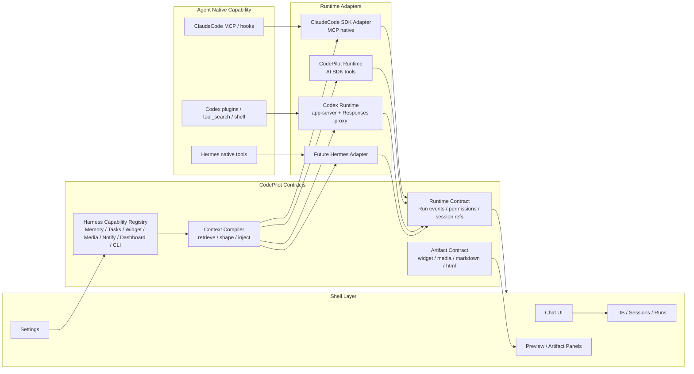

# Phase 5d — Harness Capability Contract / 新 Runtime 接入规范

> 创建：2026-05-16
> 最后更新：2026-05-19
> 状态：✅ 已完成并归档。Phase 0-5 已落地；原 Phase 6 Codex Account Harness 议题已并入 [Phase 5e Runtime Harness Architecture](./phase-5e-runtime-harness-architecture.md) 的 provider-aware Settings / 诚实降级收口。
> 关系：承接 [Phase 5c CodePilot Tool Bridge](./phase-5c-codex-tool-bridge.md)，负责把这次 Codex 接入沉淀成跨 Runtime 的能力契约和下一次 Agent 接入规范。

## 状态

| Phase | 内容 | 状态 | 备注 |
|---|---|---|---|
| Phase 0 | 事实审计：现有 Runtime / Harness / Artifact 边界 | ✅ 2026-05-16 | 抽查锁住的事实：widget/memory/tasks/media/dashboard/cli 七个 capability、三 Runtime 暴露映射、漂移点（widget×3 → de-drifted；memory/notify tech-debt 已记录） |
| Phase 1 | Harness Capability Registry | ✅ 2026-05-16 | `src/lib/harness/capability-contract.ts` 已建；7 个 capability 全部入册，Widget+memory+tasks+image+media live，dashboard+cli deferred。Widget JSON 示例已 round-trip 校验 |
| Phase 2 | Context Compiler 边界 | ✅ 2026-05-17（已过 Codex review） | 子计划 [phase-5d-phase-2-context-compiler.md](./phase-5d-phase-2-context-compiler.md)；compiler + ledger + 三 Runtime 整体落地；2576/2576 tests pass。Review 修复点：(1) ClaudeCode/Native 在无 base systemPrompt 时仍注入 compiler prompt；(2) Native `codepilot-media` 同时启用 `media_import + image_generation`。 |
| Phase 3 | Runtime Capability Adapters | ✅ 2026-05-17（已过 Codex review；含 review fix #1） | `src/lib/harness/runtime-adapter.ts` 三 facade（`adaptForClaudeCode/Native/CodexProxy`）；三入口禁直引 compileContext；Phase 2 review invariants 钉为结构性约束（string-always shape + Native media 双 capability）。**Review fix #1（2026-05-17）**：unified-adapter.ts 之前仍用本地 `BUILTIN_BRIDGE_STEP_LIMIT` 常量 + 直传 `bridge.toolNames`，让 adapter 的 `stopWhen / stepCount / builtinToolNames` 字段半死；现已 `PathInput` 接 `adapted.*`，常量单源回 compiler 的 `CODEX_BRIDGE_STEP_LIMIT`。`harness-runtime-adapter.test.ts` 34 pins 全绿。 |
| Phase 4 | Artifact Contract | ✅ 2026-05-17（已过 Codex review；含 review fix #2 + P2） | `src/lib/harness/artifact-contract.ts` registry 覆盖 11 类产物（widget/malformed_widget/media/file_diff_summary/inline_diff/inline_jsx/markdown/html/json/table/error）；fence/SSE/PreviewSource 三类 source descriptor + parser/renderer 模块路径 + canonical example。**Review fix #2（2026-05-17）**：拆原 `diff` entry 成 `file_diff_summary`（SSE → DiffSummary）+ `inline_diff`（PreviewSource → DiffViewer）；补 `inline_jsx`（PreviewSource → SandpackPreview）。**Review fix P2（2026-05-17）**：`relatedCapability: string \| null` 改为 `relatedCapabilities: readonly string[]`，`media` 关联 `[image_generation, media_import]`，`artifactsForCapability` 用 `includes`。`harness-artifact-contract.test.ts` 22 pins 全绿（含 PreviewSource union 完整性反向 pin）。 |
| Phase 5 | 新 Agent Runtime 接入 Playbook | ✅ 2026-05-17 | [docs/handover/new-runtime-playbook.md](../../handover/new-runtime-playbook.md) + [docs/insights/new-runtime-playbook.md](../../insights/new-runtime-playbook.md) 落地；7 步硬性流程（schema snapshot → capability inventory → adapter facade → artifact contract → **contract tests gate** → 9 项 smoke matrix → UI 可见性）；禁止 live-smoke-driven patching；7 条反模式来自 slice 1-6 真实事故 |
| Phase 6 | Codex Account native path 接 Harness + Dashboard Codex bridge | ✅ 2026-05-18（归入 Phase 5e） | 子计划 [phase-5d-phase-6-codex-account-harness.md](./phase-5d-phase-6-codex-account-harness.md) 保留为历史 backlog；实际收口在 [Phase 5e](./phase-5e-runtime-harness-architecture.md)：codex_account provider-aware matrix、Settings 能力清单、Codex 不支持能力诚实降级已经落地。Dashboard / CLI / assistant_buddy 不再作为 Phase 5 阻塞项，后续要变可执行能力需按 Harness Capability Contract 新开 slice。 |

## 为什么单独立计划

Codex 接入持续三天不是正常状态。问题不只是 Codex 单点，而是现有 Runtime 重构只把外层壳拆开了：

- `AgentRuntime` 现在是很薄的接口：`stream()` / `interrupt()` / `isAvailable()` / `dispose()`。
- `RuntimeRunEvent` / `RuntimePermissionEvent` 已经把 UI 消费面统一成 canonical events。
- 但 CodePilot 自己的 Harness 能力仍散在 ClaudeCode MCP、Native AI SDK tools、Codex proxy bridge、prompt 字符串、renderer parser 和 smoke 文档里。

这导致新增 Codex 时不只是“接一个 Runtime adapter”，而是在现场补：

- provider proxy
- tool bridge
- media import
- widget wire-format
- settings / model 兼容
- side-channel SSE
- artifact render path

如果下一次接 Hermes 还沿用这个方式，会再次变成 live-smoke-driven patching。

## 当前事实基线

以下是 2026-05-16 抽查后的代码事实，后续计划不能和这些事实冲突。

| 层 | 当前事实 | 主要路径 |
|---|---|---|
| Runtime 外壳 | `AgentRuntime` 只定义 `stream/interrupt/isAvailable/dispose`，注释明确“不抽象 tools/messages/permissions” | `src/lib/runtime/types.ts` |
| Runtime id | 目前已有 `claude_code` / `codepilot_runtime` / `codex_runtime` 三个 canonical id | `src/lib/runtime/runtime-id.ts` |
| Canonical events | `RuntimeRunEvent` 有 8 个主事件 + `unknown_item`；`tool_completed` 已支持 `media` | `src/lib/runtime/contract.ts` |
| ClaudeCode Harness | 内置能力通过 in-process MCP server 注册，按关键词 / workspace / always 动态挂载 | `src/lib/claude-client.ts`、`src/lib/*-mcp.ts` |
| Native Harness | 内置能力通过 AI SDK `ToolSet` 注册，聚合在 `getBuiltinTools()` | `src/lib/builtin-tools/index.ts` |
| Codex Bridge | 非 `codex_account` provider 走 Responses proxy；CodePilot 内置工具在 proxy 内 `streamText({ tools, stopWhen })` 执行，并通过 per-session event bus 回 SSE | `src/lib/codex/proxy/unified-adapter.ts`、`src/lib/codex/proxy/builtin-bridge.ts`、`src/lib/codex/proxy/builtin-event-bus.ts` |
| Codex native tools | Codex `custom/namespace/tool_search/local_shell/web_search/image_generation` 等 non-function tools 目前只分类进 `passthroughTools`，不在 CodePilot proxy 内执行 | `src/lib/codex/proxy/parse-request.ts` |
| Widget 原设计 | Widget 是 MCP `codepilot_load_widget_guidelines` 加载规范，最终模型输出 `show-widget` fence，前端 parser 渲染 | `src/lib/widget-guidelines.ts`、`src/components/chat/MessageItem.tsx` |
| Artifact 前端 | Phase 4 已让 Markdown / HTML / inline Artifact 大体脱离 Runtime，按 PreviewSource / trust tier / sandbox 渲染 | `src/components/layout/panels/PreviewPanel.tsx` |

### 第一轮事实审计提醒

- 不要只看注释判断 gating。Native `src/lib/builtin-tools/index.ts` 里多组工具目前 `condition: 'always'`，但邻近注释仍写着 keyword-gated；Phase 0 必须以实际 `condition` 和调用路径为准。
- `codepilot_import_media` 在 ClaudeCode 路径并非 unsupported：`src/lib/media-import-mcp.ts` 暴露 `createMediaImportMcpServer()`，`src/lib/claude-client.ts` 在 media keyword 命中时同时注册 `codepilot-media` 和 `codepilot-image-gen`。任何能力矩阵若把 media import 标成 ClaudeCode unsupported，都是事实错误。
- `image_generation` 和 `media_import` 在 ClaudeCode 路径共享 media prompt / media result marker 的实际行为，需要和 Native / Codex 的 `MediaBlock` 行为分开描述，不能用一个笼统 “media works” 覆盖。

## 现在已经解耦的部分

1. **Shell 与基础 Runtime 输出面**
   - Chat UI 大部分消费 SSE / canonical-ish 事件，不直接知道 Codex app-server 细节。
   - Settings / Runtime picker / Model picker 已开始用 `RuntimeId` 和兼容矩阵。

2. **Session ref 与 runtime metadata**
   - `RuntimeSessionRef` 已经支持每个 runtime 保存自己的 opaque token。
   - Codex thread id 已进入独立存储路径。

3. **Artifact 渲染**
   - Markdown / HTML / inline artifact 的 trust / sandbox / refresh 逻辑主要在前端 artifact 层，不依赖 ClaudeCode。

4. **Codex provider proxy 的协议层**
   - Responses request / stream / error / resume params 已有 handover 文档和部分 contract test。

## 还没有解耦的部分

1. **Harness Capability 不是单一来源**
   - 同一个能力在 MCP / Native builtin-tools / Codex bridge 里可能有三份工具 schema、三份 prompt、三份返回格式。
   - Widget 已经出现过三份 prompt drift。

2. **Context 注入不是统一 Compiler**
   - system prompt append、tool descriptions、memory prompt、widget guidelines、runtime-specific bridge prompt 分散在多个入口。
   - 现在是“各 Runtime 自己拼”，不是“统一 fragments → 按 Runtime 编译”。

3. **Agent native capability 与 CodePilot capability 边界不清**
   - Codex 自带 plugins / namespace / shell / tool_search。
   - ClaudeCode 自带 MCP / hooks。
   - 未来 Hermes 也会有自己的 tools。
   - 目前没有统一规则说明：同名工具冲突谁优先、原生工具是否透传、CodePilot 内置能力是否必须覆盖。

4. **Artifact Contract 还不够结构化**
   - Media 已经比较接近 `MediaBlock`。
   - Widget 仍依赖文本 fence，虽然这是原设计，但缺少统一的 prompt-example-parser-renderer contract。
   - Dashboard / CLI tools 这类写操作还没有跨 Runtime permission contract。

## 目标架构

## 详细拆解

### Phase 0 — 事实审计

目标：把现有能力和 runtime 接入点列清楚，先不改行为。

检查项：

- `src/lib/builtin-mcp-catalog.ts` 是否覆盖所有 in-process MCP。
- `src/lib/builtin-tools/index.ts` 是否覆盖同一批能力，哪些是 always / workspace / keyword gated。
- `src/lib/codex/proxy/builtin-bridge.ts` 是否覆盖同一批能力，哪些 deferred。
- `src/lib/claude-client.ts` 的动态 MCP 注册是否仍是事实来源。
- `src/components/chat/MessageItem.tsx` / `StreamingMessage.tsx` 的 artifact parser 是否有统一 contract。

产物：

- 一张 capability matrix。
- 每项标记：`live` / `partial` / `deferred` / `unsupported`。
- 每项列出 ClaudeCode / Native / Codex 三条路径。

### Phase 1 — Harness Capability Registry

目标：建立单一能力目录，不再靠三处 prompt/schema 各自发挥。

每个 capability descriptor 至少包含：

- `id`
- `toolNames`
- `promptFragment`
- `inputSchema`
- `resultShape`
- `canonicalEvents`
- `uiArtifactType`
- `runtimeExposure`
- `securityBoundary`
- `smokeScenarios`

优先能力：

- Widget
- Media / image generation
- Memory
- Tasks / notifications
- Dashboard
- CLI tools
- Session search / ask-user-question 如确认属于 Harness，也纳入清单

明确不做：

- 不在此阶段改用户可见行为。
- 不把 Codex native plugins 强行纳入 CodePilot Harness；它们属于 Agent Native Capability。

### Phase 2 — Context Compiler

目标：把“注入什么”从各 Runtime 的实现中抽出来。

输入：

- 用户 prompt
- workspace
- session history
- selected runtime
- capability registry
- model/provider compat
- token budget / context budget

输出：

- system/developer prompt fragments
- tool schemas
- MCP server list
- bridge tool list
- deferred tool discovery hints
- artifact parser reminders

关键规则：

- 同一 capability 的 prompt fragment 必须同源。
- Runtime-specific wrapper 可以存在，但不能改变语义。
- 长 guidelines 继续按需加载，不要全部塞 system prompt。

### Phase 3 — Runtime Capability Adapters

目标：每个 Runtime 只负责把 registry 的 capability 映射到自己的执行方式。

| Runtime | 适配方式 |
|---|---|
| ClaudeCode | in-process MCP server / SDK MCP |
| CodePilot Runtime | AI SDK `ToolSet` |
| Codex Runtime | Responses proxy bridge + side-channel event bus |
| Hermes / future | 按对方 SDK/协议实现 adapter，不改 Shell |

要求：

- 新 Runtime 接入时必须先跑 capability contract tests。
- 不允许先 live smoke 再补字段。
- Agent native tools 走独立 passthrough / native capability adapter，不和 CodePilot Harness 混用。

### Phase 4 — Artifact Contract

目标：前端只按 artifact type 渲染，不按 Runtime 猜。

统一 block：

- `media`
- `widget`
- `markdown`
- `html`
- `diff`
- `json`
- `table`
- `error`

Widget 特别要求：

- 保留原 MCP + `show-widget` 设计。
- `show-widget` 示例必须能 `JSON.parse`。
- `parseAllShowWidgets()` 对 canonical example 必须返回 widget。
- malformed path 继续可见，不静默吞。
- 如果未来新增结构化 `widget_created` tool，只能作为增强，不替代原 MCP 语义，除非另有产品决策。

### Phase 5 — 新 Runtime 接入 Playbook

目标：下次接 Hermes 不再重走 Codex 三天救火。

固定流程：

1. snapshot 目标 Agent 的 schema / SDK / protocol fixtures。
2. 填 Runtime Capability Inventory。
3. 填 Harness Capability support matrix。
4. 实现 `AgentRuntime` adapter。
5. 实现 capability adapter。
6. 跑 contract tests。
7. 跑固定 smoke matrix。
8. 只有 smoke 通过才在 UI 标成可用。

固定 smoke matrix：

- 普通一轮聊天
- 两轮 resume
- 文件读写 / file_changed
- 权限请求
- 图片生成 / media render
- Widget
- Memory
- Tasks / notification
- Agent native tool passthrough

## 验收标准

1. 文档层：
   - `docs/handover/` 有 Harness Capability Contract 交接文档。
   - `docs/insights/` 有产品/架构解释：为什么 Codex 三天不正常、以后怎么避免。

2. 代码层：
   - 有 capability registry。
   - 每个 live capability 有三 Runtime support 状态。
   - Widget prompt/guideline 示例可被机器解析验证。
   - Bridge / MCP / Native builtin-tools 不再各自维护互相漂移的 prompt。

3. 测试层：
   - capability matrix contract tests。
   - prompt drift tests。
   - artifact parser contract tests。
   - Runtime adapter smoke fixtures。

4. 产品层：
   - Settings 可以展示某个 Runtime 下 CodePilot Harness 能力是否可用。
   - 不可用能力有明确原因，不再让模型自己猜 CLI / auth.json / npm install。

## 不做

- 不在本计划里继续扩 Codex provider proxy 的翻译器。
- 不在本计划里完成 Hermes 接入。
- 不把 Codex native plugins 伪装成 CodePilot built-in tools。
- 不把所有 memory / dashboard 内容塞进 system prompt。
- 不改变用户已有 Widget `show-widget` 语义。

## 决策日志

- 2026-05-16: 单独立 Phase 5d。原因：Codex 接入暴露的是 Harness 能力层缺失，不是单个 Runtime bug。ClaudeCode 当前的 5c slice 可以继续修 Codex bridge；本计划负责把修复沉淀成跨 Runtime contract 和未来接入 playbook。
- 2026-05-16: 保留原 Widget MCP 设计。`codepilot_load_widget_guidelines` 仍是规范加载工具，`show-widget` fence 仍是当前渲染入口；短期目标是让 Codex bridge 对齐原稳定语义，而不是强行改成新 `create_widget` 工具。
- 2026-05-16: **Phase 0 + Phase 1 落地**。`src/lib/harness/capability-contract.ts` 建好（7 capabilities × 3 runtimes 暴露图）；Widget JSON 示例从 `\\\"` 双重转义改成单引号 HTML 属性（`JSON.parse` 安全）；Native widget + Codex bridge widget 都通过 TS import re-export 权威 `WIDGET_SYSTEM_PROMPT`，消除 slice 6 暴露的 3 份漂移；契约测试 `harness-capability-contract.test.ts`（21 pins）覆盖 catalog 完整性 / 工具名一致性 / drift 严格检测 / Widget JSON round-trip / media render path / 状态-暴露一致性 / 真实 mount 验证；handover + insights doc 已落地。Native memory + Native tasks 仍存在 prompt drift，已记入 tech-debt 列表（slice 8）。2544 tests pass。
- 2026-05-17: **Phase 2 落地（含两轮 Codex review）**。`src/lib/harness/context-compiler.ts` 纯函数 + `expected-differences.ts` ledger 上线；三 Runtime 入口（claude-client.ts / builtin-tools/index.ts / unified-adapter.ts）切到 `compileContext`；2 个 review-fix（ClaudeCode/Native 在无 base systemPrompt 时仍注入 compiler prompt；Native `codepilot-media` 同时启用 `media_import + image_generation`）已落代码与测试。2576/2576 tests pass。
- 2026-05-17: **Phase 3 落地（待 Codex review）**。`src/lib/harness/runtime-adapter.ts` 三 facade 上线（`adaptForClaudeCode / adaptForNative / adaptForCodexProxy`）；三 Runtime 入口禁直引 `compileContext`，由 facade 单一通道供给 systemPromptAppend / toolSetKeys / builtinToolNames / stopWhen 等运行时配置；Phase 2 review invariants 变为结构性约束（`harness-runtime-adapter.test.ts` 28 pins）。
- 2026-05-17: **Phase 4 落地（待 Codex review）**。`src/lib/harness/artifact-contract.ts` 渲染端 registry（9 类产物 × fence/SSE/PreviewSource 三类 source descriptor）；`harness-artifact-contract.test.ts` 18 pins 守住 parser / renderer 模块路径、canonical example round-trip、widget 跨表 byte-identical、capability ↔ artifact 一致性。
- 2026-05-17: **Phase 5 落地（待 Codex review）**。[docs/handover/new-runtime-playbook.md](../../handover/new-runtime-playbook.md) + [docs/insights/new-runtime-playbook.md](../../insights/new-runtime-playbook.md) 上线；7 步硬性流程（含 Step 5 Contract Tests Gate）+ 7 条反模式（来自 slice 1-6 真实事故）；handover 老 README 中的 6 步精简版指向 playbook 单一权威。
- 2026-05-17: **整体测试基线**。`npm run test`：2625/2625 pass；新增 `harness-runtime-adapter.test.ts`（28 pins）+ `harness-artifact-contract.test.ts`（18 pins）；既有 `harness-capability-contract.test.ts` / `codex-proxy-compiler-message-order.test.ts` 的 source-grep pin 已从"直引 compileContext"迁移到"通过 adapter facade"。
- 2026-05-17: **Phase 5d 整体不收口 + Phase 6 立项**。Phase 3/4 review fix 落地后，Codex review 跑 GPT-5.5/Codex Account smoke 发现 P0 缺口：(1) `provider-proxy.ts:180` `codex_account` 直接 return base，绕过整套 Harness（Context Compiler / Runtime Adapter / Built-in Bridge）；模型在 Codex Account 下从未见过 capability prompt，widget 生成 malformed show-widget + 触发不应有的 fileChange；(2) `dashboard` 在 codex_proxy 仍是 `unsupported`，Codex 下"pin widget 到看板"无工具可调。底线："任何 Runtime 的任何 provider 路径，只要显示为 CodePilot Chat，就必须经过同一套 Harness capability manifest"。决定：Phase 5d 整体状态降级，新增 Phase 6（[phase-5d-phase-6-codex-account-harness.md](./phase-5d-phase-6-codex-account-harness.md)），fixture-first 抓 Codex app-server 协议 schema 后再设计注入方案（A 走 codepilot_proxy / B turn/start input system-item / C thread/start instructions / 或 partial + UI 显式不可用）；dashboard Codex bridge 与 Codex Account 接入正交，6d 先在 proxy 路径接通。
- 2026-05-17: **Phase 3 review fix #3（P1, approval-bridge idempotency）**。Codex 重复发同一 `codex:${jsonRpcId}` 的 approval RPC 时，pre-fix `createPermissionRequest` INSERT 触发 UNIQUE constraint，catch 只 warn 但仍继续 SSE emit + `registerPendingPermission` 覆盖 in-memory waiter，导致用户看到双 prompt，点 Deny 一个后另一个 `/api/chat/permission` 返回 409 ALREADY_RESOLVED。修复：`approval-bridge.ts:handleCodexApprovalRequest` 在 `createPermissionRequest` 之前先 `getPermissionRequest(requestId)` 短路——已 resolved → `decodeStoredPermission` 回放存储的 decision 给 Codex；仍 pending → 返回 deny（"Duplicate approval pending"）避免悬挂 + 二次 prompt。新增 `decodeStoredPermission` 导出 + `codex-approval-bridge.test.ts` 13 个 idempotency pin（6 个 decode 形状 + 5 个 source-grep 顺序 + duplicate 短路覆盖 both branches）。
- 2026-05-17: **Phase 3/4 review fix（已过 Codex review）**。Review 指出两个 P1 + 一个 P2，逐项修复：
  - **P1 #1**：unified-adapter.ts 之前仍用本地 `BUILTIN_BRIDGE_STEP_LIMIT` 常量 + 直传 `bridge.toolNames`，让 adapter 的 `stopWhen / stepCount / builtinToolNames` 字段半死。修复：`PathInput` 增加 `stopWhen / stepCount` 字段，stream/nonStream path 用 `adapted.stopWhen === 'stepCountIs' ? stepCountIs(adapted.stepCount) : undefined`；suppression set 改用 `adapted.builtinToolNames`；本地常量从 unified-adapter.ts 删除，单源放到 `context-compiler.ts` 的 `CODEX_BRIDGE_STEP_LIMIT`。加 5 项 source-pin 测试守护单源（`harness-runtime-adapter.test.ts` "Codex proxy — single source for stop / step / builtin tool names"）。
  - **P1 #2**：artifact-contract.ts 之前的 `diff` entry 实际描述的是 SSE `file_changed`/DiffSummary，遗漏了 `inline-diff`（DiffViewer）和 `inline-jsx`（SandpackPreview）两个 PreviewSource artifact surface。修复：拆 `diff` → `file_diff_summary` + `inline_diff`；新增 `inline_jsx`；加 "PreviewSource union 完整性 pin"（反向扫描 `usePanel.ts` 中所有 `kind: "inline-*"`，每个必须有 ARTIFACT_CONTRACTS entry）。registry 从 9 类扩到 11 类。
  - **P2**：`relatedCapability: string \| null` 改为 `relatedCapabilities: readonly string[]`，`media` 关联 `[image_generation, media_import]`，`artifactsForCapability` 用 `.includes`。加 runtime check pin（`media_import` 和 `image_generation` 都必须解析到 `media`）。
  - 测试基线：`npm run test` **2635/2635 pass**（含一次孤立 SQLite 并发 flake，孤立 retry 通过；本次改动无关）。
